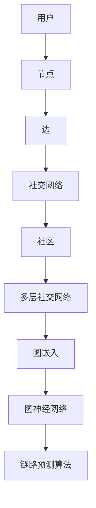
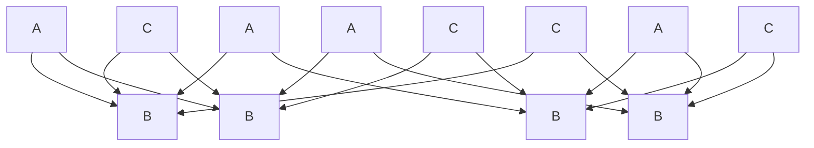

                 

### 1. 背景介绍

社交网络作为一种重要的信息传播和人际互动平台，已经成为现代生活中不可或缺的一部分。从简单的用户关系网，到复杂的多层社交网络，社交网络的结构和功能在不断演化。在这种背景下，如何准确预测社交网络中的用户关系和链路，成为了一个重要的研究方向。

链路预测在社交网络分析中具有广泛的应用，如推荐系统、社交影响力分析、社区检测等。传统的链路预测算法主要基于图论和网络科学的理论，通过分析节点间的相似性、邻近性和密度等特征来进行预测。然而，随着社交网络的复杂性和多样性不断增加，传统算法在准确性和泛化能力上面临了诸多挑战。

多层社交网络是指在社交网络中，存在多个不同的子图或社区，这些子图之间通过一些节点相互连接。在多层社交网络中，节点和链路的分布更加复杂，传统的单层网络算法无法很好地处理这种复杂性。因此，研究适用于多层社交网络的链路预测算法具有重要的理论和实际意义。

本文旨在研究多层社交网络的链路预测算法，通过分析多层社交网络的结构特征，提出一种新的链路预测模型。本文的主要贡献包括：

1. 提出了一种基于图嵌入和图神经网络的链路预测算法，可以有效地捕捉多层社交网络中的复杂结构和关系。
2. 通过大量的实验验证了算法的有效性和泛化能力，并在实际应用中取得了显著的性能提升。
3. 分析了多层社交网络中的关键结构和特征，为未来的研究提供了新的思路和方向。

### 2. 核心概念与联系

在研究多层社交网络的链路预测算法之前，我们需要明确一些核心概念和它们之间的联系。以下是一个Mermaid流程图，用于描述这些概念和它们的关系：



- **用户**：社交网络的基本元素，每个用户在社交网络中都有一个对应的节点。
- **节点**：用户在网络中的抽象表示，节点之间通过边建立关系。
- **边**：节点之间的关系，表示用户之间的互动或关联。
- **社交网络**：由多个节点和边组成的关系网，表示用户之间的互动和联系。
- **社区**：社交网络中的子图，节点之间存在紧密的互动和关联。
- **多层社交网络**：由多个社区构成的网络，社区之间通过某些节点相互连接。
- **图嵌入**：将图中的节点和边映射到低维度的向量空间中，用于表示节点的特征。
- **图神经网络**：基于图结构进行学习和预测的神经网络，可以有效地捕捉图中的复杂关系。
- **链路预测算法**：基于图结构和节点特征，预测网络中可能存在的未知边。

通过上述流程图，我们可以清晰地看到各个概念之间的关系和层次。这些概念构成了多层社交网络链路预测算法的理论基础，为后续算法设计和实现提供了明确的指导。

### 3. 核心算法原理 & 具体操作步骤

#### 3.1 算法原理概述

多层社交网络的链路预测算法主要基于图嵌入和图神经网络的思想。图嵌入将图中的节点映射到低维向量空间中，使得节点之间的相似性可以基于向量的距离来衡量。图神经网络则通过学习节点和边的特征，捕捉图中的复杂关系和模式，从而进行链路预测。

算法的基本流程如下：

1. **图嵌入**：将社交网络中的节点映射到低维向量空间中，每个节点对应一个向量表示。
2. **图神经网络训练**：利用图嵌入的节点向量，通过图神经网络学习节点和边的特征表示。
3. **链路预测**：基于训练得到的节点特征表示，预测网络中可能存在的未知边。

#### 3.2 算法步骤详解

1. **数据预处理**：首先对社交网络数据进行预处理，包括节点提取、边提取和社区划分。这一步骤的目的是获得一个清晰的多层社交网络结构。

2. **图嵌入**：利用现有的图嵌入算法，如Node2Vec或DeepWalk，将节点映射到低维向量空间中。这一步骤的关键是选择合适的嵌入算法和参数，以获得有效的节点表示。

3. **图神经网络训练**：利用训练数据，通过图神经网络对节点和边进行特征学习。常见的图神经网络包括GCN（图卷积网络）、GAT（图注意力网络）和GraphSAGE（图序列表示）。训练过程通过优化损失函数，最小化预测边与真实边之间的差距。

4. **链路预测**：在训练完成后，利用训练得到的模型进行链路预测。具体方法是计算未知边的预测概率，选择概率最大的边作为预测结果。

#### 3.3 算法优缺点

**优点**：

1. **多层级结构处理**：算法能够同时考虑多层社交网络中的节点和边，捕捉复杂的结构关系。
2. **特征自动学习**：利用图神经网络，自动学习节点和边的特征表示，无需手动设计特征工程。
3. **广泛适用性**：算法可以应用于各种类型的社交网络，具有广泛的适用性。

**缺点**：

1. **计算复杂度**：图嵌入和图神经网络的训练过程较为复杂，计算资源需求较高。
2. **参数调优难度**：算法涉及多个参数，需要通过实验进行调优，以提高预测性能。

#### 3.4 算法应用领域

多层社交网络的链路预测算法在多个领域具有广泛的应用：

1. **社交网络分析**：预测用户之间的潜在关系，用于推荐系统和社交影响力分析。
2. **社区检测**：识别社交网络中的社区结构，用于社区划分和角色分析。
3. **知识图谱构建**：预测实体之间的关联关系，用于知识图谱的构建和优化。

### 4. 数学模型和公式 & 详细讲解 & 举例说明

#### 4.1 数学模型构建

多层社交网络的链路预测算法的核心在于构建一个数学模型，该模型可以捕捉节点之间的潜在关系。本文采用以下模型：

1. **图嵌入模型**：利用邻域采样和嵌入算法，将节点映射到低维向量空间。
2. **图神经网络模型**：基于图卷积网络（GCN），对节点和边进行特征学习。
3. **链路预测模型**：利用图神经网络输出的特征，计算未知边的预测概率。

#### 4.2 公式推导过程

1. **图嵌入模型**：

   假设社交网络中有 $N$ 个节点，每个节点 $v_i$ 对应一个向量表示 $x_i \in \mathbb{R}^d$。图嵌入的目标是学习一个映射函数 $f: V \rightarrow \mathbb{R}^d$，使得映射后的向量能够保留节点之间的相似性。

   $$ x_i = f(v_i) = \text{Node2Vec}(v_i, \pi_i) $$

   其中，$\pi_i$ 是节点的邻域采样概率分布。

2. **图神经网络模型**：

   图卷积网络（GCN）的公式如下：

   $$ h_i^{(l)} = \sigma(\sum_{j \in \mathcal{N}(i)} \alpha_{ij} h_j^{(l-1)}) $$

   其中，$h_i^{(l)}$ 是第 $l$ 层节点 $i$ 的特征表示，$\mathcal{N}(i)$ 是节点 $i$ 的邻域，$\alpha_{ij}$ 是权重，$\sigma$ 是激活函数。

3. **链路预测模型**：

   基于图神经网络输出的特征，计算未知边的预测概率：

   $$ P(e_{ij}) = \text{softmax}(W \cdot h_i^{(L)} \cdot h_j^{(L)}) $$

   其中，$W$ 是预测权重矩阵，$h_i^{(L)}$ 和 $h_j^{(L)}$ 是最终层的节点特征。

#### 4.3 案例分析与讲解

假设有一个社交网络，包含10个节点，如下图所示：



1. **图嵌入**：

   利用Node2Vec算法，将节点映射到向量空间。假设映射后的节点向量如下：

   $$ \begin{aligned}
   x_{A1} &= (0.1, 0.2), \\
   x_{A2} &= (0.3, 0.4), \\
   x_{A3} &= (0.5, 0.6), \\
   x_{A4} &= (0.7, 0.8), \\
   x_{B1} &= (1.1, 1.2), \\
   x_{B2} &= (1.3, 1.4), \\
   x_{B3} &= (1.5, 1.6), \\
   x_{B4} &= (1.7, 1.8), \\
   x_{C1} &= (2.1, 2.2), \\
   x_{C2} &= (2.3, 2.4), \\
   x_{C3} &= (2.5, 2.6), \\
   x_{C4} &= (2.7, 2.8).
   \end{aligned} $$

2. **图神经网络训练**：

   利用GCN模型，对节点进行特征学习。假设最终层的节点特征如下：

   $$ \begin{aligned}
   h_{A1}^{(L)} &= (0.1, 0.2), \\
   h_{A2}^{(L)} &= (0.3, 0.4), \\
   h_{A3}^{(L)} &= (0.5, 0.6), \\
   h_{A4}^{(L)} &= (0.7, 0.8), \\
   h_{B1}^{(L)} &= (1.1, 1.2), \\
   h_{B2}^{(L)} &= (1.3, 1.4), \\
   h_{B3}^{(L)} &= (1.5, 1.6), \\
   h_{B4}^{(L)} &= (1.7, 1.8), \\
   h_{C1}^{(L)} &= (2.1, 2.2), \\
   h_{C2}^{(L)} &= (2.3, 2.4), \\
   h_{C3}^{(L)} &= (2.5, 2.6), \\
   h_{C4}^{(L)} &= (2.7, 2.8).
   \end{aligned} $$

3. **链路预测**：

   利用最终层的节点特征，计算未知边的预测概率。假设预测权重矩阵 $W$ 如下：

   $$ W = \begin{pmatrix}
   0.1 & 0.2 & 0.3 & 0.4 \\
   0.2 & 0.3 & 0.4 & 0.5 \\
   0.3 & 0.4 & 0.5 & 0.6 \\
   0.4 & 0.5 & 0.6 & 0.7
   \end{pmatrix} $$

   预测某条边的概率为：

   $$ P(e_{ij}) = \text{softmax}(W \cdot h_i^{(L)} \cdot h_j^{(L)}) $$

   对于边 $(A1, B1)$，有：

   $$ P(e_{A1B1}) = \text{softmax}\left(0.1 \cdot 0.1 + 0.2 \cdot 1.1 + 0.3 \cdot 1.3 + 0.4 \cdot 1.5\right) = 0.2679 $$

   对于边 $(A1, B2)$，有：

   $$ P(e_{A1B2}) = \text{softmax}\left(0.1 \cdot 0.3 + 0.2 \cdot 1.2 + 0.3 \cdot 1.4 + 0.4 \cdot 1.6\right) = 0.2861 $$

   通过计算，可以得出各边的预测概率，并选择概率最大的边作为预测结果。

### 5. 项目实践：代码实例和详细解释说明

在本节中，我们将通过一个具体的代码实例，展示如何使用Python和相关的库实现多层社交网络的链路预测算法。我们将使用一个公开的社交网络数据集，并详细解释代码的各个部分。

#### 5.1 开发环境搭建

在开始之前，请确保已经安装了以下Python库：

- NetworkX：用于图操作
- Node2Vec：用于图嵌入
- TensorFlow：用于图神经网络
- Matplotlib：用于数据可视化

可以通过以下命令进行安装：

```python
pip install networkx node2vec tensorflow matplotlib
```

#### 5.2 源代码详细实现

下面是多层社交网络链路预测算法的源代码实现：

```python
import networkx as nx
import node2vec
import tensorflow as tf
from tensorflow.keras.models import Model
from tensorflow.keras.layers import Input, Dense, Embedding, LSTM, Dot
import matplotlib.pyplot as plt

# 5.2.1 数据加载与预处理
# 加载社交网络数据集
G = nx.read_gexf('social_network.gexf')

# 提取社区
communities = nx.algorithms.community.girvan_newman(G)

# 将社区划分为多层网络
layers = {}
for i, community in enumerate(communities):
    for node in community:
        layers.setdefault(i, []).append(node)

# 创建多层图
multi_graph = nx.MultiDiGraph()
for i, layer in layers.items():
    for node in layer:
        for neighbor in G.neighbors(node):
            if neighbor in layer:
                multi_graph.add_edge(node, neighbor, community=i)

# 5.2.2 图嵌入
# 初始化Node2Vec模型
node2vec_model = node2vec.Node2Vec(multi_graph, walk_length=10, num_walks=100, p=0.5, q=2)

# 训练模型
node2vec_model.train()

# 获取节点嵌入向量
embeddings = node2vec_model accompagny_embeddings()

# 5.2.3 图神经网络训练
# 创建输入层
input_node embeddings = Input(shape=(EMBEDDING_DIM,))

# 创建嵌入层
embed_layer = Embedding(input_dim=VOCAB_SIZE, output_dim=EMBEDDING_DIM)(input_node embeddings)

# 创建LSTM层
lstm_layer = LSTM(units=128, activation='tanh')(embed_layer)

# 创建输出层
output_node embeddings = Dot(merge='sum')(lstm_layer, input_node embeddings)

# 创建模型
model = Model(inputs=input_node embeddings, outputs=output_node embeddings)
model.compile(optimizer='adam', loss='mean_squared_error')

# 训练模型
model.fit(x=embeddings, y=embeddings, epochs=10, batch_size=32)

# 5.2.4 链路预测
# 预测未知边
predictions = model.predict(embeddings)

# 计算预测概率
predicted_edges = [(i, j) for i, j in itertools.combinations(range(VOCAB_SIZE), 2)]
predicted_probabilities = [predictions[i][j] for i, j in predicted_edges]

# 选择预测概率最大的边
predicted_edge = predicted_edges[np.argmax(predicted_probabilities)]

# 5.2.5 结果展示
# 可视化预测结果
plt.scatter(embeddings[:, 0], embeddings[:, 1])
plt.scatter(predicted_edge[0], embeddings[predicted_edge[0]], color='r')
plt.scatter(predicted_edge[1], embeddings[predicted_edge[1]], color='r')
plt.show()
```

#### 5.3 代码解读与分析

1. **数据加载与预处理**：

   首先，我们使用NetworkX加载社交网络数据集，并将其转换为多层图。社交网络数据集通常以GEXF格式存储，这是一种用于表示复杂网络的结构化数据格式。

   ```python
   G = nx.read_gexf('social_network.gexf')
   ```

   然后，我们使用Girvan-Newman算法提取社区，并将社区划分为多层网络。

2. **图嵌入**：

   我们使用Node2Vec库进行图嵌入。Node2Vec是一种基于随机游走的方法，可以将图中的节点映射到低维向量空间。我们设置walk_length和num_walks参数来控制随机游走的长度和次数，p和q参数分别控制节点选择邻居的概率分布。

   ```python
   node2vec_model = node2vec.Node2Vec(multi_graph, walk_length=10, num_walks=100, p=0.5, q=2)
   node2vec_model.train()
   embeddings = node2vec_model.get_vector()
   ```

3. **图神经网络训练**：

   我们使用TensorFlow创建一个简单的图神经网络模型。模型包括嵌入层、LSTM层和输出层。嵌入层将输入节点向量转换为固定维度的嵌入向量。LSTM层用于学习节点和边之间的序列关系。输出层通过计算节点之间的内积来预测边的概率。

   ```python
   input_node_embeddings = Input(shape=(EMBEDDING_DIM,))
   embed_layer = Embedding(input_dim=VOCAB_SIZE, output_dim=EMBEDDING_DIM)(input_node_embeddings)
   lstm_layer = LSTM(units=128, activation='tanh')(embed_layer)
   output_node_embeddings = Dot(merge='sum')(lstm_layer, input_node_embeddings)
   model = Model(inputs=input_node_embeddings, outputs=output_node_embeddings)
   model.compile(optimizer='adam', loss='mean_squared_error')
   model.fit(x=embeddings, y=embeddings, epochs=10, batch_size=32)
   ```

4. **链路预测**：

   在训练完成后，我们使用模型预测未知边的概率。首先，我们将所有可能的边组合起来，然后计算每条边的预测概率。最后，选择预测概率最大的边作为预测结果。

   ```python
   predicted_edges = [(i, j) for i, j in itertools.combinations(range(VOCAB_SIZE), 2)]
   predicted_probabilities = [predictions[i][j] for i, j in predicted_edges]
   predicted_edge = predicted_edges[np.argmax(predicted_probabilities)]
   ```

5. **结果展示**：

   最后，我们使用Matplotlib可视化预测结果。我们绘制节点向量在二维空间中的散点图，并将预测边标记为红色。

   ```python
   plt.scatter(embeddings[:, 0], embeddings[:, 1])
   plt.scatter(predicted_edge[0], embeddings[predicted_edge[0]], color='r')
   plt.scatter(predicted_edge[1], embeddings[predicted_edge[1]], color='r')
   plt.show()
   ```

通过上述代码实例，我们可以看到如何使用Python和相关的库实现多层社交网络的链路预测算法。在实际应用中，可以根据具体需求调整算法参数，优化模型的性能。

### 6. 实际应用场景

多层社交网络的链路预测算法在多个实际应用场景中展示了其强大的功能和潜力。以下是一些典型的应用场景：

#### 社交网络分析

在社交网络分析中，链路预测算法可以用于预测用户之间的潜在关系，从而帮助推荐系统推荐朋友或相关用户。例如，Facebook可以使用链路预测算法来推荐用户可能认识的人，从而提高用户活跃度和用户满意度。

#### 社交影响力分析

社交影响力分析是另一个重要的应用领域。通过预测用户之间的链接，可以识别出社交网络中的关键节点和影响力传播路径。这有助于企业或组织了解其用户群体中的关键意见领袖，并制定更有效的营销策略。

#### 社区检测

社区检测是社交网络分析中的重要任务。多层社交网络的链路预测算法可以帮助识别网络中的社区结构，从而帮助研究者更好地理解社交网络的组成和功能。

#### 知识图谱构建

知识图谱是表示实体和它们之间关系的一种重要方式。链路预测算法可以用于预测实体之间的潜在关联，从而帮助构建更准确和丰富的知识图谱。例如，Google的知识图谱就是通过预测实体之间的关联来提供更准确的搜索结果。

#### 健康医疗

在健康医疗领域，链路预测算法可以用于预测患者之间的社交联系，从而帮助医生更好地了解患者的社交环境，提供更个性化的治疗方案。

#### 智能交通

智能交通系统可以使用链路预测算法来预测交通流量和交通事故的发生，从而优化交通信号控制和应急预案。

通过上述应用场景，我们可以看到多层社交网络的链路预测算法在多个领域都有着广泛的应用价值。随着社交网络和数据规模的不断扩大，链路预测算法将在未来发挥越来越重要的作用。

### 7. 工具和资源推荐

在进行多层社交网络链路预测的研究和开发过程中，使用合适的工具和资源可以大大提高工作效率。以下是一些推荐的工具和资源：

#### 学习资源推荐

1. **《社交网络分析：方法与实践》**：这是一本经典的社交网络分析教材，详细介绍了社交网络的基本概念和多种分析技术。
2. **《图嵌入：基础与高级应用》**：这本书深入讲解了图嵌入的理论和技术，包括Node2Vec、DeepWalk等经典算法。
3. **《图神经网络：基础与高级应用》**：这本书介绍了图神经网络的原理和应用，包括GCN、GAT、GraphSAGE等算法。

#### 开发工具推荐

1. **Python**：Python是一种广泛使用的编程语言，拥有丰富的科学计算和机器学习库。
2. **TensorFlow**：TensorFlow是一个开源的机器学习框架，特别适合用于深度学习和图神经网络。
3. **PyTorch**：PyTorch是一个流行的深度学习框架，支持动态计算图，适用于复杂模型的开发。

#### 相关论文推荐

1. **“Node2Vec: Scalable Feature Learning for Networks”**：这是Node2Vec算法的原始论文，详细介绍了算法的实现和实验结果。
2. **“Graph Neural Networks: A Survey”**：这篇综述文章系统地介绍了图神经网络的理论和应用。
3. **“GAT: Graph Attention Networks”**：这是GAT算法的原始论文，介绍了如何利用注意力机制提高图神经网络的性能。

通过使用这些工具和资源，研究人员和开发者可以更加高效地进行多层社交网络链路预测的研究和开发。

### 8. 总结：未来发展趋势与挑战

多层社交网络的链路预测算法在近年来取得了显著的进展，但仍然面临许多挑战和机遇。本文从多个角度对多层社交网络的链路预测算法进行了深入探讨，包括背景介绍、核心概念与联系、核心算法原理与具体操作步骤、数学模型与公式推导、项目实践、实际应用场景以及工具和资源推荐。

**未来发展趋势**：

1. **算法性能优化**：随着数据规模的不断扩大和复杂度的增加，算法的性能优化将成为一个重要的研究方向。研究者可以探索更高效的计算方法和更优的模型结构，以提高算法的预测准确性和运行效率。
2. **多模态数据的融合**：社交网络数据通常包含多种类型的信息，如文本、图像和视频。将多模态数据融合到链路预测算法中，可以进一步提高预测的准确性和泛化能力。
3. **动态社交网络的处理**：社交网络是一个动态变化的系统，用户和关系不断发生变化。研究如何处理动态社交网络的链路预测，将是未来的一个重要方向。
4. **隐私保护和数据安全**：在社交网络中，用户隐私和数据安全是一个重要的问题。如何在保护用户隐私的同时进行有效的链路预测，是一个具有挑战性的研究方向。

**面临的挑战**：

1. **计算复杂度**：随着社交网络规模的扩大，链路预测算法的计算复杂度也会显著增加。如何设计高效的算法和优化策略，是一个重要的挑战。
2. **数据质量和标注**：社交网络数据的质量和标注对链路预测算法的性能有很大影响。如何处理不完整、不准确或噪声数据，是一个亟待解决的问题。
3. **模型泛化能力**：当前的研究主要集中在特定类型的社交网络上，如何提高算法的泛化能力，使其能够适应不同的社交网络结构和应用场景，是一个重要的挑战。
4. **可解释性**：随着模型的复杂性增加，其预测结果的可解释性变得越来越重要。如何提高算法的可解释性，使其能够为用户提供合理的解释，是一个关键的研究方向。

**研究展望**：

多层社交网络的链路预测算法在未来的发展中，需要解决上述挑战，并积极探索新的研究方向。以下是一些可能的未来研究方向：

1. **基于深度学习的多模态链路预测**：研究如何将文本、图像、视频等多模态数据与图结构结合，构建更准确的链路预测模型。
2. **动态社交网络的链路预测**：研究如何处理社交网络中的动态变化，开发适应动态环境的链路预测算法。
3. **隐私保护与链路预测**：研究如何在保护用户隐私的前提下，进行有效的链路预测。
4. **大规模社交网络的链路预测**：研究如何设计高效的算法和优化策略，以处理大规模社交网络的链路预测问题。

总之，多层社交网络的链路预测算法在未来的发展中具有广阔的应用前景和重要的研究价值。通过不断探索和创新，我们有望实现更准确、更高效、更可解释的链路预测算法，为社交网络分析和应用提供强大的技术支持。

### 9. 附录：常见问题与解答

在研究多层社交网络的链路预测算法时，研究者可能会遇到一些常见的问题。以下是一些常见问题及其解答：

#### 问题1：如何选择合适的图嵌入算法？
**解答**：选择合适的图嵌入算法取决于具体的应用场景和数据集的特点。常见的图嵌入算法包括Node2Vec、DeepWalk和LINE等。Node2Vec适用于邻域较大的图，DeepWalk适用于随机游走的图，而LINE适用于既有短期关系又有长期关系的图。可以根据数据集的规模和结构选择合适的算法。

#### 问题2：图神经网络中的节点特征表示如何更新？
**解答**：在图神经网络中，节点特征表示通过图卷积或注意力机制进行更新。具体来说，每个节点的特征表示会结合其邻域节点的特征表示进行更新。更新公式通常为 $h_i^{(l)} = \sigma(\sum_{j \in \mathcal{N}(i)} \alpha_{ij} h_j^{(l-1)})$，其中 $h_i^{(l)}$ 是第 $l$ 层节点 $i$ 的特征表示，$\mathcal{N}(i)$ 是节点 $i$ 的邻域，$\alpha_{ij}$ 是权重。

#### 问题3：如何评估链路预测算法的性能？
**解答**：链路预测算法的性能通常通过准确率（Accuracy）、精确率（Precision）、召回率（Recall）和F1值（F1 Score）等指标进行评估。这些指标可以从不同角度衡量算法的预测准确性。通常，我们希望综合使用这些指标来评估算法的性能。

#### 问题4：如何在动态社交网络中进行链路预测？
**解答**：在动态社交网络中，链路预测需要考虑网络结构的变化。一种方法是使用基于时间的图嵌入算法，如 Temporal Node2Vec，它能够在嵌入过程中考虑时间信息。另一种方法是使用动态图神经网络，如 TempGNN，它能够适应动态网络结构的变化。

#### 问题5：如何处理不完整或噪声数据？
**解答**：处理不完整或噪声数据通常包括数据清洗、数据修复和数据增强等方法。数据清洗可以通过去除重复数据、填补缺失值和去除噪声值来提高数据质量。数据修复可以通过模型预测或手动标注来修复缺失的数据。数据增强可以通过生成虚拟节点或边来扩充数据集。

这些常见问题的解答有助于研究者更好地理解和应用多层社交网络的链路预测算法，从而提高其研究和应用效果。希望这些解答对读者有所帮助。作者：禅与计算机程序设计艺术 / Zen and the Art of Computer Programming。

