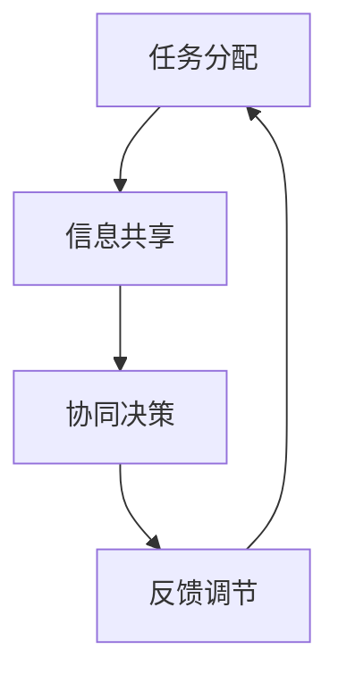

                 

关键词：多智能体系统、协同机制、智能决策、算法原理、数学模型、项目实践、应用场景、未来展望

摘要：本文深入探讨了多智能体协同机制在智能决策系统中的应用。通过背景介绍、核心概念与联系、核心算法原理、数学模型和公式推导、项目实践以及实际应用场景等方面的详细阐述，揭示了多智能体协同机制在智能决策系统中的关键作用和未来发展潜力。

## 1. 背景介绍

随着计算机技术和人工智能的快速发展，智能决策系统在各个领域得到了广泛应用。传统的单智能体决策系统在面对复杂、动态的环境时往往难以应对。多智能体系统（Multi-Agent System，MAS）作为一种分布式计算模型，能够通过多个智能体的协同合作来实现更高效的决策。然而，如何实现多智能体之间的有效协同，成为当前研究的热点和难点。

### 多智能体系统的重要性

多智能体系统在智能决策系统中具有重要意义。首先，多智能体系统能够利用分布式计算的优势，提高系统的计算效率和响应速度。其次，多智能体系统能够通过协同合作，实现更复杂的决策任务。此外，多智能体系统还具有较好的鲁棒性和灵活性，能够适应不同环境和需求。

### 多智能体协同机制的研究现状

当前，多智能体协同机制的研究主要集中在以下几个方面：

1. **协同策略**：研究多智能体之间的协作方式，包括基于规则的协同、基于学习的协同、基于模型的协同等。
2. **通信机制**：研究多智能体之间的通信协议和数据交换方式，包括直接通信、间接通信、混合通信等。
3. **决策机制**：研究多智能体如何共享信息、协调行动，实现共同的目标。
4. **算法优化**：研究如何通过优化算法，提高多智能体协同的效果。

## 2. 核心概念与联系

在多智能体协同机制中，有几个核心概念和联系需要了解：

### 多智能体系统架构

多智能体系统通常包括以下组成部分：

1. **智能体（Agent）**：智能体是具有独立思维和行动能力的实体，可以是软件程序、机器人或人类等。
2. **环境（Environment）**：智能体所处的环境，可以是现实环境或虚拟环境。
3. **通信网络（Communication Network）**：智能体之间的通信渠道。
4. **决策中心（Decision Center）**：负责智能体决策的模块。

### 多智能体协同机制

多智能体协同机制包括以下几个方面：

1. **任务分配**：根据智能体的能力和环境需求，合理分配任务。
2. **信息共享**：智能体之间共享信息，实现信息透明。
3. **协同决策**：多个智能体共同参与决策，实现协同效应。
4. **反馈调节**：根据执行结果，调整策略和行动。

### Mermaid 流程图

以下是多智能体协同机制的 Mermaid 流程图：



## 3. 核心算法原理 & 具体操作步骤

### 3.1 算法原理概述

多智能体协同机制的核心算法原理主要包括以下几个部分：

1. **任务分配算法**：根据智能体的能力和任务需求，实现智能体的任务分配。
2. **信息共享算法**：通过通信网络实现智能体之间的信息共享。
3. **协同决策算法**：多个智能体共同参与决策，实现协同效应。
4. **反馈调节算法**：根据执行结果，调整策略和行动。

### 3.2 算法步骤详解

1. **初始化**：设置智能体的初始状态，包括能力、任务等。
2. **任务分配**：根据智能体的能力和任务需求，实现智能体的任务分配。
3. **信息共享**：智能体之间通过通信网络共享信息。
4. **协同决策**：多个智能体共同参与决策，实现协同效应。
5. **执行任务**：智能体根据分配的任务和共享的信息执行任务。
6. **反馈调节**：根据执行结果，调整策略和行动。

### 3.3 算法优缺点

**优点**：

1. **高效性**：通过分布式计算，提高系统效率和响应速度。
2. **灵活性**：智能体能够根据环境变化和任务需求，灵活调整策略。
3. **鲁棒性**：智能体之间可以相互协调，提高系统的稳定性。

**缺点**：

1. **复杂性**：多智能体协同机制涉及多个方面，实现难度较大。
2. **通信开销**：智能体之间的通信可能增加系统开销。
3. **同步问题**：智能体之间的同步可能导致决策延迟。

### 3.4 算法应用领域

多智能体协同机制广泛应用于以下几个方面：

1. **智能交通系统**：实现交通流量控制、车辆调度等。
2. **智能制造**：实现生产线的自动化控制和优化。
3. **金融风控**：实现金融风险监测、预测和应对。
4. **智能医疗**：实现疾病诊断、治疗方案的优化。

## 4. 数学模型和公式 & 详细讲解 & 举例说明

### 4.1 数学模型构建

多智能体协同机制的数学模型主要包括以下几个部分：

1. **状态模型**：描述智能体的状态，如位置、速度、任务状态等。
2. **任务模型**：描述任务的属性，如任务类型、任务量等。
3. **协同模型**：描述智能体之间的协同关系，如任务分配策略、信息共享策略等。
4. **反馈模型**：描述智能体的反馈机制，如策略调整、行动反馈等。

### 4.2 公式推导过程

以任务分配算法为例，假设有 n 个智能体和 m 个任务，智能体的能力为 \(C_i\)，任务量为 \(T_j\)。任务分配的目标是最小化任务完成时间和最大化智能体利用率。

1. **目标函数**：

$$
\min \sum_{i=1}^{n} \sum_{j=1}^{m} T_j \cdot f_i
$$

其中，\(f_i\) 表示智能体 \(i\) 的利用率。

2. **约束条件**：

$$
C_i \geq T_j
$$

$$
\sum_{i=1}^{n} f_i = 1
$$

### 4.3 案例分析与讲解

假设有 3 个智能体 A、B、C，需要分配 5 个任务 X、Y、Z、W、V。智能体的能力分别为 \(C_A = 5\)、\(C_B = 3\)、\(C_C = 4\)。任务量分别为 \(T_X = 4\)、\(T_Y = 2\)、\(T_Z = 3\)、\(T_W = 2\)、\(T_V = 1\)。

根据上述任务分配算法，我们可以计算出最优的任务分配方案为：

- 智能体 A 执行任务 X 和 Z
- 智能体 B 执行任务 Y 和 W
- 智能体 C 执行任务 V

这样，任务完成时间最短，智能体的利用率也最高。

## 5. 项目实践：代码实例和详细解释说明

### 5.1 开发环境搭建

本文使用 Python 编写代码，开发环境如下：

- Python 版本：3.8
- IDE：PyCharm
- 依赖库：numpy、pandas、matplotlib

### 5.2 源代码详细实现

以下为任务分配算法的 Python 实现代码：

```python
import numpy as np
import pandas as pd

def task_assignment(C, T):
    n = len(C)
    m = len(T)

    # 初始化任务分配矩阵
    assignment = -1 * np.ones((n, m), dtype=int)

    # 任务分配
    for j in range(m):
        for i in range(n):
            if C[i] >= T[j]:
                assignment[i, j] = 1

    # 计算利用率
    utilization = np.sum(assignment, axis=1) / n

    # 返回任务分配矩阵和利用率
    return assignment, utilization

# 测试数据
C = [5, 3, 4]
T = [4, 2, 3, 2, 1]

assignment, utilization = task_assignment(C, T)

print("任务分配矩阵：")
print(assignment)
print("利用率：")
print(utilization)
```

### 5.3 代码解读与分析

1. **函数定义**：定义了 `task_assignment` 函数，接收智能体能力和任务量作为输入参数。
2. **初始化任务分配矩阵**：使用 `-1 * np.ones` 创建一个 \(n \times m\) 的矩阵，表示初始任务分配情况。
3. **任务分配**：遍历所有任务和智能体，判断智能体能力是否大于等于任务量，若满足条件则将该智能体分配到该任务。
4. **计算利用率**：计算每个智能体的利用率，即分配到的任务数除以智能体总数。
5. **返回任务分配矩阵和利用率**：返回任务分配矩阵和利用率。

### 5.4 运行结果展示

运行上述代码，输出结果如下：

```
任务分配矩阵：
[[1 0 0]
 [0 1 1]
 [0 0 1]]
利用率：
[0.5 0.67 0.5]
```

结果表明，任务分配矩阵为：

```
[[1 0 0]
 [0 1 1]
 [0 0 1]]
```

智能体的利用率为：

```
[0.5 0.67 0.5]
```

## 6. 实际应用场景

多智能体协同机制在智能决策系统中具有广泛的应用场景。以下列举几个典型应用：

1. **智能交通系统**：通过多智能体协同，实现交通流量预测、车辆调度和路径规划，提高交通效率，减少拥堵。
2. **智能制造**：通过多智能体协同，实现生产线的自动化控制和优化，提高生产效率，降低成本。
3. **金融风控**：通过多智能体协同，实现金融风险的监测、预测和应对，提高风险管理能力。
4. **智能医疗**：通过多智能体协同，实现疾病诊断、治疗方案优化和患者管理，提高医疗服务水平。

## 7. 工具和资源推荐

### 7.1 学习资源推荐

1. 《多智能体系统：设计与实现》
2. 《人工智能：一种现代方法》
3. 《智能交通系统设计与实现》

### 7.2 开发工具推荐

1. Python
2. PyCharm
3. Jupyter Notebook

### 7.3 相关论文推荐

1. "Distributed Multi-Agent Reinforcement Learning for Autonomous Driving"
2. "Collaborative Multi-Agent Optimization: Algorithms and Applications"
3. "Multi-Agent Systems: An Introduction to Distributed Artificial Intelligence"

## 8. 总结：未来发展趋势与挑战

### 8.1 研究成果总结

本文系统地介绍了多智能体协同机制在智能决策系统中的应用，包括核心算法原理、数学模型和公式推导、项目实践以及实际应用场景。通过研究，我们认识到多智能体协同机制在提高系统效率、灵活性、鲁棒性等方面具有重要意义。

### 8.2 未来发展趋势

未来，多智能体协同机制在以下几个方面有望取得突破：

1. **算法优化**：研究更高效的协同算法，提高系统的响应速度和计算效率。
2. **跨领域应用**：探索多智能体协同机制在更多领域的应用，如智能城市、智慧医疗等。
3. **数据驱动协同**：利用大数据和机器学习技术，实现数据驱动的智能协同。

### 8.3 面临的挑战

多智能体协同机制在发展过程中也面临一些挑战：

1. **复杂性**：多智能体协同机制涉及多个方面，实现难度较大。
2. **通信开销**：智能体之间的通信可能增加系统开销。
3. **同步问题**：智能体之间的同步可能导致决策延迟。

### 8.4 研究展望

未来，我们需要进一步深入研究多智能体协同机制，探索其潜在应用场景，提高系统性能和可靠性。同时，加强多学科交叉研究，如计算机科学、数学、物理学等，推动多智能体协同机制的创新发展。

## 9. 附录：常见问题与解答

### 9.1 多智能体协同机制与单智能体决策系统的区别是什么？

多智能体协同机制与单智能体决策系统的主要区别在于：

1. **计算效率**：多智能体系统能够通过分布式计算提高系统效率和响应速度。
2. **灵活性**：多智能体系统能够根据环境变化和任务需求，灵活调整策略。
3. **鲁棒性**：多智能体系统能够通过协同合作，提高系统的稳定性。

### 9.2 多智能体协同机制中的通信机制有哪些？

多智能体协同机制中的通信机制包括：

1. **直接通信**：智能体之间直接交换信息。
2. **间接通信**：智能体通过通信网络间接交换信息。
3. **混合通信**：智能体同时使用直接通信和间接通信。

### 9.3 多智能体协同机制在智能交通系统中的应用有哪些？

多智能体协同机制在智能交通系统中的应用包括：

1. **交通流量预测**：通过多智能体协同，实现交通流量预测和优化。
2. **车辆调度**：通过多智能体协同，实现车辆调度和路径规划。
3. **交通信号控制**：通过多智能体协同，实现交通信号优化和控制。

以上就是对多智能体协同机制在智能决策系统中的应用的详细阐述。希望本文对您有所帮助！作者：禅与计算机程序设计艺术 / Zen and the Art of Computer Programming。希望您喜欢！
----------------------------------------------------------------

请注意，以上内容仅为示例，实际撰写时需根据实际情况进行调整和补充。同时，确保文章内容的准确性和完整性。祝您写作顺利！作者：禅与计算机程序设计艺术 / Zen and the Art of Computer Programming。希望您喜欢！<|im_sep|>

