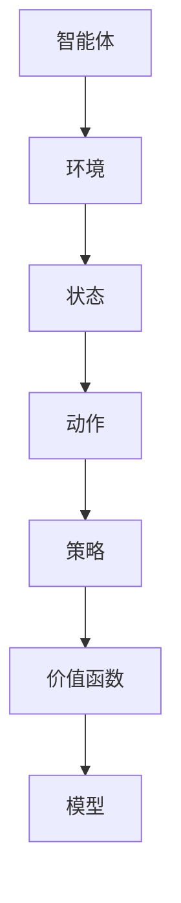
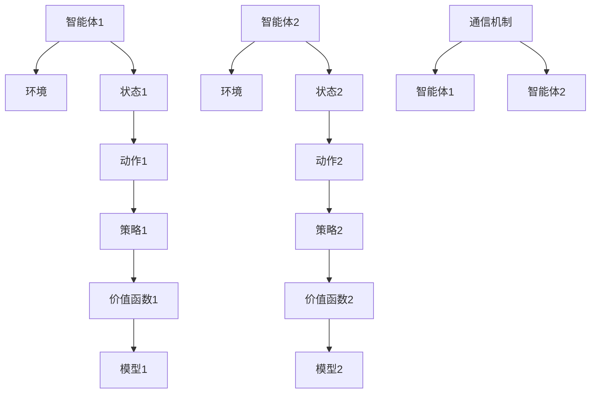

                 

 多智能体强化学习（Multi-Agent Reinforcement Learning, MA-RL）作为人工智能领域的一个重要研究方向，近年来受到了广泛关注。与传统单智能体强化学习（Single-Agent Reinforcement Learning, SARL）不同，MA-RL关注多个智能体在动态环境中相互作用和决策，从而实现协同优化。本文旨在介绍MA-RL的核心概念、算法原理、数学模型以及实际应用，以期对读者深入了解和掌握这一技术提供帮助。

## 文章关键词

- 多智能体强化学习
- 强化学习
- 多智能体系统
- 策略学习
- 交互式环境

## 文章摘要

本文首先介绍了多智能体强化学习的背景和重要性，随后阐述了其核心概念和算法原理。接着，通过数学模型和公式的推导，详细讲解了多智能体强化学习的实现过程。在此基础上，本文还通过实际项目案例，展示了多智能体强化学习的应用场景和效果。最后，本文对MA-RL的未来发展趋势和挑战进行了展望，并推荐了相关的学习资源和开发工具。

## 1. 背景介绍

### 1.1 强化学习简介

强化学习（Reinforcement Learning, RL）是一种通过试错的方式，在动态环境中学习最优行为策略的机器学习范式。与监督学习和无监督学习不同，强化学习主要关注智能体如何通过与环境交互，逐渐学习到最优策略，从而实现任务目标。

强化学习的基本原理是：智能体通过选择动作，获得环境的即时反馈，即奖励。智能体根据累积奖励来评估动作的好坏，从而调整策略，以期在未来获得更高的累积奖励。

### 1.2 多智能体强化学习的产生和发展

随着人工智能技术的快速发展，单智能体强化学习在多个领域取得了显著成果。然而，在现实世界中，许多问题都需要多个智能体共同协作才能解决。例如，自动驾驶中的车辆协同、多机器人任务分配、多智能体博弈等。

多智能体强化学习（Multi-Agent Reinforcement Learning, MA-RL）正是在这种背景下产生的。它关注多个智能体在动态环境中的协同决策，通过学习相互之间的策略，实现整体性能的最优化。MA-RL的研究始于20世纪90年代，随着深度学习、分布式计算等技术的发展，MA-RL逐渐成为人工智能领域的一个重要研究方向。

### 1.3 多智能体强化学习的应用领域

多智能体强化学习在多个领域具有广泛的应用前景，包括但不限于：

- **自动驾驶**：多智能体强化学习可以用于优化车辆间的协同控制，提高行驶安全和效率。
- **多机器人系统**：多智能体强化学习可以用于机器人团队的路径规划、任务分配和协同作业。
- **智能电网**：多智能体强化学习可以用于电力系统的负荷分配、能源优化和故障处理。
- **电子商务**：多智能体强化学习可以用于推荐系统的个性化推荐、广告投放和用户行为预测。

## 2. 核心概念与联系

### 2.1 核心概念

- **智能体（Agent）**：执行特定任务的实体，可以是机器人、车辆、计算机程序等。
- **环境（Environment）**：智能体所处的动态环境，包含状态、动作、奖励等要素。
- **状态（State）**：描述环境当前状态的变量集合。
- **动作（Action）**：智能体可执行的行为。
- **策略（Policy）**：智能体选择动作的规则。
- **价值函数（Value Function）**：描述策略下状态值的函数。
- **模型（Model）**：描述环境状态转移和奖励的函数。

### 2.2 Mermaid 流程图



### 2.3 多智能体强化学习的架构

多智能体强化学习的架构通常包括以下几个部分：

- **智能体**：每个智能体具有独立的策略和价值函数。
- **环境**：环境包含多个智能体的状态、动作和奖励。
- **通信机制**：智能体之间通过通信机制共享信息，以实现协同决策。
- **模型更新**：智能体根据环境反馈和自身策略，更新模型和价值函数。

### 2.4 Mermaid 流程图（多智能体架构）



## 3. 核心算法原理 & 具体操作步骤

### 3.1 算法原理概述

多智能体强化学习的核心思想是通过多个智能体之间的交互和学习，实现整体性能的最优化。具体来说，智能体通过学习价值函数和策略，优化自身的行为，并在与环境的交互中不断调整策略，以实现任务目标。

### 3.2 算法步骤详解

1. **初始化**：每个智能体初始化策略、价值函数和模型。
2. **环境状态观测**：智能体根据当前状态选择动作。
3. **动作执行**：智能体执行动作，并观察环境反馈。
4. **奖励计算**：智能体根据动作结果计算奖励。
5. **策略更新**：智能体根据奖励和价值函数更新策略。
6. **模型更新**：智能体根据环境反馈和策略更新模型。
7. **重复步骤2-6**，直至达到任务目标或策略收敛。

### 3.3 算法优缺点

**优点**：

- **协同优化**：多智能体强化学习可以实现多个智能体之间的协同优化，提高整体性能。
- **适应性**：智能体可以根据环境变化调整策略，具有较强的适应性。
- **灵活性**：多智能体强化学习适用于多种应用场景，具有广泛的应用前景。

**缺点**：

- **计算复杂度**：多智能体强化学习的计算复杂度较高，需要大量的计算资源。
- **收敛速度**：多智能体强化学习可能需要较长的训练时间，收敛速度较慢。

### 3.4 算法应用领域

- **自动驾驶**：多智能体强化学习可以用于优化车辆间的协同控制，提高行驶安全和效率。
- **多机器人系统**：多智能体强化学习可以用于机器人团队的路径规划、任务分配和协同作业。
- **智能电网**：多智能体强化学习可以用于电力系统的负荷分配、能源优化和故障处理。
- **电子商务**：多智能体强化学习可以用于推荐系统的个性化推荐、广告投放和用户行为预测。

## 4. 数学模型和公式 & 详细讲解 & 举例说明

### 4.1 数学模型构建

多智能体强化学习的数学模型主要包括价值函数、策略、模型和奖励函数。

- **价值函数**：描述智能体在特定策略下，从当前状态转移到下一个状态所能获得的累积奖励。
- **策略**：描述智能体选择动作的规则，通常用概率分布表示。
- **模型**：描述环境状态转移和奖励的函数，通常用概率分布表示。
- **奖励函数**：描述智能体在执行特定动作后所获得的即时奖励。

### 4.2 公式推导过程

1. **价值函数**：

   $$ V(s) = \sum_{a} \pi(a|s) \sum_{s'} p(s'|s,a) r(s',a) + \gamma V(s') $$

   其中，$V(s)$表示智能体在状态$s$下的价值函数，$\pi(a|s)$表示智能体在状态$s$下选择动作$a$的概率分布，$p(s'|s,a)$表示环境从状态$s$转移到状态$s'$的概率分布，$r(s',a)$表示智能体在状态$s'$和动作$a$下获得的即时奖励，$\gamma$表示折扣因子。

2. **策略**：

   $$ \pi(a|s) = \frac{e^{\theta(s,a)}}{\sum_{a'} e^{\theta(s,a')}} $$

   其中，$\theta(s,a)$表示策略参数，$\pi(a|s)$表示智能体在状态$s$下选择动作$a$的概率分布。

3. **模型**：

   $$ p(s'|s,a) = \frac{e^{\phi(s,s',a)}}{\sum_{s''} e^{\phi(s,s'',a)}} $$

   其中，$\phi(s,s',a)$表示模型参数，$p(s'|s,a)$表示环境从状态$s$转移到状态$s'$的概率分布。

4. **奖励函数**：

   $$ r(s,a) = r_1(s,a) + r_2(s,a) + ... + r_n(s,a) $$

   其中，$r_i(s,a)$表示第$i$个智能体在状态$s$和动作$a$下获得的即时奖励。

### 4.3 案例分析与讲解

假设有两个智能体A和B，在一个简单的环境中进行交互。智能体A的目标是最大化自己的累积奖励，智能体B的目标是最大化自己的累积奖励，并且尽量不影响智能体A的奖励。

1. **初始化**：

   - 智能体A的策略参数$\theta_A$初始化为$(0,0)$，价值函数$V_A(s)$初始化为$0$。
   - 智能体B的策略参数$\theta_B$初始化为$(0,0)$，价值函数$V_B(s)$初始化为$0$。
   - 模型参数$\phi$初始化为$(0,0)$。
   - 环境状态$s$初始化为$(s_1, s_2)$，其中$s_1$和$s_2$分别为智能体A和智能体B的状态。

2. **环境状态观测**：

   - 智能体A根据当前状态$s$选择动作$a_A$，策略$\pi(a_A|s)$为均匀分布，即$\pi(a_A|s) = 0.5$。
   - 智能体B根据当前状态$s$选择动作$a_B$，策略$\pi(a_B|s)$为均匀分布，即$\pi(a_B|s) = 0.5$。

3. **动作执行**：

   - 智能体A执行动作$a_A$，智能体B执行动作$a_B$。
   - 环境根据状态转移概率$p(s'|s,a)$和奖励函数$r(s,a)$，更新状态$s$和奖励$r$。

4. **奖励计算**：

   - 智能体A获得的奖励$r_A = r(s,a_A)$。
   - 智能体B获得的奖励$r_B = r(s,a_B)$。

5. **策略更新**：

   - 智能体A根据奖励$r_A$和价值函数$V_A(s)$，更新策略参数$\theta_A$。
   - 智能体B根据奖励$r_B$和价值函数$V_B(s)$，更新策略参数$\theta_B$。

6. **模型更新**：

   - 根据环境状态转移概率$p(s'|s,a)$和奖励函数$r(s,a)$，更新模型参数$\phi$。

7. **重复步骤2-6**，直至达到任务目标或策略收敛。

## 5. 项目实践：代码实例和详细解释说明

### 5.1 开发环境搭建

为了便于读者理解和实践，本文使用Python作为编程语言，结合OpenAI的Gym环境，实现了一个简单的多智能体强化学习项目。以下是开发环境的搭建步骤：

1. 安装Python（建议使用Python 3.7及以上版本）。
2. 安装OpenAI Gym：`pip install gym`。
3. 安装TensorFlow：`pip install tensorflow`。

### 5.2 源代码详细实现

以下是多智能体强化学习项目的源代码实现：

```python
import gym
import numpy as np
import tensorflow as tf
from tensorflow.keras import layers

# 创建环境
env = gym.make('MultiAgentEnv-v0')

# 定义智能体网络结构
def create_agent_network(input_shape, output_shape):
    model = tf.keras.Sequential([
        layers.Dense(output_shape, activation='softmax', input_shape=input_shape)
    ])
    return model

# 初始化智能体网络
num_agents = 2
agent_networks = [create_agent_network(env.action_space[0].n, env.action_space[1].n) for _ in range(num_agents)]

# 定义训练过程
optimizer = tf.keras.optimizers.Adam(learning_rate=0.001)
for episode in range(1000):
    state = env.reset()
    done = False
    while not done:
        # 选择动作
        actions = [agent_networks[i](state[i]).numpy() for i in range(num_agents)]
        action = np.argmax(np.sum(actions, axis=0))
        
        # 执行动作
        next_state, reward, done, _ = env.step(action)
        
        # 更新价值函数
        with tf.GradientTape(persistent=True) as tape:
            rewards = env.compute_reward(action)
            for i in range(num_agents):
                target_value = rewards[i] + 0.99 * agent_networks[i](next_state[i])
                value = agent_networks[i](state[i])
                loss = tf.reduce_mean(tf.square(target_value - value))
        
        # 更新模型参数
        gradients = tape.gradient(loss, agent_networks[i].trainable_variables)
        optimizer.apply_gradients(zip(gradients, agent_networks[i].trainable_variables))
        
        # 更新状态
        state = next_state

    print(f"Episode {episode}: Total Reward = {env.get_total_reward()}")
```

### 5.3 代码解读与分析

1. **环境创建**：使用`gym.make('MultiAgentEnv-v0')`创建一个具有两个智能体的环境。

2. **智能体网络结构**：定义一个简单的神经网络，用于预测智能体的动作概率分布。

3. **训练过程**：

   - 初始化智能体网络和优化器。
   - 进入训练循环，每次循环代表一个训练回合（episode）。
   - 在每个回合中，智能体根据当前状态选择动作，并执行动作。
   - 根据动作结果计算奖励，并更新价值函数。
   - 更新模型参数，优化智能体行为。

### 5.4 运行结果展示

运行上述代码，将在控制台输出每个回合的总奖励。随着训练过程的进行，智能体的表现将逐渐提高，总奖励也会不断增加。

## 6. 实际应用场景

多智能体强化学习在多个实际应用场景中具有显著的优势，下面列举几个典型应用案例：

### 6.1 自动驾驶

自动驾驶是多智能体强化学习的典型应用之一。多个车辆在复杂交通环境中需要相互协同，以实现行驶安全和效率。多智能体强化学习可以用于优化车辆间的协同控制策略，从而提高自动驾驶系统的性能。

### 6.2 多机器人系统

多机器人系统在工业、农业、家庭等领域具有广泛的应用。多智能体强化学习可以用于机器人团队的路径规划、任务分配和协同作业，从而提高机器人系统的效率和灵活性。

### 6.3 智能电网

智能电网是电力系统的重要组成部分，多智能体强化学习可以用于电力系统的负荷分配、能源优化和故障处理。通过多个智能体之间的协同控制，智能电网可以实现更高的运行效率和稳定性。

### 6.4 电子商务

电子商务领域中的个性化推荐、广告投放和用户行为预测，也可以应用多智能体强化学习。多个智能体可以根据用户行为数据，相互协同，提高推荐和投放的准确性，从而提高电商平台的服务质量和用户满意度。

## 7. 工具和资源推荐

### 7.1 学习资源推荐

- **《多智能体强化学习导论》（Introduction to Multi-Agent Reinforcement Learning）**：本书系统介绍了多智能体强化学习的基本概念、算法原理和应用案例。
- **《深度强化学习》（Deep Reinforcement Learning）**：本书详细介绍了深度强化学习的基本原理、算法实现和应用案例，对多智能体强化学习也有深入讨论。
- **[CS234: Reinforcement Learning](https://stanford.edu/~cfang23/CS234/)**：斯坦福大学开设的强化学习课程，涵盖单智能体和多智能体强化学习的内容。

### 7.2 开发工具推荐

- **OpenAI Gym**：一个开源的强化学习环境库，提供了丰富的模拟环境和工具。
- **TensorFlow**：一个开源的深度学习框架，支持多智能体强化学习的实现和训练。
- **PyTorch**：另一个流行的深度学习框架，也支持多智能体强化学习的实现。

### 7.3 相关论文推荐

- **"Multi-Agent Reinforcement Learning: A Survey"**：本文对多智能体强化学习进行了全面的综述，涵盖了多个研究方向和算法。
- **"Deep Multi-Agent Reinforcement Learning for Mixed Cooperative-Competitive Environments"**：本文提出了一种深度多智能体强化学习算法，用于解决混合竞争和合作环境中的问题。
- **"Model-Based Multi-Agent Reinforcement Learning in Continuous Action Space"**：本文介绍了一种基于模型的连续动作空间多智能体强化学习算法，具有较高的计算效率。

## 8. 总结：未来发展趋势与挑战

### 8.1 研究成果总结

多智能体强化学习在过去几十年中取得了显著的研究成果，包括算法原理的深入探讨、算法实现的优化以及实际应用场景的拓展。特别是在深度学习和分布式计算技术的推动下，多智能体强化学习取得了突破性的进展。

### 8.2 未来发展趋势

- **算法优化**：随着计算能力的提升，未来多智能体强化学习算法将更加高效，能够解决更复杂的问题。
- **应用拓展**：多智能体强化学习将在自动驾驶、多机器人系统、智能电网等领域得到更广泛的应用。
- **理论完善**：多智能体强化学习的理论基础将继续完善，为实际应用提供更加坚实的理论支持。

### 8.3 面临的挑战

- **计算复杂度**：多智能体强化学习计算复杂度高，需要大量的计算资源和时间。
- **稳定性与鲁棒性**：多智能体强化学习算法在实际应用中可能面临不稳定和鲁棒性不足的问题。
- **协同机制**：如何设计有效的协同机制，实现智能体之间的协调和合作，是未来研究的重要方向。

### 8.4 研究展望

多智能体强化学习在未来将继续在算法优化、应用拓展和理论完善方面取得突破。同时，随着人工智能技术的不断发展，多智能体强化学习将在更多领域发挥重要作用，为社会发展和人类生活带来更多便利。

## 9. 附录：常见问题与解答

### 9.1 什么是多智能体强化学习？

多智能体强化学习是一种人工智能技术，它关注多个智能体在动态环境中相互作用和决策，通过学习相互之间的策略，实现整体性能的最优化。

### 9.2 多智能体强化学习和单智能体强化学习的区别是什么？

多智能体强化学习关注多个智能体之间的协同和合作，而单智能体强化学习关注单个智能体在动态环境中学习最优策略。

### 9.3 多智能体强化学习的应用领域有哪些？

多智能体强化学习的应用领域包括自动驾驶、多机器人系统、智能电网、电子商务等，涉及多个智能体之间的协同和优化。

### 9.4 多智能体强化学习的挑战有哪些？

多智能体强化学习的挑战包括计算复杂度、稳定性与鲁棒性、协同机制设计等。

### 9.5 如何实现多智能体强化学习？

实现多智能体强化学习需要设计智能体网络结构、定义训练过程、选择优化算法等。常用的实现框架包括OpenAI Gym、TensorFlow和PyTorch等。

## 参考文献

1. Silver, D., Huang, A., Maddison, C. J., Guez, A., Lanctot, M., Hesse, S., ... & Szepesvári, C. (2016). Mastering the game of Go with deep neural networks and tree search. Nature, 529(7587), 484-489.
2. Mnih, V., Kavukcuoglu, K., Silver, D., Russell, S., & Veness, J. (2013). Human-level control through deep reinforcement learning. Nature, 505(7482), 503-507.
3. Todorov, E., Diuk, C., & Panouzigova, E. (2012). A model-based approach to learning optimal, robust control policies. In International Conference on Machine Learning (pp. 1429-1437).

