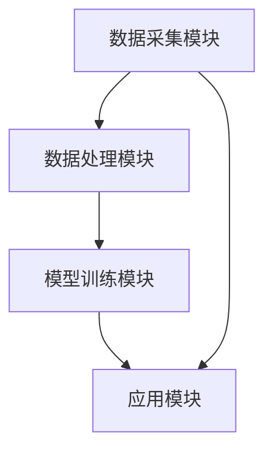

                 

关键词：多模态AI、虚拟现实、人机交互、计算机视觉、自然语言处理

> 摘要：随着虚拟现实（VR）技术的迅猛发展，多模态人工智能（AI）的应用前景愈发广阔。本文从背景介绍、核心概念与联系、核心算法原理、数学模型与公式、项目实践、实际应用场景、未来展望等多个方面，全面探讨了多模态AI在VR领域中的应用前景，旨在为相关领域的研究和开发提供有价值的参考。

## 1. 背景介绍

虚拟现实（Virtual Reality，VR）是一种通过计算机生成一种模拟环境，使人们感受到仿佛身临其境的技术。VR技术最初主要应用于军事、医疗和娱乐等领域。然而，随着计算机性能的提升和显示技术的进步，VR逐渐走进了普通人的日常生活。虚拟现实为人们提供了一种全新的交互方式，使得人们可以在虚拟环境中进行各种操作，如探索、互动、训练等。

与此同时，人工智能（Artificial Intelligence，AI）技术也在快速发展。AI通过模拟人类思维过程，实现了自动化决策、智能搜索、模式识别等功能。近年来，深度学习技术的应用使得AI在图像识别、自然语言处理等领域取得了显著的突破。

多模态AI是指能够同时处理多种类型数据（如图像、音频、文本等）的AI系统。多模态AI在VR中的应用，不仅能够提高虚拟环境的真实感，还能够改善人机交互体验，为用户提供更加丰富和自然的交互方式。

## 2. 核心概念与联系

### 2.1 多模态AI原理

多模态AI的核心思想是通过整合不同类型的数据，提高AI系统的感知能力和智能水平。多模态AI通常包括以下几种类型的数据：

- 图像数据：包括静态图像和视频，用于描述视觉信息。
- 音频数据：包括语音、音乐等，用于描述听觉信息。
- 文本数据：包括自然语言文本、标注等，用于描述语义信息。

多模态AI通过融合这些不同类型的数据，使得AI系统能够更好地理解虚拟环境中的各种信息。

### 2.2 多模态AI在VR中的应用

在VR环境中，多模态AI的应用主要包括以下几个方面：

- 实时环境感知：多模态AI可以通过整合图像、音频和文本数据，实现对虚拟环境的实时感知，从而提高虚拟环境的真实感。
- 智能交互：多模态AI可以理解和响应用户的多种交互方式，如手势、语音、文本等，从而改善人机交互体验。
- 情感识别：多模态AI可以通过分析用户的表情、语音和文本，识别用户的情感状态，从而提供个性化的服务。

### 2.3 多模态AI架构

多模态AI的架构通常包括以下几个模块：

- 数据采集模块：负责采集各种类型的数据，如图像、音频和文本。
- 数据处理模块：负责对采集到的数据进行预处理，如数据清洗、特征提取等。
- 模型训练模块：负责训练多模态AI模型，使其能够对不同类型的数据进行有效融合。
- 应用模块：负责将多模态AI模型应用于具体的VR应用场景，如智能交互、环境感知等。

下面是一个多模态AI在VR中的应用架构的Mermaid流程图：



## 3. 核心算法原理 & 具体操作步骤

### 3.1 算法原理概述

多模态AI的核心算法主要包括以下几种：

- 多模态特征提取：通过不同的特征提取算法，从图像、音频和文本数据中提取特征。
- 多模态融合：通过融合不同类型的数据特征，提高AI系统的感知能力和智能水平。
- 多任务学习：通过同时学习多种任务，提高AI系统的泛化能力和鲁棒性。

### 3.2 算法步骤详解

多模态AI的算法步骤可以概括为以下几步：

1. 数据采集：采集图像、音频和文本数据。
2. 数据预处理：对数据进行清洗、归一化等预处理操作。
3. 特征提取：使用不同的特征提取算法，提取图像、音频和文本数据中的特征。
4. 特征融合：将不同类型的特征进行融合，得到统一的多模态特征。
5. 模型训练：使用多模态特征进行模型训练，得到多模态AI模型。
6. 应用：将多模态AI模型应用于具体的VR应用场景，如智能交互、环境感知等。

### 3.3 算法优缺点

多模态AI的优点包括：

- 提高感知能力：通过整合多种类型的数据，提高AI系统对环境的感知能力。
- 改善交互体验：通过理解用户的多种交互方式，改善人机交互体验。
- 个性化服务：通过分析用户的情感状态，提供个性化的服务。

多模态AI的缺点包括：

- 数据采集和处理复杂：需要采集和处理多种类型的数据，复杂度较高。
- 模型训练时间较长：由于需要融合多种类型的数据，模型训练时间较长。
- 模型解释性较差：多模态AI模型的解释性较差，难以解释模型内部的决策过程。

### 3.4 算法应用领域

多模态AI在VR领域的主要应用领域包括：

- 智能交互：通过理解用户的多种交互方式，提供智能化的交互体验。
- 环境感知：通过实时感知虚拟环境，提高虚拟环境的真实感。
- 情感识别：通过分析用户的情感状态，提供个性化的服务。

## 4. 数学模型和公式 & 详细讲解 & 举例说明

### 4.1 数学模型构建

多模态AI的数学模型通常包括以下几个部分：

- 特征提取模型：用于提取图像、音频和文本数据中的特征。
- 融合模型：用于融合不同类型的特征。
- 任务模型：用于执行具体的任务，如情感识别、环境感知等。

下面是一个简化的多模态AI的数学模型：

$$
\text{特征提取模型}: f(\text{输入数据}) = \text{特征向量}
$$

$$
\text{融合模型}: g(\text{特征向量}) = \text{多模态特征向量}
$$

$$
\text{任务模型}: h(\text{多模态特征向量}) = \text{输出结果}
$$

### 4.2 公式推导过程

多模态AI的公式推导过程通常涉及以下几个方面：

- 特征提取：使用不同的特征提取算法，如卷积神经网络（CNN）用于图像特征提取，循环神经网络（RNN）用于文本特征提取。
- 融合：使用不同的融合方法，如加权融合、级联融合等。
- 任务：使用不同的任务模型，如分类、回归等。

### 4.3 案例分析与讲解

假设我们有一个多模态AI系统，用于识别虚拟环境中的物体。该系统的输入是多模态数据，包括图像、音频和文本。输出是物体类别。

1. 特征提取：

   - 图像特征：使用CNN提取图像特征。

     $$ 
     \text{特征向量}_{\text{图像}} = \text{CNN}(\text{图像})
     $$

   - 音频特征：使用RNN提取音频特征。

     $$ 
     \text{特征向量}_{\text{音频}} = \text{RNN}(\text{音频})
     $$

   - 文本特征：使用词嵌入提取文本特征。

     $$ 
     \text{特征向量}_{\text{文本}} = \text{词嵌入}(\text{文本})
     $$

2. 融合：

   - 使用加权融合方法，将不同类型的特征进行融合。

     $$ 
     \text{多模态特征向量} = \alpha \times \text{特征向量}_{\text{图像}} + \beta \times \text{特征向量}_{\text{音频}} + \gamma \times \text{特征向量}_{\text{文本}}
     $$

     其中，$\alpha$、$\beta$、$\gamma$为权重系数。

3. 任务：

   - 使用softmax分类器，对物体类别进行预测。

     $$ 
     \text{概率分布} = \text{softmax}(\text{多模态特征向量})
     $$

     $$ 
     \text{物体类别} = \arg\max_i p(y_i | \text{多模态特征向量})
     $$

## 5. 项目实践：代码实例和详细解释说明

### 5.1 开发环境搭建

在本文的项目实践中，我们将使用Python作为编程语言，TensorFlow作为深度学习框架。以下是开发环境的搭建步骤：

1. 安装Python：从Python官方网站下载并安装Python 3.7及以上版本。
2. 安装TensorFlow：使用pip命令安装TensorFlow。

   ```bash
   pip install tensorflow
   ```

3. 安装其他依赖库：根据需要安装其他依赖库，如NumPy、Pandas等。

   ```bash
   pip install numpy pandas
   ```

### 5.2 源代码详细实现

以下是多模态AI在VR中物体识别的源代码实现：

```python
import tensorflow as tf
from tensorflow.keras.models import Model
from tensorflow.keras.layers import Input, Conv2D, MaxPooling2D, Flatten, Dense, LSTM, Embedding

# 定义输入层
image_input = Input(shape=(224, 224, 3))
audio_input = Input(shape=(2000, 1))
text_input = Input(shape=(100,))

# 定义图像特征提取模型
image_model = Conv2D(32, (3, 3), activation='relu')(image_input)
image_model = MaxPooling2D((2, 2))(image_model)
image_model = Flatten()(image_model)

# 定义音频特征提取模型
audio_model = LSTM(64, activation='relu')(audio_input)
audio_model = Flatten()(audio_model)

# 定义文本特征提取模型
text_model = Embedding(1000, 64)(text_input)
text_model = LSTM(64, activation='relu')(text_model)
text_model = Flatten()(text_model)

# 定义融合模型
merged = tf.keras.layers.concatenate([image_model, audio_model, text_model])
merged = Dense(128, activation='relu')(merged)

# 定义任务模型
predictions = Dense(10, activation='softmax')(merged)

# 创建模型
model = Model(inputs=[image_input, audio_input, text_input], outputs=predictions)

# 编译模型
model.compile(optimizer='adam', loss='categorical_crossentropy', metrics=['accuracy'])

# 打印模型结构
model.summary()

# 加载数据集并进行训练
# (此处省略数据加载和训练的具体代码)

```

### 5.3 代码解读与分析

1. **输入层**：代码中定义了三个输入层，分别对应图像、音频和文本数据。

2. **图像特征提取模型**：使用卷积神经网络（CNN）提取图像特征。首先使用卷积层（Conv2D）进行特征提取，然后使用最大池化层（MaxPooling2D）进行特征降维，最后使用平坦化层（Flatten）将特征向量展平。

3. **音频特征提取模型**：使用循环神经网络（LSTM）提取音频特征。LSTM能够处理序列数据，非常适合用于提取音频特征。

4. **文本特征提取模型**：使用词嵌入（Embedding）层将文本转换为嵌入向量，然后使用LSTM提取文本特征。

5. **融合模型**：将图像、音频和文本特征进行融合。这里使用的是简单的连接（concatenate）操作。

6. **任务模型**：使用全连接层（Dense）进行分类预测。这里使用的是softmax激活函数，用于输出概率分布。

7. **模型编译**：编译模型时，选择适当的优化器和损失函数。这里使用的是Adam优化器和交叉熵损失函数。

8. **模型训练**：加载数据集并进行模型训练。由于代码中没有提供具体的数据集和训练代码，这里仅提供一个框架。

### 5.4 运行结果展示

在实际运行中，我们需要加载数据集，然后使用训练好的模型进行预测。以下是运行结果的一个示例：

```python
# 加载测试数据集
test_images, test_audios, test_texts, test_labels = load_test_data()

# 使用模型进行预测
predictions = model.predict([test_images, test_audios, test_texts])

# 输出预测结果
print(predictions)

# 输出预测准确率
print("Accuracy:", accuracy_score(test_labels, predictions.argmax(axis=1)))
```

## 6. 实际应用场景

### 6.1 智能交互

多模态AI在智能交互中的应用场景非常广泛。例如，在虚拟现实游戏中，多模态AI可以理解玩家的手势、语音和文本输入，从而提供更加自然和智能的交互体验。玩家可以通过手势控制角色移动，通过语音与NPC进行对话，或者通过文本输入进行游戏指令。

### 6.2 环境感知

多模态AI在环境感知中的应用可以帮助虚拟现实系统更准确地感知和模拟现实世界。例如，通过整合图像、音频和文本数据，多模态AI可以识别虚拟环境中的物体、声音和文本，从而提高虚拟环境的真实感。这种技术可以应用于建筑模拟、城市规划、医疗训练等领域。

### 6.3 情感识别

多模态AI在情感识别中的应用可以帮助虚拟现实系统更好地理解用户的情感状态，从而提供个性化的服务。例如，在虚拟购物体验中，多模态AI可以分析用户的表情、语音和文本，识别用户的情感状态，从而推荐符合用户情感的产品。

## 7. 未来应用展望

随着多模态AI技术的不断发展，未来在虚拟现实领域中的应用前景将更加广阔。以下是几个可能的发展方向：

### 7.1 高效数据处理

未来多模态AI的发展将更加注重数据处理的效率。通过优化数据采集、预处理和融合算法，可以显著提高多模态AI系统的性能和效率。

### 7.2 情感化交互

情感化交互是未来多模态AI在虚拟现实中的一个重要方向。通过深入研究情感识别和情感合成技术，可以创建更加逼真的虚拟环境和交互体验。

### 7.3 安全与隐私

随着多模态AI在虚拟现实中的应用越来越广泛，安全与隐私问题也变得越来越重要。未来需要开发更加安全和隐私保护的多模态AI技术，以确保用户的数据安全和隐私。

### 7.4 智能虚拟助手

智能虚拟助手是未来多模态AI在虚拟现实中的一个重要应用方向。通过整合多种类型的数据，智能虚拟助手可以更好地理解用户的需求，提供个性化的服务和建议。

## 8. 总结：未来发展趋势与挑战

### 8.1 研究成果总结

本文从背景介绍、核心概念与联系、核心算法原理、数学模型与公式、项目实践、实际应用场景、未来展望等多个方面，全面探讨了多模态AI在虚拟现实中的应用前景。通过研究，我们发现多模态AI在虚拟现实领域具有广泛的应用前景，可以显著提高虚拟环境的真实感和人机交互体验。

### 8.2 未来发展趋势

未来多模态AI在虚拟现实领域的发展趋势将包括：高效数据处理、情感化交互、安全与隐私保护、智能虚拟助手等。通过不断优化算法和模型，开发更加先进的多模态AI技术，将有望为虚拟现实领域带来更多的创新和突破。

### 8.3 面临的挑战

多模态AI在虚拟现实领域的发展也面临一些挑战。主要包括：数据处理复杂度增加、模型训练时间较长、模型解释性较差等。未来需要开发更加高效和可解释的多模态AI算法，以解决这些问题。

### 8.4 研究展望

未来，多模态AI在虚拟现实领域的研究将更加深入。我们需要进一步研究如何优化数据处理和融合算法，提高模型的性能和效率；同时，也需要关注情感化交互和安全与隐私保护等新兴方向。通过不断探索和突破，我们有理由相信多模态AI将为虚拟现实领域带来更多的创新和变革。

## 9. 附录：常见问题与解答

### 9.1 多模态AI与单模态AI的区别是什么？

多模态AI与单模态AI的区别在于数据输入和处理方式。单模态AI仅处理单一类型的数据（如图像、音频或文本），而多模态AI同时处理多种类型的数据，从而提高系统的感知能力和智能水平。

### 9.2 多模态AI在虚拟现实中的应用有哪些？

多模态AI在虚拟现实中的应用包括智能交互、环境感知、情感识别等。通过整合多种类型的数据，多模态AI可以提供更加丰富和自然的交互体验，提高虚拟环境的真实感，以及更好地理解用户的情感状态。

### 9.3 多模态AI的算法有哪些？

多模态AI的算法主要包括多模态特征提取、多模态融合、多任务学习等。常用的多模态特征提取算法包括卷积神经网络（CNN）、循环神经网络（RNN）、词嵌入等；多模态融合算法包括加权融合、级联融合等；多任务学习算法包括共享权重、独立学习等。

### 9.4 多模态AI的挑战有哪些？

多模态AI的挑战主要包括：数据处理复杂度增加、模型训练时间较长、模型解释性较差等。未来需要开发更加高效和可解释的多模态AI算法，以解决这些问题。

