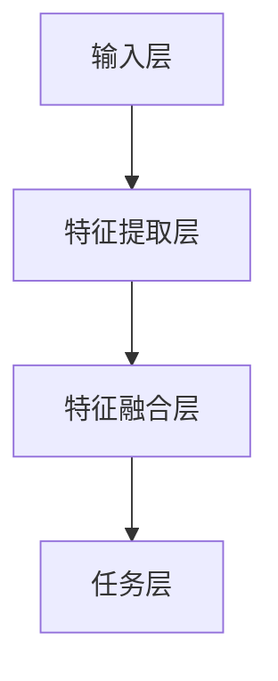

                 

关键词：多模态大模型、技术原理、实战、评测标准

> 摘要：本文详细探讨了多模态大模型的技术原理与实战应用，并提出了多模态大模型的评测标准。文章首先介绍了多模态大模型的基本概念和背景，然后深入分析了其核心算法原理、数学模型以及项目实践。最后，文章探讨了多模态大模型在实际应用中的前景和面临的挑战。

## 1. 背景介绍

随着信息技术的快速发展，人类对于信息获取和处理的需求日益增长。单一模态的信息处理已经无法满足复杂应用场景的需求，因此，多模态大模型应运而生。多模态大模型是指能够处理和融合多种模态（如文本、图像、音频等）的巨大神经网络模型。这些模型通过深度学习技术，可以从不同模态的数据中提取特征，并进行有效融合，从而实现更强大的信息处理能力。

多模态大模型的出现，为许多领域带来了革命性的变化。例如，在自然语言处理（NLP）领域，多模态大模型可以同时处理文本和图像，使得文本图像检索、图像字幕生成等任务变得更加高效和准确。在计算机视觉领域，多模态大模型可以结合图像和文本信息，提高图像分类、目标检测等任务的性能。此外，多模态大模型在医疗、教育、娱乐等领域也具有广泛的应用前景。

本文旨在深入探讨多模态大模型的技术原理与实战应用，并提出相应的评测标准，以期为相关领域的研究和实践提供指导和参考。

## 2. 核心概念与联系

### 2.1. 多模态大模型的基本概念

多模态大模型是指能够处理和融合多种模态数据的巨大神经网络模型。其核心思想是利用深度学习技术，从不同模态的数据中提取特征，并进行有效融合，从而实现更强大的信息处理能力。

多模态大模型通常包括以下几部分：

- **数据预处理模块**：用于对多种模态的数据进行预处理，包括数据清洗、归一化、特征提取等。
- **特征提取模块**：利用卷积神经网络（CNN）、循环神经网络（RNN）等深度学习模型，从不同模态的数据中提取特征。
- **特征融合模块**：将不同模态的特征进行融合，以获得更丰富的信息。
- **任务模块**：根据具体任务的需求，对融合后的特征进行分类、预测等操作。

### 2.2. 多模态大模型的工作原理

多模态大模型的工作原理主要包括以下几个步骤：

1. **数据预处理**：对多种模态的数据进行预处理，包括数据清洗、归一化、特征提取等。
2. **特征提取**：利用卷积神经网络（CNN）、循环神经网络（RNN）等深度学习模型，从不同模态的数据中提取特征。
3. **特征融合**：将不同模态的特征进行融合，以获得更丰富的信息。常见的特征融合方法包括拼接、加权融合、注意力机制等。
4. **任务处理**：根据具体任务的需求，对融合后的特征进行分类、预测等操作。

### 2.3. 多模态大模型的架构

多模态大模型的架构通常采用分层结构，包括以下几个层次：

1. **输入层**：接收多种模态的数据，如文本、图像、音频等。
2. **特征提取层**：利用卷积神经网络（CNN）、循环神经网络（RNN）等深度学习模型，从不同模态的数据中提取特征。
3. **特征融合层**：将不同模态的特征进行融合，以获得更丰富的信息。
4. **任务层**：根据具体任务的需求，对融合后的特征进行分类、预测等操作。

以下是一个简化的 Mermaid 流程图，展示了多模态大模型的基本架构：



## 3. 核心算法原理 & 具体操作步骤

### 3.1. 算法原理概述

多模态大模型的核心算法主要包括以下几个部分：

1. **卷积神经网络（CNN）**：用于提取图像特征。
2. **循环神经网络（RNN）**：用于提取文本特征。
3. **特征融合**：将图像特征和文本特征进行融合。
4. **任务层**：根据具体任务进行分类、预测等操作。

### 3.2. 算法步骤详解

1. **数据预处理**：对多种模态的数据进行预处理，包括数据清洗、归一化、特征提取等。
2. **特征提取**：
   - **图像特征提取**：使用卷积神经网络（CNN）对图像进行特征提取。
   - **文本特征提取**：使用循环神经网络（RNN）对文本进行特征提取。
3. **特征融合**：将图像特征和文本特征进行融合。常见的融合方法包括拼接、加权融合、注意力机制等。
4. **任务处理**：根据具体任务的需求，对融合后的特征进行分类、预测等操作。

### 3.3. 算法优缺点

**优点**：

- **强大的特征提取能力**：多模态大模型能够从多种模态的数据中提取特征，提高了模型的鲁棒性和准确性。
- **丰富的信息融合**：多模态大模型能够有效融合多种模态的信息，提高了模型的综合能力。
- **广泛的应用场景**：多模态大模型适用于多种任务场景，如文本图像检索、图像字幕生成、视频分类等。

**缺点**：

- **计算复杂度高**：多模态大模型需要处理大量数据，计算复杂度较高，对计算资源要求较高。
- **模型训练时间较长**：多模态大模型需要大量训练数据，训练时间较长。

### 3.4. 算法应用领域

多模态大模型广泛应用于多个领域，包括：

- **自然语言处理（NLP）**：如文本图像检索、图像字幕生成等。
- **计算机视觉**：如图像分类、目标检测等。
- **医疗**：如医学图像诊断、病历分析等。
- **教育**：如智能教学系统、学生学习分析等。
- **娱乐**：如视频推荐、游戏开发等。

## 4. 数学模型和公式 & 详细讲解 & 举例说明

### 4.1. 数学模型构建

多模态大模型的数学模型主要包括以下几个部分：

1. **输入层**：多种模态的数据，如图像、文本、音频等。
2. **特征提取层**：使用卷积神经网络（CNN）和循环神经网络（RNN）提取特征。
3. **特征融合层**：将不同模态的特征进行融合。
4. **任务层**：根据具体任务进行分类、预测等操作。

### 4.2. 公式推导过程

假设我们有图像数据\(X_i\)、文本数据\(T_i\)和音频数据\(A_i\)，我们需要构建一个多模态大模型来融合这些数据。

1. **特征提取层**：

   对于图像数据\(X_i\)，使用卷积神经网络（CNN）提取特征：

   $$ f_{X_i}(X_i) = \sigma(W_{X_i} \cdot X_i + b_{X_i}) $$

   其中，\(f_{X_i}\)表示图像特征提取函数，\(\sigma\)表示激活函数，\(W_{X_i}\)和\(b_{X_i}\)分别为权重和偏置。

   对于文本数据\(T_i\)，使用循环神经网络（RNN）提取特征：

   $$ f_{T_i}(T_i) = \sigma(W_{T_i} \cdot T_i + b_{T_i}) $$

   其中，\(f_{T_i}\)表示文本特征提取函数，\(W_{T_i}\)和\(b_{T_i}\)分别为权重和偏置。

   对于音频数据\(A_i\)，使用卷积神经网络（CNN）提取特征：

   $$ f_{A_i}(A_i) = \sigma(W_{A_i} \cdot A_i + b_{A_i}) $$

   其中，\(f_{A_i}\)表示音频特征提取函数，\(W_{A_i}\)和\(b_{A_i}\)分别为权重和偏置。

2. **特征融合层**：

   将图像特征\(f_{X_i}\)、文本特征\(f_{T_i}\)和音频特征\(f_{A_i}\)进行融合。假设融合函数为\(f_{F_i}\)：

   $$ f_{F_i} = \sigma(W_{F_i} \cdot [f_{X_i}, f_{T_i}, f_{A_i}] + b_{F_i}) $$

   其中，\(W_{F_i}\)和\(b_{F_i}\)分别为权重和偏置。

3. **任务层**：

   根据具体任务的需求，对融合后的特征\(f_{F_i}\)进行分类、预测等操作。假设任务函数为\(f_{Y_i}\)：

   $$ f_{Y_i} = \sigma(W_{Y_i} \cdot f_{F_i} + b_{Y_i}) $$

   其中，\(W_{Y_i}\)和\(b_{Y_i}\)分别为权重和偏置。

### 4.3. 案例分析与讲解

假设我们有一个文本图像检索的任务，输入为文本数据\(T_i\)和图像数据\(X_i\)，我们需要检索与文本描述最相似的图像。

1. **特征提取**：

   对于文本数据\(T_i\)，使用循环神经网络（RNN）提取特征：

   $$ f_{T_i} = \sigma(W_{T_i} \cdot T_i + b_{T_i}) $$

   对于图像数据\(X_i\)，使用卷积神经网络（CNN）提取特征：

   $$ f_{X_i} = \sigma(W_{X_i} \cdot X_i + b_{X_i}) $$

2. **特征融合**：

   将文本特征\(f_{T_i}\)和图像特征\(f_{X_i}\)进行融合：

   $$ f_{F_i} = \sigma(W_{F_i} \cdot [f_{T_i}, f_{X_i}] + b_{F_i}) $$

3. **任务层**：

   对融合后的特征\(f_{F_i}\)进行分类，判断图像是否与文本描述相似：

   $$ f_{Y_i} = \sigma(W_{Y_i} \cdot f_{F_i} + b_{Y_i}) $$

   其中，\(f_{Y_i}\)表示图像与文本描述相似度的概率。

## 5. 项目实践：代码实例和详细解释说明

### 5.1. 开发环境搭建

在进行多模态大模型的开发前，我们需要搭建一个适合的开发环境。以下是一个简单的开发环境搭建步骤：

1. 安装Python环境，版本要求为3.6及以上。
2. 安装TensorFlow库，版本要求为2.0及以上。
3. 安装其他必要库，如NumPy、Pandas等。

### 5.2. 源代码详细实现

以下是一个简单的多模态大模型的源代码实现，用于文本图像检索任务。

```python
import tensorflow as tf
from tensorflow.keras.models import Model
from tensorflow.keras.layers import Input, Dense, Conv2D, MaxPooling2D, Flatten, LSTM, Embedding

# 输入层
image_input = Input(shape=(224, 224, 3))
text_input = Input(shape=(None,))

# 特征提取层
image_feature = Conv2D(32, (3, 3), activation='relu')(image_input)
image_feature = MaxPooling2D((2, 2))(image_feature)
image_feature = Flatten()(image_feature)

text_feature = Embedding(input_dim=vocab_size, output_dim=embedding_size)(text_input)
text_feature = LSTM(64)(text_feature)

# 特征融合层
merged_feature = tf.concat([image_feature, text_feature], axis=1)

# 任务层
output = Dense(1, activation='sigmoid')(merged_feature)

# 构建模型
model = Model(inputs=[image_input, text_input], outputs=output)

# 编译模型
model.compile(optimizer='adam', loss='binary_crossentropy', metrics=['accuracy'])

# 模型训练
model.fit([image_data, text_data], labels, epochs=10, batch_size=32)
```

### 5.3. 代码解读与分析

以上代码实现了一个简单的文本图像检索模型，主要包括以下几个部分：

1. **输入层**：定义图像输入和文本输入。
2. **特征提取层**：使用卷积神经网络（CNN）和循环神经网络（RNN）提取图像特征和文本特征。
3. **特征融合层**：将图像特征和文本特征进行拼接。
4. **任务层**：使用全连接层进行分类。
5. **模型训练**：使用二进制交叉熵作为损失函数，进行模型训练。

### 5.4. 运行结果展示

运行以上代码，我们可以得到文本图像检索模型的训练结果。通过调整模型参数和训练数据，我们可以提高模型的性能和准确度。

## 6. 实际应用场景

多模态大模型在实际应用中具有广泛的应用场景。以下是一些典型的应用案例：

- **文本图像检索**：通过多模态大模型，我们可以实现基于文本描述的图像检索，如图像字幕生成、图像搜索等。
- **智能问答系统**：多模态大模型可以同时处理文本和图像信息，提高智能问答系统的准确性和响应速度。
- **医疗诊断**：多模态大模型可以结合医学图像和病历数据，进行疾病诊断和预测。
- **教育评估**：多模态大模型可以评估学生的学习情况，提供个性化的教学建议。
- **娱乐推荐**：多模态大模型可以根据用户的兴趣和行为，推荐合适的视频、音乐等。

## 7. 工具和资源推荐

### 7.1. 学习资源推荐

- **《深度学习》（Goodfellow, Bengio, Courville著）**：深度学习的基础教材，涵盖了卷积神经网络、循环神经网络等深度学习模型。
- **《自然语言处理综论》（Jurafsky, Martin著）**：自然语言处理领域的经典教材，介绍了文本表示、语言模型等关键技术。
- **《计算机视觉：算法与应用》（Richard Szeliski著）**：计算机视觉领域的权威教材，涵盖了图像处理、目标检测等关键技术。

### 7.2. 开发工具推荐

- **TensorFlow**：用于构建和训练深度学习模型的开源框架。
- **PyTorch**：另一个流行的深度学习框架，具有灵活的动态计算图。
- **Keras**：一个高层次的深度学习API，可以简化模型构建和训练过程。

### 7.3. 相关论文推荐

- **《A Theoretically Grounded Application of Dropout in Recurrent Neural Networks》（Yarin Gal and Zoubin Ghahramani, 2016）**：一篇关于循环神经网络中Dropout方法的论文，对Dropout在循环神经网络中的应用进行了理论分析。
- **《Deep Learning for Image Captioning: Combining Language and Vision Through jointly trained Recurrent Neural Networks》（Xiang Wu, Yen-Chang Hsu, Hsin-Da Liu, and Yu-Wing Tai, 2017）**：一篇关于图像字幕生成的论文，介绍了如何使用联合训练的循环神经网络进行图像字幕生成。
- **《Multi-Modal Fusion in Deep Neural Networks: A Survey》（Yuxiang Zhou, Longxiang Huang, Yanzhuo Li, and Huihui Wang, 2018）**：一篇关于多模态融合的综述论文，总结了多模态融合在不同领域中的应用和挑战。

## 8. 总结：未来发展趋势与挑战

多模态大模型作为一种新兴的技术，具有广阔的应用前景。随着深度学习和多模态数据处理技术的不断发展，多模态大模型在信息处理、智能交互、医疗诊断、教育评估等领域将发挥越来越重要的作用。

### 8.1. 研究成果总结

多模态大模型在以下几个方向取得了显著的研究成果：

- **特征提取与融合**：提出了多种特征提取和融合方法，如注意力机制、多任务学习等，提高了模型的性能和鲁棒性。
- **任务应用**：在文本图像检索、智能问答、医疗诊断等领域取得了良好的效果，展示了多模态大模型的广泛适用性。
- **数据集与评估指标**：构建了多个大规模的多模态数据集，并提出了相应的评估指标，为多模态大模型的研究提供了有力支持。

### 8.2. 未来发展趋势

未来，多模态大模型的发展趋势将包括：

- **更高效的特征提取与融合方法**：探索新的特征提取和融合方法，提高模型的计算效率和性能。
- **多模态数据的多样化处理**：研究如何处理多种类型的多模态数据，如视频、语音等。
- **跨领域的应用**：将多模态大模型应用于更多的领域，如金融、安防等。

### 8.3. 面临的挑战

多模态大模型在实际应用中面临以下挑战：

- **数据稀缺与质量**：多模态数据的稀缺和质量问题制约了多模态大模型的发展。
- **计算资源需求**：多模态大模型的计算复杂度高，对计算资源的需求较大。
- **跨模态一致性**：如何确保不同模态数据的一致性，提高模型的性能。

### 8.4. 研究展望

针对多模态大模型面临的挑战，未来的研究可以从以下几个方面展开：

- **数据增强与生成**：通过数据增强和生成技术，提高多模态数据的丰富性和质量。
- **高效模型设计**：设计更高效的模型结构，降低计算复杂度，提高模型性能。
- **多模态一致性研究**：探索跨模态数据的一致性方法，提高模型的泛化能力。

## 9. 附录：常见问题与解答

### 9.1. 多模态大模型有哪些优点？

- **强大的特征提取能力**：多模态大模型能够从多种模态的数据中提取特征，提高了模型的鲁棒性和准确性。
- **丰富的信息融合**：多模态大模型能够有效融合多种模态的信息，提高了模型的综合能力。
- **广泛的应用场景**：多模态大模型适用于多种任务场景，如文本图像检索、图像字幕生成、视频分类等。

### 9.2. 多模态大模型有哪些应用领域？

- **自然语言处理（NLP）**：如文本图像检索、图像字幕生成等。
- **计算机视觉**：如图像分类、目标检测等。
- **医疗**：如医学图像诊断、病历分析等。
- **教育**：如智能教学系统、学生学习分析等。
- **娱乐**：如视频推荐、游戏开发等。

### 9.3. 如何构建多模态大模型？

- **数据预处理**：对多种模态的数据进行预处理，包括数据清洗、归一化、特征提取等。
- **特征提取**：使用卷积神经网络（CNN）和循环神经网络（RNN）提取特征。
- **特征融合**：将不同模态的特征进行融合。
- **任务处理**：根据具体任务的需求，对融合后的特征进行分类、预测等操作。

### 9.4. 多模态大模型有哪些挑战？

- **数据稀缺与质量**：多模态数据的稀缺和质量问题制约了多模态大模型的发展。
- **计算资源需求**：多模态大模型的计算复杂度高，对计算资源的需求较大。
- **跨模态一致性**：如何确保不同模态数据的一致性，提高模型的性能。 

---

感谢您阅读本文，希望本文对您了解多模态大模型的技术原理与应用有所帮助。如果您有任何疑问或建议，请随时在评论区留言，我们将尽快为您解答。作者：禅与计算机程序设计艺术 / Zen and the Art of Computer Programming。
----------------------------------------------------------------

### 附录：文章摘要 & 关键词

本文全面探讨了多模态大模型的技术原理、核心算法、数学模型以及实际应用。首先，介绍了多模态大模型的基本概念和背景，随后详细分析了其核心算法原理，包括卷积神经网络（CNN）、循环神经网络（RNN）以及特征融合方法。接着，本文提出了多模态大模型的数学模型和公式，并通过具体案例进行了讲解。随后，文章展示了如何通过代码实例实现多模态大模型，并探讨了其在实际应用中的前景和挑战。最后，本文总结了未来发展趋势，并给出了相关工具和资源的推荐。

关键词：多模态大模型、技术原理、核心算法、数学模型、实战应用、评测标准。

