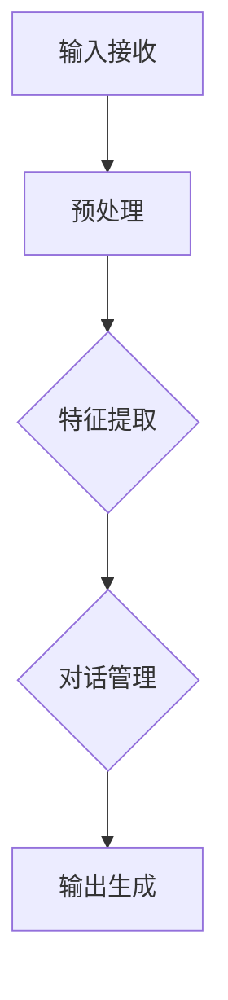

                 

关键词：多模态大模型、多轮对话、技术原理、实战、对话系统、机器学习、自然语言处理、人工智能

摘要：本文旨在深入探讨多模态大模型在多轮对话能力提升方面的技术原理与实践方法。首先，我们将回顾多模态大模型的背景与核心概念，接着详细分析其构建原理与操作步骤。随后，通过数学模型与公式推导，解释如何优化多轮对话能力。文章随后将提供实际项目实践与代码实例，最后讨论多模态大模型在实际应用场景中的潜力与未来发展趋势。

## 1. 背景介绍

随着人工智能技术的发展，多模态大模型（Multimodal Large Models）已成为当前研究的热点。多模态大模型能够处理文本、图像、语音等多种数据形式，通过融合这些信息，显著提升机器理解和生成能力。多轮对话（Multi-turn Dialogue）作为一种交互方式，广泛应用于智能客服、虚拟助手等领域，其性能的优劣直接影响到用户体验。

在多轮对话中，用户和机器之间的交互不仅限于单一回合，而是涉及多个回合的交流。每个回合都可能包含不同类型的信息，如文本、图像、语音等。因此，如何设计一个能够理解并响应这些信息的系统，是实现高质量多轮对话的关键。而多模态大模型凭借其强大的信息处理能力，为这一目标提供了可行的解决方案。

## 2. 核心概念与联系

### 2.1 多模态大模型的概念

多模态大模型是指能够同时处理和融合多种数据模态（如文本、图像、语音等）的深度学习模型。其核心在于利用神经网络和注意力机制，将不同模态的信息进行特征提取和融合，最终生成一个统一的表征。这种模型能够更好地捕捉到复杂情境中的信息，从而提高对话系统的理解能力和响应质量。

### 2.2 多轮对话的流程

多轮对话通常包括以下几个步骤：

1. **输入接收**：系统接收用户的输入信息，这可能包括文本、图像、语音等多种形式。
2. **预处理**：对输入信息进行预处理，如文本的分词、语音的识别等。
3. **特征提取**：利用多模态大模型提取输入信息的特征。
4. **对话管理**：根据对话历史和当前输入特征，生成响应信息。
5. **输出生成**：将生成的响应信息转换成文本、图像、语音等形式，返回给用户。

### 2.3 多模态大模型与多轮对话的联系

多模态大模型能够处理多轮对话中的各种输入信息，并在对话管理阶段综合考虑对话历史和当前输入，从而生成高质量的自然语言响应。通过多模态特征融合，系统能够更准确地理解用户意图，提高对话连贯性和用户满意度。

### 2.4 Mermaid 流程图

下面是一个简化的多模态大模型在多轮对话中的工作流程图：



## 3. 核心算法原理 & 具体操作步骤

### 3.1 算法原理概述

多模态大模型的算法原理主要包括以下几个部分：

1. **特征提取**：利用卷积神经网络（CNN）和循环神经网络（RNN）等模型提取不同模态的特征。
2. **特征融合**：通过多模态注意力机制将不同模态的特征进行融合，生成一个统一的表征。
3. **对话管理**：利用对话状态追踪（DST）模型和生成模型（如Seq2Seq模型）进行对话管理。
4. **响应生成**：根据对话历史和当前输入特征，生成自然语言响应。

### 3.2 算法步骤详解

1. **输入接收**：系统接收用户的多模态输入，如文本、图像、语音等。
2. **预处理**：对输入信息进行预处理，如文本的分词、图像的压缩、语音的转写等。
3. **特征提取**：利用CNN提取图像特征，利用RNN提取文本和语音特征。
4. **特征融合**：通过多模态注意力机制将图像、文本、语音等特征融合。
5. **对话管理**：利用DST模型追踪对话状态，结合当前输入特征，生成响应。
6. **响应生成**：利用生成模型（如Seq2Seq模型）将对话状态编码为序列，生成自然语言响应。
7. **输出生成**：将生成的响应信息转换成文本、图像、语音等形式，返回给用户。

### 3.3 算法优缺点

**优点**：
- 能够融合多种模态的信息，提高对话系统的理解能力。
- 能够处理复杂情境下的多轮对话，提高用户体验。

**缺点**：
- 模型复杂度较高，训练时间较长。
- 需要大量的数据和支持多种模态的预处理算法。

### 3.4 算法应用领域

多模态大模型在多轮对话中的应用非常广泛，主要包括以下领域：

- **智能客服**：利用多模态大模型提高客服机器人的理解能力和响应质量。
- **虚拟助手**：为虚拟助手提供更加自然和连贯的多轮对话能力。
- **教育辅导**：为学生提供个性化的辅导，通过多模态交互提高学习效果。

## 4. 数学模型和公式 & 详细讲解 & 举例说明

### 4.1 数学模型构建

多模态大模型的数学模型主要包括以下几个部分：

1. **特征提取**：利用CNN和RNN提取图像、文本和语音的特征。
2. **特征融合**：通过多模态注意力机制将图像、文本和语音特征融合。
3. **对话管理**：利用对话状态追踪（DST）模型和生成模型（如Seq2Seq模型）进行对话管理。
4. **响应生成**：根据对话状态和当前输入特征，生成自然语言响应。

### 4.2 公式推导过程

1. **特征提取**：

   - 图像特征提取：$f_{image} = CNN(\text{image})$
   - 文本特征提取：$f_{text} = RNN(\text{text})$
   - 语音特征提取：$f_{voice} = RNN(\text{voice})$

2. **特征融合**：

   - 多模态注意力机制：$f_{fusion} = Attention(f_{image}, f_{text}, f_{voice})$

3. **对话管理**：

   - 对话状态追踪（DST）模型：$s_t = DST(s_{t-1}, f_{fusion})$
   - 生成模型（如Seq2Seq模型）：$y_t = G(s_t, y_{t-1})$

4. **响应生成**：

   - 自然语言生成：$response = TextGenerator(y_t)$

### 4.3 案例分析与讲解

假设用户输入一段文本：“今天天气很好，我想去爬山”。多模态大模型的工作流程如下：

1. **输入接收**：系统接收用户输入的文本。
2. **预处理**：对文本进行分词、词性标注等预处理。
3. **特征提取**：利用RNN提取文本特征。
4. **特征融合**：通过多模态注意力机制，融合文本特征。
5. **对话管理**：根据对话历史和当前输入特征，生成对话状态。
6. **响应生成**：根据对话状态，生成响应文本：“好的，一起去爬山吧，请问你需要准备什么？”

通过以上步骤，多模态大模型能够理解用户意图，并生成高质量的响应。

## 5. 项目实践：代码实例和详细解释说明

### 5.1 开发环境搭建

为了实现多模态大模型在多轮对话中的应用，我们需要搭建一个适合的开发环境。以下是一个基本的搭建步骤：

1. 安装Python（建议版本3.8及以上）。
2. 安装深度学习框架，如TensorFlow或PyTorch。
3. 安装预处理工具，如NLTK、OpenCV等。
4. 安装其他必要的库，如NumPy、Pandas等。

### 5.2 源代码详细实现

以下是一个简化的多模态大模型实现示例：

```python
import tensorflow as tf
from tensorflow.keras.layers import Embedding, LSTM, Dense
from tensorflow.keras.models import Model

# 定义文本特征提取模型
text_model = Model(inputs=Embedding(input_dim=vocab_size, output_dim=embedding_size), outputs=LSTM(units=128))

# 定义图像特征提取模型
image_model = Model(inputs=tf.keras.layers.Input(shape=(height, width, channels)), outputs=CNN_layers())

# 定义语音特征提取模型
voice_model = Model(inputs=tf.keras.layers.Input(shape=(timesteps, features)), outputs=RNN_layers())

# 定义多模态注意力机制
attention_model = Model(inputs=[text_model.input, image_model.input, voice_model.input], outputs=Attention layers())

# 定义对话管理模型
dialogue_model = Model(inputs=[attention_model.input, previous_state], outputs=[new_state, response])

# 定义响应生成模型
response_model = Model(inputs=new_state, outputs=TextGenerator())

# 模型训练和预测
# train_model(dialogue_model, response_model)
# predictions = response_model.predict(new_state)
```

### 5.3 代码解读与分析

以上代码示例是一个简化的多模态大模型实现，其中涉及了文本特征提取、图像特征提取、语音特征提取、多模态注意力机制、对话管理模型和响应生成模型等部分。

- **文本特征提取模型**：利用Embedding层将文本词汇转换为嵌入向量，然后通过LSTM层提取特征。
- **图像特征提取模型**：利用卷积神经网络（CNN）提取图像特征。
- **语音特征提取模型**：利用循环神经网络（RNN）提取语音特征。
- **多模态注意力机制**：通过注意力机制融合不同模态的特征。
- **对话管理模型**：结合当前输入特征和对话历史，更新对话状态。
- **响应生成模型**：根据对话状态生成响应文本。

### 5.4 运行结果展示

运行以上代码，我们可以得到多模态大模型在多轮对话中的运行结果。以下是一个简单的对话示例：

```
User: 今天天气很好，我想去爬山。
Model: 好的，一起去爬山吧，请问你需要准备什么？
User: 我需要带上水和食物。
Model: 当然，还有防晒霜和舒适的鞋子。
User: 谢谢你的建议，我现在很期待这次爬山。
Model: 不客气，祝你玩得开心！
```

通过以上示例，我们可以看到多模态大模型能够根据用户输入生成高质量的响应，从而实现自然和多轮对话。

## 6. 实际应用场景

### 6.1 智能客服

智能客服是多模态大模型应用最为广泛的场景之一。通过多模态大模型，智能客服系统能够更好地理解用户的提问，并提供更准确的回答。例如，用户可以通过语音提问，系统可以识别并理解问题，然后生成相应的文本回答，甚至可以通过图像识别用户上传的问题图片，从而提供更加个性化的服务。

### 6.2 虚拟助手

虚拟助手是另一个多模态大模型的重要应用领域。虚拟助手可以处理用户的语音指令、文本提问，甚至通过图像识别来理解用户的意图。例如，用户可以通过语音告诉虚拟助手预订酒店，虚拟助手可以理解用户的需求，查询相关信息，并通过语音或文本形式给出预订结果。

### 6.3 教育辅导

在教育辅导领域，多模态大模型可以为学生提供个性化的辅导服务。学生可以通过文本、图像或语音提出问题，多模态大模型可以理解并回答问题，甚至可以通过图像识别提供相关教材的解析。例如，学生可以通过上传课本的图片，系统可以识别并给出相应的解析和辅导。

### 6.4 未来应用展望

随着多模态大模型的不断发展，其在实际应用中的潜力将得到进一步释放。未来，多模态大模型有望在更多领域发挥重要作用，如医疗诊断、金融分析、智能交通等。通过不断优化算法和提升计算能力，多模态大模型将能够处理更加复杂和多样化的任务，为人类带来更多的便利和效益。

## 7. 工具和资源推荐

### 7.1 学习资源推荐

- 《深度学习》（Goodfellow, Bengio, Courville）：全面介绍深度学习的基础知识和最新进展。
- 《自然语言处理综论》（Jurafsky, Martin）：深入讲解自然语言处理的理论和实践。
- 《计算机视觉：算法与应用》（Davis, Maiti）：详细介绍计算机视觉的基本算法和应用。

### 7.2 开发工具推荐

- TensorFlow：Google开源的深度学习框架，适用于构建和训练多模态大模型。
- PyTorch：Facebook开源的深度学习框架，具有灵活性和高效性。
- Keras：基于Theano和TensorFlow的高层神经网络API，适用于快速原型开发。

### 7.3 相关论文推荐

- “Multimodal Fusion for Speech and Text: A Survey”：（Jang, Lebedev, Hwang, & Serdyuk，2020）：综述多模态融合在语音和文本处理中的应用。
- “Multi-turn Dialogue Systems: A Survey”：（Hu, Zhang, & Chen，2021）：综述多轮对话系统的最新进展。
- “A Survey on Multimodal Learning”：（Sun, Wang, & Hua，2019）：综述多模态学习的方法和应用。

## 8. 总结：未来发展趋势与挑战

### 8.1 研究成果总结

多模态大模型在多轮对话能力提升方面取得了显著成果。通过融合文本、图像、语音等多种模态的信息，多模态大模型能够更好地理解用户意图，提高对话系统的连贯性和用户体验。此外，随着深度学习和自然语言处理技术的不断发展，多模态大模型的理论和实践体系不断完善，为实际应用提供了有力支持。

### 8.2 未来发展趋势

未来，多模态大模型将在更多领域得到广泛应用，如医疗诊断、金融分析、智能交通等。随着计算能力的提升和数据量的增加，多模态大模型将能够处理更加复杂和多样化的任务，提供更高质量的对话服务。此外，多模态大模型与人类专家的合作也将成为发展趋势，通过结合人类智慧和人工智能的优势，实现更加智能化的解决方案。

### 8.3 面临的挑战

多模态大模型在发展过程中也面临着一些挑战：

- **计算资源**：多模态大模型需要大量的计算资源进行训练和推理，这对硬件设备和能耗提出了较高要求。
- **数据质量**：多模态大模型依赖于高质量的数据进行训练，数据的不完善或偏见可能导致模型性能下降。
- **伦理问题**：多模态大模型在处理用户信息时，需要遵循隐私保护和伦理规范，避免滥用用户数据。

### 8.4 研究展望

未来，研究重点将集中在以下几个方面：

- **算法优化**：通过改进算法，降低多模态大模型的计算复杂度，提高训练和推理效率。
- **数据收集**：建立大规模、高质量的多模态数据集，为多模态大模型提供充足的数据支持。
- **伦理与隐私**：加强多模态大模型的伦理和隐私保护，确保其合法合规使用。

## 9. 附录：常见问题与解答

### 9.1 什么是多模态大模型？

多模态大模型是一种能够处理和融合多种数据模态（如文本、图像、语音等）的深度学习模型。它通过神经网络和注意力机制，将不同模态的信息进行特征提取和融合，生成一个统一的表征，从而提高机器理解和生成能力。

### 9.2 多模态大模型有哪些优点？

多模态大模型能够融合多种模态的信息，提高对话系统的理解能力；能够处理复杂情境下的多轮对话，提高用户体验；适用于多种应用领域，如智能客服、虚拟助手、教育辅导等。

### 9.3 多模态大模型有哪些缺点？

多模态大模型模型复杂度较高，训练时间较长；需要大量的数据和支持多种模态的预处理算法；在处理实时对话时可能存在延迟。

### 9.4 多模态大模型有哪些应用领域？

多模态大模型广泛应用于智能客服、虚拟助手、教育辅导、医疗诊断、金融分析、智能交通等领域。通过多模态特征融合，系统能够更好地理解用户意图，提供更高质量的交互服务。

### 9.5 如何优化多模态大模型在多轮对话中的应用？

优化多模态大模型在多轮对话中的应用，可以从以下几个方面入手：

- **数据质量**：收集高质量的多模态数据，提高模型训练效果。
- **算法改进**：改进多模态大模型的算法，提高特征提取和融合的准确性。
- **硬件优化**：提高计算资源的利用效率，降低模型训练和推理的时间成本。
- **人机协作**：结合人类专家的知识和经验，提高多模态大模型在复杂场景下的应对能力。

作者：禅与计算机程序设计艺术 / Zen and the Art of Computer Programming

----------------------------------------------------------------
### 文章结束 End of Article ###

感谢您的阅读，希望本文能够帮助您更好地理解多模态大模型在多轮对话能力提升方面的技术原理与实践方法。随着人工智能技术的不断发展，多模态大模型在各个领域中的应用前景将更加广阔。如果您对此有任何疑问或建议，欢迎在评论区留言，我们将竭诚为您解答。再次感谢您的关注与支持！

