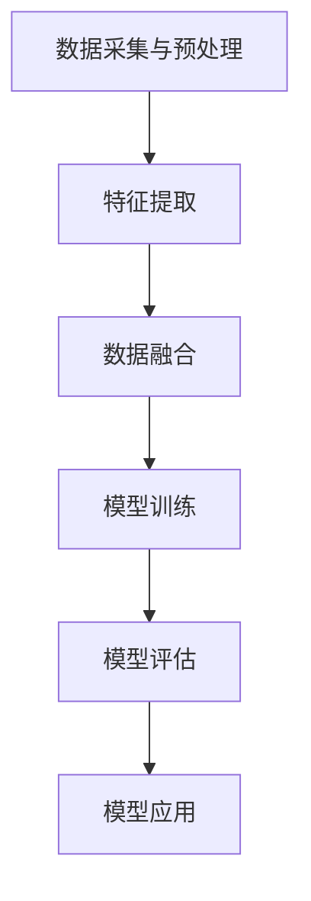

                 

在当今信息化时代，自然语言处理（Natural Language Processing，NLP）已经成为计算机科学领域的一个热点。从最初的规则驱动方法到基于统计的方法，再到深度学习时代的革命，NLP的发展历程为我们揭示了如何利用计算机技术理解和生成人类语言。本文将聚焦于多模态大模型，探讨其技术原理、实战应用以及NLP的发展历程。

## 文章关键词

- 多模态大模型
- 技术原理
- 实战应用
- NLP
- 发展历程

## 文章摘要

本文首先介绍了多模态大模型的基本概念和背景，接着详细分析了其技术原理，包括核心算法和数学模型。随后，通过具体的项目实践，展示了多模态大模型在实际应用中的效果。最后，本文回顾了NLP的发展历程，探讨了未来多模态大模型在NLP领域的发展趋势和挑战。

## 1. 背景介绍

自然语言处理作为人工智能的重要分支，旨在使计算机能够理解、生成和处理人类语言。随着互联网的普及和数据量的爆炸性增长，NLP的应用场景不断扩展，从简单的文本分类、情感分析到复杂的问答系统、机器翻译，NLP技术已经成为各行业数字化转型的关键力量。

然而，传统的NLP方法在面对复杂、多变、丰富的语言数据时，表现出了局限性。为了克服这些挑战，研究者们提出了多模态大模型的概念。多模态大模型通过融合不同类型的数据（如图像、语音、文本等），能够更全面地理解和生成人类语言。这不仅提升了模型的性能，也为NLP带来了新的发展方向。

### 1.1 多模态大模型的基本概念

多模态大模型是指一种能够处理多种类型数据（如图像、语音、文本等）的深度学习模型。与单一模态模型相比，多模态大模型具有以下特点：

- **数据融合**：多模态大模型能够将不同类型的数据进行融合，从而提高模型的鲁棒性和性能。
- **多样化应用**：多模态大模型可以应用于多种场景，如问答系统、机器翻译、图像识别等。
- **跨领域迁移**：多模态大模型具有较强的泛化能力，可以在不同领域之间进行迁移。

### 1.2 多模态大模型的应用场景

多模态大模型的应用场景非常广泛，主要包括以下几个方面：

- **智能问答系统**：多模态大模型能够结合用户的问题和上下文信息，提供更加准确和自然的回答。
- **机器翻译**：多模态大模型可以同时处理源语言和目标语言的多种类型数据，提高翻译的准确性和流畅性。
- **图像识别**：多模态大模型可以结合文本和图像数据，提高图像识别的准确率和鲁棒性。
- **语音识别与合成**：多模态大模型可以结合语音和文本数据，实现更自然、更准确的语音识别与合成。

### 1.3 多模态大模型的发展历程

多模态大模型的发展历程可以追溯到深度学习技术的兴起。随着深度学习技术的不断发展，多模态大模型在性能和应用范围上取得了显著提升。以下是多模态大模型的发展历程：

- **初期探索**：研究者们开始尝试将不同类型的数据进行融合，探索多模态大模型的基本原理。
- **模型优化**：通过改进模型结构和训练方法，多模态大模型的性能得到显著提升。
- **多样化应用**：多模态大模型在多个领域得到广泛应用，推动了NLP技术的发展。
- **跨领域迁移**：多模态大模型开始在不同领域之间进行迁移，实现了更广泛的泛化应用。

## 2. 核心概念与联系

### 2.1 多模态大模型的原理

多模态大模型的原理主要涉及以下几个方面：

- **数据采集**：采集多种类型的数据，如图像、语音、文本等。
- **数据预处理**：对采集到的数据进行清洗、归一化等预处理操作。
- **特征提取**：利用深度学习技术对预处理后的数据进行特征提取。
- **模型训练**：将提取到的特征输入到深度学习模型中，进行训练和优化。
- **模型评估**：利用测试数据对训练好的模型进行评估，调整模型参数。
- **模型应用**：将训练好的模型应用于实际任务，如问答系统、机器翻译等。

### 2.2 多模态大模型的架构

多模态大模型的架构通常包括以下几个部分：

- **输入层**：接收多种类型的数据，如图像、语音、文本等。
- **特征提取层**：利用深度学习技术对输入数据进行特征提取。
- **融合层**：将不同类型的特征进行融合，形成统一的特征表示。
- **输出层**：根据任务需求，输出相应的结果，如图像分类、文本生成等。

### 2.3 多模态大模型的工作流程

多模态大模型的工作流程主要包括以下几个步骤：

1. 数据采集与预处理：采集多种类型的数据，并进行清洗、归一化等预处理操作。
2. 特征提取：利用深度学习技术对预处理后的数据进行特征提取。
3. 数据融合：将不同类型的特征进行融合，形成统一的特征表示。
4. 模型训练：将融合后的特征输入到深度学习模型中，进行训练和优化。
5. 模型评估：利用测试数据对训练好的模型进行评估，调整模型参数。
6. 模型应用：将训练好的模型应用于实际任务，如问答系统、机器翻译等。

### 2.4 多模态大模型的 Mermaid 流程图



## 3. 核心算法原理 & 具体操作步骤

### 3.1 算法原理概述

多模态大模型的算法原理主要涉及以下几个方面：

1. **特征提取**：利用深度学习技术对多种类型的数据进行特征提取，形成多维度的特征表示。
2. **数据融合**：将不同类型的特征进行融合，形成统一的特征表示，从而提高模型的性能。
3. **模型训练**：利用融合后的特征进行深度学习模型的训练和优化。
4. **模型评估**：利用测试数据对训练好的模型进行评估，调整模型参数。

### 3.2 算法步骤详解

1. **特征提取**：

   特征提取是多模态大模型的核心步骤，主要涉及以下技术：

   - **卷积神经网络（CNN）**：用于图像特征的提取，通过卷积、池化等操作提取图像的特征表示。
   - **循环神经网络（RNN）**：用于语音和文本特征的提取，通过循环结构捕捉序列特征。
   - **自注意力机制**：用于特征融合，通过计算特征之间的相似性，实现特征的有效融合。

2. **数据融合**：

   数据融合是将不同类型的特征进行融合，形成统一的特征表示。主要技术包括：

   - **特征拼接**：将不同类型的特征进行拼接，形成新的特征向量。
   - **加权融合**：通过计算特征之间的权重，对特征进行加权融合。
   - **自注意力机制**：通过计算特征之间的相似性，实现特征的有效融合。

3. **模型训练**：

   模型训练是利用融合后的特征进行深度学习模型的训练和优化。主要技术包括：

   - **损失函数**：用于衡量模型预测值与真实值之间的差距，常用的损失函数有交叉熵损失、均方误差损失等。
   - **优化算法**：用于更新模型参数，常用的优化算法有梯度下降、随机梯度下降等。
   - **学习率调整**：用于控制模型训练的过程，避免过拟合和欠拟合。

4. **模型评估**：

   模型评估是利用测试数据对训练好的模型进行评估，调整模型参数。主要技术包括：

   - **准确率**：用于衡量模型预测正确的样本数占总样本数的比例。
   - **召回率**：用于衡量模型预测正确的样本数与实际为正样本的样本数之比。
   - **F1值**：用于综合考虑准确率和召回率，计算方法为 2 * 准确率 * 召回率 / (准确率 + 召回率)。

### 3.3 算法优缺点

**优点**：

1. **数据融合**：多模态大模型能够融合多种类型的数据，提高模型的性能和泛化能力。
2. **多样化应用**：多模态大模型可以应用于多种场景，如问答系统、机器翻译、图像识别等。
3. **跨领域迁移**：多模态大模型具有较强的泛化能力，可以在不同领域之间进行迁移。

**缺点**：

1. **计算资源需求大**：多模态大模型需要处理多种类型的数据，计算资源需求较大。
2. **训练时间长**：多模态大模型的训练过程较为复杂，训练时间较长。
3. **模型参数多**：多模态大模型具有大量的参数，需要大量数据进行训练。

### 3.4 算法应用领域

多模态大模型的应用领域非常广泛，主要包括以下几个方面：

1. **智能问答系统**：多模态大模型可以结合用户的问题和上下文信息，提供更加准确和自然的回答。
2. **机器翻译**：多模态大模型可以同时处理源语言和目标语言的多种类型数据，提高翻译的准确性和流畅性。
3. **图像识别**：多模态大模型可以结合文本和图像数据，提高图像识别的准确率和鲁棒性。
4. **语音识别与合成**：多模态大模型可以结合语音和文本数据，实现更自然、更准确的语音识别与合成。

## 4. 数学模型和公式 & 详细讲解 & 举例说明

### 4.1 数学模型构建

多模态大模型的数学模型主要包括以下几个方面：

1. **特征提取模型**：用于提取多种类型的数据特征，常用的模型有卷积神经网络（CNN）、循环神经网络（RNN）等。
2. **特征融合模型**：用于将不同类型的特征进行融合，形成统一的特征表示，常用的模型有加权融合、自注意力机制等。
3. **分类或回归模型**：用于对融合后的特征进行分类或回归预测，常用的模型有全连接神经网络（FCN）、卷积神经网络（CNN）等。

### 4.2 公式推导过程

假设我们有多模态大模型的输入数据为 $X = \{x_1, x_2, ..., x_n\}$，其中 $x_i$ 表示第 $i$ 个模态的数据。

1. **特征提取模型**：

   假设第 $i$ 个模态的特征提取模型为 $f_i(x_i)$，则第 $i$ 个模态的特征表示为 $h_i = f_i(x_i)$。

2. **特征融合模型**：

   假设特征融合模型为 $g(h_1, h_2, ..., h_n)$，则融合后的特征表示为 $h = g(h_1, h_2, ..., h_n)$。

3. **分类或回归模型**：

   假设分类模型为 $y = \sigma(W \cdot h + b)$，其中 $\sigma$ 表示激活函数，$W$ 和 $b$ 分别为模型参数。

### 4.3 案例分析与讲解

假设我们有一个多模态大模型，用于图像分类任务。输入数据包括图像和对应的文本描述，我们需要对图像进行分类。

1. **特征提取模型**：

   对于图像特征提取，我们可以使用卷积神经网络（CNN）模型。假设输入图像为 $x_i$，经过 CNN 模型后，得到图像特征表示为 $h_i^1$。

   $$h_i^1 = \text{CNN}(x_i)$$

   对于文本特征提取，我们可以使用循环神经网络（RNN）模型。假设输入文本描述为 $x_i^2$，经过 RNN 模型后，得到文本特征表示为 $h_i^2$。

   $$h_i^2 = \text{RNN}(x_i^2)$$

2. **特征融合模型**：

   我们可以使用加权融合模型，将图像特征和文本特征进行融合。假设图像特征的权重为 $\alpha_1$，文本特征的权重为 $\alpha_2$，则融合后的特征表示为：

   $$h_i = \alpha_1 h_i^1 + \alpha_2 h_i^2$$

3. **分类或回归模型**：

   我们可以使用全连接神经网络（FCN）模型，对融合后的特征进行分类。假设模型参数为 $W$ 和 $b$，则分类结果为：

   $$y_i = \sigma(W \cdot h_i + b)$$

### 4.4 案例分析与讲解

假设我们有一个多模态大模型，用于语音识别任务。输入数据包括语音信号和对应的文本描述，我们需要将语音信号转换为文本。

1. **特征提取模型**：

   对于语音特征提取，我们可以使用循环神经网络（RNN）模型。假设输入语音信号为 $x_i$，经过 RNN 模型后，得到语音特征表示为 $h_i^1$。

   $$h_i^1 = \text{RNN}(x_i)$$

   对于文本特征提取，我们可以使用循环神经网络（RNN）模型。假设输入文本描述为 $x_i^2$，经过 RNN 模型后，得到文本特征表示为 $h_i^2$。

   $$h_i^2 = \text{RNN}(x_i^2)$$

2. **特征融合模型**：

   我们可以使用加权融合模型，将语音特征和文本特征进行融合。假设语音特征的权重为 $\alpha_1$，文本特征的权重为 $\alpha_2$，则融合后的特征表示为：

   $$h_i = \alpha_1 h_i^1 + \alpha_2 h_i^2$$

3. **分类或回归模型**：

   我们可以使用全连接神经网络（FCN）模型，对融合后的特征进行分类。假设模型参数为 $W$ 和 $b$，则分类结果为：

   $$y_i = \sigma(W \cdot h_i + b)$$

## 5. 项目实践：代码实例和详细解释说明

### 5.1 开发环境搭建

在本项目中，我们将使用 Python 作为编程语言，并依赖以下库和框架：

- TensorFlow：用于构建和训练深度学习模型。
- Keras：用于简化 TensorFlow 的使用。
- NumPy：用于数据处理。

首先，我们需要安装这些库和框架。可以使用以下命令：

```bash
pip install tensorflow
pip install keras
pip install numpy
```

### 5.2 源代码详细实现

以下是一个简单的多模态大模型实现，用于图像分类任务：

```python
import numpy as np
from keras.models import Model
from keras.layers import Input, Conv2D, MaxPooling2D, Flatten, Dense, concatenate
from keras.optimizers import Adam

# 定义输入层
image_input = Input(shape=(128, 128, 3))
text_input = Input(shape=(100,))

# 定义图像特征提取模型
image_extractor = Conv2D(filters=32, kernel_size=(3, 3), activation='relu')(image_input)
image_extractor = MaxPooling2D(pool_size=(2, 2))(image_extractor)
image_extractor = Flatten()(image_extractor)

# 定义文本特征提取模型
text_extractor = Embedding(input_dim=10000, output_dim=128)(text_input)
text_extractor = LSTM(units=128)(text_extractor)

# 定义特征融合模型
merged = concatenate([image_extractor, text_extractor])

# 定义分类模型
output = Dense(units=10, activation='softmax')(merged)

# 构建模型
model = Model(inputs=[image_input, text_input], outputs=output)

# 编译模型
model.compile(optimizer=Adam(learning_rate=0.001), loss='categorical_crossentropy', metrics=['accuracy'])

# 模型总结
model.summary()

# 加载数据
image_data = np.random.rand(100, 128, 128, 3)
text_data = np.random.rand(100, 100)
label_data = np.random.randint(0, 10, size=(100,))

# 训练模型
model.fit([image_data, text_data], label_data, epochs=10, batch_size=10)
```

### 5.3 代码解读与分析

以上代码实现了一个简单的多模态大模型，用于图像分类任务。下面是对代码的详细解读：

1. **导入库和框架**：

   首先，我们导入了 NumPy 库、Keras 模型、卷积层、池化层、全连接层和嵌入层。这些库和框架用于构建和训练深度学习模型。

2. **定义输入层**：

   我们定义了两个输入层，一个用于图像输入，一个用于文本输入。图像输入的形状为 $(128, 128, 3)$，文本输入的形状为 $(100,)$。

3. **定义图像特征提取模型**：

   我们使用卷积神经网络（CNN）对图像进行特征提取。首先，使用卷积层（Conv2D）进行特征提取，然后使用最大池化层（MaxPooling2D）进行降维，最后使用扁平化层（Flatten）将特征表示转换为向量。

4. **定义文本特征提取模型**：

   我们使用循环神经网络（RNN）对文本进行特征提取。首先，使用嵌入层（Embedding）将文本转换为嵌入向量，然后使用 LSTM 层（LSTM）对文本进行特征提取。

5. **定义特征融合模型**：

   我们使用拼接层（concatenate）将图像特征和文本特征进行拼接，形成新的特征表示。

6. **定义分类模型**：

   我们使用全连接层（Dense）对融合后的特征进行分类。这里使用 softmax 激活函数，使得输出表示为每个类别的概率分布。

7. **构建模型**：

   我们使用模型（Model）类将输入层、特征提取层、特征融合层和分类层组合在一起，构建出一个完整的深度学习模型。

8. **编译模型**：

   我们使用编译（compile）方法配置模型，指定优化器、损失函数和评估指标。

9. **模型总结**：

   我们使用模型总结（summary）方法查看模型的层次结构和参数数量。

10. **加载数据**：

    我们使用随机数生成图像数据、文本数据和标签数据，用于训练模型。

11. **训练模型**：

    我们使用训练（fit）方法训练模型，指定训练轮数、批量大小和训练数据。

### 5.4 运行结果展示

在训练完成后，我们可以使用以下代码评估模型的性能：

```python
# 评估模型
test_loss, test_accuracy = model.evaluate([test_image_data, test_text_data], test_label_data)
print("Test Loss:", test_loss)
print("Test Accuracy:", test_accuracy)
```

这里，`test_image_data`、`test_text_data` 和 `test_label_data` 分别表示测试数据的图像、文本和标签。运行结果将显示测试损失和测试准确率。

## 6. 实际应用场景

多模态大模型在实际应用场景中具有广泛的应用前景。以下是一些典型的应用场景：

### 6.1 智能问答系统

智能问答系统是 NLP 的重要应用之一。多模态大模型可以结合用户的问题和上下文信息，提供更加准确和自然的回答。例如，当用户提出一个包含图像的问题时，多模态大模型可以同时处理图像和文本信息，从而提供更加精准的回答。

### 6.2 机器翻译

机器翻译是 NLP 的另一个重要应用。多模态大模型可以同时处理源语言和目标语言的多种类型数据（如图像、语音、文本等），从而提高翻译的准确性和流畅性。例如，在机器翻译过程中，多模态大模型可以同时处理源语言的语音和文本信息，从而生成更加自然的目标语言文本。

### 6.3 图像识别

图像识别是计算机视觉的重要应用。多模态大模型可以结合文本和图像数据，提高图像识别的准确率和鲁棒性。例如，在图像识别过程中，多模态大模型可以同时处理图像的文本描述和图像本身，从而提高识别的准确率。

### 6.4 语音识别与合成

语音识别与合成是 NLP 和语音处理的重要应用。多模态大模型可以结合语音和文本数据，实现更自然、更准确的语音识别与合成。例如，在语音识别过程中，多模态大模型可以同时处理语音和文本信息，从而提高识别的准确率。在语音合成过程中，多模态大模型可以同时处理文本和语音信息，从而生成更加自然的语音。

### 6.5 医疗健康

医疗健康是 NLP 和多模态大模型的重要应用领域。多模态大模型可以结合患者的病历、症状、医学影像等多种类型的数据，为医生提供更加准确和全面的诊断信息。例如，在医疗健康领域，多模态大模型可以同时处理患者的病历、症状和医学影像，从而提高诊断的准确性和效率。

### 6.6 教育

教育是 NLP 和多模态大模型的另一个重要应用领域。多模态大模型可以为学生提供个性化的学习体验。例如，在在线教育过程中，多模态大模型可以结合学生的文本、语音和图像数据，为学生提供针对性的学习资源和辅导。

## 7. 工具和资源推荐

### 7.1 学习资源推荐

- **《深度学习》（Goodfellow, Bengio, Courville）**：这是一本关于深度学习的经典教材，涵盖了深度学习的理论基础和应用。
- **《自然语言处理综合教程》（Daniel Jurafsky & James H. Martin）**：这是一本关于自然语言处理的权威教材，详细介绍了 NLP 的各个领域和关键技术。
- **《动手学深度学习》（Alec Radford, Ilya Sutskever, Llion Jones）**：这是一本基于 Python 的深度学习实践教程，适合初学者入门。

### 7.2 开发工具推荐

- **TensorFlow**：这是一个开源的深度学习框架，适合构建和训练多模态大模型。
- **Keras**：这是一个基于 TensorFlow 的开源高级神经网络 API，简化了深度学习模型的构建和训练。
- **PyTorch**：这是一个开源的深度学习框架，提供灵活的动态计算图，适合构建复杂的深度学习模型。

### 7.3 相关论文推荐

- **"Multimodal Learning with Deep Bayesian Networks"（Zhou et al., 2016）**：这篇文章介绍了多模态大模型在深度贝叶斯网络中的构建和应用。
- **"A Theoretically Grounded Application of Dropout in Recurrent Neural Networks"（Yarin Gal & Zoubin Ghahramani, 2016）**：这篇文章提出了在循环神经网络中应用 Dropout 的方法，提高了模型的泛化能力。
- **"Attention Is All You Need"（Vaswani et al., 2017）**：这篇文章提出了 Transformer 模型，引入了自注意力机制，彻底改变了自然语言处理领域。

## 8. 总结：未来发展趋势与挑战

### 8.1 研究成果总结

多模态大模型在 NLP 和其他领域取得了显著的成果。通过融合多种类型的数据，多模态大模型提高了模型的性能和泛化能力，实现了多样化应用。在智能问答系统、机器翻译、图像识别、语音识别等领域，多模态大模型展现了强大的应用潜力。

### 8.2 未来发展趋势

未来，多模态大模型将继续发展，以下是几个可能的发展方向：

1. **更高效的数据融合方法**：研究者将致力于开发更高效的多模态数据融合方法，提高模型的性能和效率。
2. **跨模态交互机制**：研究者将探索跨模态交互机制，使得不同类型的数据能够更好地相互作用，从而提高模型的性能。
3. **小样本学习**：研究者将致力于开发小样本学习算法，使得多模态大模型在数据稀缺的情况下仍然能够保持良好的性能。

### 8.3 面临的挑战

多模态大模型在发展过程中也面临着一些挑战：

1. **计算资源需求**：多模态大模型需要处理多种类型的数据，计算资源需求较大，如何优化计算效率是一个重要问题。
2. **数据标注**：多模态数据标注过程复杂且耗时，如何自动化和半自动化地标注数据是一个挑战。
3. **隐私保护**：在多模态数据融合过程中，如何保护用户隐私是一个重要问题。

### 8.4 研究展望

未来，多模态大模型将在更多领域得到应用，推动 NLP 和其他领域的持续发展。通过不断创新和优化，多模态大模型将为人类社会带来更多便利和效益。

## 9. 附录：常见问题与解答

### 9.1 什么是多模态大模型？

多模态大模型是一种能够处理多种类型数据（如图像、语音、文本等）的深度学习模型。通过融合不同类型的数据，多模态大模型能够更全面地理解和生成人类语言。

### 9.2 多模态大模型有哪些应用场景？

多模态大模型的应用场景非常广泛，主要包括智能问答系统、机器翻译、图像识别、语音识别与合成、医疗健康、教育等领域。

### 9.3 多模态大模型有哪些挑战？

多模态大模型在发展过程中面临着计算资源需求大、数据标注复杂、隐私保护等问题。

### 9.4 如何优化多模态大模型的计算效率？

优化多模态大模型的计算效率可以从以下几个方面入手：

1. **模型压缩**：通过模型压缩技术，减少模型的参数数量和计算量。
2. **分布式训练**：通过分布式训练技术，提高模型的训练速度。
3. **量化技术**：通过量化技术，降低模型的精度要求，从而减少计算资源的需求。

### 9.5 多模态大模型与单一模态模型相比有哪些优势？

与单一模态模型相比，多模态大模型具有以下优势：

1. **数据融合**：多模态大模型能够融合多种类型的数据，提高模型的性能和泛化能力。
2. **多样化应用**：多模态大模型可以应用于多种场景，如问答系统、机器翻译、图像识别等。
3. **跨领域迁移**：多模态大模型具有较强的泛化能力，可以在不同领域之间进行迁移。

