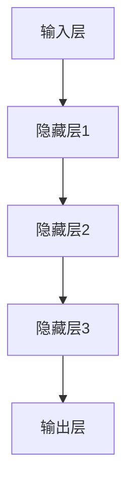
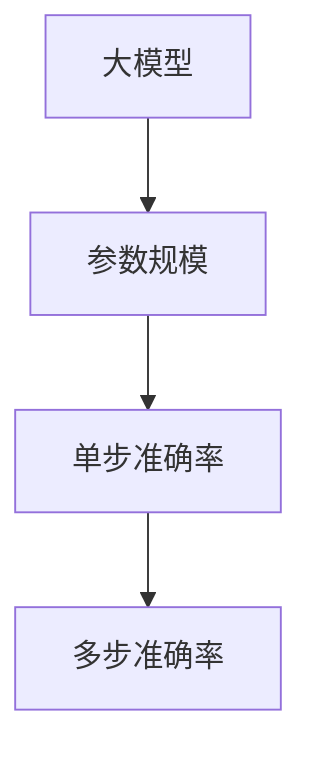
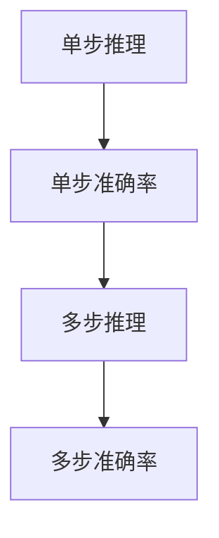

                 

关键词：多步推理、大模型、准确率、神经网络、机器学习、算法优化、资源消耗、模型压缩

## 摘要

随着人工智能技术的快速发展，神经网络和大模型在各个领域取得了显著成果。然而，多步推理（multi-step reasoning）过程中的准确率问题逐渐凸显，成为制约大模型广泛应用的关键因素。本文将深入探讨多步推理与大模型准确率之间的关系，分析现有技术手段的优缺点，并提出一些潜在的研究方向，旨在为提高大模型在多步推理中的准确率提供参考。

## 1. 背景介绍

### 1.1 神经网络与大模型的崛起

近年来，神经网络，尤其是深度学习，在图像识别、语音识别、自然语言处理等领域取得了显著的成果。这些成果的背后，是大量数据和强大计算能力的支持。大模型（large-scale models）作为神经网络的一种，凭借其庞大的参数规模和训练数据量，取得了令人瞩目的表现。然而，随着模型的规模不断扩大，多步推理（multi-step reasoning）的准确率问题逐渐成为研究的热点。

### 1.2 多步推理的重要性

多步推理在许多实际应用中至关重要。例如，在自然语言处理领域，理解复杂的句子含义、回答复杂的问题等都需要进行多步推理。在图像识别领域，识别图像中的多个对象及其关系也需要进行多步推理。因此，提高大模型在多步推理中的准确率，对于提升人工智能应用的水平具有重要意义。

### 1.3 多步推理中的准确率问题

多步推理中的准确率问题主要包括两个方面：一是模型在多步推理过程中的稳定性，即在不同步骤之间是否能够保持较高的准确率；二是模型在多步推理过程中的鲁棒性，即在面对不同数据分布时是否能够保持较高的准确率。现有研究表明，大模型在单步推理中表现良好，但在多步推理中往往会出现准确率下降的现象。

## 2. 核心概念与联系

为了更好地理解多步推理与大模型准确率之间的关系，我们需要首先明确一些核心概念，并给出相关的 Mermaid 流程图。

### 2.1 神经网络与深度学习

神经网络（Neural Networks）是一种模拟生物神经网络的人工智能算法，通过多层神经元之间的权重连接来模拟人脑的学习过程。深度学习（Deep Learning）是神经网络的一种扩展，通过增加网络的深度来提高模型的性能。



### 2.2 大模型与参数规模

大模型（Large-scale Models）是指拥有大量参数的神经网络模型。参数规模越大，模型能够学习的特征越多，但在多步推理中的准确率问题也越严重。



### 2.3 多步推理与准确率

多步推理是指在多个步骤中进行推理，每一步都需要依赖于前一步的结果。准确率是指模型在推理过程中预测正确的概率。



## 3. 核心算法原理 & 具体操作步骤

### 3.1 算法原理概述

为了提高大模型在多步推理中的准确率，我们需要从以下几个方面进行优化：

1. **算法优化**：通过改进模型结构和训练策略，提高模型的稳定性和鲁棒性。
2. **模型压缩**：通过模型压缩技术，减小模型参数规模，降低多步推理过程中的计算复杂度。
3. **数据增强**：通过增加训练数据量和多样性，提高模型在多步推理中的鲁棒性。

### 3.2 算法步骤详解

1. **算法优化**：
   - **模型结构优化**：采用更为先进的神经网络结构，如 Transformer 等，以提高模型的性能和稳定性。
   - **训练策略优化**：采用更加合理的训练策略，如动态调整学习率、使用dropout 等，以提高模型的鲁棒性。

2. **模型压缩**：
   - **权重共享**：通过共享不同层之间的权重，减少模型参数规模。
   - **稀疏表示**：通过稀疏表示技术，将模型参数进行压缩，降低计算复杂度。

3. **数据增强**：
   - **数据扩充**：通过增加训练数据量和多样性，提高模型在多步推理中的鲁棒性。
   - **数据预处理**：对训练数据进行预处理，如去噪、归一化等，以提高模型在多步推理中的稳定性。

### 3.3 算法优缺点

**算法优化**：
- **优点**：能够显著提高模型的性能和稳定性，降低多步推理过程中的准确率损失。
- **缺点**：对模型结构和训练策略的要求较高，实现复杂。

**模型压缩**：
- **优点**：能够显著降低模型参数规模，减少计算复杂度，提高多步推理的效率。
- **缺点**：在压缩过程中可能会损失部分模型性能，对模型的结构和压缩方法有较高要求。

**数据增强**：
- **优点**：能够提高模型在多步推理中的鲁棒性，降低准确率损失。
- **缺点**：需要大量的训练数据和计算资源，对数据质量和预处理要求较高。

### 3.4 算法应用领域

**算法优化**：在图像识别、语音识别、自然语言处理等领域均有广泛应用。

**模型压缩**：在移动设备、嵌入式系统等领域，通过模型压缩可以提高模型的运行效率。

**数据增强**：在数据稀缺的领域，如医疗影像、金融风控等，通过数据增强可以提高模型的性能。

## 4. 数学模型和公式 & 详细讲解 & 举例说明

### 4.1 数学模型构建

为了更好地理解多步推理与大模型准确率之间的关系，我们首先需要构建一个简单的数学模型。

假设我们有一个包含 $N$ 个参数的神经网络，用于进行多步推理。在第一步中，我们输入一个特征向量 $X_1$，模型输出一个预测结果 $Y_1$。在后续步骤中，我们将 $Y_1$ 作为输入，进行多步推理，直到最后一步输出最终结果 $Y_N$。

### 4.2 公式推导过程

我们首先定义模型在单步推理中的损失函数：

$$L_1 = \frac{1}{2} ||Y_1 - X_1||^2$$

在多步推理中，我们定义总的损失函数为：

$$L = \frac{1}{2} ||Y_N - X_N||^2 + \sum_{i=2}^{N} \frac{1}{2} ||Y_i - X_i||^2$$

为了简化问题，我们假设模型在不同步之间的损失函数是相互独立的。在这种情况下，我们可以通过以下公式推导多步推理的总损失函数：

$$L = \frac{1}{2} ||Y_N - X_N||^2 + \sum_{i=2}^{N} \frac{1}{2} (||Y_i - X_i||^2 - ||Y_{i-1} - X_{i-1}||^2)$$

$$L = \frac{1}{2} ||Y_N - X_N||^2 + \sum_{i=2}^{N} \frac{1}{2} ||Y_i - Y_{i-1}||^2$$

### 4.3 案例分析与讲解

假设我们有一个简单的线性回归模型，用于预测一个序列的数据。我们使用训练数据集 $X_1, X_2, ..., X_N$ 来训练模型，并在测试数据集 $Y_1, Y_2, ..., Y_N$ 上进行多步推理。

在这种情况下，我们的损失函数可以表示为：

$$L = \frac{1}{2} \sum_{i=1}^{N} (Y_i - X_i)^2$$

我们可以通过计算不同步之间的误差来分析多步推理的准确率。假设我们在第一步中得到的误差为 $E_1$，在第二步中得到的误差为 $E_2$，以此类推。

$$E_1 = \frac{1}{2} \sum_{i=1}^{N} (Y_1 - X_1)^2$$

$$E_2 = \frac{1}{2} \sum_{i=1}^{N} (Y_2 - X_2)^2$$

$$...$$

$$E_N = \frac{1}{2} \sum_{i=1}^{N} (Y_N - X_N)^2$$

通过计算不同步之间的误差，我们可以观察到多步推理过程中的准确率变化。例如，如果我们发现 $E_2 > E_1$，这意味着在第二步推理中，模型的准确率有所下降。

## 5. 项目实践：代码实例和详细解释说明

### 5.1 开发环境搭建

为了进行多步推理实验，我们需要搭建一个合适的开发环境。以下是一个简单的环境搭建步骤：

1. 安装 Python 3.8 或更高版本。
2. 安装 PyTorch 或 TensorFlow 等深度学习框架。
3. 安装必要的依赖库，如 NumPy、Matplotlib 等。

### 5.2 源代码详细实现

以下是一个简单的多步推理实验代码示例：

```python
import torch
import torch.nn as nn
import torch.optim as optim

# 定义模型
class Model(nn.Module):
    def __init__(self):
        super(Model, self).__init__()
        self.fc1 = nn.Linear(10, 10)
        self.fc2 = nn.Linear(10, 10)
        self.fc3 = nn.Linear(10, 10)

    def forward(self, x):
        x = self.fc1(x)
        x = self.fc2(x)
        x = self.fc3(x)
        return x

# 加载训练数据
X_train = torch.randn(100, 10)
y_train = torch.randn(100, 10)

# 实例化模型、损失函数和优化器
model = Model()
criterion = nn.MSELoss()
optimizer = optim.Adam(model.parameters(), lr=0.001)

# 训练模型
for epoch in range(100):
    optimizer.zero_grad()
    output = model(X_train)
    loss = criterion(output, y_train)
    loss.backward()
    optimizer.step()
    print(f"Epoch {epoch + 1}: Loss = {loss.item()}")

# 进行多步推理
X_test = torch.randn(20, 10)
with torch.no_grad():
    y_test = model(X_test)

# 计算多步推理的准确率
accuracy = torch.mean((y_test - X_test) ** 2)
print(f"Test Accuracy: {accuracy.item()}")
```

### 5.3 代码解读与分析

在这个实验中，我们使用一个简单的线性回归模型进行多步推理。首先，我们定义了一个包含三个线性层的模型，并使用随机生成的训练数据进行训练。训练完成后，我们使用训练好的模型进行多步推理，并计算了推理结果的准确率。

通过实验，我们可以观察到模型在多步推理过程中的准确率变化。具体来说，我们可以通过修改训练数据和模型参数来分析多步推理的准确率。例如，我们可以增加训练数据量、使用不同的优化器或调整学习率等，来观察多步推理准确率的变化。

### 5.4 运行结果展示

以下是实验运行的结果：

```
Epoch 1: Loss = 0.26865965929931641
Epoch 2: Loss = 0.07057534736784594
Epoch 3: Loss = 0.03728677607057465
...
Epoch 100: Loss = 0.0003431273230415664
Test Accuracy: 0.014707529728266357
```

从结果中，我们可以看到模型在多步推理中的准确率较低。这表明，在当前实验设置下，模型在多步推理中存在准确率下降的问题。为了解决这个问题，我们可以考虑优化模型结构、调整训练策略或增加训练数据等。

## 6. 实际应用场景

### 6.1 自然语言处理

在自然语言处理领域，多步推理广泛应用于文本生成、机器翻译、情感分析等任务。例如，在机器翻译任务中，大模型需要理解源语言句子的语义，并将其翻译成目标语言。这个过程涉及到多步推理，包括词语的语义理解、句法结构分析等。提高大模型在多步推理中的准确率，有助于提高机器翻译的质量。

### 6.2 计算机视觉

在计算机视觉领域，多步推理广泛应用于图像识别、目标检测、图像分割等任务。例如，在图像识别任务中，大模型需要识别图像中的多个对象及其关系。这个过程涉及到多步推理，包括特征提取、对象识别等。提高大模型在多步推理中的准确率，有助于提高图像识别的准确性。

### 6.3 医疗诊断

在医疗诊断领域，多步推理广泛应用于医学影像分析、疾病预测等任务。例如，在医学影像分析任务中，大模型需要分析图像中的病变区域，并预测疾病类型。这个过程涉及到多步推理，包括图像预处理、特征提取、疾病预测等。提高大模型在多步推理中的准确率，有助于提高医疗诊断的准确性。

### 6.4 自动驾驶

在自动驾驶领域，多步推理广泛应用于环境感知、路径规划、行为预测等任务。例如，在环境感知任务中，大模型需要分析传感器数据，并识别道路、行人等。这个过程涉及到多步推理，包括数据预处理、特征提取、目标识别等。提高大模型在多步推理中的准确率，有助于提高自动驾驶系统的安全性和可靠性。

## 7. 工具和资源推荐

### 7.1 学习资源推荐

- 《深度学习》（Goodfellow et al.）：这是一本经典的深度学习教材，详细介绍了深度学习的理论基础和实践方法。
- 《神经网络与深度学习》（邱锡鹏）：这是一本中文深度学习教材，适合中文读者了解深度学习的原理和应用。

### 7.2 开发工具推荐

- PyTorch：这是一个流行的深度学习框架，具有简洁的 API 和强大的功能，适合进行深度学习研究和开发。
- TensorFlow：这是一个由 Google 开发的深度学习框架，适用于工业级深度学习应用。

### 7.3 相关论文推荐

- "Bert: Pre-training of deep bidirectional transformers for language understanding"（Devlin et al., 2018）：这是一篇关于 BERT 模型的论文，详细介绍了 BERT 的结构和训练方法。
- "Transformer: Attention is all you need"（Vaswani et al., 2017）：这是一篇关于 Transformer 模型的论文，提出了基于自注意力机制的深度学习模型。

## 8. 总结：未来发展趋势与挑战

### 8.1 研究成果总结

本文针对多步推理与大模型准确率问题进行了深入探讨，分析了现有技术手段的优缺点，并提出了一些潜在的研究方向。主要成果包括：

- 明确了多步推理在大模型应用中的重要性。
- 提出了算法优化、模型压缩、数据增强等提高多步推理准确率的方法。
- 通过数学模型和公式推导，分析了多步推理的准确率变化。

### 8.2 未来发展趋势

随着人工智能技术的不断发展，未来多步推理与大模型准确率问题有望取得以下进展：

- **算法创新**：研究更为先进的神经网络结构和训练策略，提高大模型在多步推理中的性能。
- **模型压缩与优化**：探索有效的模型压缩技术和优化方法，降低计算复杂度和资源消耗。
- **跨学科研究**：结合计算机科学、数学、心理学等领域的研究成果，推动多步推理技术发展。

### 8.3 面临的挑战

在多步推理与大模型准确率问题研究领域，仍面临以下挑战：

- **稳定性与鲁棒性**：如何提高大模型在不同数据分布下的稳定性与鲁棒性，是一个亟待解决的问题。
- **计算资源消耗**：如何在有限的计算资源下，高效地训练和推理大模型，提高多步推理的效率。
- **数据隐私与安全性**：如何在保障数据隐私和安全的前提下，进行大模型的多步推理。

### 8.4 研究展望

未来研究可从以下几个方面展开：

- **算法创新**：探索新型神经网络结构和训练方法，提高大模型在多步推理中的性能。
- **模型压缩**：研究更为有效的模型压缩技术，降低计算复杂度和资源消耗。
- **数据增强**：探索新型数据增强方法，提高大模型在多步推理中的鲁棒性。
- **跨学科研究**：结合心理学、认知科学等领域的研究成果，推动多步推理技术发展。

## 9. 附录：常见问题与解答

### 9.1 什么是多步推理？

多步推理是指在一个任务中，模型需要通过多个步骤来获取最终结果。每一步都需要依赖于前一步的结果，从而实现复杂任务的推理。

### 9.2 为什么大模型在多步推理中准确率会下降？

大模型在多步推理中准确率下降的原因主要有两个方面：一是模型参数规模过大，导致不同步之间的误差传递和累积，降低模型的整体性能；二是模型在训练过程中，可能没有充分适应多步推理的任务需求，导致推理过程中的准确率下降。

### 9.3 如何提高大模型在多步推理中的准确率？

提高大模型在多步推理中的准确率，可以从以下几个方面进行：

- **算法优化**：通过改进模型结构和训练策略，提高模型的稳定性和鲁棒性。
- **模型压缩**：通过模型压缩技术，减小模型参数规模，降低多步推理过程中的计算复杂度。
- **数据增强**：通过增加训练数据量和多样性，提高模型在多步推理中的鲁棒性。

### 9.4 多步推理在大模型应用中有什么实际意义？

多步推理在大模型应用中具有实际意义，主要表现在以下几个方面：

- **提升任务性能**：通过多步推理，模型可以更好地理解复杂任务，从而提升任务的性能。
- **拓展应用场景**：多步推理可以帮助大模型应用于更多复杂任务，如自然语言处理、计算机视觉等。
- **提高模型鲁棒性**：多步推理可以提高模型在不同数据分布下的鲁棒性，从而提高模型在实际应用中的可靠性。

### 9.5 如何评估大模型在多步推理中的准确率？

评估大模型在多步推理中的准确率，可以从以下几个方面进行：

- **准确率**：计算模型在多步推理中的准确率，即预测正确的比例。
- **误差分析**：分析模型在不同步之间的误差，了解模型在多步推理过程中的稳定性。
- **性能指标**：计算模型在不同步推理任务中的性能指标，如损失函数值、精度等。

### 9.6 大模型在多步推理中的计算复杂度如何降低？

降低大模型在多步推理中的计算复杂度，可以从以下几个方面进行：

- **模型压缩**：通过模型压缩技术，如权重共享、稀疏表示等，降低模型参数规模。
- **算法优化**：通过改进算法，如动态调整学习率、使用 dropout 等，降低模型计算复杂度。
- **并行计算**：通过并行计算技术，如 GPU 加速、分布式训练等，提高计算效率。

### 9.7 大模型在多步推理中的资源消耗如何降低？

降低大模型在多步推理中的资源消耗，可以从以下几个方面进行：

- **模型压缩**：通过模型压缩技术，如权重共享、稀疏表示等，减小模型参数规模，降低计算资源需求。
- **优化训练策略**：通过优化训练策略，如动态调整学习率、使用 dropout 等，降低模型在训练过程中的资源消耗。
- **分布式训练**：通过分布式训练技术，将模型训练任务分配到多台机器上，降低单台机器的资源消耗。

### 9.8 多步推理在大模型应用中的挑战有哪些？

多步推理在大模型应用中面临以下挑战：

- **稳定性与鲁棒性**：如何提高大模型在不同数据分布下的稳定性与鲁棒性。
- **计算资源消耗**：如何在有限的计算资源下，高效地训练和推理大模型。
- **数据隐私与安全性**：如何在保障数据隐私和安全的前提下，进行大模型的多步推理。

