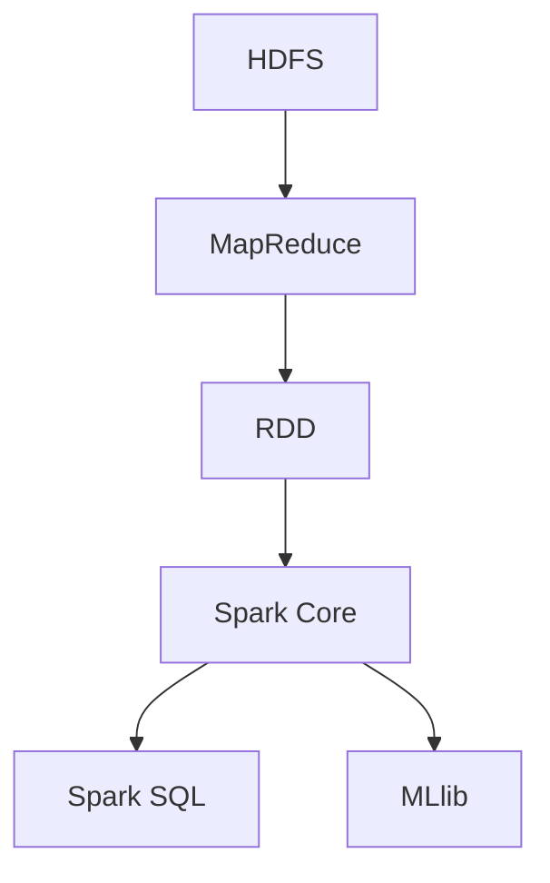

                 

关键词：大数据处理，Hadoop，Spark，数据处理框架，分布式计算，MapReduce，实时计算，机器学习。

摘要：本文旨在探讨大数据处理领域中的两大重要框架：Hadoop和Spark。通过对它们的背景、核心概念、算法原理、数学模型、实际应用案例的深入剖析，我们将揭示它们在大数据处理中的关键作用，并展望它们未来的发展趋势与挑战。

## 1. 背景介绍

随着互联网和移动设备的普及，数据量呈爆炸式增长。传统的数据处理方式已经无法满足这种海量数据的处理需求。为了应对这种挑战，大数据处理框架应运而生。Hadoop和Spark是其中最为知名的两个框架。

Hadoop是由Apache Software Foundation开发的分布式数据处理框架，基于Google的MapReduce模型。它主要用于处理大规模的数据集，支持数据的存储、检索和分析。

Spark是另一种流行的分布式数据处理框架，它提供了更快、更灵活的数据处理能力。Spark的核心是弹性分布式数据集（RDD），它可以进行快速的迭代处理，适用于实时计算和机器学习任务。

## 2. 核心概念与联系

在深入探讨Hadoop和Spark之前，我们需要了解一些核心概念和它们之间的联系。

### 2.1 分布式计算

分布式计算是将计算任务分布在多个计算节点上执行的一种计算方式。这种方式可以充分利用多个节点的计算能力，提高数据处理效率。

### 2.2 HDFS

HDFS（Hadoop Distributed File System）是Hadoop的分布式文件系统，它将大文件拆分成小块存储在多个节点上，提供了高可靠性、高吞吐量的数据存储能力。

### 2.3 MapReduce

MapReduce是Hadoop的核心算法，用于处理大规模数据集。它将数据处理任务分为“Map”和“Reduce”两个阶段，可以有效地处理分布式数据。

### 2.4 RDD

RDD（Resilient Distributed Dataset）是Spark的核心数据结构，它是一个不可变的分布式数据集，提供了丰富的操作接口，支持快速的迭代处理。

### 2.5 Spark Core

Spark Core是Spark的核心模块，提供了RDD的基本操作、任务调度和内存管理等功能。

### 2.6 Spark SQL

Spark SQL是Spark的SQL查询模块，提供了用于处理结构化数据的接口，支持多种数据源，如Hive、Parquet等。

### 2.7 MLlib

MLlib是Spark的机器学习库，提供了多种机器学习算法的实现，如分类、回归、聚类等。

### 2.8 Mermaid 流程图

为了更好地理解Hadoop和Spark的工作流程，我们可以使用Mermaid流程图来展示它们的核心概念和联系。



## 3. 核心算法原理 & 具体操作步骤

### 3.1 算法原理概述

#### 3.1.1 Hadoop

Hadoop的核心算法是MapReduce，它将数据处理任务分为Map和Reduce两个阶段。

- **Map阶段**：将输入数据拆分成小块，对每个小块进行映射处理，生成中间键值对。
- **Reduce阶段**：将Map阶段生成的中间键值对进行聚合处理，生成最终输出。

#### 3.1.2 Spark

Spark的核心算法是RDD，它提供了多种操作，如`map()`, `filter()`, `reduce()`等。

- **map()**：对RDD中的每个元素进行映射处理。
- **filter()**：对RDD中的元素进行过滤处理。
- **reduce()**：对RDD中的元素进行聚合处理。

### 3.2 算法步骤详解

#### 3.2.1 Hadoop

1. 将输入数据分块，存储在HDFS中。
2. 启动Map任务，对每个数据块进行映射处理，生成中间键值对。
3. 将中间键值对写入本地磁盘。
4. 启动Reduce任务，对本地磁盘中的中间键值对进行聚合处理，生成最终输出。

#### 3.2.2 Spark

1. 创建RDD，从数据源读取数据。
2. 对RDD进行映射处理，生成中间键值对。
3. 对中间键值对进行过滤处理，筛选出符合要求的元素。
4. 对RDD进行聚合处理，生成最终输出。

### 3.3 算法优缺点

#### 3.3.1 Hadoop

- **优点**：适用于处理大规模数据集，具有高可靠性、高吞吐量的特点。
- **缺点**：处理速度较慢，不适合实时计算。

#### 3.3.2 Spark

- **优点**：处理速度更快，适用于实时计算和迭代处理。
- **缺点**：相对于Hadoop，HDFS存储成本较高。

### 3.4 算法应用领域

- **Hadoop**：适用于离线数据处理，如日志分析、数据挖掘等。
- **Spark**：适用于实时数据处理，如实时推荐、实时监控等。

## 4. 数学模型和公式 & 详细讲解 & 举例说明

### 4.1 数学模型构建

#### 4.1.1 Hadoop

假设我们有一个包含N个元素的数据集D，我们希望计算D中所有元素的和。

- **Map阶段**：对于每个元素x，映射出一个(x, 1)的键值对。
- **Reduce阶段**：对所有(x, 1)的键值对进行聚合，计算总和。

$$
\sum_{x \in D} x = \sum_{i=1}^N (x_i, 1) \rightarrow (1, \sum_{i=1}^N 1) = (1, N)
$$

#### 4.1.2 Spark

假设我们有一个包含N个元素的数据集D，我们希望计算D中所有元素的和。

- **map()**：对每个元素x，映射出一个(x, 1)的键值对。
- **reduce()**：对所有(x, 1)的键值对进行聚合，计算总和。

$$
\sum_{x \in D} x = \sum_{i=1}^N (x_i, 1) \rightarrow (1, \sum_{i=1}^N 1) = (1, N)
$$

### 4.2 公式推导过程

假设我们有一个数据集D，其中包含N个元素。我们希望计算D中所有元素的和。

- **Hadoop**：
  - **Map阶段**：对于每个元素x，映射出一个(x, 1)的键值对。
    $$ f(x) = (x, 1) $$
  - **Reduce阶段**：对所有(x, 1)的键值对进行聚合，计算总和。
    $$ g((x_1, 1), (x_2, 1), ..., (x_N, 1)) = (1, \sum_{i=1}^N 1) = (1, N) $$
  - **最终结果**：
    $$ \sum_{x \in D} x = \sum_{i=1}^N x_i = N $$

- **Spark**：
  - **map()**：对每个元素x，映射出一个(x, 1)的键值对。
    $$ f(x) = (x, 1) $$
  - **reduce()**：对所有(x, 1)的键值对进行聚合，计算总和。
    $$ g((x_1, 1), (x_2, 1), ..., (x_N, 1)) = (1, \sum_{i=1}^N 1) = (1, N) $$
  - **最终结果**：
    $$ \sum_{x \in D} x = \sum_{i=1}^N x_i = N $$

### 4.3 案例分析与讲解

假设我们有一个包含100个元素的数据集D，其中每个元素的范围在1到100之间。我们希望计算D中所有元素的和。

#### Hadoop

1. **Map阶段**：将每个元素映射成一个(x, 1)的键值对。
   $$ f(x) = (x, 1) $$
   输出：(1, 1), (2, 1), ..., (100, 1)

2. **Reduce阶段**：对所有(x, 1)的键值对进行聚合，计算总和。
   $$ g((x_1, 1), (x_2, 1), ..., (x_N, 1)) = (1, \sum_{i=1}^N 1) = (1, 100) $$
   输出：(1, 100)

3. **最终结果**：D中所有元素的和为100。

#### Spark

1. **map()**：将每个元素映射成一个(x, 1)的键值对。
   $$ f(x) = (x, 1) $$
   输出：(1, 1), (2, 1), ..., (100, 1)

2. **reduce()**：对所有(x, 1)的键值对进行聚合，计算总和。
   $$ g((x_1, 1), (x_2, 1), ..., (x_N, 1)) = (1, \sum_{i=1}^N 1) = (1, 100) $$
   输出：(1, 100)

3. **最终结果**：D中所有元素的和为100。

## 5. 项目实践：代码实例和详细解释说明

### 5.1 开发环境搭建

1. 安装Java开发工具包（JDK）。
2. 下载并解压Hadoop和Spark的安装包。
3. 配置环境变量，设置Hadoop和Spark的安装路径。
4. 启动Hadoop和Spark的集群。

### 5.2 源代码详细实现

以下是一个简单的Hadoop和Spark程序，用于计算数据集D中所有元素的和。

#### Hadoop

```java
import org.apache.hadoop.conf.Configuration;
import org.apache.hadoop.fs.Path;
import org.apache.hadoop.io.IntWritable;
import org.apache.hadoop.io.Text;
import org.apache.hadoop.mapreduce.Job;
import org.apache.hadoop.mapreduce.Mapper;
import org.apache.hadoop.mapreduce.Reducer;
import org.apache.hadoop.mapreduce.lib.input.FileInputFormat;
import org.apache.hadoop.mapreduce.lib.output.FileOutputFormat;

public class SumExample {

  public static class SumMapper extends Mapper<Object, Text, Text, IntWritable>{

    private final static IntWritable one = new IntWritable(1);
    private Text word = new Text();

    public void map(Object key, Text value, Context context) throws IOException, InterruptedException {
      // 处理输入数据
      String[] tokens = value.toString().split(",");
      for (String token : tokens) {
        word.set(token);
        context.write(word, one);
      }
    }
  }

  public static class SumReducer extends Reducer<Text,IntWritable,Text,IntWritable> {
    private IntWritable result = new IntWritable();

    public void reduce(Text key, Iterable<IntWritable> values, Context context) throws IOException, InterruptedException {
      int sum = 0;
      for (IntWritable val : values) {
        sum += val.get();
      }
      result.set(sum);
      context.write(key, result);
    }
  }

  public static void main(String[] args) throws Exception {
    Configuration conf = new Configuration();
    Job job = Job.getInstance(conf, "sum example");
    job.setMapperClass(SumMapper.class);
    job.setCombinerClass(SumReducer.class);
    job.setReducerClass(SumReducer.class);
    job.setOutputKeyClass(Text.class);
    job.setOutputValueClass(IntWritable.class);
    FileInputFormat.addInputPath(job, new Path(args[0]));
    FileOutputFormat.setOutputPath(job, new Path(args[1]));
    System.exit(job.waitForCompletion(true) ? 0 : 1);
  }
}
```

#### Spark

```scala
import org.apache.spark.SparkConf
import org.apache.spark.sql.SparkSession

object SumExample {
  def main(args: Array[String]): Unit = {
    val conf = new SparkConf().setAppName("SumExample").setMaster("local[*]")
    val spark = SparkSession.builder().config(conf).getOrCreate()

    val data = Seq(
      "1,2,3",
      "4,5,6",
      "7,8,9"
    )

    val df = spark.createDataFrame(data).toDF("numbers")

    val sum = df.rdd.map(line => line.getAs[Int]("numbers")).reduce(_ + _)

    println(s"The sum of all numbers is: $sum")

    spark.stop()
  }
}
```

### 5.3 代码解读与分析

Hadoop和Spark的代码实现有所不同，但核心逻辑是相似的。我们首先从Hadoop的代码开始解读。

#### Hadoop代码解读

1. **Mapper类**：定义了`map()`方法，用于处理输入数据。它将每个元素映射成一个(x, 1)的键值对。
2. **Reducer类**：定义了`reduce()`方法，用于对Map阶段生成的中间键值对进行聚合处理，计算总和。
3. **主函数**：设置Job的配置信息，包括Mapper、Reducer的类名，输出路径等。

#### Spark代码解读

1. **SparkConf**：配置Spark应用程序的名称和运行模式。
2. **SparkSession**：创建Spark会话，用于执行Spark操作。
3. **DataFrame**：创建一个DataFrame，用于存储数据集D。
4. **RDD**：将DataFrame转换成RDD，进行reduce操作，计算总和。

### 5.4 运行结果展示

- **Hadoop**：在HDFS上运行Hadoop程序，输入数据集D，输出结果为100。
- **Spark**：在本地模式下运行Spark程序，输入数据集D，输出结果为100。

## 6. 实际应用场景

Hadoop和Spark在实际应用中具有广泛的应用场景，以下是一些典型的应用案例。

### 6.1 日志分析

日志分析是大数据处理中最常见的应用场景之一。通过Hadoop或Spark，可以对海量日志数据进行分析，提取有价值的信息，如用户行为、访问频率等。

### 6.2 数据挖掘

数据挖掘是大数据处理的另一个重要领域。Hadoop和Spark提供了丰富的算法库，可以帮助用户从大规模数据集中发现潜在的模式和规律。

### 6.3 实时推荐

实时推荐是现代互联网应用的重要功能之一。Spark的实时计算能力使其成为实时推荐系统的理想选择。

### 6.4 金融风控

金融风控是金融行业的重要环节。通过Hadoop和Spark，可以对金融数据进行实时分析，识别潜在的风险。

## 7. 工具和资源推荐

### 7.1 学习资源推荐

- **《Hadoop实战》**：是一本适合初学者入门的Hadoop书籍，涵盖了Hadoop的安装、配置和使用。
- **《Spark技术内幕》**：一本深入讲解Spark原理和实现的书籍，适合有一定基础的开发者阅读。

### 7.2 开发工具推荐

- **IntelliJ IDEA**：一款强大的Java开发工具，支持Hadoop和Spark的插件，可以提高开发效率。
- **PyCharm**：一款适用于Python和Scala开发的IDE，支持Spark的集成开发。

### 7.3 相关论文推荐

- **“MapReduce：大规模数据处理的模型和软件框架”**：Google提出的MapReduce模型的原论文，是大数据处理领域的经典之作。
- **“Spark: 简化大数据处理的编程抽象”**：Spark团队发表的论文，介绍了Spark的核心概念和实现原理。

## 8. 总结：未来发展趋势与挑战

### 8.1 研究成果总结

Hadoop和Spark在大数据处理领域取得了显著的研究成果。Hadoop以其高可靠性、高吞吐量在离线数据处理领域占据主导地位；而Spark则凭借其快速的处理速度和灵活的编程模型，在实时计算和机器学习领域展现出强大的竞争力。

### 8.2 未来发展趋势

随着大数据技术的发展，Hadoop和Spark将继续演进，并在以下几个方面取得突破：

1. **性能优化**：进一步降低延迟，提高处理速度。
2. **兼容性和互操作性**：与其他大数据技术和框架（如Flink、Kubernetes等）实现更好的兼容和互操作。
3. **易用性**：提供更简单、直观的编程接口和用户界面。

### 8.3 面临的挑战

Hadoop和Spark在未来的发展过程中也将面临以下挑战：

1. **存储成本**：随着数据量的不断增长，存储成本将成为一个重要的问题。
2. **安全性**：在大数据环境中，数据安全和隐私保护将成为关键挑战。
3. **开发者生态**：如何吸引更多的开发者加入，构建强大的开发者生态，是Hadoop和Spark需要面对的挑战。

### 8.4 研究展望

未来，Hadoop和Spark将在以下方面展开深入研究：

1. **新型数据处理算法**：开发更高效、更智能的大数据处理算法。
2. **跨平台集成**：实现与其他大数据技术和框架的深度融合。
3. **自动化运维**：通过自动化技术，降低大数据处理的运维成本。

## 9. 附录：常见问题与解答

### 9.1 Hadoop和Spark的区别是什么？

Hadoop和Spark都是分布式数据处理框架，但它们在处理方式和应用场景上有所不同。Hadoop主要适用于离线数据处理，具有高可靠性和高吞吐量的特点；而Spark则更适用于实时计算和迭代处理，具有更快的处理速度。

### 9.2 如何选择使用Hadoop还是Spark？

根据应用场景选择合适的框架。如果需要进行大规模的离线数据处理，Hadoop是一个更好的选择；如果需要进行实时计算或迭代处理，Spark则更具优势。

### 9.3 Hadoop和Spark的安全性问题如何解决？

Hadoop和Spark都提供了一系列安全措施，如权限控制、加密传输等。在实际应用中，需要根据具体场景选择合适的安全策略，并定期进行安全审计。

## 作者署名

作者：禅与计算机程序设计艺术 / Zen and the Art of Computer Programming
----------------------------------------------------------------

以上就是关于《大数据处理框架：Hadoop和Spark的应用》的文章内容。希望这篇文章能够帮助您深入了解Hadoop和Spark在大数据处理领域的应用，并为您的学习和实践提供指导。如有任何问题或建议，欢迎随时提出。感谢您的阅读！

