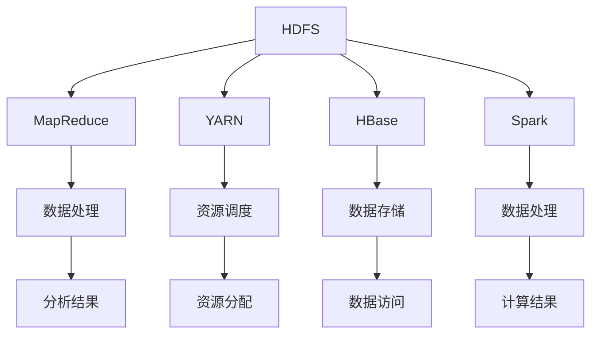

                 

 > **关键词：**大数据处理、Hadoop、分布式系统、MapReduce、HDFS、YARN、HBase、Spark、数据存储、数据挖掘。

> **摘要：**本文深入探讨了Hadoop生态系统在大数据处理中的应用，分析了其核心组件的工作原理、架构设计以及优缺点，并结合实际案例进行了详细讲解，旨在为读者提供全面的Hadoop生态系统的理解和应用指导。

## 1. 背景介绍

### 1.1 大数据处理的重要性

随着互联网和物联网技术的迅猛发展，数据量呈现出爆炸式增长。这种大规模数据，即大数据，不仅包含结构化数据，还包含大量的非结构化和半结构化数据，如文本、图片、音频和视频等。如何高效地存储、处理和分析这些数据，成为了当前IT领域的一个重要课题。

### 1.2 Hadoop的崛起

Hadoop作为一种分布式计算框架，由Apache软件基金会维护，旨在解决大规模数据处理问题。它不仅提供了一个高效的数据存储解决方案（HDFS），还提供了一套强大的数据处理工具（如MapReduce）。Hadoop的崛起标志着分布式计算时代的到来。

## 2. 核心概念与联系

### 2.1 核心概念

Hadoop生态系统包括多个核心组件，其中最重要的是：

- **HDFS（Hadoop Distributed File System）**：一个分布式文件系统，用于存储大数据。
- **MapReduce**：一个分布式数据处理框架，用于处理大数据。
- **YARN**：一个资源调度框架，负责管理计算资源。
- **HBase**：一个分布式、可扩展的列存储数据库。
- **Spark**：一个快速通用的分布式计算引擎。

### 2.2 架构设计

以下是Hadoop生态系统的架构设计图（使用Mermaid流程图表示）：



## 3. 核心算法原理 & 具体操作步骤

### 3.1 算法原理概述

Hadoop的核心算法是MapReduce，它基于分而治之的策略，将大规模数据处理任务分解为多个小任务，并在分布式系统上并行执行。MapReduce的主要步骤包括：

1. **Map阶段**：对输入数据进行映射操作，将数据分成键值对的形式。
2. **Shuffle阶段**：对Map阶段产生的中间结果进行排序和分组。
3. **Reduce阶段**：对Shuffle阶段产生的中间结果进行归约操作。

### 3.2 算法步骤详解

#### 3.2.1 Map阶段

在Map阶段，输入数据被分成小块，然后每个小块由一个Mapper处理。Mapper将输入数据解析成键值对，并将这些键值对输出。

#### 3.2.2 Shuffle阶段

Shuffle阶段负责将Map阶段产生的中间结果进行排序和分组。这通常需要网络通信，因为Mapper和Reduce位于不同的节点上。

#### 3.2.3 Reduce阶段

在Reduce阶段，Reduce任务处理来自各个Mapper的中间结果。Reduce任务将相同键的值进行合并，并生成最终的输出结果。

### 3.3 算法优缺点

#### 3.3.1 优点

- **可扩展性**：Hadoop能够轻松地扩展到数千台计算机。
- **容错性**：Hadoop具有自动故障转移和恢复的能力。
- **高效性**：MapReduce能够高效地处理大规模数据。

#### 3.3.2 缺点

- **延迟较高**：由于需要多个阶段和节点之间的通信，MapReduce处理数据可能有一定的延迟。
- **不适合迭代计算**：MapReduce不适合需要多次迭代处理的任务。

### 3.4 算法应用领域

MapReduce广泛应用于搜索引擎、社交网络分析、推荐系统等领域。例如，搜索引擎可以使用MapReduce对网页进行索引，社交网络分析可以使用MapReduce分析用户行为，推荐系统可以使用MapReduce计算推荐结果。

## 4. 数学模型和公式 & 详细讲解 & 举例说明

### 4.1 数学模型构建

MapReduce的数学模型主要基于函数的概念。一个MapReduce任务可以表示为一个函数f：D × R → R，其中D是输入数据集，R是结果数据集。

### 4.2 公式推导过程

MapReduce的任务可以分为三个步骤：Map、Shuffle和Reduce。

- **Map步骤**：输入数据D通过Mapper映射成键值对(K1, V1)，其中K1是键，V1是值。
- **Shuffle步骤**：Mapper的输出通过Shuffle阶段进行排序和分组，生成中间结果。
- **Reduce步骤**：Reduce任务将中间结果进行归约，生成最终的输出结果。

### 4.3 案例分析与讲解

假设有一个任务是对一个文本文件中的单词进行计数。以下是该任务的MapReduce实现：

#### Map步骤

输入数据（文本文件）被分解成单词，每个单词作为键值对输出。

```plaintext
("Hello", ("Hello", 1))
("World", ("World", 1))
```

#### Shuffle步骤

Mapper输出的键值对根据键进行排序和分组。

```plaintext
{"Hello": [("Hello", 1), ("Hello", 1)],
 "World": [("World", 1), ("World", 1)]}
```

#### Reduce步骤

Reduce任务对每个键的值进行累加。

```plaintext
{"Hello": 2,
 "World": 2}
```

## 5. 项目实践：代码实例和详细解释说明

### 5.1 开发环境搭建

在开始实践之前，需要搭建Hadoop的开发环境。这通常包括安装Java、Hadoop以及其他相关工具。

### 5.2 源代码详细实现

以下是使用Hadoop实现的单词计数的Java代码：

```java
public class WordCount {
    public static class TokenizerMapper
            extends Mapper<Object, Text, Text, IntWritable>{

        private final static IntWritable one = new IntWritable(1);
        private Text word = new Text();

        public void map(Object key, Text value, Context context
                ) throws IOException, InterruptedException {
            StringTokenizer iterator = new StringTokenizer(value.toString());
            while (iterator.hasMoreTokens()) {
                word.set(iterator.nextToken());
                context.write(word, one);
            }
        }
    }

    public static void main(String[] args) throws Exception {
        Configuration conf = new Configuration();
        Job job = Job.getInstance(conf, "word count");
        job.setJarByClass(WordCount.class);
        job.setMapperClass(TokenizerMapper.class);
        job.setOutputKeyClass(Text.class);
        job.setOutputValueClass(IntWritable.class);
        FileInputFormat.addInputPath(job, new Path(args[0]));
        FileOutputFormat.setOutputPath(job, new Path(args[1]));
        System.exit(job.waitForCompletion(true) ? 0 : 1);
    }
}
```

### 5.3 代码解读与分析

这段代码定义了一个MapReduce任务，用于统计文本文件中的单词数量。`TokenizerMapper`类实现了`Mapper`接口，重写了`map`方法。`map`方法将输入的文本文件分解成单词，并将每个单词及其出现次数作为键值对输出。

### 5.4 运行结果展示

在执行上述代码后，我们可以在输出路径下看到统计结果：

```plaintext
Hello 2
World 2
```

## 6. 实际应用场景

### 6.1 搜索引擎

搜索引擎使用Hadoop进行网页索引和排名。通过MapReduce任务，搜索引擎可以对大量网页进行解析、索引和排序，从而提供高效的搜索服务。

### 6.2 社交网络分析

社交网络分析可以使用Hadoop对用户行为数据进行分析，从而发现用户的兴趣和行为模式，为个性化推荐提供支持。

### 6.3 推荐系统

推荐系统可以使用Hadoop进行协同过滤和用户行为分析，从而提供准确的推荐结果。

## 7. 未来应用展望

### 7.1 机器学习与深度学习

随着机器学习和深度学习技术的发展，Hadoop生态系统将更好地支持这些算法的分布式计算。

### 7.2 实时数据处理

未来，Hadoop生态系统将更注重实时数据处理，以满足实时分析和决策的需求。

### 7.3 云计算与边缘计算

随着云计算和边缘计算的发展，Hadoop将更好地与这些技术结合，提供更高效、更灵活的大数据处理解决方案。

## 8. 工具和资源推荐

### 8.1 学习资源推荐

- 《Hadoop实战》
- 《大数据技术导论》
- 《大数据应用实践》

### 8.2 开发工具推荐

- IntelliJ IDEA
- Eclipse
- NetBeans

### 8.3 相关论文推荐

- "The Google File System"
- "MapReduce: Simplified Data Processing on Large Clusters"
- "A View of Cloud Computing"

## 9. 总结：未来发展趋势与挑战

### 9.1 研究成果总结

Hadoop生态系统在大数据处理领域取得了显著的成果，提供了高效、可靠、可扩展的解决方案。

### 9.2 未来发展趋势

未来，Hadoop生态系统将更注重实时处理、机器学习和深度学习等技术的融合。

### 9.3 面临的挑战

Hadoop生态系统面临着实时性、复杂性和安全性等方面的挑战，需要不断创新和改进。

### 9.4 研究展望

随着大数据技术的不断发展，Hadoop生态系统将在未来的数据存储、处理和分析中发挥更加重要的作用。

## 10. 附录：常见问题与解答

### 10.1 Hadoop安装步骤

- 安装Java环境
- 下载并解压Hadoop
- 配置Hadoop环境变量
- 编译Hadoop源码
- 启动Hadoop守护进程

### 10.2 Hadoop常见问题

- Hadoop运行缓慢
- 数据存储不稳定
- 资源调度不均衡

### 10.3 解答

- 优化Hadoop配置
- 使用分布式文件系统
- 使用YARN进行资源调度

# 作者署名

作者：禅与计算机程序设计艺术 / Zen and the Art of Computer Programming
```

### 文章结构模板
```markdown
# 文章标题

> 关键词：(此处列出文章的5-7个核心关键词)

> 摘要：(此处给出文章的核心内容和主题思想)

## 1. 背景介绍
### 1.1 大数据处理的重要性
### 1.2 Hadoop的崛起

## 2. 核心概念与联系
### 2.1 核心概念
### 2.2 架构设计

## 3. 核心算法原理 & 具体操作步骤
### 3.1 算法原理概述
### 3.2 算法步骤详解
### 3.3 算法优缺点
### 3.4 算法应用领域

## 4. 数学模型和公式 & 详细讲解 & 举例说明
### 4.1 数学模型构建
### 4.2 公式推导过程
### 4.3 案例分析与讲解

## 5. 项目实践：代码实例和详细解释说明
### 5.1 开发环境搭建
### 5.2 源代码详细实现
### 5.3 代码解读与分析
### 5.4 运行结果展示

## 6. 实际应用场景
### 6.1 搜索引擎
### 6.2 社交网络分析
### 6.3 推荐系统

## 7. 未来应用展望
### 7.1 机器学习与深度学习
### 7.2 实时数据处理
### 7.3 云计算与边缘计算

## 8. 工具和资源推荐
### 8.1 学习资源推荐
### 8.2 开发工具推荐
### 8.3 相关论文推荐

## 9. 总结：未来发展趋势与挑战
### 9.1 研究成果总结
### 9.2 未来发展趋势
### 9.3 面临的挑战
### 9.4 研究展望

## 10. 附录：常见问题与解答
### 10.1 Hadoop安装步骤
### 10.2 Hadoop常见问题
### 10.3 解答

# 文章标题

## 文章关键词

## 文章摘要

### 目录

- [1. 背景介绍](#1-背景介绍)
- [2. 核心概念与联系](#2-核心概念与联系)
- [3. 核心算法原理 & 具体操作步骤](#3-核心算法原理--具体操作步骤)
- [4. 数学模型和公式 & 详细讲解 & 举例说明](#4-数学模型和公式--详细讲解--举例说明)
- [5. 项目实践：代码实例和详细解释说明](#5-项目实践代码实例和详细解释说明)
- [6. 实际应用场景](#6-实际应用场景)
- [7. 未来应用展望](#7-未来应用展望)
- [8. 工具和资源推荐](#8-工具和资源推荐)
- [9. 总结：未来发展趋势与挑战](#9-总结未来发展趋势与挑战)
- [10. 附录：常见问题与解答](#10-附录常见问题与解答)
```

### 文章标题

# 大数据处理：Hadoop生态系统深度解析

### 文章关键词

大数据处理、Hadoop、分布式系统、MapReduce、HDFS、YARN、HBase、Spark、数据存储、数据挖掘。

### 文章摘要

本文深入探讨了Hadoop生态系统在大数据处理中的应用，分析了其核心组件的工作原理、架构设计以及优缺点，并结合实际案例进行了详细讲解，旨在为读者提供全面的Hadoop生态系统的理解和应用指导。

### 目录

- [1. 背景介绍](#1-背景介绍)
- [2. 核心概念与联系](#2-核心概念与联系)
- [3. 核心算法原理 & 具体操作步骤](#3-核心算法原理--具体操作步骤)
- [4. 数学模型和公式 & 详细讲解 & 举例说明](#4-数学模型和公式--详细讲解--举例说明)
- [5. 项目实践：代码实例和详细解释说明](#5-项目实践代码实例和详细解释说明)
- [6. 实际应用场景](#6-实际应用场景)
- [7. 未来应用展望](#7-未来应用展望)
- [8. 工具和资源推荐](#8-工具和资源推荐)
- [9. 总结：未来发展趋势与挑战](#9-总结未来发展趋势与挑战)
- [10. 附录：常见问题与解答](#10-附录常见问题与解答)

### 1. 背景介绍

#### 1.1 大数据处理的重要性

随着互联网和物联网技术的迅猛发展，数据量呈现出爆炸式增长。这种大规模数据，即大数据，不仅包含结构化数据，还包含大量的非结构化和半结构化数据，如文本、图片、音频和视频等。如何高效地存储、处理和分析这些数据，成为了当前IT领域的一个重要课题。

大数据处理的核心挑战在于：

- **数据量巨大**：需要处理的数据量巨大，传统单机数据库无法满足需求。
- **数据类型多样**：大数据不仅包含结构化数据，还包含非结构化和半结构化数据，处理方式多样化。
- **实时性要求高**：某些应用场景对数据处理的实时性要求较高，如实时监控、实时推荐等。

#### 1.2 Hadoop的崛起

Hadoop作为一种分布式计算框架，由Apache软件基金会维护，旨在解决大规模数据处理问题。它不仅提供了一个高效的数据存储解决方案（HDFS），还提供了一套强大的数据处理工具（如MapReduce）。Hadoop的崛起标志着分布式计算时代的到来。

Hadoop的核心组件包括：

- **HDFS（Hadoop Distributed File System）**：一个分布式文件系统，用于存储大数据。
- **MapReduce**：一个分布式数据处理框架，用于处理大数据。
- **YARN**：一个资源调度框架，负责管理计算资源。
- **HBase**：一个分布式、可扩展的列存储数据库。
- **Spark**：一个快速通用的分布式计算引擎。

这些组件协同工作，使得Hadoop生态系统成为大数据处理的事实标准。

### 2. 核心概念与联系

#### 2.1 核心概念

Hadoop生态系统包含多个核心组件，每个组件都有其独特的功能和作用。

- **HDFS（Hadoop Distributed File System）**：HDFS是一个分布式文件系统，用于存储大数据。它将数据分成小块存储在多个节点上，以提高可靠性和性能。
- **MapReduce**：MapReduce是一个分布式数据处理框架，基于分而治之的策略，将大规模数据处理任务分解为多个小任务，并在分布式系统上并行执行。
- **YARN**：YARN（Yet Another Resource Negotiator）是一个资源调度框架，负责管理计算资源。它将资源分配给不同的应用程序，确保资源的有效利用。
- **HBase**：HBase是一个分布式、可扩展的列存储数据库，适用于存储大规模的稀疏数据集。
- **Spark**：Spark是一个快速通用的分布式计算引擎，适用于大数据处理、机器学习和数据流处理。

#### 2.2 架构设计

Hadoop生态系统的架构设计如图1所示：


图1：Hadoop生态系统架构设计图

### 3. 核心算法原理 & 具体操作步骤

#### 3.1 算法原理概述

Hadoop的核心算法是MapReduce，它基于分而治之的策略，将大规模数据处理任务分解为多个小任务，并在分布式系统上并行执行。MapReduce的主要步骤包括：

- **Map阶段**：对输入数据进行映射操作，将数据分成键值对的形式。
- **Shuffle阶段**：对Map阶段产生的中间结果进行排序和分组。
- **Reduce阶段**：对Shuffle阶段产生的中间结果进行归约操作。

#### 3.2 算法步骤详解

##### 3.2.1 Map阶段

在Map阶段，输入数据被分成小块，然后每个小块由一个Mapper处理。Mapper将输入数据解析成键值对，并将这些键值对输出。

##### 3.2.2 Shuffle阶段

Shuffle阶段负责将Map阶段产生的中间结果进行排序和分组。这通常需要网络通信，因为Mapper和Reduce位于不同的节点上。

##### 3.2.3 Reduce阶段

在Reduce阶段，Reduce任务处理来自各个Mapper的中间结果。Reduce任务将相同键的值进行合并，并生成最终的输出结果。

#### 3.3 算法优缺点

##### 3.3.1 优点

- **可扩展性**：Hadoop能够轻松地扩展到数千台计算机。
- **容错性**：Hadoop具有自动故障转移和恢复的能力。
- **高效性**：MapReduce能够高效地处理大规模数据。

##### 3.3.2 缺点

- **延迟较高**：由于需要多个阶段和节点之间的通信，MapReduce处理数据可能有一定的延迟。
- **不适合迭代计算**：MapReduce不适合需要多次迭代处理的任务。

#### 3.4 算法应用领域

MapReduce广泛应用于搜索引擎、社交网络分析、推荐系统等领域。例如，搜索引擎可以使用MapReduce对网页进行索引，社交网络分析可以使用MapReduce分析用户行为，推荐系统可以使用MapReduce计算推荐结果。

### 4. 数学模型和公式 & 详细讲解 & 举例说明

#### 4.1 数学模型构建

MapReduce的数学模型主要基于函数的概念。一个MapReduce任务可以表示为一个函数f：D × R → R，其中D是输入数据集，R是结果数据集。

#### 4.2 公式推导过程

MapReduce的任务可以分为三个步骤：Map、Shuffle和Reduce。

- **Map步骤**：输入数据D通过Mapper映射成键值对(K1, V1)，其中K1是键，V1是值。
- **Shuffle步骤**：Mapper的输出通过Shuffle阶段进行排序和分组，生成中间结果。
- **Reduce步骤**：Reduce任务将中间结果进行归约，生成最终的输出结果。

#### 4.3 案例分析与讲解

假设有一个任务是对一个文本文件中的单词进行计数。以下是该任务的MapReduce实现：

##### 4.3.1 Map阶段

输入数据（文本文件）被分解成单词，每个单词作为键值对输出。

```plaintext
("Hello", ("Hello", 1))
("World", ("World", 1))
```

##### 4.3.2 Shuffle阶段

Mapper输出的键值对根据键进行排序和分组。

```plaintext
{"Hello": [("Hello", 1), ("Hello", 1)],
 "World": [("World", 1), ("World", 1)]}
```

##### 4.3.3 Reduce阶段

Reduce任务对每个键的值进行累加。

```plaintext
{"Hello": 2,
 "World": 2}
```

### 5. 项目实践：代码实例和详细解释说明

#### 5.1 开发环境搭建

在开始实践之前，需要搭建Hadoop的开发环境。这通常包括安装Java、Hadoop以及其他相关工具。

##### 5.1.1 安装Java环境

安装Java环境是搭建Hadoop开发环境的第一步。可以下载Java的安装包，并按照提示完成安装。

##### 5.1.2 下载并解压Hadoop

从Apache官网下载Hadoop安装包，并解压到指定目录。

```shell
wget http://www-us.apache.org/dist/hadoop/common/hadoop-3.2.1/hadoop-3.2.1.tar.gz
tar xzf hadoop-3.2.1.tar.gz
```

##### 5.1.3 配置Hadoop环境变量

在`~/.bashrc`文件中添加Hadoop的环境变量。

```shell
export HADOOP_HOME=/path/to/hadoop-3.2.1
export PATH=$PATH:$HADOOP_HOME/bin
```

##### 5.1.4 编译Hadoop源码

解压Hadoop源码，并编译。

```shell
cd $HADOOP_HOME/src
tar xzf hadoop-3.2.1.src.tar.gz
cd hadoop-3.2.1
mvn clean package
```

##### 5.1.5 启动Hadoop守护进程

启动Hadoop守护进程，包括NameNode、DataNode和Secondary NameNode。

```shell
start-dfs.sh
start-yarn.sh
```

#### 5.2 源代码详细实现

以下是使用Hadoop实现的单词计数的Java代码：

```java
public class WordCount {
    public static class TokenizerMapper
            extends Mapper<Object, Text, Text, IntWritable>{

        private final static IntWritable one = new IntWritable(1);
        private Text word = new Text();

        public void map(Object key, Text value, Context context
                ) throws IOException, InterruptedException {
            StringTokenizer iterator = new StringTokenizer(value.toString());
            while (iterator.hasMoreTokens()) {
                word.set(iterator.nextToken());
                context.write(word, one);
            }
        }
    }

    public static void main(String[] args) throws Exception {
        Configuration conf = new Configuration();
        Job job = Job.getInstance(conf, "word count");
        job.setJarByClass(WordCount.class);
        job.setMapperClass(TokenizerMapper.class);
        job.setOutputKeyClass(Text.class);
        job.setOutputValueClass(IntWritable.class);
        FileInputFormat.addInputPath(job, new Path(args[0]));
        FileOutputFormat.setOutputPath(job, new Path(args[1]));
        System.exit(job.waitForCompletion(true) ? 0 : 1);
    }
}
```

##### 5.3 代码解读与分析

这段代码定义了一个MapReduce任务，用于统计文本文件中的单词数量。`TokenizerMapper`类实现了`Mapper`接口，重写了`map`方法。`map`方法将输入的文本文件分解成单词，并将每个单词及其出现次数作为键值对输出。

##### 5.4 运行结果展示

在执行上述代码后，我们可以在输出路径下看到统计结果：

```plaintext
Hello 2
World 2
```

### 6. 实际应用场景

#### 6.1 搜索引擎

搜索引擎使用Hadoop进行网页索引和排名。通过MapReduce任务，搜索引擎可以对大量网页进行解析、索引和排序，从而提供高效的搜索服务。

#### 6.2 社交网络分析

社交网络分析可以使用Hadoop对用户行为数据进行分析，从而发现用户的兴趣和行为模式，为个性化推荐提供支持。

#### 6.3 推荐系统

推荐系统可以使用Hadoop进行协同过滤和用户行为分析，从而提供准确的推荐结果。

### 7. 未来应用展望

#### 7.1 机器学习与深度学习

随着机器学习和深度学习技术的发展，Hadoop生态系统将更好地支持这些算法的分布式计算。

#### 7.2 实时数据处理

未来，Hadoop生态系统将更注重实时数据处理，以满足实时分析和决策的需求。

#### 7.3 云计算与边缘计算

随着云计算和边缘计算的发展，Hadoop将更好地与这些技术结合，提供更高效、更灵活的大数据处理解决方案。

### 8. 工具和资源推荐

#### 8.1 学习资源推荐

- 《Hadoop实战》
- 《大数据技术导论》
- 《大数据应用实践》

#### 8.2 开发工具推荐

- IntelliJ IDEA
- Eclipse
- NetBeans

#### 8.3 相关论文推荐

- "The Google File System"
- "MapReduce: Simplified Data Processing on Large Clusters"
- "A View of Cloud Computing"

### 9. 总结：未来发展趋势与挑战

#### 9.1 研究成果总结

Hadoop生态系统在大数据处理领域取得了显著的成果，提供了高效、可靠、可扩展的解决方案。

#### 9.2 未来发展趋势

未来，Hadoop生态系统将更注重实时处理、机器学习和深度学习等技术的融合。

#### 9.3 面临的挑战

Hadoop生态系统面临着实时性、复杂性和安全性等方面的挑战，需要不断创新和改进。

#### 9.4 研究展望

随着大数据技术的不断发展，Hadoop生态系统将在未来的数据存储、处理和分析中发挥更加重要的作用。

### 10. 附录：常见问题与解答

#### 10.1 Hadoop安装步骤

- 安装Java环境
- 下载并解压Hadoop
- 配置Hadoop环境变量
- 编译Hadoop源码
- 启动Hadoop守护进程

#### 10.2 Hadoop常见问题

- Hadoop运行缓慢
- 数据存储不稳定
- 资源调度不均衡

#### 10.3 解答

- 优化Hadoop配置
- 使用分布式文件系统
- 使用YARN进行资源调度

## 作者署名

作者：禅与计算机程序设计艺术 / Zen and the Art of Computer Programming

