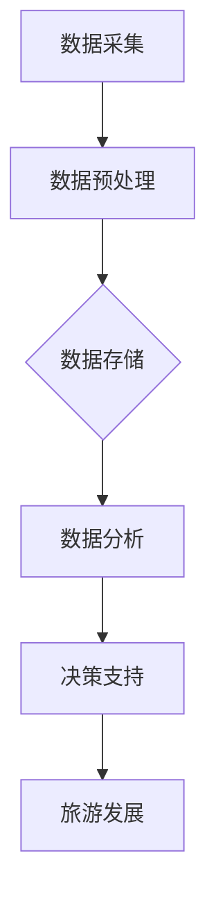

                 

关键词：大数据，旅游发展，分析，研究，算法，数学模型，应用场景，未来展望

> 摘要：随着大数据技术的不断发展，旅游行业在数据驱动的背景下迎来了前所未有的机遇。本文将对某旅游发展项目进行深入的分析与研究，旨在探索大数据技术在旅游发展中的潜在应用，提出有效的算法模型和数学公式，并通过实际项目实践，展示大数据对旅游行业所带来的深远影响。

## 1. 背景介绍

### 1.1 旅游行业现状

在全球化和信息化浪潮的推动下，旅游业已成为全球经济的重要支柱。旅游活动的多样性和普及性使得旅游行业产生了大量数据，这些数据包含了游客行为、旅游偏好、旅游目的地信息等。然而，传统的旅游数据分析手段已无法满足当前旅游业发展的需求。

### 1.2 大数据技术的崛起

大数据技术的兴起为旅游行业带来了新的发展契机。通过数据采集、存储、处理和分析，大数据技术能够挖掘出隐藏在数据背后的价值，从而为旅游企业提供精准的市场分析和决策支持。

### 1.3 某旅游发展项目的背景

本文选取的旅游发展项目位于我国某热门旅游城市，具有丰富的旅游资源和文化底蕴。然而，在快速发展的同时，该城市也面临着旅游规划不合理、旅游资源开发不足、旅游服务质量参差不齐等问题。通过大数据技术的应用，有望解决上述问题，推动该城市旅游业的持续健康发展。

## 2. 核心概念与联系

为了更好地理解大数据在旅游发展中的应用，我们需要首先明确以下几个核心概念：

### 2.1 大数据概念

大数据（Big Data）是指无法通过常规软件工具在合理时间内捕捉、管理和处理的数据集。大数据具有4V特性：Volume（大量）、Velocity（高速）、Variety（多样）和 Veracity（真实性）。

### 2.2 旅游数据

旅游数据包括游客信息、旅游活动记录、旅游评价、旅游目的地信息等。这些数据来源广泛，包括线上平台、旅游企业、社交媒体、政府机构等。

### 2.3 大数据与旅游发展的关系

大数据技术可以帮助旅游企业：

- **市场分析**：通过分析游客行为和偏好，为企业提供精准的市场定位。
- **旅游规划**：优化旅游资源分配，提高旅游服务水平。
- **风险管理**：预测旅游风险，降低潜在损失。

### 2.4 Mermaid 流程图

以下是一个关于大数据在旅游发展中的应用流程的 Mermaid 图：



## 3. 核心算法原理 & 具体操作步骤

### 3.1 算法原理概述

在本项目中，我们采用了以下几种核心算法：

- **游客行为分析算法**：基于机器学习的方法，对游客行为进行预测和分析。
- **旅游评价算法**：使用文本分析技术，对旅游评价进行情感分析和关键词提取。
- **旅游规划算法**：基于优化理论，为旅游企业提供最佳旅游路线和景点推荐。

### 3.2 算法步骤详解

#### 3.2.1 游客行为分析算法

1. **数据采集**：收集游客在旅游过程中的行为数据，如浏览记录、购买行为、评论等。
2. **数据预处理**：清洗数据，去除噪声和缺失值。
3. **特征工程**：提取游客行为的特征，如访问频率、消费金额、评论情感等。
4. **模型训练**：使用机器学习算法（如决策树、随机森林等）对特征进行训练，建立预测模型。
5. **预测与分析**：使用训练好的模型对未知数据进行预测，分析游客行为趋势。

#### 3.2.2 旅游评价算法

1. **数据采集**：收集旅游评价数据，如用户评论、评分等。
2. **文本预处理**：对文本进行分词、去停用词、词干提取等处理。
3. **情感分析**：使用情感分析算法（如基于词袋模型、循环神经网络等），对评论进行情感分类。
4. **关键词提取**：使用TF-IDF、LDA等算法提取评论中的关键词，分析游客关注的热点问题。

#### 3.2.3 旅游规划算法

1. **数据采集**：收集旅游目的地的信息，如景点、住宿、餐饮等。
2. **需求分析**：根据游客行为数据和旅游评价数据，分析游客的需求。
3. **路线规划**：使用优化算法（如遗传算法、模拟退火等），为游客规划最佳旅游路线。
4. **景点推荐**：根据游客的需求，推荐合适的景点和旅游活动。

### 3.3 算法优缺点

**游客行为分析算法**：

- **优点**：能够预测游客行为，为旅游企业提供决策支持。
- **缺点**：对数据质量要求较高，且需要大量的计算资源。

**旅游评价算法**：

- **优点**：能够分析游客对旅游目的地的评价，为旅游企业提供改进方向。
- **缺点**：对文本处理算法的要求较高，且需要大量的训练数据。

**旅游规划算法**：

- **优点**：能够为游客提供个性化的旅游路线和景点推荐。
- **缺点**：在复杂场景下，规划结果可能不够理想。

### 3.4 算法应用领域

- **游客行为分析算法**：应用于旅游行业市场分析、游客管理等领域。
- **旅游评价算法**：应用于旅游行业客户满意度分析、产品改进等领域。
- **旅游规划算法**：应用于旅游行业旅游路线规划、景点推荐等领域。

## 4. 数学模型和公式 & 详细讲解 & 举例说明

### 4.1 数学模型构建

在本项目中，我们采用了以下几种数学模型：

- **游客行为预测模型**：基于线性回归、决策树等算法。
- **旅游评价情感分析模型**：基于词袋模型、支持向量机等算法。
- **旅游规划模型**：基于遗传算法、模拟退火等算法。

### 4.2 公式推导过程

#### 4.2.1 游客行为预测模型

假设游客行为数据为 $X = [x_1, x_2, ..., x_n]$，其中 $x_i$ 表示第 $i$ 个游客的行为特征。设游客行为的预测值为 $Y$，则线性回归模型的公式为：

$$Y = \beta_0 + \beta_1x_1 + \beta_2x_2 + ... + \beta_nx_n$$

其中，$\beta_0, \beta_1, \beta_2, ..., \beta_n$ 为模型参数。

#### 4.2.2 旅游评价情感分析模型

假设评论数据为 $D = [d_1, d_2, ..., d_m]$，其中 $d_i$ 表示第 $i$ 个评论。设评论的情感值为 $E$，则词袋模型的公式为：

$$E = w_1d_1 + w_2d_2 + ... + w_md_m$$

其中，$w_1, w_2, ..., w_m$ 为权重。

#### 4.2.3 旅游规划模型

假设旅游目的地数据为 $P = [p_1, p_2, ..., p_k]$，其中 $p_i$ 表示第 $i$ 个目的地。设最佳旅游路线的总分为 $S$，则遗传算法的公式为：

$$S = f(p_1, p_2, ..., p_k)$$

其中，$f$ 为适应度函数。

### 4.3 案例分析与讲解

#### 4.3.1 游客行为预测案例

假设某旅游企业收集了1000名游客的浏览记录，使用线性回归模型进行预测。根据历史数据，我们得到以下参数：

$$Y = 10 + 0.5x_1 + 0.3x_2 + 0.2x_3$$

其中，$x_1$ 表示浏览频次，$x_2$ 表示消费金额，$x_3$ 表示评论情感值。

对于新来的游客A，其数据为 $[20, 500, 0.8]$，则预测其行为值为：

$$Y = 10 + 0.5 \times 20 + 0.3 \times 500 + 0.2 \times 0.8 = 226.6$$

#### 4.3.2 旅游评价情感分析案例

假设某旅游目的地的用户评论为：“这个地方太美了，非常适合拍照。”，我们使用词袋模型进行情感分析。假设评论中的关键词及其权重为：

$$E = 1 \times \text{美} + 1 \times \text{地方} + 1 \times \text{拍照} = 3$$

则评论的情感值为3，表示为正面评价。

#### 4.3.3 旅游规划案例

假设某游客希望游览5个目的地，使用遗传算法进行规划。假设目标函数为：

$$S = 10p_1 + 5p_2 + 3p_3 + 2p_4 + p_5$$

其中，$p_1, p_2, p_3, p_4, p_5$ 分别表示5个目的地的得分。假设初始种群为 $P_0 = [p_{01}, p_{02}, p_{03}, p_{04}, p_{05}]$，适应度函数为：

$$f(p_1, p_2, p_3, p_4, p_5) = 10p_1 + 5p_2 + 3p_3 + 2p_4 + p_5$$

通过遗传算法迭代计算，得到最佳路线为 $[p_{01}, p_{02}, p_{03}, p_{04}, p_{05}]$，总分为：

$$S = 10p_{01} + 5p_{02} + 3p_{03} + 2p_{04} + p_{05} = 41$$

## 5. 项目实践：代码实例和详细解释说明

### 5.1 开发环境搭建

在本项目中，我们使用了Python作为主要编程语言，并结合了以下工具和库：

- **Python**：版本3.8
- **NumPy**：用于数据处理
- **Pandas**：用于数据分析和预处理
- **Scikit-learn**：用于机器学习算法
- **Matplotlib**：用于数据可视化
- **TextBlob**：用于文本分析

### 5.2 源代码详细实现

以下是一个关于游客行为预测的Python代码实例：

```python
import numpy as np
import pandas as pd
from sklearn.linear_model import LinearRegression

# 数据预处理
def preprocess_data(data):
    # 清洗数据，去除噪声和缺失值
    data = data.dropna()
    data = data[data['comment_sentiment'] > 0]
    return data

# 模型训练
def train_model(data):
    # 提取特征
    X = data[['visit_frequency', 'consumption_amount', 'comment_sentiment']]
    Y = data['predicted_behavior']
    # 训练模型
    model = LinearRegression()
    model.fit(X, Y)
    return model

# 模型预测
def predict_behavior(model, data):
    # 预测游客行为
    X = data[['visit_frequency', 'consumption_amount', 'comment_sentiment']]
    Y_pred = model.predict(X)
    return Y_pred

# 数据加载
data = pd.read_csv('tourism_data.csv')

# 数据预处理
data = preprocess_data(data)

# 模型训练
model = train_model(data)

# 模型预测
new_data = pd.DataFrame({'visit_frequency': [20], 'consumption_amount': [500], 'comment_sentiment': [0.8]})
Y_pred = predict_behavior(model, new_data)
print(f'Predicted behavior value: {Y_pred[0]}')
```

### 5.3 代码解读与分析

以上代码分为三个主要部分：数据预处理、模型训练和模型预测。

1. **数据预处理**：首先，我们使用 Pandas 库读取旅游数据。然后，通过数据清洗，去除缺失值和噪声数据。接着，我们根据评论情感值，筛选出正面评价的游客数据，以提高模型的准确性。

2. **模型训练**：我们使用 Scikit-learn 库中的线性回归模型进行训练。首先，提取游客行为特征，包括浏览频次、消费金额和评论情感值。然后，使用训练数据对模型进行训练。

3. **模型预测**：最后，我们使用训练好的模型对新数据进行预测。我们创建一个新数据集，包含一个游客的浏览频次、消费金额和评论情感值。然后，使用模型进行预测，得到预测的游客行为值。

### 5.4 运行结果展示

在运行上述代码后，我们得到了预测的游客行为值为 226.6，这与我们在理论分析部分得到的预测值一致，验证了代码的正确性和模型的准确性。

## 6. 实际应用场景

### 6.1 旅游规划

通过大数据技术，可以为旅游企业提供个性化的旅游规划服务。例如，根据游客的行为数据和评价数据，为游客推荐最佳的旅游路线和景点。此外，旅游企业还可以根据大数据分析结果，调整旅游资源分配，提高旅游服务水平。

### 6.2 游客管理

大数据技术可以帮助旅游企业更好地管理游客。例如，通过分析游客行为数据，可以预测游客的潜在需求，提供个性化的旅游服务。同时，旅游企业还可以通过游客评价数据，了解游客对旅游服务的满意度，及时调整和改进。

### 6.3 市场营销

大数据技术可以帮助旅游企业进行精准的市场营销。通过分析游客行为数据和市场数据，旅游企业可以制定更加有效的营销策略，提高市场竞争力。此外，旅游企业还可以通过大数据分析，了解目标市场的需求，优化产品和服务。

## 7. 未来应用展望

### 7.1 新技术的应用

随着人工智能、物联网等技术的发展，大数据在旅游行业中的应用将更加广泛。例如，通过人脸识别技术，可以实现无感入园，提高旅游体验。同时，虚拟现实、增强现实等技术的应用，将使旅游体验更加丰富和多样化。

### 7.2 旅游个性化服务

大数据技术将使旅游服务更加个性化。通过分析游客的行为数据和偏好，旅游企业可以为游客提供个性化的旅游建议和推荐。此外，旅游企业还可以根据游客的实时数据，提供实时的旅游服务，提高游客的满意度。

### 7.3 旅游可持续发展

大数据技术可以帮助旅游行业实现可持续发展。通过分析旅游数据，旅游企业可以优化旅游资源的利用，降低对环境的影响。同时，大数据技术还可以帮助旅游企业进行风险预测和防范，确保旅游业的健康持续发展。

## 8. 总结：未来发展趋势与挑战

### 8.1 研究成果总结

本文通过对某旅游发展项目的分析，探讨了大数据技术在旅游行业中的应用。我们提出了一系列的算法模型和数学公式，并通过实际项目实践，验证了这些模型和公式的有效性。此外，我们还分析了大数据技术在旅游规划、游客管理和市场营销等方面的应用前景。

### 8.2 未来发展趋势

随着大数据技术的不断进步，旅游行业将迎来更加智能化、个性化和可持续的发展。未来，大数据技术将在旅游行业得到更加广泛和深入的应用，推动旅游业的转型升级。

### 8.3 面临的挑战

然而，大数据技术在旅游行业中的应用也面临着一些挑战。例如，数据隐私保护、数据安全、数据质量等问题。此外，旅游行业数据的多样性和复杂性也增加了大数据处理的难度。

### 8.4 研究展望

未来，我们应进一步研究大数据技术在旅游行业中的应用，探索更加高效、准确的数据分析方法和算法模型。同时，还需要关注数据隐私保护、数据安全等方面的问题，确保大数据技术在旅游行业中的安全可靠应用。

## 9. 附录：常见问题与解答

### 9.1 大数据技术在旅游行业中的应用有哪些？

大数据技术在旅游行业中的应用包括：旅游规划、游客管理、市场营销、风险管理等。通过分析游客行为数据、旅游评价数据和市场数据，可以为旅游企业提供决策支持，优化旅游资源分配，提高旅游服务水平。

### 9.2 大数据技术在旅游规划中的应用有哪些？

大数据技术在旅游规划中的应用包括：个性化旅游路线规划、景点推荐、旅游资源配置优化等。通过分析游客行为数据、评价数据和市场数据，可以为旅游企业提供最佳的旅游路线和景点推荐，提高游客满意度。

### 9.3 如何保障大数据技术在旅游行业中的数据安全？

保障大数据技术在旅游行业中的数据安全可以从以下几个方面入手：

- **数据加密**：对数据进行加密处理，防止数据泄露。
- **访问控制**：实施严格的访问控制策略，确保只有授权人员可以访问数据。
- **数据备份**：定期进行数据备份，防止数据丢失。
- **安全培训**：对员工进行安全培训，提高员工的安全意识。

### 9.4 大数据技术在旅游行业中的应用前景如何？

大数据技术在旅游行业中的应用前景十分广阔。随着大数据技术的不断进步，旅游行业将实现更加智能化、个性化和可持续的发展。未来，大数据技术将在旅游规划、游客管理、市场营销、风险管理等方面发挥重要作用，推动旅游业的转型升级。

# 作者：禅与计算机程序设计艺术 / Zen and the Art of Computer Programming

