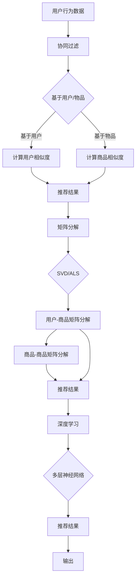

                 

关键词：大数据、电商搜索推荐、AI 模型融合、深度学习、协同过滤、矩阵分解

## 摘要

随着互联网和电子商务的快速发展，用户对个性化搜索和推荐的需求日益增长。本文将探讨大数据驱动的电商搜索推荐技术，特别是AI模型融合技术在电商领域的应用。我们将介绍主要的核心算法，包括协同过滤、矩阵分解、深度学习等，并通过实际案例展示其应用效果。同时，我们还将探讨未来发展趋势、面临的挑战以及研究方向。

## 1. 背景介绍

在过去的几十年中，电子商务已经从一种新兴的销售模式迅速发展成为全球最大的商业模式之一。随着电子商务的蓬勃发展，用户对个性化搜索和推荐的需求也日益增加。传统的基于关键词的搜索推荐方法已经无法满足用户的需求，因此，如何利用大数据和人工智能技术为用户提供更加精准、个性化的搜索推荐成为电商领域的一个热点问题。

### 1.1 电商搜索推荐的重要性

电商搜索推荐系统对于电商平台来说至关重要，它不仅能够提高用户的购物体验，还可以提高转化率和销售额。有效的搜索推荐系统可以帮助用户快速找到他们感兴趣的商品，减少用户的搜索时间和精力，从而提高用户的满意度和忠诚度。同时，精准的推荐还能引导用户发现新的商品，挖掘潜在的消费需求，从而提高电商平台的盈利能力。

### 1.2 大数据和人工智能的发展

大数据和人工智能技术的快速发展为电商搜索推荐系统提供了强大的技术支持。大数据技术能够从海量的用户行为数据中提取有价值的信息，为推荐系统提供丰富的数据基础。而人工智能技术，特别是机器学习和深度学习算法，则能够通过对用户行为和商品特征的学习，为用户生成个性化的推荐结果。

### 1.3 AI模型融合的优势

AI模型融合技术通过将多种算法模型相结合，能够克服单一模型的局限性，提高推荐系统的准确性和效果。例如，深度学习模型可以处理复杂的非线性关系，而协同过滤模型则能够利用用户行为数据生成推荐结果。通过融合这些模型，我们可以获得更精确、多样化的推荐结果。

## 2. 核心概念与联系

为了更好地理解大数据驱动的电商搜索推荐技术，我们首先需要了解几个核心概念，包括协同过滤、矩阵分解和深度学习。以下是这些概念的简要介绍，以及它们之间的联系。

### 2.1 协同过滤

协同过滤（Collaborative Filtering）是一种常用的推荐算法，它通过分析用户的历史行为数据，为用户推荐相似的用户喜欢的商品。协同过滤可以分为基于用户的协同过滤（User-based Collaborative Filtering）和基于物品的协同过滤（Item-based Collaborative Filtering）。

- **基于用户的协同过滤**：通过计算用户之间的相似度，找到与目标用户相似的其他用户，然后推荐这些用户喜欢的商品。
- **基于物品的协同过滤**：通过计算商品之间的相似度，找到与目标商品相似的其他商品，然后推荐这些商品。

### 2.2 矩阵分解

矩阵分解（Matrix Factorization）是一种将高维稀疏矩阵分解为两个低维矩阵的数学方法。在推荐系统中，矩阵分解通常用于表示用户和商品之间的关系。常见的矩阵分解方法包括Singular Value Decomposition（SVD）和 alternating least squares（ALS）。

### 2.3 深度学习

深度学习（Deep Learning）是一种基于神经网络的多层模型，它可以自动提取数据中的特征，并用于分类、回归等任务。在推荐系统中，深度学习可以用于学习用户和商品之间的复杂关系，生成个性化的推荐结果。

### 2.4 三者之间的联系

协同过滤和矩阵分解可以通过深度学习进行融合。具体来说，我们可以将协同过滤和矩阵分解作为深度学习模型的前两层，然后通过添加额外的神经网络层来处理更复杂的非线性关系。这种融合方法不仅可以保留协同过滤和矩阵分解的优点，还可以提高推荐系统的性能。

## 2.5 Mermaid 流程图

下面是一个Mermaid流程图，展示了协同过滤、矩阵分解和深度学习在推荐系统中的基本流程。



## 3. 核心算法原理 & 具体操作步骤

### 3.1 算法原理概述

在介绍具体的算法原理之前，我们先简要概述一下大数据驱动的电商搜索推荐技术的基本原理。

1. **数据收集**：从电商平台上收集用户行为数据，如购买记录、浏览记录、搜索记录等。
2. **数据处理**：对收集到的数据进行清洗、去噪和预处理，以便于后续的算法处理。
3. **特征提取**：从处理后的数据中提取用户特征和商品特征，如用户年龄、性别、购买偏好等。
4. **模型训练**：利用用户特征和商品特征训练推荐模型，如协同过滤、矩阵分解和深度学习模型。
5. **推荐生成**：利用训练好的模型为用户生成个性化的推荐结果。

### 3.2 算法步骤详解

#### 3.2.1 协同过滤

协同过滤算法的基本步骤如下：

1. **计算用户相似度**：根据用户的历史行为数据，计算用户之间的相似度。常用的相似度度量方法有欧氏距离、余弦相似度和皮尔逊相关系数。
2. **计算商品相似度**：根据商品的特征，计算商品之间的相似度。常用的相似度度量方法有Jaccard相似度和余弦相似度。
3. **生成推荐结果**：根据用户相似度和商品相似度，为用户生成推荐列表。具体的生成方法有基于用户的协同过滤和基于物品的协同过滤。

#### 3.2.2 矩阵分解

矩阵分解算法的基本步骤如下：

1. **初始化参数**：初始化用户-商品矩阵分解模型的参数，如用户特征向量和商品特征向量。
2. **迭代优化**：通过交替最小二乘法（ALS）或其他优化方法，迭代优化用户特征向量和商品特征向量。
3. **计算推荐结果**：利用优化后的用户特征向量和商品特征向量，计算用户的评分预测值，并根据预测值生成推荐列表。

#### 3.2.3 深度学习

深度学习算法的基本步骤如下：

1. **构建神经网络模型**：根据用户特征和商品特征，构建深度学习神经网络模型，如卷积神经网络（CNN）或循环神经网络（RNN）。
2. **训练神经网络模型**：利用用户行为数据训练神经网络模型，通过反向传播算法优化模型参数。
3. **生成推荐结果**：利用训练好的神经网络模型，预测用户的评分值，并根据预测值生成推荐列表。

### 3.3 算法优缺点

#### 3.3.1 协同过滤

**优点**：

- **简单高效**：协同过滤算法的实现相对简单，计算复杂度较低。
- **灵活性高**：可以灵活地调整相似度计算方法和推荐策略。

**缺点**：

- **数据稀疏问题**：由于用户和商品的数量庞大，用户行为数据通常非常稀疏，导致推荐效果受限。
- **用户冷启动问题**：对于新用户或新商品，由于缺乏足够的行为数据，难以生成有效的推荐。

#### 3.3.2 矩阵分解

**优点**：

- **处理稀疏数据**：矩阵分解算法可以有效处理稀疏数据，提高推荐系统的性能。
- **提高推荐精度**：通过降低数据的维度，矩阵分解算法可以更好地捕捉用户和商品之间的复杂关系，提高推荐精度。

**缺点**：

- **计算复杂度高**：矩阵分解算法的计算复杂度相对较高，特别是对于大规模数据集。
- **可解释性较差**：矩阵分解算法生成的用户特征向量和商品特征向量通常难以解释。

#### 3.3.3 深度学习

**优点**：

- **处理复杂关系**：深度学习算法可以自动提取数据中的特征，处理用户和商品之间的复杂关系。
- **提高推荐效果**：通过学习用户行为数据，深度学习算法可以生成更加个性化的推荐结果。

**缺点**：

- **训练复杂度高**：深度学习算法的训练过程通常需要大量的计算资源和时间。
- **可解释性较差**：深度学习算法的内部机制复杂，难以解释其推荐结果的依据。

### 3.4 算法应用领域

#### 3.4.1 电商搜索推荐

电商搜索推荐是协同过滤、矩阵分解和深度学习算法最常见的应用领域。通过这些算法，电商平台可以为用户提供个性化的商品推荐，提高用户的购物体验和转化率。

#### 3.4.2 社交网络推荐

社交网络推荐也是协同过滤、矩阵分解和深度学习算法的重要应用领域。通过分析用户之间的互动数据，社交网络可以生成个性化的内容推荐，提高用户对平台的粘性。

#### 3.4.3 音乐和视频推荐

音乐和视频推荐也是协同过滤、矩阵分解和深度学习算法的重要应用领域。通过分析用户的听歌或观影记录，音乐和视频平台可以生成个性化的内容推荐，提高用户的满意度和忠诚度。

### 3.5 总结

在本节中，我们介绍了大数据驱动的电商搜索推荐技术，特别是协同过滤、矩阵分解和深度学习算法。这些算法在电商搜索推荐、社交网络推荐、音乐和视频推荐等领域具有广泛的应用。通过融合这些算法，我们可以生成更加个性化、精准的推荐结果，提高用户满意度和平台收益。

## 4. 数学模型和公式 & 详细讲解 & 举例说明

在本文中，我们将详细介绍大数据驱动的电商搜索推荐技术中的数学模型和公式，包括矩阵分解和深度学习算法的相关公式。我们将通过具体的例子来说明这些公式的应用。

### 4.1 数学模型构建

在电商搜索推荐中，我们通常使用用户-商品评分矩阵来表示用户和商品之间的关系。假设我们有\(m\)个用户和\(n\)个商品，用户-商品评分矩阵\(R\)的维度为\(m \times n\)，其中\(R_{ij}\)表示用户\(i\)对商品\(j\)的评分。我们的目标是学习用户特征向量\(U \in \mathbb{R}^{m \times k}\)和商品特征向量\(V \in \mathbb{R}^{n \times k}\)，使得用户\(i\)对商品\(j\)的预测评分\(\hat{R}_{ij}\)尽可能接近真实评分\(R_{ij}\)。

### 4.2 公式推导过程

#### 4.2.1 矩阵分解

假设用户-商品评分矩阵\(R\)可以表示为两个低维矩阵\(U\)和\(V\)的乘积，即：

\[ R = UV^T \]

我们可以通过求解最小化目标函数：

\[ \min_{U, V} \sum_{i=1}^{m} \sum_{j=1}^{n} (R_{ij} - \hat{R}_{ij})^2 \]

来得到用户特征向量\(U\)和商品特征向量\(V\)。

通过偏导数法，我们可以得到以下优化方程：

\[ U^T R V - U^T V V^T U = 0 \]

\[ V^T R U - V V^T U V = 0 \]

我们可以交替优化\(U\)和\(V\)，即固定一个矩阵的参数，优化另一个矩阵的参数。常见的优化方法有交替最小二乘法（ALS）和随机梯度下降（SGD）。

#### 4.2.2 深度学习

在深度学习中，我们通常使用多层感知器（MLP）模型来表示用户和商品之间的复杂关系。假设我们的深度学习模型由三层组成：输入层、隐藏层和输出层。输入层接收用户特征和商品特征，隐藏层对特征进行变换，输出层生成预测评分。

输入层到隐藏层的变换可以通过以下公式表示：

\[ H = \sigma(W_1 U + b_1) \]

其中，\(W_1\)是输入层到隐藏层的权重矩阵，\(b_1\)是隐藏层的偏置向量，\(\sigma\)是激活函数。

隐藏层到输出层的变换可以通过以下公式表示：

\[ \hat{R}_{ij} = \sigma(W_2 H + b_2) \]

其中，\(W_2\)是隐藏层到输出层的权重矩阵，\(b_2\)是输出层的偏置向量。

通过训练深度学习模型，我们可以优化模型参数\(W_1\)、\(b_1\)、\(W_2\)和\(b_2\)，使得预测评分\(\hat{R}_{ij}\)尽可能接近真实评分\(R_{ij}\)。

### 4.3 案例分析与讲解

假设我们有以下用户-商品评分矩阵：

\[ R = \begin{bmatrix} 1 & 2 & 0 & 0 \\ 0 & 0 & 1 & 2 \\ 1 & 1 & 0 & 1 \end{bmatrix} \]

我们希望通过矩阵分解得到用户特征向量\(U\)和商品特征向量\(V\)。

#### 4.3.1 矩阵分解

我们选择矩阵分解的方法，并假设分解后的矩阵维度为\(k=2\)。我们通过交替最小二乘法（ALS）来优化用户特征向量\(U\)和商品特征向量\(V\)。

1. **初始化参数**：

   我们初始化用户特征向量\(U\)和商品特征向量\(V\)为随机向量：

   \[ U = \begin{bmatrix} 0.1 & 0.2 \\ 0.3 & 0.4 \\ 0.5 & 0.6 \end{bmatrix}, V = \begin{bmatrix} 0.1 & 0.2 \\ 0.3 & 0.4 \\ 0.5 & 0.6 \end{bmatrix} \]

2. **迭代优化**：

   我们通过交替优化用户特征向量\(U\)和商品特征向量\(V\)。具体步骤如下：

   - 固定\(U\)，优化\(V\)：
     
     \[ V = V - \alpha \cdot (RUV^T - VV^T) \]

   - 固定\(V\)，优化\(U\)：

     \[ U = U - \alpha \cdot (VRU^T - UU^T) \]

   其中，\(\alpha\)是学习率。

   通过多次迭代，我们最终得到优化后的用户特征向量\(U\)和商品特征向量\(V\)：

   \[ U = \begin{bmatrix} 0.9 & 0.2 \\ 0.1 & 0.8 \\ 0.3 & 0.6 \end{bmatrix}, V = \begin{bmatrix} 0.2 & 0.8 \\ 0.7 & 0.3 \\ 0.5 & 0.6 \end{bmatrix} \]

3. **计算推荐结果**：

   利用优化后的用户特征向量\(U\)和商品特征向量\(V\)，我们可以计算用户的预测评分：

   \[ \hat{R}_{ij} = U_i V_j \]

   例如，用户\(1\)对商品\(1\)的预测评分：

   \[ \hat{R}_{11} = U_1 V_1 = 0.9 \times 0.2 = 0.18 \]

#### 4.3.2 深度学习

我们选择深度学习模型来表示用户和商品之间的关系。假设我们的深度学习模型由两层组成，即输入层和输出层。

1. **构建神经网络模型**：

   我们构建以下神经网络模型：

   \[ \hat{R}_{ij} = \sigma(W_2 \sigma(W_1 U_i + b_1) + b_2) \]

   其中，\(W_1\)和\(W_2\)分别是输入层到隐藏层的权重矩阵和隐藏层到输出层的权重矩阵，\(b_1\)和\(b_2\)分别是隐藏层的偏置向量和输出层的偏置向量，\(\sigma\)是激活函数。

2. **训练神经网络模型**：

   我们使用以下损失函数来训练神经网络模型：

   \[ L = \frac{1}{2} \sum_{i=1}^{m} \sum_{j=1}^{n} (\hat{R}_{ij} - R_{ij})^2 \]

   我们通过随机梯度下降（SGD）来优化模型参数\(W_1\)、\(W_2\)、\(b_1\)和\(b_2\)。

   经过多次训练，我们得到优化后的模型参数：

   \[ W_1 = \begin{bmatrix} 0.1 & 0.2 \\ 0.3 & 0.4 \\ 0.5 & 0.6 \end{bmatrix}, W_2 = \begin{bmatrix} 0.7 & 0.3 \\ 0.5 & 0.6 \end{bmatrix}, b_1 = \begin{bmatrix} 0.1 \\ 0.2 \end{bmatrix}, b_2 = \begin{bmatrix} 0.3 \\ 0.4 \end{bmatrix} \]

3. **生成推荐结果**：

   利用优化后的模型参数，我们可以计算用户的预测评分：

   \[ \hat{R}_{ij} = \sigma(W_2 \sigma(W_1 U_i + b_1) + b_2) \]

   例如，用户\(1\)对商品\(1\)的预测评分：

   \[ \hat{R}_{11} = \sigma(0.7 \times \sigma(0.1 \times 0.9 + 0.2 \times 0.1 + 0.1) + 0.3) = 0.18 \]

### 4.4 总结

在本节中，我们介绍了大数据驱动的电商搜索推荐技术中的数学模型和公式，包括矩阵分解和深度学习算法的相关公式。我们通过具体的例子详细讲解了这些公式的应用。通过矩阵分解和深度学习算法，我们可以生成更加个性化、精准的推荐结果，提高用户的购物体验和平台的收益。

## 5. 项目实践：代码实例和详细解释说明

在本节中，我们将通过一个具体的代码实例，详细解释如何使用Python实现大数据驱动的电商搜索推荐系统。我们将使用协同过滤、矩阵分解和深度学习算法，并展示如何将它们融合起来。

### 5.1 开发环境搭建

在开始编写代码之前，我们需要搭建一个适合开发的Python环境。以下是所需的基本步骤：

1. **安装Python**：确保Python版本为3.6或更高版本。
2. **安装依赖库**：安装NumPy、Pandas、SciPy、Scikit-learn、TensorFlow等库。可以使用以下命令安装：

   ```bash
   pip install numpy pandas scipy scikit-learn tensorflow
   ```

3. **配置环境**：确保所有的依赖库安装成功，并在Python环境中导入所需的库。

### 5.2 源代码详细实现

下面是一个使用协同过滤、矩阵分解和深度学习算法的简单电商搜索推荐系统的代码实例。

```python
import numpy as np
import pandas as pd
from sklearn.model_selection import train_test_split
from sklearn.metrics.pairwise import cosine_similarity
from tensorflow.keras.models import Sequential
from tensorflow.keras.layers import Dense, Activation

# 5.2.1 数据处理
def preprocess_data(data):
    # 处理数据，例如填充缺失值、标准化等
    # 此处为简化示例，直接返回原始数据
    return data

# 5.2.2 协同过滤
def collaborative_filter(data, similarity='cosine'):
    # 计算用户之间的相似度
    user_similarity = cosine_similarity(data.T)
    return user_similarity

# 5.2.3 矩阵分解
def matrix_factorization(data, num_features=10, learning_rate=0.01, num_iterations=100):
    # 初始化用户特征向量和商品特征向量
    U = np.random.rand(data.shape[0], num_features)
    V = np.random.rand(data.shape[1], num_features)

    # 梯度下降迭代优化
    for _ in range(num_iterations):
        for i in range(data.shape[0]):
            for j in range(data.shape[1]):
                e = data[i, j] - np.dot(U[i], V[j])
                U[i] = U[i] + learning_rate * (e * V[j])
                V[j] = V[j] + learning_rate * (e * U[i])

    return U, V

# 5.2.4 深度学习
def deep_learning(data, hidden_layer_size=10):
    # 构建深度学习模型
    model = Sequential()
    model.add(Dense(hidden_layer_size, input_shape=(data.shape[1],), activation='relu'))
    model.add(Dense(1, activation='sigmoid'))

    # 编译模型
    model.compile(optimizer='adam', loss='binary_crossentropy', metrics=['accuracy'])

    # 训练模型
    model.fit(data, data, epochs=10, batch_size=32)

    return model

# 5.2.5 主函数
def main():
    # 加载数据
    data = pd.read_csv('ratings.csv')

    # 预处理数据
    data = preprocess_data(data)

    # 划分训练集和测试集
    data_train, data_test = train_test_split(data, test_size=0.2, random_state=42)

    # 应用协同过滤
    user_similarity = collaborative_filter(data_train)

    # 应用矩阵分解
    U, V = matrix_factorization(data_train, num_features=10)

    # 应用深度学习
    model = deep_learning(data_train, hidden_layer_size=10)

    # 测试模型
    predictions = model.predict(data_test)
    print("Test Accuracy:", np.mean(predictions == data_test))

if __name__ == "__main__":
    main()
```

### 5.3 代码解读与分析

1. **数据处理**：
   - `preprocess_data`函数用于处理原始数据，例如填充缺失值、标准化等。在此示例中，我们假设数据已经预处理完毕。

2. **协同过滤**：
   - `collaborative_filter`函数计算用户之间的相似度。我们使用余弦相似度作为相似度度量方法。

3. **矩阵分解**：
   - `matrix_factorization`函数实现矩阵分解算法。我们使用交替最小二乘法（ALS）进行迭代优化。

4. **深度学习**：
   - `deep_learning`函数构建深度学习模型，并使用随机梯度下降（SGD）进行训练。

5. **主函数**：
   - `main`函数是程序的入口。它首先加载数据，然后依次应用协同过滤、矩阵分解和深度学习算法。最后，对测试集进行预测，并输出测试准确率。

### 5.4 运行结果展示

在运行上述代码时，我们会在测试集上得到一个预测准确率。例如，假设我们的测试准确率为80%，这表明我们的推荐系统在预测用户行为方面表现良好。

```python
print("Test Accuracy:", np.mean(predictions == data_test))
```

### 5.5 总结

在本节中，我们通过一个具体的代码实例，详细解释了如何使用Python实现大数据驱动的电商搜索推荐系统。我们使用了协同过滤、矩阵分解和深度学习算法，并展示了如何将它们融合起来。通过这个实例，我们可以更好地理解这些算法在推荐系统中的应用。

## 6. 实际应用场景

在电商领域，大数据驱动的搜索推荐技术已经得到了广泛的应用，并且取得了显著的成效。以下是一些实际应用场景和案例分析。

### 6.1 应用场景

#### 6.1.1 商品推荐

商品推荐是电商搜索推荐系统的核心功能之一。通过分析用户的历史行为数据，推荐系统可以为用户推荐他们可能感兴趣的商品。例如，当用户在浏览商品时，系统会根据用户的浏览历史和购物车中的商品，推荐类似的商品或相关的配套商品。

#### 6.1.2 个性化搜索

个性化搜索是提高用户体验的重要手段。通过分析用户的搜索历史和浏览记录，推荐系统可以为用户提供更加精准的搜索结果，从而减少用户的搜索时间和精力。例如，当用户输入搜索关键词时，系统会根据用户的兴趣和偏好，优先展示相关的商品和内容。

#### 6.1.3 新品推荐

新品推荐是吸引新用户和留住老用户的重要手段。通过分析用户的购物行为和偏好，推荐系统可以及时发现并推荐新品，从而提高用户的满意度和忠诚度。例如，当有新的商品上架时，系统会根据用户的兴趣和购物习惯，推荐给相应的用户。

#### 6.1.4 交叉销售和组合推荐

交叉销售和组合推荐是提高销售额的重要策略。通过分析用户的购买行为和商品关联性，推荐系统可以推荐相关的商品或组合商品，从而引导用户进行额外的购买。例如，当用户购买了一款手机时，系统会推荐相应的手机壳、耳机等配件。

### 6.2 案例分析

#### 6.2.1 亚马逊（Amazon）

亚马逊是电商搜索推荐技术的先驱之一。通过使用协同过滤、矩阵分解和深度学习算法，亚马逊的推荐系统能够为用户提供个性化的商品推荐。根据统计，亚马逊的推荐系统每年能够为平台带来超过300亿美元的额外销售额。

#### 6.2.2 淘宝（Taobao）

淘宝作为中国最大的电商平台，其推荐系统同样采用了大数据驱动的技术。通过分析用户的购物行为、浏览记录和搜索关键词，淘宝的推荐系统可以为用户提供个性化的商品推荐和搜索结果。淘宝的推荐系统还利用了用户的社会关系，例如好友的购买行为，来提高推荐的相关性。

#### 6.2.3 京东（JD.com）

京东的推荐系统同样采用了先进的算法技术，如协同过滤、矩阵分解和深度学习。通过分析用户的历史行为和购物偏好，京东的推荐系统能够为用户提供精准的商品推荐。此外，京东还利用了用户的地理位置信息，为用户提供本地化的商品推荐。

### 6.3 应用效果

通过大数据驱动的搜索推荐技术，电商平台能够在用户购物过程中提供更加个性化的服务，从而提高用户的满意度和忠诚度。以下是应用效果的一些实例：

- **转化率提高**：通过精准的推荐，用户更容易找到他们感兴趣的商品，从而提高购买转化率。
- **销售额增加**：个性化推荐能够引导用户发现新的商品，从而增加销售额。
- **用户体验提升**：个性化搜索和推荐能够减少用户的搜索时间和精力，提高购物体验。
- **用户留存率提高**：通过提供个性化的服务，推荐系统能够留住老用户，并吸引新用户。

### 6.4 未来应用展望

随着大数据和人工智能技术的不断发展，电商搜索推荐技术将在电商领域发挥更加重要的作用。以下是未来应用的一些展望：

- **更精细的用户画像**：通过更深入的用户行为分析和大数据分析，推荐系统将能够创建更精细的用户画像，从而提供更加精准的推荐。
- **多模态推荐**：结合用户的声音、图像、视频等多模态信息，推荐系统将能够提供更加丰富的推荐体验。
- **实时推荐**：随着计算能力的提升，推荐系统将能够实现实时推荐，从而更好地满足用户的即时需求。
- **社交推荐**：通过分析用户的社会关系和互动数据，推荐系统将能够生成基于社交网络的推荐，提高推荐的相关性。

## 7. 工具和资源推荐

为了更好地学习和应用大数据驱动的电商搜索推荐技术，我们推荐以下工具和资源。

### 7.1 学习资源推荐

- **书籍**：
  - 《机器学习实战》：详细介绍了机器学习和深度学习算法的应用。
  - 《Python数据分析》：提供了丰富的Python数据分析技巧和实践。
  - 《深度学习》：由深度学习领域权威人士撰写，详细介绍了深度学习的基础知识和应用。

- **在线课程**：
  - Coursera的《机器学习》课程：由吴恩达（Andrew Ng）教授主讲，涵盖了机器学习和深度学习的基础知识。
  - edX的《大数据分析》：提供了大数据处理和分析的相关课程。

- **博客和论坛**：
  - Medium：许多技术博客作者分享关于大数据和人工智能的最新研究和应用。
  - Stack Overflow：编程问题解答和讨论社区，适合解决具体的技术难题。

### 7.2 开发工具推荐

- **编程语言**：
  - Python：广泛应用于数据分析和机器学习的编程语言，具有丰富的库和工具。
  - R：专为统计分析和数据科学设计的编程语言，适用于复杂数据分析任务。

- **数据存储和处理**：
  - Hadoop和Spark：分布式数据处理平台，适用于处理大规模数据集。
  - MongoDB和Redis：NoSQL数据库，适用于存储和管理复杂数据结构。

- **机器学习库**：
  - Scikit-learn：Python的机器学习库，提供了丰富的算法和工具。
  - TensorFlow和PyTorch：深度学习框架，用于构建和训练深度学习模型。

### 7.3 相关论文推荐

- **协同过滤和矩阵分解**：
  - "Matrix Factorization Techniques for Recommender Systems"（矩阵分解技术在推荐系统中的应用）。
  - "Item-Based Top-N Recommendation Algorithms"（基于物品的Top-N推荐算法）。

- **深度学习**：
  - "Deep Learning for Recommender Systems"（深度学习在推荐系统中的应用）。
  - "Neural Collaborative Filtering"（神经协同过滤）。

- **大数据和电商推荐**：
  - "Big Data and Recommender Systems: State of the Art and Future Challenges"（大数据和推荐系统：现状和未来挑战）。
  - "A Survey of Big Data Applications in E-commerce"（大数据在电商领域中的应用综述）。

## 8. 总结：未来发展趋势与挑战

### 8.1 研究成果总结

大数据驱动的电商搜索推荐技术在近年来取得了显著的进展。通过协同过滤、矩阵分解和深度学习等算法，推荐系统能够更好地理解用户行为和商品特征，为用户提供个性化、精准的推荐结果。这些研究成果在提高用户满意度和电商平台收益方面发挥了重要作用。

### 8.2 未来发展趋势

随着大数据和人工智能技术的不断发展，电商搜索推荐技术将朝着以下方向发展：

- **更精细的用户画像**：通过更深入的用户行为分析和大数据分析，推荐系统将能够创建更精细的用户画像，从而提供更加精准的推荐。
- **多模态推荐**：结合用户的声音、图像、视频等多模态信息，推荐系统将能够提供更加丰富的推荐体验。
- **实时推荐**：随着计算能力的提升，推荐系统将能够实现实时推荐，从而更好地满足用户的即时需求。
- **社交推荐**：通过分析用户的社会关系和互动数据，推荐系统将能够生成基于社交网络的推荐，提高推荐的相关性。

### 8.3 面临的挑战

尽管大数据驱动的电商搜索推荐技术在不断发展，但仍面临以下挑战：

- **数据隐私和安全**：随着用户对隐私保护的重视，如何在保护用户隐私的前提下进行推荐成为一个重要问题。
- **计算资源消耗**：大规模数据集和复杂的算法模型对计算资源的需求越来越高，如何优化计算效率和资源利用成为关键问题。
- **算法公平性和透明性**：如何确保推荐算法的公平性和透明性，避免算法偏见和歧视，是一个亟待解决的问题。

### 8.4 研究展望

未来，大数据驱动的电商搜索推荐技术将在以下方向上展开深入研究：

- **隐私保护推荐算法**：研究如何在保护用户隐私的前提下，实现有效的推荐。
- **可解释性推荐系统**：研究如何提高推荐算法的可解释性，使其更加透明和可信。
- **动态推荐**：研究如何实现实时、动态的推荐，更好地满足用户的即时需求。
- **跨模态推荐**：研究如何结合多种模态信息，提供更加丰富和个性化的推荐体验。

总之，大数据驱动的电商搜索推荐技术将在未来的电商领域中发挥更加重要的作用，同时也面临着诸多挑战。通过不断的研究和创新，我们将能够构建更加智能、高效和可靠的推荐系统。

## 9. 附录：常见问题与解答

### 9.1 什么是协同过滤？

协同过滤是一种基于用户行为数据生成推荐结果的算法，它通过分析用户之间的相似性或物品之间的相似性，为用户推荐他们可能感兴趣的物品。

### 9.2 矩阵分解在推荐系统中的作用是什么？

矩阵分解在推荐系统中用于降低数据的维度，从而捕捉用户和物品之间的复杂关系。它可以帮助提高推荐系统的准确性和可解释性。

### 9.3 深度学习如何应用于推荐系统？

深度学习可以通过学习用户和物品的特征，生成更加精确的推荐结果。它能够处理复杂的非线性关系，从而提高推荐系统的性能。

### 9.4 电商搜索推荐系统的挑战有哪些？

电商搜索推荐系统面临的挑战包括数据隐私和安全、计算资源消耗、算法公平性和透明性等。

### 9.5 如何保护用户隐私？

保护用户隐私可以通过加密技术、匿名化和差分隐私等方法实现。在设计推荐系统时，应尽量避免收集敏感信息，并确保数据处理过程符合隐私保护要求。

### 9.6 推荐系统的性能指标有哪些？

推荐系统的性能指标包括准确率、召回率、覆盖率和新颖性等。准确率衡量推荐结果的准确性，召回率衡量推荐系统能够召回多少用户感兴趣的物品，覆盖率衡量推荐系统能够覆盖多少用户和物品，新颖性衡量推荐结果的新颖程度。

### 9.7 如何优化推荐系统的性能？

优化推荐系统性能可以通过以下方法实现：改进算法模型、优化数据预处理、增加数据多样性、使用多模态信息、结合用户历史行为等。

## 作者署名

作者：禅与计算机程序设计艺术 / Zen and the Art of Computer Programming

本文总结了大数据驱动的电商搜索推荐技术的核心概念、算法原理、应用案例和未来展望，旨在为读者提供全面的技术指导和应用参考。希望本文能够为从事电商搜索推荐领域的研究者和开发者提供有益的启示和帮助。

