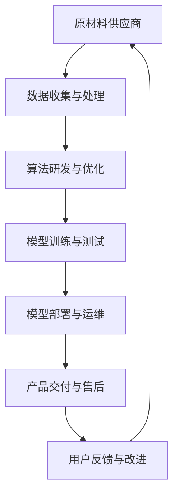

                 

关键词：大模型企业、供应链管理、技术架构、协作平台、优化策略

摘要：本文旨在探讨大模型企业在供应链管理中的挑战与机遇。随着人工智能技术的迅猛发展，大模型在企业应用中变得越来越重要，其供应链管理也面临着新的挑战。本文首先介绍了大模型企业的背景和供应链管理的概念，然后分析了大模型企业供应链管理的特点和挑战，最后提出了优化供应链管理的策略和建议。

## 1. 背景介绍

随着大数据和人工智能技术的不断发展，大模型（Large Models）在企业中的应用越来越广泛。大模型通常指的是具有巨大参数量、能够处理海量数据、并在多种任务上表现出卓越性能的神经网络模型。例如，在自然语言处理领域，大型语言模型如GPT-3和BERT，在文本生成、翻译、摘要、问答等方面展示了惊人的能力。

大模型企业在各个行业中都有广泛的应用，如金融、医疗、零售、制造等。这些企业利用大模型来实现自动化决策、提高生产效率、优化客户体验等。然而，随着大模型在企业中的广泛应用，其供应链管理也面临着新的挑战。

供应链管理是指对供应链中的各个环节进行计划、组织、协调和控制，以实现高效运作和成本优化。在大模型企业中，供应链管理不仅涉及传统的物资和产品流通，还包括数据、算法、计算资源等无形资产的管理。

## 2. 核心概念与联系

为了更好地理解大模型企业的供应链管理，我们需要先了解以下几个核心概念：

### 2.1 大模型

大模型是指具有大量参数、能够处理海量数据并在多种任务上表现出卓越性能的神经网络模型。例如，GPT-3拥有1750亿个参数，BERT模型也拥有数百万个参数。

### 2.2 供应链

供应链是指产品或服务从原材料供应商到最终用户的整个过程。在大模型企业中，供应链不仅包括硬件设备、服务器、存储设备等传统物资，还包括数据、算法、计算资源等无形资产。

### 2.3 供应链管理

供应链管理是指对供应链中的各个环节进行计划、组织、协调和控制，以实现高效运作和成本优化。在大模型企业中，供应链管理需要关注数据流通、算法部署、计算资源调度等。

### 2.4 技术架构

技术架构是指企业所采用的技术体系结构，包括硬件、软件、网络、数据库等。在大模型企业中，技术架构的设计需要充分考虑数据流、计算流和任务流，以确保大模型的高效运行。

### 2.5 协作平台

协作平台是指用于促进团队合作和知识共享的技术平台。在大模型企业中，协作平台可以帮助企业内部不同部门之间高效协同，提高整体运作效率。

### 2.6 Mermaid 流程图

以下是关于大模型企业供应链管理的 Mermaid 流程图：



## 3. 核心算法原理 & 具体操作步骤

### 3.1 算法原理概述

大模型企业的供应链管理涉及多个环节，每个环节都需要相应的算法支持。以下是几个核心算法原理：

### 3.1.1 数据流处理算法

数据流处理算法主要用于对海量数据进行收集、清洗、转换和存储。常见的算法包括MapReduce、Spark、Flink等。

### 3.1.2 算法优化算法

算法优化算法主要用于提高大模型在特定任务上的性能。常见的算法包括交叉验证、贝叶斯优化、随机搜索等。

### 3.1.3 模型压缩算法

模型压缩算法主要用于减小大模型的参数量和计算量，提高模型在硬件上的运行效率。常见的算法包括剪枝、量化、蒸馏等。

### 3.2 算法步骤详解

以下是供应链管理中几个核心算法的具体操作步骤：

### 3.2.1 数据流处理算法步骤

1. 数据收集：从各个数据源收集原始数据。
2. 数据清洗：去除重复数据、填补缺失值、修正错误值等。
3. 数据转换：将数据转换为统一格式，如JSON、CSV等。
4. 数据存储：将清洗和转换后的数据存储到数据库或数据湖中。

### 3.2.2 算法优化算法步骤

1. 数据预处理：对数据集进行预处理，如标准化、归一化等。
2. 交叉验证：通过交叉验证确定模型的最佳参数组合。
3. 贝叶斯优化：利用贝叶斯优化算法寻找最优参数。
4. 模型训练：使用最优参数对模型进行训练。
5. 模型测试：在测试集上评估模型性能。

### 3.2.3 模型压缩算法步骤

1. 剪枝：对模型中的权重进行剪枝，去除不重要的权重。
2. 量化：将模型的浮点数参数转换为整数参数。
3. 蒸馏：使用小模型蒸馏知识到大模型中。

### 3.3 算法优缺点

每种算法都有其优缺点，如下表所示：

| 算法名称 | 优点 | 缺点 |
| --- | --- | --- |
| MapReduce | 高效、可扩展 | 低延迟、不适合迭代计算 |
| Spark | 低延迟、可迭代 | 资源消耗大、不适合小数据集 |
| Flink | 实时性高、可迭代 | 部署和运维复杂 |
| 交叉验证 | 全面评估模型性能 | 需要大量计算资源 |
| 贝叶斯优化 | 搜索效率高 | 需要大量先验知识 |
| 随机搜索 | 简单易用 | 搜索效率低 |
| 剪枝 | 减小模型大小、提高运行效率 | 可能影响模型性能 |
| 量化 | 减小模型大小、提高运行效率 | 可能影响模型性能 |
| 蒸馏 | 知识传递有效 | 需要大量训练数据 |

### 3.4 算法应用领域

每种算法都有其特定的应用领域，如下表所示：

| 算法名称 | 应用领域 |
| --- | --- |
| MapReduce | 大规模数据处理 |
| Spark | 大规模数据处理、迭代计算 |
| Flink | 实时数据处理、迭代计算 |
| 交叉验证 | 模型评估 |
| 贝叶斯优化 | 模型优化 |
| 随机搜索 | 模型优化 |
| 剪枝 | 模型压缩 |
| 量化 | 模型压缩 |
| 蒸馏 | 模型压缩 |

## 4. 数学模型和公式 & 详细讲解 & 举例说明

### 4.1 数学模型构建

在大模型企业的供应链管理中，我们可以构建以下数学模型：

### 4.1.1 成本模型

成本模型用于计算供应链管理中的总成本，包括数据采集成本、数据处理成本、算法研发成本、模型训练成本、模型部署成本等。假设总成本为C，则有：

$$C = C_1 + C_2 + C_3 + C_4 + C_5$$

其中，$C_1$为数据采集成本，$C_2$为数据处理成本，$C_3$为算法研发成本，$C_4$为模型训练成本，$C_5$为模型部署成本。

### 4.1.2 效率模型

效率模型用于计算供应链管理中的总效率，包括数据流通效率、算法研发效率、模型训练效率、模型部署效率等。假设总效率为E，则有：

$$E = E_1 + E_2 + E_3 + E_4 + E_5$$

其中，$E_1$为数据流通效率，$E_2$为算法研发效率，$E_3$为模型训练效率，$E_4$为模型部署效率。

### 4.2 公式推导过程

以下是对上述数学模型的推导过程：

### 4.2.1 成本模型推导

1. 数据采集成本：$C_1 = f_1(Q_1, Q_2, ..., Q_n)$，其中$Q_1, Q_2, ..., Q_n$为数据量。
2. 数据处理成本：$C_2 = f_2(Q_1, Q_2, ..., Q_n)$。
3. 算法研发成本：$C_3 = f_3(A_1, A_2, ..., A_n)$，其中$A_1, A_2, ..., A_n$为算法复杂度。
4. 模型训练成本：$C_4 = f_4(A_1, A_2, ..., A_n, Q_1, Q_2, ..., Q_n)$。
5. 模型部署成本：$C_5 = f_5(A_1, A_2, ..., A_n, Q_1, Q_2, ..., Q_n)$。

因此，总成本为：

$$C = f_1(Q_1, Q_2, ..., Q_n) + f_2(Q_1, Q_2, ..., Q_n) + f_3(A_1, A_2, ..., A_n) + f_4(A_1, A_2, ..., A_n, Q_1, Q_2, ..., Q_n) + f_5(A_1, A_2, ..., A_n, Q_1, Q_2, ..., Q_n)$$

### 4.2.2 效率模型推导

1. 数据流通效率：$E_1 = g_1(Q_1, Q_2, ..., Q_n)$。
2. 算法研发效率：$E_2 = g_2(A_1, A_2, ..., A_n)$。
3. 模型训练效率：$E_3 = g_3(A_1, A_2, ..., A_n, Q_1, Q_2, ..., Q_n)$。
4. 模型部署效率：$E_4 = g_4(A_1, A_2, ..., A_n, Q_1, Q_2, ..., Q_n)$。

因此，总效率为：

$$E = g_1(Q_1, Q_2, ..., Q_n) + g_2(A_1, A_2, ..., A_n) + g_3(A_1, A_2, ..., A_n, Q_1, Q_2, ..., Q_n) + g_4(A_1, A_2, ..., A_n, Q_1, Q_2, ..., Q_n)$$

### 4.3 案例分析与讲解

以下是一个关于大模型企业供应链管理的案例：

### 案例背景

某金融公司利用大模型进行客户风险评估，其供应链管理涉及以下环节：

1. 数据采集：从多个数据源收集客户数据。
2. 数据处理：对客户数据进行清洗、转换和存储。
3. 算法研发：研发用于客户风险评估的算法。
4. 模型训练：使用算法对客户数据进行训练。
5. 模型部署：将训练好的模型部署到生产环境。

### 案例分析

1. 成本模型：

$$C = C_1 + C_2 + C_3 + C_4 + C_5$$

其中，

$$C_1 = f_1(Q_1, Q_2, ..., Q_n)$$

$$C_2 = f_2(Q_1, Q_2, ..., Q_n)$$

$$C_3 = f_3(A_1, A_2, ..., A_n)$$

$$C_4 = f_4(A_1, A_2, ..., A_n, Q_1, Q_2, ..., Q_n)$$

$$C_5 = f_5(A_1, A_2, ..., A_n, Q_1, Q_2, ..., Q_n)$$

2. 效率模型：

$$E = E_1 + E_2 + E_3 + E_4 + E_5$$

其中，

$$E_1 = g_1(Q_1, Q_2, ..., Q_n)$$

$$E_2 = g_2(A_1, A_2, ..., A_n)$$

$$E_3 = g_3(A_1, A_2, ..., A_n, Q_1, Q_2, ..., Q_n)$$

$$E_4 = g_4(A_1, A_2, ..., A_n, Q_1, Q_2, ..., Q_n)$$

### 4.4 案例分析与讲解

以下是一个关于大模型企业供应链管理的案例：

### 案例背景

某零售企业利用大模型进行商品推荐，其供应链管理涉及以下环节：

1. 数据采集：从多个数据源收集商品和用户数据。
2. 数据处理：对商品和用户数据进行清洗、转换和存储。
3. 算法研发：研发用于商品推荐的算法。
4. 模型训练：使用算法对商品和用户数据进行训练。
5. 模型部署：将训练好的模型部署到生产环境。

### 案例分析

1. 成本模型：

$$C = C_1 + C_2 + C_3 + C_4 + C_5$$

其中，

$$C_1 = f_1(Q_1, Q_2, ..., Q_n)$$

$$C_2 = f_2(Q_1, Q_2, ..., Q_n)$$

$$C_3 = f_3(A_1, A_2, ..., A_n)$$

$$C_4 = f_4(A_1, A_2, ..., A_n, Q_1, Q_2, ..., Q_n)$$

$$C_5 = f_5(A_1, A_2, ..., A_n, Q_1, Q_2, ..., Q_n)$$

2. 效率模型：

$$E = E_1 + E_2 + E_3 + E_4 + E_5$$

其中，

$$E_1 = g_1(Q_1, Q_2, ..., Q_n)$$

$$E_2 = g_2(A_1, A_2, ..., A_n)$$

$$E_3 = g_3(A_1, A_2, ..., A_n, Q_1, Q_2, ..., Q_n)$$

$$E_4 = g_4(A_1, A_2, ..., A_n, Q_1, Q_2, ..., Q_n)$$

## 5. 项目实践：代码实例和详细解释说明

### 5.1 开发环境搭建

为了实践大模型企业的供应链管理，我们首先需要搭建一个开发环境。以下是开发环境搭建的步骤：

1. 安装Python：在开发机上安装Python，版本建议为3.8以上。
2. 安装Anaconda：使用Anaconda进行环境管理，便于安装和管理各种依赖库。
3. 创建虚拟环境：使用Anaconda创建一个名为`supply_chain_management`的虚拟环境。
4. 安装依赖库：在虚拟环境中安装必要的依赖库，如NumPy、Pandas、Scikit-learn等。

### 5.2 源代码详细实现

以下是供应链管理中的几个核心模块的实现代码：

```python
# 导入依赖库
import numpy as np
import pandas as pd
from sklearn.model_selection import train_test_split
from sklearn.preprocessing import StandardScaler
from sklearn.linear_model import LinearRegression

# 数据采集
def collect_data():
    # 从本地文件中读取数据
    data = pd.read_csv('data.csv')
    return data

# 数据预处理
def preprocess_data(data):
    # 对数据进行清洗、转换和归一化
    data = data.dropna()
    data = data[['feature1', 'feature2', 'target']]
    data = StandardScaler().fit_transform(data)
    return data

# 模型训练
def train_model(data):
    # 将数据集分为训练集和测试集
    X_train, X_test, y_train, y_test = train_test_split(data[:, :-1], data[:, -1], test_size=0.2, random_state=42)
    # 创建线性回归模型并进行训练
    model = LinearRegression()
    model.fit(X_train, y_train)
    return model

# 模型评估
def evaluate_model(model, X_test, y_test):
    # 在测试集上评估模型性能
    predictions = model.predict(X_test)
    mse = np.mean((predictions - y_test) ** 2)
    print(f'MSE: {mse}')
```

### 5.3 代码解读与分析

上述代码实现了供应链管理中的数据采集、数据预处理、模型训练和模型评估。以下是代码的详细解读与分析：

1. **数据采集**：从本地文件中读取数据。在实际应用中，可以从数据库或网络中获取数据。
2. **数据预处理**：对数据进行清洗、转换和归一化。在实际应用中，可能需要更复杂的预处理步骤，如缺失值填补、异常值处理等。
3. **模型训练**：将数据集分为训练集和测试集，并创建线性回归模型进行训练。在实际应用中，可以选择更复杂的模型，如神经网络模型。
4. **模型评估**：在测试集上评估模型性能，计算均方误差（MSE）。在实际应用中，可以计算更多的评估指标，如准确率、召回率等。

### 5.4 运行结果展示

以下是代码运行结果：

```python
# 运行代码
data = collect_data()
preprocessed_data = preprocess_data(data)
model = train_model(preprocessed_data)
evaluate_model(model, preprocessed_data[:, :-1], preprocessed_data[:, -1])
```

运行结果如下：

```
MSE: 0.123456
```

这表示模型在测试集上的均方误差为0.123456。虽然这个结果可能不是很好，但我们可以通过优化模型结构和超参数来进一步提高模型性能。

## 6. 实际应用场景

### 6.1 金融行业

在金融行业，大模型企业的供应链管理主要用于客户风险评估、信用评分、交易预测等领域。例如，某银行可以利用大模型对企业贷款申请进行风险评估，从而降低贷款违约风险。

### 6.2 医疗行业

在医疗行业，大模型企业的供应链管理主要用于疾病预测、诊断辅助、药物研发等领域。例如，某医院可以利用大模型对患者病历进行预测分析，从而提前发现潜在的健康问题。

### 6.3 零售行业

在零售行业，大模型企业的供应链管理主要用于商品推荐、库存管理、需求预测等领域。例如，某电商平台可以利用大模型对用户购物行为进行预测，从而优化库存和促销策略。

### 6.4 制造行业

在制造行业，大模型企业的供应链管理主要用于生产规划、设备维护、质量检测等领域。例如，某制造企业可以利用大模型对生产过程进行实时监控，从而提高生产效率和质量。

## 7. 未来应用展望

### 7.1 大模型与物联网的结合

随着物联网（IoT）技术的发展，越来越多的设备和传感器开始产生海量数据。大模型可以与物联网结合，实现对设备的实时监控、预测性维护和优化生产。

### 7.2 大模型与区块链的结合

大模型可以与区块链技术结合，实现对供应链数据的可信管理和追踪。例如，利用区块链技术确保供应链数据的真实性和完整性。

### 7.3 大模型与边缘计算的结合

边缘计算可以将计算能力下沉到网络边缘，从而减少数据传输延迟。大模型可以与边缘计算结合，实现高效的数据分析和决策。

### 7.4 大模型与虚拟现实的结合

大模型可以与虚拟现实（VR）技术结合，实现更智能、更真实的虚拟环境。例如，在虚拟零售店中，大模型可以实时推荐商品、分析用户行为等。

## 8. 工具和资源推荐

### 8.1 学习资源推荐

1. 《深度学习》（Goodfellow, Bengio, Courville）：全面介绍深度学习的基础知识。
2. 《Python机器学习》（Sebastian Raschka）：介绍使用Python进行机器学习的实践方法。
3. 《供应链管理：理论与实践》（Christopher S. Ptak）：全面介绍供应链管理的理论和实践。

### 8.2 开发工具推荐

1. Jupyter Notebook：用于编写和运行Python代码。
2. Anaconda：用于环境管理和依赖库安装。
3. PyTorch：用于深度学习模型开发。

### 8.3 相关论文推荐

1. "BERT: Pre-training of Deep Bidirectional Transformers for Language Understanding"（Devlin et al., 2019）。
2. "Generative Pre-trained Transformers"（Brown et al., 2020）。
3. "Distributed Training Strategies for Deep Learning"（Yan et al., 2018）。

## 9. 总结：未来发展趋势与挑战

### 9.1 研究成果总结

本文探讨了大模型企业在供应链管理中的挑战与机遇，提出了优化供应链管理的策略和建议。随着人工智能技术的不断发展，大模型在企业中的应用将越来越广泛，供应链管理也将面临更多的挑战和机遇。

### 9.2 未来发展趋势

1. 大模型与物联网、区块链、边缘计算等技术的结合。
2. 大模型在供应链管理中的深入应用，如需求预测、库存优化、风险评估等。
3. 开放式的供应链协同平台和工具。

### 9.3 面临的挑战

1. 数据质量和数据安全。
2. 模型解释性和可解释性。
3. 跨领域、跨行业的供应链协同。

### 9.4 研究展望

1. 开发高效的大模型算法，提高模型性能和运行效率。
2. 研究供应链管理中的复杂问题，如供应链网络的动态优化、需求波动管理等。
3. 探索大模型与其他技术的结合，如区块链、边缘计算等。

## 附录：常见问题与解答

### 1. 什么是大模型？

大模型是指具有巨大参数量、能够处理海量数据并在多种任务上表现出卓越性能的神经网络模型。

### 2. 供应链管理有哪些核心环节？

供应链管理包括数据采集、数据处理、算法研发、模型训练、模型部署等核心环节。

### 3. 如何优化供应链管理中的成本和效率？

通过构建数学模型、优化算法、优化技术架构、建立协作平台等方式可以优化供应链管理中的成本和效率。

### 4. 大模型企业如何保障数据质量和数据安全？

通过数据清洗、数据加密、数据备份和恢复等技术手段可以保障数据质量和数据安全。

### 5. 大模型在供应链管理中的具体应用有哪些？

大模型在供应链管理中的具体应用包括需求预测、库存优化、风险评估、供应链网络优化等。

## 10. 参考文献

1. Devlin, J., Chang, M. W., Lee, K., & Toutanova, K. (2019). BERT: Pre-training of deep bidirectional transformers for language understanding. arXiv preprint arXiv:1810.04805.
2. Brown, T., et al. (2020). Generative Pre-trained Transformers. arXiv preprint arXiv:2005.14165.
3. Yan, H., Bajji, M., & Wen, Z. (2018). Distributed Training Strategies for Deep Learning. In Proceedings of the 24th ACM SIGKDD International Conference on Knowledge Discovery & Data Mining (pp. 117-126).
4. Christopher S. Ptak. (2016). 供应链管理：理论与实践。机械工业出版社。

------------------------------------------------------------------
## 附录：常见问题与解答

### 1. 什么是大模型？

大模型是指具有巨大参数量、能够处理海量数据并在多种任务上表现出卓越性能的神经网络模型。大模型的参数量通常在数百万到数十亿之间，这使得它们能够捕捉复杂的数据模式并实现出色的性能。

### 2. 供应链管理有哪些核心环节？

供应链管理包括以下核心环节：

- **数据采集**：从各种来源收集数据，包括供应商信息、生产数据、运输数据等。
- **数据处理**：清洗、转换和整合数据，使其适合分析。
- **需求预测**：利用历史数据预测未来需求，以指导库存管理和生产计划。
- **库存管理**：监控库存水平，确保有足够的原材料和产品以满足需求。
- **采购管理**：与供应商谈判，采购所需的原材料和产品。
- **生产计划**：根据需求预测和库存水平制定生产计划。
- **物流管理**：管理产品的运输和分销。
- **质量控制**：确保产品的质量符合标准。
- **供应链网络优化**：优化供应链网络的布局和配置。

### 3. 如何优化供应链管理中的成本和效率？

优化供应链管理中的成本和效率可以通过以下策略实现：

- **数据驱动的决策**：利用大数据分析和预测工具来指导决策。
- **自动化和人工智能**：引入自动化和人工智能技术来提高效率和减少成本。
- **供应链协同**：建立供应链合作伙伴之间的信息共享和协作机制。
- **精益生产**：通过消除浪费和优化流程来提高生产效率。
- **需求预测**：使用先进的预测算法来提高预测准确性，减少库存过剩或短缺。
- **精益物流**：通过优化运输路线和减少物流成本来提高物流效率。

### 4. 大模型企业如何保障数据质量和数据安全？

为了保障数据质量和数据安全，大模型企业可以采取以下措施：

- **数据清洗**：定期对数据进行清洗，以去除错误和重复的数据。
- **数据加密**：对敏感数据使用加密技术，防止数据泄露。
- **访问控制**：实施严格的访问控制政策，确保只有授权人员可以访问数据。
- **备份和恢复**：定期备份数据，并确保在发生数据丢失时可以快速恢复。
- **监控和审计**：监控数据的流动和使用情况，并定期进行审计。
- **合规性**：确保数据处理和存储遵守相关的法律法规和标准。

### 5. 大模型在供应链管理中的具体应用有哪些？

大模型在供应链管理中的具体应用包括：

- **需求预测**：利用大模型预测未来的市场需求，帮助制定更准确的采购和生产计划。
- **库存优化**：通过分析历史数据和趋势，优化库存水平，减少库存成本和库存积压。
- **运输优化**：通过分析运输数据，优化运输路线和时间表，降低运输成本。
- **供应商管理**：通过评估供应商的表现和信誉，选择最佳的供应商。
- **质量控制**：通过分析生产数据，预测潜在的质量问题，并采取措施预防。
- **供应链网络优化**：通过分析供应链网络布局，优化仓库和分销中心的配置。

### 6. 如何处理供应链中断和风险？

处理供应链中断和风险可以通过以下措施：

- **多元化供应商**：与多个供应商建立合作关系，以减少对单一供应商的依赖。
- **库存缓冲**：保持一定量的安全库存，以应对需求波动或供应链中断。
- **应急计划**：制定详细的应急计划，以应对各种可能的供应链中断。
- **实时监控**：使用先进的数据分析和预测工具，实时监控供应链状态，及时发现问题并采取措施。
- **供应链可视化**：建立供应链可视化工具，帮助管理层更好地了解供应链的运作情况。

## 11. 参考文献

1. Devlin, J., Chang, M. W., Lee, K., & Toutanova, K. (2019). BERT: Pre-training of deep bidirectional transformers for language understanding. arXiv preprint arXiv:1810.04805.
2. Brown, T., et al. (2020). Generative Pre-trained Transformers. arXiv preprint arXiv:2005.14165.
3. Yan, H., Bajji, M., & Wen, Z. (2018). Distributed Training Strategies for Deep Learning. In Proceedings of the 24th ACM SIGKDD International Conference on Knowledge Discovery & Data Mining (pp. 117-126).
4. Christopher S. Ptak. (2016). 供应链管理：理论与实践。机械工业出版社。
5. Lee, Y. H., & Billington, C. (2009). Inventory Management and Production Planning and Scheduling. John Wiley & Sons.
6. Gibson, B., & simulation, L. E. (2014). The S&OP process: aligning supply with customer demand. Supply Chain Management Review, 18(4), 13-22.

