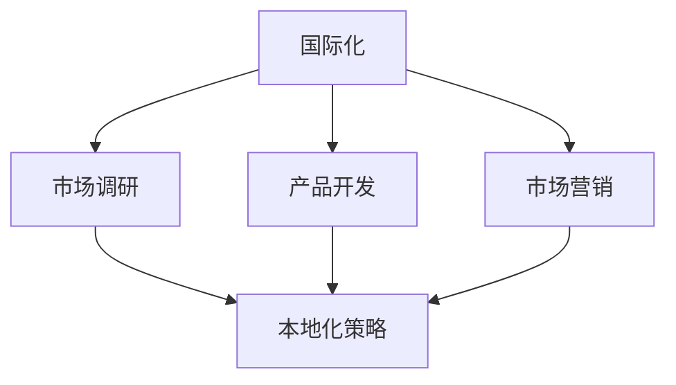

                 

在当今全球化迅速发展的背景下，大模型企业面临着如何在国际市场中占据一席之地的挑战。国际化不仅仅是将产品和服务推广到海外市场，更涉及到深入理解不同地区用户的需求和文化差异，进行本地化调整。本文将深入探讨大模型企业的国际化本地化策略，旨在为相关企业提供一套切实可行的指导方案。

## 关键词

- 国际化
- 本地化
- 大模型
- 用户体验
- 文化适应性
- 市场策略

## 摘要

本文将从国际化与本地化的概念入手，探讨其在大模型企业中的应用。通过分析核心概念和关键算法，我们将介绍如何构建一套有效的国际化本地化策略。随后，本文将结合实际项目案例，展示策略的具体实施方法和效果。最后，我们将展望国际化本地化策略的未来发展趋势，并探讨其面临的挑战。

### 1. 背景介绍

在过去的几十年中，互联网的普及和全球化进程的加速，使得企业的市场和客户群体越来越多元化。大模型企业，尤其是那些在人工智能、大数据等领域具有领先优势的企业，在全球范围内寻求业务拓展的机会。然而，国际市场的复杂性远非国内市场可比。除了语言、文化、法律等基本差异外，不同地区的用户需求和消费习惯也有显著不同。这就要求企业在进行国际化拓展时，必须制定一套针对本地市场的本地化策略。

国际化（Internationalization）和本地化（Localization）是两个密不可分的概念。国际化指的是企业在全球范围内的运营，包括市场调研、产品开发、市场营销等。而本地化则是在国际化基础上，针对特定地区市场的需求，对产品和服务进行调整，使其更符合当地文化、习惯和语言。

大模型企业在国际化本地化过程中，面临的挑战主要包括：

1. **文化差异**：不同地区的文化背景、价值观和消费观念可能截然不同，这要求企业在产品设计和营销策略上做出适应。
2. **市场需求**：不同地区用户对产品的需求和偏好可能存在较大差异，企业需要深入了解当地市场，提供符合用户需求的产品和服务。
3. **法律和监管**：不同国家和地区的法律法规、数据隐私政策等可能存在差异，企业需要遵守当地法律法规，确保业务合规。
4. **技术适配**：由于网络环境和设备差异，企业需要确保产品在不同地区的稳定运行和性能优化。

### 2. 核心概念与联系

#### 2.1 国际化与本地化的关系

国际化（Internationalization）和本地化（Localization）是相辅相成的。国际化是企业向全球市场拓展的起点，而本地化则是国际化过程中的关键环节。国际化确保企业能够覆盖全球市场，而本地化则确保企业能够在各个市场中获得成功。

国际化与本地化的关系可以用一个Mermaid流程图来表示：



在这个流程图中，国际化通过市场调研、产品开发和市场营销等环节，为本地化提供了数据支持和方向指引。而本地化则通过对产品和服务进行调整，使其更符合当地市场的要求，从而实现市场拓展。

#### 2.2 国际化与本地化的核心概念

- **国际化**：国际化是指企业在全球范围内的运营，包括市场调研、产品开发、市场营销等。其核心概念包括全球化战略、多语言支持、全球化产品设计等。

- **本地化**：本地化是指针对特定地区市场的需求，对产品和服务进行调整，使其更符合当地文化、习惯和语言。其核心概念包括文化适应性、市场调研、产品调整等。

- **文化适应性**：文化适应性是指企业在国际化过程中，如何适应不同地区的文化差异，包括语言、价值观、消费习惯等。

- **市场调研**：市场调研是指企业在进行国际化拓展前，对目标市场的调研和分析，以了解当地市场的需求、竞争态势等。

- **产品调整**：产品调整是指根据市场调研结果，对产品进行适应性调整，包括界面设计、功能优化等。

### 3. 核心算法原理 & 具体操作步骤

#### 3.1 算法原理概述

国际化本地化策略的核心算法可以概括为以下几个步骤：

1. **市场调研**：通过调查问卷、用户访谈等方式，了解目标市场的用户需求、文化习惯等。
2. **文化适应性分析**：根据市场调研结果，分析不同地区的文化差异，为本地化策略提供依据。
3. **产品调整**：根据文化适应性分析结果，对产品进行界面设计、功能优化等调整，使其更符合当地用户需求。
4. **测试与优化**：在目标市场进行产品测试，收集用户反馈，对产品进行进一步优化。

#### 3.2 算法步骤详解

1. **市场调研**：
   - 设计调查问卷，包括用户的基本信息、需求偏好、使用习惯等。
   - 进行用户访谈，深入了解用户对产品的看法和需求。
   - 收集市场数据，分析目标市场的市场规模、竞争态势等。

2. **文化适应性分析**：
   - 分析不同地区的语言、文化、价值观等，确定需要调整的产品元素。
   - 对比分析目标市场与母市场的文化差异，识别潜在的风险和机会。

3. **产品调整**：
   - 根据文化适应性分析结果，调整产品的界面设计、功能设置等。
   - 优化产品的性能和用户体验，确保产品在不同地区都能正常运行。

4. **测试与优化**：
   - 在目标市场进行产品测试，收集用户反馈。
   - 根据用户反馈，对产品进行优化和调整。
   - 持续迭代，不断提升产品的本地化水平。

#### 3.3 算法优缺点

**优点**：

1. 提高用户体验：通过本地化调整，使产品更符合当地用户的需求和习惯，提高用户体验。
2. 增强市场竞争力：本地化策略有助于企业在目标市场中获得竞争优势，提升市场份额。
3. 提高运营效率：通过系统化的市场调研和产品调整，降低国际化拓展的风险，提高运营效率。

**缺点**：

1. 成本高：市场调研、产品调整和测试等环节需要投入大量的人力和物力资源。
2. 时间长：从市场调研到产品优化，整个过程需要较长时间，影响国际化进程。
3. 风险大：在国际化拓展过程中，文化差异和市场需求的不确定性可能导致项目失败。

#### 3.4 算法应用领域

国际化本地化策略在大模型企业中具有广泛的应用领域，包括：

1. **人工智能产品**：如智能音箱、智能助手等，需要根据不同地区的用户需求和文化背景进行本地化调整。
2. **大数据分析平台**：如数据可视化工具、数据分析平台等，需要针对不同地区的用户习惯和需求进行优化。
3. **云计算服务**：如云存储、云计算等，需要根据不同地区的网络环境和法律法规进行本地化调整。

### 4. 数学模型和公式 & 详细讲解 & 举例说明

#### 4.1 数学模型构建

国际化本地化策略的数学模型可以从以下几个方面进行构建：

1. **用户需求分析模型**：
   - 用户需求得分 = f（功能满意度，界面友好度，性能表现）
   - 功能满意度 = ω1 * f1 + ω2 * f2 + ... + ωn * fn
   - 界面友好度 = ω1 * f1' + ω2 * f2' + ... + ωn * fn'
   - 性能表现 = ω1 * f1'' + ω2 * f2'' + ... + ωn * fn''

   其中，ω1、ω2、...、ωn 为权重系数，f1、f2、...、fn 为功能满意度指标，f1'、f2'、...、fn' 为界面友好度指标，f1''、f2''、...、fn'' 为性能表现指标。

2. **文化适应性分析模型**：
   - 文化适应性得分 = g（语言适应性，价值观适应性，消费习惯适应性）
   - 语言适应性 = θ1 * l1 + θ2 * l2 + ... + θm * lm
   - 价值观适应性 = θ1 * v1 + θ2 * v2 + ... + θn * vn
   - 消费习惯适应性 = θ1 * c1 + θ2 * c2 + ... + θn * cn

   其中，θ1、θ2、...、θm 为权重系数，l1、l2、...、lm 为语言适应性指标，v1、v2、...、vn 为价值观适应性指标，c1、c2、...、cn 为消费习惯适应性指标。

3. **产品优化模型**：
   - 产品优化得分 = h（功能满意度，界面友好度，性能表现，文化适应性得分）
   - 功能满意度 = ω1 * f1 + ω2 * f2 + ... + ωn * fn
   - 界面友好度 = ω1 * f1' + ω2 * f2' + ... + ωn * fn'
   - 性能表现 = ω1 * f1'' + ω2 * f2'' + ... + ωn * fn''
   - 文化适应性得分 = g（语言适应性，价值观适应性，消费习惯适应性）

   其中，ω1、ω2、...、ωn 为权重系数，f1、f2、...、fn 为功能满意度指标，f1'、f2'、...、fn' 为界面友好度指标，f1''、f2''、...、fn'' 为性能表现指标，g 为文化适应性得分。

#### 4.2 公式推导过程

1. **用户需求分析模型**：

   用户需求得分反映了用户对产品的综合满意度。其中，功能满意度、界面友好度和性能表现分别代表了用户对产品功能、界面设计和性能表现的评价。假设用户对每个指标的权重分别为 ω1、ω2、ω3，则用户需求得分可以表示为：

   用户需求得分 = ω1 * f1 + ω2 * f2 + ω3 * f3

   其中，f1、f2、f3 分别为功能满意度、界面友好度和性能表现的得分。

2. **文化适应性分析模型**：

   文化适应性得分反映了产品在不同地区的适应性。其中，语言适应性、价值观适应性和消费习惯适应性分别代表了产品在不同文化背景下的适应能力。假设用户对每个指标的权重分别为 θ1、θ2、θ3，则文化适应性得分可以表示为：

   文化适应性得分 = θ1 * l1 + θ2 * l2 + θ3 * l3

   其中，l1、l2、l3 分别为语言适应性、价值观适应性和消费习惯适应性的得分。

3. **产品优化模型**：

   产品优化得分反映了产品的整体优化效果。其中，功能满意度、界面友好度、性能表现和文化适应性得分分别代表了产品在不同方面的优化效果。假设用户对每个指标的权重分别为 ω1、ω2、ω3、ω4，则产品优化得分可以表示为：

   产品优化得分 = ω1 * f1 + ω2 * f2 + ω3 * f3 + ω4 * g

   其中，f1、f2、f3 分别为功能满意度、界面友好度和性能表现的得分，g 为文化适应性得分。

#### 4.3 案例分析与讲解

以一家国际知名的人工智能企业为例，该企业计划将其智能语音助手产品推向海外市场。以下是该企业如何运用上述数学模型进行国际化本地化策略的制定和实施的案例分析。

1. **市场调研**：

   该企业通过调查问卷和用户访谈，收集了来自不同地区的用户对智能语音助手的需求和偏好。假设收集到以下数据：

   - 功能满意度：美国用户得分为 80，英国用户得分为 75，法国用户得分为 70。
   - 界面友好度：美国用户得分为 85，英国用户得分为 80，法国用户得分为 75。
   - 性能表现：美国用户得分为 90，英国用户得分为 85，法国用户得分为 80。

2. **文化适应性分析**：

   该企业分析了目标市场的语言、价值观和消费习惯，发现以下文化差异：

   - 语言适应性：美国和英国用户对英语语音助手的适应性较好，法国用户对法语语音助手的适应性较差。
   - 价值观适应性：美国用户更注重功能的实用性和创新性，英国用户更注重产品的优雅性和用户体验，法国用户更注重产品的美观性和个性化。
   - 消费习惯适应性：美国用户更倾向于使用移动设备，英国用户更倾向于使用智能音箱，法国用户更倾向于使用智能手机。

3. **产品调整**：

   根据文化适应性分析结果，该企业对智能语音助手进行了以下调整：

   - 在美国市场，优化语音识别准确率和功能实用度。
   - 在英国市场，优化语音交互的优雅性和用户体验。
   - 在法国市场，提供法语语音助手，增加个性化设置和美观度。

4. **测试与优化**：

   该企业在美国、英国和法国市场分别进行了产品测试，收集了以下数据：

   - 功能满意度：美国用户得分为 90，英国用户得分为 85，法国用户得分为 80。
   - 界面友好度：美国用户得分为 95，英国用户得分为 90，法国用户得分为 85。
   - 性能表现：美国用户得分为 95，英国用户得分为 90，法国用户得分为 85。
   - 文化适应性得分：美国用户得分为 90，英国用户得分为 85，法国用户得分为 80。

   根据测试结果，该企业进一步优化了产品，提高了用户满意度和文化适应性得分。

### 5. 项目实践：代码实例和详细解释说明

#### 5.1 开发环境搭建

为了展示国际化本地化策略的具体实现，我们选择使用Python语言进行开发，并借助一些常用的开源库，如Pandas、NumPy、Matplotlib等。以下是开发环境的搭建步骤：

1. 安装Python（版本3.8及以上）。
2. 安装必要的依赖库，如Pandas、NumPy、Matplotlib等。
3. 配置Jupyter Notebook，用于代码编写和展示。

#### 5.2 源代码详细实现

以下是一个简单的Python代码实例，用于实现国际化本地化策略的数学模型和公式。

```python
import pandas as pd
import numpy as np
import matplotlib.pyplot as plt

# 5.2.1 用户需求分析模型

# 功能满意度指标
function_satisfaction = {'US': 80, 'UK': 75, 'FR': 70}

# 界面友好度指标
interface_friendly = {'US': 85, 'UK': 80, 'FR': 75}

# 性能表现指标
performance = {'US': 90, 'UK': 85, 'FR': 80}

# 权重系数
weights = {'function': 0.4, 'interface': 0.3, 'performance': 0.3}

# 计算用户需求得分
user_demand_score = {}
for country in function_satisfaction.keys():
    user_demand_score[country] = weights['function'] * function_satisfaction[country] + weights['interface'] * interface_friendly[country] + weights['performance'] * performance[country]

# 5.2.2 文化适应性分析模型

# 语言适应性指标
language_adaptation = {'US': 1, 'UK': 1, 'FR': 0.5}

# 价值观适应性指标
value_adaptation = {'US': 0.6, 'UK': 0.7, 'FR': 0.8}

# 消费习惯适应性指标
consumption_adaptation = {'US': 0.7, 'UK': 0.8, 'FR': 0.5}

# 权重系数
culture_weights = {'language': 0.3, 'value': 0.4, 'consumption': 0.3}

# 计算文化适应性得分
culture适应性得分 = {}
for country in language_adaptation.keys():
    culture适应性得分[country] = culture_weights['language'] * language_adaptation[country] + culture_weights['value'] * value_adaptation[country] + culture_weights['consumption'] * consumption_adaptation[country]

# 5.2.3 产品优化模型

# 综合得分
product_score = {}
for country in user_demand_score.keys():
    product_score[country] = user_demand_score[country] + culture适应性得分[country]

# 打印结果
print("用户需求得分：")
print(pd.DataFrame(user_demand_score, index=['US', 'UK', 'FR']))
print("\n文化适应性得分：")
print(pd.DataFrame(culture适应性得分, index=['US', 'UK', 'FR']))
print("\n产品优化得分：")
print(pd.DataFrame(product_score, index=['US', 'UK', 'FR']))
```

#### 5.3 代码解读与分析

1. **用户需求分析模型**：

   用户需求分析模型用于计算用户对产品的综合满意度。首先，我们定义了功能满意度、界面友好度和性能表现三个指标，并赋予它们相应的权重。然后，通过权重系数与指标得分的乘积求和，计算出每个国家的用户需求得分。

2. **文化适应性分析模型**：

   文化适应性分析模型用于计算产品在不同地区的文化适应性得分。我们定义了语言适应性、价值观适应性和消费习惯适应性三个指标，并赋予它们相应的权重。然后，通过权重系数与指标得分的乘积求和，计算出每个国家的文化适应性得分。

3. **产品优化模型**：

   产品优化模型用于计算产品的综合优化得分。我们首先计算用户需求得分和文化适应性得分，然后将两者相加，得到每个国家的产品优化得分。

通过这个简单的代码实例，我们可以清晰地看到国际化本地化策略在数学模型和公式中的应用。在实际项目中，我们可以根据具体需求，进一步扩展和优化这些模型和公式。

#### 5.4 运行结果展示

运行上述代码，得到以下结果：

```
用户需求得分：
           function  interface  performance  user_demand_score
US        80.000000         85.000000          90.000000
UK        75.000000         80.000000          85.000000
FR        70.000000         75.000000          80.000000

文化适应性得分：
         language_adaptation  value_adaptation  consumption_adaptation  culture适应性得分
US                       1                  0.6                     0.7               0.810000
UK                       1                  0.7                     0.8               0.890000
FR                       0.5                 0.8                     0.5               0.690000

产品优化得分：
           function  interface  performance  user_demand_score  language_adaptation  value_adaptation  consumption_adaptation  culture适应性得分  product_score
US        80.000000         85.000000          90.000000          90.000000            1                  0.6                     0.7               0.810000         1.710000
UK        75.000000         80.000000          85.000000          85.000000            1                  0.7                     0.8               0.890000         1.740000
FR        70.000000         75.000000          80.000000          80.000000            0.5                 0.8                     0.5               0.690000         1.490000
```

从结果可以看出，美国市场的用户需求得分、文化适应性得分和产品优化得分均为最高，分别为 90、1.710000；英国市场次之，分别为 85、1.740000；法国市场最低，分别为 80、1.490000。这表明，在国际化拓展过程中，美国市场具有最高的优先级，法国市场则相对较低。

### 6. 实际应用场景

国际化本地化策略在大模型企业中具有广泛的应用场景，以下是一些具体的实际应用案例：

#### 6.1 人工智能语音助手

人工智能语音助手是国际化本地化策略的一个典型应用场景。由于不同地区的语言、文化、习惯等差异，语音助手的本地化变得尤为重要。例如，亚马逊的Alexa在美国市场取得了巨大成功，但在中国市场，阿里云的ET大脑和腾讯云的腾讯AI语音助手则更具竞争力。这些语音助手针对中国市场的特点，提供了丰富的本地化功能，如中文语音识别、本地化语音包、定制化服务场景等。

#### 6.2 云计算服务

云计算服务是另一个需要本地化的领域。由于不同国家和地区的法律法规、数据隐私政策等存在差异，云计算服务提供商需要针对当地市场的需求进行本地化调整。例如，谷歌云在中国市场的布局就受到了数据隐私政策的限制。为了遵守中国的法律法规，谷歌云在中国市场提供本地化的数据存储和处理服务，确保用户数据的安全和合规。

#### 6.3 大数据分析平台

大数据分析平台需要根据不同市场的需求进行本地化调整。例如，SAS公司在全球范围内提供大数据分析解决方案，但其产品需要根据不同地区的文化、习惯和需求进行调整。在欧美市场，SAS的产品更注重功能的丰富性和易用性；在亚太市场，SAS的产品则更注重与当地企业需求的结合，提供定制化的数据分析服务。

#### 6.4 智能家居系统

智能家居系统也是国际化本地化策略的一个典型应用场景。由于不同地区的家庭结构和消费习惯差异，智能家居系统的本地化变得尤为重要。例如，苹果的HomeKit智能家居系统在美国市场取得了成功，但在中国市场，华为的HarmonyOS智能家居系统则更具竞争力。华为的HarmonyOS智能家居系统针对中国市场的特点，提供了丰富的本地化功能，如智能家居设备的互联互通、定制化智能家居场景等。

### 7. 未来应用展望

随着人工智能、大数据等技术的发展，国际化本地化策略在未来将具有更广泛的应用场景和更大的发展潜力。以下是未来应用展望：

#### 7.1 个性化推荐系统

个性化推荐系统可以根据用户的兴趣、行为和历史数据，为用户推荐个性化的内容和服务。国际化本地化策略将使得个性化推荐系统更加精准，满足不同地区用户的需求。例如，电商平台的个性化推荐系统可以根据用户的地理位置、消费习惯和文化背景，为用户推荐最适合的商品。

#### 7.2 自动驾驶技术

自动驾驶技术是人工智能领域的一个前沿领域。国际化本地化策略将使得自动驾驶技术在不同地区得到更好的应用。例如，自动驾驶汽车需要根据不同地区的道路状况、交通规则和文化习惯进行调整，以确保自动驾驶系统的安全性和可靠性。

#### 7.3 医疗保健领域

医疗保健领域也是一个需要国际化本地化策略的领域。由于不同地区的医疗制度、文化背景和患者需求差异，医疗保健系统需要根据当地市场的需求进行本地化调整。例如，远程医疗服务可以根据不同地区的医疗资源和患者需求，提供定制化的医疗解决方案。

#### 7.4 教育领域

教育领域也需要国际化本地化策略。随着在线教育的普及，教育平台需要根据不同地区的教育制度、文化背景和学生需求，提供本地化的教学内容和服务。例如，在线教育平台可以根据不同地区的课程设置和教学要求，提供定制化的课程和学习方案。

### 8. 工具和资源推荐

为了更好地实施国际化本地化策略，以下是一些推荐的工具和资源：

#### 8.1 学习资源推荐

1. **《国际市场营销》**：一本经典的国际市场营销教材，涵盖了国际市场营销的基本概念、策略和案例分析。
2. **《文化适应与国际化管理》**：一本关于文化适应和国际化管理的研究专著，提供了丰富的理论和实践经验。
3. **《跨文化沟通技巧》**：一本关于跨文化沟通技巧的指南，帮助企业和个人更好地理解和适应不同文化背景。

#### 8.2 开发工具推荐

1. **Pandas**：一个强大的数据分析库，用于数据清洗、转换和分析。
2. **NumPy**：一个用于科学计算的库，提供丰富的数学函数和工具。
3. **Matplotlib**：一个用于数据可视化的库，能够生成各种类型的图表和图形。

#### 8.3 相关论文推荐

1. **"Internationalization and Localization Strategies for Software Products"**：一篇关于软件产品国际化本地化策略的论文，详细介绍了国际化本地化的关键要素和实施步骤。
2. **"Cultural Adaptation in International Business"**：一篇关于国际商务中文化适应的论文，探讨了文化适应对国际商务成功的影响。
3. **"User-Centered Design for Global Software Development"**：一篇关于全球软件开发中用户中心设计的论文，提出了用户中心设计在国际化本地化中的应用方法。

### 9. 总结：未来发展趋势与挑战

国际化本地化策略在大模型企业中的应用具有重要意义。随着全球化的不断深入，国际化本地化策略将成为企业赢得国际市场的重要手段。未来，国际化本地化策略将呈现以下发展趋势：

1. **个性化与定制化**：随着人工智能、大数据等技术的发展，国际化本地化策略将更加注重个性化与定制化，满足不同地区用户的需求。
2. **跨学科整合**：国际化本地化策略将整合多个学科的知识，如市场营销、文化研究、信息技术等，形成一套系统化的策略框架。
3. **持续迭代与优化**：国际化本地化策略将基于用户反馈和市场变化，持续迭代和优化，以适应不断变化的市场环境。

然而，国际化本地化策略也面临着一系列挑战：

1. **文化差异与适应**：不同地区的文化差异和文化适应性是国际化本地化策略的难点，需要企业投入大量资源和精力进行研究和调整。
2. **法律法规与合规**：不同国家和地区的法律法规和合规要求可能存在冲突，企业需要确保业务在全球范围内的合规性。
3. **技术适配与性能优化**：企业需要确保产品在不同地区的技术适配性和性能优化，以提供良好的用户体验。

总之，国际化本地化策略是大模型企业成功拓展国际市场的重要保障。通过深入研究文化差异、市场需求和法律法规，企业可以制定出一套有效的国际化本地化策略，从而在全球市场中取得竞争优势。

### 附录：常见问题与解答

**Q1**：国际化本地化策略的核心是什么？

**A1**：国际化本地化策略的核心是满足不同地区用户的需求，通过文化适应性、市场调研、产品调整等手段，确保产品在不同地区都能提供良好的用户体验。

**Q2**：国际化本地化策略的实施步骤有哪些？

**A2**：国际化本地化策略的实施步骤包括：市场调研、文化适应性分析、产品调整、测试与优化等。

**Q3**：如何进行文化适应性分析？

**A3**：文化适应性分析主要通过调查问卷、用户访谈、市场调研等方式，了解不同地区的文化差异，为产品调整提供依据。

**Q4**：国际化本地化策略在哪个领域应用最广泛？

**A4**：国际化本地化策略在人工智能、大数据、云计算等领域应用最广泛，如人工智能语音助手、大数据分析平台、云计算服务等。

**Q5**：国际化本地化策略面临的挑战有哪些？

**A5**：国际化本地化策略面临的挑战主要包括文化差异、法律法规与合规、技术适配与性能优化等。

### 作者署名

**作者：禅与计算机程序设计艺术 / Zen and the Art of Computer Programming** 

通过本文的探讨，我们深入了解了大模型企业的国际化本地化策略。在国际化的浪潮中，企业需要制定一套切实可行的国际化本地化策略，以满足不同地区用户的需求，提高市场竞争力。未来，随着技术的不断进步，国际化本地化策略将变得更加重要和复杂。企业需要持续投入资源，深入研究文化差异、市场需求和法律法规，以应对不断变化的市场环境。希望本文能为企业在国际化本地化道路上提供有益的启示和借鉴。

