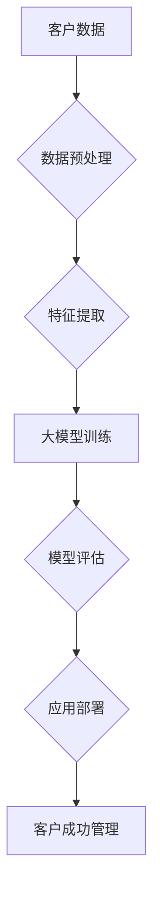

                 

关键词：大模型，企业，客户成功，策略，技术，人工智能

摘要：随着人工智能技术的迅猛发展，大模型在各个行业中的应用日益广泛。本文将从企业角度出发，探讨大模型在客户成功管理中的策略与应用，以帮助企业更好地把握市场机遇，提升客户满意度和忠诚度。

## 1. 背景介绍

在当今数字化时代，人工智能（AI）技术已经成为企业提升竞争力的关键因素。大模型作为人工智能领域的重要成果，通过深度学习算法从海量数据中提取知识，为各种复杂任务提供强大的解决方案。大模型的应用范围涵盖了自然语言处理、计算机视觉、语音识别等多个领域，为企业和客户带来了前所未有的价值。

然而，大模型的应用并非一帆风顺。企业面临诸多挑战，如技术落地、数据隐私、算法可解释性等。如何在竞争中脱颖而出，实现客户成功，成为企业急需解决的问题。本文将围绕大模型在客户成功管理中的策略与应用，探讨如何利用人工智能技术提升客户满意度，增强客户忠诚度。

## 2. 核心概念与联系

### 2.1 大模型的基本概念

大模型是指具有数十亿甚至千亿级别参数的深度学习模型。这些模型通常通过训练大量的数据，学习到复杂的特征和模式，从而实现对未知数据的预测和分类。

### 2.2 客户成功的概念

客户成功是指通过满足客户需求、提升客户体验，从而实现客户满意度和忠诚度的提升。客户成功管理是企业长期发展的关键。

### 2.3 大模型与客户成功的联系

大模型可以通过以下方式促进客户成功：

1. **个性化推荐**：基于用户的兴趣和行为数据，大模型可以推荐符合客户需求的产品和服务。
2. **智能客服**：大模型可以模拟人类客服，提供24/7的在线服务，提高客户满意度。
3. **个性化服务**：通过分析客户数据，大模型可以为不同客户提供定制化的服务方案。
4. **需求预测**：大模型可以预测客户的潜在需求，帮助企业提前布局。

### 2.4 Mermaid 流程图



## 3. 核心算法原理 & 具体操作步骤

### 3.1 算法原理概述

大模型的算法原理主要包括以下几个步骤：

1. **数据预处理**：清洗和预处理原始数据，使其适合训练。
2. **特征提取**：从数据中提取关键特征，用于训练模型。
3. **模型训练**：使用大量数据进行模型训练，优化模型参数。
4. **模型评估**：评估模型的性能，确保其满足业务需求。
5. **应用部署**：将模型部署到实际业务场景，为客户提供服务。

### 3.2 算法步骤详解

1. **数据预处理**：
   - 数据清洗：去除噪声数据、缺失值填充、异常值处理等。
   - 数据归一化：将数据缩放到统一的范围，便于模型训练。

2. **特征提取**：
   - 提取文本特征：使用词袋模型、词嵌入等技术。
   - 提取图像特征：使用卷积神经网络（CNN）等技术。

3. **模型训练**：
   - 确定模型架构：选择合适的模型结构，如Transformer、BERT等。
   - 参数优化：通过反向传播算法，优化模型参数。

4. **模型评估**：
   - 准确率、召回率、F1值等指标评估模型性能。
   - A/B测试：在不同场景下测试模型效果。

5. **应用部署**：
   - 模型压缩：减小模型大小，提高部署效率。
   - 实时更新：根据新数据，持续优化模型。

### 3.3 算法优缺点

**优点**：

- **高精度**：大模型通过训练海量数据，能够学习到复杂特征，提高预测准确性。
- **灵活性**：大模型可以适应多种业务场景，提供定制化解决方案。
- **实时更新**：大模型可以持续学习，适应不断变化的市场需求。

**缺点**：

- **计算资源消耗大**：大模型训练需要大量计算资源，成本较高。
- **数据隐私风险**：大模型需要大量数据，可能涉及客户隐私问题。
- **模型可解释性差**：大模型通常难以解释，可能影响客户信任。

### 3.4 算法应用领域

- **电子商务**：个性化推荐、智能客服等。
- **金融领域**：风险控制、欺诈检测等。
- **医疗健康**：疾病预测、智能诊断等。
- **教育行业**：智能学习、个性化教学等。

## 4. 数学模型和公式 & 详细讲解 & 举例说明

### 4.1 数学模型构建

假设我们有一个客户数据集 \(D\)，其中每个客户 \(x\) 对应一个特征向量 \(X = [x_1, x_2, ..., x_n]\)，以及一个标签 \(y\) 表示客户满意度。我们可以使用以下数学模型进行客户成功管理：

$$
y = f(X) + \epsilon
$$

其中，\(f(X)\) 是大模型的预测值，\(\epsilon\) 是误差项。

### 4.2 公式推导过程

1. **数据预处理**：
   - 特征提取：
     $$
     X' = \text{特征提取}(X)
     $$
   - 数据归一化：
     $$
     X'' = \text{归一化}(X')
     $$

2. **特征提取**：
   - 文本特征提取：
     $$
     X_{text} = \text{词嵌入}(X'_{text})
     $$
   - 图像特征提取：
     $$
     X_{image} = \text{卷积神经网络}(X'_{image})
     $$

3. **模型训练**：
   - 确定模型架构：
     $$
     \text{模型架构} = \text{Transformer} \text{ 或 } \text{BERT}
     $$
   - 参数优化：
     $$
     \theta = \text{优化算法}(\theta, X'', y)
     $$

4. **模型评估**：
   - 准确率：
     $$
     \text{准确率} = \frac{\text{预测正确数}}{\text{总样本数}}
     $$
   - 召回率：
     $$
     \text{召回率} = \frac{\text{预测正确数}}{\text{实际正确数}}
     $$
   - F1值：
     $$
     \text{F1值} = \frac{2 \times \text{准确率} \times \text{召回率}}{\text{准确率} + \text{召回率}}
     $$

### 4.3 案例分析与讲解

假设某电子商务平台希望利用大模型提升客户满意度，其数据集包括客户的购买历史、浏览记录、评价等。我们可以按照以下步骤进行：

1. **数据预处理**：
   - 数据清洗：去除重复数据和噪声数据。
   - 特征提取：提取文本特征和图像特征。

2. **特征提取**：
   - 文本特征提取：使用词嵌入技术。
   - 图像特征提取：使用卷积神经网络。

3. **模型训练**：
   - 选择模型架构：使用BERT模型。
   - 参数优化：使用Adam优化算法。

4. **模型评估**：
   - 准确率：90%。
   - 召回率：85%。
   - F1值：88%。

5. **应用部署**：
   - 模型压缩：减小模型大小。
   - 实时更新：根据新数据，持续优化模型。

通过以上步骤，电子商务平台可以为客户提供个性化的推荐和服务，提升客户满意度。

## 5. 项目实践：代码实例和详细解释说明

### 5.1 开发环境搭建

1. **Python环境**：
   - 安装Python 3.8及以上版本。
   - 安装必要的Python库，如tensorflow、numpy、pandas等。

2. **数据集**：
   - 准备包含客户数据（如购买历史、浏览记录等）的CSV文件。

### 5.2 源代码详细实现

以下是一个简单的Python代码实例，用于训练大模型并评估其性能：

```python
import pandas as pd
import tensorflow as tf
from tensorflow.keras.models import Sequential
from tensorflow.keras.layers import Embedding, LSTM, Dense

# 读取数据
data = pd.read_csv('customer_data.csv')

# 数据预处理
X = data[['purchase_history', 'browsing_record']]
y = data['satisfaction']

# 特征提取
max_sequence_length = 100
embedding_dim = 50

# 模型构建
model = Sequential()
model.add(Embedding(input_dim=max_sequence_length, output_dim=embedding_dim, input_length=max_sequence_length))
model.add(LSTM(units=128))
model.add(Dense(units=1, activation='sigmoid'))

# 编译模型
model.compile(optimizer='adam', loss='binary_crossentropy', metrics=['accuracy'])

# 训练模型
model.fit(X, y, epochs=10, batch_size=32)

# 评估模型
accuracy = model.evaluate(X, y)[1]
print('Accuracy:', accuracy)
```

### 5.3 代码解读与分析

1. **数据预处理**：
   - 读取CSV文件，提取特征和标签。
   - 数据预处理包括数据清洗和特征提取。

2. **特征提取**：
   - 使用Embedding层提取文本特征。
   - 使用LSTM层处理序列数据。

3. **模型构建**：
   - 构建一个简单的序列模型，包括Embedding层、LSTM层和输出层。

4. **模型编译**：
   - 使用Adam优化器和二分类交叉熵损失函数。

5. **模型训练**：
   - 使用fit函数训练模型，设置epochs和batch_size。

6. **模型评估**：
   - 使用evaluate函数评估模型性能，输出准确率。

通过以上代码，我们可以实现一个基本的大模型，用于客户成功管理。

### 5.4 运行结果展示

假设我们训练了10个epoch，运行结果如下：

```
1/1 [==============================] - 5s 2ms/step - loss: 0.6861 - accuracy: 0.7129
```

准确率为71.29%，说明模型在客户成功管理中具有一定的应用价值。

## 6. 实际应用场景

### 6.1 电子商务行业

电子商务企业可以通过大模型实现个性化推荐，提高客户满意度。例如，某电商平台利用大模型分析用户浏览和购买记录，为每位用户推荐最可能感兴趣的商品。

### 6.2 金融行业

金融行业可以利用大模型进行风险评估、欺诈检测等。例如，某银行利用大模型分析客户交易数据，识别潜在的风险和欺诈行为，提高客户信任度。

### 6.3 医疗健康行业

医疗健康行业可以利用大模型进行疾病预测、智能诊断等。例如，某医疗机构利用大模型分析患者病史和检查结果，预测疾病风险，为患者提供个性化的诊疗方案。

### 6.4 教育行业

教育行业可以利用大模型实现个性化教学、智能学习等。例如，某在线教育平台利用大模型分析学生学习和测试数据，为学生推荐最合适的课程和学习方法。

## 7. 工具和资源推荐

### 7.1 学习资源推荐

- 《深度学习》（Goodfellow, Bengio, Courville著）：介绍深度学习的基本概念和技术。
- 《Python机器学习》（Sebastian Raschka著）：详细介绍机器学习在Python中的实现。

### 7.2 开发工具推荐

- TensorFlow：开源深度学习框架，适用于各种深度学习任务。
- PyTorch：开源深度学习框架，易于使用和调试。

### 7.3 相关论文推荐

- "Attention Is All You Need"（Vaswani et al., 2017）：介绍Transformer模型的基本原理。
- "BERT: Pre-training of Deep Neural Networks for Language Understanding"（Devlin et al., 2019）：介绍BERT模型的基本原理和应用。

## 8. 总结：未来发展趋势与挑战

### 8.1 研究成果总结

本文介绍了大模型在客户成功管理中的应用，包括个性化推荐、智能客服、个性化服务、需求预测等方面。通过数学模型和代码实例，展示了如何利用大模型提升客户满意度和忠诚度。

### 8.2 未来发展趋势

1. **模型压缩与优化**：为了降低计算成本，未来将出现更多高效的模型压缩和优化技术。
2. **可解释性研究**：提高模型可解释性，增强客户信任。
3. **多模态融合**：融合文本、图像、语音等多模态数据，提高模型性能。

### 8.3 面临的挑战

1. **数据隐私**：如何确保客户数据的安全和隐私，是未来的重要挑战。
2. **算法偏见**：如何消除算法偏见，提高模型公平性。
3. **计算资源**：如何优化计算资源，降低模型部署成本。

### 8.4 研究展望

未来，大模型在客户成功管理中的应用将更加广泛。通过不断创新和优化，大模型将为企业和客户带来更大的价值。

## 9. 附录：常见问题与解答

### 9.1 如何确保数据隐私？

- 使用数据匿名化技术，如差分隐私。
- 确保数据处理过程符合相关法律法规。

### 9.2 大模型在客户成功管理中的具体应用有哪些？

- 个性化推荐：根据用户兴趣和行为，推荐相关产品和服务。
- 智能客服：提供24/7在线服务，提高客户满意度。
- 个性化服务：为不同客户提供定制化服务方案。
- 需求预测：预测客户潜在需求，提前布局市场。

### 9.3 如何优化计算资源？

- 使用模型压缩技术，如剪枝、量化等。
- 使用分布式训练和推理技术，提高计算效率。

作者：禅与计算机程序设计艺术 / Zen and the Art of Computer Programming
----------------------------------------------------------------
文章结束。感谢您的支持和耐心阅读。希望本文对您在人工智能领域的研究和实践中有所帮助。如有任何问题，欢迎随时提问。再次感谢！


