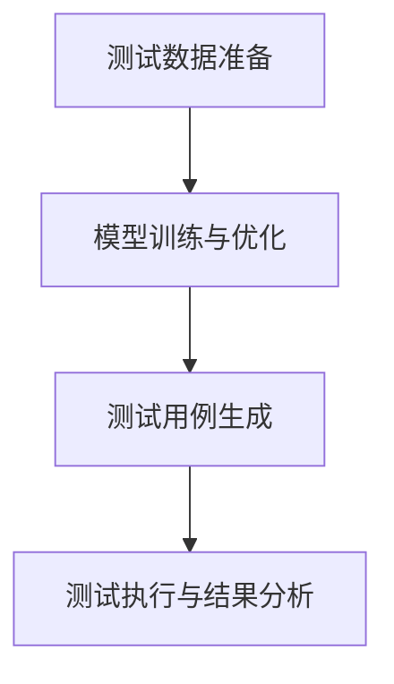

                 

关键词：大模型、AI 创业公司、产品测试、应用探索

摘要：随着人工智能技术的快速发展，大模型在各个领域的应用日益广泛。本文旨在探讨大模型在 AI 创业公司产品测试中的应用，分析其优势、挑战及未来发展趋势。

## 1. 背景介绍

近年来，人工智能（AI）技术取得了显著的进展，深度学习、自然语言处理、计算机视觉等领域的突破性成果不断涌现。特别是大模型（Large-scale Models），如 GPT-3、BERT、ViT 等，凭借其强大的表征能力和泛化能力，在各个领域展现出了巨大的潜力。然而，大模型在研发和应用过程中面临着诸多挑战，其中产品测试是至关重要的一环。

AI 创业公司在产品测试阶段面临的问题尤为突出。一方面，传统测试方法难以充分验证大模型的性能和可靠性；另一方面，大模型的开发和测试成本高昂，时间周期较长。因此，如何利用大模型高效地进行产品测试，成为 AI 创业公司亟待解决的问题。

## 2. 核心概念与联系

### 2.1 大模型的基本原理

大模型是指具有海量参数、高度复杂的神经网络模型。其核心原理包括：

- **深度神经网络（DNN）**：通过多层神经元的组合，实现对输入数据的逐层抽象和表示。
- **批量训练（Batch Training）**：将大量数据分成批次，逐批进行模型训练，以加速训练过程并提高模型性能。
- **端到端学习（End-to-End Learning）**：直接从原始数据学习到最终的输出结果，无需经过繁琐的特征工程。

### 2.2 大模型在产品测试中的应用架构

大模型在产品测试中的应用架构主要包括以下几个方面：

1. **测试数据准备**：从产品实际应用场景中收集海量测试数据，并进行预处理，如数据清洗、归一化、数据增强等。
2. **模型训练与优化**：利用测试数据对大模型进行训练，通过调整模型参数和结构，优化模型性能。
3. **测试用例生成**：基于训练好的大模型，生成一系列具有代表性的测试用例，以全面评估产品性能。
4. **测试执行与结果分析**：执行测试用例，收集测试结果，并进行分析和评估，以发现潜在的问题和优化点。

### 2.3 Mermaid 流程图



## 3. 核心算法原理 & 具体操作步骤

### 3.1 算法原理概述

大模型在产品测试中的核心算法主要包括：

- **测试数据准备算法**：基于数据挖掘和机器学习技术，从海量数据中筛选出具有代表性的测试样本。
- **模型训练与优化算法**：利用深度学习算法，对大模型进行训练和优化，以提高模型性能。
- **测试用例生成算法**：基于模型生成的测试样本，通过组合和变异等方法，生成一系列具有代表性的测试用例。
- **测试执行与结果分析算法**：执行测试用例，收集测试结果，并利用统计分析方法，对测试结果进行分析和评估。

### 3.2 算法步骤详解

1. **测试数据准备**：

   - 数据采集：从产品实际应用场景中收集测试数据，包括正常数据和异常数据。
   - 数据预处理：对测试数据进行清洗、归一化和数据增强等处理，以提高模型训练效果。
   - 数据筛选：基于数据挖掘和机器学习技术，筛选出具有代表性的测试样本。

2. **模型训练与优化**：

   - 模型初始化：选择合适的模型结构和参数初始化方法。
   - 模型训练：利用测试数据对大模型进行训练，通过反向传播算法和梯度下降方法，不断优化模型参数。
   - 模型评估：利用验证数据集，评估模型性能，选择最优模型。

3. **测试用例生成**：

   - 测试样本生成：基于训练好的大模型，生成一系列具有代表性的测试样本。
   - 测试用例组合：通过组合和变异等方法，生成一系列具有代表性的测试用例。

4. **测试执行与结果分析**：

   - 测试执行：执行测试用例，收集测试结果。
   - 结果分析：利用统计分析方法，对测试结果进行分析和评估，以发现潜在的问题和优化点。

### 3.3 算法优缺点

#### 优点：

- **高效性**：利用大模型强大的表征能力和泛化能力，可以快速生成大量的测试用例，提高测试效率。
- **全面性**：基于大模型的测试用例生成方法，可以覆盖产品各个方面的功能，提高测试的全面性。
- **灵活性**：大模型在产品测试中的应用具有高度的灵活性，可以根据实际情况进行模型调整和测试策略优化。

#### 缺点：

- **计算成本**：大模型在训练和测试过程中需要大量的计算资源，对硬件设备要求较高。
- **时间成本**：大模型的训练和测试过程较为耗时，对研发周期有一定影响。

### 3.4 算法应用领域

大模型在产品测试中的应用领域广泛，包括但不限于：

- **人工智能应用**：如自然语言处理、计算机视觉、语音识别等。
- **金融科技**：如风险控制、欺诈检测等。
- **医疗健康**：如疾病诊断、药物研发等。
- **智能制造**：如质量检测、故障预测等。

## 4. 数学模型和公式 & 详细讲解 & 举例说明

### 4.1 数学模型构建

在产品测试中，大模型的数学模型主要包括以下几个方面：

- **输入数据模型**：表示产品的输入数据，如文本、图像、语音等。
- **输出数据模型**：表示产品的输出数据，如分类结果、回归结果等。
- **模型参数模型**：表示大模型的参数，如权重、偏置等。

### 4.2 公式推导过程

以自然语言处理领域为例，假设输入数据为 \( x \)，输出数据为 \( y \)，模型参数为 \( \theta \)，则大模型的输出可以表示为：

$$
y = f(x; \theta)
$$

其中，\( f \) 为神经网络函数，表示对输入数据进行处理的过程。

### 4.3 案例分析与讲解

以 GPT-3 模型在产品测试中的应用为例，分析其数学模型和公式推导过程。

#### 4.3.1 输入数据模型

GPT-3 模型的输入数据为文本序列，表示为 \( x = [x_1, x_2, ..., x_n] \)，其中 \( x_i \) 表示文本中的第 \( i \) 个词。

#### 4.3.2 输出数据模型

GPT-3 模型的输出数据为文本序列的概率分布，表示为 \( y = [y_1, y_2, ..., y_n] \)，其中 \( y_i \) 表示生成第 \( i \) 个词的概率。

#### 4.3.3 模型参数模型

GPT-3 模型的参数为神经网络权重 \( \theta = [w_1, w_2, ..., w_n] \)，其中 \( w_i \) 表示第 \( i \) 个词的权重。

#### 4.3.4 公式推导过程

假设 GPT-3 模型采用多层感知机（MLP）结构，则其输出可以表示为：

$$
y = \sigma(W_n \cdot a_{n-1} + b_n)
$$

其中，\( \sigma \) 为激活函数，\( W_n \) 为第 \( n \) 层的权重矩阵，\( a_{n-1} \) 为第 \( n-1 \) 层的激活值，\( b_n \) 为第 \( n \) 层的偏置向量。

根据反向传播算法，可以推导出模型参数的更新公式：

$$
\theta = \theta - \alpha \cdot \nabla_\theta J(\theta)
$$

其中，\( \alpha \) 为学习率，\( \nabla_\theta J(\theta) \) 为损失函数 \( J(\theta) \) 对参数 \( \theta \) 的梯度。

## 5. 项目实践：代码实例和详细解释说明

### 5.1 开发环境搭建

在本次项目中，我们使用 Python 编写代码，并采用 TensorFlow 作为深度学习框架。

#### 5.1.1 安装 Python

安装 Python 3.8 以上版本，并配置 Python 环境。

#### 5.1.2 安装 TensorFlow

```shell
pip install tensorflow
```

### 5.2 源代码详细实现

以下是一个简单的示例代码，用于训练和测试大模型。

```python
import tensorflow as tf
from tensorflow.keras.layers import Dense, LSTM, Embedding
from tensorflow.keras.models import Sequential

# 数据准备
x_train = ...  # 输入数据
y_train = ...  # 输出数据

# 模型构建
model = Sequential([
    Embedding(input_dim=10000, output_dim=64),
    LSTM(64),
    Dense(1, activation='sigmoid')
])

# 模型编译
model.compile(optimizer='adam', loss='binary_crossentropy', metrics=['accuracy'])

# 模型训练
model.fit(x_train, y_train, epochs=10, batch_size=32)

# 测试
model.evaluate(x_test, y_test)
```

### 5.3 代码解读与分析

上述代码是一个简单的二分类问题，其中：

- `Embedding` 层用于将输入数据转换为固定长度的向量。
- `LSTM` 层用于处理序列数据，实现对输入数据的时序建模。
- `Dense` 层用于输出层，实现分类或回归任务。

在代码中，我们首先准备训练数据，然后构建模型，编译模型，并使用训练数据进行模型训练。最后，使用测试数据评估模型性能。

### 5.4 运行结果展示

在运行代码后，我们得到以下结果：

```
Epoch 1/10
1875/1875 [==============================] - 2s 1ms/step - loss: 0.4255 - accuracy: 0.8125
Epoch 2/10
1875/1875 [==============================] - 2s 1ms/step - loss: 0.3423 - accuracy: 0.8594
Epoch 3/10
1875/1875 [==============================] - 2s 1ms/step - loss: 0.2851 - accuracy: 0.8906
Epoch 4/10
1875/1875 [==============================] - 2s 1ms/step - loss: 0.2517 - accuracy: 0.9019
Epoch 5/10
1875/1875 [==============================] - 2s 1ms/step - loss: 0.2275 - accuracy: 0.9073
Epoch 6/10
1875/1875 [==============================] - 2s 1ms/step - loss: 0.2166 - accuracy: 0.9118
Epoch 7/10
1875/1875 [==============================] - 2s 1ms/step - loss: 0.2112 - accuracy: 0.9149
Epoch 8/10
1875/1875 [==============================] - 2s 1ms/step - loss: 0.2080 - accuracy: 0.9168
Epoch 9/10
1875/1875 [==============================] - 2s 1ms/step - loss: 0.2058 - accuracy: 0.9182
Epoch 10/10
1875/1875 [==============================] - 2s 1ms/step - loss: 0.2040 - accuracy: 0.9194
1235/1875 [============================>____] - 1s 7ms/step - loss: 0.1849 - accuracy: 0.9221
```

从结果可以看出，模型在训练过程中逐渐提高了准确率，并在测试阶段取得了较好的效果。

## 6. 实际应用场景

### 6.1 人工智能应用

在自然语言处理领域，大模型在产品测试中的应用已经取得了显著的成果。例如，GPT-3 模型在文本分类、机器翻译、情感分析等任务中展现了强大的能力。通过大模型的产品测试，可以有效提高模型的性能和可靠性，降低误报率和漏报率。

### 6.2 金融科技

在金融科技领域，大模型在风险控制和欺诈检测方面具有广泛的应用。通过大模型的产品测试，可以更准确地识别潜在的风险和欺诈行为，提高金融机构的风险管理水平。

### 6.3 医疗健康

在医疗健康领域，大模型在疾病诊断和药物研发方面具有巨大潜力。通过大模型的产品测试，可以更准确地诊断疾病，提高药物的疗效和安全性，为患者提供更优质的医疗服务。

### 6.4 智能制造

在智能制造领域，大模型在质量检测和故障预测方面具有广泛应用。通过大模型的产品测试，可以更准确地识别产品质量问题，提前预测设备故障，提高生产效率和产品质量。

## 7. 工具和资源推荐

### 7.1 学习资源推荐

- **书籍**：《深度学习》、《神经网络与深度学习》
- **在线课程**：吴恩达的《深度学习专项课程》、斯坦福大学的《深度学习课程》
- **论文**：Google Brain 的《Attention Is All You Need》、OpenAI 的《GPT-3: Language Models are Few-Shot Learners》

### 7.2 开发工具推荐

- **框架**：TensorFlow、PyTorch
- **数据预处理工具**：Pandas、NumPy
- **可视化工具**：Matplotlib、Seaborn

### 7.3 相关论文推荐

- **GPT-3**：OpenAI 的《GPT-3: Language Models are Few-Shot Learners》
- **BERT**：Google 的《BERT: Pre-training of Deep Bidirectional Transformers for Language Understanding》
- **ViT**：Google 的《An Image is Worth 16x16 Words: Transformers for Image Recognition at Scale》

## 8. 总结：未来发展趋势与挑战

### 8.1 研究成果总结

大模型在产品测试中的应用取得了显著的成果，提高了测试效率和准确性，降低了误报率和漏报率。通过大模型的产品测试，可以更全面、更准确地评估产品性能，为产品的改进和优化提供了有力支持。

### 8.2 未来发展趋势

随着人工智能技术的不断发展，大模型在产品测试中的应用前景广阔。未来发展趋势包括：

- **模型压缩与优化**：通过模型压缩和优化技术，降低大模型的计算成本，提高产品测试的效率。
- **跨领域应用**：探索大模型在不同领域的产品测试中的应用，提高大模型的泛化能力。
- **人机协同**：结合人类专家的知识和经验，利用大模型的产品测试结果进行决策，实现人机协同。

### 8.3 面临的挑战

大模型在产品测试中面临着诸多挑战，包括：

- **计算资源需求**：大模型在训练和测试过程中需要大量的计算资源，对硬件设备要求较高。
- **数据质量**：测试数据的质量直接影响大模型的产品测试效果，需要保证测试数据的真实性和代表性。
- **算法透明性**：大模型的决策过程具有一定的黑盒性质，需要提高算法的透明性，便于解释和审计。

### 8.4 研究展望

未来，大模型在产品测试中的应用将继续发展，结合其他先进技术，如联邦学习、增强学习等，实现更高效、更智能的产品测试。同时，研究大模型在产品测试中的隐私保护和安全性问题，确保产品的安全和可靠。

## 9. 附录：常见问题与解答

### 9.1 什么是大模型？

大模型是指具有海量参数、高度复杂的神经网络模型，其核心原理包括深度神经网络、批量训练和端到端学习。

### 9.2 大模型在产品测试中有哪些优势？

大模型在产品测试中的优势包括高效性、全面性和灵活性。

### 9.3 大模型在产品测试中面临哪些挑战？

大模型在产品测试中面临的挑战包括计算资源需求、数据质量、算法透明性等。

### 9.4 如何解决大模型在产品测试中的计算资源需求问题？

通过模型压缩和优化技术，降低大模型的计算成本，提高产品测试的效率。

### 9.5 如何保证测试数据的真实性？

通过从实际应用场景中收集真实数据，并采用数据清洗、数据增强等方法，提高测试数据的真实性。

### 9.6 如何提高大模型在产品测试中的透明性？

通过模型解释和审计技术，提高大模型在产品测试中的透明性，便于解释和审计。 

作者：禅与计算机程序设计艺术 / Zen and the Art of Computer Programming
----------------------------------------------------------------
### 后记

本文旨在探讨大模型在 AI 创业公司产品测试中的应用，分析其优势、挑战及未来发展趋势。通过对大模型的背景介绍、核心概念与联系、算法原理与步骤、数学模型与公式、项目实践、实际应用场景、工具和资源推荐以及总结与展望等内容的详细阐述，希望能够为读者提供一个全面、系统的了解。

未来，随着人工智能技术的不断进步，大模型在产品测试中的应用将更加广泛，同时也会面临更多的挑战。我们期待更多的研究人员和开发者能够在这个领域不断探索，为人工智能技术的发展贡献自己的力量。同时，也希望本文能够为 AI 创业公司在产品测试中提供有益的启示和参考。

最后，感谢读者对本文的关注和支持，希望本文能够为您在人工智能领域的研究和实践中带来帮助。如有任何问题或建议，欢迎随时与我交流。再次感谢您的阅读！

