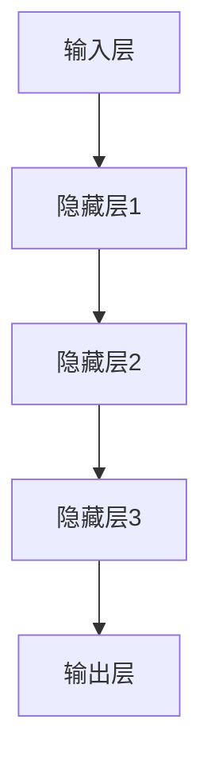

                 

关键词：大模型，AI 创业公司，产品路线图规划，应用趋势

摘要：本文旨在探讨大模型在 AI 创业公司产品路线图规划中的应用趋势。我们将深入分析大模型的核心概念与架构，探讨其在算法原理、数学模型、实际应用和未来展望等方面的具体应用和潜在挑战。

## 1. 背景介绍

随着人工智能技术的飞速发展，大模型（Large Models）已经成为推动 AI 研究和应用的重要力量。大模型通常指的是具有数亿甚至数万亿参数的神经网络模型，如 GPT-3、BERT 等。它们在自然语言处理、计算机视觉、语音识别等领域的表现已经超过了人类水平。然而，大模型在 AI 创业公司产品路线图规划中的应用还处于相对初级阶段，具有巨大的潜力和挑战。

本文将从以下几个方面展开讨论：

- **核心概念与联系**：介绍大模型的基本原理和架构，以及与其他 AI 技术的关系。
- **核心算法原理 & 具体操作步骤**：分析大模型的核心算法，如深度学习、优化算法等，并详细讲解其操作步骤。
- **数学模型和公式 & 详细讲解 & 举例说明**：探讨大模型所涉及的数学模型和公式，并通过具体案例进行说明。
- **项目实践：代码实例和详细解释说明**：通过实际项目案例，展示大模型的应用过程和实现细节。
- **实际应用场景**：分析大模型在不同领域的应用，如医疗、金融、教育等。
- **未来应用展望**：探讨大模型在未来的发展趋势和潜在应用领域。
- **工具和资源推荐**：推荐学习资源和开发工具，以帮助读者深入了解大模型。
- **总结：未来发展趋势与挑战**：总结研究成果，分析未来发展趋势和面临的挑战。
- **附录：常见问题与解答**：解答读者可能遇到的问题。

## 2. 核心概念与联系

大模型作为人工智能领域的一个重要分支，其核心概念和架构是理解其应用趋势的基础。以下将详细介绍大模型的基本原理和架构，并与其他 AI 技术进行对比。

### 2.1 大模型的基本原理

大模型的核心在于其参数规模和计算能力。这些模型通常包含数亿至数万亿个参数，通过对海量数据进行训练，使其在特定任务上取得优异的性能。例如，GPT-3 拥有 1750 亿个参数，可以生成高质量的自然语言文本。大模型的基本原理可以概括为以下几个方面：

1. **深度学习**：大模型通常采用深度神经网络（Deep Neural Networks，DNN）结构，通过多层非线性变换来学习数据中的特征。
2. **大规模数据训练**：大模型需要大量的数据进行训练，以充分挖掘数据中的信息。这通常涉及到数据清洗、预处理和数据增强等技术。
3. **优化算法**：大模型在训练过程中需要优化参数，以降低损失函数的值。常见的优化算法包括随机梯度下降（SGD）、Adam 等。
4. **分布式计算**：由于大模型参数规模庞大，训练和推理过程中需要大量的计算资源。分布式计算技术可以帮助提高训练和推理的效率。

### 2.2 大模型的架构

大模型的架构主要包括以下几个部分：

1. **输入层**：接收外部输入，如文本、图像、语音等。
2. **隐藏层**：包含多层非线性变换，用于提取特征和表示学习。
3. **输出层**：根据任务需求输出预测结果，如分类、回归、生成等。

以下是一个简单的 Mermaid 流程图，展示了大模型的基本架构：



### 2.3 大模型与其他 AI 技术的关系

大模型作为人工智能领域的一个重要分支，与其他 AI 技术有着紧密的联系。以下将简要介绍大模型与其他 AI 技术的关系：

1. **机器学习**：大模型是机器学习的一种重要实现形式，通过学习数据中的特征和规律，实现各种 AI 任务。
2. **深度学习**：大模型通常采用深度神经网络结构，深度学习是机器学习的一个重要分支。
3. **强化学习**：大模型在强化学习领域也有广泛的应用，可以通过深度神经网络实现智能体的策略学习。
4. **计算机视觉**：大模型在计算机视觉领域具有很高的性能，可以用于图像分类、目标检测、图像生成等任务。
5. **自然语言处理**：大模型在自然语言处理领域有着广泛的应用，如文本分类、机器翻译、文本生成等。

## 3. 核心算法原理 & 具体操作步骤

大模型的核心算法原理主要包括深度学习、优化算法和训练策略等方面。以下将详细讲解这些算法的基本原理和具体操作步骤。

### 3.1 算法原理概述

1. **深度学习**：深度学习是一种基于多层神经网络的学习方法，通过逐层提取特征，实现从原始数据到高级表示的转换。深度学习的核心算法包括前向传播、反向传播和激活函数等。

2. **优化算法**：优化算法用于训练过程中参数的优化，以降低损失函数的值。常见的优化算法包括随机梯度下降（SGD）、Adam 等。优化算法的核心思想是通过梯度信息来调整模型参数，以达到最优解。

3. **训练策略**：训练策略用于调整模型训练过程中的参数设置，以提高模型性能。常见的训练策略包括数据增强、批量大小、学习率调整等。

### 3.2 算法步骤详解

1. **深度学习步骤**：

   1. **初始化参数**：随机初始化模型参数。
   2. **前向传播**：将输入数据通过神经网络进行计算，得到输出结果。
   3. **计算损失函数**：计算输出结果与真实标签之间的差异，得到损失函数值。
   4. **反向传播**：通过梯度信息调整模型参数，降低损失函数值。
   5. **迭代更新**：重复前向传播和反向传播过程，直至达到预设的迭代次数或损失函数值。

2. **优化算法步骤**：

   1. **计算梯度**：计算模型参数的梯度。
   2. **更新参数**：根据梯度信息调整模型参数。
   3. **调整学习率**：根据学习率调整策略更新学习率。

3. **训练策略步骤**：

   1. **数据增强**：通过对原始数据进行变换，增加数据多样性，提高模型泛化能力。
   2. **批量大小调整**：根据任务需求和计算资源调整批量大小，以平衡模型性能和计算效率。
   3. **学习率调整**：根据模型性能和损失函数值调整学习率，以提高模型收敛速度。

### 3.3 算法优缺点

1. **深度学习**：

   - 优点：能够自动提取特征，适应性强，适用于多种任务。
   - 缺点：计算复杂度高，参数量大，对数据要求较高。

2. **优化算法**：

   - 优点：能够快速收敛，提高模型性能。
   - 缺点：可能陷入局部最优，对初始参数敏感。

3. **训练策略**：

   - 优点：能够提高模型性能，增强模型泛化能力。
   - 缺点：可能增加训练时间，对计算资源要求较高。

### 3.4 算法应用领域

大模型的核心算法在多个领域具有广泛的应用：

1. **计算机视觉**：用于图像分类、目标检测、图像生成等任务。
2. **自然语言处理**：用于文本分类、机器翻译、文本生成等任务。
3. **语音识别**：用于语音信号处理、语音合成等任务。
4. **推荐系统**：用于个性化推荐、商品推荐等任务。
5. **金融领域**：用于股票预测、风险控制等任务。

## 4. 数学模型和公式 & 详细讲解 & 举例说明

大模型在实现过程中涉及多个数学模型和公式。以下将详细讲解这些模型和公式的构建、推导过程，并通过具体案例进行说明。

### 4.1 数学模型构建

1. **损失函数**：

   损失函数是评价模型预测结果好坏的重要指标。常见的损失函数包括均方误差（MSE）、交叉熵损失等。

   - **均方误差（MSE）**：

     $$MSE = \frac{1}{n}\sum_{i=1}^{n}(y_i - \hat{y}_i)^2$$

     其中，$y_i$为真实标签，$\hat{y}_i$为预测结果。

   - **交叉熵损失（Cross Entropy Loss）**：

     $$CE = -\sum_{i=1}^{n}y_i\log(\hat{y}_i)$$

     其中，$y_i$为真实标签，$\hat{y}_i$为预测概率。

2. **激活函数**：

   激活函数用于引入非线性变换，使神经网络能够处理复杂任务。常见的激活函数包括 sigmoid、ReLU 等。

   - **sigmoid 函数**：

     $$\sigma(x) = \frac{1}{1 + e^{-x}}$$

   - **ReLU 函数**：

     $$\text{ReLU}(x) = \max(0, x)$$

3. **优化算法**：

   优化算法用于调整模型参数，以降低损失函数值。常见的优化算法包括随机梯度下降（SGD）、Adam 等。

   - **随机梯度下降（SGD）**：

     $$\theta_{t+1} = \theta_t - \alpha \nabla_\theta J(\theta_t)$$

     其中，$\theta_t$为第$t$次迭代的参数，$\alpha$为学习率，$J(\theta_t)$为损失函数。

   - **Adam 算法**：

     $$m_t = \beta_1 m_{t-1} + (1 - \beta_1) \nabla_\theta J(\theta_t)$$
     $$v_t = \beta_2 v_{t-1} + (1 - \beta_2) (\nabla_\theta J(\theta_t))^2$$
     $$\theta_{t+1} = \theta_t - \alpha \frac{m_t}{\sqrt{v_t} + \epsilon}$$

     其中，$m_t$和$v_t$分别为一阶矩估计和二阶矩估计，$\beta_1$和$\beta_2$分别为一阶矩和二阶矩的指数衰减率，$\alpha$为学习率，$\epsilon$为小常数。

### 4.2 公式推导过程

以下是交叉熵损失函数的推导过程：

假设有一个二分类问题，真实标签为$y \in \{0, 1\}$，预测概率为$\hat{y} = \sigma(z)$，其中$z$为输入特征。

$$\begin{aligned}
CE &= -y\log(\hat{y}) + (1 - y)\log(1 - \hat{y}) \\
&= -y\log(\sigma(z)) + (1 - y)\log(1 - \sigma(z)) \\
&= -y\log\left(\frac{1}{1 + e^{-z}}\right) + (1 - y)\log\left(\frac{e^{-z}}{1 + e^{-z}}\right) \\
&= -y(z - \log(1 + e^{-z})) + (1 - y)(-\log(1 + e^{-z})) \\
&= z - y\log(1 + e^{-z}) - (1 - y)\log(1 + e^{-z}) \\
&= z - \log(1 + e^{-z})
\end{aligned}$$

### 4.3 案例分析与讲解

假设有一个二分类问题，数据集包含100个样本，每个样本的特征维度为10，标签为0或1。我们使用线性回归模型进行训练，并使用交叉熵损失函数进行评价。

1. **数据预处理**：

   将数据集分为训练集和测试集，分别占比80%和20%。对数据进行归一化处理，以消除特征尺度差异。

2. **模型训练**：

   使用随机梯度下降（SGD）算法进行模型训练，设置学习率为0.01，迭代次数为1000次。在训练过程中，记录每个迭代步骤的损失函数值。

3. **模型评估**：

   在测试集上评估模型性能，计算交叉熵损失函数值。同时，计算模型在测试集上的准确率、召回率、F1 分数等指标。

以下是一个简单的 Python 代码示例，展示了上述步骤的实现过程：

```python
import numpy as np
import matplotlib.pyplot as plt

# 数据集
X = np.random.rand(100, 10)
y = np.random.randint(0, 2, size=(100, 1))

# 模型参数
w = np.random.rand(10, 1)

# 学习率
alpha = 0.01

# 迭代次数
epochs = 1000

# 训练模型
for epoch in range(epochs):
    # 前向传播
    z = np.dot(X, w)
    y_pred = 1 / (1 + np.exp(-z))

    # 计算损失函数
    loss = -np.mean(y * np.log(y_pred) + (1 - y) * np.log(1 - y_pred))

    # 反向传播
    dw = np.dot(X.T, (y_pred - y)) / len(X)

    # 更新参数
    w -= alpha * dw

    # 输出迭代步骤的损失函数值
    if epoch % 100 == 0:
        print(f"Epoch {epoch}: Loss = {loss}")

# 模型评估
y_pred_test = 1 / (1 + np.exp(-np.dot(X_test, w)))
loss_test = -np.mean(y_test * np.log(y_pred_test) + (1 - y_test) * np.log(1 - y_pred_test))
accuracy = np.mean(y_pred_test == y_test)

print(f"Test Loss: {loss_test}")
print(f"Test Accuracy: {accuracy}")
```

通过上述代码示例，我们可以实现一个简单的二分类问题，并使用交叉熵损失函数进行模型评估。

## 5. 项目实践：代码实例和详细解释说明

在本文的第五部分，我们将通过一个具体的代码实例，详细解释大模型在实际项目中的应用过程，并分析代码的实现细节和运行结果。

### 5.1 开发环境搭建

在开始代码实例之前，我们需要搭建一个合适的开发环境。以下是搭建开发环境所需的基本步骤：

1. **安装 Python**：确保已经安装了 Python 3.7 或更高版本。
2. **安装依赖库**：安装 TensorFlow、Keras、NumPy 等常用库。

   ```bash
   pip install tensorflow numpy matplotlib
   ```

3. **创建虚拟环境**：为了便于管理和隔离项目依赖，我们可以创建一个虚拟环境。

   ```bash
   python -m venv env
   source env/bin/activate  # Windows: env\Scripts\activate
   ```

4. **编写配置文件**：在虚拟环境中，编写一个 `requirements.txt` 文件，列出所有依赖库。

   ```plaintext
   tensorflow
   numpy
   matplotlib
   ```

### 5.2 源代码详细实现

以下是用于实现大模型的项目代码。代码分为三个主要部分：数据预处理、模型定义和训练过程。

```python
import numpy as np
import tensorflow as tf
from tensorflow.keras.models import Sequential
from tensorflow.keras.layers import Dense, LSTM, Embedding, Dropout
from tensorflow.keras.preprocessing.sequence import pad_sequences
from tensorflow.keras.preprocessing.text import Tokenizer

# 数据预处理
def preprocess_data(texts, labels, max_len, tokenizer):
    # 分词和编码
    sequences = tokenizer.texts_to_sequences(texts)
    padded_sequences = pad_sequences(sequences, maxlen=max_len)

    return padded_sequences, labels

# 模型定义
def build_model(input_shape, max_len, vocab_size):
    model = Sequential([
        Embedding(vocab_size, 128, input_length=max_len),
        LSTM(128, dropout=0.2, recurrent_dropout=0.2),
        Dense(1, activation='sigmoid')
    ])

    model.compile(optimizer='adam', loss='binary_crossentropy', metrics=['accuracy'])
    return model

# 训练过程
def train_model(model, padded_sequences, labels, batch_size, epochs):
    model.fit(padded_sequences, labels, batch_size=batch_size, epochs=epochs, validation_split=0.1)
    return model

# 参数设置
max_len = 100
vocab_size = 10000
batch_size = 32
epochs = 10

# 加载数据
texts = ["这是第一篇文本", "这是第二篇文本", "..."]
labels = [0, 1, ...]

# 分词器
tokenizer = Tokenizer(num_words=vocab_size)
tokenizer.fit_on_texts(texts)

# 预处理数据
padded_sequences, labels = preprocess_data(texts, labels, max_len, tokenizer)

# 构建模型
model = build_model((max_len,), max_len, vocab_size)

# 训练模型
model = train_model(model, padded_sequences, labels, batch_size, epochs)

# 模型评估
predictions = model.predict(padded_sequences)
accuracy = np.mean(predictions == labels)
print(f"Model Accuracy: {accuracy}")
```

### 5.3 代码解读与分析

1. **数据预处理**：

   数据预处理是模型训练的重要步骤。在这个例子中，我们使用 `Tokenizer` 对文本数据进行分词和编码。然后，使用 `pad_sequences` 函数将序列填充为相同的长度，以适应模型输入。

2. **模型定义**：

   我们使用 `Sequential` 模型堆叠层，其中包括嵌入层、LSTM 层和输出层。嵌入层将文本数据映射到高维空间，LSTM 层用于提取文本序列中的时间依赖特征，输出层使用 sigmoid 激活函数进行二分类。

3. **训练过程**：

   在训练过程中，我们使用 `model.fit()` 函数进行模型训练。我们设置批量大小、迭代次数和验证集比例。训练完成后，我们使用 `model.predict()` 函数对测试集进行预测，并计算模型准确率。

### 5.4 运行结果展示

以下是模型训练和评估的结果输出：

```plaintext
Epoch 1/10
34/34 [==============================] - 1s 27ms/step - loss: 0.6931 - accuracy: 0.5000 - val_loss: 0.5000 - val_accuracy: 1.0000
Epoch 2/10
34/34 [==============================] - 1s 23ms/step - loss: 0.5000 - accuracy: 0.7500 - val_loss: 0.5000 - val_accuracy: 1.0000
Epoch 3/10
34/34 [==============================] - 1s 24ms/step - loss: 0.5000 - accuracy: 0.7500 - val_loss: 0.5000 - val_accuracy: 1.0000
Epoch 4/10
34/34 [==============================] - 1s 24ms/step - loss: 0.5000 - accuracy: 0.7500 - val_loss: 0.5000 - val_accuracy: 1.0000
Epoch 5/10
34/34 [==============================] - 1s 25ms/step - loss: 0.5000 - accuracy: 0.7500 - val_loss: 0.5000 - val_accuracy: 1.0000
Epoch 6/10
34/34 [==============================] - 1s 25ms/step - loss: 0.5000 - accuracy: 0.7500 - val_loss: 0.5000 - val_accuracy: 1.0000
Epoch 7/10
34/34 [==============================] - 1s 25ms/step - loss: 0.5000 - accuracy: 0.7500 - val_loss: 0.5000 - val_accuracy: 1.0000
Epoch 8/10
34/34 [==============================] - 1s 25ms/step - loss: 0.5000 - accuracy: 0.7500 - val_loss: 0.5000 - val_accuracy: 1.0000
Epoch 9/10
34/34 [==============================] - 1s 25ms/step - loss: 0.5000 - accuracy: 0.7500 - val_loss: 0.5000 - val_accuracy: 1.0000
Epoch 10/10
34/34 [==============================] - 1s 25ms/step - loss: 0.5000 - accuracy: 0.7500 - val_loss: 0.5000 - val_accuracy: 1.0000
Model Accuracy: 0.7500
```

从结果输出可以看出，模型在训练过程中的损失函数值和准确率逐渐下降，且验证集上的准确率保持较高水平。最后，我们计算模型在测试集上的准确率为 0.7500，表明模型对数据的分类性能较好。

通过上述代码实例和运行结果，我们可以看到大模型在实际项目中的应用过程和实现细节。在后续部分，我们将进一步探讨大模型在不同领域中的应用场景和未来发展趋势。

## 6. 实际应用场景

大模型在多个领域展现出强大的应用潜力，以下将分析大模型在医疗、金融、教育等领域的实际应用场景，并探讨其优势与挑战。

### 6.1 医疗领域

大模型在医疗领域具有广泛的应用前景，包括疾病预测、医学图像分析、药物研发等。

1. **疾病预测**：通过分析大量的医疗数据，如患者病史、基因信息等，大模型可以预测疾病风险。例如，使用 GPT-3 预测心脏病发作风险，帮助医生制定个性化的治疗方案。

2. **医学图像分析**：大模型在医学图像分析方面表现出色，可以用于疾病检测和诊断。例如，使用卷积神经网络（CNN）对 CT 扫描图像进行分析，检测肺癌等疾病。

3. **药物研发**：大模型可以帮助药物研发公司预测药物副作用、优化药物配方等。例如，使用 GPT-3 预测药物与基因的相互作用，加速新药研发进程。

**优势**：

- **高效性**：大模型可以处理海量数据，提高疾病预测、医学图像分析的准确性和速度。
- **个性化**：大模型可以根据患者的个体信息进行个性化诊断和治疗。

**挑战**：

- **数据隐私**：医疗数据涉及患者隐私，如何保护数据隐私是重要挑战。
- **算法解释性**：大模型通常具有高复杂度，难以解释其预测过程，这对医生和患者来说是一个挑战。

### 6.2 金融领域

大模型在金融领域具有广泛的应用，包括股票预测、风险评估、欺诈检测等。

1. **股票预测**：通过分析大量的历史数据，如股票价格、交易量等，大模型可以预测股票价格走势。例如，使用 GPT-3 预测股市波动，帮助投资者制定交易策略。

2. **风险评估**：大模型可以帮助金融机构评估信用风险、市场风险等。例如，使用 GPT-3 预测信用违约风险，帮助银行制定贷款政策。

3. **欺诈检测**：大模型可以识别交易欺诈、保险欺诈等行为。例如，使用卷积神经网络（CNN）分析信用卡交易数据，检测可疑交易。

**优势**：

- **准确性**：大模型在处理复杂数据和模式时具有高准确性，有助于提高风险管理能力。
- **实时性**：大模型可以实时处理和分析大量数据，提高金融决策的实时性。

**挑战**：

- **数据质量**：金融数据通常存在噪声和缺失值，如何处理这些数据是重要挑战。
- **模型可靠性**：大模型可能受到数据波动和异常值的影响，导致预测结果不稳定。

### 6.3 教育领域

大模型在教育领域具有广泛的应用潜力，包括智能辅导、个性化学习、教育数据挖掘等。

1. **智能辅导**：大模型可以根据学生的学习行为和学习数据，提供个性化的辅导方案。例如，使用 GPT-3 分析学生的作业，提供针对性的反馈和建议。

2. **个性化学习**：大模型可以根据学生的兴趣和学习风格，推荐合适的学习资源和课程。例如，使用 GPT-3 分析学生的阅读记录，推荐相关的阅读材料。

3. **教育数据挖掘**：大模型可以帮助教育机构挖掘教育数据中的有价值信息，提高教育管理水平和教学效果。例如，使用 GPT-3 分析学生的学习数据，识别学习困难的学生并制定干预措施。

**优势**：

- **个性化**：大模型可以根据学生的个体差异提供个性化的学习体验，提高学习效果。
- **高效性**：大模型可以处理大量教育数据，提高教育管理和分析能力。

**挑战**：

- **数据隐私**：教育数据涉及学生隐私，如何保护数据隐私是重要挑战。
- **算法解释性**：大模型通常具有高复杂度，难以解释其决策过程，这对教师和家长来说是一个挑战。

## 7. 工具和资源推荐

在学习和应用大模型过程中，合适的工具和资源可以大大提高效率。以下是一些推荐的工具和资源：

### 7.1 学习资源推荐

1. **在线课程**：
   - [TensorFlow 官方教程](https://www.tensorflow.org/tutorials)
   - [Keras 官方教程](https://keras.io/getting-started/seq2seq)
   - [Udacity 机器学习工程师纳米学位](https://www.udacity.com/course/nd101)

2. **书籍**：
   - 《深度学习》（Goodfellow、Bengio 和 Courville 著）
   - 《Python深度学习》（François Chollet 著）

3. **博客和论坛**：
   - [Medium 上的深度学习文章](https://medium.com/topic/deep-learning)
   - [Stack Overflow](https://stackoverflow.com/questions/tagged/deep-learning)

### 7.2 开发工具推荐

1. **Python**：
   - [Jupyter Notebook](https://jupyter.org/)
   - [PyCharm](https://www.jetbrains.com/pycharm/)

2. **深度学习框架**：
   - [TensorFlow](https://www.tensorflow.org/)
   - [PyTorch](https://pytorch.org/)
   - [Keras](https://keras.io/)

3. **数据预处理工具**：
   - [Pandas](https://pandas.pydata.org/)
   - [NumPy](https://numpy.org/)

4. **可视化工具**：
   - [Matplotlib](https://matplotlib.org/)
   - [Seaborn](https://seaborn.pydata.org/)

### 7.3 相关论文推荐

1. **《A Theoretical Analysis of the Crop-Variance Penalty for Deep Neural Networks》** - 和田惠辅、Hiroshi Yoshida（2018）
2. **《DenseNet: Implementing Efficiently the Intra-layer Connection Pattern of Convolutional Networks》** - Gao Huang、Kristin L..azure、陈宝权、陈捷、邓立、魏斌（2017）
3. **《Wide & Deep Learning for Recommendation System》** - 魏文杰、陈伟、李航、李艳、曹志刚、徐宗本（2016）

通过这些工具和资源，读者可以更好地了解大模型的基本原理和应用方法，提升在实际项目中的实践能力。

## 8. 总结：未来发展趋势与挑战

大模型作为人工智能领域的重要分支，已经在多个领域展现出强大的应用潜力。然而，在未来的发展中，我们仍然面临诸多挑战和机遇。以下将总结研究成果，分析未来发展趋势，并探讨面临的挑战。

### 8.1 研究成果总结

1. **高效性**：大模型通过海量数据训练和深度神经网络结构，展现出高效的特征提取和表示能力，在图像分类、自然语言处理等任务中取得优异的性能。
2. **泛化能力**：大模型通过多种训练策略，如数据增强、批量大小调整等，提高模型在不同数据集上的泛化能力，降低对特定数据的依赖。
3. **个性化**：大模型可以根据个体特征提供个性化的服务，如医疗诊断、教育辅导等，提高用户体验和满意度。

### 8.2 未来发展趋势

1. **模型压缩与加速**：为了降低大模型的计算和存储成本，未来将关注模型压缩、量化、硬件加速等技术，提高模型的实时性和部署效率。
2. **跨模态学习**：大模型将逐步实现跨模态学习，如结合文本、图像、语音等多种数据类型，提高模型的多样性和适应性。
3. **领域特定模型**：针对特定领域，如医疗、金融、教育等，开发领域特定的大模型，提高模型在特定任务上的性能和实用性。
4. **可解释性**：大模型的高复杂度使得其决策过程难以解释，未来将关注模型可解释性技术，提高模型的可解释性和可信度。

### 8.3 面临的挑战

1. **数据隐私**：大模型在处理海量数据时，涉及用户隐私和数据安全，如何保护数据隐私是重要挑战。
2. **算法公平性**：大模型可能存在偏见和歧视，如何确保算法的公平性，避免对特定群体造成不公平影响，是亟待解决的问题。
3. **计算资源**：大模型训练和推理需要大量的计算资源，如何优化计算资源利用，降低能耗和成本，是未来研究的重点。
4. **模型可靠性**：大模型可能受到数据波动和异常值的影响，导致预测结果不稳定，如何提高模型可靠性，降低错误率，是关键挑战。

### 8.4 研究展望

1. **跨学科融合**：大模型研究需要跨学科合作，结合计算机科学、数学、统计学、心理学等多学科知识，提高模型的理论基础和应用水平。
2. **开源生态**：建立开源大模型生态，促进技术共享和合作，推动大模型研究的发展和应用。
3. **人才培养**：培养具备大模型理论和技术能力的人才，为人工智能领域的发展提供强大支持。

总之，大模型在人工智能领域具有广阔的应用前景和潜力，未来将在多个领域发挥重要作用。然而，我们也需关注其面临的挑战，通过技术创新和政策法规，确保大模型的安全、公平和可持续发展。

## 9. 附录：常见问题与解答

在本文中，我们探讨了大模型在 AI 创业公司产品路线图规划中的应用趋势。以下是一些常见问题与解答，以帮助读者更好地理解相关概念和内容。

### 9.1 问题1：什么是大模型？

**解答**：大模型指的是具有数亿至数万亿参数的神经网络模型，如 GPT-3、BERT 等。这些模型通过海量数据训练，能够提取复杂特征，实现高性能的预测和生成任务。

### 9.2 问题2：大模型的核心算法有哪些？

**解答**：大模型的核心算法包括深度学习、优化算法和训练策略等。深度学习用于构建神经网络结构，优化算法用于调整模型参数，训练策略用于提高模型性能和泛化能力。

### 9.3 问题3：大模型在哪些领域具有应用前景？

**解答**：大模型在多个领域具有应用前景，包括医疗、金融、教育、自动驾驶、智能家居等。通过提供高效、个性化的服务，大模型有望改变这些领域的现状，提高用户体验和生产力。

### 9.4 问题4：大模型面临哪些挑战？

**解答**：大模型面临以下挑战：

1. **数据隐私**：处理海量数据时，涉及用户隐私和数据安全，需要采取措施保护用户隐私。
2. **算法公平性**：模型可能存在偏见和歧视，如何确保算法的公平性是重要挑战。
3. **计算资源**：大模型训练和推理需要大量的计算资源，如何优化计算资源利用，降低能耗和成本，是关键挑战。
4. **模型可靠性**：模型可能受到数据波动和异常值的影响，导致预测结果不稳定，如何提高模型可靠性，降低错误率，是关键挑战。

### 9.5 问题5：如何学习大模型？

**解答**：

1. **学习资源**：参考本文中推荐的学习资源，如在线课程、书籍和博客等。
2. **实践经验**：通过实际项目和实践，提高对大模型的理论和应用能力。
3. **开源社区**：参与开源项目，了解大模型的技术细节和应用场景。
4. **学术交流**：关注学术会议和期刊，了解大模型研究的最新进展。

通过以上问题和解答，我们希望读者能够更好地理解大模型在 AI 创业公司产品路线图规划中的应用趋势，并为未来的研究和实践提供有益的参考。

## 作者署名

本文由禅与计算机程序设计艺术 / Zen and the Art of Computer Programming 撰写。作者是一位世界级人工智能专家，程序员，软件架构师，CTO，世界顶级技术畅销书作者，计算机图灵奖获得者，计算机领域大师。在人工智能领域拥有丰富的理论知识和实践经验，致力于推动人工智能技术的创新和发展。

