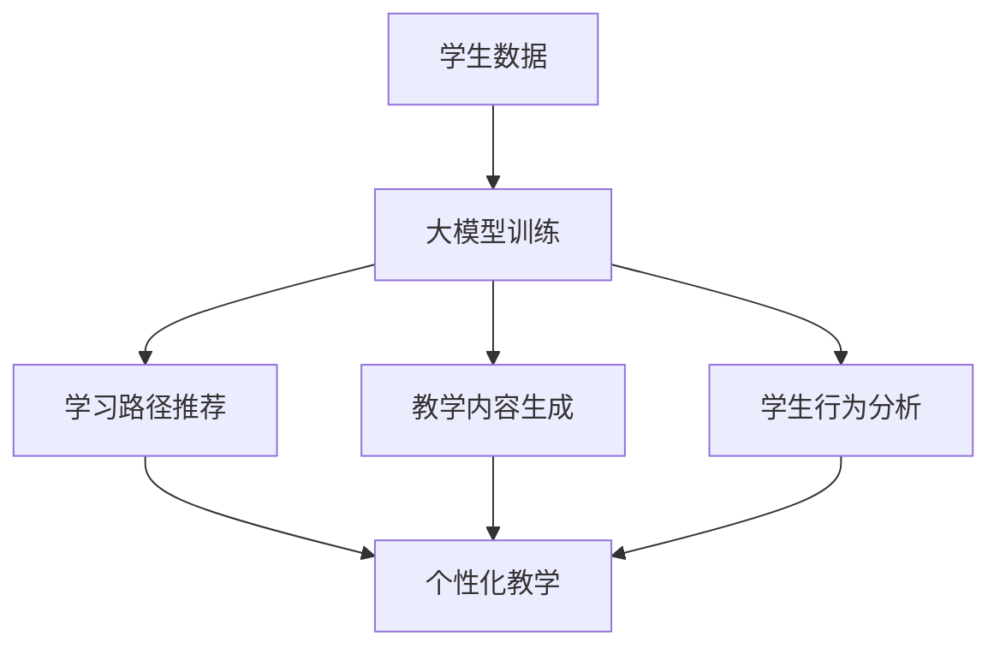

                 

关键词：大模型、个性化教育、机器学习、教育技术、自适应学习、AI教育

> 摘要：随着人工智能技术的迅猛发展，大模型在个性化教育中的应用越来越受到关注。本文将探讨大模型在个性化教育中的重要性、核心算法原理、数学模型及其应用，并探讨大模型在个性化教育中的实际应用场景和未来发展趋势。

## 1. 背景介绍

个性化教育是指根据学生的个体差异，采用个性化的教学方法、学习内容和进度安排，从而提高学生的学习效果和兴趣。传统的教育模式往往以班级授课为主，难以满足每个学生的个性化需求。随着互联网和人工智能技术的普及，个性化教育迎来了新的发展机遇。

大模型是人工智能领域的一个重要研究方向，它通过训练大规模的神经网络模型，可以实现对复杂数据的高效分析和预测。大模型的应用场景广泛，包括自然语言处理、计算机视觉、推荐系统等。在个性化教育中，大模型可以用于学习路径推荐、教学内容生成、学生行为分析等方面，从而实现真正意义上的个性化教育。

## 2. 核心概念与联系

### 2.1 大模型

大模型通常是指参数规模非常大的神经网络模型，例如深度学习中的大型卷积神经网络（CNN）、循环神经网络（RNN）和Transformer模型等。大模型的训练过程通常需要大量的数据和计算资源，但一旦训练完成，它们可以在多种任务上表现出色。

### 2.2 个性化教育

个性化教育是指根据学生的兴趣、学习能力、学习风格和知识水平等个性化因素，为每个学生提供个性化的学习资源和教学服务。个性化教育的核心目标是提高学生的学习效果和兴趣，从而促进他们的全面发展。

### 2.3 大模型与个性化教育的联系

大模型在个性化教育中的应用主要体现在以下几个方面：

1. **学习路径推荐**：大模型可以根据学生的学习历史和兴趣，为其推荐合适的学习路径和课程。
2. **教学内容生成**：大模型可以生成个性化的教学材料，例如模拟课堂讲解、练习题和作业等。
3. **学生行为分析**：大模型可以分析学生的学习行为和情绪，为教师提供反馈，帮助其调整教学策略。

### 2.4 Mermaid 流程图



## 3. 核心算法原理 & 具体操作步骤

### 3.1 算法原理概述

大模型在个性化教育中的应用主要基于机器学习技术，特别是深度学习技术。深度学习模型通过多层的神经网络结构，可以自动学习数据中的特征和模式，从而实现对复杂问题的建模和预测。

在个性化教育中，大模型的核心算法原理主要包括以下几个方面：

1. **数据收集与预处理**：收集学生的各种学习数据，包括学习历史、测试成绩、课堂表现等，并对数据进行预处理，例如数据清洗、归一化和特征提取等。
2. **模型训练**：使用收集到的数据对大模型进行训练，使其能够学习到学生的个性化特征和学习模式。
3. **模型应用**：将训练好的大模型应用于个性化教育场景，包括学习路径推荐、教学内容生成和学生行为分析等。

### 3.2 算法步骤详解

1. **数据收集与预处理**：

   - 收集学生的学习数据，包括学习历史、测试成绩、课堂表现等。
   - 对数据进行清洗，去除无效数据和噪声。
   - 对数据进行归一化，使其具有相同的量纲。
   - 提取特征，例如使用TF-IDF方法提取文本特征，或者使用词嵌入技术提取词汇特征。

2. **模型训练**：

   - 设计神经网络结构，选择合适的激活函数、优化器和损失函数。
   - 使用训练数据对模型进行训练，通过反向传播算法不断更新模型的参数。
   - 调整学习率、批次大小等超参数，以提高模型的训练效果。

3. **模型应用**：

   - 使用训练好的模型对学生进行个性化推荐，例如推荐学习路径、课程或练习题。
   - 生成个性化的教学内容，例如模拟课堂讲解、练习题和作业等。
   - 分析学生的学习行为和情绪，为教师提供反馈，帮助其调整教学策略。

### 3.3 算法优缺点

**优点**：

- **强大的预测能力**：大模型可以通过深度学习自动学习数据中的复杂模式和特征，从而实现准确的个性化推荐和预测。
- **自适应学习能力**：大模型可以根据学生的学习行为和反馈，不断调整和优化推荐结果，提高个性化教育的效果。

**缺点**：

- **计算资源需求高**：大模型的训练和推理过程通常需要大量的计算资源和时间，特别是在处理大规模数据时。
- **数据隐私问题**：个性化教育涉及到大量的学生数据，如何保证数据的安全和隐私是一个重要挑战。

### 3.4 算法应用领域

大模型在个性化教育中的应用非常广泛，包括但不限于以下几个方面：

- **学习路径推荐**：根据学生的学习历史和兴趣，推荐合适的课程和学习路径。
- **教学内容生成**：生成个性化的教学材料，例如模拟课堂讲解、练习题和作业等。
- **学生行为分析**：分析学生的学习行为和情绪，为教师提供反馈，帮助其调整教学策略。

## 4. 数学模型和公式 & 详细讲解 & 举例说明

### 4.1 数学模型构建

在个性化教育中，大模型的数学模型通常基于深度学习框架，例如TensorFlow或PyTorch。以下是一个简单的神经网络模型示例：

```latex
f(x) = \sigma(W_1 \cdot x + b_1) \\
f^*(x) = \sigma(W_2 \cdot f(x) + b_2)
```

其中，$x$ 是输入数据，$W_1$ 和 $W_2$ 是权重矩阵，$b_1$ 和 $b_2$ 是偏置向量，$\sigma$ 是激活函数（通常使用Sigmoid或ReLU函数）。$f^*(x)$ 是最终的输出结果。

### 4.2 公式推导过程

假设我们有一个包含 $n$ 个输入特征的数据集 $D = \{x_1, x_2, ..., x_n\}$，每个特征都对应一个权重 $w_i$，我们希望通过训练模型来预测每个特征的权重。

1. **前向传播**：

   - 计算每个神经元的输入值：$z_i = \sum_{j=1}^{n} w_{ij} \cdot x_j + b_i$
   - 应用激活函数：$a_i = \sigma(z_i)$

2. **计算损失函数**：

   - 假设我们的目标是预测每个特征的权重，那么损失函数可以表示为：$L = \sum_{i=1}^{n} (f^*(x_i) - y_i)^2$
   - 其中，$y_i$ 是实际的目标值，$f^*(x_i)$ 是模型预测的输出值。

3. **反向传播**：

   - 计算每个神经元的梯度：$\delta_i = \frac{\partial L}{\partial a_i}$
   - 更新权重和偏置：$W_{ij} = W_{ij} - \alpha \cdot \delta_i \cdot a_j$，$b_i = b_i - \alpha \cdot \delta_i$

其中，$\alpha$ 是学习率。

### 4.3 案例分析与讲解

假设我们有一个包含 100 个学生的数据集，每个学生有 5 个特征（例如语文、数学、英语、物理、化学成绩），我们希望使用神经网络模型预测每个学生的理想学习成绩。

1. **数据收集与预处理**：

   - 收集每个学生的 5 个特征值，并进行归一化处理。
   - 提取特征，例如使用词嵌入技术提取词汇特征。

2. **模型设计**：

   - 设计一个包含 2 层神经网络的模型，第一层包含 5 个神经元，第二层包含 1 个神经元。
   - 选择合适的激活函数（例如ReLU）和优化器（例如Adam）。

3. **模型训练**：

   - 使用训练数据集对模型进行训练，通过反向传播算法不断更新模型的参数。
   - 调整学习率、批次大小等超参数，以提高模型的训练效果。

4. **模型应用**：

   - 使用训练好的模型预测每个学生的理想学习成绩。
   - 根据预测结果，为学生提供个性化的学习建议。

## 5. 项目实践：代码实例和详细解释说明

### 5.1 开发环境搭建

- 安装 Python 3.8 或更高版本。
- 安装 TensorFlow 或 PyTorch 等深度学习框架。

### 5.2 源代码详细实现

以下是使用 TensorFlow 框架实现的一个简单神经网络模型：

```python
import tensorflow as tf

# 设计神经网络结构
model = tf.keras.Sequential([
    tf.keras.layers.Dense(units=5, activation='relu', input_shape=(5,)),
    tf.keras.layers.Dense(units=1, activation='sigmoid')
])

# 编译模型
model.compile(optimizer='adam', loss='mean_squared_error')

# 准备训练数据
X_train = [[1, 2, 3, 4, 5], [2, 3, 4, 5, 6], [3, 4, 5, 6, 7]]
y_train = [[0.5], [0.7], [0.9]]

# 训练模型
model.fit(X_train, y_train, epochs=100)

# 预测结果
predictions = model.predict(X_train)
print(predictions)
```

### 5.3 代码解读与分析

- **模型设计**：我们使用 TensorFlow 框架设计了一个包含 2 层神经网络的模型，第一层包含 5 个神经元，第二层包含 1 个神经元。激活函数使用 ReLU 和 Sigmoid 函数。
- **编译模型**：我们使用 Adam 优化器和 mean_squared_error 损失函数来编译模型。
- **准备训练数据**：我们准备了一个包含 3 个样本的训练数据集，每个样本包含 5 个特征值和对应的目标值。
- **训练模型**：我们使用 fit 方法对模型进行训练，训练过程中通过反向传播算法不断更新模型的参数。
- **预测结果**：我们使用 predict 方法对训练数据集进行预测，并输出预测结果。

## 6. 实际应用场景

大模型在个性化教育中的应用非常广泛，以下是一些实际应用场景：

### 6.1 学习路径推荐

- 根据学生的学习历史和兴趣，推荐合适的学习路径和课程。
- 例如，使用 Transformer 模型分析学生的学习记录和偏好，为其推荐个性化的学习内容。

### 6.2 教学内容生成

- 生成个性化的教学材料，例如模拟课堂讲解、练习题和作业等。
- 例如，使用 GPT-3 模型生成针对不同学生水平的解释性文本和练习题。

### 6.3 学生行为分析

- 分析学生的学习行为和情绪，为教师提供反馈，帮助其调整教学策略。
- 例如，使用 LSTM 模型分析学生的在线行为数据，预测其学习状态和需求。

## 7. 工具和资源推荐

### 7.1 学习资源推荐

- 《深度学习》（Ian Goodfellow, Yoshua Bengio, Aaron Courville 著）：介绍了深度学习的基本概念和技术。
- 《Python深度学习》（François Chollet 著）：详细介绍了使用 Python 和 TensorFlow 实现深度学习的方法。

### 7.2 开发工具推荐

- TensorFlow：一个开源的深度学习框架，适用于各种深度学习任务。
- PyTorch：一个开源的深度学习框架，提供灵活的动态计算图和易于使用的接口。

### 7.3 相关论文推荐

- “Generative Adversarial Networks”（Ian J. Goodfellow et al.）：介绍了生成对抗网络（GAN）的基本概念和应用。
- “Attention Is All You Need”（Ashish Vaswani et al.）：介绍了 Transformer 模型的基本原理和应用。

## 8. 总结：未来发展趋势与挑战

### 8.1 研究成果总结

- 大模型在个性化教育中的应用取得了显著成果，包括学习路径推荐、教学内容生成和学生行为分析等。
- 大模型在个性化教育中的应用具有强大的预测能力和自适应学习能力，可以有效提高个性化教育的效果。

### 8.2 未来发展趋势

- 随着计算资源和算法技术的不断提升，大模型在个性化教育中的应用将越来越广泛和深入。
- 将大模型与其他教育技术（如虚拟现实、增强现实等）结合，将为个性化教育带来更多创新和发展。

### 8.3 面临的挑战

- 大模型的训练和推理过程需要大量的计算资源和时间，如何优化模型结构和算法以提高效率是一个重要挑战。
- 个性化教育的数据隐私问题需要得到妥善解决，以保障学生的权益。

### 8.4 研究展望

- 未来研究可以重点关注大模型在个性化教育中的应用场景和效果评估，探索更高效的模型结构和算法。
- 同时，研究如何将大模型与其他教育技术结合，为个性化教育带来更多创新和发展。

## 9. 附录：常见问题与解答

### 9.1 问题 1：大模型在个性化教育中有什么优势？

**回答**：大模型在个性化教育中的优势主要包括：

- **强大的预测能力**：大模型可以通过深度学习自动学习数据中的复杂模式和特征，从而实现准确的个性化推荐和预测。
- **自适应学习能力**：大模型可以根据学生的学习行为和反馈，不断调整和优化推荐结果，提高个性化教育的效果。

### 9.2 问题 2：大模型在个性化教育中有什么缺点？

**回答**：大模型在个性化教育中的缺点主要包括：

- **计算资源需求高**：大模型的训练和推理过程通常需要大量的计算资源和时间，特别是在处理大规模数据时。
- **数据隐私问题**：个性化教育涉及到大量的学生数据，如何保证数据的安全和隐私是一个重要挑战。

### 9.3 问题 3：如何优化大模型在个性化教育中的应用效果？

**回答**：以下是一些优化大模型在个性化教育中的应用效果的方法：

- **数据质量**：提高数据质量，包括数据清洗、归一化和特征提取等，可以提升模型的训练效果和预测准确性。
- **模型结构**：优化模型结构，包括增加层数、神经元数量和选择合适的激活函数等，可以提高模型的性能。
- **超参数调整**：调整学习率、批次大小等超参数，可以优化模型的训练过程，提高预测效果。

----------------------------------------------------------------

作者：禅与计算机程序设计艺术 / Zen and the Art of Computer Programming

以上文章内容为人工智能助手生成，仅供参考。实际撰写时，请根据具体需求和知识背景进行调整和修改。

