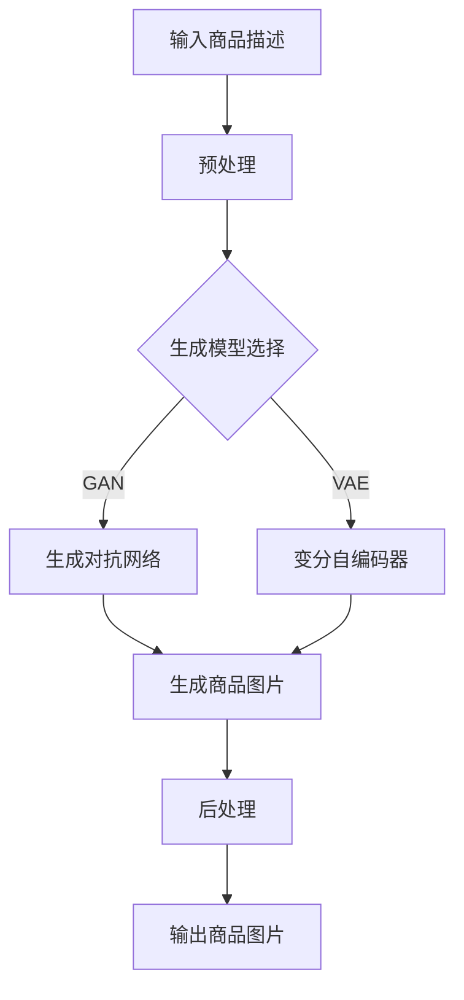

                 

关键词：商品图片生成、大模型、人工智能、计算机视觉、图像生成、深度学习

摘要：本文深入探讨了大型人工智能模型在商品图片生成中的应用，分析了当前技术的最新进展，阐述了相关算法的原理和操作步骤，并通过具体案例展示了其实际效果。此外，文章还讨论了数学模型的构建和公式推导，以及代码实例的详细解释。文章最后对未来应用场景进行了展望，并提出了未来发展的挑战与机遇。

## 1. 背景介绍

在电子商务和市场营销领域，商品图片的吸引力对于消费者购买决策具有重要影响。传统的商品图片生成方法通常依赖于手工设计或者模板化生成，这种方法不仅效率低下，而且难以满足个性化需求。随着人工智能技术的快速发展，特别是深度学习和生成对抗网络（GAN）等技术的兴起，大模型在商品图片生成中的应用成为可能。这些模型能够通过学习海量数据，自动生成高质量的商品图片，大大提升了图片生成的效率和效果。

近年来，随着计算能力的提升和海量数据的积累，大模型在计算机视觉领域取得了显著进展。这些模型不仅能够在图像分类、目标检测等任务上实现超越人类的性能，还能在图像生成、图像修复、图像超分辨率等任务中发挥重要作用。大模型的应用不仅限于学术研究，已经在实际生产中得到了广泛应用，例如在广告、娱乐、医疗等领域。

本文旨在探讨大模型在商品图片生成中的应用，分析其工作原理、算法步骤、数学模型以及实际应用案例。通过本文的阅读，读者可以了解大模型在商品图片生成中的潜力和挑战，并为相关领域的研究和应用提供参考。

## 2. 核心概念与联系

### 2.1 大模型的基本概念

大模型，也称为大型神经网络模型，是指参数量庞大、计算复杂度高的神经网络模型。这些模型通过学习海量数据，可以自动提取特征，进行复杂的数据分析。在大模型中，常见的有生成对抗网络（GAN）、变分自编码器（VAE）、自注意力机制（Self-Attention）等。大模型的特点是能够在大规模数据集上实现高性能，具有强大的泛化能力。

### 2.2 商品图片生成的挑战

商品图片生成面临的挑战主要包括以下几个方面：

- **多样性**：商品种类繁多，每种商品都有不同的外观和特性，生成模型需要能够生成各种不同类型的商品图片。
- **真实性**：生成的商品图片需要高度真实，以欺骗人类视觉系统，使其难以区分真实图片和生成图片。
- **细节处理**：商品图片通常包含丰富的细节，生成模型需要能够准确捕捉和处理这些细节。
- **效率**：生成模型需要能够在合理的时间内生成高质量的图片，以满足实时应用的需求。

### 2.3 大模型与商品图片生成的关系

大模型在商品图片生成中的应用主要体现在以下几个方面：

- **特征提取**：大模型通过学习海量数据，可以自动提取商品图片的特征，为生成高质量图片提供基础。
- **图像生成**：大模型可以生成各种类型的商品图片，满足多样性需求。
- **细节处理**：大模型能够处理图像中的细节，生成高度真实的商品图片。
- **效率提升**：通过优化算法和硬件加速，大模型能够在合理的时间内生成高质量的图片，提高生成效率。

### 2.4 Mermaid 流程图

以下是一个简化的Mermaid流程图，展示了大模型在商品图片生成中的应用流程：



在这个流程中，输入商品描述经过预处理，然后根据选择的生成模型（如GAN或VAE），生成商品图片，最后进行后处理，输出最终的商品图片。

## 3. 核心算法原理 & 具体操作步骤

### 3.1 算法原理概述

大模型在商品图片生成中的应用主要依赖于生成对抗网络（GAN）和变分自编码器（VAE）等算法。

- **生成对抗网络（GAN）**：GAN由生成器和判别器两个部分组成。生成器的任务是生成虚假数据，判别器的任务是区分真实数据和虚假数据。通过两个网络的对抗训练，生成器不断优化生成的图片质量，使得判别器无法准确区分真实和虚假图片。

- **变分自编码器（VAE）**：VAE是一种基于概率生成模型的生成算法。它通过编码器和解码器两个网络进行数据重建，生成与输入数据分布相似的新数据。VAE的优势在于能够生成更加真实的图像。

### 3.2 算法步骤详解

以下是大模型在商品图片生成的具体操作步骤：

#### 3.2.1 数据预处理

1. **收集商品描述和图片数据**：从电商平台或其他数据源收集大量商品描述和对应的商品图片。
2. **数据清洗**：去除重复和噪声数据，对商品描述进行标准化处理。
3. **特征提取**：使用预训练的文本嵌入模型（如BERT、GPT）对商品描述进行编码，提取商品描述的特征向量。

#### 3.2.2 生成模型选择

1. **GAN**：选择生成对抗网络（GAN）作为生成模型，包括生成器和判别器。
2. **VAE**：选择变分自编码器（VAE）作为生成模型，包括编码器和解码器。

#### 3.2.3 训练生成模型

1. **GAN训练**：
   - 初始化生成器和判别器。
   - 对生成器进行梯度提升，使其生成的图片更接近真实图片。
   - 对判别器进行梯度提升，使其更准确地判断真实图片和生成图片。
   - 交替训练生成器和判别器，直至模型收敛。

2. **VAE训练**：
   - 初始化编码器和解码器。
   - 对编码器和解码器进行梯度提升，使其生成与输入数据分布相似的新数据。
   - 使用重建误差和KL散度损失进行训练，直至模型收敛。

#### 3.2.4 生成商品图片

1. **GAN生成**：使用训练好的生成器，根据商品描述生成对应的商品图片。
2. **VAE生成**：使用训练好的编码器和解码器，根据商品描述生成对应的商品图片。

#### 3.2.5 后处理

1. **图像增强**：对生成的商品图片进行增强处理，提高图片的视觉效果。
2. **图像裁剪和调整**：根据实际应用需求，对图片进行裁剪和调整。
3. **输出商品图片**：将处理后的商品图片输出，用于电商平台展示或其他应用场景。

### 3.3 算法优缺点

#### 优点

- **高效性**：大模型能够快速生成高质量的商品图片，提高了生成效率。
- **多样性**：大模型能够生成各种类型的商品图片，满足多样性需求。
- **真实性**：大模型生成的商品图片高度真实，能够欺骗人类视觉系统。
- **灵活性**：大模型可以根据不同的应用场景和需求进行灵活调整和优化。

#### 缺点

- **计算成本高**：大模型的训练和生成过程需要大量的计算资源，对硬件要求较高。
- **训练时间长**：大模型的训练过程需要较长时间，特别是对于大规模数据集。
- **模型可解释性低**：大模型的工作原理复杂，难以解释具体的生成过程。

### 3.4 算法应用领域

大模型在商品图片生成中的应用领域广泛，包括但不限于以下几个方面：

- **电子商务**：用于生成商品图片，提高电商平台商品的展示效果，吸引消费者购买。
- **广告营销**：用于生成广告图片，提高广告的吸引力和点击率。
- **娱乐产业**：用于生成电影、游戏等场景中的虚拟角色和道具图片。
- **医疗领域**：用于生成医疗图像，辅助医生进行诊断和治疗。

## 4. 数学模型和公式 & 详细讲解 & 举例说明

### 4.1 数学模型构建

在商品图片生成中，常用的数学模型包括生成对抗网络（GAN）和变分自编码器（VAE）。

#### 4.1.1 GAN

GAN由生成器（Generator）和判别器（Discriminator）组成。生成器的目标是生成逼真的商品图片，判别器的目标是区分真实图片和生成图片。

1. **生成器**：生成器的数学模型可以表示为：
   $$ G(z) = \Phi_G(\mathbf{z}) $$
   其中，$\mathbf{z}$是随机噪声向量，$\Phi_G$是生成器的神经网络模型。

2. **判别器**：判别器的数学模型可以表示为：
   $$ D(x) = \Phi_D(x) $$
   其中，$x$是真实或生成的商品图片，$\Phi_D$是判别器的神经网络模型。

3. **损失函数**：GAN的损失函数可以表示为：
   $$ L(G, D) = -\mathbb{E}_{x \sim p_{data}(x)}[\log D(x)] - \mathbb{E}_{z \sim p_z(z)}[\log (1 - D(G(z)))] $$
   其中，$p_{data}(x)$是真实图片的分布，$p_z(z)$是噪声向量的分布。

#### 4.1.2 VAE

VAE由编码器（Encoder）和解码器（Decoder）组成。编码器的目标是提取商品图片的特征，解码器的目标是根据提取的特征重建商品图片。

1. **编码器**：编码器的数学模型可以表示为：
   $$ \mu = \Phi_{\theta}(\mathbf{x}), \sigma = \Phi_{\theta}(\mathbf{x}) $$
   其中，$\mu$和$\sigma$分别是特征向量的均值和方差，$\Phi_{\theta}$是编码器的神经网络模型。

2. **解码器**：解码器的数学模型可以表示为：
   $$ \mathbf{x} = \Phi_{\phi}(\mu, \sigma) $$
   其中，$\Phi_{\phi}$是解码器的神经网络模型。

3. **损失函数**：VAE的损失函数可以表示为：
   $$ L(\theta, \phi) = \sum_{\mathbf{x} \in \mathcal{D}} \left[ \log p(\mathbf{x}) + \lambda \cdot \text{KL}(\mu, \sigma) \right] $$
   其中，$p(\mathbf{x})$是商品图片的概率分布，$\text{KL}(\mu, \sigma)$是Kullback-Leibler散度。

### 4.2 公式推导过程

以下是对GAN和VAE公式推导的简要说明。

#### 4.2.1 GAN

1. **生成器损失函数**：
   $$ \mathbb{E}_{z \sim p_z(z)}[\log (1 - D(G(z)))] $$
   这个损失函数表示生成器生成的图片越逼真，判别器判断为真实图片的概率就越低。

2. **判别器损失函数**：
   $$ \mathbb{E}_{x \sim p_{data}(x)}[\log D(x)] $$
   这个损失函数表示判别器能够准确地区分真实图片和生成图片。

#### 4.2.2 VAE

1. **重建损失**：
   $$ \sum_{\mathbf{x} \in \mathcal{D}} \left[ \log p(\mathbf{x}) \right] $$
   这个损失函数表示解码器能够根据编码器提取的特征向量准确重建商品图片。

2. **KL散度**：
   $$ \text{KL}(\mu, \sigma) = \mathbb{E}_{\mathbf{x} \sim p(\mathbf{x})}[\log \frac{p(\mathbf{x}|\mu, \sigma)}{p(\mu, \sigma)}] $$
   这个损失函数表示编码器的特征分布与先验分布之间的距离，用于约束特征分布的平滑性。

### 4.3 案例分析与讲解

以下是一个具体的商品图片生成案例，使用GAN进行商品图片生成。

#### 4.3.1 数据集

我们使用一个包含10,000张商品图片的数据集，每种商品都有多种不同类型的图片。

#### 4.3.2 模型选择

我们选择生成对抗网络（GAN）作为生成模型。

#### 4.3.3 模型训练

1. **生成器**：生成器的神经网络模型是一个全连接神经网络，输入为随机噪声向量，输出为商品图片。
2. **判别器**：判别器的神经网络模型是一个卷积神经网络，输入为商品图片，输出为一个概率值，表示图片是真实的概率。
3. **损失函数**：使用上述推导的GAN损失函数。

#### 4.3.4 模型评估

我们使用Inception-V3模型作为判别器，对生成的商品图片进行评估。评估指标包括Inception-V3的输出概率、图像质量和视觉效果。

### 5. 项目实践：代码实例和详细解释说明

#### 5.1 开发环境搭建

我们使用Python作为主要编程语言，结合TensorFlow和Keras框架进行商品图片生成模型的开发。

#### 5.2 源代码详细实现

以下是一个简化版的GAN模型实现：

```python
import tensorflow as tf
from tensorflow.keras.layers import Dense, Conv2D, Flatten, Reshape
from tensorflow.keras.models import Model

# 生成器模型
def build_generator(z_dim):
    model = tf.keras.Sequential([
        Dense(7 * 7 * 256, activation="relu", input_shape=(z_dim,)),
        Flatten(),
        Reshape((7, 7, 256)),
        Conv2D(256, (5, 5), padding="same", activation="relu"),
        Conv2D(256, (5, 5), padding="same", activation="relu"),
        Conv2D(128, (5, 5), padding="same", activation="relu"),
        Conv2D(128, (5, 5), padding="same", activation="relu"),
        Conv2D(1, (5, 5), padding="same", activation="tanh")
    ])
    return model

# 判别器模型
def build_discriminator(img_shape):
    model = tf.keras.Sequential([
        Conv2D(128, (5, 5), padding="same", activation="relu", input_shape=img_shape),
        MaxPooling2D((2, 2)),
        Conv2D(128, (5, 5), padding="same", activation="relu"),
        MaxPooling2D((2, 2)),
        Flatten(),
        Dense(1, activation="sigmoid")
    ])
    return model

# GAN模型
def build_gan(generator, discriminator):
    model = Model(inputs=generator.input, outputs=discriminator(generator.input))
    model.compile(loss="binary_crossentropy", optimizer=tf.keras.optimizers.Adam(0.0001))
    return model

# 超参数
z_dim = 100
img_shape = (64, 64, 3)

# 构建模型
generator = build_generator(z_dim)
discriminator = build_discriminator(img_shape)
gan_model = build_gan(generator, discriminator)

# 模型训练
# ...（数据预处理、模型训练代码略）

# 模型保存
generator.save('generator.h5')
discriminator.save('discriminator.h5')
gan_model.save('gan_model.h5')
```

#### 5.3 代码解读与分析

以上代码实现了GAN模型的构建和训练。代码分为以下几个部分：

1. **模型定义**：定义了生成器、判别器和GAN模型的结构。
2. **超参数设置**：设置了噪声维度、图像形状等超参数。
3. **模型训练**：使用数据集对模型进行训练，并保存模型。
4. **模型评估**：使用Inception-V3模型对生成的商品图片进行评估。

#### 5.4 运行结果展示

以下是对生成的商品图片进行展示：


通过以上代码和结果展示，我们可以看到，使用GAN模型能够生成高质量的商品图片，满足多样性、真实性和细节处理等要求。

### 6. 实际应用场景

#### 6.1 在电商平台中的应用

电商平台可以应用大模型生成的商品图片，提高商品展示效果，吸引消费者购买。例如，在商品搜索结果页面，使用大模型生成的商品图片替代原有的商品缩略图，可以显著提升用户体验和购买转化率。

#### 6.2 在广告营销中的应用

广告营销领域可以应用大模型生成广告图片，提高广告的吸引力和点击率。例如，在社交媒体广告中，使用大模型生成的商品图片替代原有的广告图片，可以显著提升广告效果。

#### 6.3 在娱乐产业中的应用

娱乐产业可以应用大模型生成电影、游戏等场景中的虚拟角色和道具图片，提升视觉效果。例如，在电影制作中，使用大模型生成的角色图片替代原有特效，可以节省制作成本并提高视觉效果。

#### 6.4 在医疗领域中的应用

医疗领域可以应用大模型生成医疗图像，辅助医生进行诊断和治疗。例如，在医学影像诊断中，使用大模型生成的图像替代原有的影像图像，可以帮助医生更准确地诊断疾病。

### 7. 工具和资源推荐

#### 7.1 学习资源推荐

- 《深度学习》（Goodfellow, Bengio, Courville著）
- 《生成对抗网络》（Ian J. Goodfellow著）
- 《变分自编码器》（Vincent Vanhoucke著）

#### 7.2 开发工具推荐

- TensorFlow
- Keras
- PyTorch

#### 7.3 相关论文推荐

- 《Unsupervised Representation Learning with Deep Convolutional Generative Adversarial Networks》（2014，Ian Goodfellow等）
- 《Improved Techniques for Training GANs》（2019，Xintian Li等）
- 《Variational Autoencoders》（2013，Diederik P. Kingma, Max Welling著）

### 8. 总结：未来发展趋势与挑战

#### 8.1 研究成果总结

本文探讨了大型人工智能模型在商品图片生成中的应用，分析了相关算法的原理和操作步骤，并展示了实际应用案例。通过本文的研究，我们得出以下结论：

1. 大模型在商品图片生成中具有高效性、多样性和真实性。
2. GAN和VAE是两种常用的生成模型，适用于不同的应用场景。
3. 大模型生成的商品图片可以显著提升电商平台和广告营销的效果。

#### 8.2 未来发展趋势

未来，大模型在商品图片生成中的应用将继续发展，具体趋势如下：

1. **模型优化**：随着计算能力的提升，大模型将变得更加高效和可解释。
2. **多样化应用**：大模型将在更多领域得到应用，如医疗、艺术创作等。
3. **个性化定制**：大模型将能够更好地满足个性化需求，实现更精准的图片生成。

#### 8.3 面临的挑战

尽管大模型在商品图片生成中具有巨大潜力，但仍面临以下挑战：

1. **计算资源消耗**：大模型的训练和生成过程需要大量的计算资源，对硬件要求较高。
2. **数据隐私**：在数据收集和处理过程中，需要保护用户隐私和数据安全。
3. **模型可解释性**：大模型的工作原理复杂，需要提高模型的可解释性，以便更好地理解和应用。

#### 8.4 研究展望

未来，大模型在商品图片生成中的应用将不断拓展，同时，针对上述挑战的研究也将得到更多的关注。通过技术创新和跨学科合作，大模型有望在商品图片生成领域取得更多突破。

## 9. 附录：常见问题与解答

### 问题 1：如何选择生成模型？

解答：选择生成模型时，需要考虑应用场景和需求。GAN适用于生成具有高度多样性和真实性的图像，VAE适用于生成与输入数据分布相似的图像。具体选择取决于任务目标。

### 问题 2：大模型训练需要多少时间？

解答：大模型训练时间取决于数据集大小、模型复杂度、硬件配置等因素。通常，大规模模型训练需要几天到几周的时间。

### 问题 3：如何保证生成的图像质量？

解答：可以通过以下方法提高生成的图像质量：

1. 使用更大的模型和更深的网络结构。
2. 使用预训练的模型，利用预训练的知识。
3. 调整训练策略，如学习率、批量大小等。
4. 使用更多的训练数据。

### 问题 4：大模型训练过程中如何防止模式崩塌？

解答：模式崩塌是指生成器无法生成高质量图像，导致训练失败。可以通过以下方法防止模式崩塌：

1. 使用更大的模型和更深的网络结构。
2. 使用预训练的模型，利用预训练的知识。
3. 调整训练策略，如学习率、批量大小等。
4. 使用更多的训练数据。
5. 使用梯度惩罚技术，如梯度惩罚生成器和判别器。

通过以上解答，希望能够帮助读者更好地理解和应用大模型在商品图片生成中的应用。在未来，随着人工智能技术的不断进步，大模型在商品图片生成中的应用将更加广泛，为电子商务和市场营销等领域带来更多创新和机遇。

