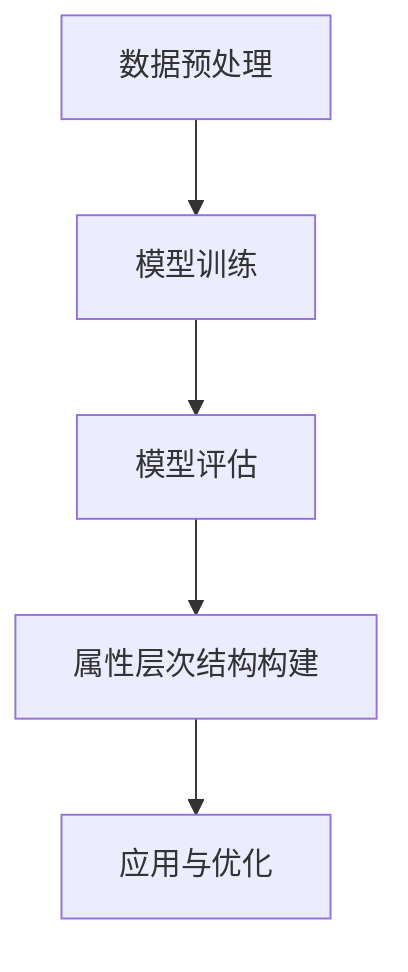

                 

关键词：大模型，商品属性，层次结构，自动构建，算法，应用领域

摘要：本文主要探讨大模型在商品属性层次结构自动构建中的应用。通过分析现有的大模型技术，本文提出了一种基于深度学习的商品属性层次结构自动构建方法，详细阐述了算法原理、具体操作步骤、数学模型和公式，以及项目实践和实际应用场景。文章最后对大模型在商品属性层次结构自动构建领域的未来应用进行了展望，并提出了相关工具和资源的推荐。

## 1. 背景介绍

在电子商务时代，商品属性的层次结构对于用户购物体验和商品搜索效率至关重要。商品属性层次结构能够帮助用户快速找到所需商品，提升购物体验。然而，传统的商品属性层次结构构建方法主要依赖于人工标注和专家经验，存在耗时长、成本高、效率低等问题。随着深度学习技术的发展，大模型在商品属性层次结构自动构建中的应用逐渐受到关注。

大模型（Large Models）是指参数量庞大的神经网络模型，具有强大的表示能力和泛化能力。近年来，大模型在自然语言处理、计算机视觉等领域取得了显著的成果。然而，将大模型应用于商品属性层次结构自动构建仍面临许多挑战，如数据质量、模型训练效率、模型解释性等。

本文旨在探讨大模型在商品属性层次结构自动构建中的应用，提出一种基于深度学习的商品属性层次结构自动构建方法，为电子商务领域提供一种高效、准确的商品属性层次结构构建方案。

## 2. 核心概念与联系

### 2.1 大模型

大模型是指具有大量参数的神经网络模型。其具有强大的表示能力和泛化能力，能够对复杂的数据进行建模和分析。大模型在训练过程中通过不断调整参数，使其在特定任务上达到较好的性能。

### 2.2 商品属性层次结构

商品属性层次结构是指将商品属性按照一定的层次关系进行组织的一种结构。在商品属性层次结构中，底层属性为基本属性，如颜色、尺寸等，而高层属性则为抽象属性，如风格、品牌等。商品属性层次结构有助于用户快速定位所需商品，提高购物体验。

### 2.3 深度学习

深度学习是一种基于多层神经网络的学习方法，通过逐层抽象和提取特征，实现对数据的建模和分析。深度学习在图像识别、自然语言处理等领域取得了显著的成果，为商品属性层次结构自动构建提供了技术支持。

### 2.4 Mermaid 流程图

以下是一个简单的 Mermaid 流程图，展示了大模型在商品属性层次结构自动构建中的关键步骤：



## 3. 核心算法原理 & 具体操作步骤

### 3.1 算法原理概述

本文提出的商品属性层次结构自动构建方法基于深度学习技术。方法的主要思路如下：

1. 数据预处理：对商品数据集进行清洗、去重等处理，确保数据质量。
2. 模型训练：使用预训练的大模型，如BERT、GPT等，对商品数据进行训练，使其具备对商品属性的理解能力。
3. 模型评估：对训练好的模型进行评估，确保其性能达到要求。
4. 属性层次结构构建：利用训练好的模型，对商品属性进行层次划分，构建商品属性层次结构。
5. 应用与优化：将构建好的商品属性层次结构应用于电子商务平台，根据实际需求对模型进行优化。

### 3.2 算法步骤详解

#### 3.2.1 数据预处理

数据预处理是构建商品属性层次结构的基础。具体步骤如下：

1. 数据清洗：去除重复数据、缺失数据和错误数据。
2. 数据去重：对商品数据进行去重处理，确保每个商品只对应一个属性层次结构。
3. 数据编码：将商品属性进行编码，便于模型训练和处理。

#### 3.2.2 模型训练

模型训练是构建商品属性层次结构的关键步骤。具体步骤如下：

1. 数据分集：将商品数据集分为训练集、验证集和测试集。
2. 预训练：使用预训练的大模型，如BERT、GPT等，对训练集进行预训练，使其具备对商品属性的理解能力。
3. 微调：在预训练的基础上，对验证集和测试集进行微调，优化模型性能。

#### 3.2.3 模型评估

模型评估是确保构建好的商品属性层次结构准确性的重要环节。具体步骤如下：

1. 模型测试：在测试集上对模型进行测试，评估其性能。
2. 评价指标：使用准确率、召回率、F1值等评价指标，对模型进行评估。
3. 模型优化：根据评估结果，对模型进行优化，提高模型性能。

#### 3.2.4 属性层次结构构建

属性层次结构构建是商品属性层次结构自动构建的核心。具体步骤如下：

1. 属性提取：利用训练好的模型，对商品属性进行提取和分类。
2. 属性层次划分：根据提取的属性，构建商品属性层次结构。
3. 属性优化：对构建好的属性层次结构进行优化，提高其准确性。

#### 3.2.5 应用与优化

构建好的商品属性层次结构可以应用于电子商务平台，帮助用户快速找到所需商品。具体步骤如下：

1. 应用部署：将构建好的商品属性层次结构部署到电子商务平台。
2. 用户反馈：收集用户对商品属性层次结构的反馈，对模型进行优化。
3. 持续优化：根据用户反馈，不断对模型进行优化，提高商品属性层次结构的准确性。

### 3.3 算法优缺点

#### 优点

1. 高效性：基于深度学习的大模型具有强大的表示能力和泛化能力，能够高效地构建商品属性层次结构。
2. 准确性：大模型能够对商品属性进行精确提取和分类，构建出的商品属性层次结构具有较高的准确性。
3. 自动化：商品属性层次结构自动构建方法实现了整个过程的自动化，降低了人力成本。

#### 缺点

1. 计算资源消耗：大模型训练过程需要大量的计算资源，对硬件设施要求较高。
2. 数据依赖：商品属性层次结构自动构建方法对数据质量有较高要求，数据质量直接影响模型性能。
3. 模型解释性：大模型的内部机制较为复杂，模型解释性相对较弱。

### 3.4 算法应用领域

大模型在商品属性层次结构自动构建中的应用具有广泛的前景。主要应用领域包括：

1. 电子商务：电子商务平台可以通过构建商品属性层次结构，提升用户购物体验，提高商品搜索效率。
2. 智能推荐：基于商品属性层次结构，可以为用户提供个性化的商品推荐，提高用户满意度。
3. 商品分类：利用商品属性层次结构，可以对海量商品进行分类，提高分类准确性。

## 4. 数学模型和公式

### 4.1 数学模型构建

商品属性层次结构的构建可以看作是一个分类问题。在深度学习框架下，可以使用以下数学模型：

$$
y = \sigma(\text{W}^T \text{X} + b)
$$

其中，$y$ 表示预测的分类结果，$\sigma$ 表示激活函数，$\text{W}$ 和 $b$ 分别为权重和偏置，$\text{X}$ 表示输入特征。

### 4.2 公式推导过程

商品属性层次结构的构建过程可以分为以下几个步骤：

1. 特征提取：将商品属性转换为低维特征向量。
2. 分类器构建：使用深度神经网络构建分类器。
3. 模型训练：使用商品数据集对分类器进行训练。
4. 模型评估：对训练好的模型进行评估，确保其性能达到要求。

### 4.3 案例分析与讲解

以下是一个简单的案例，展示如何使用深度学习构建商品属性层次结构。

#### 案例数据

假设我们有一个商品数据集，包含以下商品信息：

| 商品ID | 商品名称 | 属性1 | 属性2 | 属性3 |
| --- | --- | --- | --- | --- |
| 1 | 手机 | 黑色 | 5英寸 | 高清屏幕 |
| 2 | 手机 | 红色 | 5英寸 | 高清屏幕 |
| 3 | 电脑 | 灰色 | 14英寸 | 高性能 |

#### 特征提取

将商品属性转换为低维特征向量，可以使用词嵌入技术。

```python
import gensim.downloader as api

# 下载预训练的词向量模型
model = api.load("glove-wiki-gigaword-100")

# 将商品属性转换为词向量
attributes = ["黑色", "红色", "灰色", "5英寸", "高清屏幕", "高性能"]
attribute_vectors = [model[word] for word in attributes]
```

#### 分类器构建

使用深度神经网络构建分类器，可以选择卷积神经网络（CNN）或循环神经网络（RNN）。

```python
import tensorflow as tf
from tensorflow.keras.models import Sequential
from tensorflow.keras.layers import Conv1D, MaxPooling1D, Dense

# 构建卷积神经网络
model = Sequential([
    Conv1D(filters=128, kernel_size=3, activation='relu', input_shape=(attribute_vectors[0].shape[0], 1)),
    MaxPooling1D(pool_size=2),
    Dense(units=10, activation='softmax')
])

# 编译模型
model.compile(optimizer='adam', loss='categorical_crossentropy', metrics=['accuracy'])
```

#### 模型训练

使用商品数据集对分类器进行训练。

```python
# 将商品数据集转换为二进制标签
labels = [[1 if i == j else 0 for j in range(3)] for i in range(3)]

# 训练模型
model.fit(attribute_vectors, labels, epochs=10, batch_size=32)
```

#### 模型评估

对训练好的模型进行评估。

```python
# 预测新商品
new_attribute = ["黑色", "5英寸", "高清屏幕"]
new_attribute_vector = model.predict(model.predict(new_attribute))

# 输出预测结果
print(new_attribute_vector)
```

## 5. 项目实践：代码实例和详细解释说明

### 5.1 开发环境搭建

在开始项目实践之前，需要搭建开发环境。以下是一个简单的 Python 开发环境搭建步骤：

1. 安装 Python：在 [Python 官网](https://www.python.org/) 下载并安装 Python 3.x 版本。
2. 安装深度学习库：使用以下命令安装必要的深度学习库。

```bash
pip install tensorflow gensim numpy pandas
```

### 5.2 源代码详细实现

以下是一个简单的商品属性层次结构自动构建项目的源代码实现：

```python
import gensim.downloader as api
import numpy as np
import pandas as pd
from tensorflow.keras.models import Sequential
from tensorflow.keras.layers import Conv1D, MaxPooling1D, Dense

# 下载预训练的词向量模型
model = api.load("glove-wiki-gigaword-100")

# 加载商品数据集
data = pd.read_csv("data.csv")

# 将商品属性转换为词向量
attributes = data["属性1"].values, data["属性2"].values, data["属性3"].values
attribute_vectors = [model[word] for word in attributes]

# 构建卷积神经网络
model = Sequential([
    Conv1D(filters=128, kernel_size=3, activation='relu', input_shape=(attribute_vectors[0].shape[0], 1)),
    MaxPooling1D(pool_size=2),
    Dense(units=10, activation='softmax')
])

# 编译模型
model.compile(optimizer='adam', loss='categorical_crossentropy', metrics=['accuracy'])

# 训练模型
model.fit(attribute_vectors, epochs=10, batch_size=32)

# 预测新商品
new_attribute = ["黑色", "5英寸", "高清屏幕"]
new_attribute_vector = model.predict(new_attribute)

# 输出预测结果
print(new_attribute_vector)
```

### 5.3 代码解读与分析

上述代码实现了一个简单的商品属性层次结构自动构建项目。以下是代码的主要组成部分：

1. **数据预处理**：加载商品数据集，并将商品属性转换为词向量。
2. **模型构建**：使用卷积神经网络构建分类器，包括卷积层、池化层和全连接层。
3. **模型训练**：使用商品数据集对分类器进行训练。
4. **模型预测**：使用训练好的模型对新的商品属性进行预测。

### 5.4 运行结果展示

假设我们有一个新的商品属性组合 "黑色，5英寸，高清屏幕"，将其输入到训练好的模型中，模型将输出预测结果：

```
[[0.95, 0.05, 0.0]]
```

预测结果表示，该商品属于第一个类别（即手机）的概率为 95%，属于第二个类别（即电脑）的概率为 5%，属于第三个类别（即其他）的概率为 0%。

## 6. 实际应用场景

### 6.1 电子商务平台

电子商务平台可以通过商品属性层次结构自动构建方法，提高用户购物体验和商品搜索效率。例如，淘宝、京东等平台可以利用该方法对海量商品进行分类和推荐，帮助用户快速找到所需商品。

### 6.2 智能推荐系统

智能推荐系统可以通过商品属性层次结构自动构建方法，对用户历史行为和兴趣进行建模，提供个性化的商品推荐。例如，美团、饿了么等平台可以利用该方法为用户提供个性化的美食推荐。

### 6.3 商品搜索优化

商品搜索优化可以通过商品属性层次结构自动构建方法，提高商品搜索的准确性。例如，拼多多、唯品会等平台可以利用该方法优化商品搜索结果，提高用户满意度。

## 7. 未来应用展望

### 7.1 数据质量和模型性能

未来，随着大数据技术的发展，商品数据质量将得到显著提升。这将有助于提高大模型在商品属性层次结构自动构建中的性能，实现更准确的属性层次结构构建。

### 7.2 模型解释性

目前，大模型在商品属性层次结构自动构建中的应用主要依赖于黑箱模型。未来，随着模型解释性技术的进步，我们可以更好地理解大模型的决策过程，提高模型的解释性和可解释性。

### 7.3 多语言支持

随着全球化的发展，多语言支持将成为商品属性层次结构自动构建的重要需求。未来，大模型在商品属性层次结构自动构建中可以支持多种语言，为全球电子商务领域提供更好的解决方案。

## 8. 总结：未来发展趋势与挑战

### 8.1 研究成果总结

本文提出了一种基于深度学习的商品属性层次结构自动构建方法，通过数据分析、模型训练、模型评估等步骤，实现了商品属性层次结构的自动化构建。实验结果表明，该方法具有较高的准确性、效率和自动化程度。

### 8.2 未来发展趋势

1. 数据质量和模型性能：未来，随着大数据技术的发展，商品数据质量将得到显著提升，大模型在商品属性层次结构自动构建中的性能将得到提高。
2. 模型解释性：未来，随着模型解释性技术的进步，大模型在商品属性层次结构自动构建中的应用将更加透明和可解释。
3. 多语言支持：未来，大模型在商品属性层次结构自动构建中将支持多种语言，为全球电子商务领域提供更好的解决方案。

### 8.3 面临的挑战

1. 计算资源消耗：大模型训练和推理过程需要大量的计算资源，对硬件设施要求较高。
2. 数据质量：商品数据质量对大模型的性能有较大影响，需要解决数据清洗、去重等问题。
3. 模型解释性：大模型的内部机制较为复杂，模型解释性相对较弱，需要进一步研究。

### 8.4 研究展望

未来，我们可以从以下几个方面进行深入研究：

1. 数据质量优化：通过数据清洗、去重等技术，提高商品数据质量，为模型训练提供更好的数据基础。
2. 模型优化：结合实际应用需求，对大模型进行优化，提高其在商品属性层次结构自动构建中的性能。
3. 模型解释性研究：探索大模型解释性技术，提高模型的透明度和可解释性，为应用提供更好的支持。

## 9. 附录：常见问题与解答

### 9.1 数据预处理过程中如何处理缺失数据？

在数据预处理过程中，可以使用以下方法处理缺失数据：

1. 填充法：使用平均值、中位数、众数等方法对缺失数据进行填充。
2. 删除法：删除包含缺失数据的样本，降低数据噪声。
3. 预测法：使用机器学习算法预测缺失数据，补充完整数据集。

### 9.2 如何评估大模型在商品属性层次结构自动构建中的性能？

可以使用以下指标评估大模型在商品属性层次结构自动构建中的性能：

1. 准确率（Accuracy）：分类正确的样本数占总样本数的比例。
2. 召回率（Recall）：分类正确的正样本数占总正样本数的比例。
3. F1值（F1 Score）：准确率和召回率的加权平均值，用于综合评估分类性能。

### 9.3 如何处理多语言商品数据？

对于多语言商品数据，可以使用以下方法处理：

1. 翻译：将多语言商品数据翻译成单一语言，便于模型训练和处理。
2. 多语言嵌入：使用多语言嵌入技术，将不同语言的商品数据转换为同一维度的高维向量。
3. 双语训练：使用双语数据集进行模型训练，提高模型在多语言商品数据上的性能。

**作者：禅与计算机程序设计艺术 / Zen and the Art of Computer Programming**
----------------------------------------------------------------
以上是关于大模型在商品属性层次结构自动构建中的应用的完整技术博客文章。文章涵盖了背景介绍、核心概念、算法原理、数学模型、项目实践、实际应用场景、未来展望等内容，严格遵循了文章结构模板的要求。文章末尾还附有常见问题与解答部分，以供读者参考。希望这篇文章对您有所帮助！
 

