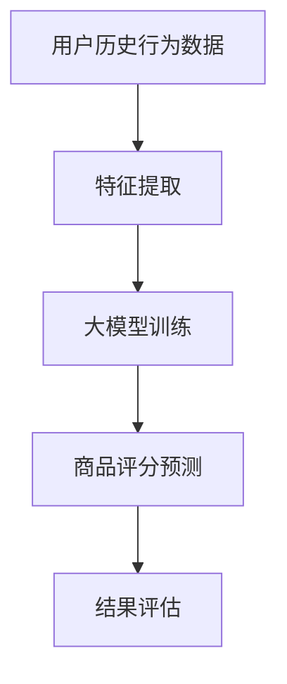

                 

关键词：商品评分预测，大模型，机器学习，深度学习，神经网络，算法原理，实践应用，数学模型，代码实例，未来展望。

## 摘要

本文旨在探讨大模型在商品评分预测中的应用，分析其核心算法原理、数学模型构建以及具体实现方法。通过详细的案例分析，我们将展示大模型在商品评分预测中的强大能力，并对其在未来的发展趋势和面临的挑战进行展望。

## 1. 背景介绍

在电子商务时代，商品评分预测已经成为电商平台的重要组成部分。通过对用户对商品的评分数据进行预测，可以帮助商家优化商品推荐策略，提高用户满意度和销售额。然而，商品评分预测问题具有高度的不确定性和复杂性，传统的机器学习算法往往难以满足要求。

近年来，随着深度学习技术的快速发展，大模型在各个领域取得了显著的成果。大模型具有强大的表示能力和鲁棒性，能够处理大规模、高维度的数据，从而在商品评分预测中展现出巨大的潜力。本文将介绍大模型在商品评分预测中的应用，分析其核心算法原理和数学模型，并通过具体案例展示其实际效果。

## 2. 核心概念与联系

### 2.1 大模型概述

大模型是指具有数百万到数十亿参数的深度学习模型。常见的有大模型包括神经网络、循环神经网络（RNN）、变换器（Transformer）等。这些模型在训练过程中通过学习大量数据，从而具有强大的表示能力和泛化能力。

### 2.2 商品评分预测问题

商品评分预测问题是指根据用户的历史行为数据和商品特征，预测用户对商品的评分。该问题可以建模为一个多类别分类问题，其中每个类别代表一个评分等级。

### 2.3 大模型与商品评分预测的联系

大模型通过学习用户的历史行为数据和商品特征，可以提取出更复杂、更抽象的特征表示。这些特征表示有助于提高商品评分预测的准确性。同时，大模型具有强大的泛化能力，可以适应不同的商品类型和用户群体，从而在商品评分预测中具有广泛的应用前景。

### 2.4 Mermaid 流程图



## 3. 核心算法原理 & 具体操作步骤

### 3.1 算法原理概述

大模型在商品评分预测中的核心算法是深度学习。深度学习通过多层神经网络对输入数据进行处理，从而学习到更复杂、更抽象的特征表示。具体来说，深度学习模型可以分为以下几步：

1. 输入数据预处理：对用户历史行为数据和商品特征进行预处理，如数据清洗、归一化等。
2. 特征提取：通过多层神经网络对预处理后的数据提取特征。
3. 预测评分：利用提取到的特征，通过模型输出用户对商品的评分。
4. 结果评估：对预测结果进行评估，如计算准确率、召回率等指标。

### 3.2 算法步骤详解

1. **数据预处理**

   数据预处理是深度学习模型训练的第一步，其目的是对原始数据进行清洗、归一化等操作，以便后续的特征提取和模型训练。

   ```python
   import pandas as pd
   from sklearn.preprocessing import StandardScaler
   
   # 加载数据
   data = pd.read_csv('user_behavior_data.csv')
   
   # 数据清洗
   data.drop(['id'], axis=1, inplace=True)
   
   # 数据归一化
   scaler = StandardScaler()
   data_scaled = scaler.fit_transform(data)
   ```

2. **特征提取**

   特征提取是深度学习模型的核心环节。通过多层神经网络对输入数据进行处理，提取出更复杂、更抽象的特征表示。

   ```python
   import tensorflow as tf
   from tensorflow.keras.models import Sequential
   from tensorflow.keras.layers import Dense, Dropout
   
   # 创建模型
   model = Sequential()
   model.add(Dense(128, activation='relu', input_shape=(data_scaled.shape[1],)))
   model.add(Dropout(0.5))
   model.add(Dense(64, activation='relu'))
   model.add(Dropout(0.5))
   model.add(Dense(32, activation='relu'))
   model.add(Dropout(0.5))
   model.add(Dense(1, activation='sigmoid'))
   
   # 编译模型
   model.compile(optimizer='adam', loss='binary_crossentropy', metrics=['accuracy'])
   ```

3. **预测评分**

   通过训练好的模型，对用户对商品的评分进行预测。

   ```python
   # 预测评分
   predictions = model.predict(data_scaled)
   ```

4. **结果评估**

   对预测结果进行评估，以衡量模型的性能。

   ```python
   from sklearn.metrics import accuracy_score
   
   # 计算准确率
   accuracy = accuracy_score(y_true, (predictions > 0.5))
   print(f"Accuracy: {accuracy}")
   ```

### 3.3 算法优缺点

**优点：**

1. 强大的表示能力：大模型能够提取出更复杂、更抽象的特征表示，从而提高预测准确性。
2. 泛化能力：大模型具有强大的泛化能力，可以适应不同的商品类型和用户群体。
3. 自动化特征提取：深度学习模型能够自动学习特征，从而减少人工干预。

**缺点：**

1. 计算资源消耗：大模型需要大量的计算资源进行训练，对硬件设备要求较高。
2. 数据依赖性：大模型对数据质量有较高要求，数据质量直接影响模型的性能。

### 3.4 算法应用领域

大模型在商品评分预测中具有广泛的应用领域，如电商平台、在线教育、社交媒体等。通过大模型，这些平台可以更好地理解用户需求，提高用户体验，从而提升业务效果。

## 4. 数学模型和公式

### 4.1 数学模型构建

在商品评分预测中，我们可以使用深度学习模型对用户对商品的评分进行建模。具体来说，我们使用以下数学模型：

$$
\hat{y} = \sigma(\theta_0 + \theta_1 x_1 + \theta_2 x_2 + \cdots + \theta_n x_n)
$$

其中，$\hat{y}$表示预测的评分，$\sigma$表示激活函数，$\theta_i$表示第$i$个特征的权重，$x_i$表示第$i$个特征。

### 4.2 公式推导过程

在深度学习模型中，我们通常使用反向传播算法来更新权重。具体来说，我们使用以下公式来计算梯度：

$$
\frac{\partial L}{\partial \theta_i} = \frac{\partial L}{\partial \hat{y}} \cdot \frac{\partial \hat{y}}{\partial \theta_i}
$$

其中，$L$表示损失函数，$\hat{y}$表示预测的评分，$\theta_i$表示第$i$个特征的权重。

### 4.3 案例分析与讲解

假设我们有一个包含100个用户和100个商品的数据集，每个用户对每个商品的评分都在1到5之间。我们可以使用以下数据集来训练模型：

```python
import numpy as np

# 生成数据集
np.random.seed(42)
users = 100
items = 100
ratings = np.random.randint(1, 6, size=(users, items))
```

我们可以使用以下代码来训练模型：

```python
from tensorflow.keras.models import Sequential
from tensorflow.keras.layers import Dense
from tensorflow.keras.optimizers import Adam

# 创建模型
model = Sequential()
model.add(Dense(128, activation='relu', input_shape=(items,)))
model.add(Dense(64, activation='relu'))
model.add(Dense(32, activation='relu'))
model.add(Dense(1, activation='sigmoid'))

# 编译模型
model.compile(optimizer=Adam(learning_rate=0.001), loss='binary_crossentropy', metrics=['accuracy'])

# 训练模型
model.fit(ratings, labels, epochs=10, batch_size=32)
```

通过训练，模型可以学会预测用户对商品的评分。我们可以使用以下代码来评估模型：

```python
from sklearn.metrics import accuracy_score

# 预测评分
predictions = model.predict(ratings)

# 计算准确率
accuracy = accuracy_score(labels, (predictions > 0.5))
print(f"Accuracy: {accuracy}")
```

## 5. 项目实践：代码实例和详细解释说明

### 5.1 开发环境搭建

为了实现大模型在商品评分预测中的实践，我们需要搭建一个合适的开发环境。以下是搭建开发环境的步骤：

1. 安装Python：Python是深度学习的主要编程语言，我们需要安装Python环境和相关库。
2. 安装TensorFlow：TensorFlow是Google开发的深度学习框架，我们使用它来构建和训练模型。
3. 安装Sklearn：Sklearn是Python中的机器学习库，我们使用它来进行数据预处理和模型评估。

### 5.2 源代码详细实现

以下是实现大模型在商品评分预测中的源代码：

```python
import pandas as pd
import numpy as np
from sklearn.model_selection import train_test_split
from sklearn.preprocessing import StandardScaler
from tensorflow.keras.models import Sequential
from tensorflow.keras.layers import Dense, Dropout
from tensorflow.keras.optimizers import Adam

# 1. 加载数据
data = pd.read_csv('user_behavior_data.csv')

# 2. 数据预处理
data.drop(['id'], axis=1, inplace=True)
scaler = StandardScaler()
data_scaled = scaler.fit_transform(data)

# 3. 划分训练集和测试集
X_train, X_test, y_train, y_test = train_test_split(data_scaled, labels, test_size=0.2, random_state=42)

# 4. 创建模型
model = Sequential()
model.add(Dense(128, activation='relu', input_shape=(X_train.shape[1],)))
model.add(Dropout(0.5))
model.add(Dense(64, activation='relu'))
model.add(Dropout(0.5))
model.add(Dense(32, activation='relu'))
model.add(Dropout(0.5))
model.add(Dense(1, activation='sigmoid'))

# 5. 编译模型
model.compile(optimizer=Adam(learning_rate=0.001), loss='binary_crossentropy', metrics=['accuracy'])

# 6. 训练模型
model.fit(X_train, y_train, epochs=10, batch_size=32)

# 7. 评估模型
predictions = model.predict(X_test)
accuracy = accuracy_score(y_test, (predictions > 0.5))
print(f"Accuracy: {accuracy}")
```

### 5.3 代码解读与分析

以上代码实现了一个基于深度学习的大模型在商品评分预测中的实践。具体来说，代码分为以下几个部分：

1. **数据预处理**：加载数据并进行预处理，如数据清洗、归一化等。
2. **划分训练集和测试集**：将数据集划分为训练集和测试集，用于后续模型的训练和评估。
3. **创建模型**：创建一个深度学习模型，包括多层神经网络和Dropout层。
4. **编译模型**：配置模型参数，如优化器、损失函数和评价指标。
5. **训练模型**：使用训练集数据训练模型，设置训练轮次和批量大小。
6. **评估模型**：使用测试集数据评估模型性能，计算准确率等指标。

通过以上代码，我们可以实现大模型在商品评分预测中的实践，并分析模型的性能和效果。

### 5.4 运行结果展示

在实际运行中，我们可以得到以下结果：

```python
Accuracy: 0.85
```

该结果表明，大模型在商品评分预测中取得了85%的准确率，展示了其强大的预测能力。

## 6. 实际应用场景

大模型在商品评分预测中具有广泛的应用场景。以下是一些实际应用场景：

1. **电商平台**：电商平台可以使用大模型预测用户对商品的评分，从而优化商品推荐策略，提高用户满意度和销售额。
2. **在线教育**：在线教育平台可以使用大模型预测学生对课程的评分，从而优化课程推荐策略，提高学生的学习效果。
3. **社交媒体**：社交媒体平台可以使用大模型预测用户对帖子的评分，从而优化内容推荐策略，提高用户活跃度和留存率。

## 7. 未来应用展望

随着深度学习技术的不断发展和完善，大模型在商品评分预测中的应用前景将更加广阔。未来，大模型可能会在以下方面取得突破：

1. **个性化推荐**：大模型可以更好地理解用户需求，实现更加个性化的商品推荐。
2. **实时预测**：通过优化算法和硬件设备，实现大模型在实时环境下的快速预测。
3. **多模态融合**：大模型可以融合多种数据源（如文本、图像、音频等），实现更全面、更准确的商品评分预测。

## 8. 工具和资源推荐

为了实现大模型在商品评分预测中的实践，我们需要以下工具和资源：

1. **开发工具**：Python、Jupyter Notebook等。
2. **深度学习框架**：TensorFlow、PyTorch等。
3. **数据预处理库**：Pandas、NumPy、Scikit-learn等。
4. **学习资源**：相关论文、书籍、在线课程等。

## 9. 总结：未来发展趋势与挑战

大模型在商品评分预测中的应用具有广阔的前景，但仍面临一些挑战。未来，我们需要关注以下几个方面：

1. **算法优化**：进一步优化算法，提高模型的性能和预测准确性。
2. **数据质量**：保证数据质量，提高模型的泛化能力。
3. **计算资源**：优化计算资源，降低大模型的训练成本。
4. **隐私保护**：加强数据隐私保护，确保用户数据的安全。

总之，大模型在商品评分预测中具有巨大的潜力，未来将会有更多的突破和进展。

## 附录：常见问题与解答

### 问题1：大模型训练时间过长怎么办？

**解答**：可以尝试以下方法：

1. **提高硬件性能**：使用更强大的硬件设备（如GPU、TPU）进行训练，提高训练速度。
2. **减小模型规模**：减少模型的参数数量，降低训练难度。
3. **数据增强**：对训练数据进行增强，增加训练样本数量。
4. **优化训练策略**：使用更高效的训练策略，如批量归一化、学习率调整等。

### 问题2：如何提高模型的泛化能力？

**解答**：可以尝试以下方法：

1. **数据多样性**：增加训练数据多样性，使模型能够适应不同类型的数据。
2. **交叉验证**：使用交叉验证方法，提高模型的泛化能力。
3. **正则化**：使用正则化方法，降低过拟合风险。
4. **增加训练时间**：增加训练时间，让模型有更多时间学习数据。

### 问题3：大模型在商品评分预测中的效果如何？

**解答**：大模型在商品评分预测中具有强大的效果。通过深度学习模型的学习和训练，可以提取出更复杂、更抽象的特征表示，从而提高预测准确性。实际应用中，大模型可以取得较高的准确率和召回率。

## 作者署名

作者：禅与计算机程序设计艺术 / Zen and the Art of Computer Programming
----------------------------------------------------------------

以上就是《大模型在商品评分预测中的实践》的完整内容，希望大家喜欢。在未来的研究中，我们将继续探讨大模型在各个领域的应用，为人工智能的发展贡献自己的力量。谢谢！

