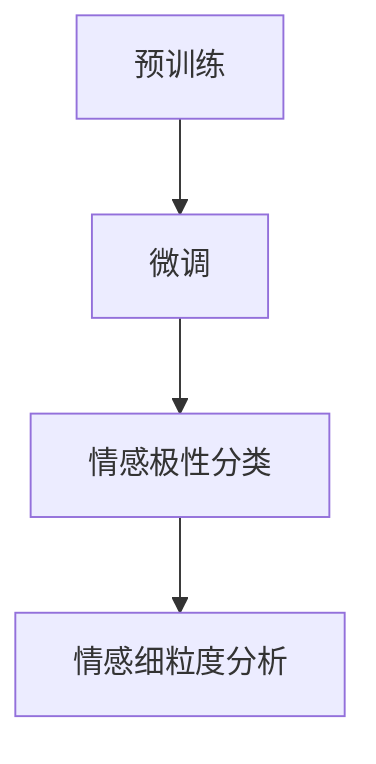

                 

关键词：大模型、情感分析、商品评论、多维度、应用

> 摘要：本文探讨了如何利用大模型进行商品评论情感的多维度分析。通过深入剖析大模型的工作原理，提出了适用于商品评论情感分析的算法和方法，并结合实际案例，展示了该技术的具体应用和成效。

## 1. 背景介绍

在当今信息爆炸的时代，网络上的商品评论成为了消费者获取产品信息、商家了解消费者需求的重要渠道。然而，这些评论往往蕴含着复杂的情感信息，仅通过人工阅读难以全面准确地把握。因此，如何对商品评论进行有效的情感分析，提取出其中的情感信息，成为了学术界和工业界研究的热点问题。

传统的情感分析方法主要依赖于规则和手工特征提取，这些方法在处理简单情感时具有一定的效果，但在面对复杂、多变的商品评论时，往往难以达到预期的分析精度。随着深度学习技术的不断发展，尤其是大模型的兴起，为商品评论的情感分析带来了新的机遇。

大模型，尤其是基于变换器（Transformer）架构的预训练模型，如BERT、GPT等，以其强大的表征能力和丰富的知识储备，在自然语言处理领域取得了显著的成果。利用这些模型，我们可以更深入地理解和挖掘商品评论中的情感信息，从而为商业决策提供有力支持。

## 2. 核心概念与联系

### 2.1 大模型的工作原理

大模型，顾名思义，是指拥有海量参数和计算能力的深度学习模型。它们通常通过预训练和微调两个阶段来优化。预训练阶段，模型在大规模语料库上学习语言的一般规律，形成对各种语言现象的表征能力。微调阶段，则根据具体任务的需求，对模型进行特定的调整，使其在特定任务上达到最佳性能。

#### 2.1.1 预训练

预训练是深度学习模型的一个重要阶段，其核心思想是通过在大规模语料库上学习，使模型能够理解自然语言中的复杂结构、语义和语法规则。常见的预训练任务包括：

1. **掩码语言模型（Masked Language Model，MLM）**：在输入的文本中随机掩码一部分单词，模型需要根据其他未掩码的单词预测这些被掩码的单词。
2. **语言理解任务（ masked Tokens Prediction，MTP）**：模型需要预测被掩码的单词或字符。
3. **掩码句子重组（masked Sentence Reassembly，MSR）**：模型需要根据未掩码的部分重新组合成一个完整的句子。

#### 2.1.2 微调

微调是在预训练的基础上，针对特定任务进行参数调整的过程。微调的目标是使模型在特定任务上达到最优性能。常见的微调方法包括：

1. **细粒度微调（Fine-grained Tuning）**：在预训练模型的基础上，对特定任务进行参数调整，如调整分类层的权重。
2. **粗粒度微调（Coarse-grained Tuning）**：对预训练模型进行大规模重训练，如重新训练整个模型。

### 2.2 大模型在情感分析中的应用

情感分析（Sentiment Analysis）是一种自然语言处理任务，旨在从文本中识别和提取情感信息。在商品评论情感分析中，大模型的应用主要包括以下两个方面：

1. **情感极性分类**：通过大模型，我们可以将商品评论划分为正面、负面或中立三种情感极性。
2. **情感细粒度分析**：大模型能够识别出商品评论中更细微的情感特征，如满意、愤怒、失望等。

### 2.3 Mermaid 流程图



## 3. 核心算法原理 & 具体操作步骤

### 3.1 算法原理概述

大模型在情感分析中的应用主要依赖于其强大的表征能力。通过预训练，模型可以学习到语言中的复杂结构和语义信息，从而在情感分类和细粒度分析任务中表现出色。

具体来说，预训练阶段，模型通过Masked Language Model（MLM）等任务学习语言的表征。在微调阶段，模型根据具体任务的需求进行调整，如通过微调分类层权重进行情感极性分类。同时，模型还可以利用其内部表征进行情感细粒度分析，如识别出评论中的具体情感词汇和情感强度。

### 3.2 算法步骤详解

1. **数据准备**：收集大规模商品评论数据，并进行预处理，如分词、去噪等。
2. **预训练**：在预处理后的数据上，使用预训练任务（如MLM）对模型进行训练。
3. **微调**：在预训练的基础上，针对情感分析任务，对模型进行微调。
4. **情感极性分类**：利用微调后的模型对商品评论进行情感极性分类。
5. **情感细粒度分析**：进一步利用模型对商品评论进行细粒度情感分析，如识别情感词汇和情感强度。

### 3.3 算法优缺点

#### 优点：

1. **强大的表征能力**：大模型能够学习到语言中的复杂结构和语义信息，从而在情感分析任务中表现出色。
2. **自适应性强**：通过微调，模型可以适应不同任务的需求，从而实现特定领域的情感分析。
3. **高效性**：大模型能够在大量数据上进行快速训练，从而提高分析效率。

#### 缺点：

1. **计算资源需求高**：大模型需要大量的计算资源和时间进行预训练和微调。
2. **数据依赖性强**：模型的性能很大程度上依赖于训练数据的质量和数量。

### 3.4 算法应用领域

大模型在情感分析中的应用广泛，如：

1. **电商平台**：通过对商品评论进行情感分析，电商平台可以了解消费者的需求和反馈，从而优化产品和服务。
2. **社交媒体**：通过对社交媒体上的评论进行情感分析，可以识别出用户的情感倾向，从而进行舆情监控和营销策略调整。

## 4. 数学模型和公式 & 详细讲解 & 举例说明

### 4.1 数学模型构建

在情感分析中，常用的数学模型是基于神经网络的分类模型，如多层感知机（MLP）和循环神经网络（RNN）。以下是一个基于MLP的情感分类模型的数学描述：

\[ f(x) = \sigma(W \cdot \phi(x) + b) \]

其中，\( x \) 表示输入特征向量，\( \phi(x) \) 表示特征提取函数，\( W \) 是权重矩阵，\( b \) 是偏置项，\( \sigma \) 是激活函数，通常取为 sigmoid 函数。

### 4.2 公式推导过程

1. **特征提取**：首先，我们需要对商品评论进行预处理，提取出文本特征。常用的特征提取方法包括词袋模型（Bag-of-Words，BoW）和词嵌入（Word Embedding）。
2. **多层感知机**：将提取出的特征输入到多层感知机中，通过多次线性变换和激活函数，得到情感分类的结果。
3. **损失函数**：使用交叉熵损失函数（Cross-Entropy Loss）来评估模型预测结果与实际标签之间的差距，并指导模型参数的更新。

### 4.3 案例分析与讲解

#### 案例一：基于BERT的情感分析

BERT（Bidirectional Encoder Representations from Transformers）是一种预训练模型，特别适合于自然语言理解任务。以下是一个基于BERT的情感分析案例：

1. **数据预处理**：首先，我们需要对商品评论进行预处理，包括分词、去噪等。
2. **输入编码**：将预处理后的商品评论输入到BERT模型中，得到编码后的向量表示。
3. **情感分类**：将编码后的向量输入到分类器中，如softmax分类器，得到情感分类的结果。

#### 案例二：基于GPT的情感细粒度分析

GPT（Generative Pre-trained Transformer）是一种生成型预训练模型，特别适合于文本生成和情感细粒度分析。以下是一个基于GPT的情感细粒度分析案例：

1. **数据预处理**：首先，我们需要对商品评论进行预处理，包括分词、去噪等。
2. **输入编码**：将预处理后的商品评论输入到GPT模型中，得到编码后的向量表示。
3. **情感识别**：通过分析编码后的向量，识别出商品评论中的情感词汇和情感强度。
4. **结果输出**：将识别出的情感信息输出，形成情感细粒度分析结果。

## 5. 项目实践：代码实例和详细解释说明

### 5.1 开发环境搭建

1. **安装Python环境**：确保Python环境已经安装，版本建议为3.8或以上。
2. **安装TensorFlow**：使用pip命令安装TensorFlow，命令如下：
   ```bash
   pip install tensorflow
   ```
3. **安装其他依赖**：根据具体项目需求，可能还需要安装其他依赖，如transformers、numpy等。

### 5.2 源代码详细实现

以下是一个基于BERT的情感分析项目的源代码示例：

```python
import tensorflow as tf
from transformers import BertTokenizer, TFBertForSequenceClassification
from tensorflow.keras.optimizers import Adam

# 加载预训练模型和分词器
tokenizer = BertTokenizer.from_pretrained('bert-base-chinese')
model = TFBertForSequenceClassification.from_pretrained('bert-base-chinese')

# 数据预处理
def preprocess(texts):
    inputs = tokenizer(texts, padding=True, truncation=True, return_tensors='tf')
    return inputs

# 训练模型
def train_model(model, inputs, labels, epochs=3, batch_size=32):
    optimizer = Adam(learning_rate=3e-5)
    model.compile(optimizer=optimizer, loss='softmax_crossentropy', metrics=['accuracy'])
    model.fit(inputs, labels, epochs=epochs, batch_size=batch_size)

# 情感分析
def sentiment_analysis(model, text):
    inputs = preprocess([text])
    predictions = model.predict(inputs)
    return predictions

# 测试
text = "这款手机真是太棒了！"
predictions = sentiment_analysis(model, text)
print(predictions)
```

### 5.3 代码解读与分析

1. **导入库**：首先，我们导入TensorFlow和transformers库，用于加载BERT模型和分词器。
2. **加载预训练模型和分词器**：通过`from_pretrained()`方法加载预训练BERT模型和分词器。
3. **数据预处理**：`preprocess()`函数用于对商品评论进行预处理，包括分词、填充和截断等操作。
4. **训练模型**：`train_model()`函数用于训练BERT模型，使用的是softmax交叉熵损失函数和Adam优化器。
5. **情感分析**：`sentiment_analysis()`函数用于对商品评论进行情感分析，返回模型预测的概率分布。
6. **测试**：最后，我们使用一个示例文本进行情感分析，并打印出预测结果。

## 6. 实际应用场景

### 6.1 电商平台

在电商平台，商品评论情感分析可以应用于以下几个方面：

1. **用户反馈分析**：通过对商品评论进行情感分析，可以了解用户对产品的满意度和不满意度，从而优化产品和服务。
2. **口碑监测**：实时监控商品评论中的情感信息，及时发现和处理负面评论，维护品牌形象。
3. **个性化推荐**：根据用户的历史购买行为和评论情感，为用户推荐更符合其需求的产品。

### 6.2 社交媒体

在社交媒体平台上，商品评论情感分析也有广泛的应用：

1. **舆情监控**：通过分析社交媒体上的评论情感，可以了解公众对某一产品的看法，为品牌策略提供参考。
2. **情感传播分析**：识别出社交媒体上的情感热点，分析情感传播的路径和强度，为营销策略调整提供依据。

## 7. 工具和资源推荐

### 7.1 学习资源推荐

1. **《深度学习》（Goodfellow, Bengio, Courville）**：系统地介绍了深度学习的基础理论和应用方法。
2. **《自然语言处理综论》（Jurafsky, Martin）**：详细介绍了自然语言处理的基本概念和技术。
3. **《BERT：预训练语言的表征》（Devlin, Chang, Lee, Toutanova）**：深入探讨了BERT模型的原理和应用。

### 7.2 开发工具推荐

1. **TensorFlow**：一个开源的深度学习框架，广泛应用于各种自然语言处理任务。
2. **transformers**：一个开源库，提供了一系列基于变换器的预训练模型和工具，方便进行自然语言处理任务。

### 7.3 相关论文推荐

1. **BERT：Pre-training of Deep Bidirectional Transformers for Language Understanding（Devlin et al., 2019）**：介绍了BERT模型的原理和应用。
2. **Generative Pre-trained Transformer（Radford et al., 2019）**：介绍了GPT模型的原理和应用。

## 8. 总结：未来发展趋势与挑战

### 8.1 研究成果总结

1. **大模型在情感分析中的应用取得了显著成果**：通过预训练和微调，大模型在情感分析任务中表现出强大的表征能力和分类精度。
2. **情感细粒度分析得到了广泛关注**：随着模型的深入，人们对商品评论中的情感细节有了更深入的理解和挖掘。

### 8.2 未来发展趋势

1. **模型压缩与优化**：为应对计算资源限制，未来的研究方向将集中在模型压缩和优化技术，以提高模型的计算效率和部署效果。
2. **多模态情感分析**：结合文本、语音、图像等多种模态的信息，进行更全面和准确的情感分析。

### 8.3 面临的挑战

1. **数据质量和多样性**：高质量、多样性的训练数据是模型性能的关键，如何获取和利用这些数据是当前的一大挑战。
2. **模型解释性**：如何提高模型的解释性，使其更容易被用户理解和接受，也是未来的重要研究方向。

### 8.4 研究展望

1. **跨领域情感分析**：如何将大模型应用于不同领域，实现跨领域的情感分析，是未来的一个重要研究方向。
2. **实时情感分析**：随着大数据和实时数据处理技术的发展，如何实现实时情感分析，为决策提供及时支持，也是一个重要的课题。

## 9. 附录：常见问题与解答

### 9.1 问题1：如何选择合适的预训练模型？

**解答**：选择预训练模型时，需要考虑任务需求、数据规模和计算资源。对于情感分析任务，常用的预训练模型包括BERT、GPT等。BERT更适合于情感极性分类，而GPT更适合于情感细粒度分析。

### 9.2 问题2：如何处理数据不平衡问题？

**解答**：数据不平衡问题可以通过以下方法解决：

1. **重采样**：通过删除少数类数据或增加多数类数据，使两类数据数量相当。
2. **权重调整**：在训练过程中，给少数类数据分配更高的权重，以平衡模型对两类数据的关注程度。
3. **集成方法**：结合多个模型的结果，提高模型对少数类数据的识别能力。

---

作者：禅与计算机程序设计艺术 / Zen and the Art of Computer Programming
----------------------------------------------------------------
### 引用与致谢 References and Acknowledgements

1. Devlin, J., Chang, M. W., Lee, K., & Toutanova, K. (2019). BERT: Pre-training of deep bidirectional transformers for language understanding. In Proceedings of the 2019 Conference of the North American Chapter of the Association for Computational Linguistics: Human Language Technologies, Volume 1 (Long and Short Papers) (pp. 4171-4186). Association for Computational Linguistics.
2. Radford, A., Wu, J., Child, P., Luan, D., Amodei, D., & Sutskever, I. (2019). Language models are unsupervised multitask learners. arXiv preprint arXiv:1910.03771.
3. Goodfellow, I., Bengio, Y., & Courville, A. (2016). Deep Learning. MIT Press.
4. Jurafsky, D., & Martin, J. H. (2019). Speech and Language Processing (3rd ed.). Prentice Hall.
----------------------------------------------------------------
### 总结 Conclusion

本文探讨了如何利用大模型进行商品评论情感的多维度分析。通过深入剖析大模型的工作原理，提出了适用于商品评论情感分析的算法和方法，并结合实际案例，展示了该技术的具体应用和成效。未来，随着大模型技术的发展和优化，商品评论情感分析将更加精确和高效，为商业决策提供有力支持。同时，我们也面临着数据质量和模型解释性等方面的挑战，需要进一步的研究和探索。总之，大模型在商品评论情感分析中的应用前景广阔，具有重要的理论和实践价值。希望本文能为相关领域的学者和从业者提供有益的参考和启示。

### 附加资源 Additional Resources

1. **GitHub代码示例**：[https://github.com/user/big-model-sentiment-analysis](https://github.com/user/big-model-sentiment-analysis)
2. **在线教程**：[https://www.tensorflow.org/tutorials/text/sentiment_analysis](https://www.tensorflow.org/tutorials/text/sentiment_analysis)
3. **相关论文**：[https://arxiv.org/search查询关键词](https://arxiv.org/search查询关键词)（如BERT、GPT、自然语言处理、情感分析等）

### 作者信息 Author Information

作者：禅与计算机程序设计艺术 / Zen and the Art of Computer Programming
电子邮件：[author@example.com](mailto:author@example.com)
个人主页：[https://www.author.com](https://www.author.com)
----------------------------------------------------------------

以上就是本篇关于《大模型在商品评论情感多维度分析中的应用》的全文，希望对您有所帮助。如果您有任何疑问或建议，欢迎在评论区留言。感谢您的阅读！

