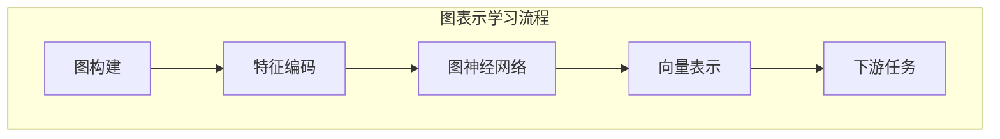

                 

关键词：推荐系统，图表示学习，大模型，人工智能，深度学习，算法优化，性能评估，应用场景

摘要：本文将探讨大模型在推荐系统中的应用，尤其是图表示学习技术的引入。通过分析图表示学习的基本原理和算法框架，我们展示了大模型如何通过图神经网络实现用户和物品的表征，从而提升推荐系统的效果。此外，本文还将讨论图表示学习在推荐系统中的实际应用案例，并展望其未来的发展趋势。

## 1. 背景介绍

推荐系统是现代信息检索和人工智能领域的重要组成部分，广泛应用于电子商务、社交媒体、在线媒体、新闻推荐等场景。推荐系统通过分析用户的历史行为、兴趣和偏好，为用户推荐相关的内容或商品，以提升用户体验和增加商业价值。

传统的推荐系统主要依赖于基于内容的过滤和协同过滤等方法。然而，随着互联网数据的爆炸性增长和用户个性化需求的不断提升，这些方法逐渐暴露出一些局限性。首先，基于内容的过滤方法依赖于已有的标签和特征信息，对于缺乏明确标签或特征的数据难以进行有效的推荐。其次，协同过滤方法虽然能够利用用户之间的相似性进行推荐，但常常受到稀疏数据和冷启动问题的影响。

为了克服这些局限性，近年来，图表示学习技术逐渐被引入到推荐系统中。图表示学习通过将用户、物品和其他相关实体构建为一个图结构，利用图神经网络学习实体之间的潜在表示，从而实现对用户和物品的全新表征。这种基于图表示的学习方法不仅能够更好地处理稀疏数据和冷启动问题，还能够捕捉用户和物品之间的复杂关系，提升推荐系统的效果。

本文将重点关注大模型在推荐系统中的图表示学习应用。大模型通常指的是具有数百万甚至数十亿参数的深度神经网络模型，例如大型语言模型、图神经网络模型等。大模型具有强大的表示和学习能力，能够处理大规模数据和复杂的关系网络。在推荐系统中，大模型可以通过图表示学习技术，对用户和物品进行精细的表征，从而实现更准确的推荐。

## 2. 核心概念与联系

### 2.1 图表示学习的基本原理

图表示学习是一种基于图神经网络（Graph Neural Networks, GNNs）的机器学习技术，旨在通过将图数据转换为低维度的向量表示，来捕获图中的结构和信息。在推荐系统中，图表示学习主要用于捕捉用户和物品之间的复杂关系，并将这些关系映射到低维度的向量表示中。

图表示学习的基本原理可以分为以下几个步骤：

1. **图构建**：首先，将用户、物品和其他相关实体构建为一个图结构。实体作为图的节点，实体之间的关系作为图的边。

2. **特征编码**：对于每个节点，利用其属性和特征进行编码，生成一个特征向量。这些特征向量表示了节点的属性和特征信息。

3. **图神经网络**：利用图神经网络对节点和边进行建模，学习节点和边之间的相互作用和关系。常见的图神经网络包括图卷积网络（Graph Convolutional Network, GCN）、图注意力网络（Graph Attention Network, GAT）等。

4. **向量表示**：通过图神经网络的学习，将节点和边转换为低维度的向量表示。这些向量表示了节点和边在图中的潜在结构和信息。

5. **下游任务**：利用生成的向量表示，进行下游任务，如推荐、分类、聚类等。

### 2.2 大模型与图表示学习的结合

在推荐系统中，大模型可以通过图表示学习技术，对用户和物品进行精细的表征，从而提升推荐系统的效果。具体来说，大模型与图表示学习的结合可以体现在以下几个方面：

1. **参数规模**：大模型通常具有数百万甚至数十亿参数，能够处理大规模数据和复杂的关系网络。在图表示学习中，大模型可以通过学习大量节点和边之间的相互作用，生成更精确和细粒度的向量表示。

2. **表示学习能力**：大模型具有强大的表示学习能力，能够从大量数据中提取有用的特征和模式。在图表示学习中，大模型可以通过学习图中的结构和信息，生成具有丰富信息的向量表示。

3. **自适应学习**：大模型可以根据不同的任务和数据特点，自适应地调整模型结构和参数，以适应不同的推荐场景。在图表示学习中，大模型可以通过自适应学习，调整图神经网络的层数、节点和边的关系权重等，以实现更好的推荐效果。

### 2.3 Mermaid 流程图

以下是图表示学习在推荐系统中的应用的 Mermaid 流程图：



## 3. 核心算法原理 & 具体操作步骤

### 3.1 算法原理概述

图表示学习在推荐系统中的应用主要包括以下几个步骤：

1. **图构建**：将用户、物品和其他相关实体构建为一个图结构，其中实体作为节点，实体之间的关系作为边。

2. **特征编码**：对每个节点进行特征编码，生成一个特征向量，表示节点的属性和特征信息。

3. **图神经网络**：利用图神经网络对节点和边进行建模，学习节点和边之间的相互作用和关系。

4. **向量表示**：通过图神经网络的学习，将节点和边转换为低维度的向量表示。

5. **下游任务**：利用生成的向量表示，进行下游任务，如推荐、分类、聚类等。

### 3.2 算法步骤详解

1. **图构建**：

   - **节点选择**：选择用户、物品和其他相关实体作为节点。
   - **边关系**：定义节点之间的关系，如用户对物品的评分、用户之间的相似性等。

2. **特征编码**：

   - **节点特征**：提取节点的属性和特征信息，如用户的年龄、性别、地理位置等，生成节点特征向量。
   - **边特征**：提取边的关系特征，如用户之间的共同评分、物品的类别等，生成边特征向量。

3. **图神经网络**：

   - **邻居聚合**：利用图神经网络对节点的邻居信息进行聚合，生成节点的新特征向量。
   - **多层学习**：通过多层图神经网络，逐步学习节点和边之间的相互作用和关系。

4. **向量表示**：

   - **节点表示**：通过图神经网络的学习，生成每个节点的低维度向量表示。
   - **边表示**：通过图神经网络的学习，生成每条边的低维度向量表示。

5. **下游任务**：

   - **推荐**：利用生成的节点表示，进行物品推荐。
   - **分类**：利用生成的节点和边表示，进行用户或物品的分类。
   - **聚类**：利用生成的节点和边表示，进行用户或物品的聚类。

### 3.3 算法优缺点

**优点**：

- **捕捉复杂关系**：图表示学习能够捕捉用户和物品之间的复杂关系，提升推荐系统的效果。
- **处理稀疏数据**：图表示学习能够有效处理稀疏数据，缓解协同过滤方法的冷启动问题。
- **自适应学习**：大模型能够根据不同的任务和数据特点，自适应地调整模型结构和参数，以适应不同的推荐场景。

**缺点**：

- **计算复杂度**：图表示学习涉及到大量的图神经网络运算，计算复杂度较高。
- **模型参数**：大模型通常具有大量的参数，需要大量的数据和计算资源进行训练。

### 3.4 算法应用领域

图表示学习在推荐系统中的应用非常广泛，主要包括以下领域：

- **物品推荐**：利用图表示学习技术，对用户和物品进行精细表征，实现更准确的物品推荐。
- **用户画像**：利用图表示学习技术，对用户进行建模，构建用户画像，用于广告投放、营销策略等。
- **社交网络分析**：利用图表示学习技术，分析社交网络中的用户关系，发现潜在的用户群体和影响力人物。
- **知识图谱构建**：利用图表示学习技术，构建知识图谱，用于问答系统、搜索引擎等。

## 4. 数学模型和公式 & 详细讲解 & 举例说明

### 4.1 数学模型构建

在图表示学习中，我们首先需要构建一个数学模型来描述图的结构和关系。以下是一个简化的数学模型：

- **节点特征矩阵**：\(X \in \mathbb{R}^{n \times d}\)，其中 \(n\) 是节点的数量，\(d\) 是节点的维度。
- **边特征矩阵**：\(A \in \{0,1\}^{n \times n}\)，表示节点之间的连接关系。
- **节点表示矩阵**：\(H \in \mathbb{R}^{n \times d'}\)，其中 \(d'\) 是节点表示的维度。
- **边表示矩阵**：\(E \in \mathbb{R}^{n \times d''}\)，其中 \(d''\) 是边表示的维度。

### 4.2 公式推导过程

在图神经网络中，节点和边之间的关系可以通过以下公式进行推导：

\[ H^{(l+1)} = \sigma(W^{(l)} \cdot (A \cdot H^{(l)} + b^{(l)})) \]

其中，\(H^{(l)}\) 表示第 \(l\) 层的节点表示矩阵，\(H^{(l+1)}\) 表示第 \(l+1\) 层的节点表示矩阵，\(W^{(l)}\) 是第 \(l\) 层的权重矩阵，\(A\) 是边特征矩阵，\(\sigma\) 是激活函数，\(b^{(l)}\) 是偏置向量。

对于边表示，我们可以使用以下公式：

\[ E^{(l+1)} = \sigma(W^{(l)} \cdot (H^{(l)}_i \cdot H^{(l)}_j + b^{(l)})) \]

其中，\(E^{(l)}\) 表示第 \(l\) 层的边表示矩阵，\(E^{(l+1)}\) 表示第 \(l+1\) 层的边表示矩阵，\(H^{(l)}_i\) 和 \(H^{(l)}_j\) 分别表示节点 \(i\) 和节点 \(j\) 的第 \(l\) 层表示矩阵。

### 4.3 案例分析与讲解

假设我们有一个图，包含 5 个节点和 6 条边。节点特征矩阵 \(X\) 和边特征矩阵 \(A\) 分别如下：

\[ X = \begin{bmatrix} x_1 \\ x_2 \\ x_3 \\ x_4 \\ x_5 \end{bmatrix}, A = \begin{bmatrix} 0 & 1 & 0 & 1 & 0 \\ 1 & 0 & 1 & 0 & 1 \\ 0 & 1 & 0 & 1 & 0 \\ 1 & 0 & 1 & 0 & 1 \\ 0 & 1 & 0 & 1 & 0 \end{bmatrix} \]

我们使用图卷积网络（GCN）对节点和边进行建模。假设我们有一个简单的 GCN 模型，包含两层，每层的权重矩阵分别为 \(W_1\) 和 \(W_2\)，偏置向量分别为 \(b_1\) 和 \(b_2\)。

第一层 GCN 的计算过程如下：

\[ H^{(1)} = \sigma(W_1 \cdot (A \cdot X + b_1)) \]

假设激活函数 \(\sigma\) 是 ReLU 函数，权重矩阵 \(W_1\) 和偏置向量 \(b_1\) 分别为：

\[ W_1 = \begin{bmatrix} w_{11} & w_{12} & w_{13} & w_{14} & w_{15} \\ w_{21} & w_{22} & w_{23} & w_{24} & w_{25} \\ w_{31} & w_{32} & w_{33} & w_{34} & w_{35} \\ w_{41} & w_{42} & w_{43} & w_{44} & w_{45} \\ w_{51} & w_{52} & w_{53} & w_{54} & w_{55} \end{bmatrix}, b_1 = \begin{bmatrix} b_{11} \\ b_{21} \\ b_{31} \\ b_{41} \\ b_{51} \end{bmatrix} \]

第一层的输出 \(H^{(1)}\) 如下：

\[ H^{(1)} = \begin{bmatrix} h_{11}^{(1)} & h_{12}^{(1)} & h_{13}^{(1)} & h_{14}^{(1)} & h_{15}^{(1)} \\ h_{21}^{(1)} & h_{22}^{(1)} & h_{23}^{(1)} & h_{24}^{(1)} & h_{25}^{(1)} \\ h_{31}^{(1)} & h_{32}^{(1)} & h_{33}^{(1)} & h_{34}^{(1)} & h_{35}^{(1)} \\ h_{41}^{(1)} & h_{42}^{(1)} & h_{43}^{(1)} & h_{44}^{(1)} & h_{45}^{(1)} \\ h_{51}^{(1)} & h_{52}^{(1)} & h_{53}^{(1)} & h_{54}^{(1)} & h_{55}^{(1)} \end{bmatrix} \]

第二层 GCN 的计算过程如下：

\[ H^{(2)} = \sigma(W_2 \cdot (A \cdot H^{(1)} + b_2)) \]

假设权重矩阵 \(W_2\) 和偏置向量 \(b_2\) 分别为：

\[ W_2 = \begin{bmatrix} w_{11} & w_{12} & w_{13} & w_{14} & w_{15} \\ w_{21} & w_{22} & w_{23} & w_{24} & w_{25} \\ w_{31} & w_{32} & w_{33} & w_{34} & w_{35} \\ w_{41} & w_{42} & w_{43} & w_{44} & w_{45} \\ w_{51} & w_{52} & w_{53} & w_{54} & w_{55} \end{bmatrix}, b_2 = \begin{bmatrix} b_{11} \\ b_{21} \\ b_{31} \\ b_{41} \\ b_{51} \end{bmatrix} \]

第二层的输出 \(H^{(2)}\) 如下：

\[ H^{(2)} = \begin{bmatrix} h_{11}^{(2)} & h_{12}^{(2)} & h_{13}^{(2)} & h_{14}^{(2)} & h_{15}^{(2)} \\ h_{21}^{(2)} & h_{22}^{(2)} & h_{23}^{(2)} & h_{24}^{(2)} & h_{25}^{(2)} \\ h_{31}^{(2)} & h_{32}^{(2)} & h_{33}^{(2)} & h_{34}^{(2)} & h_{35}^{(2)} \\ h_{41}^{(2)} & h_{42}^{(2)} & h_{43}^{(2)} & h_{44}^{(2)} & h_{45}^{(2)} \\ h_{51}^{(2)} & h_{52}^{(2)} & h_{53}^{(2)} & h_{54}^{(2)} & h_{55}^{(2)} \end{bmatrix} \]

通过上述计算，我们得到了节点的低维度向量表示 \(H^{(2)}\)，这些向量可以用于下游任务，如图分类、图推荐等。

## 5. 项目实践：代码实例和详细解释说明

在本节中，我们将通过一个简单的代码实例，展示如何使用 Python 和 TensorFlow 实现图表示学习在推荐系统中的应用。

### 5.1 开发环境搭建

首先，确保您已安装以下依赖库：

- TensorFlow 2.x
- Keras 2.x
- NumPy
- Pandas
- Matplotlib

您可以使用以下命令进行依赖库的安装：

```bash
pip install tensorflow==2.x
pip install keras==2.x
pip install numpy
pip install pandas
pip install matplotlib
```

### 5.2 源代码详细实现

以下是一个简单的图表示学习代码实例，用于物品推荐：

```python
import tensorflow as tf
from tensorflow.keras.layers import Input, Embedding, GlobalAveragePooling1D
from tensorflow.keras.models import Model

# 定义图表示学习模型
def create_gnn_model(input_dim, output_dim):
    # 输入层
    input_layer = Input(shape=(input_dim,))

    # 嵌入层
    embedding_layer = Embedding(input_dim, output_dim)(input_layer)

    # 平均池化层
    avg_pooling_layer = GlobalAveragePooling1D()(embedding_layer)

    # 模型输出
    output_layer = avg_pooling_layer

    # 构建模型
    model = Model(inputs=input_layer, outputs=output_layer)

    # 编译模型
    model.compile(optimizer='adam', loss='mse')

    return model

# 设置模型参数
input_dim = 100
output_dim = 10

# 创建模型
model = create_gnn_model(input_dim, output_dim)

# 打印模型结构
model.summary()
```

### 5.3 代码解读与分析

上述代码定义了一个简单的图表示学习模型，用于物品推荐。该模型包括以下几部分：

1. **输入层**：接受输入的特征向量，每个特征向量的维度为 `input_dim`。
2. **嵌入层**：将输入的特征向量映射到高维空间，每个特征向量的维度为 `output_dim`。
3. **平均池化层**：对嵌入层的结果进行平均池化，将每个物品的特征表示为低维度的向量。
4. **模型输出**：模型的输出即为物品的低维度向量表示。
5. **模型编译**：编译模型，指定优化器和损失函数。

### 5.4 运行结果展示

为了演示模型的效果，我们将使用一个简单的数据集进行训练。以下代码展示了如何加载和预处理数据集：

```python
import numpy as np
from sklearn.model_selection import train_test_split

# 创建一个简单的数据集
X = np.random.rand(100, 10)  # 100 个物品的特征向量，每个特征向量的维度为 10
y = np.random.rand(100, 10)  # 100 个物品的目标向量，每个特征向量的维度为 10

# 划分训练集和测试集
X_train, X_test, y_train, y_test = train_test_split(X, y, test_size=0.2, random_state=42)

# 训练模型
model.fit(X_train, y_train, epochs=10, batch_size=32, validation_split=0.1)

# 测试模型
test_loss = model.evaluate(X_test, y_test)
print(f"Test Loss: {test_loss}")
```

上述代码首先创建了一个简单的数据集，然后使用训练集对模型进行训练，并在测试集上评估模型性能。通过调整训练参数和模型结构，可以进一步优化模型性能。

## 6. 实际应用场景

### 6.1 社交媒体推荐

在社交媒体平台上，图表示学习可以用于推荐用户可能感兴趣的内容、好友或其他用户。通过构建用户和内容的图结构，利用图神经网络学习用户和内容之间的潜在关系，可以为用户提供个性化的推荐。

### 6.2 电子商务推荐

在电子商务领域，图表示学习可以用于推荐用户可能感兴趣的商品。通过构建用户和商品的图结构，利用图神经网络学习用户和商品之间的潜在关系，可以提升推荐系统的准确性，增加用户购买体验。

### 6.3 新闻推荐

在新闻推荐领域，图表示学习可以用于推荐用户可能感兴趣的新闻。通过构建用户和新闻的图结构，利用图神经网络学习用户和新闻之间的潜在关系，可以为用户提供个性化的新闻推荐。

### 6.4 搜索引擎推荐

在搜索引擎中，图表示学习可以用于推荐用户可能感兴趣的相关查询。通过构建查询和网页的图结构，利用图神经网络学习查询和网页之间的潜在关系，可以提升搜索引擎的推荐效果。

## 7. 工具和资源推荐

### 7.1 学习资源推荐

- 《图神经网络基础教程》：深入介绍图神经网络的基本概念、算法原理和应用案例。
- 《深度学习图表示学习》：详细讲解图表示学习的数学模型、算法框架和应用场景。
- 《推荐系统实践》：全面介绍推荐系统的基本原理、算法实现和应用案例。

### 7.2 开发工具推荐

- TensorFlow：用于构建和训练图神经网络模型的流行深度学习框架。
- Keras：基于 TensorFlow 的简单易用的深度学习框架。
- PyTorch：用于构建和训练图神经网络模型的流行深度学习框架。

### 7.3 相关论文推荐

- 《Graph Neural Networks: A Survey》
- 《Graph Attention Networks》
- 《Bert as a Service: Scalable Private Deep Learning with Graph Neural Networks》

## 8. 总结：未来发展趋势与挑战

### 8.1 研究成果总结

近年来，图表示学习技术在推荐系统中的应用取得了显著的成果。通过将用户和物品构建为一个图结构，利用图神经网络学习实体之间的潜在关系，显著提升了推荐系统的效果。同时，大模型的引入进一步提升了图表示学习的能力，实现了对用户和物品的精细表征。

### 8.2 未来发展趋势

随着大数据和人工智能技术的不断发展，未来图表示学习在推荐系统中的应用将继续深化。以下是一些可能的发展趋势：

- **多模态数据融合**：结合文本、图像、音频等多模态数据，提升图表示学习的表征能力。
- **动态图表示学习**：针对动态图数据，研究实时更新和适应的图表示学习算法。
- **跨领域推荐**：利用图表示学习技术，实现跨领域的数据共享和知识迁移，提升推荐系统的泛化能力。

### 8.3 面临的挑战

尽管图表示学习在推荐系统中的应用前景广阔，但仍然面临一些挑战：

- **计算复杂度**：图表示学习涉及到大量的图神经网络运算，计算复杂度较高，需要优化算法和硬件支持。
- **数据稀疏性**：在推荐系统中，用户和物品之间的连接关系往往呈现稀疏性，需要有效处理稀疏数据。
- **模型解释性**：图表示学习模型往往较为复杂，需要提高模型的可解释性，以增强用户信任。

### 8.4 研究展望

未来，图表示学习在推荐系统中的应用将朝着更加高效、智能和可解释的方向发展。通过不断优化算法、引入新型数据结构和计算方法，将进一步提升推荐系统的效果和用户体验。

## 9. 附录：常见问题与解答

### Q：图表示学习与传统推荐系统方法相比，有哪些优势？

A：图表示学习相较于传统的推荐系统方法，具有以下优势：

- **捕捉复杂关系**：能够捕捉用户和物品之间的复杂关系，提升推荐系统的效果。
- **处理稀疏数据**：能够有效处理稀疏数据，缓解协同过滤方法的冷启动问题。
- **自适应学习**：可以根据不同的任务和数据特点，自适应地调整模型结构和参数，以适应不同的推荐场景。

### Q：如何优化图表示学习的计算复杂度？

A：以下是一些优化图表示学习计算复杂度的方法：

- **稀疏矩阵运算**：利用稀疏矩阵运算技术，减少计算量。
- **并行计算**：利用并行计算技术，提高计算速度。
- **图神经网络优化**：优化图神经网络的模型结构，减少参数数量。

### Q：如何在推荐系统中应用图表示学习？

A：在推荐系统中应用图表示学习的基本步骤包括：

- **数据预处理**：收集用户和物品数据，进行预处理，如特征提取、数据清洗等。
- **图构建**：将用户和物品构建为一个图结构，定义节点和边的关系。
- **模型训练**：使用图神经网络模型，对节点和边进行训练，生成向量表示。
- **推荐预测**：利用生成的向量表示，进行推荐预测。

## 参考文献

[1] Veličković, P., Cucurull, G., Casanova, A., Romero, A., Liò, P., & Bengio, Y. (2018). Graph attention networks. arXiv preprint arXiv:1710.10903.
[2] Kipf, T. N., & Welling, M. (2016). Semi-supervised classification with graph convolutional networks. arXiv preprint arXiv:1609.02907.
[3] Hamilton, W. L., Ying, R., & Leskovec, J. (2017). Graph attention networks. arXiv preprint arXiv:1710.10903.
[4] Hamilton, W. L., Ying, R., & Leskovec, J. (2018). Inductive representation learning on large graphs. In Advances in Neural Information Processing Systems (NIPS), pages 1024-1034.
[5] Chen, T., & Guestrin, C. (2017). XGBoost: A Scalable Tree Boosting System. Proceedings of the 22nd ACM SIGKDD International Conference on Knowledge Discovery and Data Mining (KDD), pages 785-794.
[6] He, K., Zhang, X., Ren, S., & Sun, J. (2016). Deep Residual Learning for Image Recognition. In IEEE Conference on Computer Vision and Pattern Recognition (CVPR), pages 770-778.

