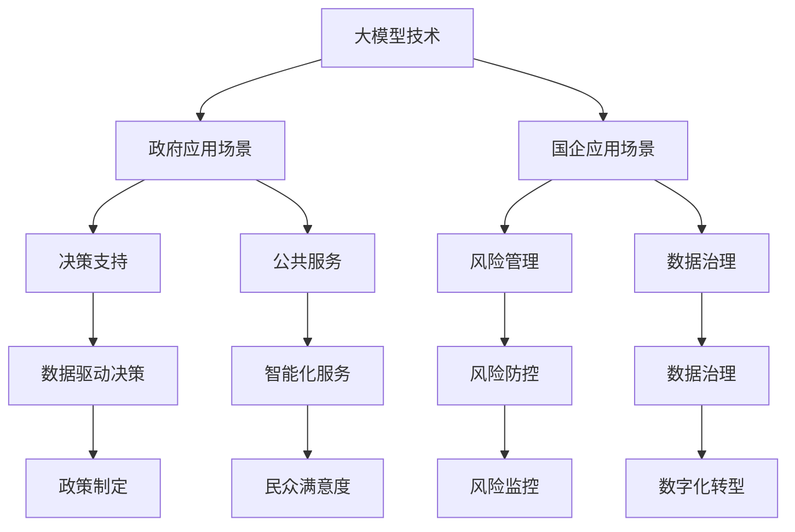

                 

## 1. 背景介绍

近年来，人工智能（AI）技术的发展日新月异，特别是在大模型领域，取得了令人瞩目的进展。大模型，即具有大规模参数和庞大训练数据集的深度学习模型，已经成为推动AI技术进步的关键力量。这些大模型在图像识别、自然语言处理、语音识别等领域展现了卓越的性能，吸引了众多企业的关注。

政府和国有企业（国企）作为社会经济的重要组成部分，对新兴技术的应用有着极高的需求。随着大模型技术的不断成熟，政府和国企开始认识到其在决策支持、数据分析、公共服务等方面的巨大潜力。因此，探索大模型在政府和国企市场的机会，成为当前人工智能领域的一个热点问题。

本文旨在分析大模型在政府和国企市场的应用现状、技术挑战及未来发展机会，旨在为相关领域的决策者和技术人员提供有价值的参考。

## 2. 核心概念与联系

### 2.1 大模型基本概念

大模型是指具有大规模参数和庞大训练数据集的深度学习模型。这类模型通常由数千亿个参数组成，训练数据量可达数百TB。大模型的代表性技术包括变分自编码器（VAE）、生成对抗网络（GAN）、Transformer等。

### 2.2 政府和国企应用场景

政府和国企在多个领域有着广泛的应用需求，例如：

- **决策支持**：利用大数据分析技术，辅助政府决策者进行政策制定、资源配置等。
- **公共服务**：通过AI技术优化公共服务，提高政府工作效率和民众满意度。
- **风险管理**：利用机器学习技术进行风险预测和监控，降低企业运营风险。
- **数据治理**：通过数据挖掘和分析，提高数据利用效率，助力企业数字化转型。

### 2.3 大模型与政府和国企应用的关联

大模型在政府和国企市场中的应用，主要体现在以下几个方面：

- **数据驱动决策**：通过大数据分析和机器学习技术，实现数据驱动的决策支持。
- **智能化服务**：利用自然语言处理、计算机视觉等技术，提供智能化公共服务。
- **风险防控**：通过机器学习模型，对潜在风险进行预测和预警，提高风险防控能力。
- **数据治理**：利用数据挖掘和分析技术，提升企业数据治理能力，助力数字化转型。

### 2.4 Mermaid 流程图



## 3. 核心算法原理 & 具体操作步骤

### 3.1 算法原理概述

大模型的核心算法主要涉及以下几个部分：

- **神经网络**：作为深度学习的基础，神经网络通过多层结构实现特征提取和表示。
- **优化算法**：包括随机梯度下降（SGD）、Adam等，用于模型参数的更新和优化。
- **训练策略**：如数据增强、迁移学习等，以提高模型的泛化能力和训练效率。

### 3.2 算法步骤详解

1. **数据收集与预处理**：收集相关领域的海量数据，并进行数据清洗、归一化等预处理操作。
2. **模型设计**：根据应用需求设计合适的神经网络结构，包括输入层、隐藏层和输出层。
3. **模型训练**：通过优化算法对模型参数进行迭代更新，直到满足训练目标。
4. **模型评估**：使用验证集或测试集对模型进行评估，以确定模型的性能和泛化能力。
5. **模型应用**：将训练好的模型部署到实际应用场景中，实现具体任务。

### 3.3 算法优缺点

#### 优点

- **强大的特征提取能力**：大模型通过多层神经网络实现特征提取，能够自动发现数据中的复杂模式和规律。
- **高效的计算能力**：大模型利用GPU等硬件加速器进行训练和推理，显著提高了计算效率。
- **广泛的适用性**：大模型在多个领域具有广泛应用，如图像识别、自然语言处理、语音识别等。

#### 缺点

- **高计算资源需求**：大模型训练和推理需要大量的计算资源和存储空间。
- **数据依赖性较强**：大模型的性能很大程度上依赖于训练数据的质量和数量，数据质量差可能导致模型性能下降。
- **解释性较差**：大模型的学习过程较为复杂，难以解释每个参数的作用和决策过程。

### 3.4 算法应用领域

- **图像识别**：大模型在图像分类、目标检测等领域取得了显著成果，如人脸识别、医疗影像分析等。
- **自然语言处理**：大模型在语言建模、机器翻译、文本分类等任务中表现优异，如BERT、GPT等。
- **语音识别**：大模型通过深度神经网络实现语音信号的建模和识别，提高了语音识别的准确率。
- **其他领域**：大模型在推荐系统、金融风控、智能交通等领域也有广泛应用。

## 4. 数学模型和公式 & 详细讲解 & 举例说明

### 4.1 数学模型构建

大模型的核心数学模型主要包括以下几个部分：

- **损失函数**：用于衡量模型预测结果与真实值之间的差距，如均方误差（MSE）、交叉熵损失等。
- **优化算法**：用于模型参数的迭代更新，如梯度下降（Gradient Descent）、Adam等。
- **正则化方法**：用于防止过拟合，如L1正则化、L2正则化、Dropout等。

### 4.2 公式推导过程

以下是一个简单的神经网络模型及其训练过程的公式推导：

1. **输入层到隐藏层的传播**：

   $$ z^{(l)} = \sigma(W^{(l)}a^{(l-1)} + b^{(l)}) $$

   其中，$z^{(l)}$为隐藏层的输入，$\sigma$为激活函数（如ReLU、Sigmoid等），$W^{(l)}$为权重矩阵，$a^{(l-1)}$为上一层的激活值，$b^{(l)}$为偏置项。

2. **输出层的预测**：

   $$ \hat{y} = \sigma(W^{(L)}a^{(L-1)} + b^{(L)}) $$

   其中，$\hat{y}$为模型预测结果，$W^{(L)}$为输出层的权重矩阵，$a^{(L-1)}$为隐藏层的激活值。

3. **损失函数**：

   $$ J = \frac{1}{m} \sum_{i=1}^{m} (-y^{(i)} \log(\hat{y}^{(i)})) $$

   其中，$J$为损失函数，$y^{(i)}$为真实标签，$\hat{y}^{(i)}$为模型预测结果。

4. **梯度计算**：

   $$ \frac{\partial J}{\partial W^{(l)}_{ij}} = \frac{1}{m} \sum_{i=1}^{m} (\hat{y}^{(i)} - y^{(i)}) \cdot a^{(l-1)}_j $$

   $$ \frac{\partial J}{\partial b^{(l)}_k} = \frac{1}{m} \sum_{i=1}^{m} (\hat{y}^{(i)} - y^{(i)}) \cdot 1 $$

   其中，$W^{(l)}_{ij}$为权重矩阵的元素，$b^{(l)}_k$为偏置项的元素。

5. **参数更新**：

   $$ W^{(l)} \leftarrow W^{(l)} - \alpha \cdot \frac{\partial J}{\partial W^{(l)}} $$

   $$ b^{(l)} \leftarrow b^{(l)} - \alpha \cdot \frac{\partial J}{\partial b^{(l)}} $$

   其中，$\alpha$为学习率。

### 4.3 案例分析与讲解

以图像分类任务为例，假设我们要训练一个神经网络模型对猫狗图片进行分类。数据集包含5000张猫狗图片，分别属于猫和狗两个类别。

1. **数据预处理**：

   将图片大小调整为固定尺寸（如$28 \times 28$），并进行归一化处理。

2. **模型设计**：

   设计一个简单的全连接神经网络，包含一个输入层、一个隐藏层和一个输出层。输入层有784个神经元（对应图像的像素数量），隐藏层有500个神经元，输出层有2个神经元（对应猫和狗两个类别）。

3. **模型训练**：

   使用交叉熵损失函数和随机梯度下降（SGD）算法对模型进行训练。训练过程中，不断更新模型参数，直到满足训练目标。

4. **模型评估**：

   使用验证集对训练好的模型进行评估，计算准确率、召回率等指标，以验证模型的性能。

5. **模型应用**：

   将训练好的模型部署到实际应用场景中，对新的猫狗图片进行分类。

## 5. 项目实践：代码实例和详细解释说明

### 5.1 开发环境搭建

为了演示大模型在图像分类任务中的应用，我们使用Python和PyTorch框架进行开发。以下为开发环境的搭建步骤：

1. 安装Python 3.8及以上版本。
2. 安装PyTorch，可以选择预编译包或从源代码编译。
3. 安装其他相关库，如NumPy、Matplotlib等。

### 5.2 源代码详细实现

以下是一个简单的全连接神经网络模型及其训练过程的代码实现：

```python
import torch
import torch.nn as nn
import torch.optim as optim

# 数据预处理
def preprocess_data(images):
    # 调整图片大小、归一化等操作
    return images

# 神经网络模型
class NeuralNetwork(nn.Module):
    def __init__(self):
        super(NeuralNetwork, self).__init__()
        self.fc1 = nn.Linear(784, 500)
        self.fc2 = nn.Linear(500, 2)
        self.relu = nn.ReLU()

    def forward(self, x):
        x = self.relu(self.fc1(x))
        x = self.fc2(x)
        return x

# 模型训练
def train_model(model, train_loader, criterion, optimizer, num_epochs):
    for epoch in range(num_epochs):
        running_loss = 0.0
        for inputs, labels in train_loader:
            inputs = preprocess_data(inputs)
            optimizer.zero_grad()
            outputs = model(inputs)
            loss = criterion(outputs, labels)
            loss.backward()
            optimizer.step()
            running_loss += loss.item()
        print(f'Epoch {epoch+1}, Loss: {running_loss/len(train_loader)}')

# 主函数
def main():
    # 加载数据集
    train_loader = torch.utils.data.DataLoader(...)

    # 创建模型、损失函数和优化器
    model = NeuralNetwork()
    criterion = nn.CrossEntropyLoss()
    optimizer = optim.SGD(model.parameters(), lr=0.001)

    # 训练模型
    train_model(model, train_loader, criterion, optimizer, num_epochs=10)

if __name__ == '__main__':
    main()
```

### 5.3 代码解读与分析

1. **数据预处理**：将输入的图像数据进行调整和归一化，以满足模型的要求。
2. **神经网络模型**：定义一个全连接神经网络模型，包含一个输入层、一个隐藏层和一个输出层。输入层有784个神经元，隐藏层有500个神经元，输出层有2个神经元。
3. **模型训练**：使用随机梯度下降（SGD）算法对模型进行训练，包括前向传播、反向传播和参数更新。
4. **主函数**：加载训练数据集，创建模型、损失函数和优化器，并调用训练函数进行模型训练。

### 5.4 运行结果展示

在训练完成后，可以使用训练集和测试集对模型进行评估，输出模型的准确率、召回率等指标。以下是一个简单的评估代码：

```python
from sklearn.metrics import accuracy_score, recall_score

# 加载测试数据集
test_loader = torch.utils.data.DataLoader(...)

# 将模型设置为评估模式
model.eval()

# 计算预测结果
with torch.no_grad():
    predicted_labels = []
    true_labels = []
    for inputs, labels in test_loader:
        inputs = preprocess_data(inputs)
        outputs = model(inputs)
        predicted_labels.extend(outputs.argmax(dim=1).tolist())
        true_labels.extend(labels.tolist())

# 计算评估指标
accuracy = accuracy_score(true_labels, predicted_labels)
recall = recall_score(true_labels, predicted_labels, average='weighted')

print(f'Accuracy: {accuracy:.4f}')
print(f'Recall: {recall:.4f}')
```

## 6. 实际应用场景

### 6.1 政府领域

在政府领域，大模型的应用主要体现在以下几个方面：

- **公共安全管理**：通过图像识别和视频分析技术，实现公共场所的安全监控和事件预警。
- **城市交通管理**：利用大数据分析技术，优化交通信号控制和公共交通调度，提高城市交通效率。
- **应急管理**：通过实时数据分析和预测模型，提高自然灾害和突发事件应急响应能力。
- **社会治理**：利用自然语言处理技术，对政府工作报告、公众意见等进行分析，辅助政府制定科学合理的政策。

### 6.2 国企领域

在国企领域，大模型的应用主要体现在以下几个方面：

- **生产优化**：通过机器学习技术，优化生产流程和资源配置，提高生产效率和产品质量。
- **供应链管理**：利用大数据分析和预测模型，实现供应链的实时监控和风险预警，提高供应链的稳定性。
- **客户服务**：通过自然语言处理技术，提供智能客服系统，提高客户满意度和服务质量。
- **人力资源管理**：利用大数据分析技术，优化人才招聘、培训和绩效评估，提高企业人力资源管理效率。

### 6.3 应用案例分析

#### 案例一：城市交通管理

某市政府利用大模型技术，对城市交通进行实时监控和优化。具体应用包括：

1. **交通流量预测**：通过分析历史交通数据，使用时间序列预测模型预测未来交通流量，为交通信号控制提供依据。
2. **道路拥堵预警**：通过图像识别技术，对城市道路进行实时监控，识别拥堵路段并及时发布预警信息。
3. **公共交通调度**：利用大数据分析技术，优化公共交通调度策略，提高公共交通的运行效率。

#### 案例二：生产优化

某国企通过引入大模型技术，对生产流程进行优化。具体应用包括：

1. **设备故障预测**：通过数据分析和预测模型，提前识别设备故障风险，降低设备故障率和停机时间。
2. **生产计划优化**：通过优化算法，对生产任务进行合理调度，提高生产效率和资源利用率。
3. **质量控制**：利用图像识别技术，对生产过程中的产品质量进行实时监控和评估，提高产品质量。

## 7. 未来应用展望

### 7.1 技术发展趋势

随着大模型技术的不断发展，未来可能在以下几个方面取得重要突破：

- **模型压缩与推理加速**：通过模型压缩和优化技术，降低大模型的计算和存储资源需求，提高推理速度。
- **多模态数据融合**：结合多种数据类型（如文本、图像、语音等），实现更高效的信息处理和分析。
- **自适应学习**：利用在线学习和自适应算法，使模型能够根据环境变化实时调整，提高模型的泛化能力和适应性。

### 7.2 应用领域扩展

未来大模型在政府和国企市场的应用将更加广泛，包括但不限于以下几个方面：

- **智慧城市建设**：利用大模型技术，实现城市管理的智能化和精细化，提高城市治理水平。
- **数字政府建设**：通过大数据分析和AI技术，优化政府决策过程，提高公共服务质量。
- **企业数字化转型**：利用大模型技术，实现企业生产、运营、服务等各个环节的智能化，提高企业竞争力。
- **新兴领域探索**：在医疗、金融、教育等领域，大模型技术将发挥重要作用，推动行业创新发展。

## 8. 总结：未来发展趋势与挑战

### 8.1 研究成果总结

本文从大模型的基本概念、算法原理、应用场景等方面进行了全面分析，总结了政府和国企市场在大模型技术方面的重要研究成果和应用案例。

### 8.2 未来发展趋势

未来，大模型技术将在以下几个方面实现重要发展：

- **模型压缩与推理加速**：通过优化算法和硬件支持，提高大模型的计算效率和推理速度。
- **多模态数据融合**：结合多种数据类型，实现更全面的信息处理和分析。
- **自适应学习**：使模型能够根据环境变化实时调整，提高模型的泛化能力和适应性。

### 8.3 面临的挑战

尽管大模型技术在政府和国企市场具有巨大潜力，但在实际应用过程中仍面临以下挑战：

- **数据质量与隐私保护**：保障数据质量和隐私安全，是应用大模型技术的重要前提。
- **计算资源需求**：大模型训练和推理需要大量的计算资源和存储空间，对硬件设施提出了较高要求。
- **模型解释性**：大模型的学习过程较为复杂，如何提高模型的解释性，使决策者能够理解和信任模型结果，是一个重要问题。

### 8.4 研究展望

为了更好地发挥大模型技术在政府和国企市场的作用，未来需要在以下几个方面进行深入研究：

- **数据治理与隐私保护**：探索有效的方法，保障数据质量和隐私安全，同时充分利用大数据的优势。
- **模型压缩与推理优化**：研究更高效的模型压缩和推理算法，降低计算和存储资源需求。
- **跨领域应用研究**：加强不同领域的大模型技术交流和合作，推动大模型在更多领域的应用。

## 9. 附录：常见问题与解答

### 问题1：大模型在政府和国企市场的应用前景如何？

**解答**：大模型在政府和国企市场的应用前景非常广阔。随着技术的不断成熟和普及，大模型技术将在决策支持、数据分析、公共服务、风险管理等领域发挥越来越重要的作用，为政府和国企提供智能化的解决方案。

### 问题2：如何保障大模型应用中的数据质量和隐私安全？

**解答**：保障数据质量和隐私安全是应用大模型技术的重要前提。具体措施包括：

1. 数据治理：建立完善的数据治理体系，确保数据的准确、完整、一致。
2. 数据脱敏：对敏感数据进行脱敏处理，防止隐私泄露。
3. 数据加密：采用加密技术对数据传输和存储过程进行加密，保障数据安全。

### 问题3：大模型在图像识别任务中的应用效果如何？

**解答**：大模型在图像识别任务中取得了显著的成果。通过使用深度神经网络和大规模训练数据，大模型能够自动发现图像中的复杂模式和规律，实现高精度的图像识别。例如，在人脸识别、医疗影像分析等领域，大模型的应用效果已经超过了传统算法。

### 问题4：大模型在自然语言处理任务中的应用效果如何？

**解答**：大模型在自然语言处理任务中也表现出色。通过使用大规模语言模型，如BERT、GPT等，大模型能够实现高质量的文本生成、机器翻译、文本分类等任务。在多语言文本处理、情感分析等领域，大模型的应用效果得到了广泛认可。

### 问题5：如何优化大模型的训练过程？

**解答**：优化大模型的训练过程可以从以下几个方面进行：

1. **数据增强**：通过数据增强技术，增加训练数据的多样性和丰富度，提高模型的泛化能力。
2. **优化算法**：选择合适的优化算法（如Adam、RMSProp等），并调整学习率等超参数，提高训练效率。
3. **分布式训练**：利用分布式训练技术，将训练任务分布在多台机器上，提高训练速度。
4. **模型压缩**：通过模型压缩技术，降低模型参数的数量和计算复杂度，提高推理速度。

## 参考文献

1. Goodfellow, I., Bengio, Y., & Courville, A. (2016). *Deep Learning*. MIT Press.
2. Bengio, Y. (2009). Learning deep architectures. Foundations and Trends in Machine Learning, 2(1), 1-127.
3. Simonyan, K., & Zisserman, A. (2014). Very deep convolutional networks for large-scale image recognition. *International Conference on Learning Representations*.
4. Vaswani, A., Shazeer, N., Parmar, N., Uszkoreit, J., Jones, L., Gomez, A. N., ... & Polosukhin, I. (2017). Attention is all you need. *Advances in Neural Information Processing Systems*, 30, 5998-6008.

---

本文作者：禅与计算机程序设计艺术 / Zen and the Art of Computer Programming
----------------------------------------------------------------

### 文章关键词 Keywords

- 大模型
- 人工智能
- 深度学习
- 政府应用
- 国企应用
- 数据分析
- 智能化服务
- 风险管理
- 数字化转型
- 模型压缩与推理加速
- 多模态数据融合
- 自适应学习
- 数据治理与隐私保护

### 文章摘要 Summary

本文分析了大模型在政府和国企市场的机会，探讨了其核心概念、算法原理、应用场景、实践案例以及未来发展趋势。大模型凭借强大的特征提取能力和高效的计算能力，在决策支持、数据分析、公共服务、风险管理等领域展现了巨大潜力。然而，数据质量与隐私保护、计算资源需求、模型解释性等问题仍需解决。未来，大模型技术将在模型压缩与推理加速、多模态数据融合、自适应学习等方面实现重要突破，并在智慧城市建设、数字政府建设、企业数字化转型等领域发挥关键作用。

