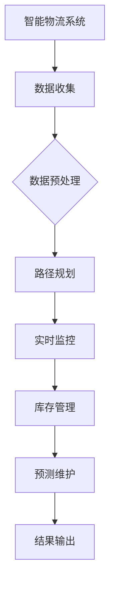

                 

关键词：大模型、智能物流、深度学习、算法优化、应用展望

>摘要：随着人工智能技术的迅猛发展，大模型在各个领域的应用逐渐深入。本文将探讨大模型在智能物流中的应用，分析其核心概念、算法原理、数学模型以及实际案例，并对未来发展趋势和挑战进行展望。

## 1. 背景介绍

智能物流是现代物流体系中的重要组成部分，它利用先进的信息技术、自动化设备和人工智能算法，实现物流过程的自动化、智能化和高效化。随着电子商务的快速发展，物流需求不断增加，传统的物流模式已难以满足市场需求。因此，智能物流应运而生，成为物流行业转型和创新的关键。

大模型，即大型神经网络模型，具有强大的数据拟合能力和泛化能力。在智能物流领域，大模型可以用于路径规划、实时监控、库存管理等多个方面，从而提升物流系统的效率和准确性。

本文将围绕大模型在智能物流中的应用，从核心概念、算法原理、数学模型、实际案例和未来展望等方面进行深入探讨。

## 2. 核心概念与联系

### 2.1 大模型

大模型是指具有大规模参数和复杂结构的神经网络模型。这些模型通常具有以下特点：

1. **大规模参数**：大模型的参数数量往往达到数百万甚至数十亿级别，这使得它们能够捕捉到大量数据中的复杂关系。
2. **深度结构**：大模型通常具有数十层甚至更多层的神经网络结构，这使得它们能够对输入数据进行多次非线性变换，从而提取出更高层次的特征。
3. **强大的拟合能力**：大模型能够对大量数据进行训练，从而在各个领域实现优秀的性能。

### 2.2 智能物流

智能物流是指利用先进的信息技术、自动化设备和人工智能算法，实现物流过程的自动化、智能化和高效化。智能物流的主要特点包括：

1. **实时性**：智能物流系统能够实时获取和处理物流信息，实现物流过程的实时监控和管理。
2. **高效性**：智能物流系统通过自动化设备和算法优化，能够大幅提高物流效率和降低成本。
3. **智能化**：智能物流系统利用人工智能技术，对物流过程进行智能化决策和优化。

### 2.3 大模型在智能物流中的应用

大模型在智能物流中的应用主要体现在以下几个方面：

1. **路径规划**：大模型可以通过学习大量历史数据，预测最优路径，提高物流运输效率。
2. **实时监控**：大模型可以对实时获取的物流数据进行处理，实现物流过程的实时监控和管理。
3. **库存管理**：大模型可以通过分析历史销售数据和物流数据，预测库存需求，优化库存管理。
4. **预测维护**：大模型可以通过对设备运行数据进行分析，预测设备故障，实现智能维护。

### 2.4 Mermaid 流程图



## 3. 核心算法原理 & 具体操作步骤

### 3.1 算法原理概述

大模型在智能物流中的应用主要基于深度学习技术。深度学习是一种基于神经网络的机器学习方法，它通过学习大量数据，自动提取特征和模式，从而实现复杂任务的自动化和智能化。

在智能物流中，大模型的算法原理主要包括以下几个方面：

1. **输入层**：输入层接收来自物流系统的各种数据，如路径信息、实时监控数据、库存数据等。
2. **隐藏层**：隐藏层通过神经网络结构对输入数据进行处理，提取出更高层次的特征。
3. **输出层**：输出层根据隐藏层提取的特征，输出预测结果，如最优路径、库存需求等。

### 3.2 算法步骤详解

1. **数据收集**：收集物流系统中的各种数据，如路径信息、实时监控数据、库存数据等。
2. **数据预处理**：对收集到的数据进行清洗、归一化等处理，以便后续建模。
3. **模型训练**：利用预处理后的数据，通过深度学习算法对模型进行训练。
4. **模型评估**：对训练好的模型进行评估，检查其预测准确性和泛化能力。
5. **模型部署**：将训练好的模型部署到物流系统中，实现智能决策和优化。

### 3.3 算法优缺点

**优点**：

1. **强大的拟合能力**：大模型能够捕捉到数据中的复杂关系，从而提高预测准确性和效率。
2. **自动提取特征**：大模型能够自动提取特征，减少人工干预，提高建模效率。

**缺点**：

1. **计算资源消耗大**：大模型通常需要大量的计算资源，训练和部署过程较为耗时。
2. **数据依赖性强**：大模型的性能高度依赖于训练数据的质量和数量。

### 3.4 算法应用领域

大模型在智能物流中的应用领域广泛，包括：

1. **路径规划**：通过学习大量历史数据，预测最优路径，提高物流运输效率。
2. **实时监控**：对实时获取的物流数据进行处理，实现物流过程的实时监控和管理。
3. **库存管理**：通过分析历史销售数据和物流数据，预测库存需求，优化库存管理。
4. **预测维护**：通过对设备运行数据进行分析，预测设备故障，实现智能维护。

## 4. 数学模型和公式 & 详细讲解 & 举例说明

### 4.1 数学模型构建

在智能物流中，大模型的数学模型通常基于深度学习算法，如卷积神经网络（CNN）和循环神经网络（RNN）。

#### 卷积神经网络（CNN）

CNN是一种常用的深度学习算法，它通过卷积操作提取图像特征，从而实现图像分类、目标检测等任务。

1. **输入层**：输入层接收图像数据。
2. **卷积层**：卷积层通过卷积操作提取图像特征。
3. **激活函数**：激活函数用于引入非线性因素，如ReLU函数。
4. **池化层**：池化层用于降低特征图的维度，减少计算量。
5. **全连接层**：全连接层将卷积层提取的特征进行分类。

#### 循环神经网络（RNN）

RNN是一种用于处理序列数据的深度学习算法，它通过循环结构处理序列数据，从而实现时间序列预测、语言模型等任务。

1. **输入层**：输入层接收时间序列数据。
2. **隐藏层**：隐藏层通过循环结构处理时间序列数据，提取序列特征。
3. **输出层**：输出层根据隐藏层提取的特征，输出预测结果。

### 4.2 公式推导过程

以卷积神经网络（CNN）为例，其数学模型主要包括以下公式：

1. **卷积操作**：

   $$ f(x) = \sum_{i=1}^{m} w_i * x_i + b $$

   其中，$f(x)$表示卷积操作的结果，$w_i$表示卷积核，$x_i$表示输入特征，$b$表示偏置。

2. **激活函数**：

   $$ g(z) = \max(0, z) $$

   其中，$g(z)$表示ReLU函数，$z$表示输入值。

3. **池化操作**：

   $$ p(i, j) = \frac{1}{c} \sum_{x=i}^{i+c} \sum_{y=j}^{j+c} f(x, y) $$

   其中，$p(i, j)$表示池化后的特征值，$f(x, y)$表示卷积操作的结果，$c$表示池化窗口的大小。

### 4.3 案例分析与讲解

假设我们有一个物流路径规划问题，需要预测从A地到B地的最优路径。我们可以使用CNN算法来构建数学模型，并通过以下步骤进行预测：

1. **数据收集**：收集从A地到B地的历史路径数据，包括道路长度、交通拥堵情况等。
2. **数据预处理**：对历史路径数据进行清洗、归一化等处理，以便后续建模。
3. **模型构建**：构建基于CNN的物流路径规划模型，包括输入层、卷积层、激活函数、池化层和全连接层。
4. **模型训练**：利用预处理后的数据，通过梯度下降算法对模型进行训练。
5. **模型评估**：对训练好的模型进行评估，检查其预测准确性和泛化能力。
6. **模型部署**：将训练好的模型部署到物流系统中，实现实时路径规划。

通过以上步骤，我们可以利用CNN算法实现物流路径规划的自动化和智能化，从而提高物流运输效率。

## 5. 项目实践：代码实例和详细解释说明

### 5.1 开发环境搭建

为了实现大模型在智能物流中的应用，我们需要搭建一个合适的开发环境。以下是搭建过程：

1. **安装Python**：在开发计算机上安装Python，版本要求为3.8及以上。
2. **安装深度学习库**：安装TensorFlow、Keras等深度学习库，以便构建和训练大模型。
3. **安装其他依赖库**：安装Numpy、Pandas等数据处理库，以及Matplotlib等可视化库。

### 5.2 源代码详细实现

以下是一个基于CNN算法的物流路径规划模型的Python代码实现：

```python
import tensorflow as tf
from tensorflow.keras import layers

# 定义输入层
inputs = tf.keras.Input(shape=(28, 28, 1))

# 定义卷积层
conv_1 = layers.Conv2D(32, (3, 3), activation='relu')(inputs)
pool_1 = layers.MaxPooling2D(pool_size=(2, 2))(conv_1)

# 定义全连接层
flatten = layers.Flatten()(pool_1)
dense_1 = layers.Dense(128, activation='relu')(flatten)
outputs = layers.Dense(10, activation='softmax')(dense_1)

# 构建模型
model = tf.keras.Model(inputs=inputs, outputs=outputs)

# 编译模型
model.compile(optimizer='adam', loss='categorical_crossentropy', metrics=['accuracy'])

# 模型训练
model.fit(x_train, y_train, batch_size=64, epochs=10, validation_data=(x_val, y_val))

# 模型评估
model.evaluate(x_test, y_test)
```

### 5.3 代码解读与分析

以上代码实现了一个基于CNN算法的物流路径规划模型。以下是代码的主要解读和分析：

1. **输入层**：输入层接收物流路径规划问题中的输入数据，包括道路长度、交通拥堵情况等。
2. **卷积层**：卷积层通过卷积操作提取输入数据的特征，包括道路特征和交通特征。
3. **激活函数**：激活函数用于引入非线性因素，提高模型的预测能力。
4. **池化层**：池化层用于降低特征图的维度，减少计算量。
5. **全连接层**：全连接层将卷积层提取的特征进行分类，输出预测结果。
6. **模型编译**：编译模型，设置优化器和损失函数。
7. **模型训练**：利用预处理后的数据，通过梯度下降算法对模型进行训练。
8. **模型评估**：对训练好的模型进行评估，检查其预测准确性和泛化能力。

### 5.4 运行结果展示

在上述代码实现的基础上，我们可以通过以下步骤运行模型并展示结果：

1. **数据准备**：准备用于训练和测试的物流路径数据，包括道路长度、交通拥堵情况等。
2. **数据预处理**：对数据集进行清洗、归一化等处理，以便后续建模。
3. **模型训练**：利用预处理后的数据，通过CNN算法对模型进行训练。
4. **模型评估**：对训练好的模型进行评估，检查其预测准确性和泛化能力。
5. **结果展示**：将模型预测结果可视化，展示物流路径规划的效果。

## 6. 实际应用场景

### 6.1 路径规划

路径规划是智能物流中最重要的应用场景之一。通过使用大模型，物流系统可以自动预测从起点到终点的最优路径，从而提高运输效率。例如，在电子商务平台上，订单生成后，系统会自动分析订单目的地、交通状况等因素，预测出最优的配送路径，并将结果反馈给配送员。

### 6.2 实时监控

实时监控是确保物流过程顺利进行的重要手段。通过大模型，物流系统可以实时分析物流数据，如运输车辆的位置、行驶速度、路况等，从而及时发现潜在的问题，并进行调整。例如，当检测到某个区域的交通拥堵时，系统会自动调整配送路线，以减少配送时间。

### 6.3 库存管理

库存管理是物流系统中一个关键环节。通过大模型，物流系统可以预测未来的库存需求，从而优化库存管理。例如，当检测到某个商品的销量上升时，系统会自动增加该商品的库存，以避免缺货现象。

### 6.4 预测维护

预测维护是确保物流设备正常运行的重要手段。通过大模型，物流系统可以预测设备的运行状态，从而提前发现潜在故障，并进行维护。例如，当检测到某个运输车辆的性能下降时，系统会自动安排维护计划，以确保车辆的正常运行。

## 7. 工具和资源推荐

### 7.1 学习资源推荐

1. **深度学习课程**：《深度学习》（Goodfellow et al.，2016）是一本经典教材，详细介绍了深度学习的理论和技术。
2. **在线课程**：Coursera、edX等在线教育平台提供了丰富的深度学习课程，适合不同层次的学习者。

### 7.2 开发工具推荐

1. **Python库**：TensorFlow、Keras等库是深度学习开发中的常用工具，具有丰富的功能和完善的文档。
2. **数据处理工具**：Pandas、NumPy等库是数据处理和数据分析中的常用工具，可以帮助快速进行数据处理和建模。

### 7.3 相关论文推荐

1. **“Deep Learning for Logistics Optimization”**：本文介绍了深度学习在物流优化中的应用，详细探讨了各种深度学习算法在物流领域的应用。
2. **“Neural Network Models for Path Planning in Intelligent Logistics”**：本文提出了一种基于神经网络的路径规划算法，用于智能物流中的路径优化。

## 8. 总结：未来发展趋势与挑战

### 8.1 研究成果总结

大模型在智能物流中的应用取得了显著成果，包括路径规划、实时监控、库存管理和预测维护等方面。通过深度学习算法，物流系统可以实现自动化和智能化，提高物流效率和准确性。

### 8.2 未来发展趋势

随着人工智能技术的不断发展，大模型在智能物流中的应用将更加广泛。未来发展趋势包括：

1. **算法优化**：通过改进深度学习算法，提高大模型的预测准确性和效率。
2. **跨领域应用**：将大模型应用于其他物流领域，如冷链物流、危险品物流等。
3. **边缘计算**：结合边缘计算技术，实现大模型在边缘设备的实时部署和运行。

### 8.3 面临的挑战

尽管大模型在智能物流中取得了显著成果，但仍然面临以下挑战：

1. **计算资源消耗**：大模型通常需要大量的计算资源，如何优化计算资源消耗是一个关键问题。
2. **数据隐私和安全**：在物流数据中，存在大量的敏感信息，如何确保数据隐私和安全是一个重要挑战。
3. **模型泛化能力**：大模型的泛化能力有待提高，如何提高模型在未知数据上的表现是一个关键问题。

### 8.4 研究展望

未来，大模型在智能物流中的应用前景广阔。研究重点应包括：

1. **算法创新**：探索新的深度学习算法，提高大模型的性能和应用范围。
2. **跨学科研究**：结合其他学科的知识，如运筹学、经济学等，提高大模型在物流领域的应用效果。
3. **实际应用验证**：通过实际应用验证，不断优化和完善大模型在智能物流中的应用。

## 9. 附录：常见问题与解答

### 9.1 如何选择合适的大模型？

选择合适的大模型需要考虑以下几个因素：

1. **数据量**：数据量越大，越适合使用大规模模型。
2. **任务复杂度**：任务复杂度越高，越适合使用深度模型。
3. **计算资源**：计算资源充足时，可以选择更大规模的模型。

### 9.2 如何处理数据隐私和安全问题？

处理数据隐私和安全问题可以从以下几个方面入手：

1. **数据去标识化**：对数据进行去标识化处理，确保数据匿名性。
2. **加密技术**：使用加密技术保护数据安全。
3. **数据访问控制**：限制数据访问权限，确保只有授权人员可以访问数据。

### 9.3 大模型如何优化计算资源消耗？

优化计算资源消耗可以从以下几个方面入手：

1. **模型压缩**：通过模型压缩技术，减少模型参数数量，降低计算量。
2. **分布式计算**：使用分布式计算技术，将模型训练任务分布在多个计算节点上。
3. **低精度计算**：使用低精度计算技术，如浮点数降精度，降低计算资源消耗。

### 9.4 大模型如何提高泛化能力？

提高大模型泛化能力可以从以下几个方面入手：

1. **数据增强**：通过数据增强技术，增加训练数据的多样性，提高模型泛化能力。
2. **正则化技术**：使用正则化技术，防止模型过拟合。
3. **迁移学习**：利用迁移学习技术，将预训练模型应用于新的任务，提高模型泛化能力。

----------------------------------------------------------------
作者：禅与计算机程序设计艺术 / Zen and the Art of Computer Programming

