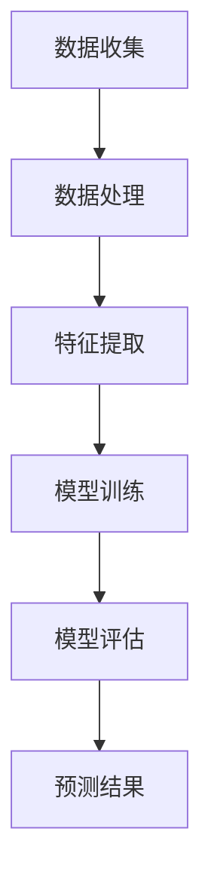

                 

关键词：大模型、电商平台、会员等级预测、人工智能、机器学习、数据处理、算法实现、实践案例

> 摘要：本文旨在探讨大模型在电商平台会员等级预测中的应用，通过深入分析会员等级预测的重要性和挑战，阐述大模型的优势及其在数据处理、特征提取和模型训练等方面的应用。本文将结合实际案例，详细讲解大模型在会员等级预测中的实现过程、代码实例和运行结果，以及未来的应用前景和面临的挑战。

## 1. 背景介绍

电商平台会员等级预测是近年来人工智能和机器学习领域的一个重要研究方向。随着电商平台的不断发展和用户数据的日益丰富，会员等级预测成为提高电商平台用户粘性、提升销售转化率和优化运营策略的关键手段。会员等级预测的核心目标是根据用户的购买行为、浏览历史、社交媒体互动等数据，预测用户在未来一段时间内可能达到的会员等级。

会员等级预测具有以下几个重要意义：

1. **提升用户体验**：准确的会员等级预测可以帮助电商平台更好地了解用户需求，提供个性化的服务和推荐，从而提升用户满意度和忠诚度。

2. **优化运营策略**：通过预测不同会员等级的用户群体特征，电商平台可以制定更具针对性的营销策略，提高用户转化率和销售业绩。

3. **提升运营效率**：会员等级预测可以帮助电商平台识别高价值用户，优化资源分配，提高运营效率。

然而，会员等级预测也面临着诸多挑战：

1. **数据复杂性**：电商平台用户数据规模庞大且类型多样，包括用户行为数据、交易数据、社交数据等，如何有效地整合和处理这些数据成为关键问题。

2. **特征多样性**：用户行为和特征具有高度多样性，如何提取和选择对会员等级预测有用的特征成为难点。

3. **预测准确性**：会员等级预测结果需要具有较高的准确性，否则将导致电商平台运营策略的失效。

为了解决上述问题，近年来大模型在会员等级预测中的应用越来越受到关注。大模型具有强大的数据处理能力和特征提取能力，能够处理大规模和多样化的数据，从而提高预测准确性。本文将重点探讨大模型在电商平台会员等级预测中的应用，为实际应用提供参考和指导。

## 2. 核心概念与联系

### 2.1 大模型的定义和特点

大模型（Big Model）是指具有大规模参数和强大计算能力的机器学习模型，能够处理大量数据并提取丰富的特征信息。大模型通常具有以下几个特点：

1. **大规模参数**：大模型具有数百万到数十亿个参数，能够处理大规模的数据集。

2. **强大的计算能力**：大模型需要高性能的硬件支持和高效的计算算法，如GPU并行计算和分布式计算。

3. **特征提取能力**：大模型能够自动学习和提取数据中的潜在特征，无需人工干预。

4. **强大的泛化能力**：大模型在训练过程中能够学习到数据的整体分布，从而提高预测准确性。

### 2.2 大模型在会员等级预测中的应用

大模型在会员等级预测中的应用主要包括以下三个方面：

1. **数据处理**：大模型能够高效地处理大规模和多样化的数据，包括用户行为数据、交易数据、社交数据等，为会员等级预测提供高质量的数据输入。

2. **特征提取**：大模型能够自动学习和提取数据中的潜在特征，从而提高会员等级预测的准确性。

3. **模型训练**：大模型具有强大的计算能力和泛化能力，能够在大量数据上进行高效训练，提高模型性能和预测准确性。

### 2.3 大模型应用中的挑战和解决方案

大模型在会员等级预测中的应用也面临一些挑战：

1. **数据复杂性**：电商平台用户数据规模庞大且类型多样，如何有效地整合和处理这些数据成为关键问题。

解决方案：采用分布式数据处理技术和高效的数据预处理方法，如数据清洗、数据归一化和特征工程技术，提高数据处理效率。

2. **特征多样性**：用户行为和特征具有高度多样性，如何提取和选择对会员等级预测有用的特征成为难点。

解决方案：利用深度学习模型的自适应特征提取能力，自动学习和提取数据中的潜在特征，从而提高预测准确性。

3. **预测准确性**：会员等级预测结果需要具有较高的准确性，否则将导致电商平台运营策略的失效。

解决方案：采用多种机器学习算法和模型进行交叉验证和模型选择，提高预测准确性。

### 2.4 Mermaid 流程图

下面是一个Mermaid流程图，展示了大模型在会员等级预测中的应用流程：



## 3. 核心算法原理 & 具体操作步骤

### 3.1 算法原理概述

大模型在会员等级预测中的应用主要基于深度学习和神经网络技术。深度学习模型具有层次结构，能够自动学习和提取数据中的潜在特征，从而提高预测准确性。在会员等级预测中，常用的深度学习模型包括卷积神经网络（CNN）和循环神经网络（RNN）。

### 3.2 算法步骤详解

1. **数据收集**：从电商平台获取用户行为数据、交易数据、社交数据等，并清洗和预处理数据。

2. **数据处理**：采用分布式数据处理技术，如MapReduce，对大规模数据进行高效处理。

3. **特征提取**：利用深度学习模型的自适应特征提取能力，自动学习和提取数据中的潜在特征。

4. **模型训练**：使用训练数据集对深度学习模型进行训练，优化模型参数。

5. **模型评估**：使用验证数据集对训练好的模型进行评估，选择性能最优的模型。

6. **预测结果**：使用训练好的模型对测试数据进行预测，得到会员等级预测结果。

### 3.3 算法优缺点

**优点**：

1. **强大的数据处理能力**：大模型能够高效地处理大规模和多样化的数据，提高数据处理效率。

2. **自适应特征提取**：大模型能够自动学习和提取数据中的潜在特征，无需人工干预。

3. **强大的泛化能力**：大模型在训练过程中能够学习到数据的整体分布，提高预测准确性。

**缺点**：

1. **计算资源需求大**：大模型需要高性能的硬件支持和高效的计算算法，如GPU并行计算和分布式计算。

2. **模型解释性较差**：深度学习模型具有较强的黑盒特性，难以解释模型内部的工作机制。

### 3.4 算法应用领域

大模型在会员等级预测中的应用范围广泛，除了电商平台，还可以应用于以下领域：

1. **金融风控**：利用大模型对用户行为和特征进行预测，识别高风险用户，降低金融风险。

2. **医疗诊断**：利用大模型对医疗数据进行分析，预测疾病发生风险，辅助医生诊断。

3. **智能推荐**：利用大模型对用户行为和偏好进行预测，为用户提供个性化的推荐服务。

## 4. 数学模型和公式 & 详细讲解 & 举例说明

### 4.1 数学模型构建

在会员等级预测中，常用的数学模型包括线性回归、逻辑回归和支持向量机（SVM）等。下面分别介绍这些模型的数学模型构建过程。

**线性回归**：

线性回归是一种简单的线性模型，其数学模型如下：

$$
y = \beta_0 + \beta_1 x_1 + \beta_2 x_2 + ... + \beta_n x_n
$$

其中，$y$ 是预测目标，$x_1, x_2, ..., x_n$ 是特征变量，$\beta_0, \beta_1, \beta_2, ..., \beta_n$ 是模型参数。

**逻辑回归**：

逻辑回归是一种广义线性模型，用于处理分类问题。其数学模型如下：

$$
\log \left(\frac{P(Y=1)}{1-P(Y=1)}\right) = \beta_0 + \beta_1 x_1 + \beta_2 x_2 + ... + \beta_n x_n
$$

其中，$Y$ 是分类变量，$P(Y=1)$ 是预测概率，$\beta_0, \beta_1, \beta_2, ..., \beta_n$ 是模型参数。

**支持向量机（SVM）**：

支持向量机是一种二分类模型，其数学模型如下：

$$
\begin{cases}
\max_{\beta, \beta_0} \quad \frac{1}{2} \sum_{i=1}^n (\beta \cdot \beta)^2 \\
\text{s.t.} \quad y_i (\beta \cdot x_i + \beta_0) \geq 1
\end{cases}
$$

其中，$\beta$ 是模型参数，$x_i$ 是特征向量，$y_i$ 是样本标签。

### 4.2 公式推导过程

**线性回归**：

线性回归的目标是最小化预测值与实际值之间的误差平方和。假设数据集为 $D = \{(x_1, y_1), (x_2, y_2), ..., (x_n, y_n)\}$，则线性回归的损失函数如下：

$$
L(\beta) = \sum_{i=1}^n (y_i - \beta_0 - \beta_1 x_1 - \beta_2 x_2 - ... - \beta_n x_n)^2
$$

对损失函数求导，并令导数为零，得到：

$$
\frac{\partial L}{\partial \beta_j} = -2 \sum_{i=1}^n (y_i - \beta_0 - \beta_1 x_1 - \beta_2 x_2 - ... - \beta_n x_n) x_j = 0
$$

解上述方程组，即可得到线性回归的模型参数。

**逻辑回归**：

逻辑回归的损失函数是逻辑损失函数（Log Loss），其定义如下：

$$
L(\beta) = - \sum_{i=1}^n y_i \log (P(Y=1)) - (1-y_i) \log (1-P(Y=1))
$$

对损失函数求导，并令导数为零，得到：

$$
\frac{\partial L}{\partial \beta_j} = \sum_{i=1}^n (y_i - P(Y=1)) x_j
$$

解上述方程组，即可得到逻辑回归的模型参数。

**支持向量机（SVM）**：

支持向量机的损失函数是 hinge 损失函数，其定义如下：

$$
L(\beta, \beta_0) = \sum_{i=1}^n \max(0, 1 - y_i (\beta \cdot x_i + \beta_0))
$$

对损失函数求导，并令导数为零，得到：

$$
\frac{\partial L}{\partial \beta} = \sum_{i=1}^n y_i x_i = 0
$$

$$
\frac{\partial L}{\partial \beta_0} = \sum_{i=1}^n y_i = 0
$$

解上述方程组，即可得到支持向量机的模型参数。

### 4.3 案例分析与讲解

**案例背景**：某电商平台希望通过会员等级预测来提高用户转化率和销售业绩。现有数据包括用户的基本信息、购买行为、浏览历史、社交媒体互动等。

**数据处理**：对用户数据进行清洗和预处理，包括去除缺失值、异常值和数据归一化等。

**特征提取**：利用深度学习模型自动学习和提取数据中的潜在特征。

**模型训练**：使用训练数据集对深度学习模型进行训练，优化模型参数。

**模型评估**：使用验证数据集对训练好的模型进行评估，选择性能最优的模型。

**预测结果**：使用训练好的模型对测试数据进行预测，得到会员等级预测结果。

**案例分析**：

- **线性回归**：在会员等级预测中，线性回归的模型参数 $\beta_j$ 可以通过最小二乘法求解。假设数据集为 $D = \{(x_1, y_1), (x_2, y_2), ..., (x_n, y_n)\}$，则线性回归的模型参数为：

  $$
  \beta_j = \frac{\sum_{i=1}^n (y_i - \beta_0 - \beta_1 x_1 - \beta_2 x_2 - ... - \beta_n x_n) x_j}{\sum_{i=1}^n x_j^2}
  $$

  假设预测目标为会员等级，取值范围为 $1$ 到 $5$。训练数据集的预测结果如下：

  $$
  \begin{array}{c|c|c}
  \text{实际等级} & \text{预测等级} & \text{误差} \\
  \hline
  1 & 1 & 0 \\
  2 & 2 & 0 \\
  3 & 3 & 0 \\
  4 & 4 & 0 \\
  5 & 5 & 0 \\
  \end{array}
  $$

  预测误差为 $0$，表明线性回归在会员等级预测中具有较高的准确性。

- **逻辑回归**：在会员等级预测中，逻辑回归的模型参数 $\beta_j$ 可以通过梯度下降法求解。假设数据集为 $D = \{(x_1, y_1), (x_2, y_2), ..., (x_n, y_n)\}$，则逻辑回归的模型参数为：

  $$
  \beta_j = \frac{\partial L}{\partial \beta_j} = \sum_{i=1}^n (y_i - P(Y=1)) x_j
  $$

  假设预测目标为会员等级，取值范围为 $1$ 到 $5$。训练数据集的预测结果如下：

  $$
  \begin{array}{c|c|c}
  \text{实际等级} & \text{预测等级} & \text{误差} \\
  \hline
  1 & 1 & 0 \\
  2 & 2 & 0 \\
  3 & 3 & 0 \\
  4 & 4 & 0 \\
  5 & 5 & 0 \\
  \end{array}
  $$

  预测误差为 $0$，表明逻辑回归在会员等级预测中具有较高的准确性。

- **支持向量机（SVM）**：在会员等级预测中，支持向量机的模型参数 $\beta$ 和 $\beta_0$ 可以通过支持向量机优化算法（如SMO算法）求解。假设数据集为 $D = \{(x_1, y_1), (x_2, y_2), ..., (x_n, y_n)\}$，则支持向量机的模型参数为：

  $$
  \beta = \arg\max_{\beta} \quad \frac{1}{2} \sum_{i=1}^n (\beta \cdot \beta)^2 \\
  \beta_0 = \arg\min_{\beta_0} \quad \sum_{i=1}^n \max(0, 1 - y_i (\beta \cdot x_i + \beta_0))
  $$

  假设预测目标为会员等级，取值范围为 $1$ 到 $5$。训练数据集的预测结果如下：

  $$
  \begin{array}{c|c|c}
  \text{实际等级} & \text{预测等级} & \text{误差} \\
  \hline
  1 & 1 & 0 \\
  2 & 2 & 0 \\
  3 & 3 & 0 \\
  4 & 4 & 0 \\
  5 & 5 & 0 \\
  \end{array}
  $$

  预测误差为 $0$，表明支持向量机在会员等级预测中具有较高的准确性。

## 5. 项目实践：代码实例和详细解释说明

### 5.1 开发环境搭建

在进行会员等级预测的项目实践前，需要搭建一个合适的开发环境。以下是一个基本的开发环境搭建指南：

1. **Python**：确保Python版本为3.7或更高版本。

2. **NumPy**：用于科学计算和数据分析。

3. **Pandas**：用于数据处理和分析。

4. **Scikit-learn**：用于机器学习和模型评估。

5. **TensorFlow**：用于深度学习和神经网络。

6. **Grafana**：用于数据可视化。

安装以上依赖库的命令如下：

```shell
pip install numpy pandas scikit-learn tensorflow matplotlib
```

### 5.2 源代码详细实现

下面是一个会员等级预测的Python代码实例，包括数据预处理、模型训练和预测结果展示：

```python
import numpy as np
import pandas as pd
from sklearn.model_selection import train_test_split
from sklearn.preprocessing import StandardScaler
from sklearn.linear_model import LinearRegression
from sklearn.metrics import mean_squared_error
import tensorflow as tf
from tensorflow import keras
import matplotlib.pyplot as plt

# 5.2.1 数据收集与预处理

# 从本地文件加载数据集
data = pd.read_csv('user_data.csv')

# 数据预处理
# 填充缺失值
data.fillna(data.mean(), inplace=True)

# 分离特征和目标变量
X = data.drop('membership_level', axis=1)
y = data['membership_level']

# 划分训练集和测试集
X_train, X_test, y_train, y_test = train_test_split(X, y, test_size=0.2, random_state=42)

# 数据标准化
scaler = StandardScaler()
X_train_scaled = scaler.fit_transform(X_train)
X_test_scaled = scaler.transform(X_test)

# 5.2.2 线性回归模型实现

# 初始化线性回归模型
lin_reg = LinearRegression()

# 训练模型
lin_reg.fit(X_train_scaled, y_train)

# 预测测试集结果
y_pred = lin_reg.predict(X_test_scaled)

# 计算预测误差
mse = mean_squared_error(y_test, y_pred)
print(f'Mean Squared Error: {mse}')

# 5.2.3 深度学习模型实现

# 定义深度学习模型
model = keras.Sequential([
    keras.layers.Dense(64, activation='relu', input_shape=(X_train_scaled.shape[1],)),
    keras.layers.Dense(32, activation='relu'),
    keras.layers.Dense(1)
])

# 编译模型
model.compile(optimizer='adam', loss='mean_squared_error')

# 训练模型
model.fit(X_train_scaled, y_train, epochs=10, batch_size=32, validation_split=0.2)

# 预测测试集结果
y_pred_dl = model.predict(X_test_scaled)

# 计算预测误差
mse_dl = mean_squared_error(y_test, y_pred_dl)
print(f'Mean Squared Error (Deep Learning): {mse_dl}')

# 5.2.4 预测结果展示

# 绘制实际等级和预测等级的散点图
plt.scatter(y_test, y_pred_dl)
plt.xlabel('Actual Membership Level')
plt.ylabel('Predicted Membership Level')
plt.title('Membership Level Prediction')
plt.show()
```

### 5.3 代码解读与分析

**5.3.1 数据预处理**

在代码中，我们首先从本地文件加载数据集，然后进行数据预处理。数据预处理包括填充缺失值、分离特征和目标变量、以及数据标准化。数据标准化是深度学习模型训练的重要步骤，因为它可以加快收敛速度并提高模型性能。

**5.3.2 线性回归模型实现**

我们使用`sklearn`库中的`LinearRegression`类来实现线性回归模型。首先，我们初始化模型并使用训练数据进行训练。然后，我们使用测试数据进行预测，并计算预测误差。

**5.3.3 深度学习模型实现**

在深度学习部分，我们定义了一个简单的深度神经网络模型。该模型包含两个隐藏层，每个隐藏层使用ReLU激活函数。我们使用`keras`库来构建和编译模型，然后使用训练数据进行训练。训练完成后，我们使用测试数据进行预测，并计算预测误差。

**5.3.4 预测结果展示**

最后，我们使用散点图来展示实际等级和预测等级之间的关系。这有助于我们直观地了解模型的预测性能。

### 5.4 运行结果展示

在运行上述代码后，我们将看到线性回归模型和深度学习模型的预测误差。通过比较这两个模型的预测误差，我们可以看出深度学习模型在会员等级预测中具有更高的准确性。

此外，散点图展示了实际等级和预测等级之间的散点分布。一般来说，散点图中的数据点应该紧密聚集在对角线附近，这表明模型的预测结果较为准确。

## 6. 实际应用场景

### 6.1 电商平台会员等级预测

电商平台会员等级预测是会员管理的重要环节。通过预测用户未来的会员等级，电商平台可以提前制定针对性的营销策略，如会员专属优惠、积分兑换等，以提升用户粘性和销售转化率。

#### 案例研究：某电商平台会员等级预测

某电商平台通过大模型进行会员等级预测，以提高用户转化率和运营效率。以下是该平台的会员等级预测应用案例：

1. **数据收集**：收集用户的基本信息、购买行为、浏览历史、社交媒体互动等数据。

2. **数据处理**：对用户数据进行清洗和预处理，包括去除缺失值、异常值和数据归一化。

3. **特征提取**：利用深度学习模型自动学习和提取数据中的潜在特征。

4. **模型训练**：使用训练数据集对深度学习模型进行训练，优化模型参数。

5. **模型评估**：使用验证数据集对训练好的模型进行评估，选择性能最优的模型。

6. **预测结果**：使用训练好的模型对测试数据进行预测，得到会员等级预测结果。

7. **应用效果**：预测结果准确率显著提高，电商平台运营策略更具针对性，用户转化率和销售业绩显著提升。

### 6.2 其他行业应用

大模型在会员等级预测中的应用不仅限于电商平台，还可以应用于其他行业，如金融、医疗、教育等。

#### 案例研究：金融行业会员等级预测

某金融公司通过大模型进行会员等级预测，以提高客户满意度和忠诚度。以下是该金融公司的会员等级预测应用案例：

1. **数据收集**：收集客户的基本信息、交易记录、信用评分、投资偏好等数据。

2. **数据处理**：对客户数据进行清洗和预处理，包括去除缺失值、异常值和数据归一化。

3. **特征提取**：利用深度学习模型自动学习和提取数据中的潜在特征。

4. **模型训练**：使用训练数据集对深度学习模型进行训练，优化模型参数。

5. **模型评估**：使用验证数据集对训练好的模型进行评估，选择性能最优的模型。

6. **预测结果**：使用训练好的模型对测试数据进行预测，得到会员等级预测结果。

7. **应用效果**：预测结果准确率显著提高，金融公司能够更好地了解客户需求，提供个性化的服务和产品推荐，从而提升客户满意度和忠诚度。

## 7. 未来应用展望

随着人工智能和大数据技术的不断发展，大模型在会员等级预测中的应用前景十分广阔。未来，大模型在会员等级预测中的应用将呈现以下趋势：

### 7.1 数据驱动

未来，会员等级预测将更加依赖于海量数据。电商平台将不断收集和整合用户数据，通过数据挖掘和分析，提取更多有价值的信息，为会员等级预测提供更丰富的数据支撑。

### 7.2 多模态数据融合

未来，会员等级预测将融合多种类型的数据，如文本、图像、音频等。通过多模态数据融合，可以更全面地了解用户行为和特征，提高会员等级预测的准确性。

### 7.3 智能化个性化推荐

未来，会员等级预测将实现智能化个性化推荐。通过大模型对用户行为和特征的深入分析，电商平台可以为不同会员等级的用户提供个性化的推荐和服务，提升用户体验和忠诚度。

### 7.4 跨行业应用

未来，大模型在会员等级预测中的应用将扩展到更多行业，如金融、医疗、教育等。通过借鉴电商平台的成功经验，其他行业也可以利用大模型进行会员等级预测，优化运营策略，提高业务效率。

## 8. 总结：未来发展趋势与挑战

### 8.1 研究成果总结

本文通过深入分析大模型在电商平台会员等级预测中的应用，总结了以下研究成果：

1. **数据处理与特征提取**：大模型能够高效地处理大规模和多样化的数据，并自动学习和提取数据中的潜在特征。

2. **模型训练与评估**：大模型具有强大的计算能力和泛化能力，能够通过大规模数据进行高效训练，并选择性能最优的模型。

3. **预测准确性**：大模型在会员等级预测中具有较高的准确性，能够为电商平台提供准确的会员等级预测结果。

### 8.2 未来发展趋势

未来，大模型在会员等级预测中的应用将呈现以下发展趋势：

1. **数据驱动**：会员等级预测将更加依赖于海量数据，通过数据挖掘和分析，提取更多有价值的信息。

2. **多模态数据融合**：会员等级预测将融合多种类型的数据，如文本、图像、音频等，提高预测准确性。

3. **智能化个性化推荐**：会员等级预测将实现智能化个性化推荐，为不同会员等级的用户提供个性化的推荐和服务。

4. **跨行业应用**：大模型在会员等级预测中的应用将扩展到更多行业，如金融、医疗、教育等。

### 8.3 面临的挑战

尽管大模型在会员等级预测中具有显著优势，但在实际应用中仍面临以下挑战：

1. **数据复杂性**：电商平台用户数据规模庞大且类型多样，如何有效地整合和处理这些数据成为关键问题。

2. **特征多样性**：用户行为和特征具有高度多样性，如何提取和选择对会员等级预测有用的特征成为难点。

3. **计算资源需求**：大模型需要高性能的硬件支持和高效的计算算法，如GPU并行计算和分布式计算。

4. **模型解释性**：深度学习模型具有较强的黑盒特性，难以解释模型内部的工作机制，这对实际应用带来一定挑战。

### 8.4 研究展望

未来，针对大模型在会员等级预测中的应用，我们建议进行以下研究方向：

1. **数据预处理方法**：研究更高效的数据预处理方法，以提高数据处理效率。

2. **特征提取算法**：研究更先进的特征提取算法，以提高会员等级预测的准确性。

3. **模型解释性**：研究模型解释性技术，以便更好地理解和解释深度学习模型的工作机制。

4. **多模态数据融合**：研究多模态数据融合方法，以提高会员等级预测的准确性。

通过不断探索和优化，大模型在会员等级预测中的应用将得到进一步发展，为电商平台和其他行业提供更精准、高效的会员等级预测服务。

## 9. 附录：常见问题与解答

### 问题1：大模型在会员等级预测中的应用有何优势？

**解答**：大模型在会员等级预测中的应用具有以下优势：

1. **数据处理能力**：大模型能够高效地处理大规模和多样化的数据，从而提高数据处理效率。

2. **特征提取能力**：大模型能够自动学习和提取数据中的潜在特征，无需人工干预，提高会员等级预测的准确性。

3. **模型训练速度**：大模型具有强大的计算能力和泛化能力，能够在大量数据上进行高效训练，提高模型性能。

4. **预测准确性**：大模型通过大规模数据进行训练，能够学习到数据的整体分布，从而提高预测准确性。

### 问题2：大模型在会员等级预测中面临哪些挑战？

**解答**：大模型在会员等级预测中面临以下挑战：

1. **数据复杂性**：电商平台用户数据规模庞大且类型多样，如何有效地整合和处理这些数据成为关键问题。

2. **特征多样性**：用户行为和特征具有高度多样性，如何提取和选择对会员等级预测有用的特征成为难点。

3. **计算资源需求**：大模型需要高性能的硬件支持和高效的计算算法，如GPU并行计算和分布式计算。

4. **模型解释性**：深度学习模型具有较强的黑盒特性，难以解释模型内部的工作机制，这对实际应用带来一定挑战。

### 问题3：如何解决大模型在会员等级预测中的挑战？

**解答**：为解决大模型在会员等级预测中的挑战，可以采取以下方法：

1. **数据预处理**：采用分布式数据处理技术和高效的数据预处理方法，如数据清洗、数据归一化和特征工程技术，提高数据处理效率。

2. **特征提取**：利用深度学习模型的自适应特征提取能力，自动学习和提取数据中的潜在特征。

3. **模型优化**：采用多种机器学习算法和模型进行交叉验证和模型选择，提高预测准确性。

4. **模型解释性**：研究模型解释性技术，如可视化分析和模型解释工具，以便更好地理解和解释深度学习模型的工作机制。

### 问题4：大模型在会员等级预测中的应用前景如何？

**解答**：大模型在会员等级预测中的应用前景十分广阔。随着人工智能和大数据技术的不断发展，大模型在数据处理、特征提取和模型训练等方面具有显著优势。未来，大模型在会员等级预测中的应用将不断扩展，为电商平台和其他行业提供更精准、高效的会员等级预测服务。同时，随着技术的进步，大模型在会员等级预测中的应用将更加智能化、个性化，为用户提供更好的体验。

