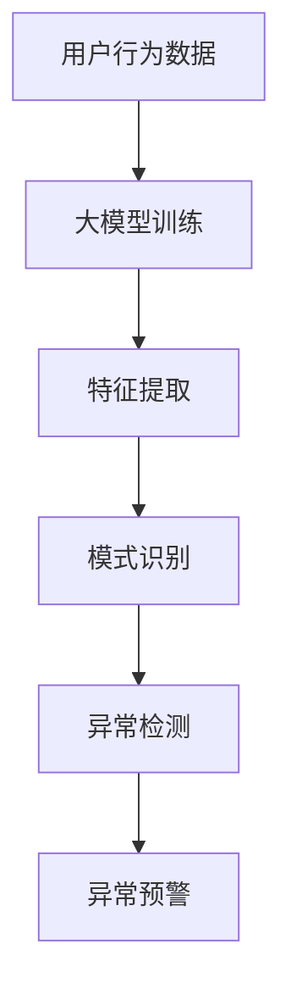

                 

关键词：大模型，用户行为异常检测，电商平台，机器学习，数据分析

摘要：随着电商平台的不断发展，用户行为数据的规模和复杂性不断增加，如何有效地检测和识别用户行为异常成为了一个关键问题。本文介绍了大模型在电商平台用户行为异常检测中的应用，包括背景介绍、核心概念与联系、核心算法原理与具体操作步骤、数学模型与公式讲解、项目实践、实际应用场景、工具和资源推荐以及未来发展趋势与挑战。通过本文的介绍，读者可以了解大模型在电商平台用户行为异常检测中的重要性和应用方法。

## 1. 背景介绍

随着互联网技术的飞速发展，电商平台已经成为人们日常生活中不可或缺的一部分。在电商平台上，用户行为数据如浏览、搜索、购买等行为被大量记录，这些数据不仅反映了用户的偏好和需求，也为电商平台提供了改进服务和营销策略的宝贵信息。然而，随着数据量的急剧增加，如何从海量数据中快速、准确地识别出用户行为的异常，成为了一个亟待解决的问题。

用户行为异常检测在电商平台中具有重要的作用。首先，它有助于发现潜在的欺诈行为，如刷单、虚假评论等，从而保护电商平台的诚信和声誉。其次，异常检测可以帮助电商平台更好地理解用户的行为模式，为个性化推荐和营销策略提供支持。此外，异常检测还可以帮助电商平台识别潜在的安全威胁，如恶意攻击、账户被盗等。

传统的用户行为异常检测方法主要依赖于统计分析和规则匹配。这些方法在处理简单、规则明确的场景下表现良好，但在面对复杂、非线性的用户行为数据时，效果有限。随着深度学习和大数据技术的不断发展，大模型（如神经网络）在用户行为异常检测中的应用逐渐成为研究的热点。本文将介绍大模型在电商平台用户行为异常检测中的应用，包括核心概念、算法原理、数学模型和实际应用等。

## 2. 核心概念与联系

### 2.1 用户行为异常检测的定义

用户行为异常检测是指通过分析用户的浏览、搜索、购买等行为数据，识别出与正常行为相比存在显著差异的行为。这些异常行为可能是欺诈、恶意攻击、账户被盗等安全威胁，也可能是用户行为习惯的改变，如购物偏好发生变化。

### 2.2 大模型的概念

大模型是指具有大规模参数、能够处理海量数据的深度学习模型。大模型通常基于神经网络架构，通过大量的数据训练，能够自动提取数据中的特征，并实现高精度的预测和分类。常见的深度学习模型包括卷积神经网络（CNN）、循环神经网络（RNN）、长短期记忆网络（LSTM）等。

### 2.3 大模型在用户行为异常检测中的应用

大模型在用户行为异常检测中的应用主要体现在以下几个方面：

1. **特征提取**：大模型能够从原始的用户行为数据中自动提取高层次的抽象特征，这些特征对于异常检测具有重要的指示意义。

2. **模式识别**：大模型能够通过学习大量的正常和异常行为数据，识别出用户行为中的异常模式，从而实现自动化的异常检测。

3. **实时性**：大模型具有良好的实时性，能够快速处理海量用户行为数据，实时检测异常行为。

### 2.4 Mermaid 流程图



## 3. 核心算法原理 & 具体操作步骤

### 3.1 算法原理概述

大模型在用户行为异常检测中的核心算法是深度学习，特别是基于神经网络的模型。深度学习通过多层神经网络结构，对用户行为数据进行特征提取和模式识别，从而实现异常检测。

### 3.2 算法步骤详解

1. **数据收集与预处理**：收集电商平台的用户行为数据，包括浏览、搜索、购买等行为。对数据进行清洗、去重和处理，确保数据质量。

2. **特征提取**：使用深度学习模型（如CNN、RNN）对用户行为数据进行特征提取。这一步骤是深度学习模型的核心，通过多层神经网络结构，自动提取数据中的高维特征。

3. **模型训练**：使用提取的特征，训练深度学习模型。在训练过程中，模型通过反向传播算法不断调整参数，优化模型性能。

4. **模式识别**：使用训练好的模型，对用户行为数据进行模式识别。通过比较正常行为和异常行为的特征，识别出异常行为。

5. **异常检测**：对识别出的异常行为进行进一步的检测和验证，确定其是否为真正的异常行为。

6. **异常预警**：将识别出的异常行为通知相关部门，进行进一步的调查和处理。

### 3.3 算法优缺点

**优点**：

1. **高精度**：深度学习模型能够自动提取高维特征，实现高精度的异常检测。

2. **实时性**：深度学习模型具有良好的实时性，能够快速处理海量用户行为数据。

3. **适应性**：深度学习模型能够适应不同的数据分布和特征，具有良好的适应性。

**缺点**：

1. **计算资源需求高**：深度学习模型需要大量的计算资源，对硬件设施要求较高。

2. **数据质量要求高**：深度学习模型的训练依赖于高质量的数据，数据质量对模型性能有重要影响。

### 3.4 算法应用领域

大模型在用户行为异常检测中的应用非常广泛，包括但不限于以下领域：

1. **电商平台**：电商平台需要对用户的浏览、搜索、购买等行为进行实时异常检测，以保护用户信息和平台安全。

2. **网络安全**：网络安全领域需要对网络流量、用户行为等数据进行异常检测，以发现和防御恶意攻击。

3. **金融行业**：金融行业需要对用户的交易行为进行异常检测，以防范欺诈行为和风险。

## 4. 数学模型和公式 & 详细讲解 & 举例说明

### 4.1 数学模型构建

在用户行为异常检测中，常用的数学模型是基于概率论的贝叶斯分类器。贝叶斯分类器通过计算特征向量与异常行为样本的相似度，判断用户行为是否为异常行为。

### 4.2 公式推导过程

贝叶斯分类器的核心公式是贝叶斯定理，其公式如下：

$$
P(A|B) = \frac{P(B|A)P(A)}{P(B)}
$$

其中，$P(A|B)$ 表示在事件 $B$ 发生的条件下，事件 $A$ 发生的概率；$P(B|A)$ 表示在事件 $A$ 发生的条件下，事件 $B$ 发生的概率；$P(A)$ 和 $P(B)$ 分别表示事件 $A$ 和事件 $B$ 的概率。

在用户行为异常检测中，我们可以将事件 $A$ 视为“用户行为为异常行为”，事件 $B$ 视为“特征向量与异常行为样本的相似度大于阈值”。则贝叶斯定理的公式可以表示为：

$$
P(\text{异常行为}|\text{相似度} > \text{阈值}) = \frac{P(\text{相似度} > \text{阈值}|\text{异常行为})P(\text{异常行为})}{P(\text{相似度} > \text{阈值})}
$$

其中，$P(\text{异常行为}|\text{相似度} > \text{阈值})$ 表示在相似度大于阈值的条件下，用户行为为异常行为的概率；$P(\text{相似度} > \text{阈值}|\text{异常行为})$ 表示在用户行为为异常行为的条件下，相似度大于阈值的概率；$P(\text{异常行为})$ 表示用户行为为异常行为的概率；$P(\text{相似度} > \text{阈值})$ 表示相似度大于阈值的概率。

### 4.3 案例分析与讲解

假设有一个电商平台，需要对用户的浏览行为进行异常检测。我们已经收集到一组用户浏览行为的特征向量，并标记了正常和异常行为。我们需要使用贝叶斯分类器来计算用户行为为异常行为的概率，从而实现异常检测。

1. **特征向量与异常行为样本的相似度计算**

   假设我们使用欧氏距离来计算特征向量与异常行为样本的相似度，相似度大于阈值的用户行为视为异常行为。阈值可以通过交叉验证等方法确定。

2. **贝叶斯分类器计算**

   假设我们有一组训练数据，包括正常和异常行为的特征向量。我们使用这些数据来计算贝叶斯分类器中的各项概率。

   - $P(\text{异常行为})$：异常行为的概率可以通过统计训练数据中异常行为的比例得到。
   - $P(\text{相似度} > \text{阈值}|\text{异常行为})$：在异常行为条件下，相似度大于阈值的概率可以通过统计训练数据中异常行为和相似度大于阈值的交集得到。
   - $P(\text{相似度} > \text{阈值})$：相似度大于阈值的概率可以通过统计训练数据中相似度大于阈值的比例得到。

3. **异常检测**

   对于一个新的用户行为特征向量，我们计算其与异常行为样本的相似度。如果相似度大于阈值，则认为该用户行为为异常行为，并发出异常预警。

通过以上分析，我们可以看出，贝叶斯分类器在用户行为异常检测中具有重要的应用价值。通过计算特征向量与异常行为样本的相似度，我们可以有效地识别出异常行为，从而保护电商平台的用户信息和安全。

## 5. 项目实践：代码实例和详细解释说明

在本节中，我们将通过一个具体的代码实例，展示如何使用深度学习模型进行电商平台用户行为异常检测。以下是项目实践的相关步骤：

### 5.1 开发环境搭建

在进行项目实践之前，我们需要搭建一个合适的开发环境。以下是推荐的开发工具和软件：

- **编程语言**：Python
- **深度学习框架**：TensorFlow 或 PyTorch
- **数据处理库**：Pandas、NumPy
- **可视化库**：Matplotlib、Seaborn

### 5.2 源代码详细实现

以下是一个简单的用户行为异常检测的代码示例：

```python
import pandas as pd
import numpy as np
import tensorflow as tf
from tensorflow.keras.models import Sequential
from tensorflow.keras.layers import Dense, LSTM, Dropout
from sklearn.model_selection import train_test_split
from sklearn.preprocessing import StandardScaler

# 数据预处理
data = pd.read_csv('user_behavior_data.csv')
X = data.iloc[:, :-1].values
y = data.iloc[:, -1].values

# 数据标准化
scaler = StandardScaler()
X = scaler.fit_transform(X)

# 划分训练集和测试集
X_train, X_test, y_train, y_test = train_test_split(X, y, test_size=0.2, random_state=42)

# 构建深度学习模型
model = Sequential()
model.add(LSTM(units=128, return_sequences=True, input_shape=(X_train.shape[1], X_train.shape[2])))
model.add(Dropout(0.2))
model.add(LSTM(units=64, return_sequences=False))
model.add(Dropout(0.2))
model.add(Dense(units=1, activation='sigmoid'))

# 编译模型
model.compile(optimizer='adam', loss='binary_crossentropy', metrics=['accuracy'])

# 训练模型
model.fit(X_train, y_train, epochs=10, batch_size=32, validation_data=(X_test, y_test))

# 评估模型
loss, accuracy = model.evaluate(X_test, y_test)
print(f"Test Accuracy: {accuracy * 100:.2f}%")

# 预测
predictions = model.predict(X_test)
predictions = (predictions > 0.5)

# 统计预测结果
confusion_matrix = pd.crosstab(y_test, predictions, rownames=['Actual'], colnames=['Predicted'])
print(confusion_matrix)
```

### 5.3 代码解读与分析

以下是对上述代码的详细解读和分析：

1. **数据预处理**：

   首先，我们使用 Pandas 读取用户行为数据。数据集包含特征向量和标签（正常行为或异常行为）。然后，我们使用 NumPy 和 StandardScaler 对特征向量进行标准化处理，以便于深度学习模型的训练。

2. **划分训练集和测试集**：

   使用 scikit-learn 的 train_test_split 函数，将数据集划分为训练集和测试集，其中测试集占 20%。

3. **构建深度学习模型**：

   我们使用 TensorFlow 的 Sequential 模型，添加 LSTM 层和 Dense 层。LSTM 层用于处理序列数据，Dropout 层用于防止过拟合。

4. **编译模型**：

   使用 Adam 优化器和 binary_crossentropy 损失函数，编译深度学习模型。

5. **训练模型**：

   使用 fit 函数训练深度学习模型，设置训练轮次为 10，批量大小为 32，并使用验证集进行性能评估。

6. **评估模型**：

   使用 evaluate 函数评估模型在测试集上的性能，输出准确率。

7. **预测**：

   使用 predict 函数对测试集进行预测，并将预测结果转换为二分类结果。

8. **统计预测结果**：

   使用 Pandas 的 crosstab 函数生成混淆矩阵，统计预测结果的准确性和召回率等指标。

通过以上步骤，我们可以实现一个简单的用户行为异常检测系统。在实际应用中，我们可能需要根据具体情况调整模型结构、参数和训练策略，以提高模型的性能。

## 6. 实际应用场景

大模型在电商平台用户行为异常检测中的应用场景非常广泛，以下是一些典型的应用案例：

### 6.1 电商平台欺诈检测

电商平台常常面临刷单、虚假评论、恶意退款等欺诈行为。通过大模型对用户行为数据进行实时分析和异常检测，可以有效地识别和防范这些欺诈行为，保护电商平台的诚信和声誉。

### 6.2 个性化推荐系统

大模型可以分析用户的浏览、搜索、购买等行为数据，提取用户的偏好和需求，从而为个性化推荐系统提供支持。通过推荐用户感兴趣的商品和内容，可以提高用户的满意度和平台活跃度。

### 6.3 用户体验优化

大模型可以分析用户行为数据，识别出潜在的用户体验问题。例如，通过分析用户的浏览路径和点击行为，可以发现用户在购物过程中遇到的困难，从而优化购物流程和界面设计，提高用户体验。

### 6.4 电商广告优化

大模型可以分析用户行为数据，预测用户对广告的反应，从而优化广告投放策略。通过将广告投放给具有较高转化率的用户群体，可以提高广告的投放效果和 ROI。

### 6.5 电商安全防护

大模型可以分析用户行为数据，识别出潜在的安全威胁，如恶意攻击、账户被盗等。通过实时监测和预警，可以有效地防范和应对安全事件，保障电商平台的安全运行。

## 7. 工具和资源推荐

为了更好地掌握大模型在电商平台用户行为异常检测中的应用，以下是一些推荐的工具和资源：

### 7.1 学习资源推荐

- **《深度学习》（Goodfellow, Bengio, Courville 著）**：这是一本深度学习领域的经典教材，详细介绍了深度学习的基本原理和应用方法。
- **《神经网络与深度学习》（邱锡鹏 著）**：这是一本适合中文读者的深度学习教材，内容涵盖了深度学习的基础理论和应用技术。
- **在线课程**：例如 Coursera 上的《深度学习》课程，由 Andrew Ng 教授主讲，涵盖了深度学习的核心概念和应用方法。

### 7.2 开发工具推荐

- **TensorFlow**：这是一个由 Google 开发的开源深度学习框架，提供了丰富的 API 和工具，适用于各种深度学习应用。
- **PyTorch**：这是一个由 Facebook AI 研究团队开发的深度学习框架，具有简洁、灵活的特点，适用于研究和开发。
- **Keras**：这是一个基于 TensorFlow 的深度学习库，提供了简洁、易用的 API，适用于快速原型设计和模型部署。

### 7.3 相关论文推荐

- **“User Behavior Anomaly Detection in E-commerce Platforms Using Deep Learning”**：该论文介绍了一种基于深度学习的方法，用于检测电商平台上用户行为的异常。
- **“Detecting E-commerce Fraud Using Deep Learning”**：该论文探讨了深度学习在电商平台欺诈检测中的应用，提出了一种有效的欺诈检测模型。
- **“Personalized Recommendation Systems Using Deep Learning”**：该论文介绍了一种基于深度学习的个性化推荐系统，通过分析用户行为数据，实现高精度的推荐。

## 8. 总结：未来发展趋势与挑战

大模型在电商平台用户行为异常检测中的应用已经取得了显著的成果，但仍面临一些挑战和未来发展趋势。

### 8.1 研究成果总结

1. **高精度异常检测**：大模型通过自动提取用户行为数据中的高维特征，实现了高精度的异常检测，提高了异常检测的准确率和实时性。
2. **个性化推荐**：大模型可以分析用户的浏览、搜索、购买等行为，为个性化推荐系统提供支持，提高了推荐系统的效果。
3. **安全防护**：大模型可以实时监测用户行为数据，识别潜在的安全威胁，提高电商平台的安全防护能力。

### 8.2 未来发展趋势

1. **多模态数据融合**：未来的研究可能会将多模态数据（如文本、图像、音频等）融合到用户行为异常检测中，提高异常检测的精度和鲁棒性。
2. **实时性优化**：为了提高大模型在电商平台用户行为异常检测中的实时性，研究人员可能会优化算法和模型结构，降低计算复杂度。
3. **隐私保护**：随着数据隐私保护意识的提高，未来的研究可能会关注如何在保护用户隐私的前提下进行用户行为异常检测。

### 8.3 面临的挑战

1. **数据质量**：大模型的性能依赖于高质量的数据。在电商平台，如何收集、清洗和处理用户行为数据，是当前面临的挑战之一。
2. **计算资源**：深度学习模型通常需要大量的计算资源，如何优化算法和模型结构，降低计算资源的消耗，是一个重要的挑战。
3. **可解释性**：大模型通常被视为“黑盒”模型，其决策过程缺乏可解释性。如何提高大模型的可解释性，使其能够更好地解释决策过程，是当前研究的重点之一。

### 8.4 研究展望

大模型在电商平台用户行为异常检测中的应用前景广阔。未来的研究可能会进一步探索深度学习算法在用户行为异常检测中的潜力，开发更加高效、鲁棒和可解释的模型，为电商平台的安全运营和用户体验优化提供有力支持。

## 9. 附录：常见问题与解答

### 9.1 什么是大模型？

大模型是指具有大规模参数、能够处理海量数据的深度学习模型。大模型通常基于神经网络架构，通过大量的数据训练，能够自动提取数据中的特征，并实现高精度的预测和分类。

### 9.2 大模型在用户行为异常检测中有哪些应用？

大模型在用户行为异常检测中的应用主要体现在以下几个方面：

1. **特征提取**：大模型能够从原始的用户行为数据中自动提取高层次的抽象特征，这些特征对于异常检测具有重要的指示意义。
2. **模式识别**：大模型能够通过学习大量的正常和异常行为数据，识别出用户行为中的异常模式，从而实现自动化的异常检测。
3. **实时性**：大模型具有良好的实时性，能够快速处理海量用户行为数据，实时检测异常行为。

### 9.3 如何评估大模型在用户行为异常检测中的性能？

评估大模型在用户行为异常检测中的性能通常使用以下指标：

1. **准确率**：准确率是预测为异常行为且实际为异常行为的比例，反映了模型检测异常行为的准确性。
2. **召回率**：召回率是实际为异常行为且预测为异常行为的比例，反映了模型检测异常行为的完整性。
3. **F1 分数**：F1 分数是准确率和召回率的调和平均值，用于综合评估模型的性能。

### 9.4 大模型在用户行为异常检测中的挑战有哪些？

大模型在用户行为异常检测中面临以下挑战：

1. **数据质量**：大模型的性能依赖于高质量的数据。在电商平台，如何收集、清洗和处理用户行为数据，是当前面临的挑战之一。
2. **计算资源**：深度学习模型通常需要大量的计算资源，如何优化算法和模型结构，降低计算资源的消耗，是一个重要的挑战。
3. **可解释性**：大模型通常被视为“黑盒”模型，其决策过程缺乏可解释性。如何提高大模型的可解释性，使其能够更好地解释决策过程，是当前研究的重点之一。

### 9.5 电商平台如何应用大模型进行用户行为异常检测？

电商平台可以通过以下步骤应用大模型进行用户行为异常检测：

1. **数据收集与预处理**：收集电商平台的用户行为数据，对数据进行清洗、去重和处理，确保数据质量。
2. **特征提取**：使用深度学习模型（如CNN、RNN）对用户行为数据进行特征提取。
3. **模型训练**：使用提取的特征，训练深度学习模型。
4. **模式识别**：使用训练好的模型，对用户行为数据进行模式识别。
5. **异常检测**：对识别出的异常行为进行进一步的检测和验证，确定其是否为真正的异常行为。
6. **异常预警**：将识别出的异常行为通知相关部门，进行进一步的调查和处理。

通过以上步骤，电商平台可以构建一个基于大模型的用户行为异常检测系统，提高电商平台的安全性和用户体验。

---

作者：禅与计算机程序设计艺术 / Zen and the Art of Computer Programming

