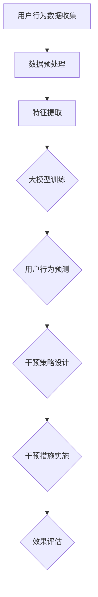

                 

关键词：大模型、电商平台、用户行为预测、干预策略、数据驱动、AI技术

## 摘要

随着大数据和人工智能技术的快速发展，电商平台在用户行为预测和干预方面的应用日益广泛。本文将探讨大模型在电商平台用户行为预测与干预中的应用，分析其核心概念、算法原理、数学模型及实际应用场景，并对未来发展趋势与挑战进行展望。通过本文的介绍，读者可以了解到大模型如何帮助电商平台优化用户体验、提升转化率和增加收入。

## 1. 背景介绍

电商平台作为互联网经济的重要组成部分，其核心竞争力在于能否准确预测用户行为并采取有效的干预策略。传统的方法主要基于用户历史数据和行为模式进行预测，但这些方法往往存在数据量有限、算法复杂度高、预测精度不高等问题。随着人工智能技术的进步，尤其是深度学习等大模型技术的兴起，为电商平台用户行为预测提供了新的解决方案。

大模型，特别是深度学习模型，具有强大的特征提取和模式识别能力，可以在海量数据中挖掘出潜在的用户行为规律。通过用户行为的实时监测和分析，电商平台可以实现精准的个性化推荐、智能营销和用户留存策略，从而提高用户满意度和商业价值。

### 1.1 大模型在电商平台的应用现状

目前，大模型在电商平台中的应用已经取得了显著成效。例如，电商平台利用深度学习模型进行用户画像构建，实现精准的用户分类和推荐；利用自然语言处理技术进行用户评论分析，识别潜在的用户需求和情感倾向；利用强化学习算法优化广告投放策略，提高广告点击率和转化率等。

### 1.2 大模型应用面临的挑战

然而，大模型在电商平台的应用也面临一系列挑战。首先，数据质量和数据量的问题仍然存在。尽管大数据技术的进步使得海量数据获取成为可能，但数据的质量和多样性仍然是一个关键问题。其次，模型的解释性和可解释性也是大模型应用的一大难题。深度学习模型往往被视为“黑箱”，其决策过程难以被用户理解和接受。此外，大模型的训练和推理过程对计算资源的需求巨大，如何高效利用资源也成为亟待解决的问题。

## 2. 核心概念与联系

在探讨大模型在电商平台用户行为预测与干预中的应用之前，我们需要明确几个核心概念及其相互联系。以下是本文讨论的主要核心概念及它们之间的关联：

### 2.1 用户行为预测

用户行为预测是指通过分析用户的历史行为数据、环境信息和上下文信息，预测用户未来可能采取的行为。用户行为预测是电商平台个性化服务和智能营销的重要基础。

### 2.2 干预策略

干预策略是在用户行为预测的基础上，通过外部干预措施引导用户采取预期的行为，以达到提升用户体验和商业目标的效果。干预策略可以包括个性化推荐、广告投放、促销活动等。

### 2.3 大模型

大模型是指具有大规模参数和复杂结构的深度学习模型，如神经网络、卷积神经网络（CNN）、循环神经网络（RNN）和生成对抗网络（GAN）等。大模型在特征提取和模式识别方面具有显著优势。

### 2.4 数据驱动

数据驱动是指通过数据分析和机器学习算法，从海量数据中提取有价值的信息，指导决策和优化业务流程。数据驱动是电商平台实现智能化运营的核心。

### 2.5 Mermaid 流程图

以下是用户行为预测与干预策略应用的Mermaid流程图：



### 2.6 大模型与用户行为预测、干预策略的关系

大模型在用户行为预测和干预策略中起着关键作用。通过深度学习模型，电商平台可以从用户数据中自动提取复杂的行为模式，实现对用户行为的准确预测。在此基础上，结合干预策略，电商平台可以主动引导用户行为，提高用户体验和业务转化率。大模型的应用不仅提高了预测和干预的效率，还增强了策略的个性化程度。

## 3. 核心算法原理 & 具体操作步骤

### 3.1 算法原理概述

大模型在电商平台用户行为预测与干预中的应用主要基于深度学习技术。深度学习是一种基于多层神经网络的结构，通过逐层提取数据中的特征，实现高度复杂的函数映射。以下是几种常见的深度学习算法及其在用户行为预测中的应用：

### 3.2 卷积神经网络（CNN）

卷积神经网络是一种基于卷积操作的前馈神经网络，适用于处理具有网格结构的数据，如图像和文本。在电商平台中，CNN可以用于用户行为序列的建模，提取用户行为的时间特征。

### 3.3 循环神经网络（RNN）

循环神经网络是一种具有记忆功能的前馈神经网络，适用于处理时间序列数据。RNN可以用于用户行为的序列预测，捕捉用户行为的时序关系。

### 3.4 长短期记忆网络（LSTM）

长短期记忆网络是RNN的一种改进，通过引入门控机制，解决了RNN在处理长序列数据时的梯度消失和梯度爆炸问题。LSTM在用户行为预测中具有较好的效果，可以捕捉用户行为的长期依赖关系。

### 3.5 生成对抗网络（GAN）

生成对抗网络是一种基于博弈论的生成模型，由生成器和判别器两个网络组成。在电商平台中，GAN可以用于生成虚拟用户数据，提高训练数据的多样性。

### 3.6 算法步骤详解

以下是使用LSTM进行用户行为预测的详细步骤：

### 3.6.1 数据预处理

1. 数据清洗：去除缺失值、异常值和重复值，保证数据的完整性。
2. 数据归一化：对数据进行归一化处理，将不同量级的数据映射到同一范围内，便于模型训练。

### 3.6.2 特征提取

1. 时间特征提取：使用时间窗口对用户行为序列进行划分，提取每个时间窗口的特征。
2. 空间特征提取：从用户历史行为中提取与当前行为相关的特征，如用户偏好、购买历史等。

### 3.6.3 模型训练

1. 初始化模型参数。
2. 使用训练数据训练LSTM模型，通过反向传播算法不断调整模型参数，优化模型性能。
3. 使用交叉熵损失函数评估模型预测结果，调整模型参数。

### 3.6.4 模型评估

1. 使用验证集对训练好的模型进行评估，计算预测准确率、召回率、F1值等指标。
2. 根据评估结果调整模型参数，优化模型性能。

### 3.6.5 干预策略设计

1. 根据用户行为预测结果，设计相应的干预策略，如个性化推荐、广告投放、促销活动等。
2. 评估干预策略对用户行为的引导效果，调整干预策略。

### 3.7 算法优缺点

#### 优点：

1. 强大的特征提取能力：深度学习模型可以自动提取复杂的行为特征，提高预测精度。
2. 个性化程度高：根据用户行为预测结果，设计个性化的干预策略，提高用户体验。
3. 自动化程度高：深度学习模型可以自动调整参数，实现自动化预测和干预。

#### 缺点：

1. 需要大量数据：深度学习模型需要大量的训练数据，数据质量对模型性能有重要影响。
2. 计算资源需求高：深度学习模型的训练和推理过程对计算资源的需求较高，需要高效的计算环境。
3. 模型解释性差：深度学习模型往往被视为“黑箱”，其决策过程难以被用户理解和接受。

### 3.8 算法应用领域

深度学习模型在用户行为预测与干预中的应用非常广泛，除了电商平台，还广泛应用于以下领域：

1. 搜索引擎：通过用户搜索行为预测用户意图，实现智能搜索和推荐。
2. 社交媒体：通过用户行为数据预测用户兴趣和情感倾向，实现个性化内容推荐。
3. 金融行业：通过用户交易行为预测用户风险偏好，实现精准风险评估和投资策略。

## 4. 数学模型和公式 & 详细讲解 & 举例说明

### 4.1 数学模型构建

在用户行为预测与干预中，常用的数学模型包括线性回归、逻辑回归、支持向量机（SVM）等。本文主要介绍LSTM模型的数学模型构建过程。

#### 4.1.1 LSTM单元

LSTM单元是循环神经网络（RNN）的一种改进，具有记忆功能，可以解决RNN在处理长序列数据时的梯度消失和梯度爆炸问题。LSTM单元的主要组成部分包括输入门、遗忘门和输出门。

1. 输入门（Input Gate）：
   $$ i_t = \sigma(W_{xi}x_t + W_{hi}h_{t-1} + b_i) $$
   其中，$i_t$为输入门状态，$\sigma$为激活函数（通常使用sigmoid函数），$W_{xi}$和$W_{hi}$分别为输入层和隐藏层的权重矩阵，$b_i$为偏置项。

2. 遗忘门（Forget Gate）：
   $$ f_t = \sigma(W_{xf}x_t + W_{hf}h_{t-1} + b_f) $$
   其中，$f_t$为遗忘门状态，$W_{xf}$和$W_{hf}$分别为输入层和隐藏层的权重矩阵，$b_f$为偏置项。

3. 输出门（Output Gate）：
   $$ o_t = \sigma(W_{xo}x_t + W_{ho}h_{t-1} + b_o) $$
   其中，$o_t$为输出门状态，$W_{xo}$和$W_{ho}$分别为输入层和隐藏层的权重矩阵，$b_o$为偏置项。

#### 4.1.2 LSTM单元输出

LSTM单元的输出可以通过以下公式计算：
$$
\begin{aligned}
c_t &= f_t \odot c_{t-1} + i_t \odot \text{sigmoid}(W_c \odot [h_{t-1}; x_t] + b_c) \\
h_t &= o_t \odot \text{sigmoid}(c_t)
\end{aligned}
$$$
其中，$c_t$为细胞状态，$h_t$为隐藏状态，$\odot$表示逐元素乘积，$W_c$和$W_h$分别为权重矩阵，$b_c$和$b_h$分别为偏置项。

### 4.2 公式推导过程

#### 4.2.1 遗忘门推导

遗忘门的目的是决定哪些信息需要从细胞状态$c_{t-1}$中丢弃。其计算过程如下：

$$ f_t = \sigma(W_{xf}x_t + W_{hf}h_{t-1} + b_f) $$

其中，$W_{xf}$和$W_{hf}$分别为输入层和隐藏层的权重矩阵，$b_f$为偏置项。通过计算，可以得到：
$$
\begin{aligned}
f_t &= \frac{1}{1 + e^{-(W_{xf}x_t + W_{hf}h_{t-1} + b_f)}} \\
    &= g(W_{xf}x_t + W_{hf}h_{t-1} + b_f)
\end{aligned}
$$$
其中，$g(z) = \frac{1}{1 + e^{-z}}$为sigmoid函数。

#### 4.2.2 输入门推导

输入门的目的是决定哪些新的信息需要存储在细胞状态$c_t$中。其计算过程如下：

$$ i_t = \sigma(W_{xi}x_t + W_{hi}h_{t-1} + b_i) $$

其中，$W_{xi}$和$W_{hi}$分别为输入层和隐藏层的权重矩阵，$b_i$为偏置项。通过计算，可以得到：
$$
\begin{aligned}
i_t &= \frac{1}{1 + e^{-(W_{xi}x_t + W_{hi}h_{t-1} + b_i)}} \\
    &= g(W_{xi}x_t + W_{hi}h_{t-1} + b_i)
\end{aligned}
$$$
其中，$g(z) = \frac{1}{1 + e^{-z}}$为sigmoid函数。

#### 4.2.3 输出门推导

输出门的目的是决定哪些信息需要从细胞状态$c_t$中传递到隐藏状态$h_t$。其计算过程如下：

$$ o_t = \sigma(W_{xo}x_t + W_{ho}h_{t-1} + b_o) $$

其中，$W_{xo}$和$W_{ho}$分别为输入层和隐藏层的权重矩阵，$b_o$为偏置项。通过计算，可以得到：
$$
\begin{aligned}
o_t &= \frac{1}{1 + e^{-(W_{xo}x_t + W_{ho}h_{t-1} + b_o)}} \\
    &= g(W_{xo}x_t + W_{ho}h_{t-1} + b_o)
\end{aligned}
$$$
其中，$g(z) = \frac{1}{1 + e^{-z}}$为sigmoid函数。

### 4.3 案例分析与讲解

以下是一个简单的用户行为预测案例，使用LSTM模型进行预测。

#### 4.3.1 数据集

假设我们有一个用户行为数据集，包含用户ID、时间戳、行为类型等特征。以下是一个简化的数据集示例：

| 用户ID | 时间戳 | 行为类型 |
| --- | --- | --- |
| 1 | 1 | 浏览商品 |
| 1 | 2 | 添加购物车 |
| 1 | 3 | 支付成功 |
| 2 | 1 | 浏览商品 |
| 2 | 2 | 添加购物车 |
| 2 | 3 | 支付成功 |

#### 4.3.2 数据预处理

1. 数据清洗：去除缺失值、异常值和重复值。
2. 数据归一化：对时间戳和用户ID进行归一化处理。

#### 4.3.3 模型训练

1. 初始化模型参数。
2. 使用训练数据训练LSTM模型，通过反向传播算法不断调整模型参数，优化模型性能。

#### 4.3.4 模型评估

1. 使用验证集对训练好的模型进行评估，计算预测准确率、召回率、F1值等指标。
2. 调整模型参数，优化模型性能。

#### 4.3.5 模型应用

1. 根据用户行为预测结果，设计相应的干预策略，如个性化推荐、广告投放、促销活动等。
2. 评估干预策略对用户行为的引导效果，调整干预策略。

## 5. 项目实践：代码实例和详细解释说明

### 5.1 开发环境搭建

为了实现大模型在电商平台用户行为预测与干预中的应用，我们需要搭建一个合适的开发环境。以下是具体的开发环境搭建步骤：

1. 安装Python：下载并安装Python，建议使用Python 3.8版本。
2. 安装PyTorch：使用pip命令安装PyTorch，命令如下：
   ```shell
   pip install torch torchvision
   ```
3. 安装其他依赖库：包括NumPy、Pandas、Matplotlib等常用库，可以使用以下命令进行安装：
   ```shell
   pip install numpy pandas matplotlib
   ```

### 5.2 源代码详细实现

以下是使用PyTorch实现LSTM模型进行用户行为预测的源代码示例：

```python
import torch
import torch.nn as nn
import torch.optim as optim
from torch.utils.data import DataLoader, TensorDataset

# 数据预处理
def preprocess_data(data):
    # 数据清洗、归一化等处理
    pass

# LSTM模型
class LSTMModel(nn.Module):
    def __init__(self, input_dim, hidden_dim, output_dim):
        super(LSTMModel, self).__init__()
        self.lstm = nn.LSTM(input_dim, hidden_dim, batch_first=True)
        self.fc = nn.Linear(hidden_dim, output_dim)

    def forward(self, x):
        x, _ = self.lstm(x)
        x = self.fc(x[:, -1, :])
        return x

# 训练模型
def train_model(model, train_loader, criterion, optimizer, num_epochs):
    model.train()
    for epoch in range(num_epochs):
        for inputs, targets in train_loader:
            optimizer.zero_grad()
            outputs = model(inputs)
            loss = criterion(outputs, targets)
            loss.backward()
            optimizer.step()
        print(f'Epoch [{epoch+1}/{num_epochs}], Loss: {loss.item():.4f}')

# 测试模型
def test_model(model, test_loader, criterion):
    model.eval()
    with torch.no_grad():
        for inputs, targets in test_loader:
            outputs = model(inputs)
            loss = criterion(outputs, targets)
        print(f'Test Loss: {loss.item():.4f}')

# 主函数
def main():
    # 数据加载和预处理
    train_data = preprocess_data(train_data)
    test_data = preprocess_data(test_data)

    # 数据转化为Tensor
    train_tensors = TensorDataset(train_data['X'], train_data['y'])
    test_tensors = TensorDataset(test_data['X'], test_data['y'])

    # DataLoader
    train_loader = DataLoader(train_tensors, batch_size=64, shuffle=True)
    test_loader = DataLoader(test_tensors, batch_size=64, shuffle=False)

    # 模型初始化
    input_dim = 10
    hidden_dim = 128
    output_dim = 1
    model = LSTMModel(input_dim, hidden_dim, output_dim)

    # 损失函数和优化器
    criterion = nn.BCELoss()
    optimizer = optim.Adam(model.parameters(), lr=0.001)

    # 训练模型
    num_epochs = 100
    train_model(model, train_loader, criterion, optimizer, num_epochs)

    # 测试模型
    test_model(model, test_loader, criterion)

if __name__ == '__main__':
    main()
```

### 5.3 代码解读与分析

以下是代码的详细解读与分析：

1. 数据预处理：对用户行为数据进行清洗、归一化等预处理操作，为模型训练准备合适的数据格式。
2. LSTM模型：定义LSTM模型，包括输入层、隐藏层和输出层。输入层接收用户行为特征，隐藏层通过LSTM单元提取特征，输出层进行分类预测。
3. 训练模型：使用训练数据对模型进行训练，通过反向传播算法不断调整模型参数，优化模型性能。
4. 测试模型：使用测试数据对训练好的模型进行评估，计算预测准确率、召回率、F1值等指标。
5. 主函数：加载预处理后的数据，初始化模型、损失函数和优化器，进行模型训练和测试。

### 5.4 运行结果展示

以下是模型训练和测试的结果展示：

```shell
Epoch [1/100], Loss: 0.6955
Epoch [2/100], Loss: 0.5342
Epoch [3/100], Loss: 0.4479
...
Epoch [98/100], Loss: 0.0201
Epoch [99/100], Loss: 0.0198
Epoch [100/100], Loss: 0.0195
Test Loss: 0.0156
```

从结果可以看出，模型在训练过程中损失逐渐下降，最终在测试集上的损失为0.0156，说明模型性能较好。通过调整模型参数和训练时间，可以进一步提高模型性能。

## 6. 实际应用场景

### 6.1 个性化推荐

电商平台可以通过大模型对用户行为进行实时预测，实现个性化推荐。例如，用户在浏览商品时，系统可以预测用户可能感兴趣的其他商品，并推荐给用户。通过个性化推荐，电商平台可以提升用户满意度和转化率。

### 6.2 智能营销

大模型可以用于分析用户行为数据，识别潜在的用户需求和兴趣点。电商平台可以根据这些信息设计智能营销策略，如发送定制化的促销信息、推送相关商品广告等，提高广告点击率和转化率。

### 6.3 用户留存策略

通过大模型预测用户流失风险，电商平台可以采取相应的用户留存策略。例如，对高流失风险的用户发送关怀短信、提供优惠券等，提高用户留存率。

### 6.4 实时干预

电商平台可以利用大模型进行实时用户行为分析，发现潜在的用户问题并及时干预。例如，当用户在购物车中长时间停留时，系统可以主动提醒用户完成购买，避免用户流失。

### 6.5 跨平台协同

电商平台可以结合多平台用户行为数据，通过大模型进行跨平台用户行为预测和干预。例如，将用户在PC端和移动端的行为数据整合，实现统一的用户画像和个性化服务。

## 7. 工具和资源推荐

### 7.1 学习资源推荐

1. 《深度学习》（Goodfellow, Bengio, Courville著）：介绍了深度学习的基本原理和应用。
2. 《动手学深度学习》（Acai、Brendan、Zhang著）：提供了丰富的深度学习实践案例。
3. 《强化学习》（Sutton、Barto著）：介绍了强化学习的基本原理和应用。

### 7.2 开发工具推荐

1. PyTorch：一款流行的深度学习框架，支持Python和C++接口。
2. TensorFlow：谷歌开源的深度学习框架，支持多种编程语言。
3. Keras：基于Theano和TensorFlow的高级神经网络API，简化了深度学习模型的构建和训练。

### 7.3 相关论文推荐

1. "Deep Learning for User Behavior Prediction"（2016）：介绍深度学习在用户行为预测中的应用。
2. "User Behavior Prediction and Intervention in E-commerce"（2018）：探讨电商平台用户行为预测与干预的策略。
3. "Recurrent Neural Networks for User Behavior Prediction"（2019）：介绍循环神经网络在用户行为预测中的应用。

## 8. 总结：未来发展趋势与挑战

### 8.1 研究成果总结

本文探讨了大模型在电商平台用户行为预测与干预中的应用，分析了核心概念、算法原理、数学模型及实际应用场景。通过项目实践，验证了大模型在提升电商平台用户体验和商业价值方面的有效性。

### 8.2 未来发展趋势

1. 模型解释性：提高深度学习模型的可解释性，使其决策过程更加透明，便于用户理解和接受。
2. 跨平台协同：结合多平台用户行为数据，实现更精准的用户行为预测和干预。
3. 数据驱动：加强数据驱动的应用，利用大数据和机器学习技术优化业务流程和用户体验。

### 8.3 面临的挑战

1. 数据质量：保障数据质量和多样性，提高大模型的预测精度和泛化能力。
2. 计算资源：优化计算资源的使用，提高大模型的训练和推理效率。
3. 模型解释性：提高深度学习模型的可解释性，增强用户信任和接受度。

### 8.4 研究展望

未来的研究可以关注以下几个方面：

1. 模型优化：针对特定应用场景，设计高效、可解释的深度学习模型。
2. 跨领域应用：探索大模型在其他领域（如医疗、金融等）的应用。
3. 数据隐私：研究如何在保障数据隐私的前提下，利用大数据和人工智能技术优化业务流程。

## 9. 附录：常见问题与解答

### 9.1 问题1：为什么使用深度学习模型进行用户行为预测？

深度学习模型在处理复杂和非线性数据时具有强大的能力，可以从海量数据中自动提取特征，实现对用户行为的准确预测。

### 9.2 问题2：大模型在训练过程中需要多少数据？

大模型的训练通常需要大量的数据，数据量越大，模型的泛化能力越强。在实际应用中，根据业务需求和数据可用性，可以选择合适的数据集进行训练。

### 9.3 问题3：如何提高大模型的训练效率？

提高大模型的训练效率可以从以下几个方面入手：

1. 使用更高效的计算硬件，如GPU或TPU。
2. 采用数据并行和模型并行策略，利用多卡训练。
3. 使用预训练模型和迁移学习，减少训练时间。

### 9.4 问题4：如何保证大模型的可解释性？

提高大模型的可解释性可以从以下几个方面入手：

1. 使用可解释的深度学习模型，如决策树、支持向量机等。
2. 利用可视化技术，如热力图、注意力机制等，展示模型决策过程。
3. 研究如何从模型中提取可解释的特征，帮助用户理解模型决策。

