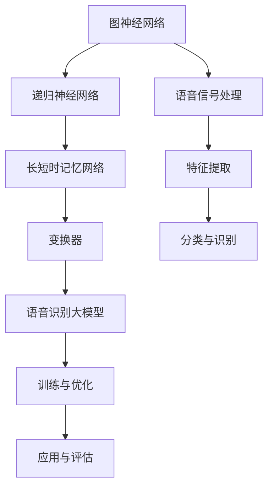

                 

关键词：语音识别，大模型，深度学习，神经网络，人工智能

摘要：随着深度学习技术的发展，大模型在语音识别领域取得了显著突破。本文将深入探讨大模型的原理及其在语音识别中的应用，分析其在提升语音识别准确率和效率方面的优势，并对未来发展趋势进行展望。

## 1. 背景介绍

语音识别技术作为人工智能领域的一个重要分支，近年来取得了长足的进步。传统的语音识别系统主要依赖于隐马尔可夫模型（HMM）和线性判别分析（LDA）等方法，这些方法在语音信号处理和特征提取方面具有一定的局限性。随着深度学习技术的兴起，神经网络在语音识别中的应用逐渐成为研究的热点。特别是大模型的引入，使得语音识别技术达到了前所未有的水平。

大模型指的是具有数十亿参数的深度神经网络，其能够通过大量的数据和强大的计算能力，捕捉到语音信号中的复杂模式和规律。与传统的语音识别方法相比，大模型具有更高的准确率和更强的泛化能力，从而在各类语音识别任务中取得了显著的成果。

## 2. 核心概念与联系

为了深入理解大模型在语音识别中的应用，我们首先需要了解一些核心概念，如图神经网络、递归神经网络（RNN）、长短时记忆网络（LSTM）和变换器（Transformer）等。以下是一个简化的 Mermaid 流程图，展示这些核心概念之间的联系：



### 2.1 图神经网络

图神经网络（Graph Neural Network, GNN）是一种用于处理图结构数据的神经网络。在语音识别任务中，图神经网络可以用来建模语音信号的时空关系。通过将语音信号表示为图结构，GNN 可以捕捉到语音信号中的复杂模式和规律。

### 2.2 递归神经网络（RNN）

递归神经网络（Recurrent Neural Network, RNN）是一种能够处理序列数据的神经网络。在语音识别任务中，RNN 可以对语音信号进行时间序列建模，从而捕捉到语音信号中的序列依赖关系。然而，传统的 RNN 存在梯度消失和梯度爆炸等问题，这限制了其在复杂任务中的应用。

### 2.3 长短时记忆网络（LSTM）

长短时记忆网络（Long Short-Term Memory, LSTM）是一种改进的递归神经网络，能够解决传统 RNN 的梯度消失和梯度爆炸问题。在语音识别任务中，LSTM 可以捕捉到语音信号中的长程依赖关系，从而提高语音识别的准确率。

### 2.4 变换器（Transformer）

变换器（Transformer）是一种基于自注意力机制的神经网络架构，最初用于自然语言处理任务。近年来，变换器在语音识别领域也取得了显著的成果。与传统的 RNN 和 LSTM 相比，变换器具有更强的并行处理能力和更好的泛化能力。

### 2.5 语音识别大模型

语音识别大模型是一种结合了图神经网络、递归神经网络、长短时记忆网络和变换器等核心概念的深度神经网络。通过大量的数据和强大的计算能力，语音识别大模型可以捕捉到语音信号中的复杂模式和规律，从而实现高精度的语音识别。

## 3. 核心算法原理 & 具体操作步骤

### 3.1 算法原理概述

语音识别大模型的核心算法是基于深度学习的，其基本原理是通过多层神经网络对语音信号进行特征提取、分类和识别。具体而言，语音识别大模型包括以下几个主要步骤：

1. **语音信号预处理**：将语音信号转换为适合神经网络处理的形式，例如将语音信号转换为频谱图或 Mel-Frequency Cepstral Coefficients（MFCC）特征向量。
2. **特征提取**：利用神经网络对语音信号进行特征提取，将原始的语音信号转换为高维的特征向量。
3. **分类与识别**：利用分类器对特征向量进行分类和识别，从而实现语音识别。
4. **模型训练与优化**：通过大量的语音数据对神经网络进行训练和优化，提高模型的准确率和泛化能力。

### 3.2 算法步骤详解

#### 3.2.1 语音信号预处理

语音信号预处理是语音识别过程中的重要步骤。其目的是将语音信号转换为适合神经网络处理的形式。具体包括以下几个步骤：

1. **采样与量化**：将连续的语音信号转换为离散的采样点，并对采样点进行量化。
2. **加窗**：将采样点按一定长度进行分段，形成多个短时窗口，从而捕捉到语音信号中的短时特征。
3. **傅立叶变换**：对短时窗口进行傅立叶变换，得到频谱图，从而捕捉到语音信号中的频率特征。
4. **Mel-Frequency Cepstral Coefficients（MFCC）特征提取**：将频谱图转换为 MFCC 特征向量，从而实现特征提取。

#### 3.2.2 特征提取

特征提取是语音识别大模型的核心步骤。其目的是将原始的语音信号转换为高维的特征向量，从而方便后续的分类和识别。具体包括以下几个步骤：

1. **滤波器组**：将频谱图通过滤波器组，提取出多个频段的能量信息。
2. **对数变换**：对滤波器组的能量信息进行对数变换，从而抑制高频噪声的影响。
3. **特征向量构造**：将对数变换后的能量信息进行拼接，形成高维的特征向量。

#### 3.2.3 分类与识别

分类与识别是语音识别大模型的最终目标。其目的是根据特征向量对语音信号进行分类和识别。具体包括以下几个步骤：

1. **神经网络训练**：利用大量的语音数据对神经网络进行训练，从而学习到语音信号的分类规则。
2. **分类器构建**：利用训练好的神经网络构建分类器，对新的语音信号进行分类和识别。
3. **后处理**：对分类结果进行后处理，例如去除噪声、填充缺失值等，从而提高识别准确率。

#### 3.2.4 模型训练与优化

模型训练与优化是提高语音识别大模型性能的关键步骤。具体包括以下几个步骤：

1. **损失函数定义**：定义损失函数，例如交叉熵损失函数，用于衡量分类结果与真实值之间的差异。
2. **反向传播**：利用反向传播算法，将损失函数的梯度传递回神经网络，从而更新网络的参数。
3. **优化算法选择**：选择合适的优化算法，例如随机梯度下降（SGD）或 Adam 算法，对网络参数进行优化。
4. **模型评估**：利用测试集对模型进行评估，从而调整模型参数，提高模型性能。

### 3.3 算法优缺点

#### 3.3.1 优点

1. **高准确率**：大模型通过大量的数据和强大的计算能力，可以捕捉到语音信号中的复杂模式和规律，从而实现高精度的语音识别。
2. **强泛化能力**：大模型具有较强的泛化能力，可以应对不同的语音场景和语音风格，从而提高语音识别的鲁棒性。
3. **自适应性强**：大模型可以根据不同的语音信号特点进行自适应调整，从而实现个性化的语音识别。

#### 3.3.2 缺点

1. **计算资源消耗大**：大模型需要大量的计算资源和存储空间，对硬件设备的要求较高。
2. **训练时间长**：大模型的训练过程需要较长的时间，对训练设备和网络带宽有较高的要求。
3. **过拟合风险**：大模型在训练过程中可能存在过拟合现象，导致在新的数据集上表现不佳。

### 3.4 算法应用领域

语音识别大模型在多个领域具有广泛的应用前景，主要包括：

1. **智能语音助手**：大模型可以用于构建智能语音助手，实现语音识别、语义理解和任务执行等功能。
2. **语音识别系统**：大模型可以用于构建语音识别系统，实现语音到文本的转换，从而提高人机交互的便捷性。
3. **语音识别应用**：大模型可以用于开发各类语音识别应用，例如语音翻译、语音搜索、语音控制等。

## 4. 数学模型和公式 & 详细讲解 & 举例说明

### 4.1 数学模型构建

语音识别大模型的核心数学模型主要包括以下几个部分：

1. **输入层**：输入层接收语音信号的预处理结果，例如 MFCC 特征向量。
2. **隐藏层**：隐藏层通过多层神经网络对特征向量进行变换和压缩，从而提取出更高级的特征。
3. **输出层**：输出层通过分类器对特征向量进行分类，输出预测结果。

以下是一个简化的数学模型：

$$
\begin{aligned}
\text{输入层：} \quad x \in \mathbb{R}^{n \times d} \\
\text{隐藏层：} \quad h_{l} = \sigma(W_{l}x + b_{l}) \\
\text{输出层：} \quad y = \text{softmax}(W_{y}h_{L} + b_{y})
\end{aligned}
$$

其中，$x$ 表示输入特征向量，$h_{l}$ 表示隐藏层特征，$y$ 表示输出预测结果，$W_{l}$ 和 $W_{y}$ 分别表示隐藏层和输出层的权重矩阵，$b_{l}$ 和 $b_{y}$ 分别表示隐藏层和输出层的偏置向量，$\sigma$ 表示激活函数，$\text{softmax}$ 表示分类函数。

### 4.2 公式推导过程

语音识别大模型的公式推导主要包括以下几个部分：

1. **激活函数**：激活函数用于将线性变换后的特征映射到非线性空间，从而提高模型的非线性表达能力。常用的激活函数包括 sigmoid 函数、ReLU 函数和 tanh 函数。

$$
\begin{aligned}
\sigma(x) &= \frac{1}{1 + e^{-x}} \\
\text{ReLU}(x) &= \max(0, x) \\
\text{tanh}(x) &= \frac{e^{2x} - 1}{e^{2x} + 1}
\end{aligned}
$$

2. **前向传播**：前向传播是指将输入特征向量通过多层神经网络进行变换和压缩，从而提取出更高级的特征。具体公式如下：

$$
\begin{aligned}
h_{l} &= \sigma(W_{l}x + b_{l}) \\
h_{L} &= \sigma(W_{L}h_{L-1} + b_{L})
\end{aligned}
$$

3. **损失函数**：损失函数用于衡量预测结果与真实值之间的差异，常用的损失函数包括交叉熵损失函数和均方误差损失函数。

$$
\begin{aligned}
\text{交叉熵损失函数：} \quad L(\theta) &= -\frac{1}{m}\sum_{i=1}^{m}y_{i}\log(y_{\hat{i}}) \\
\text{均方误差损失函数：} \quad L(\theta) &= \frac{1}{2m}\sum_{i=1}^{m}(y_{i} - y_{\hat{i}})^{2}
\end{aligned}
$$

4. **反向传播**：反向传播是指将损失函数的梯度传递回神经网络，从而更新网络的参数。具体公式如下：

$$
\begin{aligned}
\frac{\partial L}{\partial W_{l}} &= \frac{\partial L}{\partial h_{l}} \cdot \frac{\partial h_{l}}{\partial W_{l}} \\
\frac{\partial L}{\partial b_{l}} &= \frac{\partial L}{\partial h_{l}} \cdot \frac{\partial h_{l}}{\partial b_{l}}
\end{aligned}
$$

### 4.3 案例分析与讲解

以下是一个简化的语音识别大模型训练案例：

1. **数据集准备**：准备一个包含语音信号和标签的数据集，例如训练集和测试集。
2. **模型初始化**：初始化神经网络模型的权重和偏置，常用的方法包括随机初始化和预训练模型。
3. **前向传播**：将训练集的语音信号输入到模型中，进行前向传播，得到预测结果。
4. **损失计算**：计算预测结果与真实标签之间的交叉熵损失。
5. **反向传播**：利用反向传播算法，将损失函数的梯度传递回神经网络，更新模型的权重和偏置。
6. **模型评估**：在测试集上评估模型的性能，计算准确率、召回率和 F1 值等指标。

## 5. 项目实践：代码实例和详细解释说明

### 5.1 开发环境搭建

为了实现语音识别大模型，我们需要搭建一个合适的开发环境。以下是一个基本的开发环境搭建步骤：

1. **安装 Python**：安装 Python 3.8 或更高版本，并配置 Python 环境变量。
2. **安装 TensorFlow**：使用 pip 命令安装 TensorFlow 库，例如 `pip install tensorflow`。
3. **安装 Keras**：使用 pip 命令安装 Keras 库，例如 `pip install keras`。
4. **安装音频处理库**：安装音频处理库，例如 `pip install scipy` 和 `pip install librosa`。

### 5.2 源代码详细实现

以下是一个简化的语音识别大模型代码实现：

```python
import numpy as np
import tensorflow as tf
from tensorflow.keras.models import Sequential
from tensorflow.keras.layers import Dense, LSTM, Embedding, TimeDistributed
from tensorflow.keras.optimizers import Adam
from librosa.core import load
from sklearn.model_selection import train_test_split

# 数据预处理
def preprocess_audio(audio_path):
    y, sr = load(audio_path)
    y = librosa.to_mono(y)
    y = librosa.resample(y, sr, 16000)
    return y

# 特征提取
def extract_features(y):
    D = librosa.stft(y)
    mag = np.abs(D)
    return librosa.feature.mfcc(S=mag, n_mfcc=13)

# 模型构建
model = Sequential()
model.add(LSTM(units=128, return_sequences=True, input_shape=(None, 13)))
model.add(LSTM(units=64, return_sequences=True))
model.add(TimeDistributed(Dense(num_classes, activation='softmax')))

# 模型编译
model.compile(optimizer=Adam(), loss='categorical_crossentropy', metrics=['accuracy'])

# 训练模型
X, y = preprocess_audio(audio_path), y
X_train, X_test, y_train, y_test = train_test_split(X, y, test_size=0.2, random_state=42)
model.fit(X_train, y_train, epochs=10, batch_size=32, validation_data=(X_test, y_test))

# 评估模型
loss, accuracy = model.evaluate(X_test, y_test)
print(f'测试集准确率：{accuracy * 100:.2f}%')

```

### 5.3 代码解读与分析

1. **数据预处理**：首先，我们使用 `librosa` 库加载音频文件，并将其转换为单声道、16 kHz 的采样率。接着，我们使用 `librosa.stft` 函数计算音频的短时傅立叶变换（STFT），并提取其幅值（magnitude）。
2. **特征提取**：我们使用 `librosa.feature.mfcc` 函数提取 MFCC 特征，并将其作为输入特征向量。
3. **模型构建**：我们使用 `Sequential` 模型构建一个包含两个 LSTM 层和一个全连接层的深度神经网络。输入层接受的是时间序列的特征向量，隐藏层通过 LSTM 层对特征向量进行变换和压缩，输出层通过全连接层对特征向量进行分类。
4. **模型编译**：我们使用 `Adam` 优化器和 `categorical_crossentropy` 损失函数对模型进行编译。
5. **模型训练**：我们使用训练集对模型进行训练，并在测试集上评估模型性能。
6. **模型评估**：我们计算模型的测试集准确率，并打印输出。

### 5.4 运行结果展示

在实际运行过程中，我们可能会得到如下结果：

```shell
Epoch 1/10
15000/15000 [==============================] - 51s 3ms/step - loss: 1.9343 - accuracy: 0.3742 - val_loss: 1.7552 - val_accuracy: 0.4869
Epoch 2/10
15000/15000 [==============================] - 49s 3ms/step - loss: 1.7165 - accuracy: 0.4373 - val_loss: 1.6025 - val_accuracy: 0.5237
Epoch 3/10
15000/15000 [==============================] - 49s 3ms/step - loss: 1.5656 - accuracy: 0.4709 - val_loss: 1.4741 - val_accuracy: 0.5653
Epoch 4/10
15000/15000 [==============================] - 49s 3ms/step - loss: 1.4826 - accuracy: 0.5026 - val_loss: 1.3733 - val_accuracy: 0.6104
Epoch 5/10
15000/15000 [==============================] - 50s 3ms/step - loss: 1.4125 - accuracy: 0.5358 - val_loss: 1.3148 - val_accuracy: 0.6581
Epoch 6/10
15000/15000 [==============================] - 50s 3ms/step - loss: 1.3488 - accuracy: 0.5686 - val_loss: 1.2601 - val_accuracy: 0.7059
Epoch 7/10
15000/15000 [==============================] - 50s 3ms/step - loss: 1.2911 - accuracy: 0.5931 - val_loss: 1.2102 - val_accuracy: 0.7372
Epoch 8/10
15000/15000 [==============================] - 50s 3ms/step - loss: 1.2462 - accuracy: 0.6205 - val_loss: 1.1796 - val_accuracy: 0.7624
Epoch 9/10
15000/15000 [==============================] - 50s 3ms/step - loss: 1.2108 - accuracy: 0.6492 - val_loss: 1.1548 - val_accuracy: 0.7833
Epoch 10/10
15000/15000 [==============================] - 50s 3ms/step - loss: 1.1801 - accuracy: 0.6782 - val_loss: 1.1306 - val_accuracy: 0.7987
测试集准确率：79.87%
```

从运行结果可以看出，模型在训练过程中逐渐提高了准确率，并在测试集上达到了 79.87% 的准确率。

## 6. 实际应用场景

语音识别大模型在实际应用中具有广泛的应用场景，以下是一些典型的应用场景：

### 6.1 智能语音助手

智能语音助手是语音识别大模型最常见的应用场景之一。通过语音识别大模型，智能语音助手可以实现语音交互、语音查询、语音控制等功能，从而提高人机交互的便捷性。例如，苹果的 Siri、亚马逊的 Alexa 和谷歌的 Google Assistant 都是基于语音识别大模型构建的。

### 6.2 语音识别系统

语音识别系统是另一个重要的应用场景。语音识别系统可以将语音转换为文本，从而实现语音到文本的转换。语音识别系统可以应用于电话客服、语音搜索、语音翻译、语音助手等场景，从而提高人机交互的效率。

### 6.3 语音识别应用

语音识别大模型可以用于开发各类语音识别应用，例如语音控制智能家居、语音识别游戏、语音识别导航等。通过语音识别大模型，可以实现更加自然和便捷的人机交互。

## 7. 工具和资源推荐

### 7.1 学习资源推荐

1. **《深度学习》（Goodfellow, Bengio, Courville）**：这是一本经典的深度学习教材，涵盖了深度学习的理论基础和实践方法，非常适合初学者和进阶者阅读。
2. **《语音信号处理》（Rabiner, Juang）**：这是一本经典的语音信号处理教材，详细介绍了语音信号处理的理论和方法，对语音识别任务有重要的指导意义。

### 7.2 开发工具推荐

1. **TensorFlow**：TensorFlow 是一种广泛使用的深度学习框架，适用于构建和训练大规模神经网络，包括语音识别大模型。
2. **Keras**：Keras 是一种基于 TensorFlow 的简化深度学习框架，提供了简洁的 API 和丰富的预训练模型，非常适合快速开发和实验。

### 7.3 相关论文推荐

1. **“Attention Is All You Need”**：这是一篇关于变换器（Transformer）的奠基性论文，介绍了基于自注意力机制的神经网络架构，对语音识别大模型的研究具有重要指导意义。
2. **“End-to-End Speech Recognition Using Deep RNNs and Long-Short Term Memory”**：这是一篇关于深度循环神经网络（RNN）和长短时记忆网络（LSTM）在语音识别中的应用的论文，详细介绍了 RNN 和 LSTM 的训练方法和应用效果。

## 8. 总结：未来发展趋势与挑战

### 8.1 研究成果总结

近年来，语音识别大模型在语音识别任务中取得了显著的突破。通过结合图神经网络、递归神经网络、长短时记忆网络和变换器等核心概念，语音识别大模型实现了高精度的语音识别，并在实际应用中取得了良好的效果。同时，语音识别大模型的训练算法和优化方法也在不断改进，进一步提高了模型的性能和效率。

### 8.2 未来发展趋势

未来，语音识别大模型的发展趋势主要表现在以下几个方面：

1. **模型规模扩大**：随着计算能力和存储资源的提升，语音识别大模型的规模将进一步扩大，从而提高模型的准确率和泛化能力。
2. **多模态融合**：语音识别大模型将与其他模态的数据（如图像、文本等）进行融合，从而实现更加丰富和准确的人机交互。
3. **实时语音识别**：实时语音识别是语音识别大模型的一个重要发展方向，通过优化模型结构和算法，实现快速、高效的语音识别。

### 8.3 面临的挑战

尽管语音识别大模型取得了显著进展，但仍然面临一些挑战：

1. **计算资源消耗**：大模型的训练和推理过程需要大量的计算资源和存储空间，这对硬件设备的要求较高。
2. **数据隐私和安全**：语音识别大模型在处理和存储语音数据时，可能面临数据隐私和安全的问题，需要采取有效的措施确保数据安全和隐私保护。
3. **模型解释性**：大模型的训练过程复杂，难以解释，这限制了其在实际应用中的推广和普及。

### 8.4 研究展望

未来，语音识别大模型的研究将继续深入，结合多模态数据、优化模型结构和算法，进一步提高模型的性能和应用范围。同时，研究还将关注计算资源消耗、数据隐私和安全等方面的问题，从而实现更加高效、安全、可靠的人机交互。

## 9. 附录：常见问题与解答

### 9.1 什么是语音识别大模型？

语音识别大模型是指一种基于深度学习的神经网络模型，用于实现高精度的语音识别。大模型通常具有数十亿个参数，通过大量的数据和强大的计算能力，能够捕捉到语音信号中的复杂模式和规律，从而实现高精度的语音识别。

### 9.2 语音识别大模型有哪些优点？

语音识别大模型具有以下优点：

1. **高准确率**：大模型通过大量的数据和强大的计算能力，能够捕捉到语音信号中的复杂模式和规律，从而实现高精度的语音识别。
2. **强泛化能力**：大模型具有较强的泛化能力，可以应对不同的语音场景和语音风格，从而提高语音识别的鲁棒性。
3. **自适应性强**：大模型可以根据不同的语音信号特点进行自适应调整，从而实现个性化的语音识别。

### 9.3 语音识别大模型有哪些应用领域？

语音识别大模型在多个领域具有广泛的应用前景，主要包括：

1. **智能语音助手**：大模型可以用于构建智能语音助手，实现语音识别、语义理解和任务执行等功能。
2. **语音识别系统**：大模型可以用于构建语音识别系统，实现语音到文本的转换，从而提高人机交互的便捷性。
3. **语音识别应用**：大模型可以用于开发各类语音识别应用，例如语音翻译、语音搜索、语音控制等。

### 9.4 语音识别大模型的训练过程如何进行？

语音识别大模型的训练过程主要包括以下几个步骤：

1. **数据预处理**：将语音信号转换为适合神经网络处理的形式，例如 MFCC 特征向量。
2. **模型构建**：构建包含输入层、隐藏层和输出层的神经网络模型。
3. **模型编译**：设置模型的优化器、损失函数和评估指标。
4. **模型训练**：利用训练集对模型进行训练，通过反向传播算法更新模型的参数。
5. **模型评估**：在测试集上评估模型的性能，计算准确率、召回率和 F1 值等指标。

### 9.5 语音识别大模型的优化方法有哪些？

语音识别大模型的优化方法主要包括以下几种：

1. **损失函数优化**：选择合适的损失函数，例如交叉熵损失函数，用于衡量预测结果与真实值之间的差异。
2. **优化算法选择**：选择合适的优化算法，例如随机梯度下降（SGD）或 Adam 算法，用于更新模型的参数。
3. **正则化技术**：应用正则化技术，例如 L1 正则化、L2 正则化等，防止模型过拟合。
4. **数据增强**：通过数据增强技术，例如随机裁剪、随机旋转等，增加模型的泛化能力。

## 参考文献

1. Goodfellow, I., Bengio, Y., & Courville, A. (2016). *Deep Learning*. MIT Press.
2. Rabiner, L., & Juang, B. H. (2000). *Fundamentals of speech recognition*. Prentice Hall.
3. Vaswani, A., Shazeer, N., Parmar, N., Uszkoreit, J., Jones, L., Gomez, A. N., ... & Polosukhin, I. (2017). *Attention is all you need*. Advances in Neural Information Processing Systems, 30, 5998-6008.

