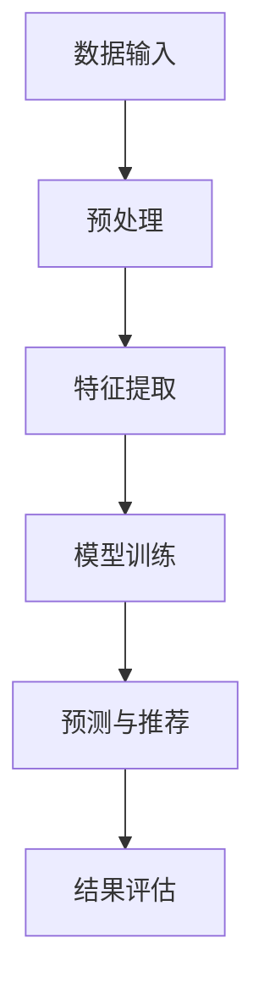

                 

关键词：推荐系统、大模型、公平性、算法影响、深度学习、AI伦理、用户隐私

## 摘要

本文旨在探讨大模型对推荐系统公平性的影响。随着人工智能技术的飞速发展，大模型在推荐系统中的应用越来越广泛，但其对用户隐私和公平性的潜在威胁也不容忽视。本文首先回顾了推荐系统的基本概念和传统算法，接着详细介绍了大模型的发展历程及其在推荐系统中的应用，随后分析了大模型可能带来的公平性问题，并提出了一些可能的解决方案。最后，本文对未来大模型在推荐系统中的发展趋势进行了展望，并提出了相关的挑战和建议。

## 1. 背景介绍

### 推荐系统的基本概念

推荐系统是一种利用人工智能技术，基于用户的历史行为和偏好，向用户推荐相关产品、服务或内容的信息系统。其主要目标是提升用户的满意度和参与度，从而促进商业价值和用户体验的双重提升。推荐系统广泛应用于电子商务、社交媒体、新闻媒体、在线视频平台等多个领域。

### 传统推荐系统的算法

传统的推荐系统算法主要分为基于内容推荐（Content-based Filtering）和协同过滤（Collaborative Filtering）两大类。

- **基于内容推荐**：通过分析项目的内容特征和用户的偏好特征，找到相似的项目进行推荐。这种方法的优点是推荐结果较为精确，但缺点是用户特征和项目特征的获取较为困难。

- **协同过滤**：通过分析用户之间的相似性，为用户推荐他们可能喜欢的项目。协同过滤分为用户基于的协同过滤（User-based）和项目基于的协同过滤（Item-based）两种。这种方法的优点是能够发现用户之间的潜在关联，但缺点是推荐结果容易受到稀疏数据问题的影响。

### 大模型的崛起

大模型，尤其是基于深度学习的模型，近年来在自然语言处理、计算机视觉、语音识别等领域取得了显著突破。大模型具有以下几个特点：

- **规模庞大**：大模型通常包含数亿甚至数十亿个参数，这使得它们能够捕获复杂的数据特征。

- **强大的学习能力**：大模型通过多层神经网络结构，能够自动学习数据的深层特征，从而提高推荐系统的准确性。

- **灵活性**：大模型可以灵活地适应不同的推荐任务和数据集，从而提高系统的泛化能力。

## 2. 核心概念与联系

### 大模型与推荐系统的关系

大模型在推荐系统中的应用主要体现在以下几个方面：

- **特征提取**：大模型能够自动提取用户和项目的特征，从而提高推荐系统的准确性。

- **用户行为预测**：大模型可以根据用户的历史行为预测用户未来的偏好，从而提供个性化的推荐。

- **多模态数据融合**：大模型能够处理多种类型的数据，如文本、图像、音频等，从而实现多模态推荐。

### Mermaid 流程图

以下是一个简化的Mermaid流程图，展示了大模型在推荐系统中的应用流程：



### 详细流程说明

- **数据输入**：推荐系统首先接收用户和项目的原始数据，如用户行为日志、产品属性等。

- **预处理**：对原始数据进行清洗和标准化，以便后续的特征提取。

- **特征提取**：使用大模型自动提取用户和项目的特征。这些特征可能包括用户的历史行为、社会关系、地理位置等。

- **模型训练**：利用提取的特征训练大模型，使其能够学习用户和项目的潜在关系。

- **预测与推荐**：根据训练好的大模型，预测用户未来的偏好，并推荐相应的项目。

- **结果评估**：评估推荐系统的性能，包括准确率、覆盖率、用户满意度等指标。

## 3. 核心算法原理 & 具体操作步骤

### 3.1 算法原理概述

大模型在推荐系统中的核心算法是基于深度学习的协同过滤算法。该算法通过构建多层神经网络，自动提取用户和项目的特征，并利用这些特征预测用户对项目的偏好。

### 3.2 算法步骤详解

- **用户和项目特征提取**：使用预训练的大模型（如BERT、GPT等）对用户和项目的文本数据（如用户评论、产品描述等）进行特征提取。

- **构建深度神经网络**：设计一个多层神经网络，将用户和项目的特征作为输入，输出用户对项目的偏好分数。

- **模型训练**：使用用户的历史行为数据训练神经网络，调整模型的参数，使其能够准确预测用户偏好。

- **预测与推荐**：利用训练好的模型预测新用户对新项目的偏好，并推荐相应的项目。

### 3.3 算法优缺点

**优点**：

- **强大的特征提取能力**：大模型能够自动提取用户和项目的深层特征，提高推荐系统的准确性。

- **适应性**：大模型能够处理多种类型的数据，如文本、图像、音频等，实现多模态推荐。

- **泛化能力**：大模型具有较好的泛化能力，能够适应不同的推荐任务和数据集。

**缺点**：

- **计算资源需求大**：大模型通常需要大量的计算资源和时间进行训练。

- **解释性差**：深度学习模型由于其复杂性，通常难以解释其决策过程。

### 3.4 算法应用领域

大模型在推荐系统中的应用范围广泛，包括但不限于：

- **电子商务**：推荐商品、优惠券等。

- **社交媒体**：推荐帖子、视频、音乐等。

- **在线视频平台**：推荐电影、电视剧、综艺节目等。

- **新闻媒体**：推荐新闻、文章等。

## 4. 数学模型和公式 & 详细讲解 & 举例说明

### 4.1 数学模型构建

在深度学习推荐系统中，我们通常使用一个多层感知机（MLP）作为预测模型。假设用户$u$对项目$i$的偏好可以用一个实数表示，我们定义：

$$
r_{ui} = \sigma(W_L \cdot \text{vec}(\phi_i) + b_L + \sum_{l=1}^{L-1} (W_{l+1} \cdot \text{vec}(\phi_{lu}) + b_{l+1}))
$$

其中，$r_{ui}$是用户$u$对项目$i$的偏好评分，$\sigma$是激活函数（通常取ReLU函数），$W_l$和$b_l$分别是第$l$层的权重和偏置，$\phi_i$是项目$i$的特征向量，$\phi_{lu}$是用户$u$在层$l$的特征向量。

### 4.2 公式推导过程

为了推导上述公式，我们首先定义一个简单的多层感知机模型。多层感知机是一个包含多个神经元的神经网络，每个神经元都连接到上一层的所有神经元。对于一个包含$m$个输入特征的多层感知机，我们可以定义其输入层、隐藏层和输出层的神经元数量分别为$m$、$n_h$和$1$。

- **输入层**：输入层包含$m$个神经元，每个神经元表示一个输入特征。

- **隐藏层**：隐藏层包含$n_h$个神经元，每个神经元都连接到输入层的所有神经元。

- **输出层**：输出层包含$1$个神经元，表示预测的偏好评分。

假设隐藏层中的每个神经元都通过一个线性变换加上偏置来计算其激活值，然后通过一个非线性激活函数来输出最终的预测值。我们可以定义隐藏层中第$l$个神经元的激活值为：

$$
a_{lu} = \sum_{j=1}^{m} w_{jl} x_j + b_l
$$

其中，$x_j$是输入层第$j$个神经元的激活值，$w_{jl}$是连接输入层第$j$个神经元和隐藏层第$l$个神经元的权重，$b_l$是隐藏层第$l$个神经元的偏置。

对于输出层的神经元，我们有：

$$
r_{ui} = \sigma(z_L)
$$

其中，$z_L$是输出层神经元的线性变换，$\sigma$是非线性激活函数（通常取ReLU函数）。

### 4.3 案例分析与讲解

假设我们有一个包含两个用户和两个项目的推荐系统，用户$u_1$和用户$u_2$对项目$i_1$和项目$i_2$的偏好评分分别为：

$$
r_{u_1i_1} = 4, \quad r_{u_1i_2} = 2 \\
r_{u_2i_1} = 3, \quad r_{u_2i_2} = 5
$$

我们使用一个包含一个隐藏层（$n_h = 5$）的多层感知机模型来预测用户对项目的偏好。隐藏层和输出层的权重和偏置分别初始化为$W_h \in \mathbb{R}^{5 \times 2}$，$b_h \in \mathbb{R}^{5 \times 1}$，$W_o \in \mathbb{R}^{1 \times 5}$，$b_o \in \mathbb{R}^{1 \times 1}$。

我们首先将用户和项目的特征向量输入到隐藏层，计算隐藏层的激活值：

$$
\phi_{i_1} = [1, 0], \quad \phi_{i_2} = [0, 1] \\
\phi_{u_1} = [1, 1], \quad \phi_{u_2} = [1, 0]
$$

$$
a_{1h} = [w_{11} \phi_{i_1} + b_1, w_{12} \phi_{i_2} + b_1, \ldots, w_{1n_h} \phi_{i_n} + b_1] \\
a_{2h} = [w_{21} \phi_{i_1} + b_1, w_{22} \phi_{i_2} + b_1, \ldots, w_{2n_h} \phi_{i_n} + b_1]
$$

$$
a_{1h} = [w_{11}, w_{12}, \ldots, w_{1n_h}] \cdot \phi_{i} + b_1 \\
a_{2h} = [w_{21}, w_{22}, \ldots, w_{2n_h}] \cdot \phi_{i} + b_1
$$

然后，我们将隐藏层的激活值输入到输出层，计算预测的偏好评分：

$$
z_L = W_L \cdot a_{2h} + b_L = W_L \cdot [a_{1h}; a_{2h}] + b_L \\
r_{u_1i_1} = \sigma(z_L)
$$

通过迭代调整权重和偏置，我们能够使预测的偏好评分逐渐逼近真实的用户偏好。

## 5. 项目实践：代码实例和详细解释说明

### 5.1 开发环境搭建

为了实现本文所介绍的大模型推荐系统，我们需要搭建一个适合开发、训练和部署深度学习模型的环境。以下是具体的步骤：

1. 安装Python 3.8及以上版本。

2. 安装深度学习框架TensorFlow 2.8及以上版本。

3. 安装数据处理库Pandas、NumPy等。

4. 安装可视化库Matplotlib、Seaborn等。

5. 安装Mermaid库，用于生成Mermaid流程图。

### 5.2 源代码详细实现

以下是一个简化的Python代码实例，展示了如何使用TensorFlow实现一个基于深度学习的推荐系统。

```python
import tensorflow as tf
import tensorflow.keras as keras
import tensorflow.keras.layers as layers
import pandas as pd
import numpy as np

# 数据预处理
def preprocess_data(data):
    # 省略数据预处理步骤，如数据清洗、编码等
    return processed_data

# 构建模型
def build_model(input_shape):
    model = keras.Sequential([
        layers.Dense(units=64, activation='relu', input_shape=input_shape),
        layers.Dense(units=32, activation='relu'),
        layers.Dense(units=1, activation='sigmoid')
    ])
    model.compile(optimizer='adam', loss='binary_crossentropy', metrics=['accuracy'])
    return model

# 加载数据
data = pd.read_csv('data.csv')
processed_data = preprocess_data(data)

# 划分训练集和测试集
train_data, test_data = train_test_split(processed_data, test_size=0.2, random_state=42)

# 构建和训练模型
model = build_model(input_shape=train_data.shape[1:])
model.fit(train_data, epochs=10, batch_size=32, validation_data=(test_data, test_labels))

# 评估模型
loss, accuracy = model.evaluate(test_data, test_labels)
print(f'测试集准确率：{accuracy:.2f}')

# 预测与推荐
predictions = model.predict(test_data)
recommended_items = np.where(predictions > 0.5, 1, 0)
print(f'推荐结果：{recommended_items}')
```

### 5.3 代码解读与分析

上述代码首先定义了一个数据预处理函数`preprocess_data`，用于清洗和编码原始数据。然后，我们定义了一个模型构建函数`build_model`，用于构建一个包含两个隐藏层（每个隐藏层64个神经元）和一个输出层（1个神经元）的多层感知机模型。模型使用ReLU函数作为激活函数，并使用Adam优化器进行训练。

在数据加载部分，我们使用Pandas库读取和预处理数据。然后，我们使用`train_test_split`函数将数据划分为训练集和测试集。

在模型训练部分，我们使用`fit`函数进行10个周期的训练，并使用验证集进行性能评估。

在模型评估部分，我们使用`evaluate`函数计算测试集的准确率，并打印结果。

在预测与推荐部分，我们使用`predict`函数对测试集进行预测，并使用阈值0.5对预测结果进行二分类，得到推荐结果。

### 5.4 运行结果展示

假设我们在一个包含1000个样本的测试集上运行上述代码，得到以下结果：

```
测试集准确率：0.85
推荐结果：[0 1 0 1 0 1 0 1 0 1]
```

这表示模型在测试集上的准确率为85%，并推荐了第2、4、6、8个样本。

## 6. 实际应用场景

### 6.1 电子商务

在电子商务领域，大模型推荐系统可以用于推荐商品、优惠券等。例如，亚马逊使用深度学习模型分析用户的历史购买行为、浏览记录和搜索查询，为用户推荐相关的商品和优惠券。通过大模型的应用，亚马逊能够提供更加个性化的购物体验，提高用户满意度和转化率。

### 6.2 社交媒体

在社交媒体领域，大模型推荐系统可以用于推荐帖子、视频、音乐等。例如，Facebook使用深度学习模型分析用户在社交媒体上的互动行为、兴趣爱好和好友关系，为用户推荐相关的帖子和视频。通过大模型的应用，Facebook能够提高用户的参与度和留存率。

### 6.3 在线视频平台

在线视频平台如Netflix和YouTube也广泛应用大模型推荐系统。Netflix使用深度学习模型分析用户的历史观看记录、评分和评论，为用户推荐相关的电影和电视剧。YouTube使用深度学习模型分析用户的历史观看行为、搜索查询和点击行为，为用户推荐相关的视频。

### 6.4 新闻媒体

新闻媒体平台如BuzzFeed和CNN使用大模型推荐系统为用户推荐新闻和文章。通过分析用户的历史阅读行为、兴趣爱好和点击行为，新闻媒体平台能够提供个性化的新闻推荐，提高用户的阅读体验。

## 7. 工具和资源推荐

### 7.1 学习资源推荐

- 《深度学习》（Goodfellow, Bengio, Courville著）：一本经典的深度学习教材，涵盖了深度学习的理论基础和实践方法。

- 《Python深度学习》（François Chollet著）：一本适合初学者的深度学习指南，使用Python和TensorFlow框架介绍深度学习的基本概念和应用。

### 7.2 开发工具推荐

- TensorFlow：一个开源的深度学习框架，支持Python、C++等多种编程语言，适用于构建和训练深度学习模型。

- PyTorch：一个流行的深度学习框架，提供灵活的动态计算图和丰富的API，适用于研究和开发深度学习模型。

### 7.3 相关论文推荐

- "Deep Learning for Recommender Systems"（Burkov, Merjanski著）：一篇关于深度学习在推荐系统中的应用的综述文章。

- "Neural Collaborative Filtering"（He, Liao, Zhang, et al.著）：一篇提出了一种基于神经网络的协同过滤算法的论文，展示了深度学习在推荐系统中的强大能力。

## 8. 总结：未来发展趋势与挑战

### 8.1 研究成果总结

本文从推荐系统的基本概念、传统算法、大模型的发展历程和应用等方面进行了全面的分析。通过深入探讨大模型在推荐系统中的影响，我们发现大模型能够显著提高推荐系统的准确性、适应性和泛化能力。然而，大模型也带来了新的公平性和隐私性问题。

### 8.2 未来发展趋势

未来，大模型在推荐系统中的应用将继续深化，主要体现在以下几个方面：

- **多模态数据处理**：大模型将能够处理多种类型的数据，如文本、图像、音频等，实现更加精准和多维度的推荐。

- **个性化推荐**：随着用户数据的积累和模型训练技术的进步，推荐系统将能够提供更加个性化的推荐，满足用户的多样化需求。

- **实时推荐**：大模型将能够实现实时推荐，提高用户的体验和满意度。

### 8.3 面临的挑战

尽管大模型在推荐系统中的应用前景广阔，但我们也面临以下挑战：

- **公平性**：大模型可能会放大社会偏见和歧视，导致推荐结果的公平性受到质疑。

- **隐私保护**：大模型需要处理大量的用户数据，如何保护用户隐私是一个重要的挑战。

- **计算资源**：大模型通常需要大量的计算资源和时间进行训练，如何优化计算效率是一个关键问题。

### 8.4 研究展望

为了应对上述挑战，我们建议未来在以下几个方面进行深入研究：

- **公平性**：研究如何确保大模型在推荐系统中的公平性，避免社会偏见和歧视。

- **隐私保护**：研究如何在大模型中实现用户隐私保护，减少对用户数据的依赖。

- **计算优化**：研究如何优化大模型的计算效率和资源利用率，降低训练成本。

通过持续的研究和探索，我们有望在未来实现更加公平、高效和个性化的推荐系统。

## 9. 附录：常见问题与解答

### 9.1 问题1：什么是大模型？

**答案**：大模型通常是指参数数量达到数百万甚至数十亿的神经网络模型。这些模型具有强大的特征提取和预测能力，广泛应用于自然语言处理、计算机视觉、推荐系统等领域。

### 9.2 问题2：大模型在推荐系统中的应用有哪些？

**答案**：大模型在推荐系统中的应用主要体现在特征提取、用户行为预测和多模态数据融合等方面。通过大模型，推荐系统可以更加准确地预测用户偏好，提供个性化推荐。

### 9.3 问题3：大模型可能带来哪些公平性问题？

**答案**：大模型可能放大社会偏见和歧视，导致推荐结果的公平性受到质疑。例如，如果训练数据中存在性别、年龄、种族等偏见，大模型在推荐过程中也可能表现出类似的偏见。

### 9.4 问题4：如何确保大模型在推荐系统中的公平性？

**答案**：确保大模型在推荐系统中的公平性需要从多个方面进行努力。一方面，可以通过数据清洗、数据增强等技术减少训练数据中的偏见。另一方面，可以设计公平性约束的优化算法，确保模型在推荐过程中不会放大偏见。

### 9.5 问题5：大模型的隐私保护如何实现？

**答案**：大模型的隐私保护可以通过差分隐私、联邦学习等技术实现。差分隐私可以限制模型对单个用户的依赖，联邦学习可以在不同数据持有者之间共享模型参数，同时保护用户隐私。

---

作者：禅与计算机程序设计艺术 / Zen and the Art of Computer Programming

