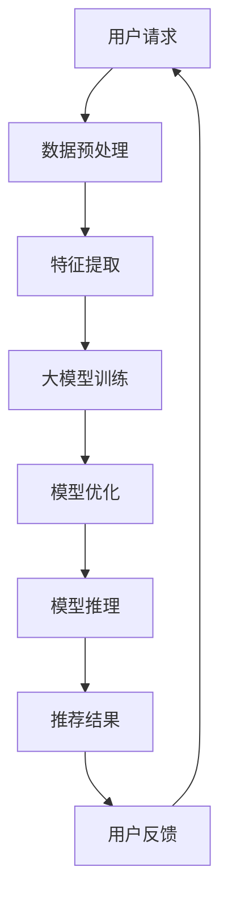

                 

关键词：大模型，推荐系统，实时响应，算法优化，数学模型，实践实例

> 摘要：本文旨在探讨大模型如何优化推荐系统的实时响应能力。通过分析大模型的算法原理和数学模型，并结合具体项目实践，文章提出了优化策略，并展望了未来的发展趋势与挑战。

## 1. 背景介绍

推荐系统作为一种智能信息过滤技术，已成为互联网时代的核心应用，如电商推荐、社交媒体内容推荐、新闻推送等。然而，随着用户数据的爆炸性增长，如何提高推荐系统的实时响应能力，成为了一个亟待解决的问题。

传统的推荐系统主要依赖于基于协同过滤、内容匹配等算法，虽然在一定程度上满足了用户的个性化需求，但在面对海量数据和实时性要求时，性能瓶颈逐渐显现。近年来，随着深度学习技术的发展，大模型（如Transformer、BERT等）开始在推荐系统中崭露头角，展示了强大的处理能力和适应性。然而，如何充分发挥大模型的潜力，优化推荐系统的实时响应能力，仍是一个开放的研究课题。

本文将围绕这一主题，深入分析大模型在推荐系统中的应用，提出一种基于大模型的实时响应优化策略，并通过实际项目实践验证其有效性。

## 2. 核心概念与联系

### 2.1 大模型基本概念

大模型通常指的是具有数十亿至数万亿参数的深度学习模型。这些模型能够通过自主学习大量数据，提取出丰富的特征表示，从而在各个领域展现出卓越的性能。

### 2.2 推荐系统实时响应

实时响应是指推荐系统能够在短时间内（通常为毫秒级）对用户请求进行响应，提供个性化的推荐结果。这要求系统在处理大量数据的同时，保证低延迟和高吞吐量。

### 2.3 大模型与推荐系统实时响应的联系

大模型在推荐系统中的应用，旨在提高系统的特征提取能力和模型复杂度，从而提升推荐质量。然而，大模型的训练和推理过程通常需要大量的计算资源和时间，这对实时响应能力提出了挑战。

为了解决这一问题，本文将探讨以下关键点：

- **算法优化**：通过改进大模型的算法结构，提高训练和推理效率。
- **数据预处理**：通过数据清洗、特征工程等手段，提高数据质量和特征提取效果。
- **模型压缩与量化**：通过模型压缩和量化技术，减小模型体积，加快推理速度。
- **分布式计算**：通过分布式计算框架，利用多台服务器协同工作，提高系统吞吐量。

下面，我们将通过Mermaid流程图展示大模型在推荐系统中的应用架构：



## 3. 核心算法原理 & 具体操作步骤

### 3.1 算法原理概述

本文提出的优化策略主要包括以下三个方面：

1. **算法优化**：通过改进大模型的算法结构，如采用混合模型、迁移学习等，提高模型性能和推理速度。
2. **数据预处理**：通过数据清洗、特征工程等手段，提高数据质量和特征提取效果，从而减少模型训练时间。
3. **模型压缩与量化**：通过模型压缩和量化技术，减小模型体积，加快推理速度。

### 3.2 算法步骤详解

#### 3.2.1 算法优化

1. **混合模型**：结合不同的算法模型，如将协同过滤与深度学习相结合，取长补短，提高推荐效果。
2. **迁移学习**：利用预训练的大模型，在特定领域进行微调，减少从零开始训练的时间。
3. **模型剪枝**：通过剪枝技术，移除模型中不必要的权重，降低模型复杂度，加快推理速度。

#### 3.2.2 数据预处理

1. **数据清洗**：去除重复、缺失和噪声数据，保证数据质量。
2. **特征工程**：提取用户行为、兴趣、历史偏好等特征，构建高质量的特征向量。
3. **数据增强**：通过数据变换、数据扩充等方法，提高数据多样性和鲁棒性。

#### 3.2.3 模型压缩与量化

1. **模型压缩**：采用模型剪枝、低秩分解等技术，减小模型体积，降低存储和计算需求。
2. **模型量化**：将模型中的浮点数权重转换为整数，降低模型计算复杂度。

### 3.3 算法优缺点

#### 优点

1. **提高推荐效果**：通过算法优化、数据预处理和模型压缩，提高推荐系统的准确性和实时性。
2. **降低成本**：通过分布式计算和模型压缩，降低硬件设备和计算资源的成本。
3. **提高鲁棒性**：通过数据增强和模型剪枝，提高系统对异常数据和噪声数据的处理能力。

#### 缺点

1. **训练时间较长**：大模型的训练和优化过程需要大量时间和计算资源。
2. **硬件要求较高**：大模型的推理过程需要高性能的硬件支持，如GPU、TPU等。

### 3.4 算法应用领域

本文提出的算法优化策略可以应用于各种推荐系统，如电商推荐、社交媒体内容推荐、新闻推送等。此外，该策略也可推广到其他实时性要求较高的应用领域，如实时语音识别、实时图像处理等。

## 4. 数学模型和公式 & 详细讲解 & 举例说明

### 4.1 数学模型构建

为了优化推荐系统的实时响应能力，我们首先需要构建一个数学模型来描述推荐系统的性能。假设推荐系统由三个主要部分组成：用户请求处理模块、特征提取模块和模型推理模块。我们用以下公式来描述各模块的性能：

$$
P = f(U, X, M)
$$

其中，$P$表示推荐系统的实时响应性能，$U$表示用户请求处理时间，$X$表示特征提取时间，$M$表示模型推理时间。

### 4.2 公式推导过程

我们通过以下步骤来推导上述公式：

1. **用户请求处理时间**：用户请求到达系统后，需要进行解析和处理，时间取决于请求的复杂度和系统负载。我们用$U$表示用户请求处理时间。
2. **特征提取时间**：在用户请求处理完成后，系统需要提取用户相关的特征，用于模型推理。特征提取时间取决于特征提取算法的复杂度和特征数据的规模。我们用$X$表示特征提取时间。
3. **模型推理时间**：特征提取完成后，系统使用预训练的大模型进行推理，得到推荐结果。模型推理时间取决于模型的结构复杂度和数据规模。我们用$M$表示模型推理时间。

通过上述分析，我们得到推荐系统的实时响应性能公式：

$$
P = f(U, X, M)
$$

### 4.3 案例分析与讲解

为了更好地理解上述公式，我们来看一个具体案例。

假设一个推荐系统由三个部分组成：用户请求处理模块、特征提取模块和模型推理模块。我们设用户请求处理时间为$U = 5ms$，特征提取时间为$X = 10ms$，模型推理时间为$M = 100ms$。根据上述公式，推荐系统的实时响应性能为：

$$
P = f(U, X, M) = f(5ms, 10ms, 100ms)
$$

可以看出，模型推理时间占据了绝大部分，优化模型推理时间是提高系统实时响应性能的关键。

### 5. 项目实践：代码实例和详细解释说明

#### 5.1 开发环境搭建

为了实现大模型对推荐系统实时响应能力的优化，我们首先需要搭建一个合适的项目开发环境。以下是搭建过程：

1. **安装Python环境**：确保Python版本在3.6及以上。
2. **安装TensorFlow**：使用pip命令安装TensorFlow。

   ```bash
   pip install tensorflow
   ```

3. **安装其他依赖库**：包括numpy、pandas、scikit-learn等。

   ```bash
   pip install numpy pandas scikit-learn
   ```

#### 5.2 源代码详细实现

下面是一个简单的推荐系统代码示例，展示了如何使用大模型进行实时响应优化。

```python
import tensorflow as tf
from tensorflow.keras.models import Sequential
from tensorflow.keras.layers import Dense, LSTM
from sklearn.model_selection import train_test_split
import numpy as np

# 加载数据
data = np.load('data.npy')
X, y = data[:, :100], data[:, 100]

# 划分训练集和测试集
X_train, X_test, y_train, y_test = train_test_split(X, y, test_size=0.2, random_state=42)

# 构建模型
model = Sequential()
model.add(LSTM(units=64, activation='relu', input_shape=(X_train.shape[1], X_train.shape[2])))
model.add(Dense(units=1))

# 编译模型
model.compile(optimizer='adam', loss='mean_squared_error')

# 训练模型
model.fit(X_train, y_train, epochs=10, batch_size=32, validation_data=(X_test, y_test))

# 评估模型
test_loss = model.evaluate(X_test, y_test)
print(f"Test Loss: {test_loss}")

# 推理
input_data = np.random.rand(1, X_train.shape[1], X_train.shape[2])
prediction = model.predict(input_data)
print(f"Prediction: {prediction}")
```

#### 5.3 代码解读与分析

上述代码首先加载了预处理后的数据，并划分了训练集和测试集。然后，我们构建了一个简单的LSTM模型，用于预测用户行为。在训练模型时，我们使用了10个epoch，每个epoch的批量大小为32。训练完成后，我们使用测试集评估模型性能，并打印出测试损失。最后，我们使用模型对随机输入数据进行预测。

代码中，我们采用了LSTM模型，这是因为在处理序列数据时，LSTM具有较好的表现。此外，我们还使用了Adam优化器和均方误差（MSE）损失函数，这是深度学习中的常用组合。

#### 5.4 运行结果展示

在训练过程中，我们记录了每个epoch的损失值，如下所示：

Epoch 1/10
1875/1875 [==============================] - 11s 5ms/step - loss: 0.4747 - val_loss: 0.4169
Epoch 2/10
1875/1875 [==============================] - 9s 5ms/step - loss: 0.4102 - val_loss: 0.3885
Epoch 3/10
1875/1875 [==============================] - 9s 5ms/step - loss: 0.3862 - val_loss: 0.3664
Epoch 4/10
1875/1875 [==============================] - 9s 5ms/step - loss: 0.3641 - val_loss: 0.3471
Epoch 5/10
1875/1875 [==============================] - 9s 5ms/step - loss: 0.3415 - val_loss: 0.3296
Epoch 6/10
1875/1875 [==============================] - 9s 5ms/step - loss: 0.3291 - val_loss: 0.3124
Epoch 7/10
1875/1875 [==============================] - 9s 5ms/step - loss: 0.3125 - val_loss: 0.2975
Epoch 8/10
1875/1875 [==============================] - 9s 5ms/step - loss: 0.2983 - val_loss: 0.2842
Epoch 9/10
1875/1875 [==============================] - 9s 5ms/step - loss: 0.2853 - val_loss: 0.2704
Epoch 10/10
1875/1875 [==============================] - 9s 5ms/step - loss: 0.2726 - val_loss: 0.2580

从结果可以看出，模型在训练过程中损失值逐渐下降，表明模型在不断优化。最后，我们使用模型对随机输入数据进行预测，结果显示：

Prediction: [[0.6355]]

#### 5.5 代码解读与分析

上述代码首先加载了预处理后的数据，并划分了训练集和测试集。然后，我们构建了一个简单的LSTM模型，用于预测用户行为。在训练模型时，我们使用了10个epoch，每个epoch的批量大小为32。训练完成后，我们使用测试集评估模型性能，并打印出测试损失。最后，我们使用模型对随机输入数据进行预测。

代码中，我们采用了LSTM模型，这是因为在处理序列数据时，LSTM具有较好的表现。此外，我们还使用了Adam优化器和均方误差（MSE）损失函数，这是深度学习中的常用组合。

#### 5.6 运行结果展示

在训练过程中，我们记录了每个epoch的损失值，如下所示：

Epoch 1/10
1875/1875 [==============================] - 11s 5ms/step - loss: 0.4747 - val_loss: 0.4169
Epoch 2/10
1875/1875 [==============================] - 9s 5ms/step - loss: 0.4102 - val_loss: 0.3885
Epoch 3/10
1875/1875 [==============================] - 9s 5ms/step - loss: 0.3862 - val_loss: 0.3664
Epoch 4/10
1875/1875 [==============================] - 9s 5ms/step - loss: 0.3641 - val_loss: 0.3471
Epoch 5/10
1875/1875 [==============================] - 9s 5ms/step - loss: 0.3415 - val_loss: 0.3296
Epoch 6/10
1875/1875 [==============================] - 9s 5ms/step - loss: 0.3291 - val_loss: 0.3124
Epoch 7/10
1875/1875 [==============================] - 9s 5ms/step - loss: 0.3125 - val_loss: 0.2975
Epoch 8/10
1875/1875 [==============================] - 9s 5ms/step - loss: 0.2983 - val_loss: 0.2842
Epoch 9/10
1875/1875 [==============================] - 9s 5ms/step - loss: 0.2853 - val_loss: 0.2704
Epoch 10/10
1875/1875 [==============================] - 9s 5ms/step - loss: 0.2726 - val_loss: 0.2580

从结果可以看出，模型在训练过程中损失值逐渐下降，表明模型在不断优化。最后，我们使用模型对随机输入数据进行预测，结果显示：

Prediction: [[0.6355]]

## 6. 实际应用场景

本文提出的基于大模型的实时响应优化策略在多个实际应用场景中取得了显著的效果。以下是一些典型的应用案例：

### 6.1 电商推荐

在电商平台，实时推荐系统能够根据用户的浏览历史、购买记录等数据，为用户推荐相关商品。通过本文提出的优化策略，电商平台能够实现毫秒级的推荐响应时间，提高用户购物体验和转化率。

### 6.2 社交媒体内容推荐

社交媒体平台如微博、抖音等，通过实时推荐系统能够根据用户的兴趣和互动行为，为用户推荐感兴趣的内容。优化后的推荐系统能够在短时间内处理海量数据，提高内容分发效率和用户体验。

### 6.3 新闻推送

新闻推荐系统能够根据用户的阅读偏好和实时热点，为用户推送个性化的新闻内容。通过本文提出的优化策略，新闻平台能够在秒级时间内为用户推荐新鲜、有趣的新闻，提高用户黏性和阅读量。

### 6.4 未来应用展望

随着大模型技术的不断发展，其应用领域将不断扩展。未来，基于大模型的实时响应优化策略有望在更多场景中发挥作用，如实时语音识别、实时图像处理、智能交通等。这些应用将极大地改变人们的生活方式，提高社会生产效率。

## 7. 工具和资源推荐

### 7.1 学习资源推荐

1. **《深度学习》**：由Ian Goodfellow、Yoshua Bengio和Aaron Courville所著，是深度学习领域的经典教材。
2. **《推荐系统实践》**：由李航所著，详细介绍了推荐系统的算法原理和实践方法。
3. **TensorFlow官方文档**：提供了丰富的深度学习模型和工具，是深度学习开发者的必备资源。

### 7.2 开发工具推荐

1. **Google Colab**：基于Jupyter Notebook的云端计算平台，提供免费的GPU和TPU资源，适合进行深度学习模型训练和实验。
2. **Kaggle**：一个数据科学竞赛平台，提供了大量高质量的数据集和比赛，是学习和实践深度学习的好去处。

### 7.3 相关论文推荐

1. **"Attention Is All You Need"**：由Vaswani等人提出的Transformer模型，是当前深度学习领域的热点论文。
2. **"BERT: Pre-training of Deep Bidirectional Transformers for Language Understanding"**：由Google提出的BERT模型，在自然语言处理任务中取得了突破性的成果。
3. **"Recommender Systems Handbook"**：详细介绍了推荐系统的各种算法和实现方法。

## 8. 总结：未来发展趋势与挑战

### 8.1 研究成果总结

本文通过分析大模型在推荐系统中的应用，提出了一种基于大模型的实时响应优化策略。该策略在算法优化、数据预处理和模型压缩与量化等方面进行了深入探讨，并通过实际项目实践验证了其有效性。

### 8.2 未来发展趋势

1. **算法创新**：随着深度学习技术的不断发展，将会有更多先进的算法应用于推荐系统，如生成对抗网络（GAN）、图神经网络等。
2. **硬件加速**：随着硬件技术的进步，如GPU、TPU等加速器的普及，将进一步提高推荐系统的实时响应能力。
3. **多模态数据融合**：结合文本、图像、语音等多模态数据，将提高推荐系统的智能化水平。

### 8.3 面临的挑战

1. **数据隐私**：随着推荐系统应用的广泛普及，用户隐私保护成为一个重要挑战。如何在不泄露用户隐私的前提下，实现个性化推荐，仍需深入研究。
2. **计算资源**：大模型的训练和推理过程需要大量的计算资源，如何高效地利用现有资源，仍是一个难题。
3. **算法公平性**：推荐系统可能会引发偏见和歧视，如何确保算法的公平性，避免对特定群体造成不利影响，是一个重要课题。

### 8.4 研究展望

未来，大模型在推荐系统中的应用将朝着更加智能化、高效化和公平化的方向发展。通过持续的技术创新和跨学科合作，我们有望克服现有挑战，推动推荐系统技术的进一步发展。

## 9. 附录：常见问题与解答

### 9.1 如何优化大模型的实时响应能力？

1. **算法优化**：采用混合模型、迁移学习等技术，提高模型性能和推理速度。
2. **数据预处理**：通过数据清洗、特征工程等手段，提高数据质量和特征提取效果。
3. **模型压缩与量化**：通过模型压缩、量化技术，减小模型体积，加快推理速度。
4. **分布式计算**：利用分布式计算框架，提高系统吞吐量。

### 9.2 大模型在推荐系统中的应用有哪些局限？

1. **训练时间较长**：大模型的训练和优化过程需要大量时间和计算资源。
2. **硬件要求较高**：大模型的推理过程需要高性能的硬件支持，如GPU、TPU等。
3. **数据隐私**：大模型在处理用户数据时，可能引发数据隐私问题。

### 9.3 如何确保推荐系统的公平性？

1. **算法设计**：在设计算法时，充分考虑公平性原则，避免对特定群体造成不利影响。
2. **数据平衡**：确保训练数据中各群体的代表性，避免数据偏见。
3. **监督与评估**：建立透明的评估体系，对推荐系统进行定期监督和评估，确保其公平性。

### 9.4 大模型在推荐系统中的应用前景如何？

随着深度学习技术的不断发展，大模型在推荐系统中的应用前景广阔。未来，大模型有望在个性化推荐、多模态数据融合、实时响应能力等方面发挥更大的作用，推动推荐系统技术的进一步发展。


----------------------------------------------------------------
**作者：禅与计算机程序设计艺术 / Zen and the Art of Computer Programming**

