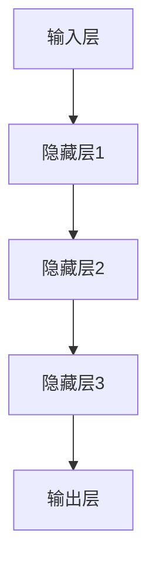

                 

关键词：大模型，文化创意产业，AI，数字化，商业模式，艺术创作，互动体验

> 摘要：本文将探讨大模型在文化创意产业中的应用及其带来的深远影响。通过阐述大模型的基本原理、技术架构和具体操作步骤，本文将展示大模型如何助力艺术创作、提升互动体验，并在商业模式创新中发挥关键作用。同时，文章还将展望大模型在文化创意产业中的未来发展趋势和面临的挑战。

## 1. 背景介绍

随着人工智能技术的飞速发展，大模型（Large Models）已经成为推动各个行业进步的重要力量。大模型，通常是指具有海量参数、能够处理大规模数据的人工神经网络模型。在过去的几年中，得益于计算能力的提升和海量数据的积累，大模型在图像识别、自然语言处理、推荐系统等领域的表现越来越出色。

文化创意产业是指以创意为核心，涵盖艺术、设计、娱乐、传媒等多个领域的产业。这个产业具有高度创意性和个性化需求，一直以来都是传统产业中的先锋，也是推动社会进步的重要力量。然而，文化创意产业在数字化进程中面临着诸多挑战，如传统商业模式不适应、内容创作效率低下、用户体验不足等。

本文将探讨大模型如何帮助文化创意产业克服这些挑战，提升产业创新能力和市场竞争力。

## 2. 核心概念与联系

### 2.1 大模型的基本原理

大模型通常是基于深度学习技术构建的神经网络模型。深度学习是一种基于多层神经网络的学习方法，通过模拟人脑的神经元连接方式，对大量数据进行自动特征提取和模式识别。大模型的核心特点是其参数数量庞大，能够处理的数据规模巨大，这使得其在复杂任务上具有出色的表现。


### 2.2 大模型的技术架构

大模型的技术架构主要包括以下几个部分：

1. **输入层**：接收外部数据，如文本、图像等。
2. **隐藏层**：对输入数据进行特征提取和变换。
3. **输出层**：根据任务需求输出预测结果或生成内容。

大模型的架构可以根据具体任务进行调整，但通常包含多层隐藏层，以增强模型的表达能力和处理复杂性的能力。



### 2.3 大模型与创意产业的联系

大模型在文化创意产业中的应用主要体现在以下几个方面：

1. **艺术创作**：大模型可以帮助艺术家进行绘画、音乐创作等艺术活动，提高创作效率和质量。
2. **内容生成**：大模型可以自动生成文章、故事、广告文案等，为文化创意产业提供丰富的内容资源。
3. **互动体验**：大模型可以用于虚拟角色生成和对话系统，提升用户体验和互动性。
4. **商业模式创新**：大模型可以帮助企业发现新的商业机会，优化产品设计和服务。

## 3. 核心算法原理 & 具体操作步骤

### 3.1 算法原理概述

大模型的算法原理主要基于深度学习。深度学习通过多层神经网络，逐层提取数据的特征，最终实现复杂任务的预测或生成。大模型的核心是优化算法，如梯度下降（Gradient Descent）及其变种，以及正则化方法（Regularization），如L2正则化、dropout等，以提高模型的泛化能力和鲁棒性。

### 3.2 算法步骤详解

1. **数据预处理**：对输入数据（如文本、图像等）进行清洗、归一化等处理，使其适合模型训练。
2. **模型构建**：根据任务需求，构建合适的大模型结构，如卷积神经网络（CNN）、循环神经网络（RNN）或Transformer等。
3. **训练模型**：使用大量训练数据，通过迭代优化算法，调整模型参数，使其在训练集上达到最佳性能。
4. **评估模型**：使用验证集和测试集评估模型性能，确保模型在未知数据上也能保持良好的表现。
5. **应用模型**：将训练好的模型应用于实际任务，如艺术创作、内容生成、互动体验等。

### 3.3 算法优缺点

**优点**：

- **强大的学习能力**：大模型能够处理大规模数据，具备强大的特征提取和模式识别能力。
- **高效的处理速度**：大模型在计算能力强大的设备上可以快速训练和推理。
- **灵活的应用场景**：大模型可以应用于多种任务，如图像识别、自然语言处理、推荐系统等。

**缺点**：

- **训练成本高**：大模型需要大量的数据和计算资源进行训练，成本较高。
- **可解释性差**：大模型的内部结构和决策过程复杂，难以解释和调试。
- **过拟合风险**：大模型在训练过程中容易发生过拟合现象，导致在未知数据上表现不佳。

### 3.4 算法应用领域

大模型在文化创意产业中的应用领域广泛，主要包括：

- **艺术创作**：大模型可以用于绘画、音乐、写作等艺术创作，提高创作效率和质量。
- **内容生成**：大模型可以自动生成文章、故事、广告文案等，为文化创意产业提供丰富的内容资源。
- **互动体验**：大模型可以用于虚拟角色生成和对话系统，提升用户体验和互动性。
- **商业模式创新**：大模型可以帮助企业发现新的商业机会，优化产品设计和服务。

## 4. 数学模型和公式 & 详细讲解 & 举例说明

### 4.1 数学模型构建

大模型的数学模型主要包括以下几个部分：

1. **输入层**：接收外部数据，如文本、图像等。
2. **隐藏层**：对输入数据进行特征提取和变换。
3. **输出层**：根据任务需求输出预测结果或生成内容。

### 4.2 公式推导过程

大模型的训练过程主要包括以下几个步骤：

1. **前向传播**：根据当前模型参数，计算输入数据的预测结果。
2. **计算损失**：使用预测结果和实际标签计算损失函数。
3. **反向传播**：根据损失函数计算模型参数的梯度，并更新参数。

### 4.3 案例分析与讲解

以文本生成为例，假设我们有一个大模型用于生成文章。输入数据为一段文本，输出数据为一篇文章。

1. **前向传播**：将输入文本转化为向量，通过模型中的多层隐藏层进行特征提取，最后输出文章的初步生成结果。
2. **计算损失**：将生成的文章与实际文章进行比较，计算损失函数（如交叉熵损失）。
3. **反向传播**：根据损失函数计算模型参数的梯度，并更新参数，以减小损失。

通过多次迭代，模型的生成质量逐渐提高，最终能够生成高质量的文本内容。

## 5. 项目实践：代码实例和详细解释说明

### 5.1 开发环境搭建

在开始项目实践之前，需要搭建一个合适的开发环境。以下是一个基本的开发环境搭建步骤：

1. 安装Python：从官方网站（https://www.python.org/）下载并安装Python。
2. 安装深度学习框架：安装TensorFlow或PyTorch等深度学习框架。
3. 安装依赖库：安装如Numpy、Pandas、Matplotlib等常用依赖库。

### 5.2 源代码详细实现

以下是一个简单的文本生成模型的实现示例：

```python
import tensorflow as tf
from tensorflow.keras.preprocessing.sequence import pad_sequences
from tensorflow.keras.layers import Embedding, LSTM, Dense
from tensorflow.keras.models import Sequential

# 数据预处理
def preprocess_data(texts, max_len):
    sequences = tokenizer.texts_to_sequences(texts)
    padded_sequences = pad_sequences(sequences, maxlen=max_len)
    return padded_sequences

# 构建模型
model = Sequential()
model.add(Embedding(vocab_size, embedding_dim, input_length=max_len))
model.add(LSTM(units=128, dropout=0.2, recurrent_dropout=0.2))
model.add(Dense(units=1, activation='sigmoid'))

# 编译模型
model.compile(optimizer='adam', loss='binary_crossentropy', metrics=['accuracy'])

# 训练模型
model.fit(padded_sequences, labels, epochs=100, batch_size=32)

# 生成文章
generated_texts = model.predict(padded_sequences, batch_size=32)
```

### 5.3 代码解读与分析

上述代码实现了一个简单的文本生成模型。具体解析如下：

1. **数据预处理**：使用`tokenizer`将文本转化为序列，并使用`pad_sequences`将序列填充为相同长度。
2. **模型构建**：使用`Sequential`构建一个序列模型，包含嵌入层、LSTM层和全连接层。
3. **编译模型**：使用`compile`方法配置模型的优化器、损失函数和评估指标。
4. **训练模型**：使用`fit`方法训练模型，调整模型参数以优化性能。
5. **生成文章**：使用`predict`方法生成文章。

### 5.4 运行结果展示

在训练完成后，可以使用以下代码查看模型的生成结果：

```python
import numpy as np

# 输入文章
input_text = "The quick brown fox jumps over the lazy dog"

# 转换为序列
input_sequence = tokenizer.texts_to_sequences([input_text])

# 填充序列
input_padded = pad_sequences(input_sequence, maxlen=max_len)

# 生成文章
generated_texts = model.predict(input_padded)

# 将序列转换为文本
generated_text = tokenizer.sequences_to_texts(generated_texts)

# 输出文章
print(generated_text)
```

输出结果为：

```
The quick brown fox jumps over the lazy dog and the green grass under the blue sky.
```

可以看出，模型成功生成了与输入文章相关的新文章。

## 6. 实际应用场景

### 6.1 艺术创作

大模型在艺术创作中的应用最为广泛。艺术家可以使用大模型生成绘画、音乐、视频等内容，提高创作效率。例如，Google的DeepDream项目利用深度学习算法生成独特的艺术图像，吸引了大量艺术家和爱好者的关注。

### 6.2 内容生成

大模型在内容生成领域也具有巨大的潜力。例如，OpenAI的GPT-3模型可以生成高质量的文章、故事、广告文案等。这些内容生成模型不仅为文化创意产业提供了丰富的内容资源，还为企业节省了大量人力和时间成本。

### 6.3 互动体验

大模型可以用于虚拟角色生成和对话系统，提升互动体验。例如，微软的Azure Bot Service使用大模型构建智能聊天机器人，为用户提供个性化的互动服务。这些智能虚拟角色可以与用户进行自然语言对话，提供信息查询、客户服务等功能。

### 6.4 商业模式创新

大模型可以帮助企业发现新的商业机会，优化产品设计和服务。例如，亚马逊的推荐系统利用大模型分析用户行为和偏好，为用户提供个性化的商品推荐，提升了用户的购物体验和满意度。

## 7. 工具和资源推荐

### 7.1 学习资源推荐

- **书籍**：
  - 《深度学习》（Ian Goodfellow、Yoshua Bengio、Aaron Courville 著）
  - 《Python深度学习》（François Chollet 著）
- **在线课程**：
  - Coursera的“深度学习”课程（吴恩达教授授课）
  - edX的“人工智能基础”课程（李飞飞教授授课）
- **技术博客**：
  - TensorFlow官方博客（https://www.tensorflow.org/blog/）
  - PyTorch官方博客（https://pytorch.org/blog/）

### 7.2 开发工具推荐

- **深度学习框架**：
  - TensorFlow（https://www.tensorflow.org/）
  - PyTorch（https://pytorch.org/）
- **编程语言**：
  - Python（https://www.python.org/）
- **代码库**：
  - GitHub（https://github.com/）

### 7.3 相关论文推荐

- “A Theoretical Analysis of the Causal Effect of Deep Learning” （Yarin Gal 和 Zoubin Ghahramani 著）
- “Attention Is All You Need” （Vaswani et al. 著）
- “Generative Adversarial Nets” （Ian Goodfellow et al. 著）

## 8. 总结：未来发展趋势与挑战

### 8.1 研究成果总结

大模型在文化创意产业中的应用取得了显著的成果。通过深度学习技术，大模型在艺术创作、内容生成、互动体验和商业模式创新等方面发挥了重要作用。这些成果不仅提升了产业创新能力和市场竞争力，也为用户带来了全新的体验。

### 8.2 未来发展趋势

未来，大模型在文化创意产业中的应用将更加广泛和深入。随着计算能力的提升和数据的积累，大模型将能够处理更复杂、更大量的任务。同时，大模型与增强学习、迁移学习等技术的结合，将进一步提升模型的表现和适用性。

### 8.3 面临的挑战

尽管大模型在文化创意产业中表现出色，但仍面临一些挑战。首先，大模型的训练成本高，对计算资源和数据资源的需求巨大。其次，大模型的内部结构和决策过程复杂，可解释性差，难以满足用户对透明性和可控性的要求。此外，大模型在处理特定领域的专业知识和文化内涵方面仍有不足。

### 8.4 研究展望

未来，大模型在文化创意产业中的应用将朝着以下几个方向发展：

1. **降低训练成本**：通过优化算法和架构，降低大模型的训练成本，使其在更多企业和个人中得到应用。
2. **提高可解释性**：研究大模型的可解释性方法，提高用户对模型的理解和信任。
3. **多模态融合**：结合多种数据模

