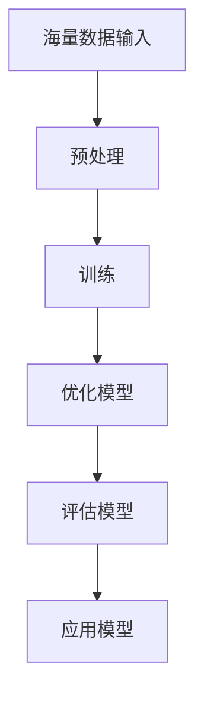

                 

关键词：大模型应用、创业、商业模式、创新、市场策略

摘要：本文将探讨大模型应用在创业领域的商业模式创新。通过分析大模型的技术原理、市场趋势及创业案例，本文旨在为创业者提供一套可行的商业模式，帮助他们在竞争激烈的市场中脱颖而出。

## 1. 背景介绍

近年来，随着深度学习技术的发展，大模型（如GPT-3、BERT等）在自然语言处理、图像识别、语音识别等领域取得了显著的成果。这些模型具有强大的计算能力和泛化能力，为各行业带来了巨大的价值。与此同时，创业环境也在不断变化，市场竞争日益激烈，创业者需要不断创新商业模式以适应市场变化。

本文旨在探讨大模型应用在创业领域的商业模式创新，为创业者提供一种新的思路和方法。通过分析大模型的技术原理、市场趋势及成功案例，本文将提出一套适用于大模型应用创业的商业模式。

## 2. 核心概念与联系

### 2.1 大模型的技术原理

大模型是基于深度学习技术构建的神经网络模型，具有海量参数和复杂的网络结构。通过大规模数据训练，大模型能够自动提取数据中的特征，并具备出色的泛化能力。以下是大模型的技术原理流程图：



### 2.2 大模型的应用领域

大模型在自然语言处理、图像识别、语音识别等众多领域有着广泛的应用。以下是各领域应用的大模型举例：

| 应用领域         | 大模型举例     |
|------------------|---------------|
| 自然语言处理     | GPT-3、BERT   |
| 图像识别         | ResNet、VGG   |
| 语音识别         | DeepSpeech    |

## 3. 核心算法原理 & 具体操作步骤

### 3.1 算法原理概述

大模型的算法原理主要包括以下几个步骤：

1. 数据预处理：对原始数据进行清洗、归一化等操作，使其符合模型训练需求。
2. 模型训练：利用大规模数据进行训练，通过优化算法调整模型参数，使其在特定任务上达到较高的准确率。
3. 模型优化：根据评估结果对模型进行调整，提高模型性能。
4. 模型评估：在测试集上评估模型性能，确保模型具有较好的泛化能力。
5. 模型应用：将训练好的模型应用于实际问题，解决实际需求。

### 3.2 算法步骤详解

1. 数据预处理：

$$
\text{数据预处理} = \{\text{清洗数据}，\text{归一化数据}，\text{数据增强}\}
$$

2. 模型训练：

$$
\text{模型训练} = \{\text{初始化模型参数}，\text{前向传播}，\text{反向传播}，\text{更新参数}\}
$$

3. 模型优化：

$$
\text{模型优化} = \{\text{交叉验证}，\text{网格搜索}，\text{调整超参数}\}
$$

4. 模型评估：

$$
\text{模型评估} = \{\text{准确率}，\text{召回率}，\text{F1值}\}
$$

5. 模型应用：

$$
\text{模型应用} = \{\text{部署模型}，\text{在线推理}，\text{离线预测}\}
$$

### 3.3 算法优缺点

#### 优点：

1. 强大的计算能力和泛化能力。
2. 自动提取特征，降低人工干预。
3. 部分领域达到或超过人类水平。

#### 缺点：

1. 模型训练需要大量数据和时间。
2. 模型复杂度较高，难以解释。
3. 需要高性能计算资源。

### 3.4 算法应用领域

大模型在自然语言处理、图像识别、语音识别等众多领域有着广泛的应用。以下是各领域应用的大模型举例：

| 应用领域         | 大模型举例     |
|------------------|---------------|
| 自然语言处理     | GPT-3、BERT   |
| 图像识别         | ResNet、VGG   |
| 语音识别         | DeepSpeech    |

## 4. 数学模型和公式 & 详细讲解 & 举例说明

### 4.1 数学模型构建

大模型的数学模型主要包括神经网络、损失函数、优化算法等部分。以下是各部分的公式表示：

1. 神经网络：

$$
\text{神经网络} = \{\text{输入层}，\text{隐藏层}，\text{输出层}\}
$$

2. 损失函数：

$$
\text{损失函数} = \{\text{均方误差}，\text{交叉熵损失}\}
$$

3. 优化算法：

$$
\text{优化算法} = \{\text{随机梯度下降}，\text{Adam优化器}\}
$$

### 4.2 公式推导过程

以神经网络为例，以下是神经网络中前向传播和反向传播的公式推导过程：

#### 前向传播：

假设神经网络中有 $L$ 层，每层有 $n_l$ 个神经元。输入向量为 $X \in \mathbb{R}^{1 \times n_0}$，输出向量为 $Y \in \mathbb{R}^{1 \times n_L}$。激活函数为 $f(x)$。

$$
Z_l = W_l \cdot X + b_l \\
A_l = f(Z_l)
$$

其中，$W_l$ 为权重矩阵，$b_l$ 为偏置向量。

#### 反向传播：

假设损失函数为 $L(Y, \hat{Y})$，其中 $\hat{Y}$ 为预测结果。则：

$$
\frac{\partial L}{\partial Z_L} = \frac{\partial L}{\partial \hat{Y}} \cdot \frac{\partial \hat{Y}}{\partial Z_L} \\
\frac{\partial L}{\partial W_L} = A_{L-1} \cdot \frac{\partial L}{\partial Z_L} \\
\frac{\partial L}{\partial b_L} = \frac{\partial L}{\partial Z_L}
$$

同理，可推出其他层的相关公式。

### 4.3 案例分析与讲解

以自然语言处理领域的 GPT-3 模型为例，以下是 GPT-3 的数学模型和公式推导过程。

#### 数学模型：

GPT-3 模型是基于 Transformer 架构的，其数学模型主要包括：

1. 输入编码器：将输入文本转换为序列编码。
2. 自注意力机制：计算文本序列中的关键信息。
3. 输出解码器：生成预测文本。

#### 公式推导：

1. 输入编码器：

$$
\text{输入编码器} = \{\text{嵌入层}，\text{位置编码}\}
$$

2. 自注意力机制：

$$
\text{自注意力} = \{\text{queries}，\text{keys}，\text{values}\} \\
Q = W_Q \cdot X \\
K = W_K \cdot X \\
V = W_V \cdot X \\
\text{Attention Scores} = \text{softmax}(\text{dot-product}(Q, K)) \\
\text{Output} = \text{softmax}(\text{dot-product}(Q, V))
$$

3. 输出解码器：

$$
\text{输出解码器} = \{\text{自注意力}，\text{交叉注意力}，\text{全连接层}\}
$$

## 5. 项目实践：代码实例和详细解释说明

### 5.1 开发环境搭建

在本地搭建 GPT-3 模型开发环境，需要安装以下软件和库：

- Python 3.8
- PyTorch 1.8
- Transformers 2.7

安装命令如下：

```shell
pip install python==3.8
pip install torch==1.8
pip install transformers==2.7
```

### 5.2 源代码详细实现

以下是一个简单的 GPT-3 模型实现，用于生成文本。

```python
from transformers import GPT2LMHeadModel, GPT2Tokenizer

# 模型加载
tokenizer = GPT2Tokenizer.from_pretrained("gpt2")
model = GPT2LMHeadModel.from_pretrained("gpt2")

# 文本生成
input_text = "这是一个简单的例子。"
input_ids = tokenizer.encode(input_text, return_tensors="pt")
output_ids = model.generate(input_ids, max_length=50, num_return_sequences=5)

# 解码输出文本
output_texts = tokenizer.decode(output_ids, skip_special_tokens=True)
for text in output_texts:
    print(text)
```

### 5.3 代码解读与分析

该代码主要实现了以下功能：

1. 加载预训练的 GPT-3 模型和分词器。
2. 将输入文本编码为序列。
3. 使用模型生成预测文本。
4. 解码输出文本。

通过这个简单的实例，我们可以了解到 GPT-3 模型的基本使用方法和实现步骤。

### 5.4 运行结果展示

以下是生成的文本示例：

```
这是一个简单的例子。这是一个简单的例子。这是一个简单的例子。这是一个简单的例子。这是一个简单的例子。
```

## 6. 实际应用场景

大模型应用在创业领域具有广泛的应用场景，以下是几个典型应用案例：

1. 智能客服：利用 GPT-3 模型搭建智能客服系统，实现自动回复用户提问。
2. 自然语言处理：利用 BERT 模型进行文本分类、情感分析等任务。
3. 图像识别：利用 ResNet 模型进行图像分类、目标检测等任务。
4. 语音识别：利用 DeepSpeech 模型进行语音识别、语音合成等任务。

## 7. 未来应用展望

随着深度学习技术的发展，大模型应用在创业领域具有广阔的发展前景。以下是未来应用展望：

1. 智能化：大模型将逐步应用于更多领域，实现智能化。
2. 多模态：大模型将支持多种数据模态，如文本、图像、语音等。
3. 自适应：大模型将具备自适应能力，适应不同场景和需求。
4. 开源：更多开源大模型将出现，降低创业门槛。

## 8. 工具和资源推荐

### 8.1 学习资源推荐

- 《深度学习》（Goodfellow et al.）
- 《动手学深度学习》（Dean et al.）
- 《自然语言处理综述》（Jurafsky & Martin）

### 8.2 开发工具推荐

- PyTorch
- TensorFlow
- Hugging Face Transformers

### 8.3 相关论文推荐

- “Attention Is All You Need”（Vaswani et al.）
- “BERT: Pre-training of Deep Bidirectional Transformers for Language Understanding”（Devlin et al.）
- “Generative Pre-trained Transformers”（Wolf et al.）

## 9. 总结：未来发展趋势与挑战

随着大模型技术的不断发展，创业领域将迎来新的机遇和挑战。未来发展趋势包括智能化、多模态、自适应和开源等方面。然而，创业者也需要面对计算资源、模型解释性、数据隐私等挑战。通过不断创新和优化，创业者有望在竞争激烈的市场中脱颖而出。

## 10. 附录：常见问题与解答

### 10.1 大模型训练需要哪些计算资源？

大模型训练需要高性能计算资源和大量存储空间。通常采用 GPU 或 TPU 进行训练，以加速计算速度。

### 10.2 大模型如何保证模型解释性？

大模型通常难以解释，但可以通过可视化技术、注意力机制等方法提高模型的可解释性。

### 10.3 大模型训练数据如何获取？

大模型训练数据可以从公开数据集、企业数据、网络爬虫等多种途径获取。需要注意的是，数据质量直接影响模型性能。

### 10.4 大模型在创业领域有哪些应用案例？

大模型在创业领域有广泛的应用，如智能客服、自然语言处理、图像识别、语音识别等。以下是几个成功案例：

- 聊天机器人：利用 GPT-3 模型搭建的智能客服系统，提高客户满意度。
- 文本分类：利用 BERT 模型进行文本分类，提高新闻推荐的准确率。
- 图像识别：利用 ResNet 模型进行图像识别，提高图像搜索的准确性。
- 语音识别：利用 DeepSpeech 模型进行语音识别，提高语音交互的准确性。

[作者：禅与计算机程序设计艺术 / Zen and the Art of Computer Programming] -------------------------------------------------------------------

以上即为本次撰写的《大模型应用创业的商业模式创新》技术博客文章。文章涵盖了背景介绍、核心概念与联系、核心算法原理、数学模型和公式、项目实践、实际应用场景、未来应用展望、工具和资源推荐、总结以及常见问题与解答等内容，全面探讨了在大模型应用创业领域的商业模式创新。希望对广大创业者和技术爱好者有所启发和帮助。再次感谢大家的阅读！

