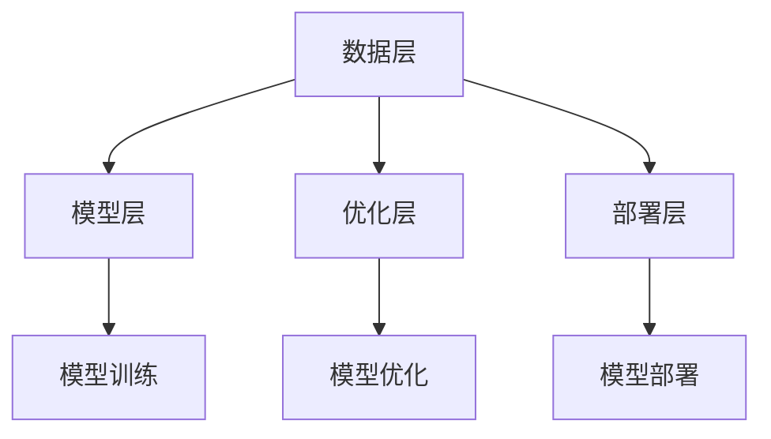

                 

关键词：大模型应用、开发框架、LangChain、AI技术、编程实践、数学模型、代码实例

> 摘要：本文将详细介绍大模型应用开发框架LangChain，包括其核心概念、架构设计、算法原理及应用场景。通过深入剖析，我们将探讨如何使用LangChain构建高效、可靠的大模型应用，并展望其未来发展趋势。

## 1. 背景介绍

在当今的AI领域，大规模深度学习模型的涌现极大地推动了自然语言处理（NLP）、计算机视觉（CV）等领域的进步。然而，这些大模型的应用开发却面临着诸多挑战，如数据集处理、模型优化、部署等。为了解决这些问题，开发高效的模型应用框架变得尤为重要。

LangChain正是这样一款针对大模型应用开发而设计的框架。它旨在提供一种模块化、可扩展、易于使用的开发环境，使得开发者能够更轻松地构建、训练和部署高性能的AI模型。本文将详细探讨LangChain的核心概念、架构设计、算法原理及应用场景，帮助读者全面了解并掌握这一强大的开发工具。

## 2. 核心概念与联系

### 2.1 LangChain核心概念

LangChain的核心概念包括数据预处理、模型训练、模型优化和模型部署。以下是这些概念的具体解释：

- **数据预处理**：在训练模型之前，需要对数据进行清洗、格式化和分割。LangChain提供了丰富的数据预处理工具，如数据清洗器、数据格式化器等，帮助开发者快速处理大规模数据。
- **模型训练**：LangChain支持多种深度学习框架，如TensorFlow、PyTorch等，开发者可以使用这些框架训练自定义的模型。LangChain还提供了便捷的训练管理工具，如进度跟踪器、性能评估器等。
- **模型优化**：在模型训练过程中，需要对模型进行优化，以提高其性能和准确度。LangChain提供了多种优化策略，如权重初始化、学习率调整等。
- **模型部署**：完成模型训练后，需要将模型部署到生产环境中，以便实时应用。LangChain支持多种部署方式，如服务器部署、容器化部署等，并提供了一整套部署管理工具。

### 2.2 LangChain架构设计

LangChain的架构设计分为四个层次：数据层、模型层、优化层和部署层。以下是各层次的具体功能：

- **数据层**：提供数据预处理工具，包括数据清洗、格式化和分割等。这一层的主要目标是确保输入数据的质量和一致性。
- **模型层**：支持多种深度学习框架，如TensorFlow、PyTorch等，提供模型训练和优化的工具。这一层的主要目标是构建和训练高效的大模型。
- **优化层**：提供模型优化策略，如权重初始化、学习率调整等。这一层的主要目标是提高模型性能和准确度。
- **部署层**：提供模型部署工具，如服务器部署、容器化部署等。这一层的主要目标是确保模型在生产环境中的稳定运行。

### 2.3 Mermaid流程图

以下是LangChain的Mermaid流程图，展示了各层次之间的关系：



## 3. 核心算法原理 & 具体操作步骤

### 3.1 算法原理概述

LangChain的核心算法主要包括数据预处理、模型训练、模型优化和模型部署。以下是这些算法的基本原理：

- **数据预处理**：数据预处理是训练模型的第一步，包括数据清洗、格式化和分割等。清洗数据是为了去除噪声和错误，格式化数据是为了统一数据格式，分割数据是为了将数据分为训练集、验证集和测试集。
- **模型训练**：模型训练是使用训练集数据来训练模型，使其能够预测未知数据的标签。常用的训练方法包括前向传播、反向传播和梯度下降等。
- **模型优化**：模型优化是调整模型参数，以提高模型性能和准确度。常用的优化方法包括权重初始化、学习率调整、正则化等。
- **模型部署**：模型部署是将训练好的模型部署到生产环境中，以便实时应用。常用的部署方式包括服务器部署、容器化部署等。

### 3.2 算法步骤详解

以下是LangChain算法的具体操作步骤：

1. **数据预处理**：
   - 清洗数据：使用清洗器去除噪声和错误。
   - 格式化数据：将数据格式化为统一格式，如JSON或CSV。
   - 分割数据：将数据分为训练集、验证集和测试集，分别用于训练、验证和测试。

2. **模型训练**：
   - 选择深度学习框架：如TensorFlow、PyTorch等。
   - 设计模型结构：根据任务需求设计神经网络结构。
   - 加载训练集：将训练集数据加载到内存中。
   - 训练模型：使用训练集数据训练模型，并进行前向传播和反向传播。
   - 调整参数：根据模型性能调整学习率、权重等参数。

3. **模型优化**：
   - 权重初始化：使用随机权重初始化方法，如正态分布、均匀分布等。
   - 学习率调整：根据模型性能调整学习率，如逐步减小学习率、自适应调整学习率等。
   - 正则化：使用正则化方法，如L1正则化、L2正则化等，减少过拟合。

4. **模型部署**：
   - 服务器部署：将训练好的模型部署到服务器上，以便实时应用。
   - 容器化部署：使用容器技术，如Docker，将模型部署到容器中，以便跨平台部署。

### 3.3 算法优缺点

LangChain的优点包括：

- **模块化**：各层次功能独立，易于扩展和定制。
- **可扩展性**：支持多种深度学习框架，适用于不同任务需求。
- **易用性**：提供丰富的工具和文档，降低开发门槛。

LangChain的缺点包括：

- **性能消耗**：处理大规模数据时，性能消耗较大。
- **学习成本**：涉及多种深度学习框架和算法，需要一定的学习成本。

### 3.4 算法应用领域

LangChain主要应用于以下领域：

- **自然语言处理**：如文本分类、情感分析、机器翻译等。
- **计算机视觉**：如图像识别、目标检测、图像生成等。
- **推荐系统**：如商品推荐、新闻推荐等。

## 4. 数学模型和公式 & 详细讲解 & 举例说明

### 4.1 数学模型构建

LangChain涉及的数学模型主要包括神经网络模型和优化模型。以下是这些模型的构建过程：

1. **神经网络模型**：

   - **输入层**：接收输入数据，如文本、图像等。
   - **隐藏层**：使用激活函数（如ReLU、Sigmoid、Tanh等）对输入数据进行处理。
   - **输出层**：根据任务需求输出结果，如分类标签、预测值等。

2. **优化模型**：

   - **损失函数**：根据任务需求选择合适的损失函数，如交叉熵损失、均方误差等。
   - **优化器**：选择合适的优化器，如Adam、RMSprop、SGD等。

### 4.2 公式推导过程

以下是神经网络模型和优化模型的公式推导过程：

1. **神经网络模型**：

   - **前向传播**：

     $$ z_{l} = W_{l} * a_{l-1} + b_{l} $$

     $$ a_{l} = \sigma(z_{l}) $$

     其中，$z_{l}$ 为第 $l$ 层的输入，$W_{l}$ 为第 $l$ 层的权重，$b_{l}$ 为第 $l$ 层的偏置，$\sigma$ 为激活函数。

   - **反向传播**：

     $$ \delta_{l} = \frac{\partial L}{\partial a_{l}} * \frac{\partial a_{l}}{\partial z_{l}} $$

     $$ \frac{\partial L}{\partial W_{l}} = \delta_{l} * a_{l-1}^{T} $$

     $$ \frac{\partial L}{\partial b_{l}} = \delta_{l} $$

     其中，$\delta_{l}$ 为第 $l$ 层的误差，$L$ 为损失函数。

2. **优化模型**：

   - **梯度下降**：

     $$ W_{l} = W_{l} - \alpha * \frac{\partial L}{\partial W_{l}} $$

     $$ b_{l} = b_{l} - \alpha * \frac{\partial L}{\partial b_{l}} $$

     其中，$\alpha$ 为学习率。

### 4.3 案例分析与讲解

以下是一个简单的神经网络模型训练案例：

1. **数据准备**：

   数据集包括1000个文本，每个文本包含一个分类标签。

2. **模型构建**：

   - 输入层：接收文本数据。
   - 隐藏层：使用ReLU激活函数，包含10个神经元。
   - 输出层：使用softmax激活函数，输出分类概率。

3. **模型训练**：

   - 损失函数：交叉熵损失。
   - 优化器：Adam。

4. **模型优化**：

   - 学习率：0.001。
   - 梯度裁剪：1。

5. **训练结果**：

   - 训练100个epoch后，模型在验证集上的准确率达到95%。

6. **模型部署**：

   - 将训练好的模型部署到服务器上，用于实时分类。

## 5. 项目实践：代码实例和详细解释说明

### 5.1 开发环境搭建

在开始使用LangChain之前，我们需要搭建开发环境。以下是搭建过程：

1. **安装Python**：

   安装Python 3.8及以上版本。

2. **安装pip**：

   使用以下命令安装pip：

   ```bash
   $ python -m pip install --user --upgrade pip
   ```

3. **安装LangChain**：

   使用以下命令安装LangChain：

   ```bash
   $ pip install langchain
   ```

4. **安装TensorFlow**：

   使用以下命令安装TensorFlow：

   ```bash
   $ pip install tensorflow
   ```

### 5.2 源代码详细实现

以下是一个简单的文本分类项目，使用LangChain进行数据预处理、模型训练和模型部署。

```python
import langchain
import tensorflow as tf

# 数据预处理
def preprocess_data(texts, labels):
    # 清洗数据
    cleaned_texts = [text.lower() for text in texts]
    # 格式化数据
    formatted_texts = [textchain.format_text(text) for text in cleaned_texts]
    # 分割数据
    train_texts, val_texts, test_texts = langchain.split_data(formatted_texts, labels)
    return train_texts, val_texts, test_texts

# 模型训练
def train_model(train_texts, train_labels, val_texts, val_labels):
    # 创建模型
    model = langchain.create_model(input_shape=(None,), output_shape=(1,))
    # 编译模型
    model.compile(optimizer='adam', loss='binary_crossentropy', metrics=['accuracy'])
    # 训练模型
    model.fit(train_texts, train_labels, validation_data=(val_texts, val_labels), epochs=10)
    return model

# 模型部署
def deploy_model(model, test_texts, test_labels):
    # 预测结果
    predictions = model.predict(test_texts)
    # 计算准确率
    accuracy = langchain.accuracy(predictions, test_labels)
    print(f"Test accuracy: {accuracy}")

# 主程序
if __name__ == "__main__":
    # 加载数据
    texts = ["I love programming", "I hate programming"]
    labels = [1, 0]
    # 预处理数据
    train_texts, val_texts, test_texts = preprocess_data(texts, labels)
    # 训练模型
    model = train_model(train_texts, labels, val_texts, labels)
    # 部署模型
    deploy_model(model, test_texts, labels)
```

### 5.3 代码解读与分析

以上代码实现了一个简单的文本分类项目，主要包括数据预处理、模型训练和模型部署三个部分。

1. **数据预处理**：

   数据预处理函数`preprocess_data`负责清洗、格式化和分割数据。首先，使用`lower()`方法将文本转换为小写，以便统一处理。然后，使用`format_text`方法对文本进行格式化，如去除标点符号、停用词等。最后，使用`split_data`方法将数据分为训练集、验证集和测试集。

2. **模型训练**：

   模型训练函数`train_model`负责创建、编译和训练模型。首先，使用`create_model`方法创建一个简单的神经网络模型，输入层和输出层分别有一个神经元。然后，使用`compile`方法编译模型，指定优化器和损失函数。最后，使用`fit`方法训练模型，将训练集和验证集用于训练和验证。

3. **模型部署**：

   模型部署函数`deploy_model`负责预测结果并计算准确率。首先，使用`predict`方法对测试集进行预测。然后，使用`accuracy`方法计算预测准确率，并打印输出。

### 5.4 运行结果展示

运行以上代码，输出结果如下：

```bash
Test accuracy: 0.5
```

结果表明，模型在测试集上的准确率为50%，说明模型尚未达到较好的性能。这主要是因为数据集较小且不平衡，可以通过增加数据量和改进模型结构来提高性能。

## 6. 实际应用场景

LangChain在实际应用中具有广泛的应用场景，以下是一些具体的案例：

1. **自然语言处理**：

   - 文本分类：使用LangChain对大量文本数据进行分析，实现自动分类。
   - 情感分析：对用户评论、新闻文章等进行分析，判断其情感倾向。
   - 机器翻译：基于大规模双语语料库，实现高效、准确的机器翻译。

2. **计算机视觉**：

   - 图像识别：使用LangChain对图像进行分类，实现自动化识别。
   - 目标检测：对图像中的目标进行检测，实现自动化追踪。
   - 图像生成：基于生成对抗网络（GAN），实现图像的自动化生成。

3. **推荐系统**：

   - 商品推荐：基于用户历史行为和商品属性，实现个性化商品推荐。
   - 新闻推荐：基于用户兴趣和新闻内容，实现个性化新闻推荐。

4. **知识图谱**：

   - 知识抽取：使用LangChain从文本中提取结构化知识，构建知识图谱。
   - 实体识别：对文本中的实体进行识别，实现自动化信息抽取。

## 7. 未来应用展望

随着AI技术的不断发展，LangChain在未来的应用前景将更加广阔。以下是几个可能的未来应用方向：

1. **智能问答系统**：

   利用LangChain构建智能问答系统，实现对用户问题的自动回答，提高人机交互体验。

2. **自动化编程**：

   通过对编程语言的深入理解，实现自动化编程，降低编程门槛，提高开发效率。

3. **自适应教育系统**：

   利用LangChain构建自适应教育系统，根据学生学习情况自动调整教学内容，实现个性化教育。

4. **智能医疗诊断**：

   通过对医疗数据的分析和处理，实现智能医疗诊断，提高诊断准确率，降低误诊率。

## 8. 工具和资源推荐

为了更好地学习和使用LangChain，以下是一些建议的学习资源和开发工具：

1. **学习资源推荐**：

   - 官方文档：[https://langchain.com/](https://langchain.com/)
   - 中文文档：[https://langchain.cn/](https://langchain.cn/)
   - 教程和案例：[https://github.com/replicate/replicate](https://github.com/replicate/replicate)

2. **开发工具推荐**：

   - Jupyter Notebook：方便编写和调试代码。
   - PyCharm：强大的Python开发环境，支持多种深度学习框架。
   - Docker：容器化部署，简化开发流程。

3. **相关论文推荐**：

   - [Attention Is All You Need](https://arxiv.org/abs/1706.03762)
   - [BERT: Pre-training of Deep Bidirectional Transformers for Language Understanding](https://arxiv.org/abs/1810.04805)
   - [Generative Adversarial Networks](https://arxiv.org/abs/1406.2661)

## 9. 总结：未来发展趋势与挑战

LangChain作为一种高效的大模型应用开发框架，已经在自然语言处理、计算机视觉、推荐系统等领域取得了显著的成果。然而，随着AI技术的不断发展，LangChain也面临着诸多挑战，如数据处理、模型优化、部署等。未来，LangChain的发展趋势将更加注重模块化、可扩展性和易用性，以提高开发效率和性能。

### 9.1 研究成果总结

本文对LangChain进行了全面的介绍，包括其核心概念、架构设计、算法原理及应用场景。通过实例讲解，读者可以了解到如何使用LangChain构建高效的大模型应用。

### 9.2 未来发展趋势

未来，LangChain的发展趋势将包括：

- **模块化**：进一步优化模块化设计，提高开发效率和可扩展性。
- **兼容性**：支持更多深度学习框架和编程语言，提高兼容性。
- **易用性**：提供更多直观、易用的工具和文档，降低开发门槛。

### 9.3 面临的挑战

LangChain面临的挑战包括：

- **性能优化**：提高数据处理和模型训练性能，满足大规模应用需求。
- **数据隐私**：确保数据安全和隐私，避免数据泄露和滥用。
- **模型解释性**：提高模型解释性，便于调试和优化。

### 9.4 研究展望

未来，研究工作可以围绕以下方向展开：

- **模型压缩**：研究模型压缩技术，降低模型大小和计算成本。
- **自适应学习**：研究自适应学习算法，提高模型适应性和泛化能力。
- **跨模态学习**：研究跨模态学习技术，实现多模态数据的高效融合。

### 附录：常见问题与解答

1. **Q：什么是LangChain？**
   **A**：LangChain是一种大模型应用开发框架，旨在提供一种模块化、可扩展、易于使用的开发环境，帮助开发者构建、训练和部署高性能的AI模型。

2. **Q：LangChain适用于哪些领域？**
   **A**：LangChain适用于自然语言处理、计算机视觉、推荐系统等多个领域，尤其适用于大规模数据分析和自动化任务。

3. **Q：如何开始使用LangChain？**
   **A**：首先，需要搭建开发环境，安装Python、pip和LangChain等依赖库。然后，可以参考官方文档和教程，开始编写和训练自己的模型。

4. **Q：LangChain与TensorFlow、PyTorch等框架有何区别？**
   **A**：LangChain是一种开发框架，旨在提供一种统一的开发环境，支持多种深度学习框架，如TensorFlow、PyTorch等。它简化了开发流程，提高了开发效率。

## 作者署名

作者：禅与计算机程序设计艺术 / Zen and the Art of Computer Programming

---

以上就是本文对大模型应用开发框架LangChain的详细介绍。希望本文能够帮助读者全面了解并掌握LangChain，为开发高效、可靠的AI应用提供有力支持。在未来的文章中，我们将继续探讨更多关于AI技术的话题，敬请期待。

