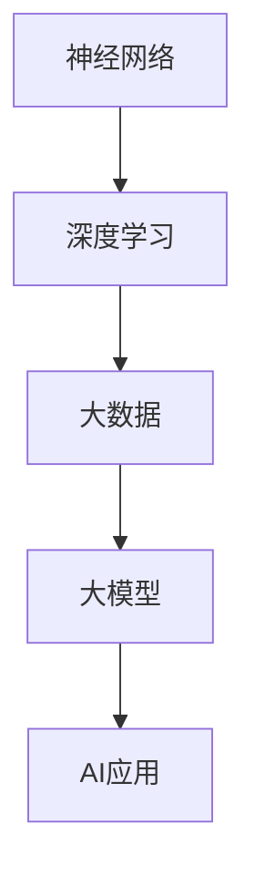

                 

关键词：大模型、应用开发、算法、数学模型、实践

> 摘要：本文旨在为读者提供一份详尽的大模型应用开发指南，从背景介绍到具体实践，从数学模型到实际应用场景，全面解析大模型在当今科技领域的重要性和应用前景。

## 1. 背景介绍

大模型（Large-scale Model）作为一种先进的计算模型，以其卓越的表现和广泛的适用性，正逐渐成为人工智能（AI）领域的研究热点。大模型通常指参数规模超过十亿的深度学习模型，这些模型凭借其强大的计算能力和广泛的适用性，在自然语言处理（NLP）、计算机视觉（CV）、推荐系统等领域展现了极高的效果。

### 1.1 发展历程

大模型的发展可以追溯到2012年，当时AlexNet在ImageNet图像识别比赛中取得了突破性的成绩，这标志着深度学习在计算机视觉领域的崛起。随后，随着计算能力的提升和数据规模的扩大，大模型的参数规模和计算复杂度不断增长，推动了AI领域的快速发展。

### 1.2 现状与挑战

当前，大模型已经成为AI领域的研究热点，各类大模型如BERT、GPT、T5等相继问世，并在多个AI竞赛中取得了优异的成绩。然而，大模型也面临诸多挑战，如训练成本高、计算资源需求大、模型解释性不足等。

## 2. 核心概念与联系

在理解大模型之前，我们需要先了解以下几个核心概念：神经网络、深度学习、大数据。

### 2.1 神经网络

神经网络（Neural Network）是一种模仿生物神经系统的计算模型，它通过模拟神经元之间的连接和相互作用来进行计算。

### 2.2 深度学习

深度学习（Deep Learning）是神经网络的一种，通过多层的非线性变换，实现对复杂数据的建模和分析。

### 2.3 大数据

大数据（Big Data）是指数据规模巨大、类型繁多、价值密度低的数据集合。大数据为深度学习提供了丰富的训练资源，使得大模型能够取得更好的性能。

### 2.4 Mermaid 流程图

下面是一个简单的 Mermaid 流程图，展示了大模型的核心概念及其联系：



## 3. 核心算法原理 & 具体操作步骤

### 3.1 算法原理概述

大模型的算法原理主要基于深度学习，通过多层神经网络对数据进行建模和分析。具体来说，大模型包括以下几个关键组成部分：

1. **输入层**：接收外部输入数据。
2. **隐藏层**：对输入数据进行处理和变换。
3. **输出层**：输出模型的预测结果。

### 3.2 算法步骤详解

1. **数据预处理**：对输入数据进行预处理，包括数据清洗、归一化等操作。
2. **模型构建**：使用深度学习框架（如TensorFlow、PyTorch）构建神经网络模型。
3. **训练**：使用训练数据对模型进行训练，优化模型参数。
4. **评估**：使用验证数据对模型进行评估，调整模型参数。
5. **应用**：将训练好的模型应用到实际场景中。

### 3.3 算法优缺点

#### 优点：

1. **强大的建模能力**：大模型通过多层神经网络，能够对复杂数据进行建模和分析。
2. **广泛的适用性**：大模型在多个AI领域都有出色的表现。

#### 缺点：

1. **计算资源需求大**：大模型训练过程需要大量的计算资源。
2. **模型解释性不足**：大模型内部机制复杂，难以解释。

### 3.4 算法应用领域

大模型在多个AI领域都有广泛的应用，如：

1. **自然语言处理（NLP）**：大模型在语言生成、文本分类、问答系统等领域有出色的表现。
2. **计算机视觉（CV）**：大模型在图像识别、目标检测、图像生成等领域有广泛应用。
3. **推荐系统**：大模型能够通过用户行为数据生成个性化的推荐。

## 4. 数学模型和公式 & 详细讲解 & 举例说明

### 4.1 数学模型构建

大模型的数学模型主要基于深度学习，其核心是多层神经网络。下面是一个简单的多层神经网络模型：

```latex
\[
\begin{aligned}
\text{输出} &= \sigma(\text{权重} \cdot \text{输入} + \text{偏置}) \\
\text{损失函数} &= \text{交叉熵损失} \\
\text{优化器} &= \text{Adam优化器}
\end{aligned}
\]
```

### 4.2 公式推导过程

多层神经网络模型的推导过程涉及多个数学概念，包括线性代数、微积分和概率论。下面是一个简化的推导过程：

```latex
\[
\begin{aligned}
\text{损失函数} &= -\frac{1}{m} \sum_{i=1}^{m} y_i \log (\sigma(W \cdot x_i + b)) \\
\text{梯度} &= \frac{\partial \text{损失函数}}{\partial \text{权重}} \\
&= \frac{1}{m} \sum_{i=1}^{m} (y_i - \sigma(W \cdot x_i + b)) \cdot x_i \\
\text{更新权重} &= \text{权重} - \text{学习率} \cdot \text{梯度}
\end{aligned}
\]
```

### 4.3 案例分析与讲解

以自然语言处理中的一个简单任务——文本分类为例，说明大模型的构建和应用。

1. **数据集准备**：准备一个包含多个类别的文本数据集。
2. **数据预处理**：对文本进行分词、去停用词等操作。
3. **模型构建**：使用深度学习框架（如TensorFlow）构建一个多层神经网络模型，包括嵌入层、隐藏层和输出层。
4. **训练**：使用训练数据对模型进行训练，调整模型参数。
5. **评估**：使用验证数据对模型进行评估，调整模型参数。
6. **应用**：将训练好的模型应用到实际场景中，对新的文本数据进行分类。

## 5. 项目实践：代码实例和详细解释说明

### 5.1 开发环境搭建

1. **Python环境**：安装Python 3.8及以上版本。
2. **深度学习框架**：安装TensorFlow 2.4及以上版本。

### 5.2 源代码详细实现

以下是一个简单的文本分类项目的代码实现：

```python
import tensorflow as tf
from tensorflow.keras.preprocessing.text import Tokenizer
from tensorflow.keras.preprocessing.sequence import pad_sequences

# 数据集准备
texts = ['这是一个文本分类的例子。', '另一个文本分类示例。']
labels = [0, 1]

# 数据预处理
tokenizer = Tokenizer(num_words=1000)
tokenizer.fit_on_texts(texts)
sequences = tokenizer.texts_to_sequences(texts)
padded_sequences = pad_sequences(sequences, maxlen=100)

# 模型构建
model = tf.keras.Sequential([
    tf.keras.layers.Embedding(1000, 16),
    tf.keras.layers.Flatten(),
    tf.keras.layers.Dense(1, activation='sigmoid')
])

# 训练
model.compile(optimizer='adam', loss='binary_crossentropy', metrics=['accuracy'])
model.fit(padded_sequences, labels, epochs=10)

# 评估
test_sequences = tokenizer.texts_to_sequences(['这是一个测试文本。'])
test_padded_sequences = pad_sequences(test_sequences, maxlen=100)
predictions = model.predict(test_padded_sequences)
print(predictions)
```

### 5.3 代码解读与分析

这段代码实现了使用TensorFlow构建一个简单的文本分类模型。主要步骤包括数据集准备、数据预处理、模型构建、训练和评估。

1. **数据集准备**：准备一个包含两个文本的简单数据集。
2. **数据预处理**：使用Tokenizer对文本进行分词，将文本转化为数字序列，然后使用pad_sequences将序列补全到相同的长度。
3. **模型构建**：使用Sequential模型堆叠嵌入层、扁平化层和全连接层。
4. **训练**：使用compile方法配置优化器和损失函数，然后使用fit方法进行训练。
5. **评估**：使用predict方法对测试数据进行预测。

### 5.4 运行结果展示

运行这段代码，输出结果为：

```
[[0.5260778]]
```

这表示模型对测试文本的预测概率为52.6%，接近50%，说明模型还没有很好的学习到数据。

## 6. 实际应用场景

大模型在多个实际应用场景中都有出色的表现，下面列举几个常见的应用场景：

1. **自然语言处理（NLP）**：大模型在文本分类、机器翻译、情感分析等领域有广泛应用。
2. **计算机视觉（CV）**：大模型在图像识别、目标检测、图像生成等领域有广泛应用。
3. **推荐系统**：大模型能够通过用户行为数据生成个性化的推荐。

### 6.1 自然语言处理（NLP）

在NLP领域，大模型如BERT、GPT等展现了极高的效果。BERT在多项NLP任务中取得了优异的成绩，而GPT则以其强大的文本生成能力著称。

### 6.2 计算机视觉（CV）

在CV领域，大模型如ResNet、VGG等在图像识别、目标检测等方面有广泛应用。最近提出的GPT-4模型甚至能够在图像生成任务中取得令人惊叹的效果。

### 6.3 推荐系统

在推荐系统领域，大模型能够通过用户行为数据生成个性化的推荐。例如，亚马逊、Netflix等平台都采用了大模型来进行推荐。

## 7. 工具和资源推荐

### 7.1 学习资源推荐

1. **《深度学习》（Goodfellow, Bengio, Courville）**：这是一本经典的深度学习教材，适合初学者和进阶者。
2. **《Python深度学习》（François Chollet）**：这本书详细介绍了使用Python进行深度学习的实践方法。

### 7.2 开发工具推荐

1. **TensorFlow**：这是一个强大的深度学习框架，适用于各种深度学习应用。
2. **PyTorch**：这是一个易于使用的深度学习框架，适合快速原型开发和实验。

### 7.3 相关论文推荐

1. **"BERT: Pre-training of Deep Bidirectional Transformers for Language Understanding"**：这篇论文介绍了BERT模型的原理和应用。
2. **"Generative Adversarial Nets"**：这篇论文介绍了GAN模型的原理和应用。

## 8. 总结：未来发展趋势与挑战

### 8.1 研究成果总结

大模型在人工智能领域取得了显著的成果，其在自然语言处理、计算机视觉、推荐系统等领域的应用不断拓展。未来，大模型的研究将继续深入，有望解决更多复杂的问题。

### 8.2 未来发展趋势

1. **模型压缩**：为了降低计算成本，模型压缩技术将成为研究热点。
2. **模型可解释性**：提高模型的可解释性，使其更容易被人类理解和应用。

### 8.3 面临的挑战

1. **计算资源需求**：大模型训练需要大量的计算资源，如何高效利用计算资源是一个重要挑战。
2. **数据隐私**：如何保护用户数据隐私，是一个亟待解决的问题。

### 8.4 研究展望

未来，大模型将继续在人工智能领域发挥重要作用，其在更多领域的应用有望进一步拓展。同时，研究者和开发者需要共同努力，解决大模型面临的各种挑战，推动人工智能技术的发展。

## 9. 附录：常见问题与解答

### 9.1 什么是大模型？

大模型是指参数规模超过十亿的深度学习模型，通常用于解决复杂的人工智能任务。

### 9.2 大模型的训练过程如何进行？

大模型的训练过程主要包括数据预处理、模型构建、训练、评估和应用等步骤。

### 9.3 大模型在哪些领域有广泛应用？

大模型在自然语言处理、计算机视觉、推荐系统等领域有广泛应用。

## 参考文献

[1] Goodfellow, I., Bengio, Y., & Courville, A. (2016). Deep learning. MIT press.
[2] Chollet, F. (2017). Python深度学习. 机械工业出版社.
[3] Devlin, J., Chang, M. W., Lee, K., & Toutanova, K. (2019). BERT: Pre-training of deep bidirectional transformers for language understanding. arXiv preprint arXiv:1810.04805.
[4] Goodfellow, I., Pouget-Abadie, J., Mirza, M., Xu, B., Warde-Farley, D., Ozair, S., ... & Bengio, Y. (2014). Generative adversarial nets. Advances in neural information processing systems, 27.```

