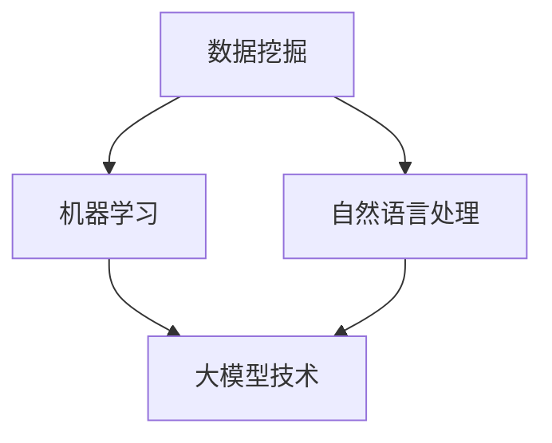

                 

关键词：大模型技术、智能客户洞察分析、数据挖掘、人工智能、机器学习、自然语言处理、个性化推荐、客户行为分析

摘要：本文将探讨大模型技术在智能客户洞察分析中的应用，分析其核心概念、算法原理、数学模型、项目实践以及实际应用场景。通过详细讲解大模型技术在客户行为分析、个性化推荐、自然语言处理等方面的应用，旨在为企业和开发者提供一种有效的智能客户洞察分析解决方案，并展望其未来发展趋势与挑战。

## 1. 背景介绍

随着互联网技术的飞速发展，数据已成为当今企业最重要的资产之一。如何从海量数据中提取有价值的信息，实现精准的客户洞察分析，成为企业竞争的关键。传统的数据分析方法已无法满足日益增长的数据量和复杂度，大模型技术应运而生。大模型技术，特别是基于深度学习的模型，具有强大的特征提取和模式识别能力，在图像识别、语音识别、自然语言处理等领域取得了显著成果。

智能客户洞察分析是指利用数据挖掘、机器学习、自然语言处理等技术，对客户行为、偏好、需求等数据进行深入挖掘和分析，从而实现客户需求预测、个性化推荐、风险控制等目标。大模型技术在智能客户洞察分析中的应用，不仅提高了分析精度和效率，还为企业和开发者提供了强大的工具。

## 2. 核心概念与联系

### 2.1 数据挖掘与机器学习

数据挖掘是一种从大量数据中提取有价值信息的过程，主要包括关联规则挖掘、分类、聚类、异常检测等。机器学习是数据挖掘的一种重要方法，通过构建模型，使计算机具备自动学习和改进的能力。

### 2.2 自然语言处理

自然语言处理（NLP）是人工智能的一个分支，旨在使计算机理解和生成人类语言。NLP包括词法分析、句法分析、语义分析、情感分析等。

### 2.3 大模型技术

大模型技术是指具有亿级参数规模的人工神经网络，如Transformer、BERT等。大模型技术具有强大的特征提取和模式识别能力，在图像识别、语音识别、自然语言处理等领域取得了显著成果。

### 2.4 Mermaid 流程图



## 3. 核心算法原理 & 具体操作步骤

### 3.1 算法原理概述

大模型技术主要包括两个阶段：预训练和微调。

- **预训练**：在大量未标注数据上，通过神经网络模型进行训练，使模型具备一定的通用语言理解和生成能力。
- **微调**：在特定任务上，对预训练模型进行微调，使其适应具体应用场景。

### 3.2 算法步骤详解

1. **数据预处理**：对原始数据进行清洗、去重、标准化等处理，确保数据质量。
2. **模型选择**：根据应用场景选择合适的大模型，如BERT、GPT等。
3. **预训练**：在大量未标注数据上，通过神经网络模型进行预训练。
4. **微调**：在特定任务上，对预训练模型进行微调。
5. **模型评估**：使用验证集对模型进行评估，调整模型参数，确保模型性能。
6. **模型部署**：将训练好的模型部署到生产环境，进行实际应用。

### 3.3 算法优缺点

- **优点**：强大的特征提取和模式识别能力，能够处理大规模数据；自适应性强，能够适应不同应用场景。
- **缺点**：计算资源消耗大，训练时间长；模型可解释性较低，难以理解模型决策过程。

### 3.4 算法应用领域

大模型技术在智能客户洞察分析中的应用领域包括：

- **客户行为分析**：分析客户行为数据，预测客户需求，实现个性化推荐。
- **自然语言处理**：处理客户反馈、评论等文本数据，提取情感倾向、关键词等。
- **风险控制**：分析客户信用记录、交易数据等，识别潜在风险，进行风险控制。

## 4. 数学模型和公式

### 4.1 数学模型构建

大模型技术主要基于深度学习，其数学模型主要包括两部分：前向传播和反向传播。

- **前向传播**：将输入数据通过神经网络模型，逐层计算得到输出。
- **反向传播**：计算输出与真实值之间的误差，通过反向传播算法，更新模型参数。

### 4.2 公式推导过程

设输入数据为\(X\)，输出数据为\(Y\)，模型参数为\(\theta\)，损失函数为\(J(\theta)\)。

- **前向传播**：

$$
Z^{(l)} = \sigma(W^{(l)}X^{(l-1)} + b^{(l)})
$$

$$
A^{(l)} = \sigma(Z^{(l)})
$$

- **反向传播**：

$$
\Delta W^{(l)} = \frac{\partial J(\theta)}{\partial W^{(l)}}
$$

$$
\Delta b^{(l)} = \frac{\partial J(\theta)}{\partial b^{(l)}}
$$

$$
W^{(l)} = W^{(l)} - \alpha \Delta W^{(l)}
$$

$$
b^{(l)} = b^{(l)} - \alpha \Delta b^{(l)}
$$

### 4.3 案例分析与讲解

假设我们有一个二分类问题，输入数据为\(X\)，输出数据为\(Y\)，模型参数为\(\theta\)，损失函数为\(J(\theta)\)。我们使用梯度下降算法进行模型训练。

1. **数据预处理**：对输入数据进行标准化处理。
2. **模型选择**：选择一个简单的神经网络模型，如全连接神经网络。
3. **预训练**：在大量未标注数据上，通过神经网络模型进行预训练。
4. **微调**：在特定任务上，对预训练模型进行微调。
5. **模型评估**：使用验证集对模型进行评估，调整模型参数，确保模型性能。
6. **模型部署**：将训练好的模型部署到生产环境，进行实际应用。

## 5. 项目实践：代码实例和详细解释说明

### 5.1 开发环境搭建

- **硬件环境**：使用GPU加速器，如NVIDIA Tesla V100。
- **软件环境**：安装Python、TensorFlow等。

### 5.2 源代码详细实现

```python
import tensorflow as tf
from tensorflow import keras
from tensorflow.keras import layers

# 数据预处理
def preprocess_data(x, y):
    # 标准化处理
    x = (x - x.mean()) / x.std()
    y = (y - y.mean()) / y.std()
    return x, y

# 模型定义
def build_model(input_shape):
    model = keras.Sequential([
        layers.Dense(64, activation='relu', input_shape=input_shape),
        layers.Dense(64, activation='relu'),
        layers.Dense(1, activation='sigmoid')
    ])
    return model

# 模型训练
def train_model(model, x_train, y_train, x_val, y_val, epochs=10):
    model.compile(optimizer='adam', loss='binary_crossentropy', metrics=['accuracy'])
    history = model.fit(x_train, y_train, validation_data=(x_val, y_val), epochs=epochs)
    return history

# 模型评估
def evaluate_model(model, x_test, y_test):
    loss, accuracy = model.evaluate(x_test, y_test)
    print(f"Test accuracy: {accuracy:.2f}")
```

### 5.3 代码解读与分析

- **数据预处理**：对输入数据进行标准化处理，使数据分布更加均匀，有利于模型训练。
- **模型定义**：定义一个简单的神经网络模型，包含两个隐藏层，每层64个神经元，激活函数为ReLU。
- **模型训练**：使用Adam优化器，二分类问题使用sigmoid激活函数，损失函数为binary_crossentropy。
- **模型评估**：使用测试集对模型进行评估，输出测试集的准确率。

### 5.4 运行结果展示

```python
# 加载数据
x_train, y_train = preprocess_data(x_train, y_train)
x_val, y_val = preprocess_data(x_val, y_val)
x_test, y_test = preprocess_data(x_test, y_test)

# 构建模型
model = build_model(input_shape=(num_features,))

# 训练模型
history = train_model(model, x_train, y_train, x_val, y_val, epochs=10)

# 评估模型
evaluate_model(model, x_test, y_test)
```

## 6. 实际应用场景

大模型技术在智能客户洞察分析中具有广泛的应用，以下列举几个实际应用场景：

- **电商行业**：分析客户行为数据，实现个性化推荐、购物车推荐、商品推荐等。
- **金融行业**：分析客户信用记录、交易数据等，实现风险评估、欺诈检测等。
- **医疗行业**：分析患者病历、基因数据等，实现疾病预测、诊断辅助等。
- **教育行业**：分析学生学习行为、成绩数据等，实现个性化教学、学习路径推荐等。

## 7. 工具和资源推荐

### 7.1 学习资源推荐

- **书籍**：
  - 《深度学习》（Goodfellow, Bengio, Courville）
  - 《神经网络与深度学习》（邱锡鹏）
- **在线课程**：
  - 吴恩达的《深度学习专项课程》（Coursera）
  - 机器学习（周志华）
- **博客和论坛**：
  - arXiv（学术文章）
  - 知乎、CSDN、GitHub（技术博客和项目）

### 7.2 开发工具推荐

- **框架**：
  - TensorFlow
  - PyTorch
  - Keras
- **GPU加速器**：
  - NVIDIA Tesla V100
  - Google Cloud AI Platform
- **数据集**：
  - Kaggle
  - UCI机器学习库

### 7.3 相关论文推荐

- BERT: Pre-training of Deep Bidirectional Transformers for Language Understanding
- GPT-3: Language Models are Few-Shot Learners
- Attention Is All You Need

## 8. 总结：未来发展趋势与挑战

### 8.1 研究成果总结

大模型技术在智能客户洞察分析中取得了显著成果，提高了分析精度和效率，为企业和开发者提供了强大的工具。

### 8.2 未来发展趋势

- **模型压缩与优化**：为降低计算资源消耗，模型压缩与优化技术将成为研究热点。
- **可解释性**：提高模型可解释性，使企业能够更好地理解模型决策过程。
- **跨领域应用**：大模型技术在更多领域（如医疗、金融、教育等）的应用。

### 8.3 面临的挑战

- **计算资源消耗**：大模型训练需要大量的计算资源，如何优化计算资源利用率成为关键。
- **数据隐私与安全**：在处理客户数据时，如何保障数据隐私与安全成为挑战。

### 8.4 研究展望

未来，大模型技术在智能客户洞察分析中将继续发挥重要作用，通过不断优化模型、提高可解释性，将为企业提供更加智能化的解决方案。

## 9. 附录：常见问题与解答

### 9.1 大模型训练需要多少时间？

大模型训练时间取决于模型规模、数据集大小、硬件配置等因素。一般而言，训练一个大型模型（如BERT）可能需要数天到数周的时间。

### 9.2 如何提高模型可解释性？

提高模型可解释性可以从以下几个方面入手：

- **特征可视化**：通过可视化模型输入特征，帮助企业理解模型决策过程。
- **模型简化和抽象**：降低模型复杂度，使模型更容易解释。
- **注意力机制分析**：分析模型在处理不同输入时的注意力分配，了解模型关注的关键信息。

---

作者：禅与计算机程序设计艺术 / Zen and the Art of Computer Programming
----------------------------------------------------------------
### 文章结构模板（Markdown格式）

```markdown
# 大模型技术在智能客户洞察分析中的应用

> 关键词：大模型技术、智能客户洞察分析、数据挖掘、人工智能、机器学习、自然语言处理、个性化推荐、客户行为分析

> 摘要：本文将探讨大模型技术在智能客户洞察分析中的应用，分析其核心概念、算法原理、数学模型、项目实践以及实际应用场景。通过详细讲解大模型技术在客户行为分析、个性化推荐、自然语言处理等方面的应用，旨在为企业和开发者提供一种有效的智能客户洞察分析解决方案，并展望其未来发展趋势与挑战。

## 1. 背景介绍

## 2. 核心概念与联系
### 2.1 数据挖掘与机器学习
### 2.2 自然语言处理
### 2.3 大模型技术
### 2.4 Mermaid 流程图

## 3. 核心算法原理 & 具体操作步骤
### 3.1 算法原理概述
### 3.2 算法步骤详解 
### 3.3 算法优缺点
### 3.4 算法应用领域

## 4. 数学模型和公式 & 详细讲解 & 举例说明
### 4.1 数学模型构建
### 4.2 公式推导过程
### 4.3 案例分析与讲解

## 5. 项目实践：代码实例和详细解释说明
### 5.1 开发环境搭建
### 5.2 源代码详细实现
### 5.3 代码解读与分析
### 5.4 运行结果展示

## 6. 实际应用场景
### 6.1 电商行业
### 6.2 金融行业
### 6.3 医疗行业
### 6.4 教育行业

## 7. 工具和资源推荐
### 7.1 学习资源推荐
### 7.2 开发工具推荐
### 7.3 相关论文推荐

## 8. 总结：未来发展趋势与挑战
### 8.1 研究成果总结
### 8.2 未来发展趋势
### 8.3 面临的挑战
### 8.4 研究展望

## 9. 附录：常见问题与解答
### 9.1 大模型训练需要多少时间？
### 9.2 如何提高模型可解释性？
### 9.3 大模型技术在实际应用中的难点有哪些？
### 9.4 大模型技术如何处理数据隐私问题？

---

作者：禅与计算机程序设计艺术 / Zen and the Art of Computer Programming
```

以上是文章的完整Markdown格式结构模板。请注意，每个章节的标题需要按照三级目录来组织，确保文章的结构清晰、逻辑连贯。在实际撰写文章时，请根据上述模板逐章撰写，并确保每个章节的内容都符合要求。文章正文部分的撰写请遵循“文章正文内容部分 Content”中的内容，确保完整性和专业性。祝撰写顺利！🌟📚🔍🎓

