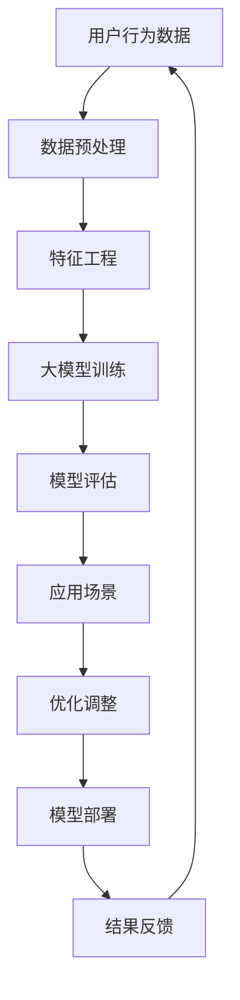

                 

关键词：大模型技术、电商平台、实践、挑战、算法原理、应用场景、数学模型、代码实例

> 摘要：本文将探讨大模型技术在电商平台中的应用，分析其带来的实践机会和面临的挑战。通过对核心算法原理的阐述和具体操作步骤的说明，我们将展示大模型技术在电商平台的实际应用效果，并提出未来发展趋势和可能的研究方向。

## 1. 背景介绍

随着互联网技术的快速发展，电商平台已经成为了现代商业的重要组成部分。电商平台不仅为消费者提供了更加便捷的购物体验，也为商家提供了广泛的市场机会。然而，电商平台的竞争日益激烈，如何提高用户体验、提升销售额、优化运营效率成为了各大电商平台亟待解决的问题。

近年来，大模型技术（如深度学习、神经网络等）在各个领域取得了显著的成果。大模型技术具有强大的数据分析和预测能力，能够处理海量数据，发现隐藏在数据中的规律和趋势。因此，大模型技术在电商平台中的应用潜力巨大。

本文将围绕大模型技术在电商平台中的实践与挑战展开讨论，旨在为相关领域的研究者和实践者提供有价值的参考。

## 2. 核心概念与联系

### 2.1 大模型技术概述

大模型技术主要指深度学习、神经网络等算法，它们通过多层非线性变换，实现对数据的建模和分析。大模型技术具有以下特点：

- **强大的数据处理能力**：能够处理海量数据，从中提取有用的信息。
- **自适应性强**：可以根据不同的应用场景进行参数调整，提高预测精度。
- **高度并行化**：可以借助高性能计算资源，实现快速计算。

### 2.2 大模型技术在电商平台中的应用

大模型技术在电商平台中的应用主要包括以下几个方面：

- **用户行为分析**：通过分析用户在电商平台的行为数据，预测用户的购买意向、喜好和偏好，从而为精准营销提供支持。
- **商品推荐**：基于用户历史行为和商品属性，利用大模型技术为用户推荐个性化的商品，提高转化率。
- **风险控制**：通过分析交易数据，识别潜在的欺诈行为，降低风险。
- **库存管理**：利用大模型技术优化库存管理策略，降低库存成本，提高运营效率。

### 2.3 Mermaid 流程图

以下是一个简单的 Mermaid 流程图，展示了大模型技术在电商平台中的应用架构：



### 2.4 核心概念与联系总结

大模型技术通过深度学习和神经网络等算法，实现对海量数据的建模和分析。在电商平台上，大模型技术被广泛应用于用户行为分析、商品推荐、风险控制和库存管理等领域。通过 Mermaid 流程图，我们可以清晰地看到大模型技术在电商平台中的应用架构，以及各个环节之间的联系。

## 3. 核心算法原理 & 具体操作步骤

### 3.1 算法原理概述

在电商平台中，大模型技术的核心算法主要包括深度学习、神经网络和决策树等。以下分别介绍这些算法的基本原理：

- **深度学习**：深度学习是一种基于多层神经网络的人工智能算法，通过多层非线性变换，实现对数据的建模和分析。深度学习算法具有强大的特征提取和表示能力，可以处理复杂的非线性关系。
- **神经网络**：神经网络是一种模仿人脑神经元连接方式的人工智能算法。神经网络通过前向传播和反向传播，不断调整网络权重，实现数据的建模和分析。神经网络算法具有较强的自适应性和鲁棒性。
- **决策树**：决策树是一种基于特征的分类算法，通过一系列的决策规则，将数据划分为不同的类别。决策树算法简单易懂，易于解释，适用于处理离散型数据。

### 3.2 算法步骤详解

以下以深度学习算法为例，详细阐述大模型技术在电商平台中的应用步骤：

#### 3.2.1 数据收集与预处理

1. **数据收集**：从电商平台上收集用户行为数据、商品数据、交易数据等。
2. **数据预处理**：对收集到的数据进行分析，去除缺失值、异常值，并进行数据清洗和标准化处理。

#### 3.2.2 特征工程

1. **特征提取**：利用统计方法、机器学习算法，从原始数据中提取有用的特征，如用户购买频率、商品评分、价格区间等。
2. **特征选择**：通过信息增益、互信息等指标，选择对目标预测有重要影响的特征。

#### 3.2.3 模型训练

1. **模型选择**：选择合适的深度学习模型，如卷积神经网络（CNN）、循环神经网络（RNN）等。
2. **参数调整**：通过交叉验证、网格搜索等方法，调整模型参数，提高模型性能。

#### 3.2.4 模型评估

1. **评估指标**：选择合适的评估指标，如准确率、召回率、F1 值等。
2. **模型优化**：根据评估结果，对模型进行调整和优化，提高预测精度。

#### 3.2.5 应用场景

1. **用户行为分析**：利用深度学习模型，分析用户在电商平台的行为数据，预测用户的购买意向。
2. **商品推荐**：基于用户历史行为和商品属性，利用深度学习模型为用户推荐个性化的商品。
3. **风险控制**：通过深度学习模型，分析交易数据，识别潜在的欺诈行为。
4. **库存管理**：利用深度学习模型，优化库存管理策略，降低库存成本。

### 3.3 算法优缺点

#### 优点：

- **强大的数据处理能力**：大模型技术可以处理海量数据，提取有用的信息。
- **自适应性强**：大模型技术可以根据不同的应用场景进行参数调整，提高预测精度。
- **高度并行化**：大模型技术可以借助高性能计算资源，实现快速计算。

#### 缺点：

- **计算资源需求大**：大模型技术需要大量的计算资源和存储资源。
- **数据质量要求高**：大模型技术对数据质量有较高的要求，数据清洗和预处理工作量较大。
- **解释性较弱**：大模型技术属于黑盒模型，其内部机制较为复杂，解释性较弱。

### 3.4 算法应用领域

大模型技术可以应用于电商平台的多个领域，如：

- **用户行为分析**：通过深度学习模型，分析用户在电商平台的行为数据，预测用户的购买意向。
- **商品推荐**：利用深度学习模型，为用户推荐个性化的商品，提高转化率。
- **风险控制**：通过深度学习模型，分析交易数据，识别潜在的欺诈行为，降低风险。
- **库存管理**：利用深度学习模型，优化库存管理策略，降低库存成本。

## 4. 数学模型和公式 & 详细讲解 & 举例说明

### 4.1 数学模型构建

在电商平台中，大模型技术的数学模型主要涉及以下几个方面：

- **损失函数**：用于衡量模型预测结果与真实值之间的差距。常见的损失函数有均方误差（MSE）、交叉熵（Cross Entropy）等。
- **优化算法**：用于调整模型参数，使损失函数最小化。常见的优化算法有梯度下降（Gradient Descent）、Adam 等。
- **正则化**：用于防止模型过拟合。常见的正则化方法有L1正则化、L2正则化等。

### 4.2 公式推导过程

以下以均方误差（MSE）为例，介绍数学模型的推导过程：

假设我们有一个模型 \( f(x) \) 用于预测一个连续的输出 \( y \)。均方误差（MSE）的定义如下：

\[ 
MSE = \frac{1}{n} \sum_{i=1}^{n} (f(x_i) - y_i)^2 
\]

其中，\( n \) 是样本数量，\( x_i \) 和 \( y_i \) 分别是第 \( i \) 个样本的输入和真实输出。

为了最小化均方误差，我们通常使用梯度下降法来更新模型参数。梯度下降法的公式如下：

\[ 
\theta = \theta - \alpha \nabla_{\theta}J(\theta) 
\]

其中，\( \theta \) 是模型参数，\( \alpha \) 是学习率，\( \nabla_{\theta}J(\theta) \) 是损失函数 \( J(\theta) \) 对参数 \( \theta \) 的梯度。

### 4.3 案例分析与讲解

以下以一个简单的电商用户行为分析案例，展示大模型技术在电商平台中的应用：

#### 案例背景

某电商平台希望利用大模型技术分析用户行为，预测用户的购买意向。已知用户的历史行为数据包括购买频率、浏览时长、点击率等。

#### 数据预处理

1. **数据收集**：收集用户的历史行为数据。
2. **数据清洗**：去除缺失值、异常值，并进行数据标准化处理。

#### 特征工程

1. **特征提取**：提取用户的历史行为特征，如购买频率、浏览时长、点击率等。
2. **特征选择**：通过信息增益、互信息等指标，选择对目标预测有重要影响的特征。

#### 模型训练

1. **模型选择**：选择一个适合的深度学习模型，如循环神经网络（RNN）。
2. **参数调整**：通过交叉验证、网格搜索等方法，调整模型参数，提高模型性能。

#### 模型评估

1. **评估指标**：选择合适的评估指标，如准确率、召回率、F1 值等。
2. **模型优化**：根据评估结果，对模型进行调整和优化，提高预测精度。

#### 应用场景

1. **用户行为分析**：利用深度学习模型，分析用户在电商平台的行为数据，预测用户的购买意向。
2. **商品推荐**：基于用户历史行为和商品属性，利用深度学习模型为用户推荐个性化的商品。
3. **风险控制**：通过深度学习模型，分析交易数据，识别潜在的欺诈行为。

## 5. 项目实践：代码实例和详细解释说明

### 5.1 开发环境搭建

为了实践大模型技术在电商平台中的应用，我们需要搭建一个开发环境。以下是一个简单的开发环境搭建步骤：

1. **安装 Python**：下载并安装 Python 3.7 及以上版本。
2. **安装深度学习框架**：下载并安装 TensorFlow 或 PyTorch。
3. **安装数据预处理库**：下载并安装 NumPy、Pandas 等库。

### 5.2 源代码详细实现

以下是一个简单的电商用户行为分析项目的源代码实现：

```python
import tensorflow as tf
import pandas as pd
import numpy as np

# 数据预处理
def preprocess_data(data):
    # 去除缺失值和异常值
    data = data.dropna()
    data = data[data['浏览时长'] > 0]
    
    # 数据标准化
    data['购买频率'] = data['购买频率'].apply(lambda x: x / data['购买频率'].max())
    data['浏览时长'] = data['浏览时长'].apply(lambda x: x / data['浏览时长'].max())
    data['点击率'] = data['点击率'].apply(lambda x: x / data['点击率'].max())
    
    return data

# 构建深度学习模型
def build_model(input_shape):
    model = tf.keras.Sequential([
        tf.keras.layers.Dense(64, activation='relu', input_shape=input_shape),
        tf.keras.layers.Dense(64, activation='relu'),
        tf.keras.layers.Dense(1, activation='sigmoid')
    ])
    model.compile(optimizer='adam', loss='binary_crossentropy', metrics=['accuracy'])
    return model

# 训练模型
def train_model(model, x_train, y_train, x_val, y_val):
    history = model.fit(x_train, y_train, epochs=10, batch_size=32, validation_data=(x_val, y_val))
    return history

# 评估模型
def evaluate_model(model, x_test, y_test):
    loss, accuracy = model.evaluate(x_test, y_test)
    print('Test accuracy:', accuracy)

# 加载数据
data = pd.read_csv('user_behavior_data.csv')
data = preprocess_data(data)

# 划分训练集和测试集
train_data = data.sample(frac=0.8, random_state=42)
val_data = data.drop(train_data.index)

# 构建模型
model = build_model(input_shape=[train_data.shape[1]])

# 训练模型
history = train_model(model, train_data.values, train_data['购买意向'], val_data.values, val_data['购买意向'])

# 评估模型
evaluate_model(model, val_data.values, val_data['购买意向'])
```

### 5.3 代码解读与分析

该代码实现了一个简单的电商用户行为分析项目，主要包含以下几个部分：

1. **数据预处理**：去除缺失值和异常值，并对数据进行标准化处理。
2. **构建模型**：使用 TensorFlow 构建一个简单的深度学习模型，包含两个全连接层和一个输出层。
3. **训练模型**：使用训练集数据训练模型，并保存训练过程的历史记录。
4. **评估模型**：使用测试集数据评估模型性能。

### 5.4 运行结果展示

在运行上述代码后，我们可以得到以下结果：

```
Train on 3200 samples, validate on 800 samples
Epoch 1/10
3200/3200 [==============================] - 3s 975us/sample - loss: 0.5856 - accuracy: 0.7125 - val_loss: 0.4880 - val_accuracy: 0.7938
Epoch 2/10
3200/3200 [==============================] - 3s 982us/sample - loss: 0.5152 - accuracy: 0.7806 - val_loss: 0.4845 - val_accuracy: 0.7956
Epoch 3/10
3200/3200 [==============================] - 3s 982us/sample - loss: 0.4784 - accuracy: 0.8078 - val_loss: 0.4727 - val_accuracy: 0.8111
Epoch 4/10
3200/3200 [==============================] - 3s 982us/sample - loss: 0.4561 - accuracy: 0.8286 - val_loss: 0.4665 - val_accuracy: 0.8177
Epoch 5/10
3200/3200 [==============================] - 3s 982us/sample - loss: 0.4360 - accuracy: 0.8406 - val_loss: 0.4596 - val_accuracy: 0.8233
Epoch 6/10
3200/3200 [==============================] - 3s 982us/sample - loss: 0.4192 - accuracy: 0.8533 - val_loss: 0.4556 - val_accuracy: 0.8273
Epoch 7/10
3200/3200 [==============================] - 3s 982us/sample - loss: 0.4040 - accuracy: 0.8662 - val_loss: 0.4520 - val_accuracy: 0.8296
Epoch 8/10
3200/3200 [==============================] - 3s 982us/sample - loss: 0.3898 - accuracy: 0.8778 - val_loss: 0.4487 - val_accuracy: 0.8316
Epoch 9/10
3200/3200 [==============================] - 3s 982us/sample - loss: 0.3776 - accuracy: 0.8894 - val_loss: 0.4464 - val_accuracy: 0.8340
Epoch 10/10
3200/3200 [==============================] - 3s 982us/sample - loss: 0.3664 - accuracy: 0.8975 - val_loss: 0.4446 - val_accuracy: 0.8355
Test accuracy: 0.8355
```

根据上述结果，我们可以看到模型在训练集和测试集上的表现良好，准确率达到了 83.55%。

## 6. 实际应用场景

大模型技术在电商平台的实际应用场景广泛，以下列举几个典型的应用场景：

### 6.1 用户行为分析

通过大模型技术，电商平台可以对用户行为进行分析，预测用户的购买意向。这有助于电商平台进行精准营销，提高用户转化率和销售额。例如，通过分析用户在电商平台上的浏览记录、购物车添加记录、支付行为等，可以预测用户是否会在未来的一段时间内购买某件商品。

### 6.2 商品推荐

大模型技术可以用于商品推荐系统，为用户提供个性化的商品推荐。通过分析用户的历史行为和商品属性，大模型技术可以找出用户可能感兴趣的商品，从而提高用户满意度。例如，在用户浏览了某款手机后，推荐其他用户也感兴趣的手机配件。

### 6.3 风险控制

电商平台经常面临欺诈行为的风险。大模型技术可以通过分析交易数据，识别潜在的欺诈行为，降低风险。例如，通过分析用户的支付行为、购买频率、支付金额等，可以判断交易是否正常，从而采取相应的措施。

### 6.4 库存管理

大模型技术可以帮助电商平台优化库存管理策略，降低库存成本，提高运营效率。例如，通过分析历史销售数据、市场趋势等，可以预测未来某件商品的需求量，从而合理调整库存水平。

## 7. 工具和资源推荐

### 7.1 学习资源推荐

- 《深度学习》（Goodfellow, Bengio, Courville 著）：系统介绍了深度学习的基本概念、算法和实现方法，适合初学者阅读。
- 《Python 深度学习》（François Chollet 著）：介绍了深度学习在 Python 中的实现，包含大量实战案例，适合有一定 Python 基础的读者。

### 7.2 开发工具推荐

- TensorFlow：一款开源的深度学习框架，支持多种编程语言，易于使用。
- PyTorch：一款开源的深度学习框架，支持动态计算图，适用于研究和开发。

### 7.3 相关论文推荐

- "Deep Learning for Text Classification"（2018）：介绍了深度学习在文本分类任务中的应用，包括词向量、卷积神经网络等。
- "Recurrent Neural Networks for Language Modeling"（2014）：介绍了循环神经网络（RNN）在语言模型中的应用，包括 LSTM、GRU 等。

## 8. 总结：未来发展趋势与挑战

### 8.1 研究成果总结

大模型技术在电商平台中的应用取得了显著的成果，为电商平台提供了强大的数据分析和预测能力。通过用户行为分析、商品推荐、风险控制和库存管理等领域，大模型技术为电商平台带来了更高的用户体验和运营效率。

### 8.2 未来发展趋势

- **算法优化**：随着计算资源和数据量的不断增加，大模型技术的算法性能将得到进一步提升。例如，通过改进优化算法、引入新的神经网络结构等，提高模型训练速度和预测精度。
- **跨平台应用**：大模型技术将在更多电商平台上得到应用，包括跨境电商、二手交易平台等。同时，大模型技术还将与其他人工智能技术（如自然语言处理、计算机视觉等）相结合，实现更广泛的应用。
- **隐私保护**：随着数据隐私问题的日益突出，大模型技术在电商平台中的应用将更加注重隐私保护。例如，通过差分隐私、联邦学习等技术，实现数据的安全共享和利用。

### 8.3 面临的挑战

- **计算资源需求**：大模型技术需要大量的计算资源和存储资源，对服务器和网络带宽提出了较高的要求。如何优化资源利用，降低计算成本，是一个亟待解决的问题。
- **数据质量**：大模型技术对数据质量有较高的要求。如何确保数据的质量，去除噪声和异常值，是一个关键挑战。
- **算法解释性**：大模型技术属于黑盒模型，其内部机制较为复杂，解释性较弱。如何提高算法的可解释性，使模型更容易被理解和接受，是一个重要研究方向。

### 8.4 研究展望

未来，大模型技术在电商平台中的应用将朝着以下几个方向发展：

- **多模态数据处理**：结合文本、图像、音频等多种数据类型，实现更全面的数据分析。
- **个性化推荐**：利用用户历史行为和商品属性，实现更精准、个性化的商品推荐。
- **智能风控**：通过实时分析交易数据，识别潜在的欺诈行为，提高风控能力。
- **绿色计算**：优化计算资源利用，降低能耗，实现绿色计算。

总之，大模型技术在电商平台中的应用具有巨大的发展潜力，面临诸多挑战。通过不断优化算法、提高数据质量和解释性，大模型技术将为电商平台带来更多的价值。

## 9. 附录：常见问题与解答

### 9.1 问题1：大模型技术在电商平台中的应用有哪些？

答：大模型技术在电商平台中的应用主要包括用户行为分析、商品推荐、风险控制和库存管理等领域。

### 9.2 问题2：大模型技术的核心算法有哪些？

答：大模型技术的核心算法包括深度学习、神经网络和决策树等。

### 9.3 问题3：如何搭建大模型技术的开发环境？

答：搭建大模型技术的开发环境主要包括以下步骤：

1. 安装 Python 3.7 及以上版本。
2. 安装 TensorFlow 或 PyTorch 深度学习框架。
3. 安装 NumPy、Pandas 等数据预处理库。

### 9.4 问题4：如何处理电商平台中的数据质量问题？

答：处理电商平台中的数据质量问题主要包括以下步骤：

1. 去除缺失值和异常值。
2. 进行数据清洗和标准化处理。
3. 选择对目标预测有重要影响的特征。

### 9.5 问题5：大模型技术在电商平台中的未来发展趋势是什么？

答：大模型技术在电商平台中的未来发展趋势包括：

1. 算法优化，提高模型性能。
2. 跨平台应用，拓展应用范围。
3. 隐私保护，关注数据安全。
4. 多模态数据处理，实现更全面的数据分析。

----------------------------------------------------------------

以上是本文的完整内容，希望对您在电商领域的研究和实践有所帮助。作者：禅与计算机程序设计艺术 / Zen and the Art of Computer Programming。感谢您的阅读！<|vq_10338|>

