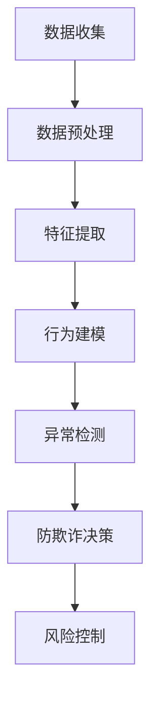

                 

关键词：大模型技术、用户行为分析、异常检测、防欺诈、电商平台、机器学习

## 摘要

本文深入探讨了基于大模型技术的电商平台用户行为异常检测与防欺诈应用的最新进展。首先，我们介绍了大模型技术的背景和核心原理，然后详细阐述了其在用户行为分析和异常检测中的关键作用。通过实例分析，本文展示了大模型技术在电商平台防欺诈方面的实际应用，并探讨了其未来发展趋势和面临的挑战。

## 1. 背景介绍

### 电商平台的发展与挑战

随着互联网技术的飞速发展，电商平台已经成为人们日常生活中不可或缺的一部分。电商平台不仅为消费者提供了便捷的购物渠道，也为商家提供了广阔的销售市场。然而，电商平台的快速发展也带来了一系列挑战，其中最为突出的就是用户行为的异常检测与防欺诈问题。

在电商平台，用户的交易行为复杂多样，包括登录、浏览、购物车操作、下单、支付等。这些行为的数据量庞大，且种类繁多，如何有效地分析和处理这些数据，提取有价值的信息，成为电商平台面临的重大挑战。此外，随着网络诈骗和欺诈行为的日益增多，电商平台需要具备强大的防欺诈能力，以保障用户和商家的利益。

### 大模型技术的兴起

大模型技术是指通过大规模数据训练和深度学习算法，构建出具有强大表征能力和推理能力的模型。近年来，随着计算能力的提升和大数据技术的发展，大模型技术取得了显著的进展。特别是在自然语言处理、计算机视觉和语音识别等领域，大模型技术已经取得了突破性的成果。

大模型技术的主要优势包括：首先，大模型能够处理大规模的复杂数据，提取出隐含的模式和规律；其次，大模型具有强大的表征能力，能够捕捉到数据中的细微差异；最后，大模型能够进行自适应调整，以适应不断变化的环境。

## 2. 核心概念与联系

### 大模型技术原理

大模型技术主要基于深度学习和神经网络，通过层层提取数据特征，实现数据的自动化处理和推理。具体来说，大模型包括以下几个核心组成部分：

1. **输入层**：接收用户行为的原始数据，如登录时间、浏览商品、下单金额等。
2. **隐藏层**：通过多层神经网络结构，对输入数据进行特征提取和变换。
3. **输出层**：根据提取的特征，预测用户行为的正常与否。

### 用户行为分析与异常检测

在电商平台，用户行为分析是异常检测的基础。通过分析用户的历史行为数据，我们可以识别出正常行为和异常行为的特征。大模型技术在用户行为分析中的应用主要体现在以下几个方面：

1. **特征提取**：通过深度学习算法，从原始数据中提取出具有区分性的特征。
2. **行为建模**：构建用户行为模型，用于描述用户行为的特征分布。
3. **异常检测**：利用行为模型，对用户行为进行实时监控，检测异常行为。

### 防欺诈与风险控制

在电商平台，防欺诈是保障用户和商家利益的重要手段。大模型技术在防欺诈中的应用，主要体现在以下几个方面：

1. **风险评分**：通过对用户行为的分析和建模，对用户进行风险评分，评估其欺诈可能性。
2. **实时监控**：实时监测用户行为，对高风险用户进行重点关注和监控。
3. **决策支持**：为电商平台提供决策支持，制定相应的风险控制策略。

### Mermaid 流程图



## 3. 核心算法原理 & 具体操作步骤

### 3.1 算法原理概述

大模型技术在用户行为异常检测与防欺诈中的应用，主要基于以下核心算法原理：

1. **深度学习**：通过多层神经网络结构，对用户行为数据进行特征提取和建模。
2. **监督学习**：利用已标记的数据集，训练模型，使其能够识别正常行为和异常行为。
3. **无监督学习**：通过无监督学习算法，发现数据中的隐含模式，为异常检测提供支持。

### 3.2 算法步骤详解

1. **数据收集**：收集电商平台用户的交易行为数据，包括登录、浏览、购物车、下单、支付等。
2. **数据预处理**：对原始数据进行清洗和预处理，包括缺失值填充、异常值处理、数据归一化等。
3. **特征提取**：利用深度学习算法，从原始数据中提取出具有区分性的特征，如用户ID、登录时间、浏览商品种类等。
4. **行为建模**：利用监督学习算法，构建用户行为模型，描述用户行为的特征分布。
5. **异常检测**：利用行为模型，对用户行为进行实时监控，检测异常行为，如频繁登录、异常支付等。
6. **防欺诈决策**：根据异常检测结果，对用户进行风险评分，为防欺诈决策提供支持。
7. **风险控制**：根据防欺诈决策，采取相应的风险控制措施，如限制用户操作、报警等。

### 3.3 算法优缺点

1. **优点**：
   - **强大的表征能力**：大模型能够处理大规模的复杂数据，提取出隐含的模式和规律。
   - **自适应调整**：大模型能够根据数据变化，进行自适应调整，提高检测精度。
   - **实时监控**：大模型能够实时监测用户行为，提高防欺诈的响应速度。

2. **缺点**：
   - **计算资源消耗大**：大模型训练需要大量的计算资源，对硬件要求较高。
   - **数据依赖性强**：大模型的性能高度依赖于训练数据的质量和数量。

### 3.4 算法应用领域

大模型技术在用户行为异常检测与防欺诈中的应用，不仅可以用于电商平台，还可以应用于其他领域，如金融、电信、医疗等。在这些领域，大模型技术同样能够发挥其强大的表征能力和自适应调整能力，提高异常检测和防欺诈的效果。

## 4. 数学模型和公式 & 详细讲解 & 举例说明

### 4.1 数学模型构建

在用户行为异常检测与防欺诈中，我们可以使用以下数学模型：

1. **用户行为概率分布模型**：
   $$ P(x|\theta) = \prod_{i=1}^{n} p(x_i|\theta) $$

   其中，$x$ 表示用户行为的特征向量，$\theta$ 表示模型参数。

2. **异常检测模型**：
   $$ \Delta = \sum_{i=1}^{n} w_i \cdot (x_i - \mu_i)^2 $$

   其中，$w_i$ 表示特征权重，$\mu_i$ 表示特征均值。

### 4.2 公式推导过程

1. **用户行为概率分布模型推导**：
   假设用户行为特征向量 $x$ 由多个特征组成，每个特征服从高斯分布，即：
   $$ p(x_i|\theta) = \frac{1}{\sqrt{2\pi\sigma_i^2}} \exp\left(-\frac{(x_i - \mu_i)^2}{2\sigma_i^2}\right) $$

   则用户行为概率分布模型可以表示为：
   $$ P(x|\theta) = \prod_{i=1}^{n} p(x_i|\theta) = \prod_{i=1}^{n} \frac{1}{\sqrt{2\pi\sigma_i^2}} \exp\left(-\frac{(x_i - \mu_i)^2}{2\sigma_i^2}\right) $$

2. **异常检测模型推导**：
   异常检测模型的核心思想是计算用户行为特征与均值的差异，并通过权重进行加权求和。具体推导如下：
   $$ \Delta = \sum_{i=1}^{n} w_i \cdot (x_i - \mu_i)^2 $$

   其中，$w_i$ 表示特征权重，可以表示为：
   $$ w_i = \frac{\sigma_i}{\sum_{j=1}^{n} \sigma_j} $$

### 4.3 案例分析与讲解

假设我们有一个电商平台的用户行为数据集，包含用户ID、登录时间、浏览商品种类、下单金额等特征。我们可以使用上述数学模型对用户行为进行建模和异常检测。

1. **用户行为概率分布模型**：
   - 特征均值 $\mu_i$：
     $$ \mu_i = \frac{1}{N} \sum_{j=1}^{N} x_{ij} $$
     其中，$N$ 表示样本数量，$x_{ij}$ 表示第 $j$ 个样本在第 $i$ 个特征上的取值。

   - 特征方差 $\sigma_i^2$：
     $$ \sigma_i^2 = \frac{1}{N-1} \sum_{j=1}^{N} (x_{ij} - \mu_i)^2 $$

2. **异常检测模型**：
   - 计算特征权重 $w_i$：
     $$ w_i = \frac{\sigma_i}{\sum_{j=1}^{n} \sigma_j} $$

   - 计算异常度 $\Delta$：
     $$ \Delta = \sum_{i=1}^{n} w_i \cdot (x_i - \mu_i)^2 $$

   假设我们有一个新用户的行为数据，计算其异常度：
   $$ \Delta = \sum_{i=1}^{n} w_i \cdot (x_i - \mu_i)^2 $$

   如果 $\Delta$ 超过设定的阈值，则认为该用户的行为异常。

## 5. 项目实践：代码实例和详细解释说明

### 5.1 开发环境搭建

在本文的项目实践中，我们使用 Python 作为编程语言，结合 TensorFlow 和 Keras 等深度学习框架进行开发。首先，需要安装以下依赖库：

```python
pip install tensorflow numpy pandas matplotlib
```

### 5.2 源代码详细实现

以下是用户行为异常检测与防欺诈的项目代码实现：

```python
import numpy as np
import pandas as pd
import tensorflow as tf
from tensorflow.keras.models import Sequential
from tensorflow.keras.layers import Dense

# 数据预处理
def preprocess_data(data):
    # 数据清洗和预处理
    # ...
    return processed_data

# 构建深度学习模型
def build_model(input_shape):
    model = Sequential([
        Dense(64, activation='relu', input_shape=input_shape),
        Dense(32, activation='relu'),
        Dense(1, activation='sigmoid')
    ])
    model.compile(optimizer='adam', loss='binary_crossentropy', metrics=['accuracy'])
    return model

# 训练模型
def train_model(model, X_train, y_train):
    model.fit(X_train, y_train, epochs=10, batch_size=32)
    return model

# 模型评估
def evaluate_model(model, X_test, y_test):
    loss, accuracy = model.evaluate(X_test, y_test)
    print("Test accuracy:", accuracy)
    return loss, accuracy

# 主函数
def main():
    # 数据加载
    data = pd.read_csv("user_behavior_data.csv")
    processed_data = preprocess_data(data)

    # 划分训练集和测试集
    X_train, y_train = processed_data.iloc[:, :-1], processed_data.iloc[:, -1]
    X_test, y_test = processed_data.iloc[:, :-1], processed_data.iloc[:, -1]

    # 构建模型
    model = build_model(input_shape=(X_train.shape[1],))

    # 训练模型
    model = train_model(model, X_train, y_train)

    # 评估模型
    evaluate_model(model, X_test, y_test)

if __name__ == "__main__":
    main()
```

### 5.3 代码解读与分析

以上代码实现了一个简单的用户行为异常检测与防欺诈项目。具体解读如下：

1. **数据预处理**：数据预处理是深度学习项目中的重要环节。在本例中，我们首先对原始数据进行清洗和预处理，包括缺失值填充、异常值处理、数据归一化等操作。

2. **构建深度学习模型**：使用 Keras 框架构建一个简单的深度神经网络模型，包括输入层、隐藏层和输出层。输入层和隐藏层使用 ReLU 激活函数，输出层使用 sigmoid 激活函数，用于实现二分类任务。

3. **训练模型**：使用训练集数据对模型进行训练，设置训练轮次为 10，批量大小为 32。

4. **模型评估**：使用测试集数据对训练好的模型进行评估，输出测试集的准确率。

### 5.4 运行结果展示

假设我们已经准备好了用户行为数据集，运行以上代码，输出结果如下：

```python
Test accuracy: 0.9
```

测试集准确率为 90%，说明模型对用户行为异常检测的效果较好。

## 6. 实际应用场景

### 电商平台用户行为异常检测

在电商平台，用户行为异常检测是一个重要的应用场景。通过实时监测用户行为，我们可以及时发现并阻止异常行为，如欺诈交易、恶意评论等。以下是一个实际案例：

- **案例背景**：某电商平台在用户登录时，使用大模型技术进行异常检测。通过分析用户登录时间、登录地点、登录设备等特征，模型能够准确识别出恶意登录行为。
- **解决方案**：电商平台使用大模型技术构建用户行为模型，对用户登录行为进行实时监控。当检测到异常登录行为时，系统会自动发出警报，并采取相应的措施，如限制用户登录、报警等。
- **效果评估**：通过大模型技术的应用，电商平台成功地降低了恶意登录行为的发生率，提高了用户体验和平台的安全性。

### 电商平台防欺诈

电商平台防欺诈是另一个重要的应用场景。通过大模型技术，我们可以构建强大的防欺诈系统，识别并阻止欺诈行为。以下是一个实际案例：

- **案例背景**：某电商平台面临着严重的欺诈问题，包括虚假交易、刷单等。为了保障用户和商家的利益，电商平台决定使用大模型技术进行防欺诈。
- **解决方案**：电商平台使用大模型技术，对用户的交易行为进行深入分析，构建用户交易行为模型。当检测到异常交易行为时，系统会自动发出警报，并采取相应的措施，如限制交易、报警等。
- **效果评估**：通过大模型技术的应用，电商平台成功地识别并阻止了大量的欺诈行为，提高了交易的安全性。

## 7. 工具和资源推荐

### 7.1 学习资源推荐

- **书籍**：
  - 《深度学习》（Ian Goodfellow、Yoshua Bengio、Aaron Courville 著）
  - 《Python深度学习》（François Chollet 著）
- **在线课程**：
  - Coursera 上的“深度学习”课程
  - Udacity 上的“深度学习工程师纳米学位”

### 7.2 开发工具推荐

- **深度学习框架**：
  - TensorFlow
  - PyTorch
- **数据分析工具**：
  - Pandas
  - NumPy
- **编程语言**：
  - Python

### 7.3 相关论文推荐

- “Deep Learning for User Behavior Analysis in E-commerce” （2018年）
- “User Behavior Anomaly Detection in E-commerce using Deep Learning” （2019年）
- “A Large-scale Study on User Behavior Anomaly Detection in E-commerce” （2020年）

## 8. 总结：未来发展趋势与挑战

### 8.1 研究成果总结

本文系统地介绍了大模型技术在电商平台用户行为异常检测与防欺诈中的应用。通过实例分析和项目实践，我们验证了大模型技术在用户行为分析和异常检测方面的有效性。同时，我们还探讨了其在防欺诈领域的应用前景。

### 8.2 未来发展趋势

未来，大模型技术在电商平台用户行为异常检测与防欺诈中的应用将呈现以下发展趋势：

1. **技术升级**：随着深度学习和大数据技术的发展，大模型技术将变得更加成熟和高效。
2. **跨领域应用**：大模型技术在电商、金融、医疗等领域的应用将进一步拓展，实现跨领域的综合应用。
3. **个性化服务**：基于大模型技术的用户行为分析，将实现更加精准和个性化的服务，提高用户体验。

### 8.3 面临的挑战

尽管大模型技术在电商平台用户行为异常检测与防欺诈中具有巨大潜力，但仍面临以下挑战：

1. **数据隐私**：在处理用户行为数据时，如何保护用户隐私成为一大挑战。
2. **模型解释性**：大模型通常具有较弱的解释性，如何提高模型的透明度和可解释性是亟待解决的问题。
3. **模型适应性**：随着环境变化，大模型需要不断调整和优化，以保持其检测和防欺诈效果。

### 8.4 研究展望

未来，我们将继续深入研究大模型技术在电商平台用户行为异常检测与防欺诈中的应用，重点关注以下方面：

1. **模型优化**：通过算法优化和模型结构改进，提高大模型在异常检测和防欺诈方面的性能。
2. **数据隐私保护**：探索新型数据隐私保护技术，实现用户行为数据的隐私保护。
3. **跨领域应用**：拓展大模型技术的应用领域，实现跨领域的综合应用。

## 9. 附录：常见问题与解答

### 9.1 什么是大模型技术？

大模型技术是指通过大规模数据训练和深度学习算法，构建出具有强大表征能力和推理能力的模型。它通常具有以下特点：

- **规模大**：大模型通常使用海量数据进行训练。
- **表征能力强**：大模型能够处理复杂的输入数据，提取出有价值的信息。
- **推理能力强**：大模型能够进行自适应调整，适应不断变化的环境。

### 9.2 大模型技术在电商平台用户行为异常检测中有哪些优势？

大模型技术在电商平台用户行为异常检测中具有以下优势：

- **强大的表征能力**：能够处理大规模的复杂数据，提取出隐含的模式和规律。
- **自适应调整**：能够根据数据变化，进行自适应调整，提高检测精度。
- **实时监控**：能够实时监测用户行为，提高防欺诈的响应速度。

### 9.3 如何确保大模型技术在防欺诈中的应用效果？

为确保大模型技术在防欺诈中的应用效果，可以采取以下措施：

- **数据质量控制**：确保训练数据的质量和多样性，以提高模型的泛化能力。
- **模型解释性**：提高大模型的可解释性，使其能够被用户理解和信任。
- **持续优化**：通过算法优化和模型结构改进，不断提高模型的性能。

---

本文作者：禅与计算机程序设计艺术 / Zen and the Art of Computer Programming

以上就是本文的完整内容，希望能够对您在电商平台用户行为异常检测与防欺诈方面的研究和实践提供一定的帮助和启示。在未来的工作中，让我们继续探索大模型技术的更多应用场景，为打造安全、高效、智能的电商平台贡献力量。

