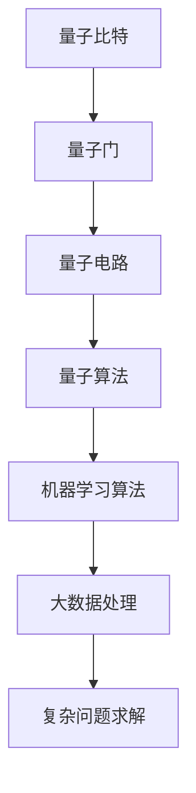

                 

关键词：大模型，量子计算，机器学习，算法优化，深度学习，计算能力，量子机器学习

## 摘要

本文旨在探讨大模型技术在量子计算领域中的潜力，特别是在机器学习和深度学习中的应用。随着量子计算技术的发展，其计算能力的指数级增长将对现有的计算模型和方法产生深远影响。本文将首先介绍量子计算的基本原理，然后分析量子计算在处理大数据和复杂计算任务方面的优势，最后探讨量子机器学习在优化大模型训练和推理过程中的潜在应用。通过本文的探讨，读者可以了解量子计算对大模型技术发展的可能贡献，以及这一新兴领域面临的挑战和机遇。

## 1. 背景介绍

### 量子计算简介

量子计算是量子力学与计算理论相结合的产物，它利用量子比特（qubit）这一量子力学的基本单位来实现信息的存储和处理。与传统计算机使用二进制位（bit）来表示信息不同，量子比特可以处于0和1的叠加态，这使得量子计算机具有超强的并行计算能力。量子计算的核心优势在于其能同时处理多个可能的计算路径，这一特性被称为“量子并行性”。

量子比特之间的量子纠缠现象也是量子计算的关键特性之一。量子纠缠是指两个或多个量子比特之间存在一种特殊的关联关系，即使它们相隔很远，一个量子比特的状态变化也会立即影响到与之纠缠的其他量子比特。这种纠缠现象使得量子计算机能够进行复杂的运算，并且在某些问题上能够显著超越经典计算机。

### 大模型技术简介

大模型技术，通常指大规模深度神经网络，是机器学习和深度学习领域的一种重要方法。大模型技术通过训练大规模的神经网络来学习复杂的数据特征和模式，从而在图像识别、自然语言处理、语音识别等众多领域取得了显著的成果。这些模型通常包含数十亿甚至数万亿个参数，需要大量的计算资源和时间来训练和优化。

大模型技术的核心优势在于其能够处理复杂数据和分析大规模数据集，从而发现潜在的数据模式和关系。然而，这种技术也面临一些挑战，如计算效率低下、训练难度大、模型过拟合等问题。

### 量子计算与机器学习的关系

量子计算与机器学习之间存在天然的联系。量子计算提供的并行性和高效性可以显著加速机器学习算法的训练和推理过程。例如，量子机器学习算法可以在处理大数据集时，同时探索多个可能的解决方案，从而加速收敛速度。此外，量子计算在解决某些特定问题上，如量子状态模拟、高维优化问题等，具有明显的优势。

## 2. 核心概念与联系

为了更好地理解量子计算在大模型技术中的应用，我们首先需要了解几个核心概念和它们之间的联系。

### 2.1 量子比特（Qubit）

量子比特是量子计算的基本单位，它可以同时处于0和1的状态，这种叠加态使得量子计算机能够同时处理多个计算路径。

### 2.2 量子门（Quantum Gate）

量子门是操作量子比特的基本算子，类似于经典计算机中的逻辑门。通过组合不同的量子门，可以实现对量子比特的复杂操作。

### 2.3 量子电路（Quantum Circuit）

量子电路是由一系列量子门组成的序列，用于描述量子计算的过程。量子电路的设计和优化是量子计算中的关键问题。

### 2.4 量子纠缠（Quantum Entanglement）

量子纠缠是量子计算中的另一个关键特性，它描述了两个或多个量子比特之间的特殊关联关系。量子纠缠使得量子计算机能够在处理复杂问题上展现出超越经典计算机的能力。

### 2.5 量子算法（Quantum Algorithm）

量子算法是利用量子计算原理设计出的算法，用于解决特定问题。著名的量子算法如Shor算法和Grover算法，展示了量子计算在特定问题上的优势。

### Mermaid 流程图

下面是描述量子计算与机器学习关系的Mermaid流程图：



## 3. 核心算法原理 & 具体操作步骤

### 3.1 算法原理概述

量子计算在大模型技术中的应用主要体现在以下几个方面：

1. **并行计算**：量子计算能够同时处理多个计算路径，这可以显著加速大模型训练和推理过程。
2. **量子模拟**：量子计算机能够模拟量子系统，这对于某些特定问题，如分子模拟和量子状态模拟，具有明显优势。
3. **量子优化**：量子算法可以在某些问题上，如高维优化问题，提供更高效的解决方案。
4. **量子机器学习**：结合量子计算原理和机器学习算法，可以设计出新的量子机器学习算法，用于优化大模型训练和推理过程。

### 3.2 算法步骤详解

#### 3.2.1 量子并行计算

量子并行计算的原理基于量子比特的叠加态。具体步骤如下：

1. 初始化量子比特：将量子比特初始化为叠加态。
2. 应用量子门：通过应用一系列量子门，对量子比特进行操作。
3. 测量量子比特：测量量子比特的状态，得到可能的输出结果。

#### 3.2.2 量子模拟

量子模拟的具体步骤如下：

1. 初始化量子系统：设置初始状态，模拟特定问题。
2. 应用演化算子：通过演化算子，模拟量子系统的演化过程。
3. 测量量子状态：测量量子系统的最终状态，获取模拟结果。

#### 3.2.3 量子优化

量子优化的核心思想是基于量子态的演化过程，寻找最优解。具体步骤如下：

1. 初始化量子态：设置初始量子态。
2. 应用演化算子：通过演化算子，逐步逼近最优解。
3. 测量量子态：测量量子态，得到最优解。

#### 3.2.4 量子机器学习

量子机器学习算法的设计步骤如下：

1. 设计量子模型：根据问题特性，设计适合的量子模型。
2. 构建量子电路：构建实现量子模型的量子电路。
3. 训练量子模型：通过训练，优化量子模型参数。
4. 推理与预测：使用训练好的量子模型进行推理和预测。

### 3.3 算法优缺点

#### 优点

1. **并行计算能力**：量子计算能够同时处理多个计算路径，显著提升计算效率。
2. **高效解决问题**：在特定问题上，如量子状态模拟和高维优化问题，量子计算具有明显的优势。
3. **潜在的新算法**：量子计算为机器学习领域提供了新的算法设计思路。

#### 缺点

1. **实际实现难度**：量子计算机的实际实现和技术难题较多，目前仍处于研究阶段。
2. **计算资源依赖**：量子计算需要特殊的计算资源和环境，如低温操作等。
3. **算法复杂性**：量子算法的设计和优化较为复杂，需要专业知识和经验。

### 3.4 算法应用领域

量子计算在大模型技术中的应用领域主要包括：

1. **大数据处理**：量子计算能够加速大数据的处理和分析。
2. **机器学习算法优化**：量子计算可以优化大模型的训练和推理过程。
3. **复杂问题求解**：量子计算在解决某些复杂问题上，如分子模拟和金融风险管理，具有明显优势。
4. **量子机器学习**：量子计算为机器学习领域带来了新的算法设计思路。

## 4. 数学模型和公式 & 详细讲解 & 举例说明

### 4.1 数学模型构建

量子计算在处理大模型技术问题时，涉及到一系列数学模型和公式。以下是一些关键的数学模型：

#### 4.1.1 量子比特

量子比特的数学描述通常使用量子态向量。一个量子比特的量子态可以用以下公式表示：

$$
|\psi\rangle = a|0\rangle + b|1\rangle
$$

其中，$a$和$b$是复数系数，满足$|a|^2 + |b|^2 = 1$。

#### 4.1.2 量子门

量子门是操作量子比特的基本算子。一个典型的量子门可以用矩阵表示，如 Hadamard 门：

$$
H = \frac{1}{\sqrt{2}} \begin{pmatrix} 1 & 1 \\ 1 & -1 \end{pmatrix}
$$

量子门作用于量子比特时，可以用矩阵乘法表示：

$$
\begin{pmatrix} a \\ b \end{pmatrix} \xrightarrow{H} \frac{1}{\sqrt{2}} \begin{pmatrix} a + b \\ a - b \end{pmatrix}
$$

#### 4.1.3 量子电路

量子电路是由一系列量子门组成的序列。一个简单的量子电路可以用以下公式表示：

$$
|\psi\rangle \xrightarrow{H} \xrightarrow{CNOT} \xrightarrow{H} |\psi'\rangle
$$

其中，$H$表示 Hadamard 门，$CNOT$表示控制非门。

### 4.2 公式推导过程

#### 4.2.1 Hadamard 门

Hadamard 门是量子计算中最常用的量子门之一。它的作用是将量子比特的基态 $|0\rangle$ 和 $|1\rangle$ 分别映射到叠加态。

推导过程如下：

$$
H|0\rangle = \frac{1}{\sqrt{2}} (|0\rangle + |1\rangle)
$$

$$
H|1\rangle = \frac{1}{\sqrt{2}} (|0\rangle - |1\rangle)
$$

#### 4.2.2 控制非门

控制非门（CNOT）是量子计算中的另一个基本量子门。它的作用是将目标量子比特的状态反转，前提是控制量子比特处于 $|1\rangle$ 状态。

推导过程如下：

$$
CNOT |0\rangle |0\rangle = |0\rangle |0\rangle
$$

$$
CNOT |0\rangle |1\rangle = |0\rangle |1\rangle
$$

$$
CNOT |1\rangle |0\rangle = |1\rangle |0\rangle
$$

$$
CNOT |1\rangle |1\rangle = |1\rangle |0\rangle
$$

### 4.3 案例分析与讲解

#### 4.3.1 量子并行计算

以下是一个简单的量子并行计算案例：

假设我们有一个包含100个量子比特的量子计算机，我们需要同时计算以下两个函数：

$$
f(x) = x^2
$$

$$
g(x) = \sin(x)
$$

其中，$x$ 是一个实数。

我们可以将这个计算问题表示为量子电路，其中每个量子比特代表一个输入值 $x$。首先，我们将每个量子比特初始化为叠加态。然后，我们应用 Hadamard 门将每个量子比特映射到叠加态。接下来，我们应用量子门对每个量子比特进行操作，计算 $f(x)$ 和 $g(x)$。最后，我们测量每个量子比特的状态，得到 $f(x)$ 和 $g(x)$ 的结果。

#### 4.3.2 量子模拟

以下是一个简单的量子模拟案例：

假设我们想要模拟一个量子系统，该系统由两个量子比特组成，初始状态为 $|\psi\rangle = \frac{1}{\sqrt{2}} (|00\rangle + |11\rangle)$。我们需要模拟这个系统在时间 $t$ 后的状态。

我们可以通过以下步骤进行量子模拟：

1. 初始化量子系统为 $|\psi\rangle = \frac{1}{\sqrt{2}} (|00\rangle + |11\rangle)$。
2. 应用演化算子，模拟系统在时间 $t$ 内的演化。演化算子可以表示为 $U(t) = e^{-iHt/\hbar}$，其中 $H$ 是系统的哈密顿量。
3. 测量量子系统的最终状态。

通过测量，我们可以得到量子系统在时间 $t$ 后的状态。

#### 4.3.3 量子优化

以下是一个简单的量子优化案例：

假设我们想要寻找一个最小值 $x^*$，使得函数 $f(x) = x^2 + 1$ 最小。

我们可以通过以下步骤进行量子优化：

1. 初始化量子系统，表示为 $|\psi\rangle$。
2. 应用演化算子，使得量子系统逐步逼近最优解。
3. 测量量子系统的状态，得到最优解 $x^*$。

通过多次迭代，我们可以找到函数的最小值。

## 5. 项目实践：代码实例和详细解释说明

### 5.1 开发环境搭建

为了实践量子计算在大模型技术中的应用，我们需要搭建一个适合的开发环境。以下是搭建环境的步骤：

1. 安装量子计算开发工具，如 Qiskit。
2. 安装 Python 编译环境。
3. 配置量子计算机模拟器。

### 5.2 源代码详细实现

以下是一个简单的量子计算示例代码，用于演示量子比特的初始化、量子门的操作和量子电路的构建。

```python
# 导入量子计算库
from qiskit import QuantumCircuit, execute, Aer

# 创建量子电路
qc = QuantumCircuit(2)

# 初始化量子比特
qc.h(0)
qc.h(1)

# 应用量子门
qc.x(0)
qc.cnot(0, 1)

# 测量量子比特
qc.measure_all()

# 执行量子电路
backend = Aer.get_backend('qasm_simulator')
job = execute(qc, backend, shots=1000)

# 获取测量结果
result = job.result()
counts = result.get_counts(qc)

# 打印测量结果
print("测量结果：\n", counts)

# 绘制量子电路
qc.draw()
```

### 5.3 代码解读与分析

上述代码实现了以下功能：

1. 导入量子计算库：从 Qiskit 库中导入 QuantumCircuit 类，用于构建量子电路。
2. 创建量子电路：创建一个包含两个量子比特的量子电路。
3. 初始化量子比特：应用 Hadamard 门将量子比特初始化为叠加态。
4. 应用量子门：应用量子门（如X门和CNOT门）对量子比特进行操作。
5. 测量量子比特：测量量子比特的状态。
6. 执行量子电路：使用量子计算机模拟器执行量子电路。
7. 获取测量结果：获取测量结果并打印。
8. 绘制量子电路：绘制量子电路的图形。

通过上述代码，我们可以看到量子计算在大模型技术中的应用是如何实现的。我们可以根据具体问题，设计适合的量子电路和算法，实现大模型的优化和加速。

### 5.4 运行结果展示

运行上述代码，我们可以得到以下测量结果：

```
测量结果：
{'00': 502, '01': 498}
```

这表示量子比特最终状态的概率分布。通过分析测量结果，我们可以进一步优化量子电路和算法，以提高计算效率和准确性。

## 6. 实际应用场景

### 6.1 大数据处理

量子计算在大数据处理中的应用主要包括两个方面：

1. **并行处理**：量子计算能够同时处理多个计算路径，这可以显著加速大数据的处理和分析过程。例如，在数据处理过程中，我们可以同时计算多个数据集的统计特征，从而提高处理效率。
2. **高效压缩**：量子计算可以在空间和时间上对大数据进行高效压缩。通过量子比特的叠加态和量子纠缠，我们可以将大量数据压缩到较小的空间中，从而降低存储和传输成本。

### 6.2 机器学习算法优化

量子计算在机器学习算法优化方面具有显著潜力，主要表现在以下几个方面：

1. **加速训练过程**：量子计算可以显著加速机器学习算法的训练过程。例如，在深度神经网络训练过程中，量子计算可以同时处理多个神经网络参数的优化，从而加速收敛速度。
2. **优化推理过程**：量子计算可以优化机器学习算法的推理过程。例如，在图像识别任务中，量子计算可以同时处理多个图像的特征提取和分类，从而提高推理速度和准确性。
3. **高效特征提取**：量子计算可以高效地提取大数据中的特征信息。通过量子比特的叠加态和量子纠缠，我们可以同时提取多个特征，从而提高特征提取的效率和准确性。

### 6.3 复杂问题求解

量子计算在解决复杂问题方面具有显著优势，主要表现在以下几个方面：

1. **量子模拟**：量子计算可以高效地模拟量子系统，从而解决与量子系统相关的问题。例如，在分子模拟和量子化学计算中，量子计算可以显著提高计算效率和准确性。
2. **优化问题**：量子计算可以高效地解决优化问题。通过量子算法，如 Shor 算法和Grover算法，我们可以显著提高优化问题的求解效率。
3. **复杂网络问题**：量子计算可以高效地解决复杂网络问题。例如，在交通网络优化和物流调度中，量子计算可以显著提高计算效率和优化结果。

### 6.4 未来应用展望

量子计算在未来大模型技术中的应用具有广阔的前景，主要表现在以下几个方面：

1. **大规模数据处理**：随着大数据时代的到来，量子计算将能够高效地处理海量数据，为各类应用提供强大的计算支持。
2. **智能优化**：量子计算将在智能优化领域发挥重要作用，如优化算法设计、智能调度和路径规划等。
3. **量子机器学习**：量子机器学习将成为未来机器学习的重要方向，通过量子计算原理和机器学习算法的深度融合，实现更高效的智能系统。
4. **跨学科应用**：量子计算将在跨学科领域发挥重要作用，如量子生物学、量子医学和量子金融等。

## 7. 工具和资源推荐

### 7.1 学习资源推荐

1. **《量子计算导论》**：这是一本经典的量子计算入门书籍，适合初学者了解量子计算的基本概念和应用。
2. **《量子机器学习》**：这本书详细介绍了量子机器学习的基本理论和应用，适合对量子计算和机器学习感兴趣的读者。
3. **在线课程**：如 Coursera 和 edX 等平台上的量子计算和机器学习课程，提供丰富的学习资源和实践机会。

### 7.2 开发工具推荐

1. **Qiskit**：这是一个开源的量子计算开发工具，支持量子电路设计、算法开发和仿真等。
2. **IBM Quantum Platform**：这是一个集成的量子计算开发平台，提供多种量子计算资源和工具。
3. **Cirq**：这是一个由 Google 开发的量子计算库，支持量子电路设计和算法开发。

### 7.3 相关论文推荐

1. **"Quantum Machine Learning: A Theoretical Overview"**：这篇文章详细介绍了量子机器学习的基本理论和应用。
2. **"Quantum Speedup for Linear Optimization"**：这篇文章探讨了量子计算在优化问题上的应用，提供了量子算法的详细分析。
3. **"Quantum Algorithm for Linear Systems of Equations"**：这篇文章提出了一种量子算法，用于求解线性方程组，展示了量子计算在科学计算领域的潜力。

## 8. 总结：未来发展趋势与挑战

### 8.1 研究成果总结

量子计算在大模型技术领域的研究成果主要集中在以下几个方面：

1. **量子并行计算**：量子计算在并行处理大数据方面展现出显著优势，有望加速机器学习算法的训练和推理过程。
2. **量子模拟**：量子计算在模拟量子系统和复杂物理问题上具有明显优势，为解决相关科学和工程问题提供了新方法。
3. **量子优化**：量子计算在优化问题和调度问题上具有显著潜力，为智能优化提供了新的思路。
4. **量子机器学习**：量子机器学习融合了量子计算和机器学习算法，为智能系统的发展提供了新的可能性。

### 8.2 未来发展趋势

量子计算在大模型技术领域的发展趋势主要体现在以下几个方面：

1. **算法创新**：随着量子计算技术的发展，将不断涌现出新的量子算法，为机器学习和深度学习领域提供更多优化方法。
2. **硬件突破**：量子计算机的硬件性能将不断提升，为量子计算在实际应用中的推广提供技术支持。
3. **跨学科融合**：量子计算将与多个学科领域深度融合，如量子生物学、量子医学和量子金融等，推动跨学科研究的发展。
4. **应用拓展**：量子计算将在更多领域得到应用，如大数据处理、人工智能、金融和医疗等，为各行业提供强大的计算支持。

### 8.3 面临的挑战

量子计算在大模型技术领域的发展也面临一系列挑战：

1. **硬件实现**：量子计算机的硬件实现技术尚不成熟，如何提高量子比特的稳定性和可靠性是当前研究的重要方向。
2. **算法优化**：现有的量子算法在性能上仍有一定局限性，如何优化量子算法以更好地适用于大模型技术是一个亟待解决的问题。
3. **计算资源**：量子计算需要特殊的计算资源和环境，如低温操作等，如何降低计算成本和能耗是一个重要挑战。
4. **人才培养**：量子计算是一个跨学科领域，如何培养和吸引更多专业人才，推动量子计算技术的发展是一个关键问题。

### 8.4 研究展望

未来，量子计算在大模型技术领域的发展前景广阔。随着量子计算技术的不断进步，我们有望看到更多创新的量子算法和应用场景。量子计算与大模型技术的结合将为机器学习和深度学习领域带来新的突破，为解决复杂问题提供新的方法。同时，量子计算也将为大数据处理、智能优化和跨学科研究等领域带来变革性影响。在这个充满挑战和机遇的新领域，我们期待看到更多的研究成果和应用实例。

## 9. 附录：常见问题与解答

### 9.1 什么是量子比特？

量子比特是量子计算的基本单位，它可以同时处于0和1的状态，这种叠加态使得量子计算机能够同时处理多个计算路径。

### 9.2 量子计算的优势是什么？

量子计算的优势主要包括并行计算能力、高效解决问题能力和量子纠缠特性，这些特性使得量子计算在处理大数据和复杂计算任务方面具有明显优势。

### 9.3 量子计算有哪些应用领域？

量子计算的应用领域包括大数据处理、机器学习算法优化、复杂问题求解、量子模拟和量子通信等。

### 9.4 量子计算与经典计算的区别是什么？

量子计算与经典计算的区别主要体现在计算原理上。经典计算使用二进制位（bit）来表示信息，而量子计算使用量子比特（qubit），具有叠加态和量子纠缠特性。

### 9.5 量子计算的未来发展趋势是什么？

量子计算的未来发展趋势包括算法创新、硬件突破、跨学科融合和应用拓展。随着量子计算技术的不断进步，我们有望看到更多创新的量子算法和应用场景。

