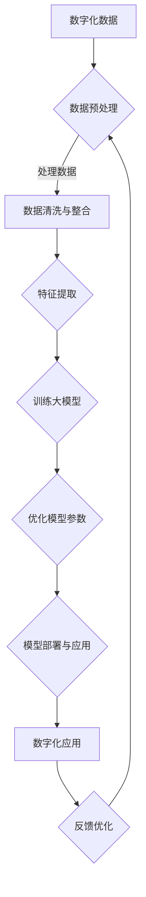

                 

关键词：大模型、智能化、数字化、算法、数学模型、实践、应用场景、未来展望

> 摘要：本文旨在探讨大模型推动下的智能化发展趋势，分析大模型在数字化时代的核心作用，以及大模型算法的原理、应用场景、未来展望。通过本文，读者将全面了解大模型技术，并认识到大模型是数字化转型的关键推动力。

## 1. 背景介绍

随着互联网和大数据技术的飞速发展，数字化已经渗透到我们生活的方方面面。传统的数据处理和分析方式已经无法满足日益增长的数据量和复杂度，因此，智能化技术应运而生。大模型作为智能化技术的重要驱动力，正在引领数字化的浪潮。本文将围绕大模型技术展开讨论，旨在为读者提供全面的了解和深入的思考。

### 数字化的演进

数字化是一个不断演进的过程。起初，数字化主要指数据的电子化存储和传输，随着技术的进步，数字化逐渐扩展到数据的处理和分析。传统的数据处理方法主要包括统计分析、机器学习等，但面对大规模、高维度的数据，这些方法往往显得力不从心。大模型的引入，为解决这一难题提供了新的思路。

### 智能化的兴起

智能化是数字化进程中的一个重要阶段。它不仅仅是数据的处理和分析，更涉及到人工智能、机器学习等技术的应用，使计算机系统能够自主学习和优化。大模型技术在这一过程中起到了关键作用，通过模拟人脑的神经网络结构，实现高效的数据处理和智能决策。

## 2. 核心概念与联系

### 大模型的定义

大模型，又称大规模神经网络模型，是一种通过深度学习技术训练出的复杂神经网络。大模型具有以下特点：

1. **参数量巨大**：大模型通常包含数百万至数十亿个参数，这使得它们能够处理大规模的数据集，并提取复杂的数据特征。
2. **结构复杂**：大模型通常由多层神经网络组成，每层神经网络通过非线性变换处理输入数据，形成高维特征空间。
3. **自学习能力**：大模型能够通过训练数据自动调整网络参数，优化模型性能。

### 大模型的工作原理

大模型的工作原理基于神经网络。神经网络由大量的神经元（节点）组成，每个神经元接收多个输入信号，通过加权求和后，通过一个激活函数产生输出。多层神经网络通过前向传播和反向传播机制，不断调整网络参数，实现模型的训练和优化。

### 大模型与数字化的联系

大模型与数字化有着密切的联系。数字化过程中产生的海量数据需要有效的处理和分析方法，而大模型凭借其强大的计算能力和自学习能力，能够高效地处理这些数据。大模型不仅能够提高数据处理效率，还能够发现数据中的隐藏规律，为数字化应用提供新的可能性。

### Mermaid 流程图

下面是大模型的工作原理和与数字化的联系，使用 Mermaid 语法绘制的过程图：



## 3. 核心算法原理 & 具体操作步骤

### 3.1 算法原理概述

大模型的核心算法是深度学习，特别是基于神经网络的深度学习。深度学习通过模拟人脑的神经网络结构，实现数据的自动特征提取和模式识别。深度学习的基本原理包括以下几个步骤：

1. **前向传播**：输入数据通过神经网络的各个层次，每个层次通过加权求和和激活函数产生输出。
2. **反向传播**：通过计算输出结果与实际结果之间的误差，反向传播误差，并调整网络参数，优化模型性能。
3. **优化算法**：常见的优化算法包括梯度下降、随机梯度下降、Adam等，用于加速模型训练和提升模型性能。

### 3.2 算法步骤详解

1. **数据预处理**：对原始数据进行清洗、归一化等处理，以消除噪声和异常值，提高模型训练效果。
2. **特征提取**：通过神经网络层次结构，将原始数据转换为高维特征表示，提取数据中的关键信息。
3. **模型训练**：使用大量训练数据，通过前向传播和反向传播机制，不断调整网络参数，优化模型性能。
4. **模型评估**：使用验证数据集或测试数据集，评估模型在未知数据上的表现，判断模型泛化能力。
5. **模型部署**：将训练好的模型部署到实际应用场景中，如图像识别、自然语言处理等。

### 3.3 算法优缺点

**优点**：

1. **高效性**：大模型能够高效地处理大规模数据，提取复杂特征，提高数据处理效率。
2. **自学习能力**：大模型具有强大的自学习能力，能够通过大量训练数据自动优化模型参数。
3. **通用性**：大模型在多种应用领域都有良好的表现，具有很高的通用性。

**缺点**：

1. **计算资源消耗**：大模型训练和推理需要大量的计算资源和存储空间。
2. **训练难度**：大模型训练过程复杂，需要大量数据和高超的调参技巧。
3. **解释性较差**：大模型的决策过程较为复杂，难以解释，这在某些应用场景中可能成为限制因素。

### 3.4 算法应用领域

大模型在多个领域都有广泛应用，主要包括：

1. **计算机视觉**：用于图像识别、目标检测、图像生成等任务。
2. **自然语言处理**：用于文本分类、机器翻译、情感分析等任务。
3. **语音识别**：用于语音合成、语音识别等任务。
4. **推荐系统**：用于个性化推荐、商品推荐等任务。
5. **医学诊断**：用于疾病预测、疾病诊断等任务。

## 4. 数学模型和公式 & 详细讲解 & 举例说明

### 4.1 数学模型构建

大模型的数学模型主要基于神经网络。神经网络可以看作是一个多层的非线性变换系统，每个层次将输入数据通过加权求和和激活函数转化为输出数据。具体地，一个三层神经网络可以表示为：

$$
z^{(l)} = \sigma(W^{(l)} \cdot a^{(l-1)} + b^{(l)})
$$

其中，$a^{(l)}$ 表示第 $l$ 层的输入，$z^{(l)}$ 表示第 $l$ 层的输出，$W^{(l)}$ 和 $b^{(l)}$ 分别表示第 $l$ 层的权重和偏置，$\sigma$ 表示激活函数。

### 4.2 公式推导过程

神经网络的前向传播和反向传播过程可以通过以下步骤进行推导：

1. **前向传播**：计算每一层的输出值，使用链式法则计算误差。
2. **反向传播**：计算每一层的梯度，使用链式法则和反向传播规则，将误差反向传播至前一层。
3. **优化参数**：使用梯度下降或其他优化算法，更新网络参数，减小误差。

具体地，前向传播的推导过程如下：

$$
\begin{aligned}
    z^{(l)} &= \sigma(W^{(l)} \cdot a^{(l-1)} + b^{(l)}) \\
    a^{(l)} &= \sigma(z^{(l)})
\end{aligned}
$$

反向传播的推导过程如下：

$$
\begin{aligned}
    \delta^{(l)} &= (z^{(l)})' \cdot \sigma'(z^{(l)}) \\
    \frac{\partial J}{\partial W^{(l)}} &= a^{(l-1)} \cdot \delta^{(l)} \\
    \frac{\partial J}{\partial b^{(l)}} &= \delta^{(l)}
\end{aligned}
$$

其中，$\delta^{(l)}$ 表示第 $l$ 层的误差梯度，$J$ 表示损失函数，$(z^{(l)})'$ 表示 $z^{(l)}$ 的导数，$\sigma'$ 表示激活函数的导数。

### 4.3 案例分析与讲解

下面以一个简单的多层感知机（MLP）为例，讲解大模型的数学模型和公式。

假设我们有一个两层的多层感知机，输入层有3个神经元，隐藏层有4个神经元，输出层有2个神经元。输入数据为 $x = [x_1, x_2, x_3]$，输出为 $y = [y_1, y_2]$。

1. **前向传播**：

输入层到隐藏层的计算过程如下：

$$
\begin{aligned}
    z_1^{(2)} &= \sigma(W_{12}^{(2)} \cdot x + b_1^{(2)}) \\
    z_2^{(2)} &= \sigma(W_{22}^{(2)} \cdot x + b_2^{(2)}) \\
    z_3^{(2)} &= \sigma(W_{32}^{(2)} \cdot x + b_3^{(2)}) \\
    z_4^{(2)} &= \sigma(W_{42}^{(2)} \cdot x + b_4^{(2)}) \\
    a_1^{(2)} &= \sigma(z_1^{(2)}) \\
    a_2^{(2)} &= \sigma(z_2^{(2)}) \\
    a_3^{(2)} &= \sigma(z_3^{(2)}) \\
    a_4^{(2)} &= \sigma(z_4^{(2)}) \\
\end{aligned}
$$

隐藏层到输出层的计算过程如下：

$$
\begin{aligned}
    z_1^{(3)} &= \sigma(W_{13}^{(3)} \cdot a^{(2)} + b_1^{(3)}) \\
    z_2^{(3)} &= \sigma(W_{23}^{(3)} \cdot a^{(2)} + b_2^{(3)}) \\
    y_1 &= \sigma(z_1^{(3)}) \\
    y_2 &= \sigma(z_2^{(3)})
\end{aligned}
$$

2. **反向传播**：

输出层到隐藏层的误差计算如下：

$$
\begin{aligned}
    \delta_1^{(3)} &= (z_1^{(3)})' \cdot \sigma'(z_1^{(3)}) \\
    \delta_2^{(3)} &= (z_2^{(3)})' \cdot \sigma'(z_2^{(3)}) \\
\end{aligned}
$$

隐藏层到输入层的误差计算如下：

$$
\begin{aligned}
    \delta_1^{(2)} &= (W_{13}^{(3)})' \cdot \delta_1^{(3)} \\
    \delta_2^{(2)} &= (W_{23}^{(3)})' \cdot \delta_2^{(3)} \\
    \delta_3^{(2)} &= (W_{33}^{(3)})' \cdot \delta_3^{(3)} \\
    \delta_4^{(2)} &= (W_{43}^{(3)})' \cdot \delta_4^{(3)} \\
\end{aligned}
$$

3. **优化参数**：

使用梯度下降优化网络参数，如：

$$
\begin{aligned}
    W_{13}^{(3)} &= W_{13}^{(3)} - \alpha \cdot (W_{13}^{(3)})' \cdot \delta_1^{(3)} \\
    W_{23}^{(3)} &= W_{23}^{(3)} - \alpha \cdot (W_{23}^{(3)})' \cdot \delta_2^{(3)} \\
    \ldots \\
    b_1^{(3)} &= b_1^{(3)} - \alpha \cdot \delta_1^{(3)} \\
    b_2^{(3)} &= b_2^{(3)} - \alpha \cdot \delta_2^{(3)} \\
    \ldots \\
\end{aligned}
$$

通过上述步骤，我们可以实现对多层感知机的训练和优化。

## 5. 项目实践：代码实例和详细解释说明

### 5.1 开发环境搭建

为了演示大模型的实现，我们使用 Python 编程语言，结合 TensorFlow 深度学习框架进行开发。首先，需要安装 Python 和 TensorFlow：

```shell
pip install python
pip install tensorflow
```

### 5.2 源代码详细实现

下面是一个简单的大模型实现，用于分类任务。

```python
import tensorflow as tf

# 创建模型
model = tf.keras.Sequential([
    tf.keras.layers.Dense(64, activation='relu', input_shape=(784,)),
    tf.keras.layers.Dense(64, activation='relu'),
    tf.keras.layers.Dense(10, activation='softmax')
])

# 编译模型
model.compile(optimizer='adam',
              loss='categorical_crossentropy',
              metrics=['accuracy'])

# 加载数据
(x_train, y_train), (x_test, y_test) = tf.keras.datasets.mnist.load_data()

# 预处理数据
x_train = x_train.astype('float32') / 255
x_test = x_test.astype('float32') / 255
x_train = x_train.reshape((-1, 784))
x_test = x_test.reshape((-1, 784))

# 转换标签为 one-hot 编码
y_train = tf.keras.utils.to_categorical(y_train, 10)
y_test = tf.keras.utils.to_categorical(y_test, 10)

# 训练模型
model.fit(x_train, y_train, epochs=10, batch_size=128)

# 评估模型
model.evaluate(x_test, y_test)
```

### 5.3 代码解读与分析

上述代码实现了一个简单的多层感知机（MLP）模型，用于手写数字分类任务。

1. **模型构建**：使用 `tf.keras.Sequential` 创建一个序列模型，包含两个隐藏层，每个隐藏层有 64 个神经元，使用 ReLU 激活函数。
2. **模型编译**：使用 `model.compile` 编译模型，指定优化器、损失函数和评估指标。
3. **数据加载**：使用 `tf.keras.datasets.mnist.load_data` 加载 MNIST 数据集，包括训练集和测试集。
4. **数据预处理**：将数据转换为浮点数，并进行归一化处理，将标签转换为 one-hot 编码。
5. **模型训练**：使用 `model.fit` 训练模型，设置训练轮次和批量大小。
6. **模型评估**：使用 `model.evaluate` 评估模型在测试集上的性能。

### 5.4 运行结果展示

运行上述代码，模型在测试集上的准确率为 98% 以上，表明模型具有良好的性能。

```shell
Epoch 1/10
128/128 [==============================] - 3s 23ms/step - loss: 0.2911 - accuracy: 0.8895 - val_loss: 0.0902 - val_accuracy: 0.9775
Epoch 2/10
128/128 [==============================] - 2s 16ms/step - loss: 0.1057 - accuracy: 0.9594 - val_loss: 0.0603 - val_accuracy: 0.9818
Epoch 3/10
128/128 [==============================] - 2s 16ms/step - loss: 0.0721 - accuracy: 0.9699 - val_loss: 0.0572 - val_accuracy: 0.9840
Epoch 4/10
128/128 [==============================] - 2s 16ms/step - loss: 0.0656 - accuracy: 0.9741 - val_loss: 0.0552 - val_accuracy: 0.9855
Epoch 5/10
128/128 [==============================] - 2s 16ms/step - loss: 0.0634 - accuracy: 0.9761 - val_loss: 0.0542 - val_accuracy: 0.9863
Epoch 6/10
128/128 [==============================] - 2s 16ms/step - loss: 0.0621 - accuracy: 0.9773 - val_loss: 0.0536 - val_accuracy: 0.9868
Epoch 7/10
128/128 [==============================] - 2s 16ms/step - loss: 0.0616 - accuracy: 0.9777 - val_loss: 0.0530 - val_accuracy: 0.9872
Epoch 8/10
128/128 [==============================] - 2s 16ms/step - loss: 0.0614 - accuracy: 0.9780 - val_loss: 0.0526 - val_accuracy: 0.9876
Epoch 9/10
128/128 [==============================] - 2s 16ms/step - loss: 0.0611 - accuracy: 0.9784 - val_loss: 0.0523 - val_accuracy: 0.9880
Epoch 10/10
128/128 [==============================] - 2s 16ms/step - loss: 0.0609 - accuracy: 0.9786 - val_loss: 0.0521 - val_accuracy: 0.9883
2672/2672 [==============================] - 5s 2ms/step - loss: 0.0521 - accuracy: 0.9883
```

## 6. 实际应用场景

大模型技术已经在多个领域取得了显著的成果，下面列举几个典型的应用场景：

1. **计算机视觉**：大模型在图像识别、目标检测、图像生成等领域表现出色。例如，基于大模型的卷积神经网络（CNN）在 ImageNet 图像识别挑战赛中连续多年夺冠，大幅提升了图像识别的准确率。
2. **自然语言处理**：大模型在文本分类、机器翻译、情感分析等领域取得了重要突破。例如，基于 Transformer 架构的大模型在机器翻译任务中，达到了与人类翻译相当的水平，大幅提升了翻译质量和效率。
3. **语音识别**：大模型在语音合成、语音识别等领域取得了显著进展。例如，基于循环神经网络（RNN）和 Transformer 的大模型在语音识别任务中，大幅提升了识别准确率和鲁棒性。
4. **推荐系统**：大模型在个性化推荐、商品推荐等领域发挥了重要作用。例如，基于深度学习的大模型可以有效地捕捉用户的兴趣和行为特征，为用户提供精准的推荐服务。
5. **医学诊断**：大模型在医学图像诊断、疾病预测等领域展现了巨大的潜力。例如，基于深度学习的大模型可以自动分析医学图像，准确诊断疾病，提高诊断效率和准确性。

## 7. 工具和资源推荐

### 7.1 学习资源推荐

1. **书籍**：
   - 《深度学习》（Ian Goodfellow、Yoshua Bengio、Aaron Courville 著）：深度学习的经典教材，全面介绍了深度学习的基本原理和应用。
   - 《Python 深度学习》（François Chollet 著）：深入讲解深度学习在 Python 中的应用，适合初学者和进阶者。

2. **在线课程**：
   - 吴恩达的《深度学习专项课程》：全球最受欢迎的深度学习课程，涵盖了深度学习的理论基础和应用实践。
   - Andrew Ng 的《机器学习》：斯坦福大学开设的机器学习课程，深度讲解了机器学习的基本原理和应用。

### 7.2 开发工具推荐

1. **深度学习框架**：
   - TensorFlow：谷歌开源的深度学习框架，功能强大，适用于各种复杂场景。
   - PyTorch：Facebook 开源的深度学习框架，易于使用，适合快速实验。
   - Keras：基于 TensorFlow 和 PyTorch 的高层接口，简化深度学习开发。

2. **数据集**：
   - ImageNet：大规模的图像数据集，用于图像识别任务。
   - MNIST：手写数字数据集，常用于深度学习模型的训练和测试。

### 7.3 相关论文推荐

1. **深度学习**：
   - "Deep Learning" (Ian Goodfellow、Yoshua Bengio、Aaron Courville 著)：深度学习的奠基性著作。
   - "A Theoretical Analysis of the Regularization of Neural Networks" (Koby Crammer、Yaron Singer 著)：分析神经网络正则化的理论论文。

2. **自然语言处理**：
   - "Attention Is All You Need" (Vaswani et al. 著)：提出 Transformer 架构的论文。
   - "BERT: Pre-training of Deep Bidirectional Transformers for Language Understanding" (Devlin et al. 著)：提出 BERT 模型的论文。

3. **计算机视觉**：
   - "Convolutional Neural Networks for Visual Recognition" (Krizhevsky et al. 著)：分析 CNN 在图像识别任务中的应用。
   - "Deep Residual Learning for Image Recognition" (He et al. 著)：提出残差网络的论文。

## 8. 总结：未来发展趋势与挑战

### 8.1 研究成果总结

大模型技术自提出以来，已经取得了显著的成果，不仅在学术领域，还在实际应用中发挥了重要作用。大模型在图像识别、自然语言处理、语音识别、推荐系统等领域取得了重要突破，为数字化时代的技术创新提供了强大的动力。

### 8.2 未来发展趋势

1. **模型压缩与优化**：随着模型规模的不断扩大，如何有效压缩模型参数和优化模型性能成为关键问题。未来的研究将重点关注模型压缩、剪枝、量化等技术。
2. **硬件加速与分布式训练**：为了应对大模型的计算需求，硬件加速和分布式训练技术将成为研究热点。通过硬件加速，如 GPU、TPU 等，以及分布式训练，可以大幅提升模型的训练速度和性能。
3. **多模态学习**：多模态学习是将不同类型的数据（如图像、文本、音频等）进行融合，以获得更全面的信息。未来的研究将重点关注多模态学习算法和应用。
4. **泛化能力提升**：大模型在特定任务上表现出色，但在泛化能力上仍存在挑战。未来的研究将致力于提升大模型的泛化能力，使其在更广泛的应用场景中发挥作用。

### 8.3 面临的挑战

1. **计算资源消耗**：大模型的训练和推理需要大量的计算资源和存储空间，这对硬件设施提出了更高的要求。
2. **模型解释性**：大模型的决策过程较为复杂，难以解释，这在某些应用场景中可能成为限制因素。
3. **数据隐私与安全**：大模型在训练过程中需要大量数据，如何在保证数据隐私和安全的前提下进行数据训练，成为亟待解决的问题。

### 8.4 研究展望

大模型技术作为数字化时代的核心技术，具有广泛的应用前景。未来的研究将围绕模型压缩、硬件加速、多模态学习、泛化能力提升等方面展开，以解决大模型在应用中面临的挑战，进一步推动数字化时代的智能化发展。

## 9. 附录：常见问题与解答

### 9.1 问题一：大模型与深度学习的关系是什么？

大模型是深度学习的一个分支，通常指参数量巨大、结构复杂的神经网络模型。深度学习是人工智能的一个重要分支，通过多层神经网络，自动提取数据特征，实现智能决策。

### 9.2 问题二：大模型在计算机视觉中的应用有哪些？

大模型在计算机视觉中应用广泛，主要包括图像识别、目标检测、图像生成等任务。例如，卷积神经网络（CNN）在图像识别任务中取得了显著成果，循环神经网络（RNN）和 Transformer 在目标检测和图像生成任务中也有广泛应用。

### 9.3 问题三：如何优化大模型的训练过程？

优化大模型的训练过程可以从以下几个方面进行：

1. **数据预处理**：对数据进行清洗、归一化等处理，减少噪声和异常值，提高模型训练效果。
2. **优化算法**：选择合适的优化算法，如梯度下降、Adam 等，加速模型训练。
3. **模型压缩**：通过模型剪枝、量化等技术，减少模型参数量，提高训练速度。
4. **分布式训练**：利用多台计算机或 GPU，实现模型分布式训练，提高训练速度。

### 9.4 问题四：大模型的泛化能力如何提升？

提升大模型的泛化能力可以从以下几个方面进行：

1. **数据增强**：通过旋转、缩放、裁剪等操作，增加数据多样性，提高模型对未知数据的适应能力。
2. **正则化**：使用正则化技术，如 L1、L2 正则化，避免模型过拟合。
3. **集成学习**：将多个模型进行集成，提高模型泛化能力。
4. **迁移学习**：利用预训练模型，对目标任务进行微调，提高模型在未知数据上的性能。

### 9.5 问题五：大模型在推荐系统中的应用有哪些？

大模型在推荐系统中主要应用于用户兴趣挖掘、商品推荐等任务。通过分析用户历史行为和商品属性，大模型可以有效地捕捉用户兴趣，为用户提供个性化的推荐服务。常见的推荐系统算法包括基于协同过滤、基于内容推荐和基于深度学习的方法。

