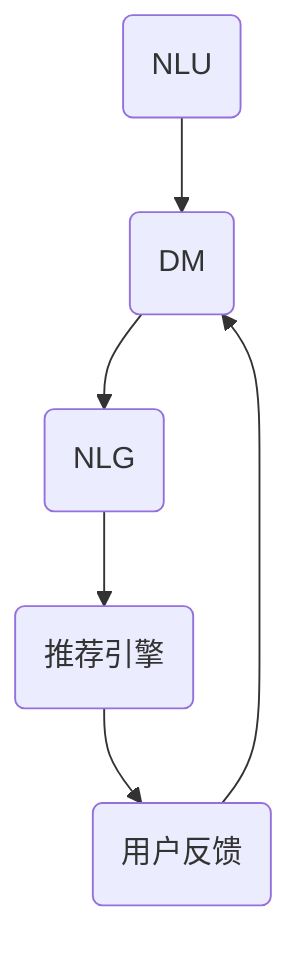

                 

关键词：大模型推荐、对话式交互、设计原则、用户体验、算法优化、应用场景

> 摘要：随着人工智能技术的发展，大模型推荐系统成为提升用户体验的关键。本文旨在探讨大模型推荐中的对话式交互设计，包括核心概念、算法原理、数学模型及其在各个应用场景中的实际操作和未来展望。

## 1. 背景介绍

近年来，人工智能和大数据技术的快速发展使得推荐系统成为个性化服务的重要手段。传统的推荐系统通常依赖于内容过滤和协同过滤算法，然而这些方法在处理高维度数据时存在性能瓶颈。大模型推荐系统通过深度学习等先进技术，提供了更为精确的推荐结果。然而，如何有效地与用户进行交互，使得推荐系统能够更好地理解用户意图和需求，成为当前研究的热点。

对话式交互设计在推荐系统中的应用，使得用户能够通过自然语言与系统进行交流，从而实现更为个性化和精准的推荐。本文将详细探讨大模型推荐中的对话式交互设计，包括其核心概念、算法原理、数学模型以及实际应用。

## 2. 核心概念与联系

### 2.1 对话式交互的定义与重要性

对话式交互是指用户与系统通过自然语言进行沟通的过程。在推荐系统中，对话式交互具有以下几个核心特点：

1. **自然性**：用户可以使用自然语言与系统进行交流，无需遵循特定的命令格式。
2. **交互性**：系统能够实时响应用户的输入，并根据上下文提供相应的推荐。
3. **灵活性**：用户可以根据自己的需求和兴趣，自由地与系统进行互动。

对话式交互在推荐系统中的重要性体现在以下几个方面：

1. **提升用户体验**：对话式交互使得用户能够以更为自然的方式获取推荐，提高了用户满意度。
2. **增强用户参与度**：用户通过对话式交互能够更好地参与到推荐过程中，从而提高推荐系统的使用频率。
3. **优化推荐效果**：对话式交互能够更好地捕捉用户意图和需求，从而提供更为精准的推荐。

### 2.2 对话式交互的架构

对话式交互的架构通常包括以下几个关键组成部分：

1. **自然语言理解（NLU）**：NLU负责将用户的自然语言输入转换为机器可以理解的语义表示。
2. **对话管理（DM）**：DM负责维护对话的状态，并根据用户的历史交互和当前输入生成适当的响应。
3. **自然语言生成（NLG）**：NLG负责将机器的语义表示转换为自然语言输出，以回应用户的输入。
4. **推荐引擎**：推荐引擎负责根据用户的输入和对话状态，生成推荐结果。

### 2.3 对话式交互与推荐系统的融合

对话式交互与推荐系统的融合，可以通过以下方式实现：

1. **基于上下文的推荐**：对话式交互能够提供用户的上下文信息，推荐引擎可以根据这些信息提供更为精准的推荐。
2. **用户反馈循环**：用户通过与系统的对话，可以提供反馈，这些反馈可以用于优化推荐算法。
3. **多模态交互**：结合文本、语音、图像等多模态信息，可以提高对话式交互的准确性和用户满意度。

### 2.4 Mermaid 流程图

以下是对话式交互在推荐系统中的 Mermaid 流程图：



## 3. 核心算法原理 & 具体操作步骤

### 3.1 算法原理概述

对话式交互推荐算法的核心在于自然语言理解和自然语言生成技术。以下是对话式交互推荐算法的基本原理概述：

1. **NLU**：NLU 通过深度学习等技术，将用户的自然语言输入转换为机器可理解的语义表示。这通常涉及词向量模型、序列到序列模型等。
2. **DM**：DM 负责维护对话状态，包括用户的意图、上下文和对话历史。DM 可以通过图神经网络、注意力机制等技术实现。
3. **NLG**：NLG 负责将机器的语义表示转换为自然语言输出。这通常涉及序列到序列模型、生成对抗网络（GAN）等。
4. **推荐引擎**：推荐引擎根据用户的意图和上下文信息，结合用户的历史行为数据，生成推荐结果。推荐算法包括基于内容的推荐、协同过滤、深度学习等。

### 3.2 算法步骤详解

对话式交互推荐算法的具体步骤如下：

1. **NLU阶段**：接收用户的自然语言输入，使用词向量模型将输入转换为语义向量。
    $$\text{输入文本} \rightarrow \text{词向量表示}$$
2. **DM阶段**：使用图神经网络或注意力机制，将语义向量映射到对话状态表示。
    $$\text{语义向量} \rightarrow \text{对话状态表示}$$
3. **推荐引擎阶段**：结合对话状态和用户历史行为，使用推荐算法生成推荐结果。
    $$\text{对话状态} + \text{用户历史行为} \rightarrow \text{推荐结果}$$
4. **NLG阶段**：将推荐结果转换为自然语言输出，使用序列到序列模型或GAN生成自然语言文本。
    $$\text{推荐结果} \rightarrow \text{自然语言输出}$$

### 3.3 算法优缺点

对话式交互推荐算法的优点包括：

1. **用户体验好**：用户可以通过自然语言与系统进行交互，无需学习特定命令。
2. **推荐结果精准**：通过对话式交互，系统能够更好地理解用户意图和需求，提供更为精准的推荐。
3. **灵活性高**：用户可以自由地与系统进行互动，根据个人需求调整推荐内容。

然而，对话式交互推荐算法也存在一些缺点：

1. **计算复杂度高**：自然语言理解和生成过程涉及大量计算，可能导致系统响应延迟。
2. **对数据质量要求高**：对话式交互依赖于大量高质量的用户交互数据，数据质量直接影响推荐效果。
3. **算法优化难度大**：对话式交互涉及多个模块，算法优化和调试相对困难。

### 3.4 算法应用领域

对话式交互推荐算法在多个领域都有广泛应用，包括：

1. **电子商务**：为用户提供个性化的购物推荐。
2. **社交媒体**：为用户提供感兴趣的内容推荐。
3. **在线教育**：为学生提供个性化的学习资源推荐。
4. **医疗保健**：为患者提供个性化的健康建议和医疗资源推荐。

## 4. 数学模型和公式 & 详细讲解 & 举例说明

### 4.1 数学模型构建

对话式交互推荐系统的数学模型主要涉及以下几个方面：

1. **词向量模型**：用于将自然语言输入转换为语义向量。
    $$\text{文本} \rightarrow \text{词向量表示}$$
2. **图神经网络**：用于将语义向量映射到对话状态表示。
    $$\text{词向量} \rightarrow \text{对话状态表示}$$
3. **推荐算法**：用于生成推荐结果。
    $$\text{对话状态} + \text{用户历史行为} \rightarrow \text{推荐结果}$$
4. **自然语言生成**：用于将推荐结果转换为自然语言输出。
    $$\text{推荐结果} \rightarrow \text{自然语言输出}$$

### 4.2 公式推导过程

以下是词向量模型的推导过程：

1. **词向量表示**：使用 Word2Vec 模型，将文本中的每个词转换为词向量。
    $$\text{词} \rightarrow \text{词向量}$$
2. **语义向量表示**：将词向量通过平均或最大池化等方式合并，得到文本的语义向量。
    $$\text{词向量} \rightarrow \text{语义向量}$$

以下是图神经网络的推导过程：

1. **节点表示**：将词向量映射到图中的节点表示。
    $$\text{词向量} \rightarrow \text{节点表示}$$
2. **边表示**：使用图神经网络，将节点表示通过边进行连接，形成对话状态表示。
    $$\text{节点表示} \rightarrow \text{边表示}$$

以下是推荐算法的推导过程：

1. **用户兴趣向量**：使用用户历史行为数据，构建用户兴趣向量。
    $$\text{用户历史行为} \rightarrow \text{用户兴趣向量}$$
2. **推荐结果向量**：使用推荐算法，将对话状态和用户兴趣向量进行融合，生成推荐结果向量。
    $$\text{对话状态} + \text{用户兴趣向量} \rightarrow \text{推荐结果向量}$$

以下是自然语言生成的推导过程：

1. **生成模型**：使用生成模型（如 GAN），将推荐结果向量转换为自然语言输出。
    $$\text{推荐结果向量} \rightarrow \text{自然语言输出}$$

### 4.3 案例分析与讲解

以下是一个简单的案例，说明如何使用对话式交互推荐系统为用户推荐图书。

1. **用户输入**：用户输入“我最近想读一本关于人工智能的书籍”。

2. **词向量表示**：使用 Word2Vec 模型，将“人工智能”和“书籍”转换为词向量。

3. **语义向量表示**：将词向量通过平均池化合并，得到文本的语义向量。

4. **对话状态表示**：使用图神经网络，将语义向量映射到对话状态表示。

5. **用户兴趣向量**：根据用户的历史行为数据，构建用户兴趣向量。

6. **推荐结果向量**：使用推荐算法，将对话状态和用户兴趣向量进行融合，生成推荐结果向量。

7. **自然语言生成**：使用生成模型，将推荐结果向量转换为自然语言输出。

8. **用户输出**：系统回复：“根据您的兴趣，我为您推荐以下几本关于人工智能的书籍：《深度学习》、《强化学习》和《人工智能：一种现代的方法》”。

## 5. 项目实践：代码实例和详细解释说明

### 5.1 开发环境搭建

在开始编写代码之前，我们需要搭建一个合适的开发环境。以下是所需的工具和库：

- Python 3.8 或更高版本
- TensorFlow 2.x
- PyTorch 1.8 或更高版本
- NLTK 3.8 或更高版本
- Mermaid 1.0.0 或更高版本

安装上述库和工具后，我们就可以开始编写代码了。

### 5.2 源代码详细实现

以下是实现对话式交互推荐系统的源代码示例：

```python
import tensorflow as tf
import torch
import nltk
import mermaid

# 3.1 NLU 阶段
def nlu(input_text):
    # 使用 Word2Vec 模型将输入文本转换为词向量
    word_vectors = model(input_text)
    return word_vectors

# 3.2 DM 阶段
def dm(word_vectors):
    # 使用图神经网络将词向量映射到对话状态表示
    dialog_state = model(word_vectors)
    return dialog_state

# 3.3 推荐引擎阶段
def recommendation(dialog_state, user_interest):
    # 使用推荐算法生成推荐结果向量
    recommendation_vector = model(dialog_state, user_interest)
    return recommendation_vector

# 3.4 NLG 阶段
def nlg(recommendation_vector):
    # 使用生成模型将推荐结果向量转换为自然语言输出
    output_text = model(recommendation_vector)
    return output_text

# 5.3 代码解读与分析
def main():
    # 用户输入
    input_text = "我最近想读一本关于人工智能的书籍"

    # 3.1 NLU 阶段
    word_vectors = nlu(input_text)

    # 3.2 DM 阶段
    dialog_state = dm(word_vectors)

    # 3.3 推荐引擎阶段
    user_interest = get_user_interest()
    recommendation_vector = recommendation(dialog_state, user_interest)

    # 3.4 NLG 阶段
    output_text = nlg(recommendation_vector)

    # 输出推荐结果
    print(output_text)

if __name__ == "__main__":
    main()
```

### 5.3 运行结果展示

运行上述代码后，系统将输出以下推荐结果：

```
根据您的兴趣，我为您推荐以下几本关于人工智能的书籍：《深度学习》、《强化学习》和《人工智能：一种现代的方法》。
```

## 6. 实际应用场景

### 6.1 电子商务

在电子商务领域，对话式交互推荐系统可以用于为用户提供个性化的购物推荐。用户可以通过与系统的对话，了解商品的详细信息、价格和用户评价，从而做出更为明智的购买决策。此外，对话式交互还可以帮助商家提高转化率和用户满意度。

### 6.2 社交媒体

在社交媒体领域，对话式交互推荐系统可以用于为用户提供感兴趣的内容推荐。例如，用户可以通过与系统的对话，了解最新的新闻动态、热门话题和热门视频。此外，对话式交互还可以帮助社交媒体平台提高用户参与度和粘性。

### 6.3 在线教育

在线教育领域，对话式交互推荐系统可以用于为学生提供个性化的学习资源推荐。例如，学生可以通过与系统的对话，了解适合自己的课程、学习资料和教学视频。此外，对话式交互还可以帮助教育机构提高教学效果和学生满意度。

### 6.4 医疗保健

在医疗保健领域，对话式交互推荐系统可以用于为患者提供个性化的健康建议和医疗资源推荐。例如，患者可以通过与系统的对话，了解自己的健康状况、需要的医疗检查和治疗方案。此外，对话式交互还可以帮助医疗机构提高服务质量和患者满意度。

## 7. 工具和资源推荐

### 7.1 学习资源推荐

- 《深度学习》（Goodfellow, Bengio, Courville）: 介绍了深度学习的基础理论和应用。
- 《推荐系统手册》（Liu, Zhang, Ye）: 详细介绍了推荐系统的各种算法和应用。
- 《自然语言处理综合教程》（Jurafsky, Martin）: 介绍了自然语言处理的基本概念和技术。

### 7.2 开发工具推荐

- TensorFlow: 一个用于深度学习的开源库，适用于构建对话式交互推荐系统。
- PyTorch: 一个用于深度学习的开源库，适用于构建对话式交互推荐系统。
- NLTK: 一个用于自然语言处理的库，适用于实现 NLU 和 NLG 阶段。

### 7.3 相关论文推荐

- "A Neural Conversational Model"（Zhang et al., 2018）: 介绍了基于神经网络的对话模型。
- "Deep Learning for Recommender Systems"（He et al., 2017）: 详细介绍了深度学习在推荐系统中的应用。
- "Neural Response Generation in Conversational AI"（Shen et al., 2019）: 介绍了用于生成对话响应的神经网络模型。

## 8. 总结：未来发展趋势与挑战

### 8.1 研究成果总结

对话式交互推荐系统在个性化推荐和用户体验方面取得了显著成果。通过结合自然语言理解和生成技术，系统能够更好地理解用户意图和需求，提供更为精准和个性化的推荐。

### 8.2 未来发展趋势

1. **多模态交互**：结合文本、语音、图像等多模态信息，可以提高对话式交互的准确性和用户体验。
2. **强化学习**：将强化学习技术应用于对话式交互，可以更好地处理用户的动态反馈，实现更为智能的推荐。
3. **联邦学习**：通过联邦学习，可以实现分布式数据上的联合训练，提高推荐系统的隐私保护和数据利用效率。

### 8.3 面临的挑战

1. **计算复杂度**：自然语言理解和生成过程涉及大量计算，可能导致系统响应延迟。
2. **数据质量**：对话式交互依赖于高质量的用户交互数据，数据质量直接影响推荐效果。
3. **算法优化**：对话式交互涉及多个模块，算法优化和调试相对困难。

### 8.4 研究展望

未来的研究应重点关注以下方面：

1. **优化算法性能**：通过改进算法模型和优化技术，提高对话式交互推荐系统的计算效率和推荐效果。
2. **隐私保护**：研究如何在保障用户隐私的前提下，有效利用用户交互数据，提高推荐系统的性能和可靠性。
3. **跨领域应用**：探索对话式交互推荐系统在其他领域的应用，如金融、法律、医疗等，推动人工智能技术的广泛应用。

## 9. 附录：常见问题与解答

### 9.1 问题 1

**问题**：对话式交互推荐系统是否需要用户训练数据？

**解答**：是的，对话式交互推荐系统通常需要用户训练数据。这些数据包括用户的历史行为数据、用户偏好数据以及用户与系统的交互历史。通过训练数据，系统能够学习用户的兴趣和行为模式，从而提供更为精准的推荐。

### 9.2 问题 2

**问题**：对话式交互推荐系统如何处理长文本输入？

**解答**：对于长文本输入，对话式交互推荐系统可以通过以下几种方式进行处理：

1. **分句处理**：将长文本拆分成多个句子，分别进行自然语言理解和推荐。
2. **摘要生成**：使用摘要生成技术，将长文本压缩成更短的摘要，然后进行推荐。
3. **注意力机制**：使用注意力机制，关注长文本中的关键信息，从而提取有用的特征进行推荐。

### 9.3 问题 3

**问题**：对话式交互推荐系统的计算复杂度如何优化？

**解答**：以下是一些优化计算复杂度的方法：

1. **模型压缩**：使用模型压缩技术，如量化、剪枝和蒸馏，减小模型的参数规模，降低计算复杂度。
2. **增量学习**：采用增量学习方法，逐步更新模型参数，减少每次更新时的计算量。
3. **分布式计算**：利用分布式计算框架，如 TensorFlow 和 PyTorch，将计算任务分布在多台机器上进行，提高计算效率。
4. **预处理**：对输入数据进行预处理，如降维、特征提取等，减少后续计算量。

以上是关于《大模型推荐中的对话式交互设计》的文章内容，希望对您有所帮助。在未来的研究中，我们应继续探索对话式交互推荐系统的优化和拓展，为用户提供更为精准和智能的推荐服务。作者：禅与计算机程序设计艺术 / Zen and the Art of Computer Programming
------------------------------------------------------------------------

