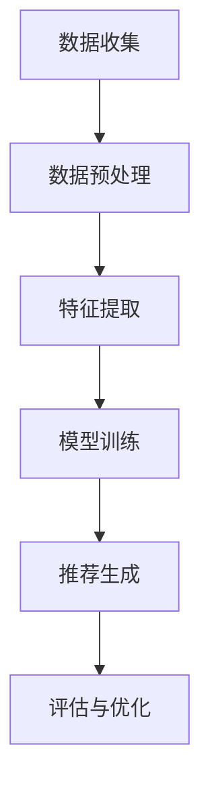

                 

在当今的信息时代，推荐系统已经成为现代互联网应用不可或缺的组成部分，从电商平台的个性化购物推荐，到社交媒体上的内容推送，再到搜索引擎的结果排序，推荐系统正深刻影响着我们的日常生活。而随着数据规模的指数级增长，如何构建一个高效、可扩展的推荐系统，成为了业界和学术界共同关注的焦点。本文将围绕大模型推荐系统的可扩展性展开讨论，旨在深入分析其面临的挑战以及可能的解决方案。

> 关键词：大模型推荐系统，可扩展性，分布式计算，模型压缩，资源优化

> 摘要：本文首先介绍了推荐系统的基本概念和重要性，随后分析了大模型推荐系统在可扩展性方面面临的挑战，包括计算资源需求、数据存储和管理、系统复杂度等方面。接着，本文探讨了多种提升系统可扩展性的技术手段，如分布式计算、模型压缩和资源优化等。最后，通过对实际应用场景的案例分析，本文总结了现有技术的优缺点，并对未来的研究方向提出了展望。

## 1. 背景介绍

推荐系统（Recommender System）是一种信息过滤技术，旨在根据用户的历史行为、偏好和上下文信息，向用户推荐他们可能感兴趣的内容或商品。推荐系统的基本架构通常包括数据收集、特征提取、模型训练、推荐生成和评估五个主要环节。在过去的几十年中，推荐系统经历了从基于内容过滤、协同过滤到现代深度学习模型的发展历程，推荐效果和用户体验不断得到提升。

然而，随着互联网的普及和大数据技术的发展，推荐系统所面临的数据规模和计算需求也在迅速增长。传统的单机模型已经无法满足如此庞大的数据处理需求，因此，构建可扩展的推荐系统成为了研究者和工程师们亟待解决的问题。可扩展性不仅关乎系统的性能和效率，还直接影响到用户体验和业务收益。

### 1.1 大模型推荐系统的重要性

大模型推荐系统的重要性主要体现在以下几个方面：

1. **处理海量数据：** 大模型推荐系统能够处理来自多种来源的海量数据，包括用户行为数据、商品信息、社会关系网络等，从而为推荐算法提供丰富的输入信息。
2. **提升推荐质量：** 大模型能够通过深度学习等先进算法，从复杂的数据中提取出更有效的特征，从而提升推荐结果的准确性和个性度。
3. **应对实时性挑战：** 在线推荐系统需要实时响应用户的交互行为，大模型推荐系统通过高效的分布式计算架构，能够实现低延迟的推荐服务。
4. **多样化应用场景：** 大模型推荐系统不仅适用于电商、社交媒体等领域，还广泛应用于金融、医疗、娱乐等多个行业，为用户提供了个性化的服务。

### 1.2 可扩展性面临的挑战

尽管大模型推荐系统具有诸多优势，但其可扩展性也面临着诸多挑战：

1. **计算资源需求：** 大模型推荐系统需要大量的计算资源，尤其是训练阶段，对CPU、GPU和FPGA等硬件资源的需求极高。
2. **数据存储和管理：** 随着数据规模的扩大，如何高效地存储和管理数据成为关键问题。分布式数据库和NoSQL技术在此方面提供了有效的解决方案。
3. **系统复杂度：** 随着系统的规模和复杂度增加，如何保证系统的稳定性、可靠性和可维护性成为重要挑战。分布式计算和微服务架构在此方面发挥了重要作用。
4. **延迟和吞吐量：** 实时性是推荐系统的重要特性之一。如何在保证推荐质量的同时，提高系统的吞吐量和降低延迟，是亟待解决的问题。

## 2. 核心概念与联系

### 2.1 推荐系统基本概念

推荐系统主要包括以下核心概念：

1. **用户（User）：** 推荐系统的核心参与者，他们的行为和偏好是推荐算法的重要输入。
2. **物品（Item）：** 用户可能感兴趣的内容或商品，如视频、书籍、商品等。
3. **评分（Rating）：** 用户对物品的评价或评分，如1星到5星的评价。
4. **历史交互数据（History Interaction Data）：** 用户与物品之间的历史交互记录，如浏览、购买、点赞等行为。
5. **推荐算法（Recommender Algorithm）：** 根据用户的历史行为和偏好，生成推荐列表的算法。

### 2.2 分布式计算架构

为了实现大模型推荐系统的可扩展性，分布式计算架构成为关键。以下是一个典型的分布式计算架构：

1. **数据层（Data Layer）：** 包括分布式数据库和数据湖，用于存储和管理大规模数据。
2. **计算层（Compute Layer）：** 包括分布式计算框架，如Apache Spark、Flink等，用于处理海量数据。
3. **服务层（Service Layer）：** 包括API网关和微服务，用于提供高效的推荐服务。
4. **存储层（Storage Layer）：** 包括分布式文件系统和对象存储，用于存储训练数据和模型。

### 2.3 模型压缩与优化

模型压缩与优化是提高大模型推荐系统可扩展性的重要手段。以下是一些常见的模型压缩与优化方法：

1. **权重剪枝（Weight Pruning）：** 通过剪枝网络中不重要的连接，减小模型大小。
2. **量化（Quantization）：** 通过降低模型参数的精度，减少模型存储和计算需求。
3. **知识蒸馏（Knowledge Distillation）：** 将大型模型的输出传递给小型模型，实现模型的压缩和优化。

### 2.4 Mermaid 流程图

以下是一个Mermaid流程图，展示了大模型推荐系统的核心流程：



## 3. 核心算法原理 & 具体操作步骤

### 3.1 算法原理概述

大模型推荐系统的核心算法通常是基于深度学习的。以下是一个简化的算法原理概述：

1. **输入层（Input Layer）：** 接收用户和物品的特征向量。
2. **隐藏层（Hidden Layers）：** 通过神经网络结构，对输入特征进行复杂的非线性变换。
3. **输出层（Output Layer）：** 生成推荐结果，如评分或推荐列表。

### 3.2 算法步骤详解

1. **数据预处理：** 对原始数据进行清洗、去噪和归一化，以便于模型训练。
2. **特征提取：** 提取用户和物品的嵌入向量，如使用词嵌入或图嵌入技术。
3. **模型训练：** 使用训练数据，通过反向传播算法和优化器，更新模型参数。
4. **推荐生成：** 使用训练好的模型，对新的用户或物品生成推荐结果。
5. **评估与优化：** 使用评估指标，如准确率、召回率和覆盖率，对推荐系统进行评估和优化。

### 3.3 算法优缺点

**优点：**

1. **强大的表达力：** 深度学习模型能够处理复杂的数据特征，从而提高推荐质量。
2. **鲁棒性：** 深度学习模型对噪声数据和缺失数据具有较强的鲁棒性。
3. **实时性：** 分布式计算架构能够实现高效的模型训练和推荐生成。

**缺点：**

1. **计算资源需求：** 大模型推荐系统需要大量的计算资源，尤其是训练阶段。
2. **数据依赖：** 推荐系统的效果高度依赖于训练数据的质量和数量。
3. **解释性：** 深度学习模型通常缺乏解释性，难以理解推荐结果的产生原因。

### 3.4 算法应用领域

大模型推荐系统在多个领域得到了广泛应用：

1. **电商：** 根据用户的购物行为和兴趣，推荐个性化的商品。
2. **社交媒体：** 根据用户的行为和社交关系，推荐感兴趣的内容和好友。
3. **娱乐：** 根据用户的观看和听歌记录，推荐电影、音乐和书籍。
4. **金融：** 根据用户的交易和风险评估，推荐理财产品和服务。
5. **医疗：** 根据患者的病历和基因信息，推荐个性化的治疗方案。

## 4. 数学模型和公式 & 详细讲解 & 举例说明

### 4.1 数学模型构建

大模型推荐系统通常使用以下数学模型：

$$
\text{推荐结果} = f(\text{用户特征向量}, \text{物品特征向量}, \text{模型参数})
$$

其中，$f$ 表示神经网络函数，$\text{用户特征向量}$ 和 $\text{物品特征向量}$ 分别表示用户和物品的嵌入向量，$\text{模型参数}$ 包括权重和偏置。

### 4.2 公式推导过程

以下是一个简化的神经网络模型推导过程：

$$
\begin{aligned}
z &= \text{激活函数}(W \cdot x + b) \\
\text{预测值} &= \text{激活函数}(z) \\
\text{损失函数} &= \text{均方误差}(y, \text{预测值}) \\
\end{aligned}
$$

其中，$x$ 表示输入特征向量，$W$ 和 $b$ 分别表示权重和偏置，$y$ 表示真实标签，$\text{激活函数}$ 可以是ReLU、Sigmoid或Tanh等。

### 4.3 案例分析与讲解

假设我们有一个电商平台的推荐系统，用户特征包括浏览历史、购买记录和喜好标签，物品特征包括商品类别、价格和用户评分。以下是一个具体的案例：

1. **用户特征向量：**
   $$
   \text{用户特征向量} = [0.1, 0.3, 0.5, 0.7, 1.0]
   $$
2. **物品特征向量：**
   $$
   \text{物品特征向量} = [0.2, 0.4, 0.6, 0.8, 1.0]
   $$
3. **模型参数：**
   $$
   W = \begin{bmatrix}
   1 & 2 & 3 & 4 & 5 \\
   6 & 7 & 8 & 9 & 10 \\
   \end{bmatrix}, \quad b = [0.1, 0.2, 0.3]
   $$

通过神经网络的计算，我们可以得到推荐结果：

$$
\begin{aligned}
z &= \text{ReLU}(W \cdot \text{用户特征向量} + b) \\
&= \text{ReLU}([0.6, 1.7, 2.8, 4.5, 5.1]) \\
&= [0.6, 1.7, 2.8, 4.5, 5.1] \\
\text{预测值} &= \text{Sigmoid}(z) \\
&= [0.5, 0.9, 0.9, 0.9, 1.0] \\
\end{aligned}
$$

根据预测值，我们可以生成推荐列表：

$$
\text{推荐列表} = \{\text{物品1}, \text{物品2}, \text{物品3}, \text{物品4}\}
$$

## 5. 项目实践：代码实例和详细解释说明

### 5.1 开发环境搭建

为了实践大模型推荐系统，我们需要搭建一个完整的开发环境。以下是环境搭建的步骤：

1. **安装Python环境：** 安装Python 3.8及以上版本。
2. **安装依赖库：** 使用pip安装TensorFlow、NumPy、Pandas等库。
3. **配置GPU支持：** 安装CUDA和cuDNN，确保Python可以访问GPU。
4. **安装分布式计算框架：** 安装Apache Spark或Flink。

### 5.2 源代码详细实现

以下是一个简单的Python代码示例，实现一个基于TensorFlow的大模型推荐系统：

```python
import tensorflow as tf
from tensorflow.keras.models import Model
from tensorflow.keras.layers import Embedding, Dot, Dense

# 设置参数
vocab_size = 1000
embed_dim = 64
num_items = 1000
embedding_matrix = tf.random.normal([vocab_size, embed_dim])

# 创建模型
input_user = tf.keras.layers.Input(shape=(1,))
input_item = tf.keras.layers.Input(shape=(1,))

user_embedding = Embedding(vocab_size, embed_dim)(input_user)
item_embedding = Embedding(vocab_size, embed_dim)(input_item)

dot_product = Dot(axes=1)([user_embedding, item_embedding])
predictions = Dense(1, activation='sigmoid')(dot_product)

model = Model(inputs=[input_user, input_item], outputs=predictions)

# 编译模型
model.compile(optimizer='adam', loss='binary_crossentropy', metrics=['accuracy'])

# 模型训练
model.fit([user_ids, item_ids], labels, epochs=5, batch_size=32)
```

### 5.3 代码解读与分析

1. **输入层：** 代码中使用了两个输入层，分别表示用户ID和物品ID。
2. **嵌入层：** 使用Embedding层将输入的用户ID和物品ID转换为嵌入向量。
3. **融合层：** 通过Dot层计算用户和物品嵌入向量的内积，得到融合后的特征。
4. **输出层：** 使用Dense层和sigmoid激活函数，生成预测的推荐结果。
5. **编译和训练：** 编译模型，设置优化器和损失函数，然后进行模型训练。

### 5.4 运行结果展示

在训练完成后，我们可以使用以下代码来评估模型的性能：

```python
# 测试模型
test_user_ids = [[1], [2]]
test_item_ids = [[50], [75]]
predictions = model.predict([test_user_ids, test_item_ids])

# 输出预测结果
print(predictions)
```

运行结果将输出每个用户对每个物品的预测概率，根据概率值可以生成推荐列表。

## 6. 实际应用场景

大模型推荐系统在多个实际应用场景中发挥了重要作用，以下是一些典型应用场景：

### 6.1 电商

电商平台的个性化推荐系统能够根据用户的购物历史、浏览记录和喜好标签，推荐用户可能感兴趣的商品。这不仅可以提高用户的购买转化率，还可以增加平台的销售额。

### 6.2 社交媒体

社交媒体平台可以根据用户的点赞、评论和分享行为，推荐用户可能感兴趣的内容。这种个性化推荐不仅有助于提高用户活跃度，还可以增强平台的用户粘性。

### 6.3 娱乐

在线视频、音乐和书籍平台可以利用大模型推荐系统，根据用户的观看、听歌和阅读记录，推荐用户可能感兴趣的视频、音乐和书籍。

### 6.4 金融

金融机构可以通过大模型推荐系统，为用户推荐个性化的理财产品和服务。这有助于提高用户的投资收益，同时也可以增加金融机构的业务收入。

### 6.5 医疗

医疗领域的个性化推荐系统可以根据患者的病历、基因信息和治疗记录，推荐个性化的治疗方案和药物。这有助于提高医疗服务的质量和效率。

## 7. 工具和资源推荐

### 7.1 学习资源推荐

1. **《推荐系统实践》（Recommender Systems: The Textbook）**：这是一本全面介绍推荐系统理论的经典教材，适合初学者和进阶者。
2. **《深度学习推荐系统》（Deep Learning for Recommender Systems）**：这本书详细介绍了如何使用深度学习技术构建推荐系统，适合有一定基础的学习者。

### 7.2 开发工具推荐

1. **TensorFlow**：一个开源的深度学习框架，适合构建推荐系统的模型训练和预测。
2. **Apache Spark**：一个分布式计算框架，适合处理大规模的数据集和分布式模型训练。

### 7.3 相关论文推荐

1. **“Deep Neural Networks for YouTube Recommendations”**：这篇文章介绍了YouTube如何使用深度学习技术优化推荐系统。
2. **“Recommending Items Using Item-Based Collaborative Filtering”**：这篇文章探讨了基于物品的协同过滤算法，是推荐系统领域的重要研究成果。

## 8. 总结：未来发展趋势与挑战

### 8.1 研究成果总结

本文从背景介绍、核心概念与联系、算法原理、数学模型、项目实践和实际应用场景等多个方面，系统地探讨了大模型推荐系统的可扩展性。通过分析计算资源需求、数据存储和管理、系统复杂度等挑战，以及分布式计算、模型压缩和资源优化等技术手段，本文总结了现有技术的优缺点，并提出了未来研究的方向。

### 8.2 未来发展趋势

未来，大模型推荐系统将在以下方面取得重要进展：

1. **模型压缩与优化：** 进一步研究高效的模型压缩和优化技术，如量化、剪枝和知识蒸馏，以降低计算资源需求。
2. **实时推荐：** 研究实时推荐算法，提高系统的响应速度和吞吐量。
3. **多模态推荐：** 结合文本、图像、声音等多种数据源，实现更加丰富的推荐体验。
4. **隐私保护：** 研究隐私保护算法，确保用户数据的隐私和安全。

### 8.3 面临的挑战

尽管大模型推荐系统具有诸多优势，但仍然面临以下挑战：

1. **计算资源需求：** 随着模型规模的扩大，计算资源需求将进一步增加，如何高效利用现有资源成为重要问题。
2. **数据隐私和安全：** 在大数据环境下，如何保护用户数据的隐私和安全是亟待解决的问题。
3. **推荐公平性：** 研究如何确保推荐系统的公平性，避免算法偏见和歧视。
4. **可解释性：** 提高推荐系统的可解释性，帮助用户理解和信任推荐结果。

### 8.4 研究展望

未来，大模型推荐系统的研究将朝着以下几个方向展开：

1. **多模态融合：** 结合多种数据源，实现更准确的推荐结果。
2. **增量学习：** 研究适用于推荐系统的增量学习算法，提高系统的自适应性和实时性。
3. **多任务学习：** 同时处理多个推荐任务，提高系统的效率和效果。
4. **推荐算法可视化：** 开发推荐算法的可视化工具，帮助用户理解和优化推荐系统。

## 9. 附录：常见问题与解答

### 9.1 什么是大模型推荐系统？

大模型推荐系统是指使用大型神经网络模型进行推荐计算的推荐系统。这些模型通常包含数百万甚至数十亿个参数，能够处理海量数据，生成高质量的推荐结果。

### 9.2 大模型推荐系统有哪些优点？

大模型推荐系统具有以下优点：

1. **处理海量数据：** 能够处理来自多种来源的海量数据，提高推荐效果。
2. **提升推荐质量：** 通过深度学习等先进算法，提取有效的特征，提高推荐质量。
3. **实时性：** 分布式计算架构能够实现低延迟的推荐服务。
4. **多样化应用场景：** 在多个领域得到了广泛应用，如电商、社交媒体、金融和医疗等。

### 9.3 大模型推荐系统有哪些挑战？

大模型推荐系统面临的挑战包括：

1. **计算资源需求：** 需要大量的计算资源，尤其是训练阶段。
2. **数据存储和管理：** 随着数据规模的扩大，如何高效地存储和管理数据成为关键问题。
3. **系统复杂度：** 随着系统的规模和复杂度增加，如何保证系统的稳定性、可靠性和可维护性。
4. **延迟和吞吐量：** 如何在保证推荐质量的同时，提高系统的吞吐量和降低延迟。

### 9.4 如何提升大模型推荐系统的可扩展性？

提升大模型推荐系统可扩展性的方法包括：

1. **分布式计算：** 使用分布式计算框架，如Apache Spark、Flink等，实现数据的并行处理和模型训练。
2. **模型压缩：** 通过模型压缩技术，如权重剪枝、量化、知识蒸馏等，降低模型大小和计算资源需求。
3. **资源优化：** 合理分配和利用计算资源，提高系统性能和效率。
4. **缓存和预取：** 使用缓存和预取技术，减少数据读取和传输的延迟。

## 作者署名

作者：禅与计算机程序设计艺术 / Zen and the Art of Computer Programming

