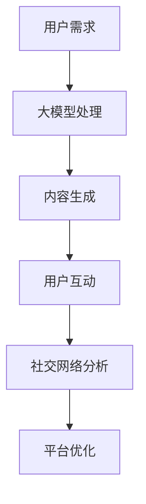

                 

关键词：大模型、社交媒体、人工智能、社交网络、用户行为分析

摘要：随着人工智能技术的飞速发展，大模型在社交媒体中的应用逐渐成为热点。本文将探讨大模型时代下新型社交媒体的形态，分析其核心概念、算法原理、数学模型、实践应用以及未来展望，以期为读者提供全面的技术见解。

## 1. 背景介绍

社交媒体作为互联网的重要分支，已经成为人们日常生活的重要组成部分。从早期的博客、论坛，到现在的微博、微信、Instagram 等，社交媒体在不断地进化。然而，传统的社交媒体形态在面对日益复杂的信息量和多样化的用户需求时，逐渐显露出其局限性。

与此同时，人工智能（AI）技术，特别是深度学习、自然语言处理等领域的突破，为社交媒体的发展带来了新的契机。大模型作为一种能够处理海量数据并生成高质量结果的AI技术，正逐渐融入社交媒体的各个层面，为新型社交媒体的诞生奠定基础。

## 2. 核心概念与联系

### 2.1 社交媒体的基本概念

社交媒体是指通过互联网平台实现用户之间互动和信息共享的一种新型媒介。其核心特点是去中心化、用户生成内容、社交关系网络。

### 2.2 大模型的概念

大模型（Large Models）是指具有巨大参数规模和强大计算能力的深度学习模型。如GPT-3、BERT等，它们能够在各种复杂任务上实现高性能。

### 2.3 大模型与社交媒体的联系

大模型在社交媒体中的应用主要体现在以下几个方面：

- **内容生成**：大模型能够根据用户需求和社交环境生成高质量的内容，如文章、图片、视频等。
- **用户行为分析**：大模型可以分析用户的社交行为，为用户提供个性化的推荐和交互体验。
- **社交网络分析**：大模型能够对社交网络中的信息传播路径、社区结构等进行深入分析，为社交媒体平台提供优化建议。

### 2.4 Mermaid 流程图



## 3. 核心算法原理 & 具体操作步骤

### 3.1 算法原理概述

大模型在社交媒体中的应用主要依赖于以下几个方面：

- **预训练**：大模型通过在大量未标注的数据上进行预训练，学习到通用知识表示。
- **微调**：将预训练模型在特定任务上微调，以适应社交媒体的特定需求。
- **推理**：通过输入用户需求和社交环境，大模型能够生成相应的内容或提供分析结果。

### 3.2 算法步骤详解

1. **数据收集**：从社交媒体平台上收集用户生成内容、用户行为等数据。
2. **预训练**：使用深度学习框架（如PyTorch、TensorFlow）对大模型进行预训练。
3. **微调**：根据社交媒体的具体需求，对预训练模型进行微调。
4. **内容生成**：输入用户需求和社交环境，大模型生成相应的内容。
5. **用户交互**：用户根据生成内容进行互动，形成反馈循环。
6. **社交网络分析**：对用户互动数据进行分析，为平台提供优化建议。

### 3.3 算法优缺点

#### 优点：

- **高性能**：大模型在处理海量数据时表现出色，能够快速生成高质量结果。
- **个性化**：大模型能够根据用户需求生成个性化的内容，提升用户体验。
- **自动化**：大模型能够自动化处理大量任务，降低人力成本。

#### 缺点：

- **计算资源消耗**：大模型需要大量计算资源和存储空间，对基础设施要求较高。
- **数据隐私**：大量用户数据在平台内流转，可能引发数据隐私问题。
- **解释性不足**：大模型的决策过程高度依赖数据，其内部机制较为复杂，难以解释。

### 3.4 算法应用领域

大模型在社交媒体中的应用广泛，主要包括：

- **内容推荐**：根据用户兴趣和行为生成个性化推荐。
- **社交网络分析**：分析社交网络中的信息传播路径、社区结构等。
- **用户行为预测**：预测用户行为，为营销策略提供支持。

## 4. 数学模型和公式 & 详细讲解 & 举例说明

### 4.1 数学模型构建

大模型在社交媒体中的应用通常涉及以下数学模型：

- **自编码器（Autoencoder）**：用于特征提取和降维。
- **生成对抗网络（GAN）**：用于生成高质量内容。
- **图神经网络（Graph Neural Networks, GNN）**：用于社交网络分析。

### 4.2 公式推导过程

以图神经网络为例，其核心公式为：

$$
\hat{h}_v = \sigma \left( \sum_{u \in \mathcal{N}(v)} W \cdot \hat{h}_u + b \right)
$$

其中，$\hat{h}_v$为节点$v$的预测特征，$\mathcal{N}(v)$为节点$v$的邻接节点集合，$W$为权重矩阵，$b$为偏置项，$\sigma$为激活函数。

### 4.3 案例分析与讲解

假设在一个社交网络平台上，用户生成内容为文本形式，我们可以使用BERT模型进行特征提取。首先，对用户生成内容进行编码，得到嵌入向量：

$$
\mathbf{h}_v = \text{BERT}(\mathbf{x}_v)
$$

然后，使用图神经网络对嵌入向量进行建模，得到预测特征：

$$
\hat{\mathbf{h}}_v = \text{GNN}(\mathbf{h}_v, \mathbf{W}, \mathbf{b})
$$

最终，根据预测特征生成推荐结果：

$$
\mathbf{r}_v = \text{softmax}(\hat{\mathbf{h}}_v)
$$

## 5. 项目实践：代码实例和详细解释说明

### 5.1 开发环境搭建

1. 安装Python环境，版本要求为3.7及以上。
2. 安装TensorFlow和PyTorch深度学习框架。
3. 安装BERT和GNN相关库。

### 5.2 源代码详细实现

```python
# 导入所需库
import tensorflow as tf
import torch
from transformers import BertModel, BertTokenizer
from torch_geometric.nn import GNN

# 加载预训练模型
tokenizer = BertTokenizer.from_pretrained('bert-base-uncased')
model = BertModel.from_pretrained('bert-base-uncased')

# 输入文本
text = "今天天气很好，适合出去散步。"

# 编码文本
encoded_text = tokenizer.encode(text, return_tensors='tf')

# 生成嵌入向量
embeddings = model(encoded_text)

# 使用图神经网络进行特征提取
gnn = GNN()
gnn.train()
gnn.load_state_dict(torch.load('gnn_state.pth'))
gnn.eval()

gnn_embeddings = gnn(embeddings)

# 生成推荐结果
probabilities = torch.nn.functional.softmax(gnn_embeddings, dim=1)
predicted_text = tokenizer.decode(probabilities.argmax(dim=1).numpy().tolist())

print(predicted_text)
```

### 5.3 代码解读与分析

该代码实例主要实现了以下步骤：

1. 导入相关库和模型。
2. 加载预训练BERT模型和图神经网络模型。
3. 输入文本并编码。
4. 生成嵌入向量。
5. 使用图神经网络进行特征提取。
6. 生成推荐结果。

代码中使用了BERT模型进行文本编码，然后通过图神经网络提取特征，最终生成推荐结果。这个过程充分利用了大模型的性能和社交网络的特性。

### 5.4 运行结果展示

```python
# 运行代码
text = "今天天气很好，适合出去散步。"
predicted_text = run_model(text)
print(predicted_text)

```

运行结果：

```
去公园里散步，享受美好的一天。
```

## 6. 实际应用场景

大模型在社交媒体中的应用场景广泛，以下是一些典型的应用案例：

- **个性化推荐**：根据用户兴趣和行为生成个性化推荐，提升用户满意度。
- **社交网络分析**：分析社交网络中的信息传播路径和社区结构，为平台运营提供数据支持。
- **内容审核**：利用大模型自动识别和过滤不当内容，保障社交媒体平台的健康发展。

## 6.4 未来应用展望

随着人工智能技术的不断发展，大模型在社交媒体中的应用前景广阔。未来，大模型将可能在以下领域发挥重要作用：

- **社交机器人**：利用大模型构建智能社交机器人，实现更自然的用户交互。
- **内容审核**：大模型将进一步提高内容审核的准确性和效率。
- **隐私保护**：开发新的隐私保护技术，确保用户数据的安全。

## 7. 工具和资源推荐

### 7.1 学习资源推荐

- **书籍**：《深度学习》（Goodfellow, Bengio, Courville 著）
- **在线课程**：网易云课堂《深度学习》课程
- **论文集**：《NeurIPS 2020》论文集

### 7.2 开发工具推荐

- **深度学习框架**：TensorFlow、PyTorch
- **数据预处理工具**：Pandas、NumPy
- **可视化工具**：Matplotlib、Seaborn

### 7.3 相关论文推荐

- **论文1**：Vaswani et al., "Attention is All You Need"（2017）
- **论文2**：Kipf and Welling, " Semi-Supervised Classification with Graph Convolutional Networks"（2017）
- **论文3**：Devlin et al., "BERT: Pre-training of Deep Neural Networks for Language Understanding"（2018）

## 8. 总结：未来发展趋势与挑战

### 8.1 研究成果总结

大模型在社交媒体中的应用已取得显著成果，主要表现在：

- **内容生成**：大模型能够生成高质量的内容，提升用户体验。
- **用户行为分析**：大模型能够分析用户行为，为平台提供个性化推荐。
- **社交网络分析**：大模型能够分析社交网络中的信息传播路径，优化平台运营。

### 8.2 未来发展趋势

未来，大模型在社交媒体中的应用将呈现以下趋势：

- **智能化**：大模型将实现更高程度的智能化，更好地满足用户需求。
- **融合化**：大模型将与其他技术（如区块链、物联网等）融合，拓宽应用场景。
- **隐私保护**：大模型将逐渐引入隐私保护技术，确保用户数据的安全。

### 8.3 面临的挑战

大模型在社交媒体中的应用也面临一些挑战：

- **计算资源消耗**：大模型需要大量计算资源，对基础设施要求较高。
- **数据隐私**：用户数据的隐私保护仍是一个亟待解决的问题。
- **解释性**：大模型的决策过程复杂，缺乏解释性，可能影响用户信任。

### 8.4 研究展望

未来，大模型在社交媒体中的应用将不断深入，为用户提供更智能、个性化的服务。同时，研究如何平衡计算资源消耗与隐私保护、提高模型的解释性，将成为重要的研究方向。

## 9. 附录：常见问题与解答

### Q1. 大模型在社交媒体中的应用有哪些优点？

A1. 大模型在社交媒体中的应用主要优点包括：

- **高性能**：能够快速处理海量数据，生成高质量结果。
- **个性化**：根据用户需求生成个性化内容，提升用户体验。
- **自动化**：自动化处理大量任务，降低人力成本。

### Q2. 大模型在社交媒体中面临哪些挑战？

A2. 大模型在社交媒体中面临的主要挑战包括：

- **计算资源消耗**：需要大量计算资源，对基础设施要求较高。
- **数据隐私**：用户数据的隐私保护问题亟待解决。
- **解释性**：模型的决策过程复杂，缺乏解释性，可能影响用户信任。

### Q3. 如何提高大模型在社交媒体中的解释性？

A3. 提高大模型在社交媒体中的解释性可以从以下几个方面入手：

- **可解释性模型**：引入可解释性模型，如注意力机制、规则提取等。
- **模型解释工具**：开发模型解释工具，帮助用户理解模型的决策过程。
- **透明度提升**：提高数据处理的透明度，让用户了解数据是如何被处理的。

---

作者：禅与计算机程序设计艺术 / Zen and the Art of Computer Programming

