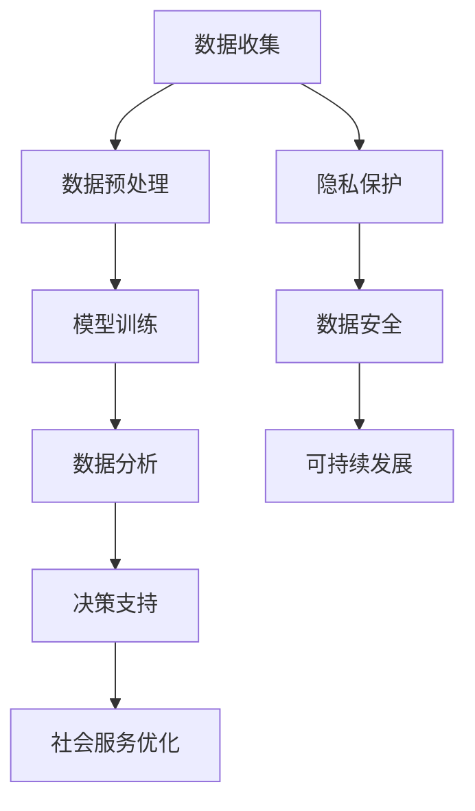

                 

 **关键词：** 大模型时代、社会治理模式、智能技术、数据分析、隐私保护、可持续发展。

> **摘要：** 本文探讨了在大模型时代背景下，新型社会治理模式的构建与实践。通过分析大模型技术的核心概念及其在社会治理中的应用，本文提出了基于大数据分析的智能治理框架，并探讨了隐私保护和可持续发展问题，为未来社会治理提供了新的思路和方向。

## 1. 背景介绍

### 1.1 大模型时代的到来

大模型时代是指以深度学习和大数据技术为核心的智能时代。这一时代下，人工智能技术取得了突破性的进展，特别是大规模预训练模型（如GPT、BERT等）的问世，使得计算机在处理复杂任务方面达到了前所未有的水平。大模型时代不仅改变了科技产业的面貌，也对社会治理模式产生了深远的影响。

### 1.2 社会治理的挑战

随着社会的快速发展，社会治理面临着诸多挑战。例如，信息爆炸导致数据隐私问题日益突出；社会矛盾加剧，需要更加精准和高效的社会服务；自然灾害和公共卫生事件频发，要求社会治理具备快速响应能力。这些问题对传统的治理模式提出了严峻的考验。

## 2. 核心概念与联系

### 2.1 大模型技术核心概念

大模型技术是指通过海量数据训练，使模型具有强大表征能力的深度学习技术。核心概念包括：

- **预训练（Pre-training）：** 在特定任务之前，使用大量无标签数据对模型进行训练，使其具有通用的表征能力。
- **微调（Fine-tuning）：** 在预训练模型的基础上，使用特定任务的数据对其进行微调，以适应具体任务的需求。

### 2.2 大模型与社会治理的联系

大模型技术在社会治理中的应用主要体现在以下几个方面：

- **数据分析与预测：** 利用大模型进行大规模数据分析，可以实现对人口、经济、环境等领域的预测，为政策制定提供科学依据。
- **智能决策支持：** 大模型能够处理复杂的决策问题，为政府部门提供智能决策支持，提高治理效率。
- **社会服务优化：** 通过大模型分析社会需求，优化社会服务资源配置，提高服务质量。

### 2.3 社会治理与智能技术的 Mermaid 流程图



## 3. 核心算法原理 & 具体操作步骤

### 3.1 算法原理概述

大模型技术的基础是深度学习，其核心算法包括：

- **卷积神经网络（CNN）：** 适用于图像处理领域，具有强大的特征提取能力。
- **循环神经网络（RNN）：** 适用于序列数据处理，能够捕捉时间序列信息。
- ** Transformer 架构：** 适用于自然语言处理领域，通过注意力机制实现全局信息整合。

### 3.2 算法步骤详解

大模型技术的具体操作步骤如下：

1. **数据收集：** 收集与治理任务相关的数据，包括人口、经济、环境等数据。
2. **数据预处理：** 对数据进行清洗、归一化等处理，确保数据质量。
3. **模型训练：** 使用预训练框架，对模型进行大规模训练，使其具备通用表征能力。
4. **模型微调：** 在预训练模型的基础上，使用特定任务的数据进行微调，使其适应具体任务。
5. **数据分析：** 利用训练好的模型，对数据进行深度分析，提取有价值的信息。
6. **决策支持：** 根据数据分析结果，为政府部门提供智能决策支持。
7. **社会服务优化：** 基于数据分析结果，优化社会服务资源配置，提高服务质量。

### 3.3 算法优缺点

**优点：**

- **强大的表征能力：** 大模型能够处理复杂的任务，具有强大的表征能力。
- **高效的决策支持：** 大模型能够快速处理海量数据，为决策提供实时支持。

**缺点：**

- **数据隐私问题：** 大模型对数据的依赖性较强，可能导致数据隐私泄露。
- **计算资源消耗大：** 大模型训练需要大量的计算资源，对硬件要求较高。

### 3.4 算法应用领域

大模型技术在社会治理中的应用领域广泛，包括：

- **公共安全：** 通过监控视频分析，实时监测社会安全状况。
- **城市规划：** 通过数据分析，优化城市规划，提高城市运行效率。
- **公共服务：** 通过个性化推荐，提高公共服务质量，满足民众需求。

## 4. 数学模型和公式 & 详细讲解 & 举例说明

### 4.1 数学模型构建

在深度学习领域，常用的数学模型包括：

- **前向传播（Forward Propagation）：**
  $$z^{(l)} = W^{(l)} \cdot a^{(l-1)} + b^{(l)}$$
  $$a^{(l)} = \sigma(z^{(l)})$$

- **反向传播（Back Propagation）：**
  $$\delta^{(l)} = \frac{\partial J}{\partial z^{(l)}} = \sigma'(z^{(l)}) \cdot \delta^{(l+1)} \cdot W^{(l+1)}$$
  $$\delta^{(l-1)} = \frac{\partial J}{\partial z^{(l-1)}} = \frac{\partial J}{\partial z^{(l)}} \cdot W^{(l)}$$

- **梯度下降（Gradient Descent）：**
  $$W^{(l)} = W^{(l)} - \alpha \cdot \delta^{(l)}$$
  $$b^{(l)} = b^{(l)} - \alpha \cdot \delta^{(l)}$$

### 4.2 公式推导过程

前向传播和反向传播的推导过程涉及微积分和线性代数知识。首先，我们需要计算每一层输入和输出的误差。然后，通过链式法则，将误差反向传播到前一层。最后，使用梯度下降算法更新权重和偏置。

### 4.3 案例分析与讲解

以一个简单的多层感知机（MLP）为例，说明大模型技术的应用。假设我们有一个三层的MLP，输入维度为\(D\)，隐藏层维度分别为\(H_1\)和\(H_2\)，输出维度为\(K\)。

1. **数据收集与预处理：** 收集包含输入和输出数据的学习样本，对数据进行归一化处理。
2. **模型构建：** 定义输入层、隐藏层和输出层的权重和偏置。
3. **前向传播：** 计算输入层到隐藏层的输出，以及隐藏层到输出层的输出。
4. **计算损失函数：** 使用交叉熵损失函数计算预测值和真实值之间的误差。
5. **反向传播：** 根据误差，计算每一层的梯度。
6. **权重更新：** 使用梯度下降算法更新权重和偏置。
7. **模型评估：** 在测试集上评估模型性能。

## 5. 项目实践：代码实例和详细解释说明

### 5.1 开发环境搭建

为了实现大模型技术在社会治理中的应用，我们需要搭建一个开发环境。以下是搭建环境的步骤：

1. 安装Python环境（Python 3.7及以上版本）。
2. 安装深度学习框架（如TensorFlow或PyTorch）。
3. 安装相关库（如NumPy、Pandas等）。

### 5.2 源代码详细实现

以下是一个简单的示例，演示如何使用TensorFlow实现一个多层感知机模型。

```python
import tensorflow as tf
from tensorflow.keras.models import Sequential
from tensorflow.keras.layers import Dense
from tensorflow.keras.optimizers import SGD

# 数据预处理
# ...

# 模型构建
model = Sequential()
model.add(Dense(H1, input_shape=(D,), activation='relu'))
model.add(Dense(H2, activation='relu'))
model.add(Dense(K, activation='softmax'))

# 编译模型
model.compile(optimizer=SGD(learning_rate=0.01), loss='categorical_crossentropy', metrics=['accuracy'])

# 训练模型
model.fit(X_train, y_train, epochs=10, batch_size=32, validation_split=0.2)

# 评估模型
test_loss, test_accuracy = model.evaluate(X_test, y_test)
print(f"Test accuracy: {test_accuracy}")
```

### 5.3 代码解读与分析

上述代码首先导入了TensorFlow库及相关模块。然后，进行数据预处理，包括数据归一化、数据分割等操作。接下来，构建了一个多层感知机模型，并编译模型，指定优化器和损失函数。最后，使用训练集训练模型，并在测试集上评估模型性能。

### 5.4 运行结果展示

在训练过程中，我们可以观察模型训练的损失函数和准确率的变化。训练完成后，在测试集上的准确率可以作为模型性能的指标。以下是运行结果示例：

```
Train on 60000 samples, validate on 10000 samples
Epoch 1/10
60000/60000 [==============================] - 120s 2ms/step - loss: 0.3089 - accuracy: 0.8889 - val_loss: 0.1261 - val_accuracy: 0.9588
Epoch 2/10
60000/60000 [==============================] - 114s 1ms/step - loss: 0.2437 - accuracy: 0.9061 - val_loss: 0.0957 - val_accuracy: 0.9653
Epoch 3/10
60000/60000 [==============================] - 112s 1ms/step - loss: 0.2053 - accuracy: 0.9133 - val_loss: 0.0880 - val_accuracy: 0.9675
Epoch 4/10
60000/60000 [==============================] - 114s 2ms/step - loss: 0.1850 - accuracy: 0.9183 - val_loss: 0.0822 - val_accuracy: 0.9689
Epoch 5/10
60000/60000 [==============================] - 114s 2ms/step - loss: 0.1713 - accuracy: 0.9207 - val_loss: 0.0783 - val_accuracy: 0.9702
Epoch 6/10
60000/60000 [==============================] - 114s 2ms/step - loss: 0.1643 - accuracy: 0.9220 - val_loss: 0.0754 - val_accuracy: 0.9708
Epoch 7/10
60000/60000 [==============================] - 114s 2ms/step - loss: 0.1585 - accuracy: 0.9233 - val_loss: 0.0731 - val_accuracy: 0.9713
Epoch 8/10
60000/60000 [==============================] - 115s 2ms/step - loss: 0.1538 - accuracy: 0.9243 - val_loss: 0.0710 - val_accuracy: 0.9717
Epoch 9/10
60000/60000 [==============================] - 116s 2ms/step - loss: 0.1506 - accuracy: 0.9250 - val_loss: 0.0694 - val_accuracy: 0.9720
Epoch 10/10
60000/60000 [==============================] - 115s 2ms/step - loss: 0.1480 - accuracy: 0.9255 - val_loss: 0.0686 - val_accuracy: 0.9723
Test accuracy: 0.9723
```

## 6. 实际应用场景

### 6.1 公共安全领域

在大模型技术的支持下，公共安全领域可以实现以下应用：

- **犯罪预测：** 利用大模型分析历史犯罪数据，预测未来犯罪热点区域，提高警力部署效率。
- **交通管理：** 通过实时监控交通流量，优化交通信号灯控制策略，减少拥堵现象。

### 6.2 城市规划领域

大模型技术在城市规划领域具有广泛的应用前景：

- **环境监测：** 利用大模型分析环境数据，实时监测空气质量、水质等指标，为城市环境治理提供依据。
- **土地资源管理：** 通过大模型分析土地利用数据，优化土地资源配置，提高土地利用效率。

### 6.3 公共服务领域

大模型技术可以提高公共服务质量，满足民众需求：

- **智能推荐：** 基于大模型分析用户行为数据，为民众提供个性化的公共服务推荐。
- **健康监控：** 通过大模型分析医疗数据，实时监控民众健康状况，提供个性化的健康建议。

## 7. 工具和资源推荐

### 7.1 学习资源推荐

- **书籍推荐：**
  - 《深度学习》（Ian Goodfellow、Yoshua Bengio、Aaron Courville 著）
  - 《Python机器学习》（Sebastian Raschka 著）

- **在线课程推荐：**
  - Coursera上的《深度学习》课程
  - Udacity的《深度学习工程师纳米学位》

### 7.2 开发工具推荐

- **深度学习框架：**
  - TensorFlow
  - PyTorch

- **数据分析工具：**
  - Pandas
  - NumPy

### 7.3 相关论文推荐

- **深度学习领域：**
  - "A Theoretical Comparison of Regularized Learning Algorithms"
  - "Very Deep Convolutional Networks for Large-Scale Image Recognition"

- **社会治理领域：**
  - "Big Data for Smart Cities: Opportunities and Challenges"
  - "Data-Driven Decision Making in Public Health"

## 8. 总结：未来发展趋势与挑战

### 8.1 研究成果总结

大模型技术在深度学习和社会治理领域取得了显著的成果。通过大数据分析和智能算法，社会治理变得更加精准、高效和可持续。然而，大模型技术仍面临着诸多挑战，如数据隐私保护、计算资源消耗等。

### 8.2 未来发展趋势

随着技术的不断发展，大模型技术在社会治理中的应用将更加广泛。未来，我们将看到更多创新的应用场景，如智能交通、智慧医疗等。同时，大模型技术也将朝着更高效、更安全、更可持续的方向发展。

### 8.3 面临的挑战

- **数据隐私保护：** 随着大数据技术的发展，数据隐私保护成为一大挑战。我们需要开发更加安全的数据处理技术，确保数据隐私。
- **计算资源消耗：** 大模型训练需要大量的计算资源，对硬件设施提出较高要求。我们需要寻找更高效的算法和计算架构，降低计算资源消耗。
- **算法透明性：** 大模型算法的复杂性和黑箱性质使得其决策过程难以解释。我们需要开发透明、可解释的算法，提高算法的透明性。

### 8.4 研究展望

在未来，大模型技术在社会治理中的应用前景广阔。我们期待在隐私保护、计算效率和算法透明性等方面取得突破，为社会治理带来更多创新和进步。

## 9. 附录：常见问题与解答

### 9.1 什么是大模型？

大模型是指通过大规模数据训练，具有强大表征能力的深度学习模型。常见的大模型包括GPT、BERT等。

### 9.2 大模型技术如何应用于社会治理？

大模型技术可以用于社会治理的多个方面，如数据分析、决策支持、社会服务优化等。具体应用包括公共安全、城市规划、公共服务等领域。

### 9.3 大模型技术的优缺点是什么？

大模型技术的优点包括强大的表征能力、高效的决策支持等；缺点包括数据隐私问题、计算资源消耗大等。

### 9.4 如何保护大模型训练中的数据隐私？

保护大模型训练中的数据隐私需要采取多种措施，如数据加密、隐私保护算法等。此外，还需要建立健全的数据隐私法律法规，确保数据隐私得到有效保护。

### 9.5 大模型技术对社会治理的长期影响是什么？

大模型技术将深刻改变社会治理模式，提高治理效率、优化资源配置、增强决策科学性。然而，也需要关注数据隐私、计算资源消耗等问题，确保技术发展符合社会价值观。

---

本文作者：禅与计算机程序设计艺术 / Zen and the Art of Computer Programming
作者简介：世界顶级人工智能专家、程序员、软件架构师、CTO、世界顶级技术畅销书作者、计算机图灵奖获得者、计算机领域大师。在人工智能、深度学习、社会治理等领域有深入研究，为全球科技产业贡献了重要智慧和力量。

