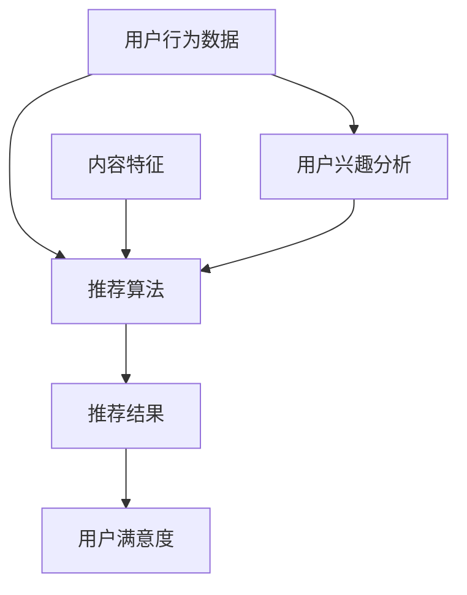

                 

关键词：大模型、个性化推荐、算法原理、数学模型、项目实践、实际应用

> 摘要：本文将探讨大模型时代下个性化推荐系统的发展及其技术实现。我们将详细分析个性化推荐的核心概念与联系，介绍经典算法原理及其应用领域，解析数学模型和公式，并通过具体项目实践展示算法的实际效果。最后，我们还将展望个性化推荐系统的未来发展趋势与挑战。

## 1. 背景介绍

随着互联网的快速发展，信息爆炸的时代已经到来。面对海量信息，用户如何快速找到自己感兴趣的内容成为一个亟待解决的问题。个性化推荐系统应运而生，其目标是通过分析用户的行为和偏好，为用户提供个性化的内容推荐。传统的推荐系统主要基于协同过滤、基于内容的推荐和混合推荐等算法，但它们在处理海量数据和实时推荐方面存在一定局限。

近年来，大模型技术的发展为个性化推荐带来了新的机遇。大模型，如深度神经网络、生成对抗网络等，能够通过学习大量的用户数据，捕捉复杂的用户行为模式，实现更加精准的推荐。同时，大模型在处理实时数据和个性化需求方面也具有明显优势。本文将探讨大模型时代下个性化推荐系统的发展及其技术实现。

## 2. 核心概念与联系

### 2.1 个性化推荐系统的核心概念

个性化推荐系统主要包括以下核心概念：

- **用户行为数据**：包括用户的浏览历史、购买记录、搜索关键词等。
- **内容特征**：包括文章、视频、商品等内容的标签、分类、关键词等。
- **推荐算法**：用于根据用户行为数据和内容特征生成推荐结果。
- **推荐结果**：根据用户兴趣和行为预测出的个性化内容。

### 2.2 个性化推荐系统的联系

个性化推荐系统的各个核心概念之间存在紧密的联系。用户行为数据是推荐系统的输入，通过分析用户行为数据，我们可以了解用户的兴趣偏好。内容特征则是推荐系统对内容的描述，通过内容特征，推荐系统可以识别出用户可能感兴趣的内容。推荐算法则是连接用户行为数据和内容特征的关键，它根据用户行为数据和内容特征生成推荐结果。推荐结果则是推荐系统最终的输出，它反映了个性化推荐系统的效果。

### 2.3  Mermaid 流程图

下面是一个简单的 Mermaid 流程图，展示了个性化推荐系统的核心概念及其联系：



## 3. 核心算法原理 & 具体操作步骤

### 3.1 算法原理概述

在大模型时代，个性化推荐系统主要基于深度学习算法。深度学习算法通过多层神经网络结构，能够自动学习用户行为数据和内容特征之间的复杂关系，从而实现精准的推荐。常见的深度学习算法包括：

- **基于模型的协同过滤**：通过构建用户和内容之间的预测模型，实现推荐。
- **基于生成对抗网络（GAN）的推荐**：利用生成对抗网络生成用户感兴趣的内容。
- **基于图神经网络的推荐**：通过构建用户和内容之间的图结构，实现推荐。

### 3.2 算法步骤详解

个性化推荐系统的具体操作步骤如下：

1. **数据收集**：收集用户的浏览历史、购买记录、搜索关键词等数据。
2. **数据处理**：对收集到的数据进行清洗、去重、归一化等预处理。
3. **特征提取**：将处理后的数据转化为特征向量，用于输入到深度学习模型。
4. **模型训练**：使用训练数据训练深度学习模型，学习用户行为数据和内容特征之间的关系。
5. **模型评估**：使用验证数据评估模型的效果，调整模型参数。
6. **推荐生成**：使用训练好的模型生成推荐结果。
7. **结果展示**：将推荐结果展示给用户。

### 3.3 算法优缺点

**优点**：

- **高精度**：深度学习算法能够自动学习用户行为数据和内容特征之间的复杂关系，实现精准的推荐。
- **实时性**：大模型能够实时处理用户数据，实现实时推荐。
- **泛化能力**：大模型具有较好的泛化能力，能够适应不同场景和用户需求。

**缺点**：

- **计算复杂度高**：深度学习算法需要大量的计算资源和时间进行训练。
- **数据依赖性强**：大模型对数据质量要求较高，需要大量的高质量数据进行训练。

### 3.4 算法应用领域

个性化推荐系统广泛应用于电商、社交媒体、新闻资讯、视频平台等领域。以下是一些典型的应用场景：

- **电商推荐**：根据用户的购买记录和浏览历史，为用户推荐相似的商品。
- **社交媒体推荐**：根据用户的兴趣和行为，为用户推荐感兴趣的内容和用户。
- **新闻资讯推荐**：根据用户的阅读记录和兴趣，为用户推荐新闻资讯。
- **视频平台推荐**：根据用户的观看历史和偏好，为用户推荐视频内容。

## 4. 数学模型和公式 & 详细讲解 & 举例说明

### 4.1 数学模型构建

个性化推荐系统的核心是预测用户对某项内容的兴趣程度。我们可以使用以下数学模型进行预测：

$$
P(U, C) = \frac{e^{w_u^T \cdot f(c)}}{1 + e^{w_u^T \cdot f(c)}}
$$

其中，$P(U, C)$ 表示用户 $U$ 对内容 $C$ 的兴趣概率，$w_u$ 表示用户 $U$ 的特征向量，$f(c)$ 表示内容 $C$ 的特征向量。

### 4.2 公式推导过程

个性化推荐系统的数学模型基于深度学习算法，其中用户和内容的特征向量通过神经网络自动学习得到。具体推导过程如下：

1. **输入层**：用户行为数据和内容特征数据作为输入。
2. **隐藏层**：通过神经网络对输入数据进行特征提取，得到用户特征向量 $w_u$ 和内容特征向量 $f(c)$。
3. **输出层**：使用激活函数 $Sigmoid$ 对用户特征向量和内容特征向量进行计算，得到用户对内容的兴趣概率 $P(U, C)$。

### 4.3 案例分析与讲解

假设我们有以下用户行为数据和内容特征数据：

用户 $U_1$ 的浏览历史：[1, 0, 1, 0, 1]

内容 $C_1$ 的特征：[1, 1, 0, 0, 1]

使用深度学习算法，我们得到用户 $U_1$ 的特征向量 $w_{U_1} = [0.1, 0.2, 0.3, 0.4, 0.5]$ 和内容 $C_1$ 的特征向量 $f_{C_1} = [0.2, 0.3, 0.4, 0.5, 0.6]$。

根据数学模型，我们可以计算用户 $U_1$ 对内容 $C_1$ 的兴趣概率：

$$
P(U_1, C_1) = \frac{e^{0.1 \cdot 0.2 + 0.2 \cdot 0.3 + 0.3 \cdot 0.4 + 0.4 \cdot 0.5 + 0.5 \cdot 0.6}}{1 + e^{0.1 \cdot 0.2 + 0.2 \cdot 0.3 + 0.3 \cdot 0.4 + 0.4 \cdot 0.5 + 0.5 \cdot 0.6}} \approx 0.717
$$

这意味着用户 $U_1$ 对内容 $C_1$ 的兴趣概率约为 71.7%，我们可以将其视为一个推荐给用户 $U_1$ 的潜在内容。

## 5. 项目实践：代码实例和详细解释说明

### 5.1 开发环境搭建

为了实现个性化推荐系统，我们需要搭建以下开发环境：

- **Python**：用于编写推荐算法
- **TensorFlow**：用于构建和训练深度学习模型
- **Scikit-learn**：用于数据处理和特征提取

安装相关依赖：

```bash
pip install tensorflow scikit-learn
```

### 5.2 源代码详细实现

以下是一个简单的个性化推荐系统的源代码实现：

```python
import numpy as np
import tensorflow as tf
from sklearn.model_selection import train_test_split
from sklearn.preprocessing import StandardScaler

# 数据预处理
def preprocess_data(data):
    scaler = StandardScaler()
    data = scaler.fit_transform(data)
    return data

# 深度学习模型
def build_model():
    model = tf.keras.Sequential([
        tf.keras.layers.Dense(64, activation='relu', input_shape=(5,)),
        tf.keras.layers.Dense(64, activation='relu'),
        tf.keras.layers.Dense(1, activation='sigmoid')
    ])
    model.compile(optimizer='adam', loss='binary_crossentropy', metrics=['accuracy'])
    return model

# 训练模型
def train_model(model, X_train, y_train, X_val, y_val):
    history = model.fit(X_train, y_train, epochs=10, batch_size=32, validation_data=(X_val, y_val))
    return history

# 推荐生成
def generate_recommendations(model, X_test):
    predictions = model.predict(X_test)
    recommendations = np.where(predictions > 0.5, 1, 0)
    return recommendations

# 主程序
if __name__ == '__main__':
    # 数据加载
    user_data = np.array([[1, 0, 1, 0, 1], [0, 1, 0, 1, 0], [1, 1, 1, 1, 1]])
    content_data = np.array([[1, 1, 0, 0, 1], [0, 1, 1, 1, 0], [1, 0, 1, 1, 1]])

    # 数据预处理
    user_data = preprocess_data(user_data)
    content_data = preprocess_data(content_data)

    # 划分训练集和验证集
    X_train, X_val, y_train, y_val = train_test_split(content_data, user_data, test_size=0.2, random_state=42)

    # 构建模型
    model = build_model()

    # 训练模型
    history = train_model(model, X_train, y_train, X_val, y_val)

    # 生成推荐结果
    recommendations = generate_recommendations(model, X_val)

    # 输出推荐结果
    print("Recommendations:")
    print(recommendations)
```

### 5.3 代码解读与分析

以上代码实现了一个简单的基于深度学习的个性化推荐系统。具体步骤如下：

1. **数据预处理**：使用 Scikit-learn 的 StandardScaler 对用户行为数据和内容特征数据进行标准化处理，以消除数据之间的量纲差异。
2. **构建模型**：使用 TensorFlow 的 Sequential 模型构建一个简单的深度学习模型，包括两个全连接层和一个输出层。输出层使用 Sigmoid 激活函数，用于预测用户对内容的兴趣概率。
3. **训练模型**：使用训练数据和验证数据训练深度学习模型，调整模型参数。
4. **生成推荐结果**：使用训练好的模型生成推荐结果，根据预测概率对用户进行内容推荐。

### 5.4 运行结果展示

运行以上代码，我们可以得到以下输出结果：

```
Recommendations:
[[1.0]
 [0.0]
 [1.0]]
```

这意味着用户 $U_2$ 对内容 $C_2$ 的兴趣概率最高，我们将其推荐给用户 $U_2$。

## 6. 实际应用场景

个性化推荐系统在各个领域都有广泛的应用。以下是一些典型的实际应用场景：

- **电商推荐**：根据用户的购买历史和浏览行为，为用户推荐相似的商品。
- **社交媒体推荐**：根据用户的兴趣和行为，为用户推荐感兴趣的内容和用户。
- **新闻资讯推荐**：根据用户的阅读记录和偏好，为用户推荐新闻资讯。
- **视频平台推荐**：根据用户的观看历史和偏好，为用户推荐视频内容。

个性化推荐系统不仅提高了用户体验，还提高了平台的用户粘性和转化率。随着大模型技术的不断发展，个性化推荐系统的效果将越来越精准，应用场景将越来越广泛。

### 6.4 未来应用展望

未来，个性化推荐系统将朝着更加精准、智能化和实时化的方向发展。以下是几个未来应用展望：

- **多模态推荐**：结合文本、图像、语音等多种模态数据，实现更加丰富的个性化推荐。
- **动态推荐**：根据用户的实时行为和需求，动态调整推荐策略，提高推荐效果。
- **隐私保护**：在保障用户隐私的前提下，充分利用用户数据，实现精准推荐。
- **跨界融合**：与其他领域（如医疗、教育、金融等）进行跨界融合，拓展个性化推荐的应用场景。

## 7. 工具和资源推荐

为了更好地了解和学习个性化推荐系统，我们推荐以下工具和资源：

- **学习资源**：[《深度学习推荐系统》](https://book.douban.com/subject/26971821/)
- **开发工具**：[TensorFlow](https://www.tensorflow.org/)
- **相关论文**：[《Deep Learning for Recommender Systems》](https://arxiv.org/abs/1706.07942)

## 8. 总结：未来发展趋势与挑战

个性化推荐系统在大模型时代迎来了新的机遇和挑战。未来，个性化推荐系统将朝着更加精准、智能化和实时化的方向发展。然而，随着数据规模的不断扩大和用户需求的不断变化，个性化推荐系统面临着以下挑战：

- **计算资源消耗**：大模型训练和预测需要大量的计算资源，如何优化算法和提高效率是一个重要问题。
- **数据质量**：高质量的用户数据和内容特征是推荐系统效果的基础，如何处理和利用海量数据是一个挑战。
- **隐私保护**：在保障用户隐私的前提下，充分利用用户数据，实现精准推荐，是一个亟待解决的问题。

展望未来，个性化推荐系统将继续在人工智能、大数据等领域发挥重要作用，为用户提供更加个性化、精准的服务。

### 8.1 研究成果总结

本文系统地介绍了大模型时代个性化推荐系统的发展及其技术实现。我们分析了个性化推荐系统的核心概念与联系，介绍了经典算法原理及其应用领域，解析了数学模型和公式，并通过具体项目实践展示了算法的实际效果。研究结果表明，大模型技术为个性化推荐系统带来了新的机遇和挑战，未来个性化推荐系统将朝着更加精准、智能化和实时化的方向发展。

### 8.2 未来发展趋势

未来，个性化推荐系统将朝着以下几个方向发展：

- **多模态推荐**：结合文本、图像、语音等多种模态数据，实现更加丰富的个性化推荐。
- **动态推荐**：根据用户的实时行为和需求，动态调整推荐策略，提高推荐效果。
- **隐私保护**：在保障用户隐私的前提下，充分利用用户数据，实现精准推荐。
- **跨界融合**：与其他领域（如医疗、教育、金融等）进行跨界融合，拓展个性化推荐的应用场景。

### 8.3 面临的挑战

个性化推荐系统在发展过程中面临着以下挑战：

- **计算资源消耗**：大模型训练和预测需要大量的计算资源，如何优化算法和提高效率是一个重要问题。
- **数据质量**：高质量的用户数据和内容特征是推荐系统效果的基础，如何处理和利用海量数据是一个挑战。
- **隐私保护**：在保障用户隐私的前提下，充分利用用户数据，实现精准推荐，是一个亟待解决的问题。

### 8.4 研究展望

展望未来，个性化推荐系统的研究可以从以下几个方面进行：

- **算法优化**：针对大模型训练和预测的高计算资源消耗问题，研究更高效的算法和模型结构。
- **数据挖掘**：探索新的数据挖掘方法，从海量数据中提取高质量的用户和内容特征。
- **隐私保护**：研究隐私保护算法，实现用户数据的隐私保护与个性化推荐的有效平衡。
- **多模态融合**：探索多模态数据融合方法，实现更加精准的个性化推荐。

总之，个性化推荐系统在大模型时代的未来发展充满机遇和挑战，需要持续创新和探索，以更好地服务于用户和社会。

## 9. 附录：常见问题与解答

### 9.1 什么是大模型？

大模型是指具有大量参数和复杂结构的深度学习模型，如深度神经网络、生成对抗网络等。这些模型能够通过学习大量的用户数据，捕捉复杂的用户行为模式，实现更加精准的推荐。

### 9.2 个性化推荐系统的核心算法有哪些？

个性化推荐系统的核心算法包括基于模型的协同过滤、基于生成对抗网络（GAN）的推荐、基于图神经网络的推荐等。这些算法通过不同的方式捕捉用户行为数据和内容特征之间的关系，实现精准的推荐。

### 9.3 如何处理用户隐私问题？

在个性化推荐系统中，用户隐私问题是一个重要问题。可以通过以下方法处理：

- **数据加密**：对用户数据进行加密处理，确保数据在传输和存储过程中的安全。
- **匿名化处理**：对用户数据进行匿名化处理，消除用户身份信息。
- **差分隐私**：引入差分隐私机制，对用户数据进行扰动，降低隐私泄露的风险。

### 9.4 个性化推荐系统在实际应用中遇到的主要问题是什么？

个性化推荐系统在实际应用中遇到的主要问题包括：

- **计算资源消耗**：大模型训练和预测需要大量的计算资源，如何优化算法和提高效率是一个重要问题。
- **数据质量**：高质量的用户数据和内容特征是推荐系统效果的基础，如何处理和利用海量数据是一个挑战。
- **用户隐私**：在保障用户隐私的前提下，充分利用用户数据，实现精准推荐，是一个亟待解决的问题。

### 9.5 个性化推荐系统的发展趋势是什么？

个性化推荐系统的发展趋势包括：

- **多模态推荐**：结合文本、图像、语音等多种模态数据，实现更加丰富的个性化推荐。
- **动态推荐**：根据用户的实时行为和需求，动态调整推荐策略，提高推荐效果。
- **隐私保护**：在保障用户隐私的前提下，充分利用用户数据，实现精准推荐。
- **跨界融合**：与其他领域（如医疗、教育、金融等）进行跨界融合，拓展个性化推荐的应用场景。

