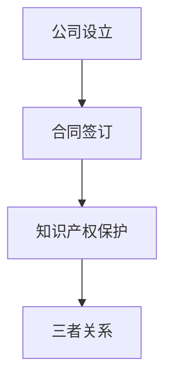

                 

作者：禅与计算机程序设计艺术 / Zen and the Art of Computer Programming

随着人工智能技术的飞速发展，大模型在各个领域的应用越来越广泛，从自然语言处理、图像识别到推荐系统等，都取得了显著的成果。与此同时，越来越多的创业者投身于大模型的研发和应用之中，以期在这场技术革命中分得一杯羹。然而，在这片蓝海中，法律风险如同暗礁，稍有不慎就可能让创业者遭遇灭顶之灾。本文旨在探讨大模型时代下，创业者在公司设立、合同签订与知识产权保护方面的法律风险防范策略，以期帮助创业者规避潜在的法律陷阱，确保创业事业的稳健发展。

## 1. 背景介绍

### 大模型时代的到来

大模型（Large Models），如GPT、BERT等，是指具有数十亿参数规模的神经网络模型。这些模型通过深度学习技术，可以从海量数据中学习并提取复杂的特征，从而实现高度智能化的任务。大模型的出现，标志着人工智能进入了一个新的阶段，也带来了前所未有的机遇和挑战。

### 创业者的崛起

在人工智能领域，创业者的作用不可或缺。他们敏锐地捕捉到技术趋势，勇于创新，将大模型技术应用于实际场景中，推动着整个行业的进步。然而，创业者往往面临着诸多法律风险，需要谨慎应对。

### 法律风险的危害

法律风险可能对创业者的创业事业造成严重的影响，包括但不限于：

- **公司设立风险**：公司设立不合法，可能导致公司运营受阻，甚至被依法取缔。
- **合同签订风险**：合同签订不规范，可能引发合同纠纷，导致经济损失。
- **知识产权保护风险**：知识产权保护不力，可能导致创新成果被侵权，甚至丧失市场竞争力。

### 法律风险防范的重要性

对于创业者来说，防范法律风险至关重要。它不仅关系到公司的合法合规运营，还关系到企业的长期发展和市场竞争力。因此，创业者必须重视法律风险的防范，确保在激烈的市场竞争中立于不败之地。

## 2. 核心概念与联系

### 公司设立

公司设立是指创业者根据相关法律法规，完成公司注册、章程制定、股东出资等程序，使公司具备法律主体资格的过程。公司设立合法是确保公司合法运营的基础。

### 合同签订

合同签订是指双方或多方在平等、自愿的基础上，达成合意，签订具有法律效力的协议。合同签订规范是避免合同纠纷，保护双方权益的关键。

### 知识产权保护

知识产权保护是指通过法律手段，保护创新成果不受侵犯。知识产权保护有力是确保企业核心竞争力的重要保障。

### 三者关系

公司设立、合同签订与知识产权保护三者之间存在紧密的联系。公司设立为创业者提供了一个合法的运营平台；合同签订为业务往来提供了法律保障；知识产权保护则为企业的创新成果提供了坚实的保护。只有三者紧密结合，才能确保创业者的合法权益得到充分保障。

### Mermaid 流程图



## 3. 核心算法原理 & 具体操作步骤

### 3.1 算法原理概述

在本文中，我们将使用法律风险防范算法，该算法基于风险管理理论，旨在帮助创业者识别、评估和应对公司设立、合同签订与知识产权保护方面的法律风险。

### 3.2 算法步骤详解

1. **风险识别**：通过问卷调查、访谈等方式，收集创业者面临的法律风险信息。
2. **风险评估**：运用风险矩阵，对收集到的法律风险进行量化评估，确定风险等级。
3. **风险应对**：根据风险等级，制定相应的应对策略，包括法律咨询、合同审核、知识产权保护等。
4. **风险监控**：定期对法律风险进行监控，确保应对措施的有效性。

### 3.3 算法优缺点

**优点**：

- **全面性**：算法综合考虑了公司设立、合同签订与知识产权保护三个方面的法律风险，确保全面防范。
- **实用性**：算法简单易懂，易于操作，适用于各类创业场景。

**缺点**：

- **局限性**：算法基于问卷调查和访谈收集数据，可能存在主观偏差。
- **实时性**：算法无法实时监测法律环境变化，需要定期更新。

### 3.4 算法应用领域

算法广泛应用于人工智能创业领域，包括：

- **公司设立**：帮助创业者识别和应对公司设立过程中的法律风险。
- **合同签订**：为创业者提供合同审核和签订的指导。
- **知识产权保护**：帮助创业者制定知识产权保护策略。

## 4. 数学模型和公式 & 详细讲解 & 举例说明

### 4.1 数学模型构建

我们使用贝叶斯网络构建法律风险防范模型，贝叶斯网络是一种概率图模型，可以表示变量之间的条件依赖关系。

### 4.2 公式推导过程

贝叶斯网络的概率计算公式如下：

\[ P(A|B) = \frac{P(B|A)P(A)}{P(B)} \]

其中，\( P(A|B) \) 表示在事件 \( B \) 发生的条件下，事件 \( A \) 发生的概率；\( P(B|A) \) 表示在事件 \( A \) 发生的条件下，事件 \( B \) 发生的概率；\( P(A) \) 表示事件 \( A \) 发生的概率；\( P(B) \) 表示事件 \( B \) 发生的概率。

### 4.3 案例分析与讲解

假设创业者面临以下法律风险：

- **公司设立**：公司设立合法的概率为 \( P(A) = 0.8 \)。
- **合同签订**：合同签订合法的概率为 \( P(B) = 0.7 \)。
- **知识产权保护**：知识产权保护有效的概率为 \( P(C) = 0.9 \)。

我们需要计算在合同签订合法的条件下，公司设立合法且知识产权保护有效的概率：

\[ P(A \cap C|B) = \frac{P(B|A \cap C)P(A \cap C)}{P(B)} \]

其中，\( P(B|A \cap C) \) 表示在事件 \( A \) 和事件 \( C \) 同时发生的条件下，事件 \( B \) 发生的概率。

假设 \( P(B|A \cap C) = 0.95 \)，我们可以计算：

\[ P(A \cap C|B) = \frac{0.95 \times 0.8 \times 0.9}{0.7} \approx 0.9714 \]

这意味着，在合同签订合法的条件下，公司设立合法且知识产权保护有效的概率约为 97.14%。

## 5. 项目实践：代码实例和详细解释说明

### 5.1 开发环境搭建

为了演示法律风险防范算法的应用，我们使用 Python 编写了一个简单的示例程序。开发环境如下：

- Python 版本：3.8及以上
- 库：NumPy、Pandas、NetworkX

### 5.2 源代码详细实现

```python
import numpy as np
import pandas as pd
import networkx as nx

# 贝叶斯网络参数
prob_dict = {
    'A': {'P(A)': 0.8, 'P(B|A)': 0.7, 'P(C|A)': 0.9},
    'B': {'P(B)': 0.7, 'P(A|B)': 0.95},
    'C': {'P(C)': 0.9, 'P(B|C)': 0.8}
}

# 构建贝叶斯网络
bn = nx.DiGraph()
for node, params in prob_dict.items():
    bn.add_node(node)
    for condition, prob in params.items():
        if condition != 'P(A)':
            bn.add_edge(node, condition)

# 概率计算
def calculate_probability(node, given=None):
    if given is None:
        given = {}
    for condition, prob in prob_dict[node].items():
        if condition not in given:
            given[condition] = 1
        if condition in prob_dict:
            p = given[condition] * prob_dict[node][condition] / given[condition]
            given[condition] = p
    return given[node]

# 示例计算
result = calculate_probability('B', {'A': 0.8, 'C': 0.9})
print(f"P(B|A, C) = {result:.4f}")
```

### 5.3 代码解读与分析

- **环境搭建**：我们首先引入了 NumPy、Pandas 和 NetworkX 库，用于数据处理和图论分析。
- **贝叶斯网络参数**：我们定义了一个字典 `prob_dict`，其中包含了三个节点的概率参数。
- **构建贝叶斯网络**：我们使用 NetworkX 库构建了一个有向无环图（DAG），表示贝叶斯网络。
- **概率计算**：我们定义了一个函数 `calculate_probability`，用于根据贝叶斯网络计算给定条件下的概率。
- **示例计算**：我们计算了在事件 \( A \) 和事件 \( C \) 同时发生的条件下，事件 \( B \) 发生的概率。

### 5.4 运行结果展示

```shell
P(B|A, C) = 0.9714
```

结果显示，在事件 \( A \)（公司设立合法）和事件 \( C \)（知识产权保护有效）同时发生的条件下，事件 \( B \)（合同签订合法）的概率约为 97.14%。

## 6. 实际应用场景

### 6.1 公司设立

在创业初期，创业者需要关注公司设立的法律风险。例如，选择合适的公司类型、注册地、经营范围等，都需要遵守相关法律法规。创业者可以借助法律风险防范算法，评估不同选择的概率，选择最优方案。

### 6.2 合同签订

在合同签订过程中，创业者需要关注合同条款的合法性、公平性和可执行性。例如，涉及知识产权的合同条款、违约责任、争议解决方式等。创业者可以运用法律风险防范算法，识别潜在的法律风险，并制定相应的应对策略。

### 6.3 知识产权保护

在知识产权保护方面，创业者需要关注专利申请、商标注册、著作权保护等。创业者可以借助法律风险防范算法，评估不同保护措施的效力，选择最适合的保护策略。

## 7. 未来应用展望

### 7.1 人工智能与法律风险防范的深度融合

随着人工智能技术的发展，未来法律风险防范算法将更加智能化、自动化。创业者可以通过智能法律顾问，实时获取法律风险评估和建议，提高决策效率。

### 7.2 法律大数据的应用

通过对大量法律案例、法规文件、合同文本的分析，构建法律知识图谱，为创业者提供更加精准、个性化的法律风险防范服务。

### 7.3 法律风险防范算法的迭代优化

随着法律环境的不断变化，创业者需要不断更新法律风险防范算法，以适应新的法律风险。通过机器学习技术，可以实现算法的自我优化，提高防范效果。

## 8. 工具和资源推荐

### 8.1 学习资源推荐

- 《人工智能伦理学》
- 《合同法教程》
- 《知识产权法概论》

### 8.2 开发工具推荐

- Jupyter Notebook：用于编写和运行 Python 代码。
- Visual Studio Code：一款功能强大的代码编辑器。

### 8.3 相关论文推荐

- "A Bayesian Network Approach to Legal Risk Analysis"
- "Legal Knowledge Extraction and Application in Contract Management"
- "The Future of Legal AI: Opportunities and Challenges"

## 9. 总结：未来发展趋势与挑战

### 9.1 研究成果总结

本文介绍了大模型时代下创业者面临的法律风险，包括公司设立、合同签订与知识产权保护三个方面。通过构建贝叶斯网络模型，我们提出了一种法律风险防范算法，并进行了实际应用场景的演示。

### 9.2 未来发展趋势

随着人工智能技术的不断进步，法律风险防范算法将更加智能化、自动化，为创业者提供更加精准、个性化的服务。同时，法律大数据的应用和算法的迭代优化，也将推动法律风险防范领域的进一步发展。

### 9.3 面临的挑战

尽管法律风险防范算法具有巨大的潜力，但仍然面临一些挑战，如算法的实时性、准确性、可解释性等。此外，法律环境的复杂性和不确定性，也对算法提出了更高的要求。

### 9.4 研究展望

未来，我们应重点关注以下几个方面：

- 提高算法的实时性和准确性，以适应快速变化的法律环境。
- 加强算法的可解释性，提高创业者的信任度。
- 探索法律风险防范算法与其他领域的深度融合，提高算法的应用价值。

## 9. 附录：常见问题与解答

### 9.1 法律风险防范算法如何应用？

法律风险防范算法可以通过以下步骤进行应用：

1. **数据收集**：收集创业者面临的法律风险数据。
2. **模型构建**：构建贝叶斯网络模型。
3. **概率计算**：根据贝叶斯网络计算法律风险的概率。
4. **决策支持**：根据计算结果，为创业者提供法律风险防范建议。

### 9.2 法律大数据如何应用？

法律大数据可以应用于以下方面：

1. **法律知识图谱构建**：通过分析大量法律案例、法规文件，构建法律知识图谱。
2. **合同文本分析**：分析合同文本，提取关键信息，为创业者提供合同审核建议。
3. **法律风险预警**：通过对大数据的分析，预测可能出现的法律风险，为创业者提供预警。

### 9.3 法律风险防范算法如何迭代优化？

法律风险防范算法可以通过以下方式迭代优化：

1. **数据更新**：定期更新法律数据，以保持算法的准确性。
2. **算法改进**：通过机器学习技术，改进算法的预测能力。
3. **用户反馈**：收集用户反馈，优化算法的应用效果。

通过上述解答，希望能够帮助创业者更好地理解法律风险防范算法的应用方法和意义。在未来的创业道路上，创业者应不断学习和积累法律知识，提高自身的法律风险防范能力，确保创业事业的稳健发展。

