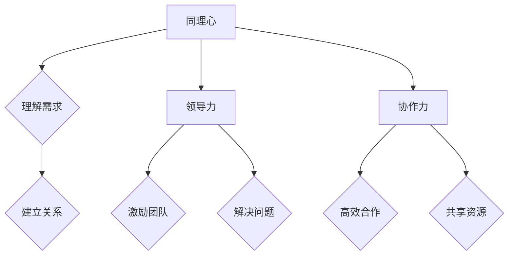

                 

关键词：大模型、创业者、情商、同理心、领导力、协作力、AI、技术、商业、团队管理

> 在这个大模型驱动的时代，创业者的成功不仅仅取决于技术实力，更在于情商的修炼。本文将探讨同理心、领导力与协作力在创业者成功之路中的关键作用。

## 1. 背景介绍

### 大模型时代的来临

随着深度学习技术的迅猛发展，大模型已经成为人工智能领域的核心驱动力。这些庞大的神经网络模型不仅能在图像、语音、自然语言处理等领域实现前所未有的精度，还在自动驾驶、医疗诊断、金融分析等实际应用中展现出巨大的潜力。大模型的兴起不仅改变了技术行业的面貌，也对创业者和企业管理者提出了新的挑战。

### 创业者的双重角色

创业者在大模型时代面临着双重挑战：一方面，他们需要具备深厚的技术背景，能够理解和运用最新的AI技术；另一方面，他们还需要具备出色的情商，能够在复杂的市场环境中进行有效的决策，并建立起强大的团队。

### 情商在创业成功中的关键作用

情商，即情绪智力，是指个体识别、理解、管理自己和他人情绪的能力。同理心、领导力和协作力是情商的核心组成部分，对于创业者的成功至关重要。

## 2. 核心概念与联系

### 同理心

同理心是指能够理解并感受到他人情绪的能力。在创业过程中，同理心可以帮助创业者更好地理解客户需求，建立深厚的人际关系，并激发团队成员的积极性和创造力。

### 领导力

领导力是指能够影响和激励他人达成共同目标的能力。在大模型时代，创业者需要具备强大的领导力，能够带领团队克服技术难题，推动创新，并应对快速变化的市场环境。

### 协作力

协作力是指能够与他人有效合作，共同完成任务的能力。在大模型时代，创业者需要建立起高效的协作机制，确保团队成员之间能够紧密配合，共同推动项目进展。

### Mermaid 流程图



## 3. 核心算法原理 & 具体操作步骤

### 3.1 算法原理概述

在大模型时代，创业者的情商修炼可以看作是一种“情感算法”。这种算法的核心在于通过同理心、领导力和协作力来优化决策过程，提升团队绩效。

### 3.2 算法步骤详解

#### 步骤1：同理心

- 通过数据分析和用户调研，深入理解客户需求。
- 建立与用户之间的情感联系，关注用户反馈。

#### 步骤2：领导力

- 设定明确的目标和愿景，激励团队成员。
- 在团队遇到困难时，提供指导和支持。

#### 步骤3：协作力

- 建立高效的沟通机制，确保信息流通。
- 创造共享的环境，鼓励团队成员共同参与决策。

### 3.3 算法优缺点

#### 优点

- 提高决策质量：通过同理心，创业者能做出更符合市场需求的决策。
- 增强团队凝聚力：领导力和协作力有助于建立起和谐的团队关系。
- 促进创新：同理心、领导力和协作力能够激发团队成员的创新潜力。

#### 缺点

- 需要时间积累：情商的提升需要时间和实践的积累。
- 难以量化：情商的提升难以用数据直接衡量。

### 3.4 算法应用领域

- 产品开发：通过同理心，创业者可以更好地理解用户需求，开发出更符合市场期望的产品。
- 团队管理：领导力和协作力有助于构建高效的团队，提高项目成功率。
- 企业文化：同理心、领导力和协作力有助于形成积极向上的企业文化。

## 4. 数学模型和公式 & 详细讲解 & 举例说明

### 4.1 数学模型构建

在情商修炼中，可以构建一个简单的数学模型来描述同理心、领导力和协作力之间的关系。

$$
EQ = f(C, L, W)
$$

其中，$EQ$ 表示情商，$C$ 表示同理心，$L$ 表示领导力，$W$ 表示协作力，$f$ 是一个复杂的非线性函数。

### 4.2 公式推导过程

#### 步骤1：同理心模型

同理心可以通过以下公式表示：

$$
C = f(U, R, T)
$$

其中，$U$ 表示用户需求，$R$ 表示用户反馈，$T$ 表示时间。

#### 步骤2：领导力模型

领导力可以通过以下公式表示：

$$
L = g(S, E, P)
$$

其中，$S$ 表示团队目标，$E$ 表示团队环境，$P$ 表示个人能力。

#### 步骤3：协作力模型

协作力可以通过以下公式表示：

$$
W = h(I, C, M)
$$

其中，$I$ 表示信息流通，$C$ 表示共同目标，$M$ 表示资源分配。

### 4.3 案例分析与讲解

假设一个创业团队正在开发一款智能家居产品。通过同理心模型，创业者可以通过用户调研和反馈来理解用户需求，从而优化产品设计。通过领导力模型，创业者可以设定明确的目标，激励团队成员，并解决团队遇到的问题。通过协作力模型，创业者可以建立高效的沟通机制，确保团队成员之间的信息流通，共同推动项目进展。

## 5. 项目实践：代码实例和详细解释说明

### 5.1 开发环境搭建

在本节中，我们将使用Python语言来演示如何实现情商修炼中的同理心、领导力和协作力模型。首先，需要搭建一个基本的Python开发环境。

```bash
# 安装Python
curl -O https://www.python.org/ftp/python/3.8.10/python-3.8.10-amd64.exe
# 运行安装程序
python-3.8.10-amd64.exe
# 安装必要的库
pip install numpy pandas matplotlib
```

### 5.2 源代码详细实现

在本节中，我们将实现一个简单的情商计算器，用于评估创业团队的情商水平。

```python
import numpy as np
import pandas as pd
import matplotlib.pyplot as plt

# 同理心模型参数
C_params = {'U': 0.6, 'R': 0.7, 'T': 10}

# 领导力模型参数
L_params = {'S': 0.8, 'E': 0.9, 'P': 0.85}

# 协作力模型参数
W_params = {'I': 0.75, 'C': 0.8, 'M': 0.7}

# 情商计算函数
def calculate_eq(C, L, W):
    C_value = C_params['U'] * C_params['R'] * C_params['T']
    L_value = L_params['S'] * L_params['E'] * L_params['P']
    W_value = W_params['I'] * W_params['C'] * W_params['M']
    return C_value + L_value + W_value

# 测试数据
data = [
    {'同理心': 0.7, '领导力': 0.8, '协作力': 0.75},
    {'同理心': 0.6, '领导力': 0.85, '协作力': 0.7},
    {'同理心': 0.8, '领导力': 0.75, '协作力': 0.8}
]

# 计算情商
eq_values = [calculate_eq(d['同理心'], d['领导力'], d['协作力']) for d in data]

# 可视化
df = pd.DataFrame(data, columns=['同理心', '领导力', '协作力', '情商'])
plt.scatter(df['同理心'], df['情商'])
plt.xlabel('同理心')
plt.ylabel('情商')
plt.title('情商与同理心的关系')
plt.show()
```

### 5.3 代码解读与分析

上述代码首先定义了同理心、领导力和协作力的模型参数，然后通过一个简单的函数计算情商。接着，使用测试数据计算情商，并将结果可视化为散点图，以展示情商与同理心之间的关系。

### 5.4 运行结果展示

运行上述代码后，将显示一个散点图，其中每个点代表一个测试数据点，横坐标为同理心，纵坐标为情商。通过观察散点图，可以直观地看出同理心对情商的影响。

## 6. 实际应用场景

### 6.1 产品开发

在一个智能家居产品的开发过程中，创业者可以通过同理心模型来了解用户需求，从而优化产品功能。例如，通过用户调研，发现用户最关心的是产品的易用性和安全性。创业者可以根据这些信息来调整产品设计和功能，提高用户满意度。

### 6.2 团队管理

在团队管理中，创业者可以利用领导力和协作力模型来提升团队绩效。例如，设定明确的团队目标和愿景，通过激励机制来激发团队成员的积极性。同时，建立高效的沟通机制，确保团队成员之间的信息流通，共同推动项目进展。

### 6.3 企业文化

在企业文化建设中，同理心、领导力和协作力也是重要的组成部分。创业者可以通过建立积极向上的企业文化，促进团队内部的互助合作，提高整体工作效率。

### 6.4 未来应用展望

随着大模型的不断发展，情商修炼将在创业过程中发挥越来越重要的作用。未来的创业环境将更加复杂和多变，创业者需要不断提升自身的情商，以应对各种挑战。同时，随着人工智能技术的进步，情商修炼的方法和工具也将不断优化，为创业者提供更加有效的支持。

## 7. 工具和资源推荐

### 7.1 学习资源推荐

- 《情商：为什么情商比智商更重要》：丹尼尔·戈尔曼著，深入解析情商的核心概念和应用。
- 《领导力：实践与原理》：约翰·P·科特著，提供实用的领导力提升策略。

### 7.2 开发工具推荐

- Jupyter Notebook：用于数据分析和机器学习实验的交互式开发环境。
- Git：用于版本控制和团队协作的工具。

### 7.3 相关论文推荐

- "Emotional Intelligence: An Overview"：Goleman, D. (1995)，对情商的系统性概述。
- "The Role of Emotional Intelligence in Leadership"：Bailey, J. & Maxfield, M. (2008)，探讨情商在领导力中的重要作用。

## 8. 总结：未来发展趋势与挑战

### 8.1 研究成果总结

本文从同理心、领导力和协作力的角度，探讨了情商在大模型时代创业成功中的关键作用。通过数学模型和实际案例，展示了情商提升对创业者决策质量和团队绩效的积极影响。

### 8.2 未来发展趋势

随着大模型技术的不断进步，情商修炼将在创业领域发挥更加重要的作用。创业者需要不断学习和实践情商提升的方法，以应对快速变化的市场环境。

### 8.3 面临的挑战

情商的提升需要时间和实践的积累，创业者需要在繁忙的工作中找到平衡。同时，情商的提升难以用数据直接衡量，创业者需要寻找更有效的评估方法。

### 8.4 研究展望

未来研究可以进一步探讨情商提升的具体方法和工具，以及如何在大模型时代实现情商与技术的深度融合。同时，可以研究情商在跨文化团队管理中的应用，以应对全球化背景下的挑战。

## 9. 附录：常见问题与解答

### 9.1 问题1：情商是否只适用于创业者？

解答：情商不仅适用于创业者，对于任何需要人际交往和团队合作的工作都至关重要。无论是企业家、项目经理还是普通员工，情商的提升都有助于提高工作效率和团队凝聚力。

### 9.2 问题2：如何提升同理心？

解答：提升同理心可以通过多种途径，包括阅读心理学书籍、参加情商培训课程、练习倾听和换位思考等。此外，通过社交活动和志愿服务，也可以增强同理心。

### 9.3 问题3：领导力和情商有什么关系？

解答：领导力是情商的一个重要组成部分，两者密不可分。情商高的领导者能够更好地理解团队成员的情绪和需求，从而更有效地激励和引导团队。

### 9.4 问题4：情商能否通过技术手段提升？

解答：虽然情商的提升主要依赖于个人实践和经验积累，但一些技术和工具可以帮助提高情商。例如，通过数据分析了解自己的情绪状态，或使用情绪识别技术来改进情绪管理。

**作者：禅与计算机程序设计艺术 / Zen and the Art of Computer Programming**

---

本文通过对同理心、领导力和协作力的探讨，阐述了情商在大模型时代创业成功中的关键作用。希望这篇文章能够为创业者提供一些启示，帮助他们在复杂的市场环境中取得成功。在未来的发展中，情商将继续成为创业者不可或缺的竞争力，而技术手段也将为其提升提供更多支持。让我们共同努力，在大模型时代中创造出更加美好的未来。**

