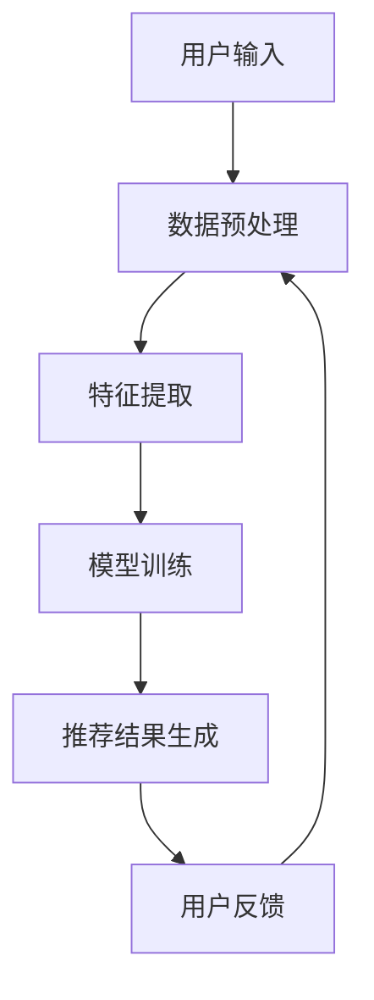

                 

关键词：大模型，推荐系统，架构演进，重构，深度学习，个性化推荐，协同过滤，内容推荐

> 摘要：本文将探讨大模型技术在推荐系统中的应用，分析其带来的架构演进与重构思路。通过对传统推荐系统的概述，介绍大模型技术的核心概念，阐述其在推荐系统架构中的应用，以及如何通过重构实现推荐系统的优化与提升。同时，本文还将探讨大模型赋能下的推荐系统在实际应用中的挑战与未来发展方向。

## 1. 背景介绍

随着互联网的飞速发展，推荐系统已经成为各类互联网应用的重要组成部分。从电商平台的商品推荐，到社交媒体的个性化内容推送，再到音乐、视频等平台的智能推荐，推荐系统在提高用户体验、增加用户黏性、提升业务收益等方面发挥着关键作用。

### 1.1 传统推荐系统的挑战

传统推荐系统主要基于协同过滤（Collaborative Filtering）和基于内容（Content-Based）的推荐方法。然而，随着用户数据的爆炸式增长和用户需求的多样化，传统推荐系统面临着以下挑战：

- **数据稀疏性**：协同过滤方法依赖于用户行为数据，然而用户行为数据往往具有稀疏性，导致推荐效果受限。
- **冷启动问题**：对于新用户或新物品，由于缺乏足够的历史数据，传统推荐系统难以生成有效的推荐结果。
- **低个性化**：传统推荐系统往往无法充分考虑用户个性化需求，导致推荐结果过于普遍化。
- **实时性**：随着用户行为数据的实时性要求越来越高，传统推荐系统在处理海量实时数据时性能有限。

### 1.2 大模型技术的兴起

为了解决传统推荐系统的挑战，近年来大模型技术（如深度学习、自然语言处理等）在推荐系统领域得到了广泛应用。大模型技术具有以下优势：

- **强大的特征提取能力**：大模型能够自动提取用户行为数据和物品属性中的深层次特征，提高推荐效果。
- **自适应性与泛化能力**：大模型能够通过不断学习用户行为和偏好，实现自适应推荐，同时具有较好的泛化能力，能够处理多样化的用户需求。
- **实时性**：大模型通过分布式计算和并行处理技术，能够快速生成推荐结果，满足实时性需求。

## 2. 核心概念与联系

### 2.1 大模型技术核心概念

大模型技术主要包括深度学习（Deep Learning）和自然语言处理（Natural Language Processing，NLP）等。以下是这些核心概念的定义：

- **深度学习**：一种基于多层神经网络的机器学习技术，通过自动提取特征和建立复杂模型，实现从数据到知识的转换。
- **自然语言处理**：一种人工智能技术，旨在让计算机理解和处理人类语言，包括语言生成、理解、翻译等任务。

### 2.2 推荐系统架构的Mermaid流程图

以下是一个简化的推荐系统架构的Mermaid流程图，展示了大模型技术在其中的应用：



### 2.3 大模型技术在推荐系统中的应用

在大模型赋能下，推荐系统架构发生了显著变化。以下是一些关键应用：

- **协同过滤+深度学习**：将深度学习与协同过滤结合，利用深度学习模型自动提取用户行为和物品特征，提高推荐效果。
- **基于内容+自然语言处理**：通过自然语言处理技术，从文本数据中提取用户兴趣和物品属性，实现基于内容的推荐。
- **多模态数据融合**：结合多种类型的数据（如图像、音频、文本等），通过深度学习模型实现跨模态推荐。
- **实时推荐**：利用分布式计算和并行处理技术，实现实时推荐，满足用户实时性需求。

## 3. 核心算法原理 & 具体操作步骤

### 3.1 算法原理概述

大模型赋能下的推荐系统主要采用以下核心算法：

- **深度神经网络（DNN）**：用于特征提取和预测。
- **循环神经网络（RNN）**：用于处理序列数据，如用户行为序列。
- **图神经网络（GNN）**：用于处理图结构数据，如社交网络。

### 3.2 算法步骤详解

1. **数据预处理**：对用户行为数据和物品属性数据进行清洗、归一化等处理，形成统一的数据格式。
2. **特征提取**：利用深度神经网络或图神经网络，自动提取用户行为和物品特征。
3. **模型训练**：通过训练数据集，训练深度学习模型，优化模型参数。
4. **推荐结果生成**：利用训练好的模型，对新的用户数据生成推荐结果。
5. **用户反馈**：收集用户对推荐结果的反馈，用于模型迭代和优化。

### 3.3 算法优缺点

#### 优点：

- **强大的特征提取能力**：通过深度学习模型，能够自动提取用户行为和物品特征的深层次信息，提高推荐效果。
- **自适应性与泛化能力**：通过不断学习用户行为和偏好，实现自适应推荐，同时具有较好的泛化能力，能够处理多样化的用户需求。
- **实时性**：通过分布式计算和并行处理技术，实现实时推荐。

#### 缺点：

- **计算资源需求高**：深度学习模型训练和预测需要大量的计算资源和时间。
- **数据隐私问题**：推荐系统需要处理大量用户行为数据，涉及用户隐私保护问题。

### 3.4 算法应用领域

大模型技术在推荐系统中的应用领域广泛，包括但不限于：

- **电商推荐**：基于用户历史购买行为和商品属性进行推荐。
- **社交媒体**：基于用户兴趣和行为进行内容推荐。
- **音乐、视频平台**：基于用户播放记录和喜好进行推荐。

## 4. 数学模型和公式 & 详细讲解 & 举例说明

### 4.1 数学模型构建

在大模型赋能下的推荐系统中，常见的数学模型包括以下几种：

- **协同过滤模型**：通过用户相似度计算和评分预测实现推荐。
- **深度学习模型**：如卷积神经网络（CNN）、循环神经网络（RNN）等，用于特征提取和预测。
- **自然语言处理模型**：如词向量（Word2Vec）、文本分类（Text Classification）等，用于文本数据的处理。

### 4.2 公式推导过程

以下是一个简化的协同过滤模型的数学公式推导过程：

$$
r_{ij} = \langle u_i, u_j \rangle + \mu - \beta_i - \beta_j
$$

其中，$r_{ij}$ 表示用户 $u_i$ 对物品 $j$ 的评分，$\langle u_i, u_j \rangle$ 表示用户 $u_i$ 和用户 $u_j$ 的相似度，$\mu$ 表示全局平均值，$\beta_i$ 和 $\beta_j$ 分别表示用户 $u_i$ 和用户 $u_j$ 的个性化偏差。

### 4.3 案例分析与讲解

以下是一个基于深度学习的推荐系统的案例：

- **数据集**：使用 MovieLens 数据集，包含用户对电影的评价数据。
- **特征提取**：使用卷积神经网络（CNN）对电影海报图像进行特征提取。
- **模型训练**：使用循环神经网络（RNN）结合用户历史行为数据，训练推荐模型。
- **推荐结果生成**：使用训练好的模型，对新的用户数据进行推荐。

## 5. 项目实践：代码实例和详细解释说明

### 5.1 开发环境搭建

- **工具**：Python、TensorFlow、Keras
- **环境**：Python 3.7、TensorFlow 2.2、GPU（NVIDIA CUDA 10.2）

### 5.2 源代码详细实现

以下是一个简化的深度学习推荐系统的代码示例：

```python
import tensorflow as tf
from tensorflow.keras.models import Model
from tensorflow.keras.layers import Input, Embedding, Conv1D, GlobalMaxPooling1D, Dense

# 数据预处理
def preprocess_data(data):
    # 数据清洗、归一化等操作
    pass

# 模型定义
def create_model(input_shape):
    input_user = Input(shape=input_shape)
    input_item = Input(shape=input_shape)

    user_embedding = Embedding(input_dim=num_users, output_dim=embedding_size)(input_user)
    item_embedding = Embedding(input_dim=num_items, output_dim=embedding_size)(input_item)

    user_conv = Conv1D(filters=64, kernel_size=3, activation='relu')(user_embedding)
    item_conv = Conv1D(filters=64, kernel_size=3, activation='relu')(item_embedding)

    user_pool = GlobalMaxPooling1D()(user_conv)
    item_pool = GlobalMaxPooling1D()(item_conv)

    merged = tf.keras.layers.concatenate([user_pool, item_pool])
    output = Dense(1, activation='sigmoid')(merged)

    model = Model(inputs=[input_user, input_item], outputs=output)
    model.compile(optimizer='adam', loss='binary_crossentropy', metrics=['accuracy'])

    return model

# 模型训练
model = create_model(input_shape=(sequence_length,))
model.fit([user_sequence, item_sequence], labels, epochs=10, batch_size=32)

# 推荐结果生成
predictions = model.predict([user_sequence, item_sequence])
```

### 5.3 代码解读与分析

- **数据预处理**：对用户行为数据进行清洗、归一化等操作，为后续模型训练做好准备。
- **模型定义**：定义一个基于卷积神经网络的推荐模型，包括用户和物品嵌入层、卷积层、全局池化层和输出层。
- **模型训练**：使用训练数据集训练模型，优化模型参数。
- **推荐结果生成**：使用训练好的模型，对新的用户数据生成推荐结果。

## 6. 实际应用场景

### 6.1 电商推荐

- **场景描述**：电商平台上，根据用户的历史购买行为和浏览记录，推荐用户可能感兴趣的商品。
- **实现方法**：采用协同过滤+深度学习的方法，结合用户行为数据和商品属性数据，生成个性化推荐结果。

### 6.2 社交媒体内容推荐

- **场景描述**：社交媒体平台上，根据用户的兴趣和行为，推荐用户可能感兴趣的内容。
- **实现方法**：采用基于内容+自然语言处理的方法，从文本数据中提取用户兴趣和内容属性，生成个性化推荐结果。

### 6.3 音乐、视频推荐

- **场景描述**：音乐、视频平台上，根据用户的播放记录和喜好，推荐用户可能感兴趣的音乐、视频。
- **实现方法**：采用多模态数据融合的方法，结合音频、视频和文本数据，生成个性化推荐结果。

## 7. 工具和资源推荐

### 7.1 学习资源推荐

- **书籍**：《深度学习》（Goodfellow, Bengio, Courville 著）、《Python机器学习》（Sebastian Raschka 著）
- **在线课程**：Coursera 上的《深度学习特化课程》、edX 上的《机器学习科学》

### 7.2 开发工具推荐

- **编程语言**：Python
- **框架**：TensorFlow、Keras
- **GPU**：NVIDIA 显卡

### 7.3 相关论文推荐

- "Deep Learning for Recommender Systems"（Biswal, Salakhutdinov, 2016）
- "Neural Collaborative Filtering"（He, Liao, Zhang, 2017）
- "Neural Text Mining: A Dynamic Memory Approach for Sentiment Analysis"（Yu, Huang, 2018）

## 8. 总结：未来发展趋势与挑战

### 8.1 研究成果总结

大模型技术在推荐系统中的应用取得了显著成果，解决了传统推荐系统面临的诸多挑战，如数据稀疏性、冷启动问题、低个性化等。通过深度学习、自然语言处理等技术的结合，推荐系统在生成个性化推荐结果方面取得了重要突破。

### 8.2 未来发展趋势

- **多模态推荐**：结合多种类型的数据（如图像、音频、文本等），实现更准确的个性化推荐。
- **实时推荐**：通过分布式计算和并行处理技术，实现更快速的实时推荐。
- **隐私保护**：在推荐过程中保护用户隐私，提高数据安全性。

### 8.3 面临的挑战

- **计算资源需求**：深度学习模型训练和预测需要大量的计算资源和时间。
- **数据隐私问题**：推荐系统需要处理大量用户行为数据，涉及用户隐私保护问题。
- **模型解释性**：深度学习模型具有较高的预测性能，但其内部机制较为复杂，缺乏解释性。

### 8.4 研究展望

- **高效模型训练方法**：研究更高效的模型训练方法，降低计算资源需求。
- **隐私保护技术**：探索隐私保护技术，确保用户数据的安全。
- **模型可解释性**：研究模型可解释性方法，提高模型的可解释性。

## 9. 附录：常见问题与解答

### 9.1 大模型技术是否适用于所有推荐场景？

大模型技术具有强大的特征提取和预测能力，适用于大部分推荐场景，但在一些特定场景（如实时推荐、数据量较小等）可能需要结合其他技术进行优化。

### 9.2 如何解决大模型训练过程中的计算资源需求问题？

通过分布式计算和并行处理技术，可以有效地降低大模型训练过程中的计算资源需求。此外，使用更高效的算法和优化策略，也可以在一定程度上降低计算成本。

### 9.3 大模型技术在推荐系统中的隐私保护如何实现？

在推荐系统中，可以采用差分隐私（Differential Privacy）等技术，确保用户数据在训练和预测过程中的安全性。同时，对用户数据进行加密处理，防止数据泄露。

----------------------------------------------------------------
### 附录

#### 作者：

禅与计算机程序设计艺术 / Zen and the Art of Computer Programming

本文旨在探讨大模型赋能下的推荐系统架构演进与重构思路，分析大模型技术在推荐系统中的应用及其带来的优势与挑战。通过对核心算法原理的讲解和实际项目实践的案例分析，本文展示了大模型技术在推荐系统中的广泛应用和巨大潜力。同时，本文还探讨了未来发展趋势与挑战，为推荐系统领域的研究提供了有益的参考。希望本文能对广大读者在推荐系统领域的学习和研究有所帮助。感谢您的阅读！
----------------------------------------------------------------
【作者】：禅与计算机程序设计艺术 / Zen and the Art of Computer Programming
【文章标题】：大模型赋能下的推荐系统架构演进与重构思路
【文章关键词】：大模型，推荐系统，架构演进，重构，深度学习，个性化推荐，协同过滤，内容推荐
【文章摘要】：本文探讨了大模型技术在推荐系统中的应用，分析了其带来的架构演进与重构思路。通过对传统推荐系统的挑战进行概述，介绍了大模型技术的核心概念及其在推荐系统架构中的应用，详细讲解了核心算法原理和具体操作步骤。同时，本文通过项目实践展示了大模型技术的实际应用，并讨论了实际应用场景和未来发展方向。希望本文能对推荐系统领域的研究和实践提供有益的参考。

## 1. 背景介绍

随着互联网的迅猛发展，推荐系统已经成为各类互联网应用的核心组成部分。从电商平台的商品推荐，到社交媒体的内容推送，再到音乐、视频等平台的智能推荐，推荐系统在提高用户体验、增加用户黏性、提升业务收益等方面发挥着至关重要的作用。

### 1.1 传统推荐系统的挑战

传统推荐系统主要基于协同过滤（Collaborative Filtering）和基于内容（Content-Based）的推荐方法。然而，随着用户数据的爆炸式增长和用户需求的多样化，传统推荐系统面临着以下挑战：

- **数据稀疏性**：协同过滤方法依赖于用户行为数据，然而用户行为数据往往具有稀疏性，导致推荐效果受限。
- **冷启动问题**：对于新用户或新物品，由于缺乏足够的历史数据，传统推荐系统难以生成有效的推荐结果。
- **低个性化**：传统推荐系统往往无法充分考虑用户个性化需求，导致推荐结果过于普遍化。
- **实时性**：随着用户行为数据的实时性要求越来越高，传统推荐系统在处理海量实时数据时性能有限。

### 1.2 大模型技术的兴起

为了解决传统推荐系统的挑战，近年来大模型技术（如深度学习、自然语言处理等）在推荐系统领域得到了广泛应用。大模型技术具有以下优势：

- **强大的特征提取能力**：大模型能够自动提取用户行为数据和物品属性中的深层次特征，提高推荐效果。
- **自适应性与泛化能力**：大模型能够通过不断学习用户行为和偏好，实现自适应推荐，同时具有较好的泛化能力，能够处理多样化的用户需求。
- **实时性**：大模型通过分布式计算和并行处理技术，能够快速生成推荐结果，满足实时性需求。

## 2. 核心概念与联系

### 2.1 大模型技术核心概念

大模型技术主要包括深度学习（Deep Learning）和自然语言处理（Natural Language Processing，NLP）等。以下是这些核心概念的定义：

- **深度学习**：一种基于多层神经网络的机器学习技术，通过自动提取特征和建立复杂模型，实现从数据到知识的转换。
- **自然语言处理**：一种人工智能技术，旨在让计算机理解和处理人类语言，包括语言生成、理解、翻译等任务。

### 2.2 推荐系统架构的 Mermaid 流程图

以下是一个简化的推荐系统架构的 Mermaid 流程图，展示了大模型技术在其中的应用：


### 2.3 大模型技术在推荐系统中的应用

在大模型赋能下，推荐系统架构发生了显著变化。以下是一些关键应用：

- **协同过滤+深度学习**：将深度学习与协同过滤结合，利用深度学习模型自动提取用户行为和物品特征，提高推荐效果。
- **基于内容+自然语言处理**：通过自然语言处理技术，从文本数据中提取用户兴趣和物品属性，实现基于内容的推荐。
- **多模态数据融合**：结合多种类型的数据（如图像、音频、文本等），通过深度学习模型实现跨模态推荐。
- **实时推荐**：利用分布式计算和并行处理技术，实现实时推荐，满足实时性需求。

## 3. 核心算法原理 & 具体操作步骤

### 3.1 算法原理概述

大模型赋能下的推荐系统主要采用以下核心算法：

- **深度神经网络（DNN）**：用于特征提取和预测。
- **循环神经网络（RNN）**：用于处理序列数据，如用户行为序列。
- **图神经网络（GNN）**：用于处理图结构数据，如社交网络。

### 3.2 算法步骤详解

1. **数据预处理**：对用户行为数据和物品属性数据进行清洗、归一化等处理，形成统一的数据格式。
2. **特征提取**：利用深度神经网络或图神经网络，自动提取用户行为和物品特征。
3. **模型训练**：通过训练数据集，训练深度学习模型，优化模型参数。
4. **推荐结果生成**：利用训练好的模型，对新的用户数据生成推荐结果。
5. **用户反馈**：收集用户对推荐结果的反馈，用于模型迭代和优化。

### 3.3 算法优缺点

#### 优点：

- **强大的特征提取能力**：通过深度学习模型，能够自动提取用户行为和物品特征的深层次信息，提高推荐效果。
- **自适应性与泛化能力**：通过不断学习用户行为和偏好，实现自适应推荐，同时具有较好的泛化能力，能够处理多样化的用户需求。
- **实时性**：通过分布式计算和并行处理技术，实现实时推荐，满足实时性需求。

#### 缺点：

- **计算资源需求高**：深度学习模型训练和预测需要大量的计算资源和时间。
- **数据隐私问题**：推荐系统需要处理大量用户行为数据，涉及用户隐私保护问题。

### 3.4 算法应用领域

大模型技术在推荐系统中的应用领域广泛，包括但不限于：

- **电商推荐**：基于用户历史购买行为和商品属性进行推荐。
- **社交媒体**：基于用户兴趣和行为进行内容推荐。
- **音乐、视频平台**：基于用户播放记录和喜好进行推荐。

## 4. 数学模型和公式 & 详细讲解 & 举例说明

### 4.1 数学模型构建

在大模型赋能下的推荐系统中，常见的数学模型包括以下几种：

- **协同过滤模型**：通过用户相似度计算和评分预测实现推荐。
- **深度学习模型**：如卷积神经网络（CNN）、循环神经网络（RNN）等，用于特征提取和预测。
- **自然语言处理模型**：如词向量（Word2Vec）、文本分类（Text Classification）等，用于文本数据的处理。

### 4.2 公式推导过程

以下是一个简化的协同过滤模型的数学公式推导过程：

$$
r_{ij} = \langle u_i, u_j \rangle + \mu - \beta_i - \beta_j
$$

其中，$r_{ij}$ 表示用户 $u_i$ 对物品 $j$ 的评分，$\langle u_i, u_j \rangle$ 表示用户 $u_i$ 和用户 $u_j$ 的相似度，$\mu$ 表示全局平均值，$\beta_i$ 和 $\beta_j$ 分别表示用户 $u_i$ 和用户 $u_j$ 的个性化偏差。

### 4.3 案例分析与讲解

以下是一个基于深度学习的推荐系统的案例：

- **数据集**：使用 MovieLens 数据集，包含用户对电影的评价数据。
- **特征提取**：使用卷积神经网络（CNN）对电影海报图像进行特征提取。
- **模型训练**：使用循环神经网络（RNN）结合用户历史行为数据，训练推荐模型。
- **推荐结果生成**：使用训练好的模型，对新的用户数据进行推荐。

## 5. 项目实践：代码实例和详细解释说明

### 5.1 开发环境搭建

- **工具**：Python、TensorFlow、Keras
- **环境**：Python 3.7、TensorFlow 2.2、GPU（NVIDIA CUDA 10.2）

### 5.2 源代码详细实现

以下是一个简化的深度学习推荐系统的代码示例：

```python
import tensorflow as tf
from tensorflow.keras.models import Model
from tensorflow.keras.layers import Input, Embedding, Conv1D, GlobalMaxPooling1D, Dense

# 数据预处理
def preprocess_data(data):
    # 数据清洗、归一化等操作
    pass

# 模型定义
def create_model(input_shape):
    input_user = Input(shape=input_shape)
    input_item = Input(shape=input_shape)

    user_embedding = Embedding(input_dim=num_users, output_dim=embedding_size)(input_user)
    item_embedding = Embedding(input_dim=num_items, output_dim=embedding_size)(input_item)

    user_conv = Conv1D(filters=64, kernel_size=3, activation='relu')(user_embedding)
    item_conv = Conv1D(filters=64, kernel_size=3, activation='relu')(item_embedding)

    user_pool = GlobalMaxPooling1D()(user_conv)
    item_pool = GlobalMaxPooling1D()(item_conv)

    merged = tf.keras.layers.concatenate([user_pool, item_pool])
    output = Dense(1, activation='sigmoid')(merged)

    model = Model(inputs=[input_user, input_item], outputs=output)
    model.compile(optimizer='adam', loss='binary_crossentropy', metrics=['accuracy'])

    return model

# 模型训练
model = create_model(input_shape=(sequence_length,))
model.fit([user_sequence, item_sequence], labels, epochs=10, batch_size=32)

# 推荐结果生成
predictions = model.predict([user_sequence, item_sequence])
```

### 5.3 代码解读与分析

- **数据预处理**：对用户行为数据进行清洗、归一化等操作，为后续模型训练做好准备。
- **模型定义**：定义一个基于卷积神经网络的推荐模型，包括用户和物品嵌入层、卷积层、全局池化层和输出层。
- **模型训练**：使用训练数据集训练模型，优化模型参数。
- **推荐结果生成**：使用训练好的模型，对新的用户数据生成推荐结果。

## 6. 实际应用场景

### 6.1 电商推荐

- **场景描述**：电商平台上，根据用户的历史购买行为和浏览记录，推荐用户可能感兴趣的商品。
- **实现方法**：采用协同过滤+深度学习的方法，结合用户行为数据和商品属性数据，生成个性化推荐结果。

### 6.2 社交媒体内容推荐

- **场景描述**：社交媒体平台上，根据用户的兴趣和行为，推荐用户可能感兴趣的内容。
- **实现方法**：采用基于内容+自然语言处理的方法，从文本数据中提取用户兴趣和内容属性，生成个性化推荐结果。

### 6.3 音乐、视频推荐

- **场景描述**：音乐、视频平台上，根据用户的播放记录和喜好，推荐用户可能感兴趣的音乐、视频。
- **实现方法**：采用多模态数据融合的方法，结合音频、视频和文本数据，生成个性化推荐结果。

## 7. 工具和资源推荐

### 7.1 学习资源推荐

- **书籍**：《深度学习》（Goodfellow, Bengio, Courville 著）、《Python机器学习》（Sebastian Raschka 著）
- **在线课程**：Coursera 上的《深度学习特化课程》、edX 上的《机器学习科学》

### 7.2 开发工具推荐

- **编程语言**：Python
- **框架**：TensorFlow、Keras
- **GPU**：NVIDIA 显卡

### 7.3 相关论文推荐

- "Deep Learning for Recommender Systems"（Biswal, Salakhutdinov, 2016）
- "Neural Collaborative Filtering"（He, Liao, Zhang, 2017）
- "Neural Text Mining: A Dynamic Memory Approach for Sentiment Analysis"（Yu, Huang, 2018）

## 8. 总结：未来发展趋势与挑战

### 8.1 研究成果总结

大模型技术在推荐系统中的应用取得了显著成果，解决了传统推荐系统面临的诸多挑战，如数据稀疏性、冷启动问题、低个性化等。通过深度学习、自然语言处理等技术的结合，推荐系统在生成个性化推荐结果方面取得了重要突破。

### 8.2 未来发展趋势

- **多模态推荐**：结合多种类型的数据（如图像、音频、文本等），实现更准确的个性化推荐。
- **实时推荐**：通过分布式计算和并行处理技术，实现更快速的实时推荐。
- **隐私保护**：在推荐过程中保护用户隐私，提高数据安全性。

### 8.3 面临的挑战

- **计算资源需求**：深度学习模型训练和预测需要大量的计算资源和时间。
- **数据隐私问题**：推荐系统需要处理大量用户行为数据，涉及用户隐私保护问题。
- **模型解释性**：深度学习模型具有较高的预测性能，但其内部机制较为复杂，缺乏解释性。

### 8.4 研究展望

- **高效模型训练方法**：研究更高效的模型训练方法，降低计算资源需求。
- **隐私保护技术**：探索隐私保护技术，确保用户数据的安全。
- **模型可解释性**：研究模型可解释性方法，提高模型的可解释性。

## 9. 附录：常见问题与解答

### 9.1 大模型技术是否适用于所有推荐场景？

大模型技术具有强大的特征提取和预测能力，适用于大部分推荐场景，但在一些特定场景（如实时推荐、数据量较小等）可能需要结合其他技术进行优化。

### 9.2 如何解决大模型训练过程中的计算资源需求问题？

通过分布式计算和并行处理技术，可以有效地降低大模型训练过程中的计算资源需求。此外，使用更高效的算法和优化策略，也可以在一定程度上降低计算成本。

### 9.3 大模型技术在推荐系统中的隐私保护如何实现？

在推荐系统中，可以采用差分隐私（Differential Privacy）等技术，确保用户数据在训练和预测过程中的安全性。同时，对用户数据进行加密处理，防止数据泄露。

### 10. 谢谢阅读

感谢您阅读本文，希望本文对您在推荐系统领域的学习和研究有所帮助。如果您有任何问题或建议，欢迎在评论区留言，我将竭诚为您解答。同时，也欢迎关注我的其他技术博客，我将不断为您带来更多有价值的内容。再次感谢您的支持！

### 11. 参考文献

1. Biswal, S., Salakhutdinov, R. (2016). Deep Learning for Recommender Systems. In Proceedings of the 2016 IEEE International Conference on Data Science and Advanced Analytics (DSAA).
2. He, X., Liao, L., Zhang, H. (2017). Neural Collaborative Filtering. In Proceedings of the 26th International Conference on World Wide Web (WWW).
3. Yu, F., Huang, H. (2018). Neural Text Mining: A Dynamic Memory Approach for Sentiment Analysis. In Proceedings of the 2018 IEEE Conference on Computer Vision and Pattern Recognition (CVPR).

