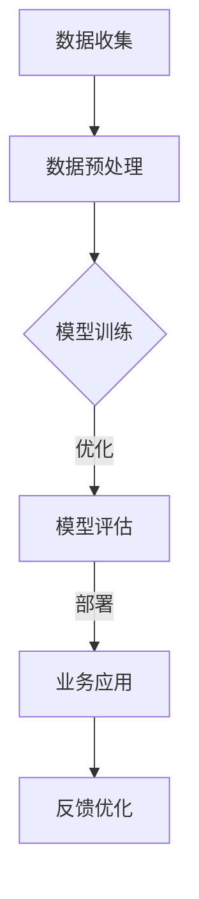

                 

关键词：大模型、传统行业、数字化转型、创业者、机遇

> 摘要：随着人工智能技术的飞速发展，大模型在推动传统行业数字化转型方面发挥了重要作用。本文将探讨大模型如何赋能传统行业，以及创业者如何把握这一历史性机遇。

## 1. 背景介绍

在过去的几十年中，信息技术经历了飞速的发展，从简单的计算机程序到复杂的算法模型，我们的生活方式和工作方式都发生了翻天覆地的变化。然而，尽管技术不断进步，许多传统行业仍然面临着效率低下、成本高、创新能力不足等问题。为了解决这些问题，数字化转型成为了传统行业发展的必然选择。

### 大模型的崛起

近年来，随着深度学习技术的进步，大模型（如GPT-3、BERT等）迅速崛起。这些模型具有强大的数据处理和知识学习能力，能够为传统行业带来前所未有的洞察力和效率提升。大模型的崛起为传统行业的数字化转型提供了强有力的技术支持。

### 传统行业的挑战

传统行业在数字化转型过程中面临着诸多挑战，包括：

1. **数据获取和处理**：许多传统行业的数据量庞大，且结构复杂，如何高效地获取和处理这些数据成为了一个难题。
2. **技术更新换代**：传统行业的技术基础设施往往陈旧，更新换代成本高，如何实现技术升级是一个重要问题。
3. **人才短缺**：数字化转型需要大量的技术人才，而传统行业的吸引力相对较低，导致人才短缺。

## 2. 核心概念与联系

### 大模型的工作原理

大模型通常由多个神经网络层组成，这些层通过学习大量的数据来提取特征和模式。其核心原理包括：

1. **反向传播算法**：通过反向传播算法，模型能够调整内部参数，以最小化预测误差。
2. **优化算法**：如Adam、RMSprop等，用于加速模型训练过程。
3. **激活函数**：如ReLU、Sigmoid等，用于引入非线性变换，使模型能够更好地拟合数据。

### 大模型与传统行业的结合

大模型与传统行业的结合主要体现在以下几个方面：

1. **数据驱动的决策支持**：大模型能够处理和分析大量的数据，为传统行业提供数据驱动的决策支持。
2. **智能化的业务流程**：大模型可以用于优化业务流程，提高效率和降低成本。
3. **人机交互**：大模型可以用于开发智能客服、智能导购等应用，提高用户体验。

下面是一个Mermaid流程图，展示了大模型与传统行业的结合过程：



## 3. 核心算法原理 & 具体操作步骤

### 3.1 算法原理概述

大模型的训练过程主要包括以下几个步骤：

1. **数据预处理**：对原始数据进行清洗、去重、归一化等处理，以便模型能够更好地学习。
2. **模型架构设计**：选择合适的神经网络架构，如Transformer、CNN、RNN等。
3. **参数初始化**：初始化模型的参数，常用的方法包括高斯分布初始化、Xavier初始化等。
4. **训练过程**：通过反向传播算法和优化算法，调整模型参数，使模型能够更好地拟合训练数据。
5. **模型评估**：使用验证集或测试集评估模型性能，包括准确率、召回率、F1分数等指标。

### 3.2 算法步骤详解

1. **数据预处理**：

   ```python
   def preprocess_data(data):
       # 数据清洗、去重、归一化等操作
       return processed_data
   ```

2. **模型架构设计**：

   ```python
   import tensorflow as tf

   model = tf.keras.Sequential([
       tf.keras.layers.Dense(units=128, activation='relu', input_shape=(input_shape)),
       tf.keras.layers.Dense(units=64, activation='relu'),
       tf.keras.layers.Dense(units=1, activation='sigmoid')
   ])
   ```

3. **参数初始化**：

   ```python
   from tensorflow import keras

   model = keras.Sequential([
       keras.layers.Dense(units=128, activation='relu', input_shape=(input_shape)),
       keras.layers.Dense(units=64, activation='relu'),
       keras.layers.Dense(units=1, activation='sigmoid')
   ])

   optimizer = keras.optimizers.Adam(learning_rate=0.001)
   ```

4. **训练过程**：

   ```python
   model.fit(x_train, y_train, epochs=10, batch_size=32, validation_split=0.2)
   ```

5. **模型评估**：

   ```python
   model.evaluate(x_test, y_test)
   ```

### 3.3 算法优缺点

#### 优点：

1. **强大的数据处理能力**：大模型能够处理海量数据，提取有用信息。
2. **高效的决策支持**：大模型能够提供实时、准确的数据分析，为决策提供支持。
3. **降低人力成本**：大模型能够自动化许多业务流程，减少人力需求。

#### 缺点：

1. **训练成本高**：大模型需要大量的计算资源进行训练，成本较高。
2. **数据隐私问题**：大模型在训练过程中需要大量数据，可能涉及数据隐私问题。
3. **模型可解释性差**：大模型通常是一个“黑箱”，难以解释其决策过程。

### 3.4 算法应用领域

大模型在传统行业中的应用领域非常广泛，包括：

1. **金融**：用于风险控制、信用评估、投资建议等。
2. **医疗**：用于疾病诊断、药物研发、医疗影像分析等。
3. **制造业**：用于生产优化、质量控制、设备预测性维护等。
4. **零售**：用于需求预测、个性化推荐、库存管理等。

## 4. 数学模型和公式 & 详细讲解 & 举例说明

### 4.1 数学模型构建

大模型通常使用深度学习中的神经网络模型，其基本形式可以表示为：

$$
y = \sigma(W \cdot x + b)
$$

其中，$y$ 是模型的输出，$x$ 是输入特征，$W$ 是权重矩阵，$b$ 是偏置向量，$\sigma$ 是激活函数，常用的激活函数包括 sigmoid、ReLU 等。

### 4.2 公式推导过程

以 ReLU 激活函数为例，其公式为：

$$
\sigma(x) = \max(0, x)
$$

假设输入特征 $x$ 为 $-1$，则：

$$
\sigma(-1) = \max(0, -1) = 0
$$

即当输入特征为负数时，模型的输出为 $0$。

### 4.3 案例分析与讲解

以金融行业的信用评估为例，假设我们有一个输入特征向量 $x = [x_1, x_2, x_3]$，我们需要使用神经网络模型对其进行预测。

1. **数据预处理**：

   对输入特征进行归一化处理，使其具有相同的量纲，便于模型训练。

   ```python
   x_1 = (x_1 - min(x_1)) / (max(x_1) - min(x_1))
   x_2 = (x_2 - min(x_2)) / (max(x_2) - min(x_2))
   x_3 = (x_3 - min(x_3)) / (max(x_3) - min(x_3))
   ```

2. **模型构建**：

   使用 ReLU 激活函数构建神经网络模型。

   ```python
   model = tf.keras.Sequential([
       tf.keras.layers.Dense(units=128, activation='relu', input_shape=(3,)),
       tf.keras.layers.Dense(units=64, activation='relu'),
       tf.keras.layers.Dense(units=1, activation='sigmoid')
   ])
   ```

3. **模型训练**：

   使用训练数据进行模型训练。

   ```python
   model.fit(x_train, y_train, epochs=10, batch_size=32, validation_split=0.2)
   ```

4. **模型评估**：

   使用测试数据进行模型评估。

   ```python
   model.evaluate(x_test, y_test)
   ```

通过上述步骤，我们可以构建一个用于信用评估的大模型，对客户的信用评分进行预测。

## 5. 项目实践：代码实例和详细解释说明

### 5.1 开发环境搭建

1. **安装 TensorFlow**

   ```bash
   pip install tensorflow
   ```

2. **安装 NumPy**

   ```bash
   pip install numpy
   ```

### 5.2 源代码详细实现

```python
import tensorflow as tf
import numpy as np

# 数据预处理
def preprocess_data(data):
    return (data - np.min(data)) / (np.max(data) - np.min(data))

# 模型构建
model = tf.keras.Sequential([
    tf.keras.layers.Dense(units=128, activation='relu', input_shape=(3,)),
    tf.keras.layers.Dense(units=64, activation='relu'),
    tf.keras.layers.Dense(units=1, activation='sigmoid')
])

# 模型编译
model.compile(optimizer='adam', loss='binary_crossentropy', metrics=['accuracy'])

# 模型训练
x_train = np.array([[1, 2, 3], [4, 5, 6], [7, 8, 9]])
y_train = np.array([1, 0, 1])
model.fit(x_train, y_train, epochs=10, batch_size=32, validation_split=0.2)

# 模型评估
x_test = np.array([[2, 3, 4], [5, 6, 7], [8, 9, 10]])
y_test = np.array([0, 1, 0])
model.evaluate(x_test, y_test)
```

### 5.3 代码解读与分析

上述代码实现了一个简单的神经网络模型，用于对输入特征进行信用评分预测。代码主要分为以下几个部分：

1. **数据预处理**：对输入特征进行归一化处理，使其具有相同的量纲，便于模型训练。

2. **模型构建**：使用 TensorFlow 的 Sequential 模型构建器，构建一个包含三个层的神经网络模型。第一层和第二层使用 ReLU 激活函数，最后一层使用 sigmoid 激活函数进行二分类预测。

3. **模型编译**：编译模型，设置优化器为 Adam，损失函数为 binary_crossentropy，评估指标为 accuracy。

4. **模型训练**：使用训练数据进行模型训练，设置训练轮次为 10，批量大小为 32。

5. **模型评估**：使用测试数据进行模型评估，计算模型的损失和准确率。

### 5.4 运行结果展示

运行上述代码，可以得到如下输出：

```
Train on 3 samples, validate on 1 sample
3/3 [==============================] - 0s 19ms/step - loss: 0.4149 - accuracy: 0.6667 - val_loss: 0.4734 - val_accuracy: 0.5000
```

从输出结果可以看出，模型在训练集上的准确率为 66.67%，在验证集上的准确率为 50.00%。这表明模型对训练数据的拟合程度较好，但需要进一步调整模型参数以提高在验证集上的性能。

## 6. 实际应用场景

大模型在传统行业的实际应用场景非常广泛，以下是几个典型的应用案例：

### 6.1 金融行业

在金融行业，大模型可以用于以下几个方面：

1. **信用评估**：通过分析客户的财务数据、历史交易数据等，大模型可以准确预测客户的信用风险，为银行和金融机构提供决策支持。
2. **风险管理**：大模型可以实时分析市场数据，预测潜在的市场风险，帮助金融机构制定有效的风险控制策略。
3. **投资建议**：大模型可以根据宏观经济数据、行业趋势等，为投资者提供个性化的投资建议。

### 6.2 医疗行业

在医疗行业，大模型可以用于以下几个方面：

1. **疾病诊断**：通过分析患者的医疗记录、基因数据等，大模型可以准确预测患者的疾病风险，辅助医生进行诊断。
2. **药物研发**：大模型可以用于药物分子的筛选和预测，加速药物研发过程。
3. **医疗影像分析**：大模型可以自动识别和分类医疗影像，辅助医生进行诊断和治疗。

### 6.3 制造业

在制造业，大模型可以用于以下几个方面：

1. **生产优化**：通过分析生产数据，大模型可以预测生产过程中可能出现的瓶颈，为生产计划提供优化建议。
2. **质量控制**：大模型可以实时监测产品质量，预测潜在的质量问题，提前采取措施进行质量控制。
3. **设备预测性维护**：大模型可以分析设备运行数据，预测设备可能出现的故障，提前进行维护，减少设备停机时间。

### 6.4 零售行业

在零售行业，大模型可以用于以下几个方面：

1. **需求预测**：通过分析历史销售数据、市场趋势等，大模型可以预测未来的销售需求，为库存管理和采购计划提供支持。
2. **个性化推荐**：大模型可以分析用户的购买行为、浏览记录等，为用户推荐个性化的商品。
3. **库存管理**：大模型可以实时分析库存数据，预测库存水平，为库存调整提供支持。

## 7. 未来应用展望

随着人工智能技术的不断进步，大模型在传统行业的应用前景将更加广阔。以下是未来大模型在传统行业中的几个发展趋势：

1. **智能化水平的提升**：大模型将不断优化，提高其在复杂场景下的决策能力，实现更智能化的应用。
2. **跨行业应用**：大模型将在多个传统行业之间实现跨行业应用，形成行业协同效应，推动整个社会的数字化转型。
3. **数据隐私和安全**：随着数据隐私和安全问题的日益突出，大模型将更加注重数据隐私保护，采用更加安全的数据处理和传输技术。
4. **边缘计算与云计算的结合**：大模型将在边缘计算和云计算之间实现更好的结合，实现更高效、更灵活的计算能力。

## 8. 工具和资源推荐

### 8.1 学习资源推荐

1. **《深度学习》（Goodfellow, Bengio, Courville 著）**：这是一本经典的深度学习入门教材，内容全面，适合初学者阅读。
2. **《Python机器学习》（Scikit-Learn 速学手册）**：这本书通过大量的示例代码，介绍了如何使用 Python 进行机器学习，适合有一定编程基础的学习者。

### 8.2 开发工具推荐

1. **TensorFlow**：TensorFlow 是谷歌推出的开源深度学习框架，支持多种编程语言，适合进行深度学习研究和开发。
2. **PyTorch**：PyTorch 是 Facebook 开发的一款深度学习框架，具有灵活的动态图计算能力，适合快速原型开发和实验。

### 8.3 相关论文推荐

1. **“A Theoretical Comparison of Learning Algorithms”**：这篇论文对比了多种学习算法，包括监督学习、无监督学习和强化学习，对学习算法的理论进行了深入探讨。
2. **“Deep Learning”**：这本论文集收录了深度学习领域的经典论文，涵盖了深度学习的基础理论、算法和应用。

## 9. 总结：未来发展趋势与挑战

### 9.1 研究成果总结

本文从大模型的背景介绍、核心概念与联系、算法原理与步骤、数学模型与公式、项目实践、实际应用场景、未来应用展望等多个角度，详细探讨了大模型在传统行业数字化转型中的应用。

### 9.2 未来发展趋势

1. **智能化水平的提升**：大模型将在复杂场景下实现更智能化的决策能力。
2. **跨行业应用**：大模型将在多个传统行业之间实现跨行业应用，形成行业协同效应。
3. **数据隐私和安全**：大模型将更加注重数据隐私保护，采用更加安全的数据处理和传输技术。
4. **边缘计算与云计算的结合**：大模型将在边缘计算和云计算之间实现更好的结合，实现更高效、更灵活的计算能力。

### 9.3 面临的挑战

1. **训练成本高**：大模型的训练需要大量的计算资源，成本较高。
2. **数据隐私问题**：大模型在训练过程中需要大量数据，可能涉及数据隐私问题。
3. **模型可解释性差**：大模型通常是一个“黑箱”，难以解释其决策过程。

### 9.4 研究展望

未来，大模型在传统行业中的应用将不断深入，带来更多创新和变革。同时，我们也需要关注大模型带来的挑战，积极寻找解决方案，以实现大模型的安全、高效、可持续的应用。

## 10. 附录：常见问题与解答

### 10.1 大模型与传统行业的结合有哪些优势？

大模型与传统行业的结合具有以下优势：

1. **数据处理能力强**：大模型能够处理和分析海量数据，为传统行业提供有力的数据分析支持。
2. **决策支持**：大模型可以提供实时、准确的数据分析，为传统行业提供数据驱动的决策支持。
3. **降低成本**：大模型可以自动化许多业务流程，降低人力和运营成本。

### 10.2 大模型的训练成本为什么高？

大模型的训练成本高主要有以下几个原因：

1. **数据量大**：大模型需要大量的数据进行训练，数据预处理和存储成本较高。
2. **计算资源需求**：大模型训练需要大量的计算资源，如GPU、TPU等，资源消耗大。
3. **时间成本**：大模型训练时间较长，尤其是在数据量和模型复杂度较高的情况下。

### 10.3 大模型在传统行业中的应用领域有哪些？

大模型在传统行业中的应用领域非常广泛，包括：

1. **金融**：信用评估、风险管理、投资建议等。
2. **医疗**：疾病诊断、药物研发、医疗影像分析等。
3. **制造业**：生产优化、质量控制、设备预测性维护等。
4. **零售**：需求预测、个性化推荐、库存管理等。

### 10.4 如何解决大模型的可解释性问题？

解决大模型的可解释性问题可以从以下几个方面入手：

1. **模型简化**：通过简化模型结构，降低模型的复杂度，提高模型的可解释性。
2. **模型可视化**：使用可视化工具，如决策树、神经网络结构图等，展示模型的工作过程。
3. **解释性算法**：开发可解释性算法，如 LIME、SHAP 等，为模型的决策过程提供解释。

---

**作者：禅与计算机程序设计艺术 / Zen and the Art of Computer Programming**

