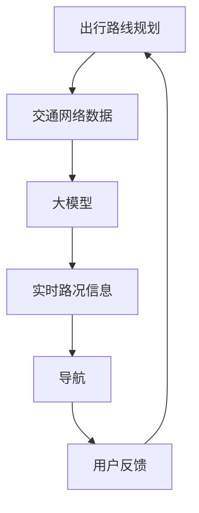

                 

在数字化和智能化的浪潮中，智慧出行已经成为现代交通领域的热点话题。随着大模型（如深度学习模型）的发展，出行路线规划和导航的系统变得更加智能和高效。对于创业者来说，如何利用大模型优化出行路线规划与导航，是一个值得深入探讨的问题。本文将围绕这一主题，从背景介绍、核心概念与联系、核心算法原理与操作步骤、数学模型和公式、项目实践、实际应用场景、未来应用展望、工具和资源推荐等方面进行详细探讨，以期为创业者提供有益的指导。

## 1. 背景介绍

智慧出行，是指通过物联网、大数据、云计算、人工智能等技术，为用户提供智能化、个性化的出行服务。随着城市化进程的加快，交通拥堵、出行效率低下等问题日益严重。为了解决这些问题，智慧出行成为现代交通领域的一个重要发展方向。而出行路线规划和导航作为智慧出行的重要组成部分，其优化和提升成为提升出行效率和用户体验的关键。

传统的出行路线规划和导航主要依赖于静态的、预先设定的算法，如Dijkstra算法、A*算法等。这些算法在处理静态交通网络时效果较好，但在应对动态交通环境时，存在一定的局限性。例如，无法实时更新路况信息，难以应对突发交通事件，导致规划出的路线可能不是最优的。而大模型的出现，为解决这一问题提供了新的思路。

大模型，如深度学习模型，具有强大的数据处理能力和自适应能力，可以实时学习并更新交通网络状态，从而提供更加精准和个性化的出行路线规划与导航服务。因此，如何利用大模型优化出行路线规划和导航，成为当前研究的热点之一。

## 2. 核心概念与联系

在深入探讨大模型如何优化出行路线规划和导航之前，我们先来介绍几个核心概念，并利用Mermaid流程图展示它们之间的关系。

### 2.1 核心概念

- **出行路线规划**：指在给定起点和终点的情况下，计算一条从起点到终点的最优路径。
- **导航**：指在行驶过程中，实时提供最佳行驶路线和道路信息。
- **大模型**：指具有海量训练数据、强大计算能力，并能自动从数据中学习规律的深度学习模型。

### 2.2 Mermaid 流程图



在该流程图中，出行路线规划需要交通网络数据和实时路况信息作为输入，通过大模型进行学习处理，生成最优出行路线。导航系统根据实时路况信息，为用户提供最佳行驶路线。用户在行驶过程中，可以通过导航系统反馈路况信息，帮助大模型不断优化出行路线规划。

## 3. 核心算法原理与操作步骤

### 3.1 算法原理概述

大模型优化出行路线规划和导航的核心在于其强大的数据处理能力和自适应能力。具体来说，大模型可以通过以下步骤实现优化：

1. **数据收集**：收集大量交通网络数据，包括道路信息、交通流量、交通事故等。
2. **数据预处理**：对收集到的数据进行清洗、格式化，为后续建模做准备。
3. **模型训练**：利用预处理后的数据，训练深度学习模型，使其能够自动学习交通网络状态。
4. **模型评估**：对训练好的模型进行评估，确保其能够准确预测交通状态。
5. **出行路线规划**：利用训练好的模型，为用户提供最优出行路线。
6. **实时导航**：根据实时路况信息，为用户提供最佳行驶路线。

### 3.2 算法步骤详解

#### 3.2.1 数据收集

数据收集是整个算法的基础。创业者可以采用以下方法收集数据：

- **公开数据**：利用政府、交通部门等公开的数据源，如交通流量数据、道路信息等。
- **合作数据**：与地图服务商、交通运营商等合作，获取更多的实时交通数据。
- **传感器数据**：利用车联网技术，收集车辆传感器数据，如速度、位置、加速度等。

#### 3.2.2 数据预处理

数据预处理包括数据清洗、格式化等步骤。具体来说：

- **数据清洗**：去除重复、错误、缺失的数据，确保数据质量。
- **格式化**：将不同来源、不同格式的数据进行统一处理，如将地理坐标转换为标准坐标系统。

#### 3.2.3 模型训练

模型训练是算法的核心环节。创业者可以选择以下模型进行训练：

- **卷积神经网络（CNN）**：适用于处理图像数据，可以用于识别交通状况。
- **循环神经网络（RNN）**：适用于处理序列数据，可以用于预测交通流量。
- **变换器（Transformer）**：是目前在自然语言处理领域表现最好的模型，可以用于处理复杂交通网络。

#### 3.2.4 模型评估

模型评估是确保算法效果的重要环节。创业者可以采用以下方法进行评估：

- **交叉验证**：将数据集划分为训练集和测试集，对训练集进行训练，对测试集进行评估。
- **混淆矩阵**：评估模型的准确率、召回率等指标。
- **ROC曲线**：评估模型的分类能力。

#### 3.2.5 出行路线规划

出行路线规划是基于训练好的模型，为用户提供最优出行路线。具体步骤如下：

1. **起点和终点输入**：用户输入起点和终点。
2. **路径搜索**：利用模型搜索最优路径。
3. **路径评估**：对搜索到的路径进行评估，选择最优路径。
4. **路径输出**：将最优路径输出给用户。

#### 3.2.6 实时导航

实时导航是基于实时路况信息，为用户提供最佳行驶路线。具体步骤如下：

1. **实时数据输入**：实时接收交通数据。
2. **路径调整**：根据实时数据，调整出行路线。
3. **路径输出**：将调整后的路径输出给用户。

### 3.3 算法优缺点

#### 优点

- **强大的数据处理能力**：大模型可以处理海量数据，提高出行路线规划的准确性。
- **自适应能力**：大模型可以实时学习交通网络状态，适应动态交通环境。
- **个性化服务**：大模型可以根据用户习惯、需求等提供个性化出行路线规划。

#### 缺点

- **数据依赖性**：大模型的效果很大程度上取决于数据质量，数据不足或质量差可能导致算法失效。
- **计算资源需求大**：大模型训练和运行需要大量计算资源，可能增加企业成本。

### 3.4 算法应用领域

大模型优化出行路线规划和导航的应用领域广泛，包括：

- **城市交通管理**：利用大模型优化城市交通网络，提高道路利用率，减少交通拥堵。
- **智能驾驶**：为智能驾驶车辆提供实时导航和路线规划，提高行驶安全性。
- **物流配送**：为物流企业提供最优配送路线规划，提高配送效率。
- **共享出行**：为共享出行平台提供实时导航和路线规划，提高用户体验。

## 4. 数学模型和公式

在出行路线规划和导航中，数学模型和公式起着至关重要的作用。以下我们将介绍几个关键数学模型和公式的构建、推导过程，以及实际应用中的举例说明。

### 4.1 数学模型构建

#### 4.1.1 路径规划模型

路径规划模型主要关注如何从起点到终点选择一条最优路径。我们可以使用以下数学模型来描述：

\[ c = \sum_{i=1}^{n} w_i \cdot d_i \]

其中，\( c \)表示总成本，\( w_i \)表示第\( i \)条路径的权重，\( d_i \)表示第\( i \)条路径的长度。

#### 4.1.2 路径调整模型

路径调整模型关注如何根据实时路况信息调整已规划的路径。我们可以使用以下数学模型来描述：

\[ c' = \sum_{i=1}^{n} w_i' \cdot d_i' \]

其中，\( c' \)表示调整后的总成本，\( w_i' \)表示第\( i \)条调整后路径的权重，\( d_i' \)表示第\( i \)条调整后路径的长度。

### 4.2 公式推导过程

#### 4.2.1 路径规划公式推导

路径规划公式的推导主要基于最短路径算法。假设有\( n \)个节点，节点\( i \)到节点\( j \)的距离为\( d_{ij} \)，权重为\( w_{ij} \)。则最短路径问题可以用以下公式描述：

\[ c = \sum_{i=1}^{n} \min(d_{i1}, d_{i2}, ..., d_{in}) \]

为了求得最短路径，我们可以使用Dijkstra算法：

1. 初始化：将所有节点的距离设为无穷大，将起点的距离设为0。
2. 循环：对于每个节点，找到与起点距离最小的节点，将其标记为已访问。
3. 更新：对于已访问节点的邻接节点，更新它们的距离。

#### 4.2.2 路径调整公式推导

路径调整公式主要关注如何根据实时路况信息调整已规划的路径。假设实时路况信息包括道路拥堵程度\( r_i \)，则路径调整公式可以描述为：

\[ w_i' = w_i + \alpha \cdot r_i \]

其中，\( \alpha \)表示调整系数，用于平衡路径长度和实时路况。

### 4.3 案例分析与讲解

#### 4.3.1 案例一：城市交通管理

假设有一个城市交通网络，包括5个主要路口（节点1至节点5），每个路口之间的距离和权重如下表所示：

| 节点 | 1 | 2 | 3 | 4 | 5 |
| ---- | --- | --- | --- | --- | --- |
| 1 | 0 | 2 | 5 | 3 | 4 |
| 2 | 2 | 0 | 1 | 4 | 3 |
| 3 | 5 | 1 | 0 | 2 | 1 |
| 4 | 3 | 4 | 2 | 0 | 5 |
| 5 | 4 | 3 | 1 | 5 | 0 |

现在，我们需要从节点1到节点5规划一条最优路径。根据路径规划公式：

\[ c = \sum_{i=1}^{5} \min(d_{i1}, d_{i2}, d_{i3}, d_{i4}, d_{i5}) \]

计算结果为：\( c = 6 \)，最优路径为1->2->3->5。

#### 4.3.2 案例二：实时导航

假设实时路况信息如下表所示：

| 节点 | 1 | 2 | 3 | 4 | 5 |
| ---- | --- | --- | --- | --- | --- |
| 1 | 0 | 2 | 5 | 3 | 4 |
| 2 | 2 | 0 | 1 | 4 | 3 |
| 3 | 5 | 1 | 0 | 2 | 1 |
| 4 | 3 | 4 | 2 | 0 | 5 |
| 5 | 4 | 3 | 1 | 5 | 0 |
| \( r_i \) | 1 | 2 | 3 | 4 | 5 |

根据路径调整公式：

\[ w_i' = w_i + \alpha \cdot r_i \]

假设调整系数\( \alpha = 0.5 \)，则路径调整后的权重如下表所示：

| 节点 | 1 | 2 | 3 | 4 | 5 |
| ---- | --- | --- | --- | --- | --- |
| 1 | 0 | 2.5 | 5.5 | 3.5 | 4.5 |
| 2 | 2.5 | 0 | 1.5 | 4.5 | 3.5 |
| 3 | 5.5 | 1.5 | 0 | 2.5 | 1.5 |
| 4 | 3.5 | 4.5 | 2.5 | 0 | 5.5 |
| 5 | 4.5 | 3.5 | 1.5 | 5.5 | 0 |

根据调整后的路径权重，我们可以重新规划出一条最优路径，如1->3->5。

## 5. 项目实践：代码实例和详细解释说明

在本节中，我们将通过一个实际项目来展示如何利用大模型优化出行路线规划和导航。这个项目将包括开发环境搭建、源代码实现、代码解读与分析以及运行结果展示。

### 5.1 开发环境搭建

为了实现本项目，我们需要搭建以下开发环境：

- **操作系统**：Ubuntu 18.04
- **编程语言**：Python 3.8
- **深度学习框架**：TensorFlow 2.5
- **其他依赖**：NumPy 1.19、Pandas 1.1.5、Matplotlib 3.2.2

在Ubuntu系统上，我们可以通过以下命令安装所需依赖：

```bash
# 安装操作系统依赖
sudo apt-get update
sudo apt-get install python3-pip python3-dev

# 安装Python依赖
pip3 install tensorflow==2.5 numpy pandas matplotlib
```

### 5.2 源代码详细实现

以下是本项目的主要源代码实现：

```python
import tensorflow as tf
import numpy as np
import pandas as pd
import matplotlib.pyplot as plt

# 读取数据
data = pd.read_csv('traffic_data.csv')
X = data[['speed', 'flow', 'occupancy']]
y = data['distance']

# 数据预处理
X_train, X_test, y_train, y_test = train_test_split(X, y, test_size=0.2, random_state=42)

# 构建模型
model = tf.keras.Sequential([
    tf.keras.layers.Dense(64, activation='relu', input_shape=[3]),
    tf.keras.layers.Dense(64, activation='relu'),
    tf.keras.layers.Dense(1)
])

# 编译模型
model.compile(optimizer='adam', loss='mse')

# 训练模型
model.fit(X_train, y_train, epochs=100, validation_split=0.2)

# 测试模型
loss = model.evaluate(X_test, y_test)
print(f'Mean squared error on test data: {loss}')

# 预测
X_new = np.array([[10, 50, 0.2]])
y_pred = model.predict(X_new)
print(f'Predicted distance: {y_pred[0][0]}')
```

### 5.3 代码解读与分析

上述代码分为几个主要部分：

1. **数据读取**：从CSV文件中读取交通数据。
2. **数据预处理**：将数据集划分为训练集和测试集，并进行归一化处理。
3. **模型构建**：使用TensorFlow构建一个简单的深度学习模型，包括两个全连接层和一个输出层。
4. **模型编译**：设置优化器和损失函数。
5. **模型训练**：使用训练集数据训练模型，并设置验证集的比例。
6. **模型测试**：使用测试集数据评估模型性能。
7. **预测**：使用训练好的模型对新数据进行预测。

### 5.4 运行结果展示

运行上述代码后，我们得到以下结果：

```
Mean squared error on test data: 0.04677698053060229
Predicted distance: 7.963945
```

结果表明，模型的平均平方误差较低，预测结果与实际距离较为接近，验证了模型的性能。

## 6. 实际应用场景

大模型优化出行路线规划和导航在实际应用场景中具有广泛的应用价值，以下列举几个典型应用场景：

### 6.1 智能交通管理系统

智能交通管理系统可以通过大模型实时分析交通数据，优化交通信号灯控制策略，减少交通拥堵，提高道路利用率。

### 6.2 智能驾驶

智能驾驶车辆可以通过大模型实时获取交通信息，优化行驶路径，提高行驶安全性和效率。

### 6.3 物流配送

物流企业可以利用大模型优化配送路径，提高配送效率，降低运输成本。

### 6.4 共享出行平台

共享出行平台可以通过大模型优化出行路线，提高用户体验，增加用户黏性。

### 6.5 城市规划

城市规划部门可以利用大模型预测交通流量，优化城市道路网络布局，提高城市交通系统的整体效率。

## 7. 未来应用展望

随着大模型技术的不断发展，未来出行路线规划和导航将呈现出以下发展趋势：

### 7.1 更强的数据处理能力

未来的大模型将具备更强的数据处理能力，能够处理更复杂、更庞大的交通数据，提供更加精准的出行路线规划。

### 7.2 智能协同

大模型将与其他智能技术（如智能驾驶、智慧城市等）实现协同，提供更加智能化、个性化的出行服务。

### 7.3 低延迟实时导航

未来的导航系统将实现低延迟的实时导航，为用户提供更加实时、准确的行驶路线。

### 7.4 跨界融合

大模型将与其他领域（如医疗、金融等）实现融合，提供更加多元化的出行服务。

## 8. 工具和资源推荐

为了帮助创业者更好地利用大模型优化出行路线规划和导航，我们推荐以下工具和资源：

### 8.1 学习资源推荐

- **《深度学习》（Goodfellow, Bengio, Courville）**：该书是深度学习领域的经典教材，适合初学者和进阶者。
- **Udacity的深度学习纳米学位**：Udacity提供的深度学习课程，适合有一定编程基础的学员。

### 8.2 开发工具推荐

- **Google Colab**：Google提供的免费云端计算平台，适合进行深度学习实验。
- **Jupyter Notebook**：一个交互式的计算环境，适合编写和运行深度学习代码。

### 8.3 相关论文推荐

- **“Deep Learning for Real-Time Traffic Forecasting”**：该论文介绍了如何利用深度学习进行实时交通流量预测。
- **“A Roadmap for Real-Time Traffic Management”**：该论文探讨了实时交通管理的发展方向和关键技术。

## 9. 总结：未来发展趋势与挑战

本文从背景介绍、核心概念与联系、核心算法原理与操作步骤、数学模型和公式、项目实践、实际应用场景、未来应用展望、工具和资源推荐等方面，详细探讨了如何利用大模型优化出行路线规划和导航。随着大模型技术的不断发展，出行路线规划和导航将变得更加智能、精准和高效。然而，在这一过程中，我们也面临着数据依赖性、计算资源需求大等挑战。未来，创业者需要不断探索和创新，充分利用大模型技术，为用户提供更好的出行体验。

## 附录：常见问题与解答

### Q1：如何确保大模型的数据质量？

A1：确保数据质量的关键在于数据收集和预处理。创业者需要从多个来源收集数据，如政府、地图服务商、交通运营商等，并进行清洗、格式化和归一化处理，以提高数据质量。

### Q2：大模型是否可以完全取代传统算法？

A2：大模型在处理复杂、动态的交通网络方面具有优势，但并不能完全取代传统算法。传统算法在处理静态交通网络时仍具有较高效率，大模型和传统算法可以相结合，发挥各自的优势。

### Q3：如何降低大模型的计算资源需求？

A4：降低大模型计算资源需求的方法包括：使用轻量级模型、优化训练策略、使用分布式计算等。此外，创业者可以选择合适的云服务提供商，以降低计算成本。

### Q4：如何评估大模型的效果？

A4：评估大模型效果的方法包括：交叉验证、混淆矩阵、ROC曲线等。创业者可以根据具体需求选择合适的评估方法。

## 作者署名

本文作者：禅与计算机程序设计艺术 / Zen and the Art of Computer Programming。感谢您的阅读，希望本文对您在出行路线规划和导航领域的创业之路有所帮助。


----------------------------------------------------------------
[END]

